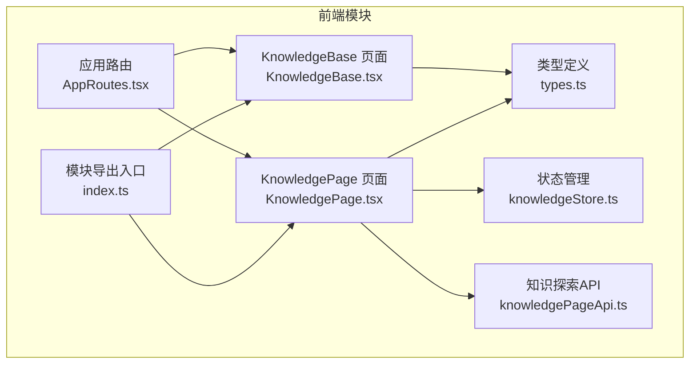
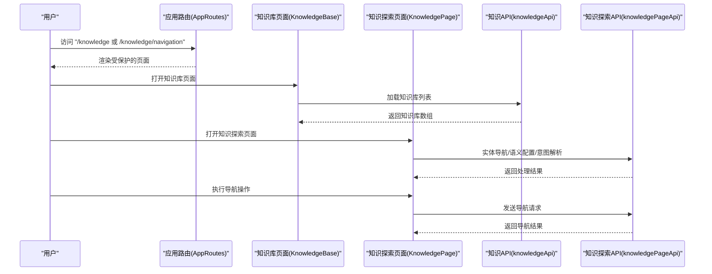
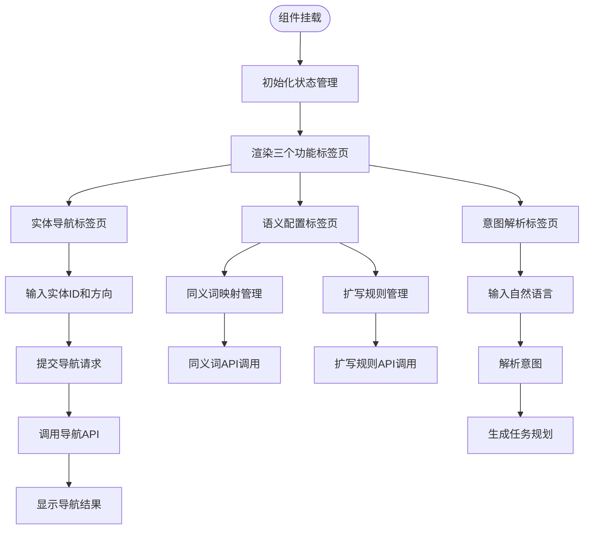
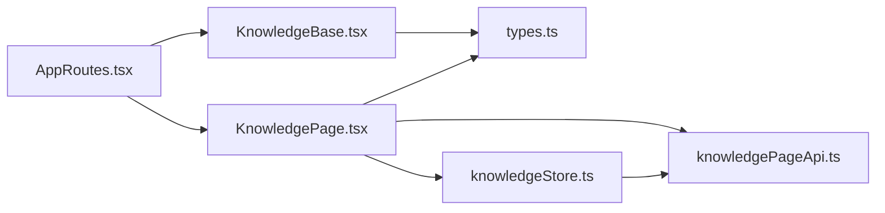

# Knowledge模块

<cite>
**本文引用的文件**
- [KnowledgeBase.tsx](file://frontend/src/modules/knowledge/pages/KnowledgeBase.tsx)
- [KnowledgePage.tsx](file://frontend/src/modules/knowledge/pages/KnowledgePage.tsx)
- [types.ts](file://frontend/src/modules/knowledge/types.ts)
- [index.ts](file://frontend/src/modules/knowledge/index.ts)
- [knowledgePageApi.ts](file://frontend/src/modules/knowledge/services/knowledgePageApi.ts)
- [knowledgeStore.ts](file://frontend/src/modules/knowledge/stores/knowledgeStore.ts)
- [AppRoutes.tsx](file://frontend/src/AppRoutes.tsx)
</cite>

## 更新摘要
**所做更改**
- 新增知识探索模块和KnowledgePage页面的完整文档
- 添加实体导航功能的技术实现细节
- 补充语义配置和意图解析功能说明
- 更新路由配置和模块导出结构
- 增强知识API设计与实现的详细说明

## 目录
1. [简介](#简介)
2. [项目结构](#项目结构)
3. [核心组件](#核心组件)
4. [架构总览](#架构总览)
5. [详细组件分析](#详细组件分析)
6. [知识探索模块](#知识探索模块)
7. [实体导航功能](#实体导航功能)
8. [语义配置与意图解析](#语义配置与意图解析)
9. [依赖关系分析](#依赖关系分析)
10. [性能考虑](#性能考虑)
11. [故障排查指南](#故障排查指南)
12. [结论](#结论)
13. [附录](#附录)

## 简介
本文件面向Knowledge模块的前端实现，聚焦知识库页面的功能与交互设计，现已扩展至包含知识探索模块、实体导航、语义配置和意图解析等高级功能。涵盖以下方面：
- 知识库页面的实现：知识库列表、进入知识库后的分类树与文档列表、文档详情抽屉等。
- 知识探索模块：提供实体导航、语义配置、意图解析等高级功能。
- 知识条目的展示方式：按类型区分的图标、关键词标签、状态徽章、进度条等。
- 搜索功能：基于名称与描述的本地过滤。
- 分类管理：左侧分类树的展示与选择，以及分类维度下的文档筛选。
- 知识API设计与实现要点：通过知识API进行知识库、分类、文档的增删改查；文档上传与图谱构建流程。
- 组件数据加载与渲染逻辑：组件状态管理、异步加载、错误提示与进度模拟。
- 用户界面设计与导航结构：Ant Design组件体系、路由集成与页面布局。
- 实际示例与实现参考：通过源码路径定位具体实现位置，便于快速查阅。

## 项目结构
Knowledge模块位于前端工程的模块化目录下，现已扩展包含知识库页面和知识探索页面。主要由页面、类型定义、API服务、状态管理和导出入口组成。页面组件负责UI交互与数据流编排，类型定义用于前后端契约与TS类型约束。

**图表来源**
- [KnowledgeBase.tsx:1-584](file://frontend/src/modules/knowledge/pages/KnowledgeBase.tsx#L1-L584)
- [KnowledgePage.tsx:1-219](file://frontend/src/modules/knowledge/pages/KnowledgePage.tsx#L1-L219)
- [types.ts:1-87](file://frontend/src/modules/knowledge/types.ts#L1-L87)
- [knowledgePageApi.ts:1-88](file://frontend/src/modules/knowledge/services/knowledgePageApi.ts#L1-L88)
- [knowledgeStore.ts:1-124](file://frontend/src/modules/knowledge/stores/knowledgeStore.ts#L1-L124)
- [index.ts:1-3](file://frontend/src/modules/knowledge/index.ts#L1-L3)
- [AppRoutes.tsx:1-70](file://frontend/src/AppRoutes.tsx#L1-L70)

**章节来源**
- [KnowledgeBase.tsx:1-584](file://frontend/src/modules/knowledge/pages/KnowledgeBase.tsx#L1-L584)
- [KnowledgePage.tsx:1-219](file://frontend/src/modules/knowledge/pages/KnowledgePage.tsx#L1-L219)
- [types.ts:1-87](file://frontend/src/modules/knowledge/types.ts#L1-L87)
- [knowledgePageApi.ts:1-88](file://frontend/src/modules/knowledge/services/knowledgePageApi.ts#L1-L88)
- [knowledgeStore.ts:1-124](file://frontend/src/modules/knowledge/stores/knowledgeStore.ts#L1-L124)
- [index.ts:1-3](file://frontend/src/modules/knowledge/index.ts#L1-L3)
- [AppRoutes.tsx:1-70](file://frontend/src/AppRoutes.tsx#L1-L70)

## 核心组件
- 知识库页面组件：负责知识库列表展示、搜索、新增/编辑/删除知识库；进入知识库后展示分类树与文档列表，并支持文档详情抽屉、上传与图谱构建。
- 知识探索页面组件：提供实体导航、语义配置、意图解析等高级功能，支持同义词映射、扩写规则配置和任务规划。
- 类型定义：定义知识库、分类、文档、表单数据、上传数据、图谱构建请求、RAG查询请求与结果等接口，确保前后端契约一致。
- 状态管理：使用Zustand管理知识探索页面的状态，包括导航结果、同义词映射、扩写规则等。
- API服务：提供知识探索相关的API调用封装，包括实体导航、语义配置、意图解析等功能。
- 模块导出：对外暴露知识库页面和知识探索页面组件，供路由与上层模块使用。
- 应用路由：在全局路由中注册知识库页面和知识探索页面路由，受登录态保护。

关键职责与行为：
- 数据加载：首次挂载时加载知识库列表；进入知识库后加载分类与文档。
- 搜索：对知识库列表进行本地过滤。
- 上传：支持文件、在线文档、纯文本、网页抓取四种内容类型。
- 图谱构建：启动后显示进度条，完成后刷新文档列表。
- 实体导航：支持出向、入向、双向三种导航方向，显示导航路径和相关实体。
- 语义配置：支持同义词映射和扩写规则的添加、查询和管理。
- 意图解析：将自然语言转换为结构化的查询意图，支持任务规划。
- 错误处理：统一使用消息提示反馈操作结果。

**章节来源**
- [KnowledgeBase.tsx:28-584](file://frontend/src/modules/knowledge/pages/KnowledgeBase.tsx#L28-L584)
- [KnowledgePage.tsx:10-219](file://frontend/src/modules/knowledge/pages/KnowledgePage.tsx#L10-L219)
- [types.ts:1-87](file://frontend/src/modules/knowledge/types.ts#L1-L87)
- [knowledgeStore.ts:21-124](file://frontend/src/modules/knowledge/stores/knowledgeStore.ts#L21-L124)
- [knowledgePageApi.ts:3-88](file://frontend/src/modules/knowledge/services/knowledgePageApi.ts#L3-L88)
- [index.ts:1-3](file://frontend/src/modules/knowledge/index.ts#L1-L3)
- [AppRoutes.tsx:53-54](file://frontend/src/AppRoutes.tsx#L53-L54)

## 架构总览
从路由到页面再到API调用的整体流程如下：

**图表来源**
- [AppRoutes.tsx:53-54](file://frontend/src/AppRoutes.tsx#L53-L54)
- [KnowledgeBase.tsx:48-80](file://frontend/src/modules/knowledge/pages/KnowledgeBase.tsx#L48-L80)
- [KnowledgePage.tsx:37-43](file://frontend/src/modules/knowledge/pages/KnowledgePage.tsx#L37-L43)
- [knowledgePageApi.ts:4-5](file://frontend/src/modules/knowledge/services/knowledgePageApi.ts#L4-L5)

## 详细组件分析

### 知识库页面组件（KnowledgeBase）
该组件承担了知识库页面的所有交互逻辑与数据流控制，包含以下关键能力：
- 视图模式切换：列表视图与详情视图（分类树+文档列表）。
- 知识库管理：创建、编辑、删除知识库；支持表单校验与消息提示。
- 搜索：基于名称与描述的本地过滤。
- 分类管理：左侧分类树展示，支持选择分类以筛选文档。
- 文档管理：上传（文件/在线文档/纯文本/网页抓取）、查看详情、删除、触发图谱构建。
- 进度模拟：图谱构建过程中显示进度条，完成后刷新文档列表。
- 错误处理：统一的消息提示，避免阻断用户操作。

**图表来源**
- [KnowledgeBase.tsx:48-80](file://frontend/src/modules/knowledge/pages/KnowledgeBase.tsx#L48-L80)
- [KnowledgeBase.tsx:120-125](file://frontend/src/modules/knowledge/pages/KnowledgeBase.tsx#L120-L125)
- [KnowledgeBase.tsx:134-155](file://frontend/src/modules/knowledge/pages/KnowledgeBase.tsx#L134-L155)
- [KnowledgeBase.tsx:157-183](file://frontend/src/modules/knowledge/pages/KnowledgeBase.tsx#L157-L183)
- [KnowledgeBase.tsx:185-188](file://frontend/src/modules/knowledge/pages/KnowledgeBase.tsx#L185-L188)

**章节来源**
- [KnowledgeBase.tsx:28-584](file://frontend/src/modules/knowledge/pages/KnowledgeBase.tsx#L28-L584)

### 知识探索页面组件（KnowledgePage）
该组件提供高级知识探索功能，包含实体导航、语义配置和意图解析三大核心功能模块：
- 实体导航：支持输入实体ID和选择导航方向（出向、入向、双向），显示导航路径和相关实体。
- 语义配置：提供同义词映射和扩写规则的管理界面，支持添加、查询和刷新操作。
- 意图解析：将自然语言转换为结构化的查询意图，支持任务规划和执行。

**图表来源**
- [KnowledgePage.tsx:10-25](file://frontend/src/modules/knowledge/pages/KnowledgePage.tsx#L10-L25)
- [KnowledgePage.tsx:108-143](file://frontend/src/modules/knowledge/pages/KnowledgePage.tsx#L108-L143)
- [KnowledgePage.tsx:191-212](file://frontend/src/modules/knowledge/pages/KnowledgePage.tsx#L191-L212)
- [KnowledgePage.tsx:145-189](file://frontend/src/modules/knowledge/pages/KnowledgePage.tsx#L145-L189)

**章节来源**
- [KnowledgePage.tsx:10-219](file://frontend/src/modules/knowledge/pages/KnowledgePage.tsx#L10-L219)

## 知识探索模块

### 实体导航功能
实体导航是知识探索模块的核心功能，允许用户通过指定实体ID进行知识图谱的探索式导航。支持三种导航方向：
- 出向导航：沿着实体的关系向外扩展
- 入向导航：沿着实体的关系向内回溯  
- 双向导航：同时支持出向和入向扩展

导航结果显示包括实体ID、导航路径和相关实体数量等信息。

**章节来源**
- [KnowledgePage.tsx:37-43](file://frontend/src/modules/knowledge/pages/KnowledgePage.tsx#L37-L43)
- [KnowledgePage.tsx:127-141](file://frontend/src/modules/knowledge/pages/KnowledgePage.tsx#L127-L141)
- [knowledgePageApi.ts:4-5](file://frontend/src/modules/knowledge/services/knowledgePageApi.ts#L4-L5)
- [knowledgeStore.ts:50-58](file://frontend/src/modules/knowledge/stores/knowledgeStore.ts#L50-L58)

### 语义配置功能
语义配置模块提供两个重要的语义增强功能：

#### 同义词映射
支持将规范词与多个同义词建立映射关系，用于查询时的语义扩展。界面提供输入框用于添加新的同义词映射，并支持刷新显示当前所有映射关系。

#### 扩写规则
支持定义模式到扩写的规则映射，用于在查询时自动扩展相关概念。规则包括模式（pattern）和扩写集合（expansion）两部分。

**章节来源**
- [KnowledgePage.tsx:191-212](file://frontend/src/modules/knowledge/pages/KnowledgePage.tsx#L191-L212)
- [KnowledgePage.tsx:67-87](file://frontend/src/modules/knowledge/pages/KnowledgePage.tsx#L67-L87)
- [knowledgePageApi.ts:22-32](file://frontend/src/modules/knowledge/services/knowledgePageApi.ts#L22-L32)
- [knowledgeStore.ts:60-96](file://frontend/src/modules/knowledge/stores/knowledgeStore.ts#L60-L96)

### 意图解析功能
意图解析模块将自然语言转换为结构化的查询意图，支持以下功能：
- 自然语言输入：用户输入查询语句
- 意图解析：识别查询意图类型和置信度
- 实体提取：从查询中抽取相关实体
- 任务规划：根据解析结果生成执行步骤

**章节来源**
- [KnowledgePage.tsx:45-65](file://frontend/src/modules/knowledge/pages/KnowledgePage.tsx#L45-L65)
- [KnowledgePage.tsx:154-188](file://frontend/src/modules/knowledge/pages/KnowledgePage.tsx#L154-L188)
- [knowledgePageApi.ts:16-20](file://frontend/src/modules/knowledge/services/knowledgePageApi.ts#L16-L20)
- [knowledgeStore.ts:98-120](file://frontend/src/modules/knowledge/stores/knowledgeStore.ts#L98-L120)

## 依赖关系分析
- 路由依赖：页面组件通过路由注册被访问，受登录态保护。新增知识探索页面路由"/knowledge/navigation"。
- 组件依赖：页面组件依赖Ant Design组件库与图标库；依赖知识API和知识探索API进行数据交互。
- 状态管理依赖：知识探索页面使用Zustand状态管理库，管理导航结果、同义词映射、扩写规则等状态。
- 类型依赖：页面组件与API之间通过types.ts中的接口进行契约约束，确保字段与枚举值一致。
- 内部模块依赖：模块导出同时暴露知识库页面和知识探索页面组件，供上层模块使用。

**图表来源**
- [AppRoutes.tsx:17-17](file://frontend/src/AppRoutes.tsx#L17-L17)
- [AppRoutes.tsx:54-54](file://frontend/src/AppRoutes.tsx#L54-L54)
- [index.ts:1-3](file://frontend/src/modules/knowledge/index.ts#L1-L3)
- [knowledgeStore.ts:1-2](file://frontend/src/modules/knowledge/stores/knowledgeStore.ts#L1-L2)
- [knowledgePageApi.ts:1-1](file://frontend/src/modules/knowledge/services/knowledgePageApi.ts#L1-L1)

**章节来源**
- [AppRoutes.tsx:1-70](file://frontend/src/AppRoutes.tsx#L1-L70)
- [index.ts:1-3](file://frontend/src/modules/knowledge/index.ts#L1-L3)
- [knowledgeStore.ts:1-124](file://frontend/src/modules/knowledge/stores/knowledgeStore.ts#L1-L124)
- [knowledgePageApi.ts:1-88](file://frontend/src/modules/knowledge/services/knowledgePageApi.ts#L1-L88)

## 性能考虑
- 列表渲染：表格分页（每页10条）降低初始渲染压力。
- 本地搜索：基于内存数组过滤，适合中小规模数据集；若数据量增大，建议后端分页与搜索。
- 图谱构建进度：使用定时器模拟进度，避免频繁网络请求；完成后一次性刷新文档列表。
- 上传优化：文件上传前仅保存引用，避免大对象在状态中传递；上传成功后再刷新列表。
- 错误处理：统一消息提示，减少重试风暴；必要时增加防抖与节流。
- 状态管理优化：使用Zustand替代复杂的状态管理方案，减少不必要的重渲染。
- API调用优化：合理使用loading状态和错误处理，避免重复请求。

## 故障排查指南
- 无法加载知识库列表：检查API返回与网络状态；确认消息提示是否出现错误信息。
- 上传失败：检查上传表单字段、文件大小限制与后端接口；确认上传成功后再刷新列表。
- 图谱构建无响应：确认构建任务已启动；检查进度条更新逻辑与定时器清理。
- 删除失败：确认删除确认弹窗与后端权限；检查消息提示与列表刷新。
- 分类树不显示：确认分类数据结构与树形渲染逻辑；检查默认展开与选中状态。
- 实体导航失败：检查实体ID格式和导航方向参数；确认API响应格式正确。
- 语义配置异常：检查同义词和扩写规则的格式要求；确认API调用成功。
- 意图解析错误：检查自然语言输入格式；确认解析结果的结构完整性。

**章节来源**
- [KnowledgeBase.tsx:52-62](file://frontend/src/modules/knowledge/pages/KnowledgeBase.tsx#L52-L62)
- [KnowledgeBase.tsx:134-155](file://frontend/src/modules/knowledge/pages/KnowledgeBase.tsx#L134-L155)
- [KnowledgeBase.tsx:157-183](file://frontend/src/modules/knowledge/pages/KnowledgeBase.tsx#L157-L183)
- [KnowledgeBase.tsx:190-199](file://frontend/src/modules/knowledge/pages/KnowledgeBase.tsx#L190-L199)
- [KnowledgePage.tsx:37-43](file://frontend/src/modules/knowledge/pages/KnowledgePage.tsx#L37-L43)
- [KnowledgePage.tsx:67-87](file://frontend/src/modules/knowledge/pages/KnowledgePage.tsx#L67-L87)
- [KnowledgePage.tsx:45-65](file://frontend/src/modules/knowledge/pages/KnowledgePage.tsx#L45-L65)

## 结论
Knowledge模块的前端实现现已扩展为包含基础知识管理和高级知识探索的完整解决方案。通过清晰的视图模式、完善的分类与文档管理、直观的上传与图谱构建流程，以及新增的实体导航、语义配置和意图解析功能，提供了从基础知识管理到高级智能探索的全栈能力。

类型定义确保了前后端契约的一致性，路由与组件的解耦提升了可维护性。状态管理采用现代化的Zustand方案，简化了复杂状态的管理。API服务封装了丰富的语义处理能力，为上层应用提供了强大的知识探索支撑。

后续可在大数据场景下引入后端搜索与分页、优化上传与构建流程的并发控制、增强错误恢复与日志追踪能力，并进一步扩展语义配置的智能化程度。

## 附录
- 实际展示示例与实现参考：
  - 知识库列表视图与搜索：[KnowledgeBase.tsx:214-325](file://frontend/src/modules/knowledge/pages/KnowledgeBase.tsx#L214-L325)
  - 知识库详情视图与分类树：[KnowledgeBase.tsx:327-466](file://frontend/src/modules/knowledge/pages/KnowledgeBase.tsx#L327-L466)
  - 文档上传与图谱构建：[KnowledgeBase.tsx:127-155](file://frontend/src/modules/knowledge/pages/KnowledgeBase.tsx#L127-L155), [KnowledgeBase.tsx:157-183](file://frontend/src/modules/knowledge/pages/KnowledgeBase.tsx#L157-L183)
  - 文档详情抽屉：[KnowledgeBase.tsx:528-577](file://frontend/src/modules/knowledge/pages/KnowledgeBase.tsx#L528-L577)
  - 知识探索页面路由集成：[AppRoutes.tsx:53-54](file://frontend/src/AppRoutes.tsx#L53-L54)
  - 知识探索页面组件：[KnowledgePage.tsx:10-219](file://frontend/src/modules/knowledge/pages/KnowledgePage.tsx#L10-L219)
  - 状态管理实现：[knowledgeStore.ts:40-124](file://frontend/src/modules/knowledge/stores/knowledgeStore.ts#L40-L124)
  - API服务封装：[knowledgePageApi.ts:3-88](file://frontend/src/modules/knowledge/services/knowledgePageApi.ts#L3-L88)
  - 类型定义：[types.ts:1-87](file://frontend/src/modules/knowledge/types.ts#L1-L87)
  - 模块导出：[index.ts:1-3](file://frontend/src/modules/knowledge/index.ts#L1-L3)