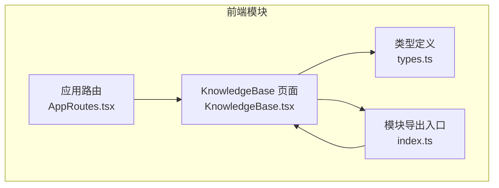
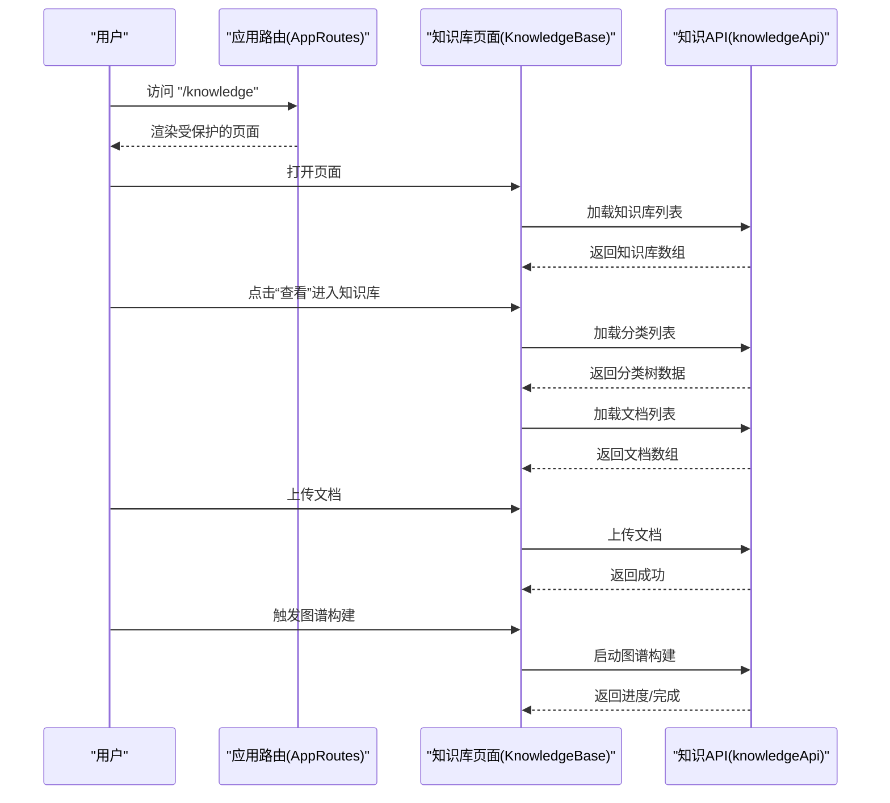
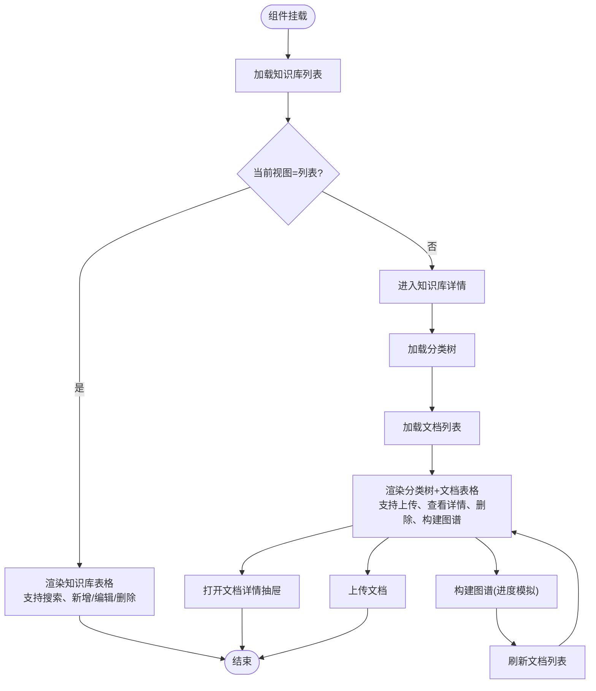
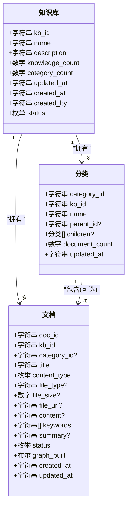
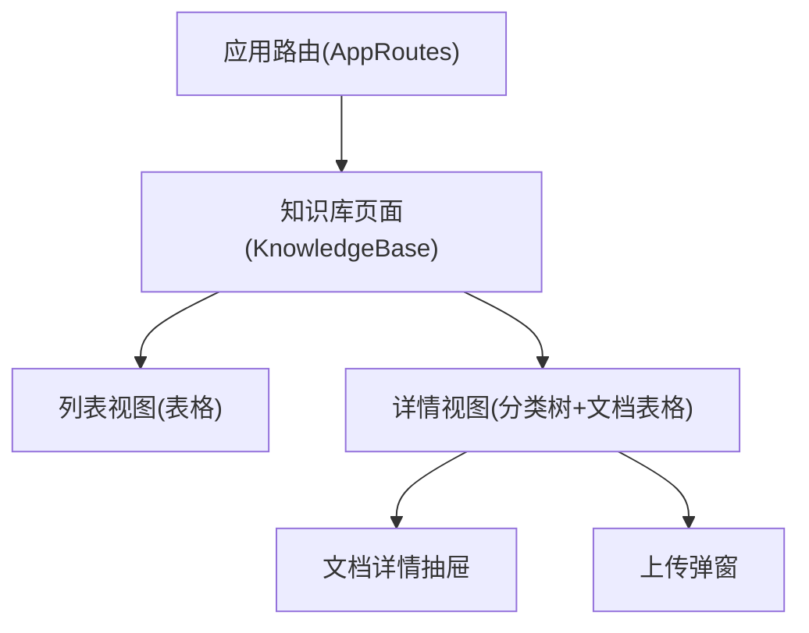
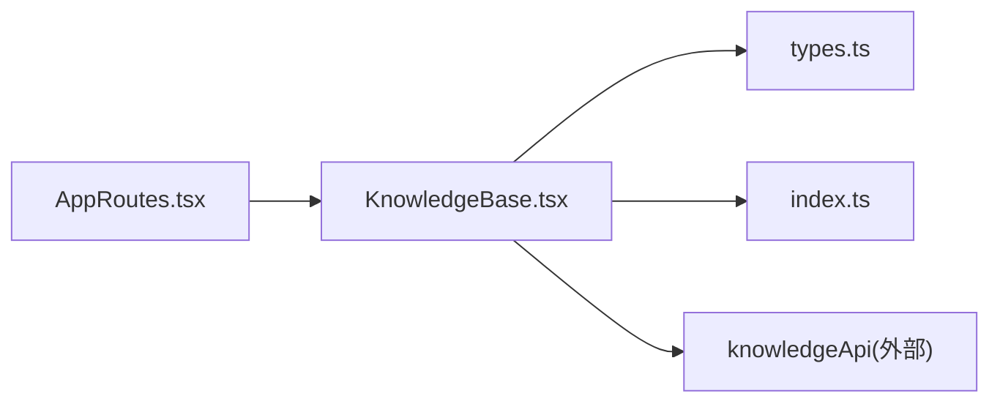

# Knowledge模块

<cite>
**本文引用的文件**
- [KnowledgeBase.tsx](file://frontend/src/modules/knowledge/pages/KnowledgeBase.tsx)
- [types.ts](file://frontend/src/modules/knowledge/types.ts)
- [index.ts](file://frontend/src/modules/knowledge/index.ts)
- [AppRoutes.tsx](file://frontend/src/AppRoutes.tsx)
</cite>

## 目录
1. [简介](#简介)
2. [项目结构](#项目结构)
3. [核心组件](#核心组件)
4. [架构总览](#架构总览)
5. [详细组件分析](#详细组件分析)
6. [依赖关系分析](#依赖关系分析)
7. [性能考虑](#性能考虑)
8. [故障排查指南](#故障排查指南)
9. [结论](#结论)
10. [附录](#附录)

## 简介
本文件面向Knowledge模块的前端实现，聚焦知识库页面的功能与交互设计，涵盖以下方面：
- 知识库页面的实现：知识库列表、进入知识库后的分类树与文档列表、文档详情抽屉等。
- 知识条目的展示方式：按类型区分的图标、关键词标签、状态徽章、进度条等。
- 搜索功能：基于名称与描述的本地过滤。
- 分类管理：左侧分类树的展示与选择，以及分类维度下的文档筛选。
- 知识API设计与实现要点：通过知识API进行知识库、分类、文档的增删改查；文档上传与图谱构建流程。
- 组件数据加载与渲染逻辑：组件状态管理、异步加载、错误提示与进度模拟。
- 用户界面设计与导航结构：Ant Design组件体系、路由集成与页面布局。
- 实际示例与实现参考：通过源码路径定位具体实现位置，便于快速查阅。

## 项目结构
Knowledge模块位于前端工程的模块化目录下，主要由页面、类型定义与导出入口组成。页面组件负责UI交互与数据流编排，类型定义用于前后端契约与TS类型约束。

**图表来源**
- [KnowledgeBase.tsx:1-584](file://frontend/src/modules/knowledge/pages/KnowledgeBase.tsx#L1-L584)
- [types.ts:1-87](file://frontend/src/modules/knowledge/types.ts#L1-L87)
- [index.ts:1-1](file://frontend/src/modules/knowledge/index.ts#L1-L1)
- [AppRoutes.tsx:1-61](file://frontend/src/AppRoutes.tsx#L1-L61)

**章节来源**
- [KnowledgeBase.tsx:1-584](file://frontend/src/modules/knowledge/pages/KnowledgeBase.tsx#L1-L584)
- [types.ts:1-87](file://frontend/src/modules/knowledge/types.ts#L1-L87)
- [index.ts:1-1](file://frontend/src/modules/knowledge/index.ts#L1-L1)
- [AppRoutes.tsx:1-61](file://frontend/src/AppRoutes.tsx#L1-L61)

## 核心组件
- 知识库页面组件：负责知识库列表展示、搜索、新增/编辑/删除知识库；进入知识库后展示分类树与文档列表，并支持文档详情抽屉、上传与图谱构建。
- 类型定义：定义知识库、分类、文档、表单数据、上传数据、图谱构建请求、RAG查询请求与结果等接口，确保前后端契约一致。
- 模块导出：对外仅暴露知识库页面组件，供路由与上层模块使用。
- 应用路由：在全局路由中注册知识库页面路由，受登录态保护。

关键职责与行为：
- 数据加载：首次挂载时加载知识库列表；进入知识库后加载分类与文档。
- 搜索：对知识库列表进行本地过滤。
- 上传：支持文件、在线文档、纯文本、网页抓取四种内容类型。
- 图谱构建：启动后显示进度条，完成后刷新文档列表。
- 错误处理：统一使用消息提示反馈操作结果。

**章节来源**
- [KnowledgeBase.tsx:28-584](file://frontend/src/modules/knowledge/pages/KnowledgeBase.tsx#L28-L584)
- [types.ts:1-87](file://frontend/src/modules/knowledge/types.ts#L1-L87)
- [index.ts:1-1](file://frontend/src/modules/knowledge/index.ts#L1-L1)
- [AppRoutes.tsx:48-48](file://frontend/src/AppRoutes.tsx#L48-L48)

## 架构总览
从路由到页面再到API调用的整体流程如下：

**图表来源**
- [AppRoutes.tsx:48-48](file://frontend/src/AppRoutes.tsx#L48-L48)
- [KnowledgeBase.tsx:48-80](file://frontend/src/modules/knowledge/pages/KnowledgeBase.tsx#L48-L80)
- [KnowledgeBase.tsx:134-155](file://frontend/src/modules/knowledge/pages/KnowledgeBase.tsx#L134-L155)
- [KnowledgeBase.tsx:157-183](file://frontend/src/modules/knowledge/pages/KnowledgeBase.tsx#L157-L183)

## 详细组件分析

### 知识库页面组件（KnowledgeBase）
该组件承担了知识库页面的所有交互逻辑与数据流控制，包含以下关键能力：
- 视图模式切换：列表视图与详情视图（分类树+文档列表）。
- 知识库管理：创建、编辑、删除知识库；支持表单校验与消息提示。
- 搜索：基于名称与描述的本地过滤。
- 分类管理：左侧分类树展示，支持选择分类以筛选文档。
- 文档管理：上传（文件/在线文档/纯文本/网页抓取）、查看详情、删除、触发图谱构建。
- 进度模拟：图谱构建过程中显示进度条，完成后刷新文档列表。
- 错误处理：统一的消息提示，避免阻断用户操作。

**图表来源**
- [KnowledgeBase.tsx:48-80](file://frontend/src/modules/knowledge/pages/KnowledgeBase.tsx#L48-L80)
- [KnowledgeBase.tsx:120-125](file://frontend/src/modules/knowledge/pages/KnowledgeBase.tsx#L120-L125)
- [KnowledgeBase.tsx:134-155](file://frontend/src/modules/knowledge/pages/KnowledgeBase.tsx#L134-L155)
- [KnowledgeBase.tsx:157-183](file://frontend/src/modules/knowledge/pages/KnowledgeBase.tsx#L157-L183)
- [KnowledgeBase.tsx:185-188](file://frontend/src/modules/knowledge/pages/KnowledgeBase.tsx#L185-L188)

**章节来源**
- [KnowledgeBase.tsx:28-584](file://frontend/src/modules/knowledge/pages/KnowledgeBase.tsx#L28-L584)

### 知识API设计与实现要点
- 知识库API：提供知识库的创建、更新、删除、列表查询等方法，供页面组件调用。
- 分类API：提供分类的列表查询，用于构建左侧分类树。
- 文档API：提供文档的列表查询、上传、删除、图谱构建等方法。
- 请求与响应契约：通过types.ts中的接口定义明确字段与枚举值，保证前后端一致性。
- 错误处理：页面统一使用消息提示反馈操作结果，避免抛出未捕获异常。

**图表来源**
- [types.ts:1-87](file://frontend/src/modules/knowledge/types.ts#L1-L87)

**章节来源**
- [types.ts:1-87](file://frontend/src/modules/knowledge/types.ts#L1-L87)

### 用户界面设计与导航结构
- 导航结构：在全局路由中注册"/knowledge"路径，受登录态保护，进入后渲染知识库页面。
- UI框架：基于Ant Design组件库，使用卡片、表格、树、抽屉、模态框、进度条、徽章等组件构建页面。
- 布局：列表视图采用表格展示；详情视图采用左右布局（左侧分类树，右侧文档列表），支持文档详情抽屉。
- 交互：支持搜索、上传、删除、查看详情、构建图谱等操作，配合消息提示与进度反馈。

**图表来源**
- [AppRoutes.tsx:48-48](file://frontend/src/AppRoutes.tsx#L48-L48)
- [KnowledgeBase.tsx:214-325](file://frontend/src/modules/knowledge/pages/KnowledgeBase.tsx#L214-L325)
- [KnowledgeBase.tsx:327-580](file://frontend/src/modules/knowledge/pages/KnowledgeBase.tsx#L327-L580)

**章节来源**
- [AppRoutes.tsx:1-61](file://frontend/src/AppRoutes.tsx#L1-L61)
- [KnowledgeBase.tsx:28-584](file://frontend/src/modules/knowledge/pages/KnowledgeBase.tsx#L28-L584)

## 依赖关系分析
- 路由依赖：页面组件通过路由注册被访问，受登录态保护。
- 组件依赖：页面组件依赖Ant Design组件库与图标库；依赖知识API进行数据交互。
- 类型依赖：页面组件与API之间通过types.ts中的接口进行契约约束，确保字段与枚举值一致。
- 内部模块依赖：模块导出仅暴露页面组件，供上层模块使用。

**图表来源**
- [AppRoutes.tsx:1-61](file://frontend/src/AppRoutes.tsx#L1-L61)
- [KnowledgeBase.tsx:1-25](file://frontend/src/modules/knowledge/pages/KnowledgeBase.tsx#L1-L25)
- [index.ts:1-1](file://frontend/src/modules/knowledge/index.ts#L1-L1)
- [types.ts:1-87](file://frontend/src/modules/knowledge/types.ts#L1-L87)

**章节来源**
- [AppRoutes.tsx:1-61](file://frontend/src/AppRoutes.tsx#L1-L61)
- [KnowledgeBase.tsx:1-25](file://frontend/src/modules/knowledge/pages/KnowledgeBase.tsx#L1-L25)
- [index.ts:1-1](file://frontend/src/modules/knowledge/index.ts#L1-L1)
- [types.ts:1-87](file://frontend/src/modules/knowledge/types.ts#L1-L87)

## 性能考虑
- 列表渲染：表格分页（每页10条）降低初始渲染压力。
- 本地搜索：基于内存数组过滤，适合中小规模数据集；若数据量增大，建议后端分页与搜索。
- 图谱构建进度：使用定时器模拟进度，避免频繁网络请求；完成后一次性刷新文档列表。
- 上传优化：文件上传前仅保存引用，避免大对象在状态中传递；上传成功后再刷新列表。
- 错误处理：统一消息提示，减少重试风暴；必要时增加防抖与节流。

## 故障排查指南
- 无法加载知识库列表：检查API返回与网络状态；确认消息提示是否出现错误信息。
- 上传失败：检查上传表单字段、文件大小限制与后端接口；确认上传成功后再刷新列表。
- 图谱构建无响应：确认构建任务已启动；检查进度条更新逻辑与定时器清理。
- 删除失败：确认删除确认弹窗与后端权限；检查消息提示与列表刷新。
- 分类树不显示：确认分类数据结构与树形渲染逻辑；检查默认展开与选中状态。

**章节来源**
- [KnowledgeBase.tsx:52-62](file://frontend/src/modules/knowledge/pages/KnowledgeBase.tsx#L52-L62)
- [KnowledgeBase.tsx:134-155](file://frontend/src/modules/knowledge/pages/KnowledgeBase.tsx#L134-L155)
- [KnowledgeBase.tsx:157-183](file://frontend/src/modules/knowledge/pages/KnowledgeBase.tsx#L157-L183)
- [KnowledgeBase.tsx:190-199](file://frontend/src/modules/knowledge/pages/KnowledgeBase.tsx#L190-L199)
- [KnowledgeBase.tsx:64-71](file://frontend/src/modules/knowledge/pages/KnowledgeBase.tsx#L64-L71)

## 结论
Knowledge模块的前端实现围绕知识库页面展开，通过清晰的视图模式、完善的分类与文档管理、直观的上传与图谱构建流程，提供了完整的知识管理体验。类型定义确保了前后端契约的一致性，路由与组件的解耦提升了可维护性。后续可在大数据场景下引入后端搜索与分页、优化上传与构建流程的并发控制，并增强错误恢复与日志追踪能力。

## 附录
- 实际展示示例与实现参考：
  - 知识库列表视图与搜索：[KnowledgeBase.tsx:214-325](file://frontend/src/modules/knowledge/pages/KnowledgeBase.tsx#L214-L325)
  - 知识库详情视图与分类树：[KnowledgeBase.tsx:327-466](file://frontend/src/modules/knowledge/pages/KnowledgeBase.tsx#L327-L466)
  - 文档上传与图谱构建：[KnowledgeBase.tsx:127-155](file://frontend/src/modules/knowledge/pages/KnowledgeBase.tsx#L127-L155), [KnowledgeBase.tsx:157-183](file://frontend/src/modules/knowledge/pages/KnowledgeBase.tsx#L157-L183)
  - 文档详情抽屉：[KnowledgeBase.tsx:528-577](file://frontend/src/modules/knowledge/pages/KnowledgeBase.tsx#L528-L577)
  - 路由集成：[AppRoutes.tsx:48-48](file://frontend/src/AppRoutes.tsx#L48-L48)
  - 类型定义：[types.ts:1-87](file://frontend/src/modules/knowledge/types.ts#L1-L87)
  - 模块导出：[index.ts:1-1](file://frontend/src/modules/knowledge/index.ts#L1-L1)