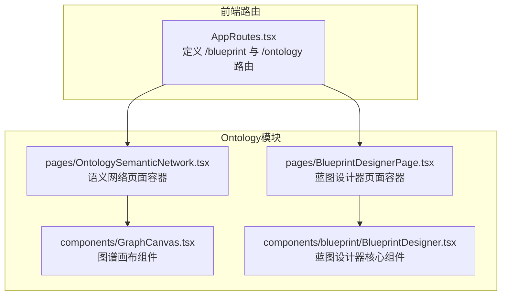
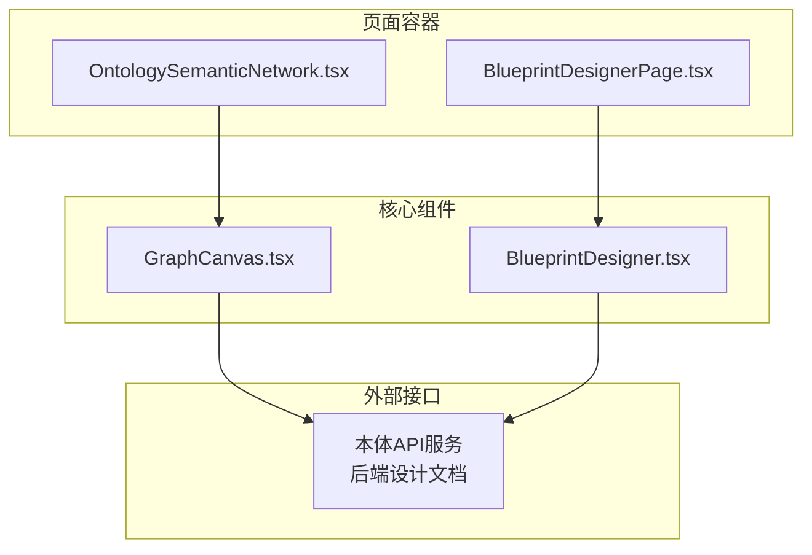
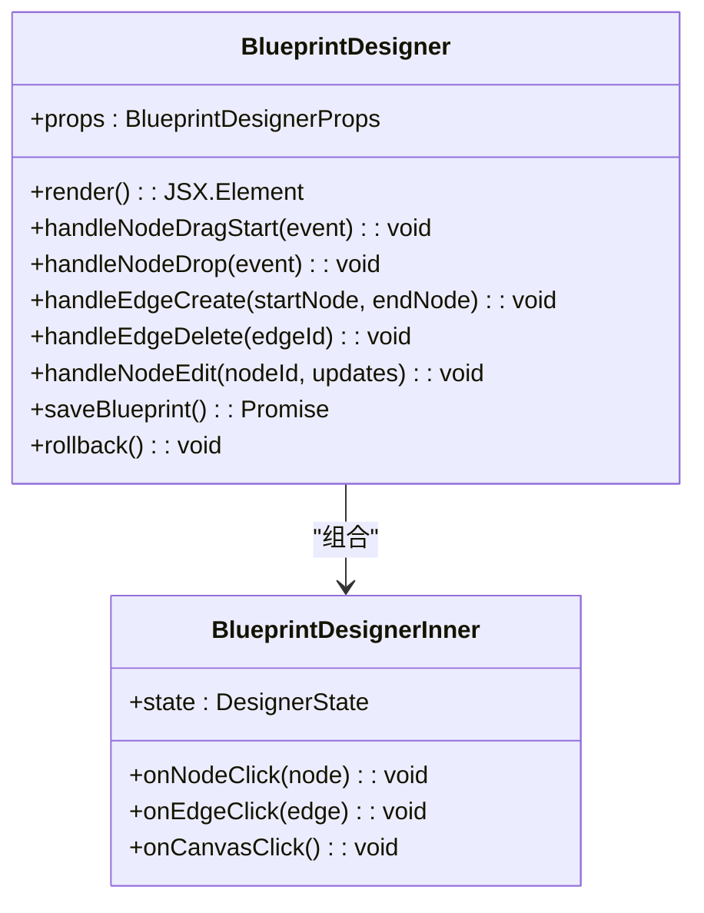
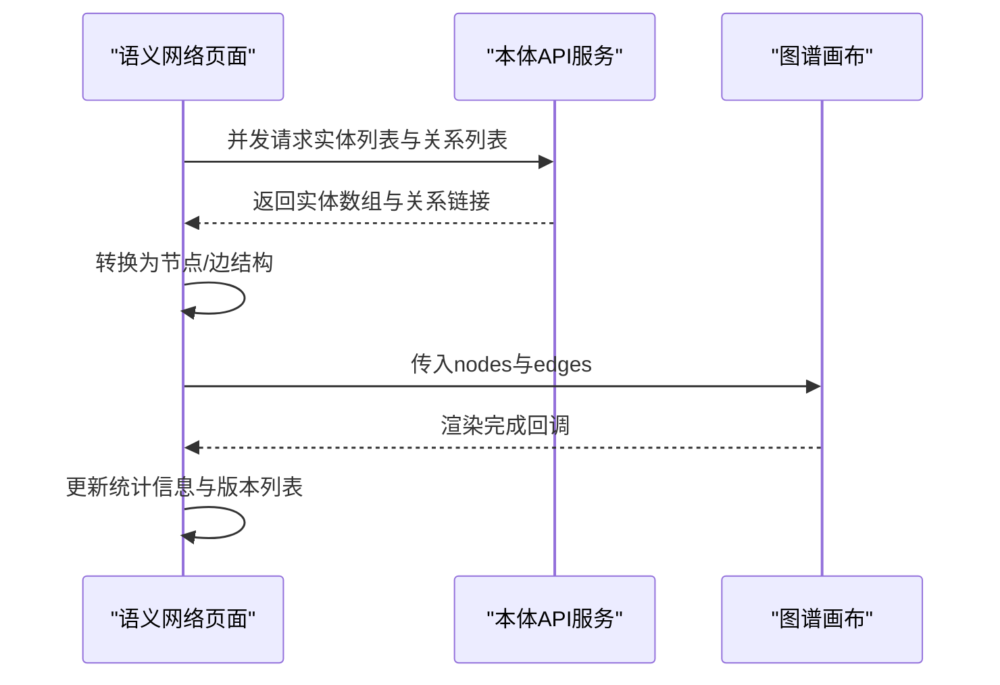
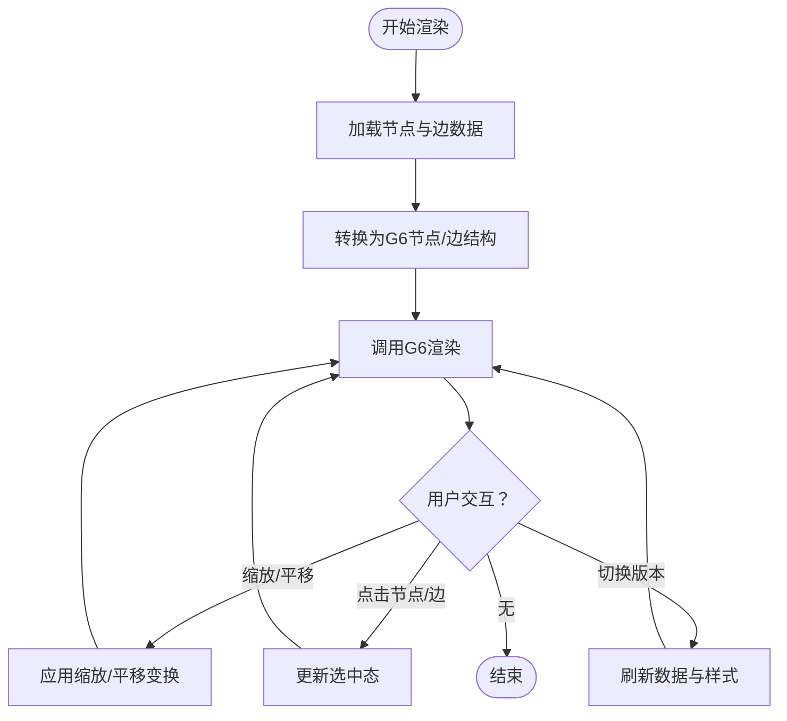
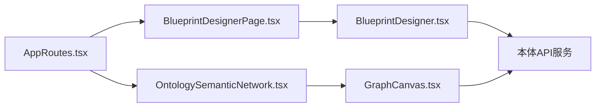

# Ontology模块

<cite>
**本文引用的文件**
- [AppRoutes.tsx](file://frontend/src/AppRoutes.tsx)
- [BlueprintDesignerPage.tsx](file://frontend/src/modules/ontology/pages/BlueprintDesignerPage.tsx)
- [OntologySemanticNetwork.tsx](file://frontend/src/modules/ontology/pages/OntologySemanticNetwork.tsx)
- [GraphCanvas.tsx](file://frontend/src/modules/ontology/components/GraphCanvas.tsx)
- [BlueprintDesigner.tsx](file://frontend/src/modules/ontology/components/blueprint/BlueprintDesigner.tsx)
- [webui-enhancement-design.md](file://docs/01-product-design/webui-enhancement-design.md)
- [ONTOLOGY_BUILD_UI.md](file://docs/04-ui/ONTOLOGY_BUILD_UI.md)
- [BACKEND_API_DESIGN.md](file://docs/10-api/BACKEND_API_DESIGN.md)
- [DESIGN.md](file://docs/03-modules/ontology/DESIGN.md)
- [ARCHITECTURE.md](file://docs/02-architecture/ARCHITECTURE.md)
</cite>

## 目录
1. [简介](#简介)
2. [项目结构](#项目结构)
3. [核心组件](#核心组件)
4. [架构总览](#架构总览)
5. [详细组件分析](#详细组件分析)
6. [依赖分析](#依赖分析)
7. [性能考虑](#性能考虑)
8. [故障排除指南](#故障排除指南)
9. [结论](#结论)
10. [附录](#附录)

## 简介
本文件面向Ontology模块的前端实现，系统性梳理蓝图设计器、语义网络与图谱可视化等页面的架构与实现细节。重点覆盖：
- 蓝图设计器的拖拽操作、节点编辑与连线管理
- 图谱可视化组件的渲染逻辑、交互控制与性能优化
- 本体API服务设计与蓝图存储机制
- 本体构建工作流程与用户操作指南
- 实际蓝图设计器实现示例与图谱可视化效果说明

## 项目结构
前端模块采用按功能域划分的组织方式，Ontology模块位于frontend/src/modules/ontology下，包含页面、组件、服务与状态管理等层次。路由通过AppRoutes集中定义，蓝图设计器与语义网络页面分别挂载到"/blueprint"与"/ontology"。

**图表来源**
- [AppRoutes.tsx:5-6](file://frontend/src/AppRoutes.tsx#L5-L6)
- [BlueprintDesignerPage.tsx:1-6](file://frontend/src/modules/ontology/pages/BlueprintDesignerPage.tsx#L1-L6)
- [OntologySemanticNetwork.tsx:1-10](file://frontend/src/modules/ontology/pages/OntologySemanticNetwork.tsx#L1-L10)
- [GraphCanvas.tsx:1-60](file://frontend/src/modules/ontology/components/GraphCanvas.tsx#L1-L60)
- [BlueprintDesigner.tsx:1-60](file://frontend/src/modules/ontology/components/blueprint/BlueprintDesigner.tsx#L1-L60)

**章节来源**
- [AppRoutes.tsx:5-6](file://frontend/src/AppRoutes.tsx#L5-L6)
- [BlueprintDesignerPage.tsx:1-6](file://frontend/src/modules/ontology/pages/BlueprintDesignerPage.tsx#L1-L6)
- [OntologySemanticNetwork.tsx:1-10](file://frontend/src/modules/ontology/pages/OntologySemanticNetwork.tsx#L1-L10)

## 核心组件
- 蓝图设计器页面容器：负责承载蓝图设计器组件，并提供页面级状态与交互入口。
- 语义网络页面容器：负责加载与展示语义网络数据，提供版本选择、统计信息与图谱视图切换。
- 图谱画布组件：封装G6渲染、缩放/平移、节点/边点击回调、版本切换等通用能力。
- 蓝图设计器核心组件：实现节点拖拽、连线管理、节点编辑、存储与回滚等蓝图构建关键能力。

**章节来源**
- [BlueprintDesignerPage.tsx:1-6](file://frontend/src/modules/ontology/pages/BlueprintDesignerPage.tsx#L1-L6)
- [OntologySemanticNetwork.tsx:80-120](file://frontend/src/modules/ontology/pages/OntologySemanticNetwork.tsx#L80-L120)
- [GraphCanvas.tsx:31-80](file://frontend/src/modules/ontology/components/GraphCanvas.tsx#L31-L80)
- [BlueprintDesigner.tsx:60-120](file://frontend/src/modules/ontology/components/blueprint/BlueprintDesigner.tsx#L60-L120)

## 架构总览
前端通过页面容器与组件解耦，页面负责状态与业务编排，组件负责具体渲染与交互。蓝图设计器与语义网络共享底层图谱渲染能力（GraphCanvas），并通过API服务获取/持久化数据。

**图表来源**
- [OntologySemanticNetwork.tsx:80-120](file://frontend/src/modules/ontology/pages/OntologySemanticNetwork.tsx#L80-L120)
- [BlueprintDesignerPage.tsx:1-6](file://frontend/src/modules/ontology/pages/BlueprintDesignerPage.tsx#L1-L6)
- [GraphCanvas.tsx:31-80](file://frontend/src/modules/ontology/components/GraphCanvas.tsx#L31-L80)
- [BlueprintDesigner.tsx:60-120](file://frontend/src/modules/ontology/components/blueprint/BlueprintDesigner.tsx#L60-L120)
- [BACKEND_API_DESIGN.md:1-200](file://docs/10-api/BACKEND_API_DESIGN.md#L1-L200)

## 详细组件分析

### 蓝图设计器组件分析
蓝图设计器组件承担本体蓝图的可视化构建任务，核心职责包括：
- 节点拖拽与布局：支持从工具箱拖入节点，自动计算初始位置与层级。
- 连线管理：支持节点间连线创建、删除与样式调整。
- 节点编辑：双击进入编辑模式，支持属性修改与批量更新。
- 存储与版本：提供保存、提交与版本对比能力，确保蓝图演进可追踪。
- 回滚与撤销：支持局部或全局回滚，保障编辑安全性。

**图表来源**
- [BlueprintDesigner.tsx:60-120](file://frontend/src/modules/ontology/components/blueprint/BlueprintDesigner.tsx#L60-L120)
- [BlueprintDesigner.tsx:240-320](file://frontend/src/modules/ontology/components/blueprint/BlueprintDesigner.tsx#L240-L320)

**章节来源**
- [BlueprintDesigner.tsx:60-120](file://frontend/src/modules/ontology/components/blueprint/BlueprintDesigner.tsx#L60-L120)
- [BlueprintDesigner.tsx:240-320](file://frontend/src/modules/ontology/components/blueprint/BlueprintDesigner.tsx#L240-L320)

### 语义网络页面与图谱画布分析
语义网络页面负责加载实体与关系数据，转换为图谱格式并交由图谱画布渲染。图谱画布提供：
- 数据转换：将后端返回的实体/关系映射为节点/边结构。
- 渲染控制：支持力导向/环形/网格等布局切换。
- 交互控制：节点/边点击、选中态管理、详情抽屉联动。
- 性能优化：分步加载、并发请求、虚拟化与增量更新策略。

**图表来源**
- [OntologySemanticNetwork.tsx:80-120](file://frontend/src/modules/ontology/pages/OntologySemanticNetwork.tsx#L80-L120)
- [webui-enhancement-design.md:194-249](file://docs/01-product-design/webui-enhancement-design.md#L194-L249)

**章节来源**
- [OntologySemanticNetwork.tsx:80-120](file://frontend/src/modules/ontology/pages/OntologySemanticNetwork.tsx#L80-L120)
- [GraphCanvas.tsx:31-80](file://frontend/src/modules/ontology/components/GraphCanvas.tsx#L31-L80)
- [webui-enhancement-design.md:194-249](file://docs/01-product-design/webui-enhancement-design.md#L194-L249)

### 图谱画布渲染与交互流程
图谱画布组件封装了渲染与交互的关键逻辑，包括：
- 缩放/平移：鼠标滚轮缩放、拖拽平移，限制最小/最大缩放比例。
- 选中态：节点/边点击后高亮，支持取消选择。
- 版本切换：根据当前版本动态刷新节点/边样式与数据。
- 加载状态：异步加载时显示加载指示器，避免重复请求。

**图表来源**
- [GraphCanvas.tsx:31-80](file://frontend/src/modules/ontology/components/GraphCanvas.tsx#L31-L80)

**章节来源**
- [GraphCanvas.tsx:31-80](file://frontend/src/modules/ontology/components/GraphCanvas.tsx#L31-L80)

## 依赖分析
- 页面到组件：蓝图设计器页面容器依赖蓝图设计器核心组件；语义网络页面容器依赖图谱画布组件。
- 组件到服务：蓝图设计器与图谱画布均通过本体API服务进行数据获取与持久化。
- 路由到页面：AppRoutes集中定义蓝图与语义网络路由，确保访问入口一致。

**图表来源**
- [AppRoutes.tsx:5-6](file://frontend/src/AppRoutes.tsx#L5-L6)
- [BlueprintDesignerPage.tsx:1-6](file://frontend/src/modules/ontology/pages/BlueprintDesignerPage.tsx#L1-L6)
- [OntologySemanticNetwork.tsx:1-10](file://frontend/src/modules/ontology/pages/OntologySemanticNetwork.tsx#L1-L10)
- [BlueprintDesigner.tsx:1-60](file://frontend/src/modules/ontology/components/blueprint/BlueprintDesigner.tsx#L1-L60)
- [GraphCanvas.tsx:1-60](file://frontend/src/modules/ontology/components/GraphCanvas.tsx#L1-L60)
- [BACKEND_API_DESIGN.md:1-200](file://docs/10-api/BACKEND_API_DESIGN.md#L1-L200)

**章节来源**
- [AppRoutes.tsx:5-6](file://frontend/src/AppRoutes.tsx#L5-L6)
- [BlueprintDesignerPage.tsx:1-6](file://frontend/src/modules/ontology/pages/BlueprintDesignerPage.tsx#L1-L6)
- [OntologySemanticNetwork.tsx:1-10](file://frontend/src/modules/ontology/pages/OntologySemanticNetwork.tsx#L1-L10)
- [BlueprintDesigner.tsx:1-60](file://frontend/src/modules/ontology/components/blueprint/BlueprintDesigner.tsx#L1-L60)
- [GraphCanvas.tsx:1-60](file://frontend/src/modules/ontology/components/GraphCanvas.tsx#L1-L60)

## 性能考虑
- 并发加载：语义网络页面对实体与关系请求采用并发方式，减少整体等待时间。
- 分步渲染：先加载基础数据，再触发渲染，避免阻塞UI。
- 缓存与去重：对相同查询结果进行缓存，避免重复请求。
- 虚拟化与节流：在大规模节点场景下，采用虚拟化与事件节流降低重绘频率。
- 增量更新：仅对变更节点/边执行局部更新，提升响应速度。

**章节来源**
- [webui-enhancement-design.md:194-249](file://docs/01-product-design/webui-enhancement-design.md#L194-L249)

## 故障排除指南
- 加载失败：若语义网络加载异常，页面会记录错误并提示用户。建议检查网络连接与后端API可用性。
- 渲染异常：若图谱渲染空白，检查节点/边数据结构是否符合预期，确认G6初始化参数。
- 交互失效：若缩放/平移无效，检查画布容器尺寸与事件绑定状态。
- 蓝图保存失败：若保存蓝图失败，检查当前用户权限与后端存储状态，必要时重试或回滚。

**章节来源**
- [OntologySemanticNetwork.tsx:80-120](file://frontend/src/modules/ontology/pages/OntologySemanticNetwork.tsx#L80-L120)
- [GraphCanvas.tsx:31-80](file://frontend/src/modules/ontology/components/GraphCanvas.tsx#L31-L80)
- [BlueprintDesigner.tsx:60-120](file://frontend/src/modules/ontology/components/blueprint/BlueprintDesigner.tsx#L60-L120)

## 结论
Ontology模块前端通过清晰的页面-组件分层与共享的图谱渲染能力，实现了蓝图设计器与语义网络的高效开发与维护。蓝图设计器强调交互与可编辑性，语义网络强调数据驱动与可视化体验。结合后端API设计与版本管理机制，形成完整的本体构建与展示闭环。

## 附录

### 本体API服务设计与蓝图存储机制
- API设计：后端API提供蓝图的创建、更新、查询与版本对比等接口，前端通过服务封装统一调用。
- 存储机制：蓝图以结构化数据形式存储，支持增量更新与版本快照，便于回滚与审计。
- 权限与安全：API调用需鉴权，确保只有授权用户可进行蓝图编辑与提交。

**章节来源**
- [BACKEND_API_DESIGN.md:1-200](file://docs/10-api/BACKEND_API_DESIGN.md#L1-L200)

### 本体构建工作流程与用户操作指南
- 工作流程概览：数据采集 → 本体抽取 → 蓝图设计 → 验证与提交 → 语义网络可视化。
- 用户操作要点：
  - 在蓝图设计器中拖拽节点、建立连线并编辑属性。
  - 使用语义网络页面查看实体关系，切换版本与布局。
  - 提交蓝图前进行校验，确保结构完整性与一致性。

**章节来源**
- [ONTOLOGY_BUILD_UI.md:1-200](file://docs/04-ui/ONTOLOGY_BUILD_UI.md#L1-L200)
- [DESIGN.md:1-200](file://docs/03-modules/ontology/DESIGN.md#L1-L200)
- [ARCHITECTURE.md:1-200](file://docs/02-architecture/ARCHITECTURE.md#L1-L200)