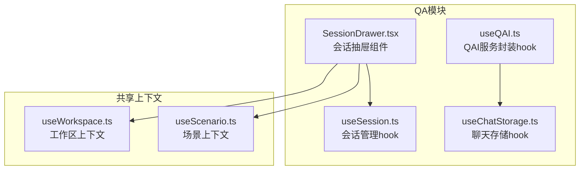
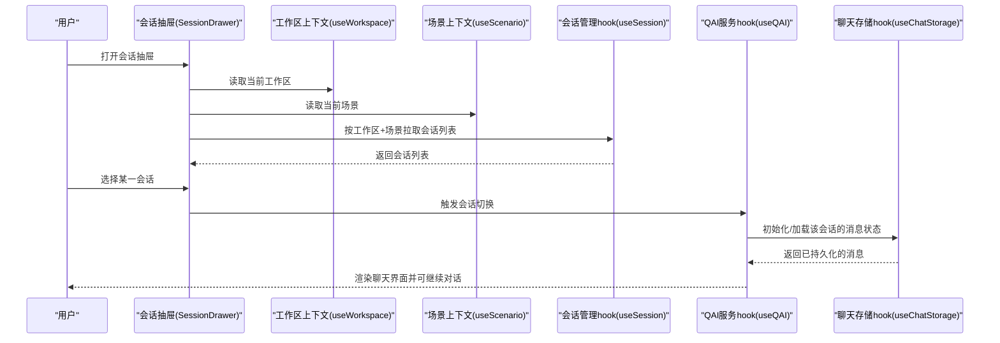
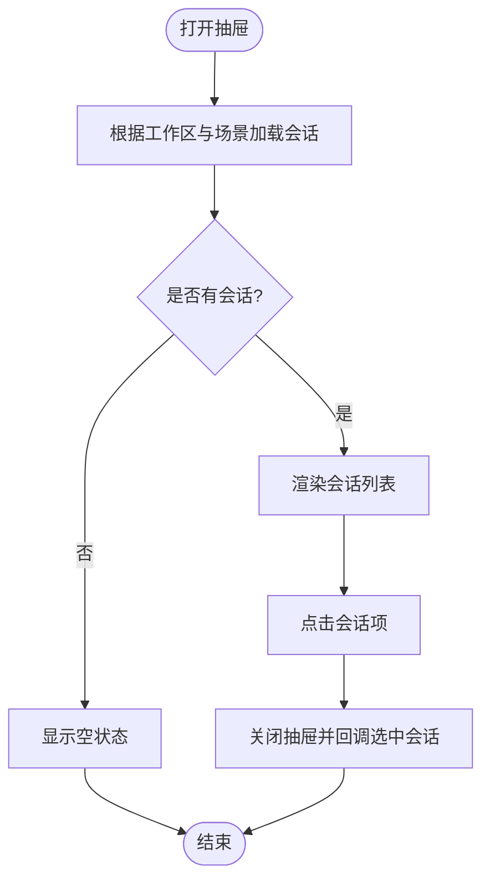
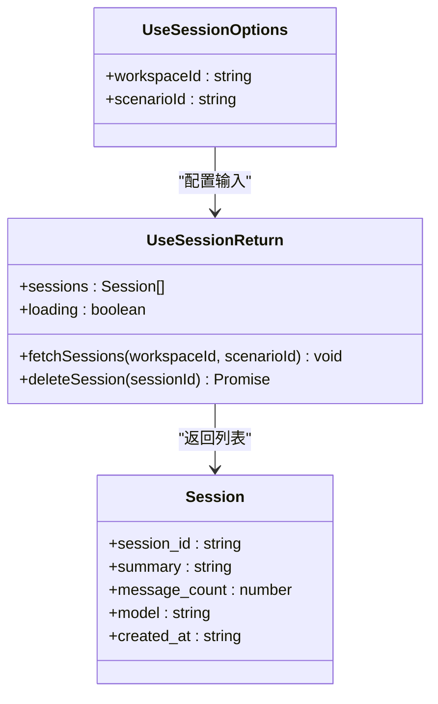
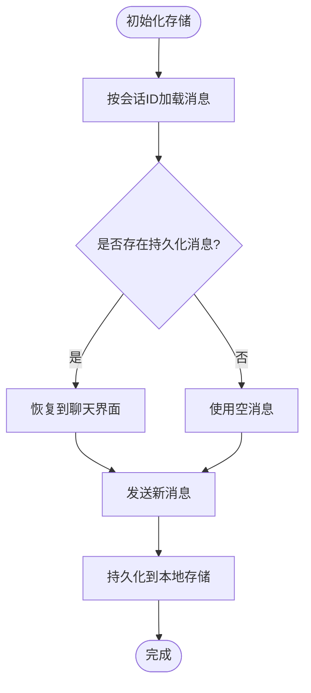
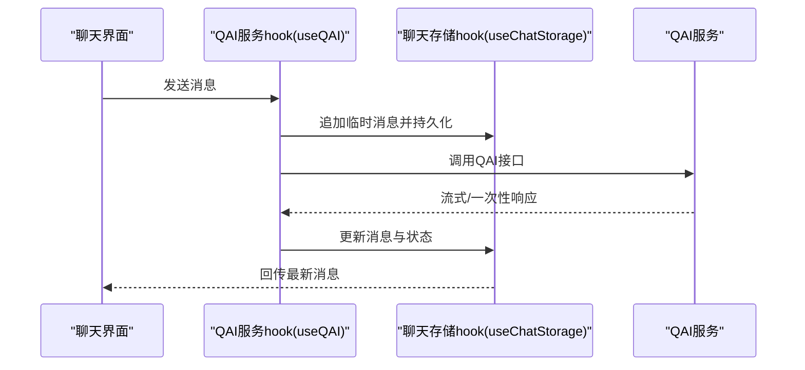
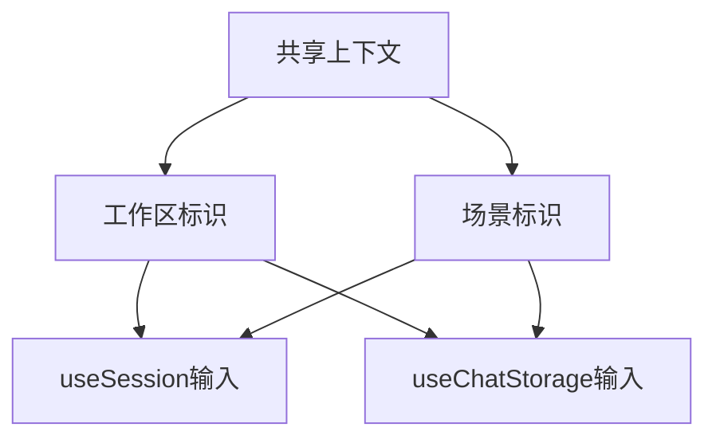
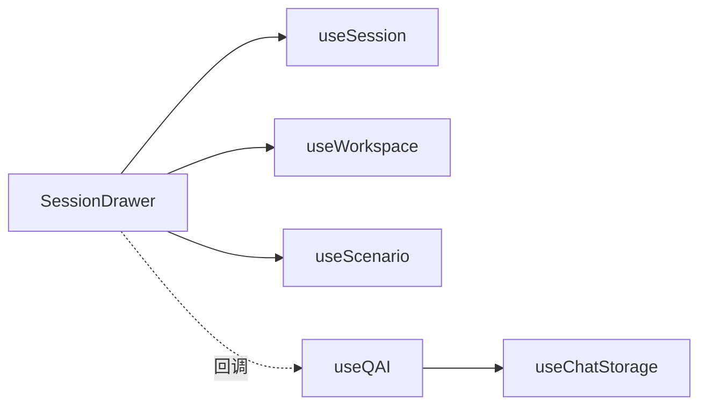

# QA模块

<cite>
**本文引用的文件**
- [SessionDrawer.tsx](file://frontend/src/modules/qa/components/SessionDrawer.tsx)
- [useSession.ts](file://frontend/src/modules/qa/hooks/useSession.ts)
- [useChatStorage.ts](file://frontend/src/modules/qa/hooks/useChatStorage.ts)
- [useQAI.ts](file://frontend/src/modules/qa/hooks/useQAI.ts)
- [useWorkspace.ts](file://frontend/src/modules/shared/hooks/useWorkspace.ts)
- [useScenario.ts](file://frontend/src/modules/shared/hooks/useScenario.ts)
</cite>

## 目录
1. [简介](#简介)
2. [项目结构](#项目结构)
3. [核心组件](#核心组件)
4. [架构总览](#架构总览)
5. [详细组件分析](#详细组件分析)
6. [依赖关系分析](#依赖关系分析)
7. [性能考量](#性能考量)
8. [故障排查指南](#故障排查指南)
9. [结论](#结论)
10. [附录](#附录)

## 简介
本文件面向QA模块的前端实现，聚焦于问答聊天页面、会话抽屉以及相关hooks的设计与实现。文档从系统架构、组件关系、数据流与处理逻辑、集成点与错误处理、性能特征等方面进行深入解析，并结合实际代码路径提供可视化图示与实践建议，帮助开发者快速理解并高效维护该模块。

## 项目结构
QA模块位于前端工程的模块化目录下，采用按功能域划分的组织方式：页面、组件、hooks、providers等层次清晰。本次文档关注的核心文件包括会话抽屉组件与三个关键hooks（会话管理、聊天存储、QAI服务封装），以及共享工作区与场景上下文钩子。

**图表来源**
- [SessionDrawer.tsx:90-184](file://frontend/src/modules/qa/components/SessionDrawer.tsx#L90-L184)
- [useSession.ts:14-200](file://frontend/src/modules/qa/hooks/useSession.ts#L14-L200)
- [useChatStorage.ts:1-200](file://frontend/src/modules/qa/hooks/useChatStorage.ts#L1-L200)
- [useQAI.ts:1-200](file://frontend/src/modules/qa/hooks/useQAI.ts#L1-L200)
- [useWorkspace.ts:1-200](file://frontend/src/modules/shared/hooks/useWorkspace.ts#L1-L200)
- [useScenario.ts:1-200](file://frontend/src/modules/shared/hooks/useScenario.ts#L1-L200)

**章节来源**
- [SessionDrawer.tsx:1-184](file://frontend/src/modules/qa/components/SessionDrawer.tsx#L1-L184)
- [useSession.ts:14-200](file://frontend/src/modules/qa/hooks/useSession.ts#L14-L200)
- [useChatStorage.ts:1-200](file://frontend/src/modules/qa/hooks/useChatStorage.ts#L1-L200)
- [useQAI.ts:1-200](file://frontend/src/modules/qa/hooks/useQAI.ts#L1-L200)
- [useWorkspace.ts:1-200](file://frontend/src/modules/shared/hooks/useWorkspace.ts#L1-L200)
- [useScenario.ts:1-200](file://frontend/src/modules/shared/hooks/useScenario.ts#L1-L200)

## 核心组件
- 会话抽屉组件：提供历史会话列表展示、选择与删除能力，支持加载状态与空状态提示；通过共享上下文获取当前工作区与场景信息，驱动会话列表拉取与筛选。
- 会话管理hook：封装会话列表获取、删除等操作，负责在打开抽屉时按工作区与场景维度加载数据。
- 聊天存储hook：负责消息持久化与状态恢复，支持按会话ID隔离存储，提供加载、持久化与清理能力。
- QAI服务封装hook：整合聊天存储与外部QAI服务，提供消息发送、状态管理与会话生命周期控制。
- 共享上下文hook：提供当前工作区与场景标识，作为会话管理与聊天存储的关键输入参数。

**章节来源**
- [SessionDrawer.tsx:90-184](file://frontend/src/modules/qa/components/SessionDrawer.tsx#L90-L184)
- [useSession.ts:14-200](file://frontend/src/modules/qa/hooks/useSession.ts#L14-L200)
- [useChatStorage.ts:1-200](file://frontend/src/modules/qa/hooks/useChatStorage.ts#L1-L200)
- [useQAI.ts:1-200](file://frontend/src/modules/qa/hooks/useQAI.ts#L1-L200)
- [useWorkspace.ts:1-200](file://frontend/src/modules/shared/hooks/useWorkspace.ts#L1-L200)
- [useScenario.ts:1-200](file://frontend/src/modules/shared/hooks/useScenario.ts#L1-L200)

## 架构总览
下图展示了QA模块前端的高层交互：会话抽屉通过共享上下文与会话管理hook联动，触发会话列表加载；用户选择会话后，聊天界面由QAI服务封装hook接管，结合聊天存储hook完成消息的持久化与恢复。

**图表来源**
- [SessionDrawer.tsx:90-184](file://frontend/src/modules/qa/components/SessionDrawer.tsx#L90-L184)
- [useSession.ts:14-200](file://frontend/src/modules/qa/hooks/useSession.ts#L14-L200)
- [useChatStorage.ts:1-200](file://frontend/src/modules/qa/hooks/useChatStorage.ts#L1-L200)
- [useQAI.ts:1-200](file://frontend/src/modules/qa/hooks/useQAI.ts#L1-L200)
- [useWorkspace.ts:1-200](file://frontend/src/modules/shared/hooks/useWorkspace.ts#L1-L200)
- [useScenario.ts:1-200](file://frontend/src/modules/shared/hooks/useScenario.ts#L1-L200)

## 详细组件分析

### 会话抽屉组件（SessionDrawer）
- 职责与行为
  - 展示历史会话列表，支持按时间格式化显示、消息条数与模型标签、删除确认弹窗。
  - 在抽屉打开时，基于当前工作区与场景调用会话管理hook拉取会话列表。
  - 提供会话选择回调，选中后关闭抽屉并传递所选会话给上层聊天界面。
- 关键交互
  - 打开抽屉时触发加载：通过effect监听open状态并在首次打开时调用fetchSessions。
  - 删除会话：点击删除按钮触发删除确认，确认后调用deleteSession并阻止事件冒泡。
  - 选择会话：点击会话项触发onSelectSession回调并关闭抽屉。
- 样式与可用性
  - 使用Ant Design Drawer组件，右侧抽屉、大尺寸，内置加载与空状态展示。
  - 列表项悬停显示操作按钮，提升交互效率。

**图表来源**
- [SessionDrawer.tsx:90-184](file://frontend/src/modules/qa/components/SessionDrawer.tsx#L90-L184)

**章节来源**
- [SessionDrawer.tsx:1-184](file://frontend/src/modules/qa/components/SessionDrawer.tsx#L1-L184)

### 会话管理hook（useSession）
- 设计要点
  - 接收工作区与场景作为输入，用于限定会话查询范围。
  - 提供会话列表、加载状态、拉取与删除能力。
  - 与共享上下文hook配合，确保在抽屉打开时自动刷新最新数据。
- 数据结构
  - 会话对象包含会话ID、摘要、消息数量、模型、创建时间等字段。
- 错误处理
  - 加载失败时应暴露错误状态，便于上层组件展示或重试。
- 性能优化
  - 避免重复请求：在抽屉关闭时可缓存结果，打开时再按需刷新。
  - 列表渲染优化：使用稳定key与虚拟滚动（如需要）。

**图表来源**
- [useSession.ts:14-200](file://frontend/src/modules/qa/hooks/useSession.ts#L14-L200)

**章节来源**
- [useSession.ts:14-200](file://frontend/src/modules/qa/hooks/useSession.ts#L14-L200)

### 聊天存储hook（useChatStorage）
- 设计要点
  - 以会话ID为维度进行消息持久化，避免跨会话污染。
  - 提供加载、持久化与清理能力，支持在会话切换时恢复状态。
- 数据持久化策略
  - 本地存储：优先使用浏览器本地存储，保证离线可用与快速恢复。
  - 同步策略：在消息变更时异步写入，避免阻塞UI线程。
  - 清理策略：会话删除时同步清理对应存储，防止垃圾数据累积。
- 复杂度与性能
  - 加载/保存复杂度近似O(n)，其中n为消息数量；可通过分页或增量更新优化。

**图表来源**
- [useChatStorage.ts:1-200](file://frontend/src/modules/qa/hooks/useChatStorage.ts#L1-L200)

**章节来源**
- [useChatStorage.ts:1-200](file://frontend/src/modules/qa/hooks/useChatStorage.ts#L1-L200)

### QAI服务封装hook（useQAI）
- 设计要点
  - 封装外部QAI服务的调用，统一消息发送、响应处理与错误上报。
  - 结合聊天存储hook，在发送前后对消息进行持久化与状态更新。
  - 提供会话生命周期管理：开始、继续、结束与清理。
- 状态管理机制
  - 维护消息队列、发送状态、错误状态与加载状态。
  - 支持中断与重试：在网络异常或服务不可用时提供重试入口。
- 实时通信
  - 若QAI服务支持流式响应，可在useQAI中实现增量渲染与进度指示。

**图表来源**
- [useQAI.ts:1-200](file://frontend/src/modules/qa/hooks/useQAI.ts#L1-L200)
- [useChatStorage.ts:1-200](file://frontend/src/modules/qa/hooks/useChatStorage.ts#L1-L200)

**章节来源**
- [useQAI.ts:1-200](file://frontend/src/modules/qa/hooks/useQAI.ts#L1-L200)
- [useChatStorage.ts:1-200](file://frontend/src/modules/qa/hooks/useChatStorage.ts#L1-L200)

### 共享上下文hook（useWorkspace/useScenario）
- 设计要点
  - 提供当前工作区与场景标识，作为会话管理与聊天存储的输入参数。
  - 与路由或全局状态解耦，通过React Context或自定义hook提供。
- 与会话抽屉的协作
  - 抽屉在打开时读取这两个值，确保会话列表与聊天存储均作用于正确的上下文。

**图表来源**
- [useWorkspace.ts:1-200](file://frontend/src/modules/shared/hooks/useWorkspace.ts#L1-L200)
- [useScenario.ts:1-200](file://frontend/src/modules/shared/hooks/useScenario.ts#L1-L200)

**章节来源**
- [useWorkspace.ts:1-200](file://frontend/src/modules/shared/hooks/useWorkspace.ts#L1-L200)
- [useScenario.ts:1-200](file://frontend/src/modules/shared/hooks/useScenario.ts#L1-L200)

## 依赖关系分析
- 组件耦合
  - 会话抽屉依赖会话管理hook与共享上下文hook；与聊天界面通过回调解耦。
  - 聊天界面依赖QAI服务封装hook与聊天存储hook；二者通过会话ID关联。
- 外部依赖
  - Ant Design组件库用于UI呈现与交互（抽屉、标签、按钮、空状态等）。
  - 本地存储用于消息持久化，避免刷新丢失。
- 潜在循环依赖
  - 当前结构为单向依赖：组件→hooks→外部服务，未见循环依赖迹象。

**图表来源**
- [SessionDrawer.tsx:90-184](file://frontend/src/modules/qa/components/SessionDrawer.tsx#L90-L184)
- [useSession.ts:14-200](file://frontend/src/modules/qa/hooks/useSession.ts#L14-L200)
- [useChatStorage.ts:1-200](file://frontend/src/modules/qa/hooks/useChatStorage.ts#L1-L200)
- [useQAI.ts:1-200](file://frontend/src/modules/qa/hooks/useQAI.ts#L1-L200)
- [useWorkspace.ts:1-200](file://frontend/src/modules/shared/hooks/useWorkspace.ts#L1-L200)
- [useScenario.ts:1-200](file://frontend/src/modules/shared/hooks/useScenario.ts#L1-L200)

**章节来源**
- [SessionDrawer.tsx:1-184](file://frontend/src/modules/qa/components/SessionDrawer.tsx#L1-L184)
- [useSession.ts:14-200](file://frontend/src/modules/qa/hooks/useSession.ts#L14-L200)
- [useChatStorage.ts:1-200](file://frontend/src/modules/qa/hooks/useChatStorage.ts#L1-L200)
- [useQAI.ts:1-200](file://frontend/src/modules/qa/hooks/useQAI.ts#L1-L200)
- [useWorkspace.ts:1-200](file://frontend/src/modules/shared/hooks/useWorkspace.ts#L1-L200)
- [useScenario.ts:1-200](file://frontend/src/modules/shared/hooks/useScenario.ts#L1-L200)

## 性能考量
- 列表渲染优化
  - 对会话列表使用稳定key，避免不必要的重渲染。
  - 在会话数量较多时考虑虚拟滚动或分页加载。
- 存储与IO
  - 聊天存储采用异步写入，避免阻塞主线程；批量更新时合并多次写入。
  - 清理策略：会话删除时同步清理对应存储，降低后续加载成本。
- 网络与实时性
  - 若QAI服务支持流式响应，应在useQAI中实现增量渲染与节流，减少频繁重绘。
  - 提供重试与降级策略：网络异常时提示用户并允许手动重试。

## 故障排查指南
- 会话抽屉不显示数据
  - 检查是否正确传入工作区与场景标识；确认抽屉打开时已触发fetchSessions。
  - 查看加载状态与错误状态，必要时增加重试按钮。
- 删除会话无效
  - 确认删除确认弹窗未被事件冒泡阻止；检查删除回调是否正确执行。
- 聊天消息未持久化
  - 检查会话ID是否正确；确认useChatStorage初始化与持久化时机。
  - 查看本地存储是否被清理或容量限制影响。
- QAI服务调用失败
  - 检查网络状态与服务可用性；在useQAI中增加错误上报与重试逻辑。

**章节来源**
- [SessionDrawer.tsx:90-184](file://frontend/src/modules/qa/components/SessionDrawer.tsx#L90-L184)
- [useSession.ts:14-200](file://frontend/src/modules/qa/hooks/useSession.ts#L14-L200)
- [useChatStorage.ts:1-200](file://frontend/src/modules/qa/hooks/useChatStorage.ts#L1-L200)
- [useQAI.ts:1-200](file://frontend/src/modules/qa/hooks/useQAI.ts#L1-L200)

## 结论
QA模块前端通过“会话抽屉+会话管理hook+聊天存储hook+QAI服务封装hook”的组合，实现了会话管理、消息持久化与实时交互的完整闭环。组件间职责清晰、依赖单向、扩展性强。建议在后续迭代中进一步完善流式响应的增量渲染、错误重试与降级策略，以及在大数据量场景下的虚拟化与分页优化。

## 附录
- 实际实现示例（代码片段路径）
  - 会话抽屉组件：[SessionDrawer.tsx:90-184](file://frontend/src/modules/qa/components/SessionDrawer.tsx#L90-L184)
  - 会话管理hook：[useSession.ts:14-200](file://frontend/src/modules/qa/hooks/useSession.ts#L14-L200)
  - 聊天存储hook：[useChatStorage.ts:1-200](file://frontend/src/modules/qa/hooks/useChatStorage.ts#L1-L200)
  - QAI服务封装hook：[useQAI.ts:1-200](file://frontend/src/modules/qa/hooks/useQAI.ts#L1-L200)
  - 工作区上下文hook：[useWorkspace.ts:1-200](file://frontend/src/modules/shared/hooks/useWorkspace.ts#L1-L200)
  - 场景上下文hook：[useScenario.ts:1-200](file://frontend/src/modules/shared/hooks/useScenario.ts#L1-L200)