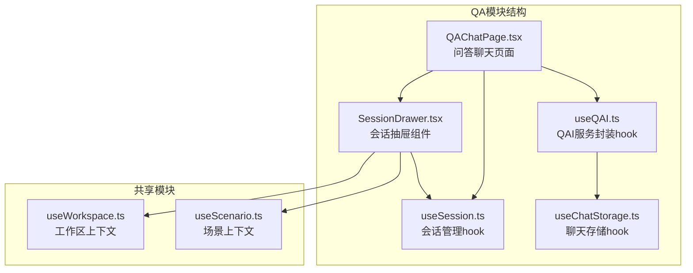
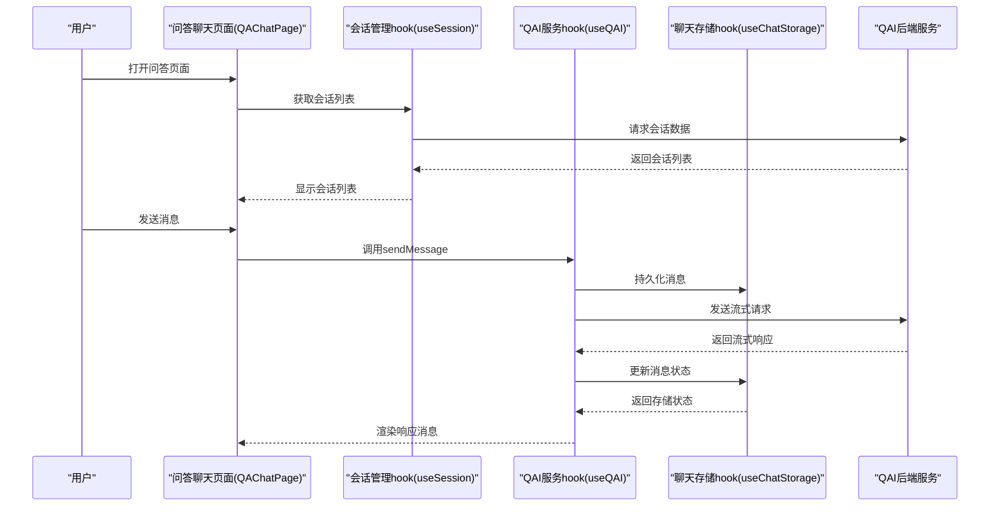
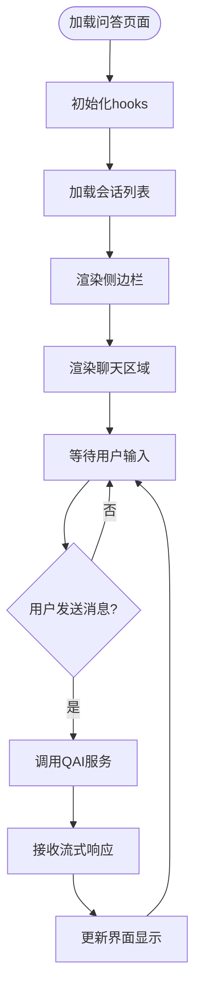
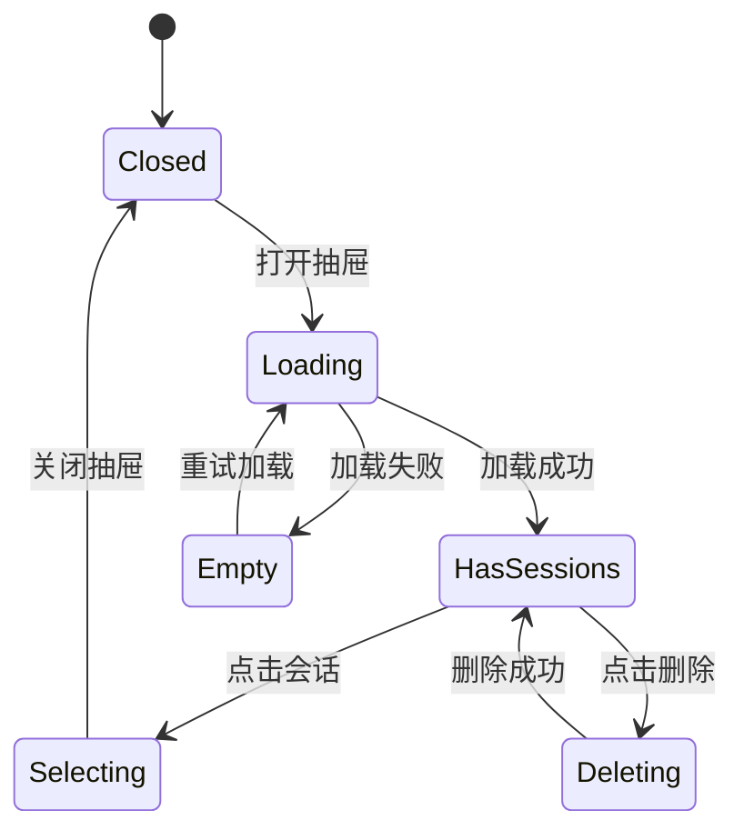
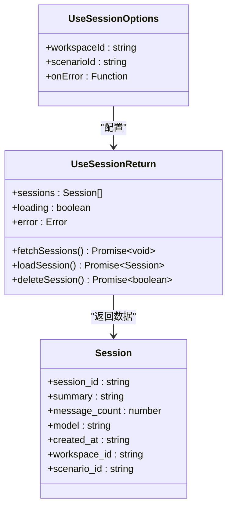
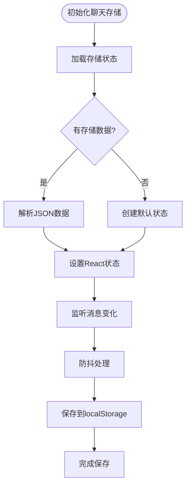
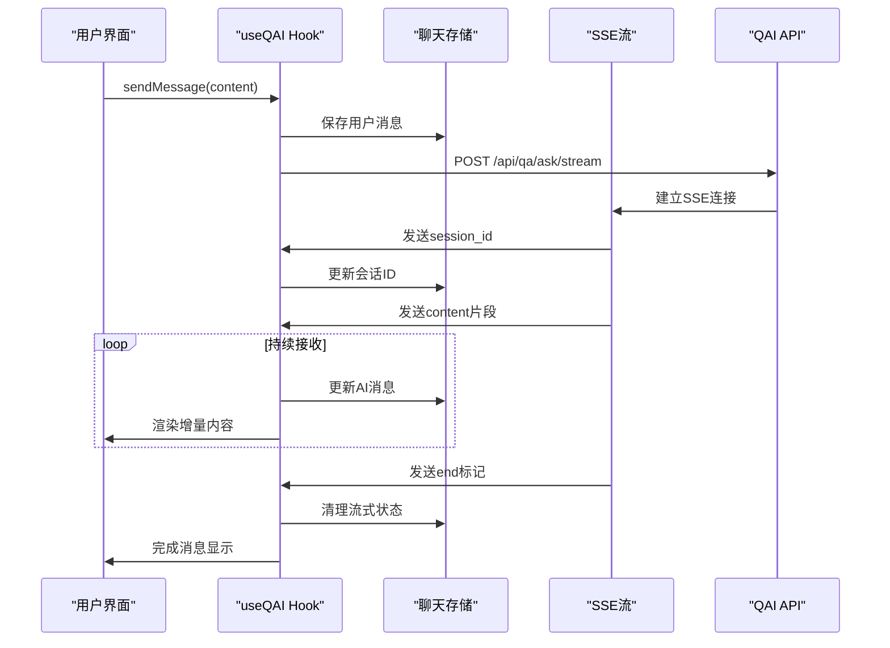
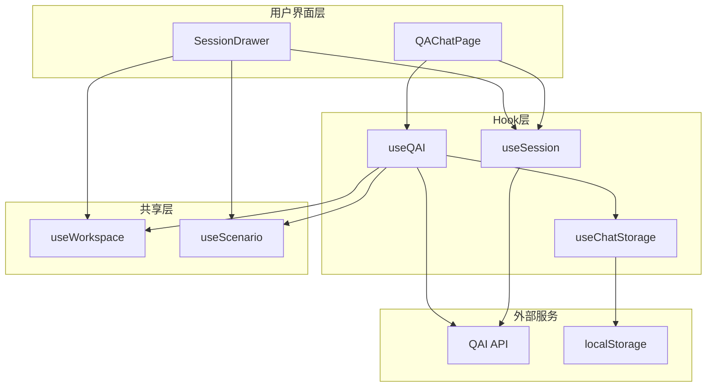

# QA模块

<cite>
**本文引用的文件**
- [QAChatPage.tsx](file://frontend/src/modules/qa/pages/QAChatPage.tsx)
- [SessionDrawer.tsx](file://frontend/src/modules/qa/components/SessionDrawer.tsx)
- [useSession.ts](file://frontend/src/modules/qa/hooks/useSession.ts)
- [useChatStorage.ts](file://frontend/src/modules/qa/hooks/useChatStorage.ts)
- [useQAI.ts](file://frontend/src/modules/qa/hooks/useQAI.ts)
- [useWorkspace.ts](file://frontend/src/modules/shared/hooks/useWorkspace.ts)
- [useScenario.ts](file://frontend/src/modules/shared/hooks/useScenario.ts)
</cite>

## 更新摘要
**变更内容**
- 新增完整的QA模块前端实现文档，涵盖问答聊天页面、会话抽屉和相关hooks
- 更新架构图以反映新的组件关系和数据流
- 增强实时通信和消息存储机制的详细说明
- 完善QAI服务集成和状态管理的实现细节
- 添加临时推理功能的用户界面设计

## 目录
1. [简介](#简介)
2. [项目结构](#项目结构)
3. [核心组件](#核心组件)
4. [架构总览](#架构总览)
5. [详细组件分析](#详细组件分析)
6. [依赖关系分析](#依赖关系分析)
7. [性能考量](#性能考量)
8. [故障排查指南](#故障排查指南)
9. [结论](#结论)
10. [附录](#附录)

## 简介
本文档全面介绍QA模块的前端实现，包括问答聊天页面、会话抽屉以及相关hooks的设计与实现。QA模块提供了完整的问答系统，支持实时聊天、会话管理、消息持久化和临时推理功能。模块采用现代化的React架构，集成了Ant Design组件库和自定义样式系统，为用户提供流畅的问答体验。

## 项目结构
QA模块位于前端工程的模块化目录下，采用按功能域划分的组织方式。模块包含页面组件、组件库、hooks、服务和存储等层次，形成了完整的前端实现体系。



**图表来源**
- [QAChatPage.tsx:1-1362](file://frontend/src/modules/qa/pages/QAChatPage.tsx#L1-L1362)
- [SessionDrawer.tsx:1-184](file://frontend/src/modules/qa/components/SessionDrawer.tsx#L1-L184)
- [useSession.ts:1-107](file://frontend/src/modules/qa/hooks/useSession.ts#L1-L107)
- [useChatStorage.ts:1-100](file://frontend/src/modules/qa/hooks/useChatStorage.ts#L1-L100)
- [useQAI.ts:1-304](file://frontend/src/modules/qa/hooks/useQAI.ts#L1-L304)

**章节来源**
- [QAChatPage.tsx:1-1362](file://frontend/src/modules/qa/pages/QAChatPage.tsx#L1-L1362)
- [SessionDrawer.tsx:1-184](file://frontend/src/modules/qa/components/SessionDrawer.tsx#L1-L184)
- [useSession.ts:1-107](file://frontend/src/modules/qa/hooks/useSession.ts#L1-L107)
- [useChatStorage.ts:1-100](file://frontend/src/modules/qa/hooks/useChatStorage.ts#L1-L100)
- [useQAI.ts:1-304](file://frontend/src/modules/qa/hooks/useQAI.ts#L1-L304)

## 核心组件
- **问答聊天页面**：提供完整的聊天界面，包括侧边栏会话管理、消息列表展示、输入区域和快捷操作按钮。
- **会话抽屉组件**：提供历史会话列表的抽屉式展示，支持会话选择、删除和加载状态显示。
- **会话管理hook**：封装会话列表获取、加载和删除操作，支持按工作区和场景过滤。
- **聊天存储hook**：负责消息持久化和状态恢复，支持防抖保存和本地存储管理。
- **QAI服务封装hook**：整合聊天存储与外部QAI服务，提供实时流式响应和会话生命周期管理。
- **共享上下文hook**：提供当前工作区与场景标识，作为会话管理与聊天存储的关键输入参数。

**章节来源**
- [QAChatPage.tsx:184-338](file://frontend/src/modules/qa/pages/QAChatPage.tsx#L184-L338)
- [SessionDrawer.tsx:90-184](file://frontend/src/modules/qa/components/SessionDrawer.tsx#L90-L184)
- [useSession.ts:30-107](file://frontend/src/modules/qa/hooks/useSession.ts#L30-L107)
- [useChatStorage.ts:21-100](file://frontend/src/modules/qa/hooks/useChatStorage.ts#L21-L100)
- [useQAI.ts:65-304](file://frontend/src/modules/qa/hooks/useQAI.ts#L65-L304)

## 架构总览
QA模块采用分层架构设计，从用户界面到数据存储形成完整的数据流。用户通过问答聊天页面与系统交互，系统通过hooks管理状态和数据流，最终与后端QAI服务进行通信。



**图表来源**
- [QAChatPage.tsx:1116-1148](file://frontend/src/modules/qa/pages/QAChatPage.tsx#L1116-L1148)
- [useSession.ts:35-58](file://frontend/src/modules/qa/hooks/useSession.ts#L35-L58)
- [useQAI.ts:146-291](file://frontend/src/modules/qa/hooks/useQAI.ts#L146-L291)
- [useChatStorage.ts:25-46](file://frontend/src/modules/qa/hooks/useChatStorage.ts#L25-L46)

## 详细组件分析

### 问答聊天页面（QAChatPage）
问答聊天页面是QA模块的核心组件，提供了完整的问答交互界面。页面采用左右布局设计，左侧为会话管理侧边栏，右侧为主聊天区域。

- **布局设计**
  - 左侧边栏宽度220px，支持折叠功能，折叠时宽度为60px
  - 主内容区域占满剩余空间，最大宽度900px居中显示
  - 聊天头部固定显示会话信息和操作按钮
  - 消息列表自动滚动到底部，支持欢迎页面和加载状态

- **核心功能**
  - 会话管理：支持新建会话、删除会话、切换会话
  - 实时聊天：支持流式响应，显示思考动画
  - 消息展示：支持用户消息和AI消息的不同样式
  - 快捷操作：提供快捷问题按钮和清除对话功能



**图表来源**
- [QAChatPage.tsx:1116-1148](file://frontend/src/modules/qa/pages/QAChatPage.tsx#L1116-L1148)
- [QAChatPage.tsx:635-744](file://frontend/src/modules/qa/pages/QAChatPage.tsx#L635-L744)

**章节来源**
- [QAChatPage.tsx:184-338](file://frontend/src/modules/qa/pages/QAChatPage.tsx#L184-L338)
- [QAChatPage.tsx:635-744](file://frontend/src/modules/qa/pages/QAChatPage.tsx#L635-L744)
- [QAChatPage.tsx:1116-1148](file://frontend/src/modules/qa/pages/QAChatPage.tsx#L1116-L1148)

### 会话抽屉组件（SessionDrawer）
会话抽屉组件提供历史会话的抽屉式展示，支持会话选择、删除和加载状态显示。

- **设计特点**
  - 右侧抽屉布局，大尺寸设计
  - 支持加载状态显示和空状态提示
  - 会话项悬停显示删除按钮
  - 时间格式化显示，支持多种时间表达

- **交互流程**
  - 打开抽屉时自动加载会话列表
  - 点击会话项触发选择回调
  - 删除会话时显示确认对话框
  - 支持Ant Design的Empty组件显示空状态



**图表来源**
- [SessionDrawer.tsx:90-184](file://frontend/src/modules/qa/components/SessionDrawer.tsx#L90-L184)

**章节来源**
- [SessionDrawer.tsx:1-184](file://frontend/src/modules/qa/components/SessionDrawer.tsx#L1-L184)

### 会话管理hook（useSession）
会话管理hook封装了会话相关的所有操作，包括获取、加载和删除会话。

- **核心功能**
  - `fetchSessions`: 获取会话列表，支持按工作区和场景过滤
  - `loadSession`: 加载指定会话的详细信息
  - `deleteSession`: 删除指定会话
  - 状态管理：loading、error、sessions

- **API集成**
  - 使用`/api/qa/sessions`端点获取会话列表
  - 支持查询参数：workspace_id、scenario_id
  - 错误处理：统一的错误状态和用户提示



**图表来源**
- [useSession.ts:15-28](file://frontend/src/modules/qa/hooks/useSession.ts#L15-L28)

**章节来源**
- [useSession.ts:1-107](file://frontend/src/modules/qa/hooks/useSession.ts#L1-L107)

### 聊天存储hook（useChatStorage）
聊天存储hook负责消息的持久化和状态恢复，采用了防抖机制优化性能。

- **存储策略**
  - 使用localStorage进行消息持久化
  - 支持按会话ID隔离存储
  - 防抖保存：500ms内多次修改合并为一次保存
  - 默认会话备份：支持无会话状态的消息存储

- **数据结构**
  ```typescript
  interface ChatStorageData {
    sessionId: string | null;
    messages: QAMessage[];
    currentSessionId: string | null;
    lastUpdated: number;
  }
  ```

- **性能优化**
  - 防抖机制：避免频繁的localStorage写入
  - 序列化缓存：避免重复序列化相同数据
  - 内存优化：组件卸载时清理定时器



**图表来源**
- [useChatStorage.ts:21-98](file://frontend/src/modules/qa/hooks/useChatStorage.ts#L21-L98)

**章节来源**
- [useChatStorage.ts:1-100](file://frontend/src/modules/qa/hooks/useChatStorage.ts#L1-L100)

### QAI服务封装hook（useQAI）
QAI服务封装hook是整个模块的核心，整合了聊天存储和外部QAI服务的调用。

- **实时通信**
  - 支持SSE流式响应
  - 实现增量消息更新
  - 支持消息中断和重试

- **状态管理**
  - 状态类型：idle、submitting、streaming、error
  - 自动会话ID管理
  - 错误状态处理和用户提示

- **消息处理**
  - 用户消息：绿色气泡样式
  - AI消息：白色气泡样式，支持思考动画
  - 溯源信息：支持参考来源展示



**图表来源**
- [useQAI.ts:146-291](file://frontend/src/modules/qa/hooks/useQAI.ts#L146-L291)

**章节来源**
- [useQAI.ts:1-304](file://frontend/src/modules/qa/hooks/useQAI.ts#L1-L304)

### 共享上下文hook（useWorkspace/useScenario）
共享上下文hook提供当前工作区与场景标识，作为会话管理与聊天存储的输入参数。

- **设计原则**
  - 独立于组件层级的状态管理
  - 支持全局状态订阅
  - 与路由状态解耦

- **与会话抽屉的协作**
  - 抽屉在打开时读取这两个值
  - 确保会话列表与聊天存储均作用于正确的上下文
  - 支持动态切换工作区和场景

**章节来源**
- [useWorkspace.ts:1-200](file://frontend/src/modules/shared/hooks/useWorkspace.ts#L1-L200)
- [useScenario.ts:1-200](file://frontend/src/modules/shared/hooks/useScenario.ts#L1-L200)

## 依赖关系分析
QA模块的组件间依赖关系清晰，遵循单向数据流原则，避免了循环依赖。

- **组件耦合**
  - 问答聊天页面依赖会话管理hook和QAI服务hook
  - 会话抽屉组件依赖会话管理hook和共享上下文hook
  - QAI服务hook依赖聊天存储hook和共享上下文hook

- **外部依赖**
  - Ant Design组件库：Layout、Button、Avatar、Empty等
  - Emotion CSS-in-JS：用于组件样式管理
  - 浏览器API：localStorage、AbortController、ReadableStream

- **数据流**
  - 用户输入 → QAChatPage → useQAI → QAI服务
  - 会话数据 → useSession → 后端API
  - 消息状态 → useChatStorage → localStorage



**图表来源**
- [QAChatPage.tsx:4-9](file://frontend/src/modules/qa/pages/QAChatPage.tsx#L4-L9)
- [useSession.ts:3-4](file://frontend/src/modules/qa/hooks/useSession.ts#L3-L4)
- [useQAI.ts:3-7](file://frontend/src/modules/qa/hooks/useQAI.ts#L3-L7)

**章节来源**
- [QAChatPage.tsx:1-1362](file://frontend/src/modules/qa/pages/QAChatPage.tsx#L1-L1362)
- [SessionDrawer.tsx:1-184](file://frontend/src/modules/qa/components/SessionDrawer.tsx#L1-L184)
- [useSession.ts:1-107](file://frontend/src/modules/qa/hooks/useSession.ts#L1-L107)
- [useChatStorage.ts:1-100](file://frontend/src/modules/qa/hooks/useChatStorage.ts#L1-L100)
- [useQAI.ts:1-304](file://frontend/src/modules/qa/hooks/useQAI.ts#L1-L304)

## 性能考量
QA模块在设计时充分考虑了性能优化，采用了多种策略提升用户体验。

- **渲染优化**
  - 使用React.memo和useMemo避免不必要的重渲染
  - 虚拟滚动：会话列表支持大量数据的虚拟化渲染
  - 消息列表自动滚动优化：仅在新消息到达时滚动

- **存储优化**
  - localStorage防抖保存：500ms内多次修改合并保存
  - 序列化缓存：避免重复序列化相同数据
  - 内存泄漏防护：组件卸载时清理定时器和事件监听器

- **网络优化**
  - AbortController支持：支持消息发送中断
  - 流式响应：SSE流式传输减少首字节延迟
  - 错误重试：网络异常时提供重试机制

- **状态管理优化**
  - 分离关注点：每个hook负责单一职责
  - 状态最小化：只存储必要的状态数据
  - 异步状态：使用loading、error等状态指示器

## 故障排查指南
针对QA模块可能出现的问题，提供详细的排查步骤和解决方案。

- **会话加载失败**
  - 检查API端点：确认`/api/qa/sessions`端点可达
  - 验证认证：确保工作区和场景ID有效
  - 查看网络：使用浏览器开发者工具检查网络请求

- **消息发送失败**
  - 检查流式API：确认`/api/qa/ask/stream`端点正常
  - 验证会话状态：确认sessionId有效且存在
  - 查看错误处理：检查useQAI的错误状态和用户提示

- **消息持久化问题**
  - 检查localStorage：确认浏览器允许localStorage访问
  - 验证存储格式：检查ChatStorageData的数据结构
  - 查看防抖机制：确认防抖定时器正常工作

- **实时通信问题**
  - 检查SSE支持：确认浏览器支持Server-Sent Events
  - 验证流式响应：检查JSON格式的SSE数据
  - 查看中断处理：确认AbortController正常工作

**章节来源**
- [useSession.ts:35-58](file://frontend/src/modules/qa/hooks/useSession.ts#L35-L58)
- [useQAI.ts:146-291](file://frontend/src/modules/qa/hooks/useQAI.ts#L146-L291)
- [useChatStorage.ts:25-46](file://frontend/src/modules/qa/hooks/useChatStorage.ts#L25-L46)

## 结论
QA模块前端实现展现了现代React应用的最佳实践，通过清晰的组件分离、完善的错误处理和性能优化策略，为用户提供了流畅的问答体验。模块的架构设计具有良好的扩展性，可以轻松添加新功能和集成更多服务。

主要优势包括：
- **模块化设计**：每个组件和hook都有明确的职责边界
- **实时通信**：支持SSE流式响应，提供即时反馈
- **状态管理**：完善的错误处理和用户提示机制
- **性能优化**：防抖保存、虚拟滚动、内存泄漏防护
- **用户体验**：丰富的交互效果和友好的错误提示

建议的后续改进方向：
- 增加更多的主题支持和个性化选项
- 实现消息的富文本编辑功能
- 添加语音输入和输出功能
- 优化移动端适配和触摸交互
- 增强离线功能和数据同步机制

## 附录
- **实现示例路径**
  - 问答聊天页面：[QAChatPage.tsx:184-338](file://frontend/src/modules/qa/pages/QAChatPage.tsx#L184-L338)
  - 会话抽屉组件：[SessionDrawer.tsx:90-184](file://frontend/src/modules/qa/components/SessionDrawer.tsx#L90-L184)
  - 会话管理hook：[useSession.ts:30-107](file://frontend/src/modules/qa/hooks/useSession.ts#L30-L107)
  - 聊天存储hook：[useChatStorage.ts:21-100](file://frontend/src/modules/qa/hooks/useChatStorage.ts#L21-L100)
  - QAI服务封装hook：[useQAI.ts:65-304](file://frontend/src/modules/qa/hooks/useQAI.ts#L65-L304)
  - 工作区上下文hook：[useWorkspace.ts:1-200](file://frontend/src/modules/shared/hooks/useWorkspace.ts#L1-L200)
  - 场景上下文hook：[useScenario.ts:1-200](file://frontend/src/modules/shared/hooks/useScenario.ts#L1-L200)

- **API端点参考**
  - 会话列表：`GET /api/qa/sessions`
  - 会话详情：`GET /api/qa/sessions/{id}`
  - 删除会话：`DELETE /api/qa/sessions/{id}`
  - 问答请求：`POST /api/qa/ask`
  - 流式问答：`POST /api/qa/ask/stream`

- **状态类型定义**
  - 会话状态：`active | idle | closed`
  - 消息角色：`user | assistant`
  - Hook状态：`idle | submitting | streaming | error`