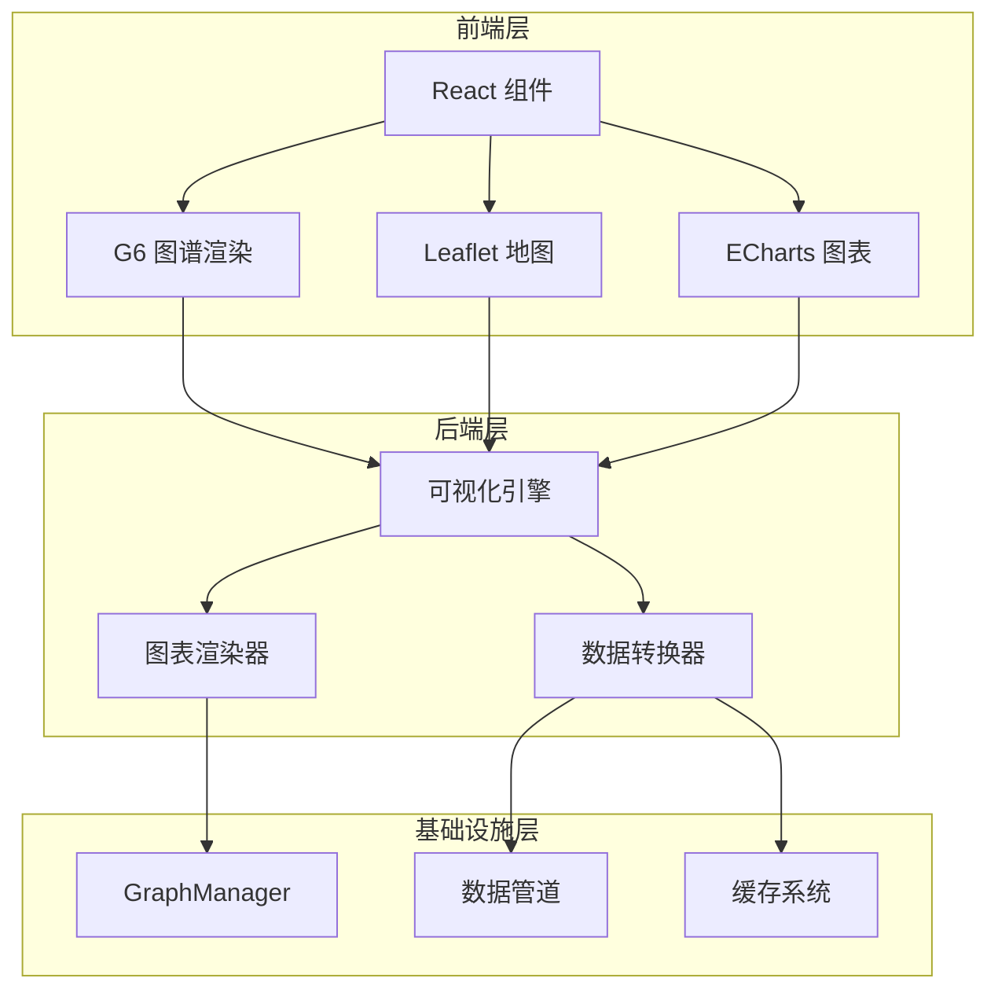
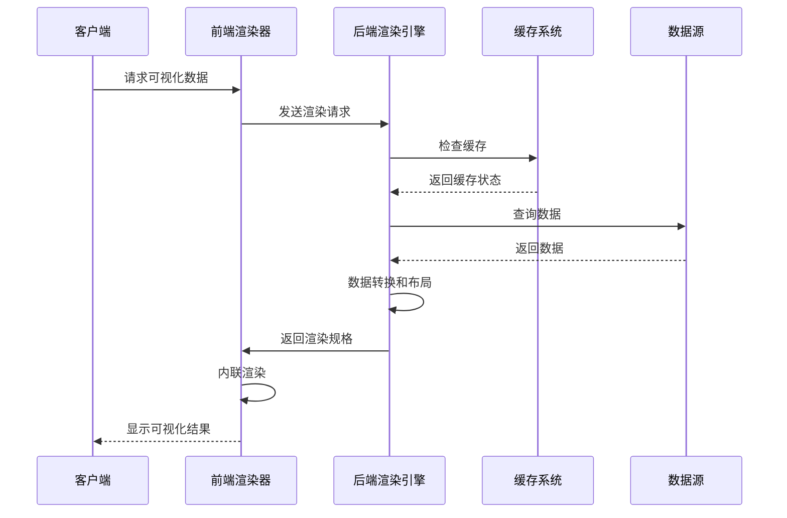
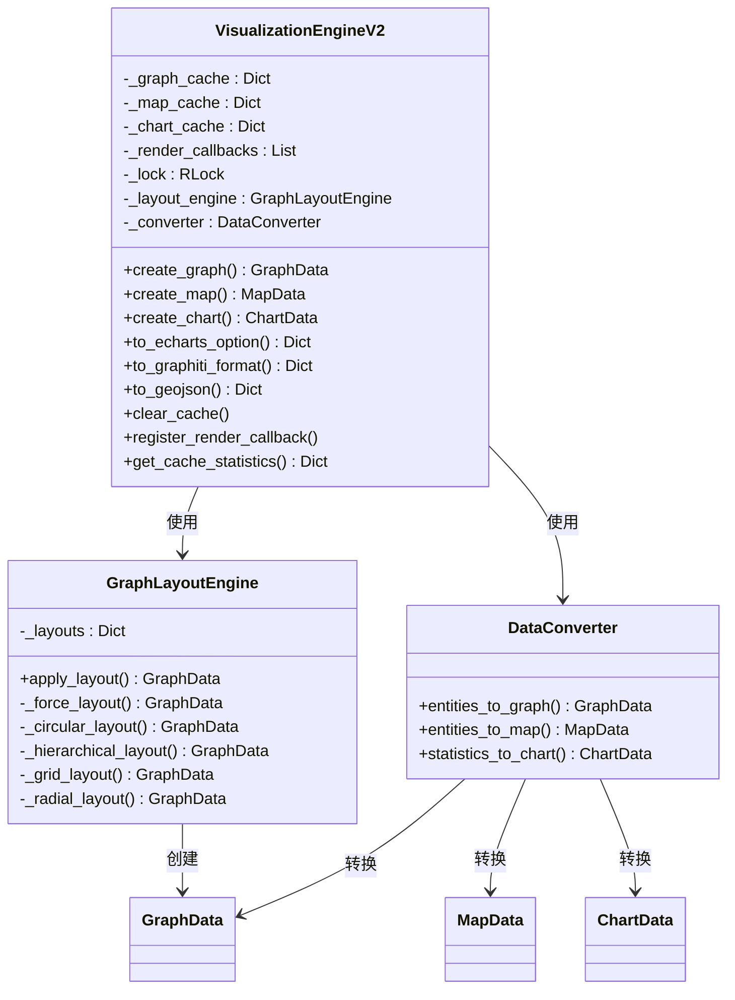
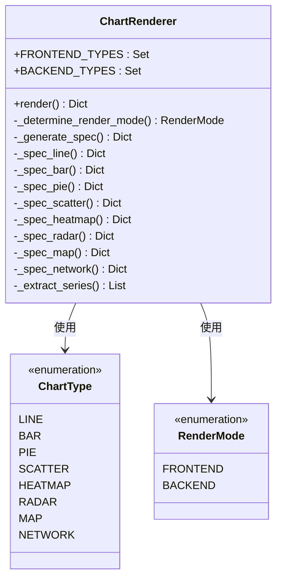
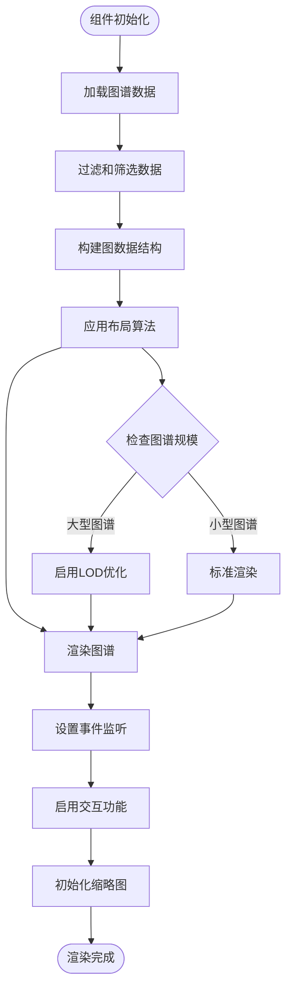
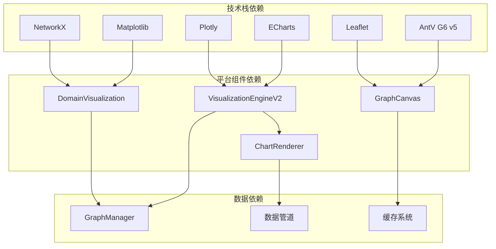

# 内联渲染能力

<cite>
**本文档引用的文件**
- [README.md](file://README.md)
- [chart_renderer.py](file://odap/biz/data/qa/impl/chart_renderer.py)
- [plotting.py](file://odap/tools/visualization/plotting.py)
- [visualization_engine.py](file://odap/biz/simulation/visualization/visualization_engine.py)
- [GraphCanvas.tsx](file://frontend/src/modules/ontology/components/GraphCanvas.tsx)
- [test_headless_rendering.py](file://openharness/scripts/test_headless_rendering.py)
- [DESIGN.md](file://docs/03-modules/visualization/DESIGN.md)
- [DESIGN_GRAPH_OPTIMIZATION.md](file://docs/03-modules/visualization/DESIGN_GRAPH_OPTIMIZATION.md)
- [ADR-045_frontend_visualization_g6_leaflet.md](file://docs/07-adr/ADR-045_frontend_visualization_g6_leaflet.md)
- [test_visualization.py](file://tests/unit/test_visualization.py)
</cite>

## 目录
1. [简介](#简介)
2. [项目结构](#项目结构)
3. [核心组件](#核心组件)
4. [架构总览](#架构总览)
5. [详细组件分析](#详细组件分析)
6. [依赖关系分析](#依赖关系分析)
7. [性能考量](#性能考量)
8. [故障排除指南](#故障排除指南)
9. [结论](#结论)

## 简介

内联渲染能力是本体驱动分析决策平台（ODAP）的核心功能之一，负责在运行时动态生成和展示各种类型的可视化内容。该能力涵盖了图表渲染、图谱可视化、地图渲染、时序数据展示等多个方面，为用户提供直观的数据洞察和分析体验。

平台采用多层次的渲染架构，包括后端渲染引擎、前端交互式可视化组件，以及专门的内联渲染解决方案。这种设计确保了在不同场景下都能提供最佳的渲染性能和用户体验。

## 项目结构

ODAP项目的可视化相关组件分布在多个层次中：

**图表来源**
- [README.md:27-122](file://README.md#L27-L122)
- [DESIGN.md:1-851](file://docs/03-modules/visualization/DESIGN.md#L1-L851)

**章节来源**
- [README.md:27-122](file://README.md#L27-L122)

## 核心组件

### 后端渲染引擎

后端渲染引擎是整个内联渲染系统的核心，提供了统一的可视化抽象和数据转换能力。

**章节来源**
- [visualization_engine.py:378-589](file://odap/biz/simulation/visualization/visualization_engine.py#L378-L589)

### 图表渲染器

图表渲染器专门处理各种图表类型的内联渲染，支持多种图表类型和渲染模式。

**章节来源**
- [chart_renderer.py:25-93](file://odap/biz/data/qa/impl/chart_renderer.py#L25-L93)

### 前端可视化组件

前端层提供了丰富的可视化组件，特别是基于AntV G6的图谱渲染能力和基于Leaflet的地图渲染能力。

**章节来源**
- [GraphCanvas.tsx:51-121](file://frontend/src/modules/ontology/components/GraphCanvas.tsx#L51-L121)

## 架构总览

内联渲染能力采用分层架构设计，确保了系统的可扩展性和性能优化：

**图表来源**
- [visualization_engine.py:378-465](file://odap/biz/simulation/visualization/visualization_engine.py#L378-L465)
- [chart_renderer.py:33-60](file://odap/biz/data/qa/impl/chart_renderer.py#L33-L60)

## 详细组件分析

### 可视化引擎V2

可视化引擎V2是后端渲染系统的核心组件，提供了统一的可视化抽象和数据管理能力。

**图表来源**
- [visualization_engine.py:378-589](file://odap/biz/simulation/visualization/visualization_engine.py#L378-L589)
- [visualization_engine.py:153-236](file://odap/biz/simulation/visualization/visualization_engine.py#L153-L236)
- [visualization_engine.py:238-376](file://odap/biz/simulation/visualization/visualization_engine.py#L238-L376)

**章节来源**
- [visualization_engine.py:153-589](file://odap/biz/simulation/visualization/visualization_engine.py#L153-L589)

### 图表渲染器

图表渲染器提供了灵活的图表内联渲染能力，支持多种图表类型和渲染模式。

**图表来源**
- [chart_renderer.py:25-93](file://odap/biz/data/qa/impl/chart_renderer.py#L25-L93)
- [chart_renderer.py:9-23](file://odap/biz/data/qa/impl/chart_renderer.py#L9-L23)

**章节来源**
- [chart_renderer.py:25-287](file://odap/biz/data/qa/impl/chart_renderer.py#L25-L287)

### 前端图谱渲染组件

前端图谱渲染组件基于AntV G6实现了高性能的内联渲染能力，支持多种布局算法和交互功能。

**图表来源**
- [GraphCanvas.tsx:188-205](file://frontend/src/modules/ontology/components/GraphCanvas.tsx#L188-L205)
- [GraphCanvas.tsx:288-300](file://frontend/src/modules/ontology/components/GraphCanvas.tsx#L288-L300)

**章节来源**
- [GraphCanvas.tsx:188-800](file://frontend/src/modules/ontology/components/GraphCanvas.tsx#L188-L800)

### 内联渲染测试

平台提供了完整的内联渲染测试套件，确保渲染质量和性能。

**章节来源**
- [test_headless_rendering.py:137-167](file://openharness/scripts/test_headless_rendering.py#L137-L167)

## 依赖关系分析

内联渲染能力涉及多个层面的依赖关系：

**图表来源**
- [ADR-045_frontend_visualization_g6_leaflet.md:24-27](file://docs/07-adr/ADR-045_frontend_visualization_g6_leaflet.md#L24-L27)
- [DESIGN.md:15-18](file://docs/03-modules/visualization/DESIGN.md#L15-L18)

**章节来源**
- [ADR-045_frontend_visualization_g6_leaflet.md:1-76](file://docs/07-adr/ADR-045_frontend_visualization_g6_leaflet.md#L1-L76)
- [DESIGN.md:1-851](file://docs/03-modules/visualization/DESIGN.md#L1-L851)

## 性能考量

内联渲染能力在设计时充分考虑了性能优化：

### 大规模图谱优化

对于大规模图谱，系统采用了多层次的优化策略：

1. **LOD分级渲染**：根据缩放级别动态调整渲染细节
2. **WebGL渲染**：超过阈值的图谱自动切换到WebGL模式
3. **虚拟画布**：仅渲染可视区域内的元素
4. **布局算法优化**：使用高效的布局算法减少计算开销

### 缓存策略

系统实现了多级缓存机制：

- **渲染结果缓存**：避免重复渲染相同内容
- **数据缓存**：缓存查询结果和中间计算结果
- **组件状态缓存**：保持用户交互状态的一致性

### 性能监控

平台提供了完整的性能监控能力：

- **渲染时间统计**：跟踪每次渲染的耗时
- **内存使用监控**：监控内存占用情况
- **FPS监控**：实时监控渲染帧率

## 故障排除指南

### 常见问题及解决方案

#### 图谱渲染异常

**问题描述**：图谱渲染失败或显示异常

**可能原因**：
1. 数据格式不正确
2. 布局算法计算错误
3. 内存不足

**解决步骤**：
1. 检查数据格式是否符合预期
2. 验证节点和边的关系完整性
3. 监控内存使用情况
4. 考虑启用LOD优化

#### 性能问题

**问题描述**：渲染性能下降

**诊断方法**：
1. 检查节点数量是否超出阈值
2. 监控渲染时间
3. 分析内存使用情况

**优化建议**：
1. 启用LOD分级渲染
2. 减少标签显示
3. 使用WebGL渲染模式
4. 实施数据分页

#### 交互功能异常

**问题描述**：鼠标交互或缩放功能失效

**排查步骤**：
1. 检查事件绑定是否正常
2. 验证DOM元素是否存在
3. 确认CSS样式是否正确
4. 测试浏览器兼容性

**章节来源**
- [GraphCanvas.tsx:986-1031](file://frontend/src/modules/ontology/components/GraphCanvas.tsx#L986-L1031)

## 结论

内联渲染能力作为ODAP平台的核心功能，通过精心设计的分层架构和优化策略，为用户提供了强大而高效的可视化体验。系统不仅支持多种渲染模式和图表类型，还具备完善的性能优化和故障排除机制。

未来的发展方向包括：
1. 进一步优化大规模图谱的渲染性能
2. 增强实时数据更新能力
3. 扩展更多的可视化类型和交互功能
4. 提升跨平台兼容性和移动端体验

通过持续的技术创新和性能优化，内联渲染能力将继续为本体驱动的分析决策提供强有力的支持。