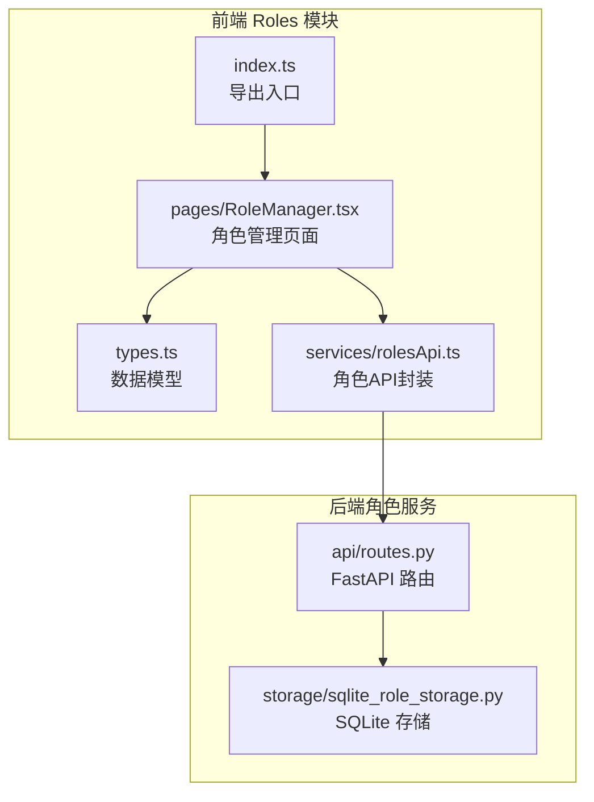
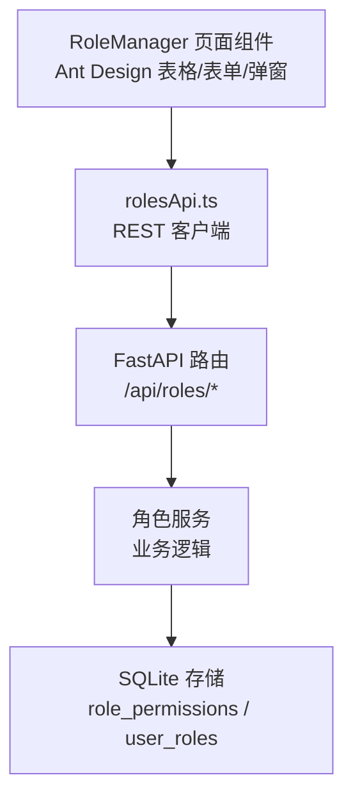
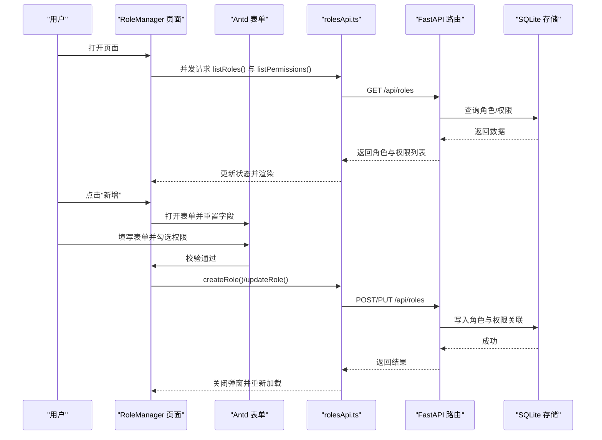
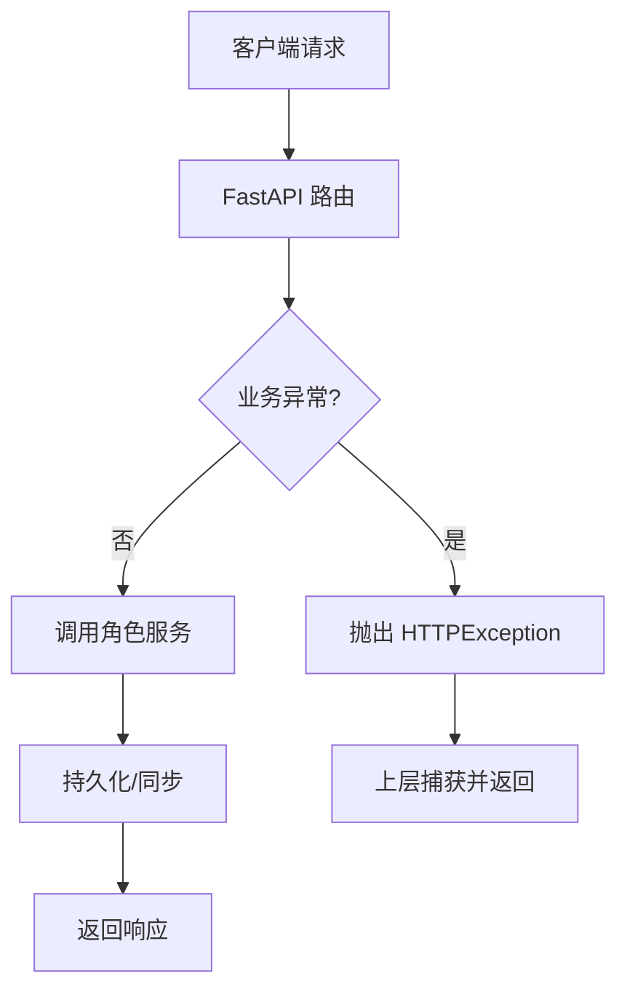
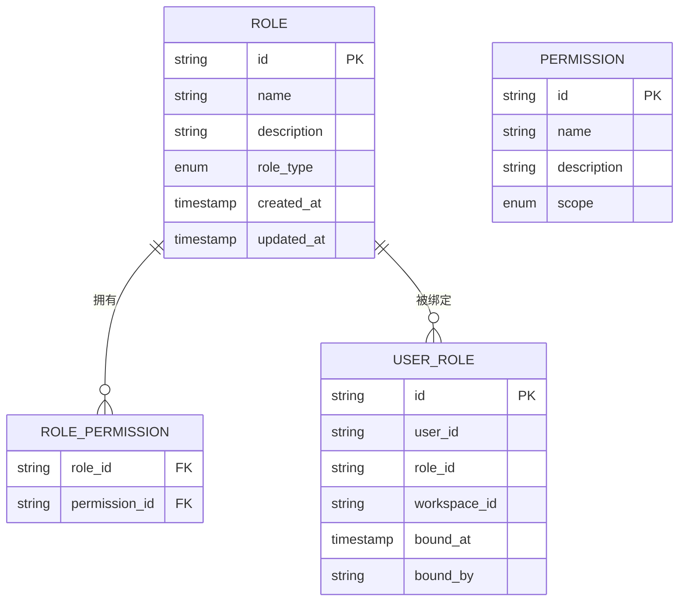

# Roles模块

<cite>
**本文引用的文件**
- [frontend/src/modules/roles/index.ts](file://frontend/src/modules/roles/index.ts)
- [frontend/src/modules/roles/types.ts](file://frontend/src/modules/roles/types.ts)
- [frontend/src/modules/roles/pages/RoleManager.tsx](file://frontend/src/modules/roles/pages/RoleManager.tsx)
- [frontend/src/modules/roles/services/rolesApi.ts](file://frontend/src/modules/roles/services/rolesApi.ts)
- [odap/biz/platform/roles/api/routes.py](file://odap/biz/platform/roles/api/routes.py)
- [odap/biz/platform/roles/storage/sqlite_role_storage.py](file://odap/biz/platform/roles/storage/sqlite_role_storage.py)
- [tests/unit/test_roles.py](file://tests/unit/test_roles.py)
- [docs/02-architecture/ARCHITECTURE_BIZ.md](file://docs/02-architecture/ARCHITECTURE_BIZ.md)
- [tests/e2e/test_e2e_flows.py](file://tests/e2e/test_e2e_flows.py)
</cite>

## 目录
1. [简介](#简介)
2. [项目结构](#项目结构)
3. [核心组件](#核心组件)
4. [架构总览](#架构总览)
5. [详细组件分析](#详细组件分析)
6. [依赖分析](#依赖分析)
7. [性能考虑](#性能考虑)
8. [故障排查指南](#故障排查指南)
9. [结论](#结论)
10. [附录](#附录)

## 简介
本文件面向前端工程师与产品人员，系统性梳理 Roles 模块在前端的实现与交互，涵盖角色管理与用户管理页面的界面设计、状态管理、表单处理逻辑；并结合后端 API 设计与权限模型，说明角色权限的数据结构、用户分配与权限控制流程。文档同时提供关键流程的时序图与类图，帮助读者快速理解从界面到后端存储的完整链路。

## 项目结构
Roles 模块位于前端模块化目录下，采用“按功能域划分”的组织方式：页面组件、类型定义、API 服务等分别置于独立文件中，便于维护与复用。

**图表来源**
- [frontend/src/modules/roles/index.ts:1-5](file://frontend/src/modules/roles/index.ts#L1-L5)
- [frontend/src/modules/roles/types.ts:1-31](file://frontend/src/modules/roles/types.ts#L1-L31)
- [frontend/src/modules/roles/pages/RoleManager.tsx:1-319](file://frontend/src/modules/roles/pages/RoleManager.tsx#L1-L319)
- [frontend/src/modules/roles/services/rolesApi.ts:1-35](file://frontend/src/modules/roles/services/rolesApi.ts#L1-L35)
- [odap/biz/platform/roles/api/routes.py:1-46](file://odap/biz/platform/roles/api/routes.py#L1-L46)
- [odap/biz/platform/roles/storage/sqlite_role_storage.py:531-560](file://odap/biz/platform/roles/storage/sqlite_role_storage.py#L531-L560)

**章节来源**
- [frontend/src/modules/roles/index.ts:1-5](file://frontend/src/modules/roles/index.ts#L1-L5)
- [frontend/src/modules/roles/types.ts:1-31](file://frontend/src/modules/roles/types.ts#L1-L31)
- [frontend/src/modules/roles/pages/RoleManager.tsx:1-319](file://frontend/src/modules/roles/pages/RoleManager.tsx#L1-L319)
- [frontend/src/modules/roles/services/rolesApi.ts:1-35](file://frontend/src/modules/roles/services/rolesApi.ts#L1-L35)
- [odap/biz/platform/roles/api/routes.py:1-46](file://odap/biz/platform/roles/api/routes.py#L1-L46)
- [odap/biz/platform/roles/storage/sqlite_role_storage.py:531-560](file://odap/biz/platform/roles/storage/sqlite_role_storage.py#L531-L560)

## 核心组件
- 数据模型（types.ts）
  - 权限（Permission）：包含标识、名称、描述、作用域与动作集合
  - 角色（Role）：包含标识、名称、描述、角色类型、权限列表及时间戳
  - 创建/更新请求体（RoleCreate/RoleUpdate）：用于前后端传输
- 页面组件（RoleManager.tsx）
  - 列表展示、新增/编辑弹窗、权限勾选、删除确认、统计卡片
  - 使用 Ant Design 组件库与表单校验
- API 封装（rolesApi.ts）
  - 提供角色列表、详情、创建、更新、删除、权限列表等方法
  - 统一封装基础地址与响应格式处理

**章节来源**
- [frontend/src/modules/roles/types.ts:1-31](file://frontend/src/modules/roles/types.ts#L1-L31)
- [frontend/src/modules/roles/pages/RoleManager.tsx:1-319](file://frontend/src/modules/roles/pages/RoleManager.tsx#L1-L319)
- [frontend/src/modules/roles/services/rolesApi.ts:1-35](file://frontend/src/modules/roles/services/rolesApi.ts#L1-L35)

## 架构总览
Roles 模块的前端采用“页面组件 + 类型 + API 封装”的分层设计；页面组件负责状态与交互，API 封装负责与后端通信；后端通过 FastAPI 路由暴露 REST 接口，并使用 SQLite 存储角色与权限关系，支持将角色与用户进行绑定。

**图表来源**
- [frontend/src/modules/roles/pages/RoleManager.tsx:1-319](file://frontend/src/modules/roles/pages/RoleManager.tsx#L1-L319)
- [frontend/src/modules/roles/services/rolesApi.ts:1-35](file://frontend/src/modules/roles/services/rolesApi.ts#L1-L35)
- [odap/biz/platform/roles/api/routes.py:1-46](file://odap/biz/platform/roles/api/routes.py#L1-L46)
- [odap/biz/platform/roles/storage/sqlite_role_storage.py:531-560](file://odap/biz/platform/roles/storage/sqlite_role_storage.py#L531-L560)

## 详细组件分析

### 角色管理页面（RoleManager）
- 状态管理
  - 角色列表、权限列表、加载状态、弹窗可见性、编辑中的角色对象、表单实例、已选权限 ID 集合
- 加载与刷新
  - 初始化并发拉取角色与权限列表，异常统一提示，最终关闭加载态
- 表单与交互
  - 新增/编辑弹窗，表单项含名称、描述、角色类型、权限勾选组
  - 提交前校验表单，组装 RoleCreate/RoleUpdate 请求体，调用对应 API
- 渲染与样式
  - Ant Design 表格列含角色名称、类型标签、描述、权限数量、创建时间
  - 角色类型映射颜色与中文标签，权限作用域映射中文标签
- 用户管理联动
  - 页面提供“新增角色”入口，配合后端用户角色绑定接口完成用户分配

**图表来源**
- [frontend/src/modules/roles/pages/RoleManager.tsx:26-45](file://frontend/src/modules/roles/pages/RoleManager.tsx#L26-L45)
- [frontend/src/modules/roles/pages/RoleManager.tsx:47-99](file://frontend/src/modules/roles/pages/RoleManager.tsx#L47-L99)
- [frontend/src/modules/roles/services/rolesApi.ts:4-29](file://frontend/src/modules/roles/services/rolesApi.ts#L4-L29)
- [odap/biz/platform/roles/api/routes.py:26-46](file://odap/biz/platform/roles/api/routes.py#L26-L46)
- [odap/biz/platform/roles/storage/sqlite_role_storage.py:531-560](file://odap/biz/platform/roles/storage/sqlite_role_storage.py#L531-L560)

**章节来源**
- [frontend/src/modules/roles/pages/RoleManager.tsx:17-319](file://frontend/src/modules/roles/pages/RoleManager.tsx#L17-L319)

### 角色 API 设计与实现
- 接口清单
  - GET /api/roles：分页列出角色
  - GET /api/roles/{role_id}：获取角色详情
  - POST /api/roles：创建角色
  - PUT /api/roles/{role_id}：更新角色
  - DELETE /api/roles/{role_id}：删除角色
  - GET /api/roles/permissions/all：列出全部权限
- 错误处理
  - 路由层捕获异常并返回 500 或 4xx 明确错误信息
- 与权限系统的集成
  - 路由层引入 OPA 同步组件，用于角色变更后的策略同步

**图表来源**
- [odap/biz/platform/roles/api/routes.py:26-46](file://odap/biz/platform/roles/api/routes.py#L26-L46)

**章节来源**
- [frontend/src/modules/roles/services/rolesApi.ts:1-35](file://frontend/src/modules/roles/services/rolesApi.ts#L1-L35)
- [odap/biz/platform/roles/api/routes.py:1-46](file://odap/biz/platform/roles/api/routes.py#L1-L46)

### 权限数据结构与用户分配
- 权限模型
  - 权限包含标识、名称、描述、作用域（系统/项目/资源/数据）、动作数组
  - 角色包含标识、名称、描述、角色类型、权限列表、时间戳
- 用户分配
  - 支持将角色绑定到用户，可选工作空间维度
  - 提供撤销绑定能力
- 单元测试覆盖
  - 测试角色的创建、更新、查询与权限列表一致性

**图表来源**
- [frontend/src/modules/roles/types.ts:1-31](file://frontend/src/modules/roles/types.ts#L1-L31)
- [odap/biz/platform/roles/storage/sqlite_role_storage.py:531-560](file://odap/biz/platform/roles/storage/sqlite_role_storage.py#L531-L560)

**章节来源**
- [frontend/src/modules/roles/types.ts:1-31](file://frontend/src/modules/roles/types.ts#L1-L31)
- [odap/biz/platform/roles/storage/sqlite_role_storage.py:531-560](file://odap/biz/platform/roles/storage/sqlite_role_storage.py#L531-L560)
- [tests/unit/test_roles.py:42-88](file://tests/unit/test_roles.py#L42-L88)

### 角色组件状态管理与表单处理
- 状态要点
  - roles、permissions：列表数据
  - loading：加载态
  - modalVisible：弹窗开关
  - editingRole：当前编辑角色或空
  - form：Antd 表单实例
  - selectedPermissions：勾选的权限 ID 集合
- 表单处理
  - 新增：清空编辑态，重置表单，打开弹窗
  - 编辑：填充表单字段，预选权限，打开弹窗
  - 提交：校验表单，区分新增/更新，调用对应 API，关闭弹窗并刷新
- 权限选择
  - 使用 Checkbox.Group 展示权限列表，支持多选并实时更新 selectedPermissions

**章节来源**
- [frontend/src/modules/roles/pages/RoleManager.tsx:17-319](file://frontend/src/modules/roles/pages/RoleManager.tsx#L17-L319)

### 角色管理页面的 UI 设计与操作流程
- 布局
  - 顶部统计卡片：角色总数、权限总数
  - 主表格：角色名称、角色类型（带颜色标签）、描述、权限数量、创建时间、操作按钮
  - 弹窗表单：名称、描述、角色类型、权限勾选组
- 操作流程
  - 新增：点击“新增角色”，填写表单并勾选权限，提交创建
  - 编辑：点击“编辑”，修改信息并保存
  - 删除：点击“删除”，二次确认后移除
  - 刷新：每次提交后重新加载数据

**章节来源**
- [frontend/src/modules/roles/pages/RoleManager.tsx:154-223](file://frontend/src/modules/roles/pages/RoleManager.tsx#L154-L223)
- [frontend/src/modules/roles/pages/RoleManager.tsx:257-316](file://frontend/src/modules/roles/pages/RoleManager.tsx#L257-L316)

## 依赖分析
- 前端模块内聚
  - RoleManager 仅依赖 types.ts 与 rolesApi.ts，职责清晰
- 前后端耦合
  - 前端 API 方法与后端路由路径一一对应
- 存储依赖
  - 后端通过 SQLite 存储角色与权限的多对多关系，以及角色到用户的绑定关系

**图表来源**
- [frontend/src/modules/roles/pages/RoleManager.tsx:1-319](file://frontend/src/modules/roles/pages/RoleManager.tsx#L1-L319)
- [frontend/src/modules/roles/services/rolesApi.ts:1-35](file://frontend/src/modules/roles/services/rolesApi.ts#L1-L35)
- [odap/biz/platform/roles/api/routes.py:1-46](file://odap/biz/platform/roles/api/routes.py#L1-L46)
- [odap/biz/platform/roles/storage/sqlite_role_storage.py:531-560](file://odap/biz/platform/roles/storage/sqlite_role_storage.py#L531-L560)

**章节来源**
- [frontend/src/modules/roles/pages/RoleManager.tsx:1-319](file://frontend/src/modules/roles/pages/RoleManager.tsx#L1-L319)
- [frontend/src/modules/roles/services/rolesApi.ts:1-35](file://frontend/src/modules/roles/services/rolesApi.ts#L1-L35)
- [odap/biz/platform/roles/api/routes.py:1-46](file://odap/biz/platform/roles/api/routes.py#L1-L46)
- [odap/biz/platform/roles/storage/sqlite_role_storage.py:531-560](file://odap/biz/platform/roles/storage/sqlite_role_storage.py#L531-L560)

## 性能考虑
- 并发加载：初始化时并发请求角色与权限列表，减少首屏等待
- 表单校验：在提交前进行本地校验，避免无效网络请求
- 列表分页：后端提供分页参数，前端可结合分页控件优化大数据量场景
- 弹窗渲染：权限勾选组支持滚动容器，避免长列表导致的渲染压力

## 故障排查指南
- 常见问题
  - 加载失败：检查 API 基础地址与网络连通性，查看控制台错误日志
  - 提交失败：确认表单必填项与权限选择，查看后端返回的错误信息
  - 删除失败：确认角色是否被用户绑定，必要时先解除绑定再删除
- 单元测试参考
  - 参考单元测试用例定位角色 CRUD 与权限列表行为是否符合预期

**章节来源**
- [frontend/src/modules/roles/pages/RoleManager.tsx:30-45](file://frontend/src/modules/roles/pages/RoleManager.tsx#L30-L45)
- [frontend/src/modules/roles/pages/RoleManager.tsx:66-75](file://frontend/src/modules/roles/pages/RoleManager.tsx#L66-L75)
- [tests/unit/test_roles.py:42-88](file://tests/unit/test_roles.py#L42-L88)

## 结论
Roles 模块在前端实现了简洁直观的角色管理界面，结合后端 REST API 与 SQLite 存储，提供了角色 CRUD、权限列表与角色到用户的绑定能力。页面通过并发加载、表单校验与弹窗交互提升了用户体验；后端路由层对异常进行了统一处理，并与权限系统保持同步。整体架构清晰、职责明确，具备良好的扩展性与可维护性。

## 附录
- 架构文档中的角色管理接口定义（概念性参考）
  - 包含角色 CRUD、技能分配、策略绑定、修改生效控制等接口
- 端到端测试中的角色策略绑定示例
  - 展示了角色与策略的绑定与查询流程

**章节来源**
- [docs/02-architecture/ARCHITECTURE_BIZ.md:1614-1675](file://docs/02-architecture/ARCHITECTURE_BIZ.md#L1614-L1675)
- [tests/e2e/test_e2e_flows.py:405-429](file://tests/e2e/test_e2e_flows.py#L405-L429)