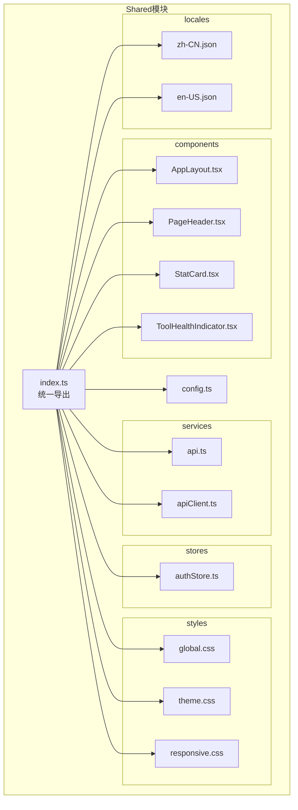
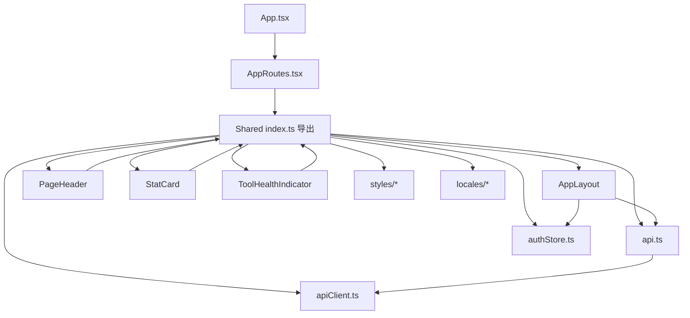
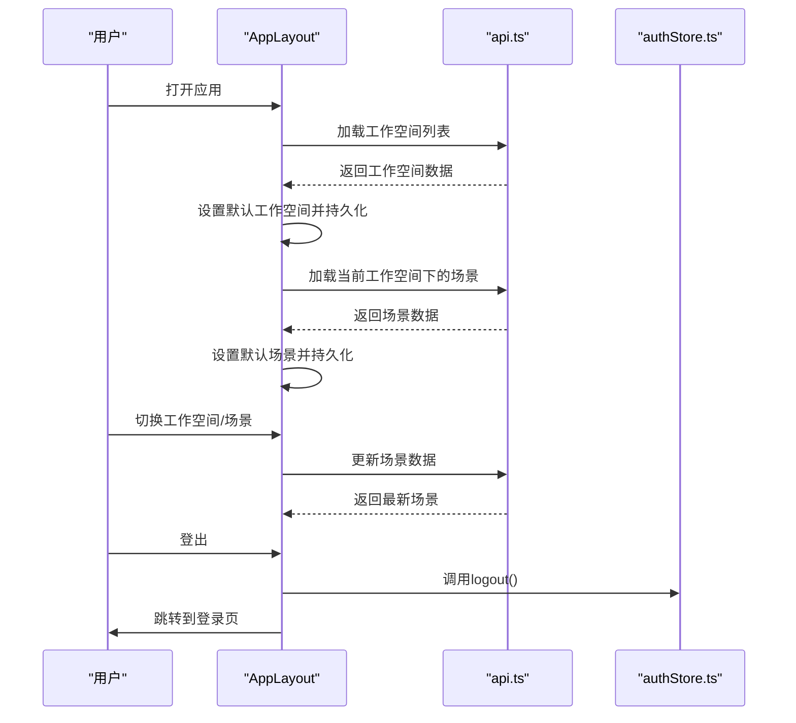
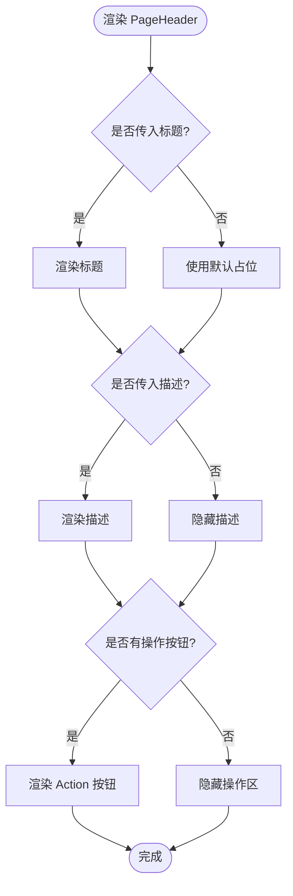
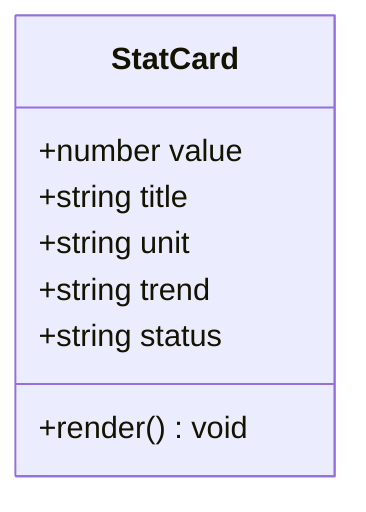
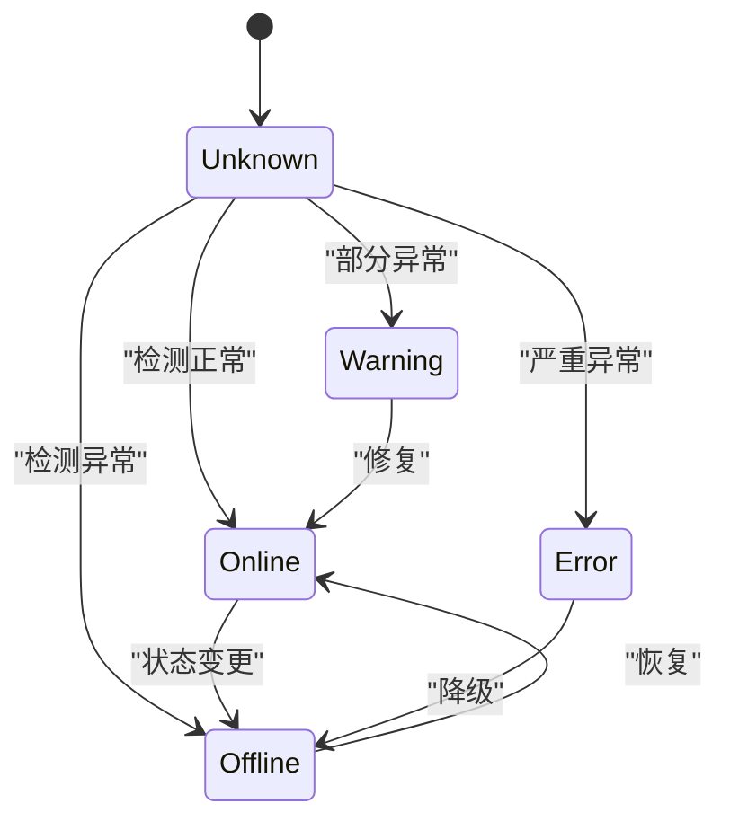
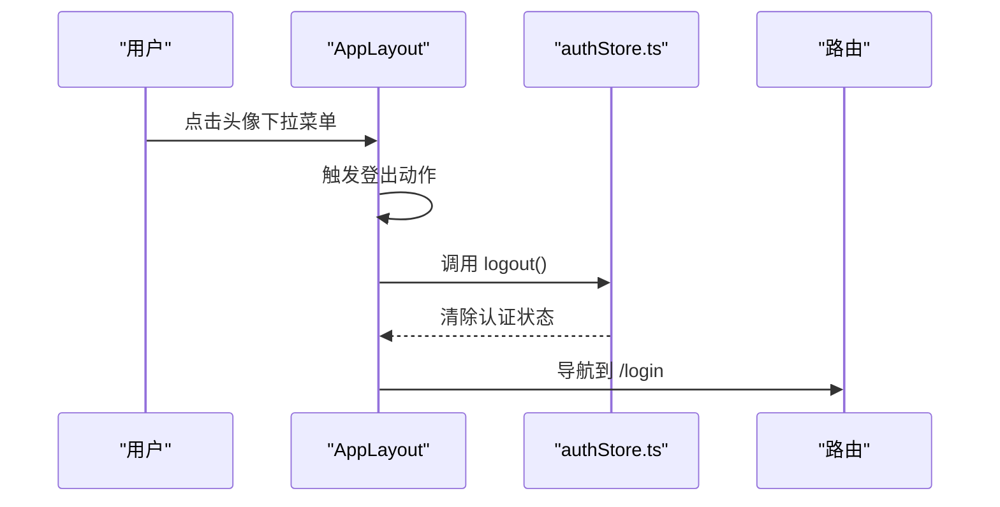
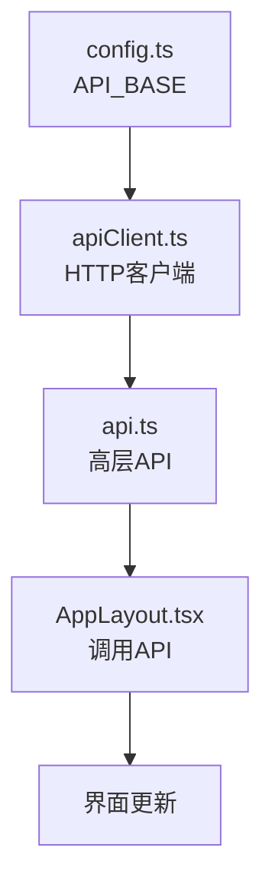
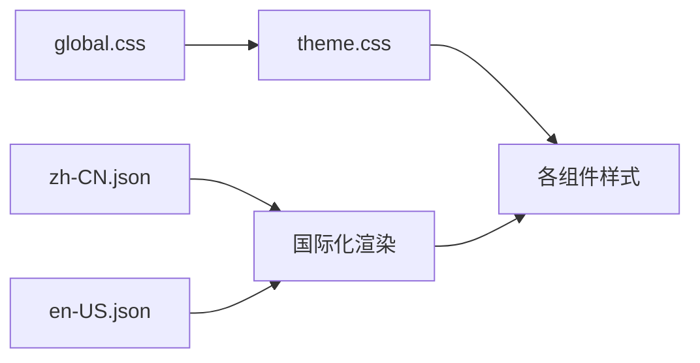
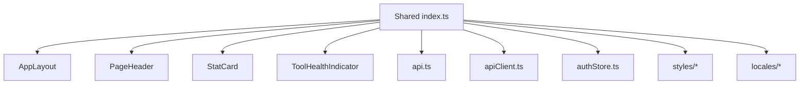

# Shared模块

<cite>
**本文引用的文件**
- [frontend/src/modules/shared/index.ts](file://frontend/src/modules/shared/index.ts)
- [frontend/src/modules/shared/components/AppLayout.tsx](file://frontend/src/modules/shared/components/AppLayout.tsx)
- [frontend/src/modules/shared/components/PageHeader.tsx](file://frontend/src/modules/shared/components/PageHeader.tsx)
- [frontend/src/modules/shared/components/StatCard.tsx](file://frontend/src/modules/shared/components/StatCard.tsx)
- [frontend/src/modules/shared/components/ToolHealthIndicator.tsx](file://frontend/src/modules/shared/components/ToolHealthIndicator.tsx)
- [frontend/src/modules/shared/services/api.ts](file://frontend/src/modules/shared/services/api.ts)
- [frontend/src/modules/shared/services/apiClient.ts](file://frontend/src/modules/shared/services/apiClient.ts)
- [frontend/src/config.ts](file://frontend/src/config.ts)
- [frontend/src/modules/shared/stores/authStore.ts](file://frontend/src/modules/shared/stores/authStore.ts)
- [frontend/src/modules/shared/styles/global.css](file://frontend/src/modules/shared/styles/global.css)
- [frontend/src/modules/shared/styles/theme.css](file://frontend/src/modules/shared/styles/theme.css)
- [frontend/src/modules/shared/styles/responsive.css](file://frontend/src/modules/shared/styles/responsive.css)
- [frontend/src/modules/shared/locales/zh-CN.json](file://frontend/src/modules/shared/locales/zh-CN.json)
- [frontend/src/modules/shared/locales/en-US.json](file://frontend/src/modules/shared/locales/en-US.json)
- [frontend/src/App.tsx](file://frontend/src/App.tsx)
- [frontend/src/AppRoutes.tsx](file://frontend/src/AppRoutes.tsx)
</cite>

## 目录
1. [简介](#简介)
2. [项目结构](#项目结构)
3. [核心组件](#核心组件)
4. [架构总览](#架构总览)
5. [详细组件分析](#详细组件分析)
6. [依赖关系分析](#依赖关系分析)
7. [性能考虑](#性能考虑)
8. [故障排查指南](#故障排查指南)
9. [结论](#结论)
10. [附录](#附录)

## 简介
Shared模块是前端应用的共享组件库与基础设施中心，负责提供统一的应用布局、页面头部、统计卡片、工具健康指示器等核心UI组件，以及认证状态管理、API客户端、样式系统、国际化支持与响应式设计能力。该模块通过集中化的导出入口，为业务模块（如ontology、business、audit等）提供一致的开发体验与视觉语言。

## 项目结构
Shared模块位于frontend/src/modules/shared目录下，采用按功能域划分的组织方式：
- components：共享UI组件集合
- services：API封装与HTTP客户端
- stores：全局状态管理（认证等）
- styles：样式系统与主题
- locales：国际化资源
- pages：共享页面（如有）
- utils：通用工具函数
- types：类型定义
- index.ts：统一导出入口

**图示来源**
- [frontend/src/modules/shared/index.ts:1-11](file://frontend/src/modules/shared/index.ts#L1-L11)
- [frontend/src/modules/shared/components/AppLayout.tsx:1-712](file://frontend/src/modules/shared/components/AppLayout.tsx#L1-L712)
- [frontend/src/modules/shared/services/api.ts](file://frontend/src/modules/shared/services/api.ts)
- [frontend/src/modules/shared/services/apiClient.ts](file://frontend/src/modules/shared/services/apiClient.ts)
- [frontend/src/modules/shared/stores/authStore.ts](file://frontend/src/modules/shared/stores/authStore.ts)
- [frontend/src/modules/shared/styles/global.css](file://frontend/src/modules/shared/styles/global.css)
- [frontend/src/modules/shared/styles/theme.css](file://frontend/src/modules/shared/styles/theme.css)
- [frontend/src/modules/shared/styles/responsive.css](file://frontend/src/modules/shared/styles/responsive.css)
- [frontend/src/modules/shared/locales/zh-CN.json](file://frontend/src/modules/shared/locales/zh-CN.json)
- [frontend/src/modules/shared/locales/en-US.json](file://frontend/src/modules/shared/locales/en-US.json)
- [frontend/src/config.ts](file://frontend/src/config.ts)

**章节来源**
- [frontend/src/modules/shared/index.ts:1-11](file://frontend/src/modules/shared/index.ts#L1-L11)

## 核心组件
- 应用布局 AppLayout：提供主框架、侧边导航、顶部操作区、右侧扩展面板与上下文管理，支持工作空间与场景切换、模式切换（管理后台/我的智能体）、用户登出等。
- 页面头部 PageHeader：用于承载页面级标题、描述与操作按钮，支持Action按钮与自定义操作区域。
- 统计卡片 StatCard：展示关键指标，支持数值、趋势、单位与状态样式。
- 工具健康指示器 ToolHealthIndicator：显示工具可用性状态，支持在线/离线/警告/错误等状态可视化。
- API客户端与服务：封装REST调用、错误处理与重试策略；提供统一的fetchJson与api包装器。
- 认证状态管理：基于useAuthStore提供用户信息、登录/登出流程与权限控制。
- 样式系统：全局样式、主题变量与响应式断点，确保跨设备一致性。
- 国际化：中英文词条映射，支持运行时切换语言。
- 响应式设计：移动端优先，适配不同屏幕尺寸的布局与交互。

**章节来源**
- [frontend/src/modules/shared/components/AppLayout.tsx:201-712](file://frontend/src/modules/shared/components/AppLayout.tsx#L201-L712)
- [frontend/src/modules/shared/components/PageHeader.tsx](file://frontend/src/modules/shared/components/PageHeader.tsx)
- [frontend/src/modules/shared/components/StatCard.tsx](file://frontend/src/modules/shared/components/StatCard.tsx)
- [frontend/src/modules/shared/components/ToolHealthIndicator.tsx](file://frontend/src/modules/shared/components/ToolHealthIndicator.tsx)
- [frontend/src/modules/shared/services/api.ts](file://frontend/src/modules/shared/services/api.ts)
- [frontend/src/modules/shared/services/apiClient.ts](file://frontend/src/modules/shared/services/apiClient.ts)
- [frontend/src/modules/shared/stores/authStore.ts](file://frontend/src/modules/shared/stores/authStore.ts)
- [frontend/src/modules/shared/styles/global.css](file://frontend/src/modules/shared/styles/global.css)
- [frontend/src/modules/shared/styles/theme.css](file://frontend/src/modules/shared/styles/theme.css)
- [frontend/src/modules/shared/styles/responsive.css](file://frontend/src/modules/shared/styles/responsive.css)
- [frontend/src/modules/shared/locales/zh-CN.json](file://frontend/src/modules/shared/locales/zh-CN.json)
- [frontend/src/modules/shared/locales/en-US.json](file://frontend/src/modules/shared/locales/en-US.json)

## 架构总览
Shared模块采用“组件+服务+状态+样式+国际化”的分层架构，通过index.ts统一导出，供上层业务模块按需引入。认证状态由authStore集中管理，API层提供稳定的数据访问抽象，样式与主题确保视觉一致性，国际化支持多语言切换。

**图示来源**
- [frontend/src/App.tsx](file://frontend/src/App.tsx)
- [frontend/src/AppRoutes.tsx](file://frontend/src/AppRoutes.tsx)
- [frontend/src/modules/shared/index.ts:1-11](file://frontend/src/modules/shared/index.ts#L1-L11)
- [frontend/src/modules/shared/components/AppLayout.tsx:1-712](file://frontend/src/modules/shared/components/AppLayout.tsx#L1-L712)
- [frontend/src/modules/shared/services/api.ts](file://frontend/src/modules/shared/services/api.ts)
- [frontend/src/modules/shared/services/apiClient.ts](file://frontend/src/modules/shared/services/apiClient.ts)
- [frontend/src/modules/shared/stores/authStore.ts](file://frontend/src/modules/shared/stores/authStore.ts)
- [frontend/src/modules/shared/styles/global.css](file://frontend/src/modules/shared/styles/global.css)
- [frontend/src/modules/shared/styles/theme.css](file://frontend/src/modules/shared/styles/theme.css)
- [frontend/src/modules/shared/styles/responsive.css](file://frontend/src/modules/shared/styles/responsive.css)
- [frontend/src/modules/shared/locales/zh-CN.json](file://frontend/src/modules/shared/locales/zh-CN.json)
- [frontend/src/modules/shared/locales/en-US.json](file://frontend/src/modules/shared/locales/en-US.json)

## 详细组件分析

### 应用布局 AppLayout
AppLayout是Shared模块的核心容器，负责：
- 主框架布局：左侧主菜单、子菜单、右侧扩展面板与内容区域
- 上下文管理：工作空间、场景、本体版本、右侧面板状态
- 导航与路由：根据当前路径激活主菜单与子菜单，支持快捷跳转
- 用户交互：工作空间/场景切换、模式切换（管理后台/我的智能体）、登出
- 状态持久化：本地存储当前工作空间与场景ID

**图示来源**
- [frontend/src/modules/shared/components/AppLayout.tsx:242-298](file://frontend/src/modules/shared/components/AppLayout.tsx#L242-L298)
- [frontend/src/modules/shared/services/api.ts](file://frontend/src/modules/shared/services/api.ts)
- [frontend/src/modules/shared/stores/authStore.ts](file://frontend/src/modules/shared/stores/authStore.ts)

**章节来源**
- [frontend/src/modules/shared/components/AppLayout.tsx:201-712](file://frontend/src/modules/shared/components/AppLayout.tsx#L201-L712)

### 页面头部 PageHeader
PageHeader提供页面级标题、描述与操作区域，支持Action按钮与自定义操作插槽，便于在不同业务页面复用一致的头部样式与行为。

**图示来源**
- [frontend/src/modules/shared/components/PageHeader.tsx](file://frontend/src/modules/shared/components/PageHeader.tsx)

**章节来源**
- [frontend/src/modules/shared/components/PageHeader.tsx](file://frontend/src/modules/shared/components/PageHeader.tsx)

### 统计卡片 StatCard
StatCard用于展示关键指标，支持数值、单位、趋势与状态样式，适用于仪表盘与概览页面。

**图示来源**
- [frontend/src/modules/shared/components/StatCard.tsx](file://frontend/src/modules/shared/components/StatCard.tsx)

**章节来源**
- [frontend/src/modules/shared/components/StatCard.tsx](file://frontend/src/modules/shared/components/StatCard.tsx)

### 工具健康指示器 ToolHealthIndicator
ToolHealthIndicator用于显示工具可用性状态，支持在线、离线、警告、错误等状态，并提供点击查看详情的能力。

**图示来源**
- [frontend/src/modules/shared/components/ToolHealthIndicator.tsx](file://frontend/src/modules/shared/components/ToolHealthIndicator.tsx)

**章节来源**
- [frontend/src/modules/shared/components/ToolHealthIndicator.tsx](file://frontend/src/modules/shared/components/ToolHealthIndicator.tsx)

### 认证状态管理
Shared模块通过authStore集中管理用户认证状态，提供登录、登出与用户信息获取能力，AppLayout在顶部Header中集成登出入口。

**图示来源**
- [frontend/src/modules/shared/components/AppLayout.tsx:617-631](file://frontend/src/modules/shared/components/AppLayout.tsx#L617-L631)
- [frontend/src/modules/shared/stores/authStore.ts](file://frontend/src/modules/shared/stores/authStore.ts)

**章节来源**
- [frontend/src/modules/shared/stores/authStore.ts](file://frontend/src/modules/shared/stores/authStore.ts)
- [frontend/src/modules/shared/components/AppLayout.tsx:617-631](file://frontend/src/modules/shared/components/AppLayout.tsx#L617-L631)

### API客户端与响应式设计
- API封装：api.ts提供高层API方法（如listWorkspaces、getScenariosInWorkspace），内部调用apiClient进行HTTP请求。
- HTTP客户端：apiClient.ts封装fetchJson与基础HTTP客户端，支持错误处理与重试策略。
- 配置：config.ts提供API_BASE常量，供各模块统一引用后端地址。
- 响应式设计：responsive.css定义断点与布局规则，确保在移动设备上的良好体验。

**图示来源**
- [frontend/src/modules/shared/services/api.ts](file://frontend/src/modules/shared/services/api.ts)
- [frontend/src/modules/shared/services/apiClient.ts](file://frontend/src/modules/shared/services/apiClient.ts)
- [frontend/src/modules/shared/components/AppLayout.tsx:242-298](file://frontend/src/modules/shared/components/AppLayout.tsx#L242-L298)
- [frontend/src/config.ts](file://frontend/src/config.ts)

**章节来源**
- [frontend/src/modules/shared/services/api.ts](file://frontend/src/modules/shared/services/api.ts)
- [frontend/src/modules/shared/services/apiClient.ts](file://frontend/src/modules/shared/services/apiClient.ts)
- [frontend/src/modules/shared/components/AppLayout.tsx:242-298](file://frontend/src/modules/shared/components/AppLayout.tsx#L242-L298)
- [frontend/src/config.ts](file://frontend/src/config.ts)
- [frontend/src/modules/shared/styles/responsive.css](file://frontend/src/modules/shared/styles/responsive.css)

### 样式系统与国际化
- 样式系统：global.css提供全局样式，theme.css定义主题变量，配合组件内联样式的组合实现一致的视觉风格。
- 国际化：locales目录包含中英文词条映射，可在运行时切换语言，PageHeader等组件可结合i18n库进行文本渲染。

**图示来源**
- [frontend/src/modules/shared/styles/global.css](file://frontend/src/modules/shared/styles/global.css)
- [frontend/src/modules/shared/styles/theme.css](file://frontend/src/modules/shared/styles/theme.css)
- [frontend/src/modules/shared/locales/zh-CN.json](file://frontend/src/modules/shared/locales/zh-CN.json)
- [frontend/src/modules/shared/locales/en-US.json](file://frontend/src/modules/shared/locales/en-US.json)

**章节来源**
- [frontend/src/modules/shared/styles/global.css](file://frontend/src/modules/shared/styles/global.css)
- [frontend/src/modules/shared/styles/theme.css](file://frontend/src/modules/shared/styles/theme.css)
- [frontend/src/modules/shared/locales/zh-CN.json](file://frontend/src/modules/shared/locales/zh-CN.json)
- [frontend/src/modules/shared/locales/en-US.json](file://frontend/src/modules/shared/locales/en-US.json)

## 依赖关系分析
Shared模块的导出入口统一聚合了组件、服务、状态、样式与国际化资源，形成清晰的依赖边界。上层业务模块仅需从index.ts导入即可获得所需能力，降低耦合度并提升可维护性。

**图示来源**
- [frontend/src/modules/shared/index.ts:1-11](file://frontend/src/modules/shared/index.ts#L1-L11)

**章节来源**
- [frontend/src/modules/shared/index.ts:1-11](file://frontend/src/modules/shared/index.ts#L1-L11)

## 性能考虑
- 组件懒加载：对非首屏使用的组件采用动态导入，减少初始包体积。
- 状态最小化：将高频更新的状态拆分到独立上下文或store，避免不必要的重渲染。
- 请求缓存：在apiClient中实现请求去重与缓存策略，减少重复网络请求。
- 图片与资源优化：使用响应式图片与CDN加速，配合lazy loading。
- 样式按需：主题变量集中管理，避免重复定义导致的样式膨胀。

## 故障排查指南
- 登录后无法进入管理后台
  - 检查authStore的logout流程是否被意外触发
  - 确认路由守卫与权限校验逻辑
- 工作空间/场景切换无效
  - 查看AppLayout中loadWorkspaces与loadScenarios的调用链
  - 确认localStorage中的键值是否正确写入与读取
- API请求失败
  - 检查API_BASE配置与网络代理设置
  - 在apiClient中启用调试日志，定位HTTP错误码与响应体
- 响应式布局异常
  - 对照responsive.css断点，确认媒体查询与容器宽度计算
  - 使用浏览器开发者工具检查CSS变量覆盖情况

**章节来源**
- [frontend/src/modules/shared/components/AppLayout.tsx:242-298](file://frontend/src/modules/shared/components/AppLayout.tsx#L242-L298)
- [frontend/src/modules/shared/services/apiClient.ts](file://frontend/src/modules/shared/services/apiClient.ts)
- [frontend/src/modules/shared/styles/responsive.css](file://frontend/src/modules/shared/styles/responsive.css)

## 结论
Shared模块通过统一的组件、服务、状态与样式体系，为前端应用提供了高内聚、低耦合的基础设施。AppLayout作为核心容器，结合认证状态管理与API抽象，支撑起复杂业务场景下的用户体验与开发效率。建议在后续迭代中持续完善国际化词条、增强错误处理与监控埋点，并探索更多可复用的业务组件。

## 附录
- 使用指南
  - 在业务页面中引入AppLayout作为根容器，确保上下文正确传递
  - 使用PageHeader快速构建页面头部，必要时扩展Action按钮
  - 使用StatCard与ToolHealthIndicator展示关键指标与工具状态
  - 通过api与apiClient进行数据访问，遵循统一的错误处理与重试策略
- 最佳实践
  - 将样式变量集中在theme.css，避免硬编码颜色与尺寸
  - 为每个新组件提供最小可测试单元，保持组件职责单一
  - 在国际化词条中使用语义化key，避免直接硬编码文案
  - 对高频交互添加节流/防抖，提升交互流畅度