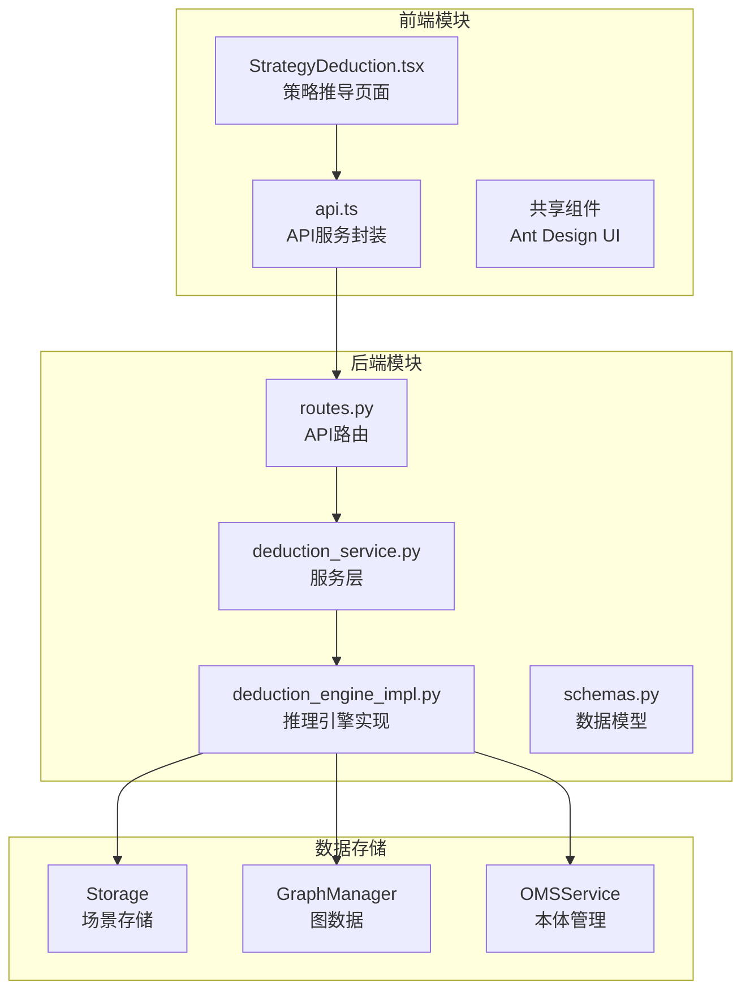
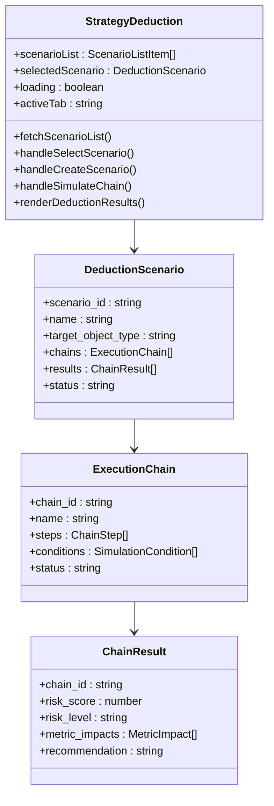
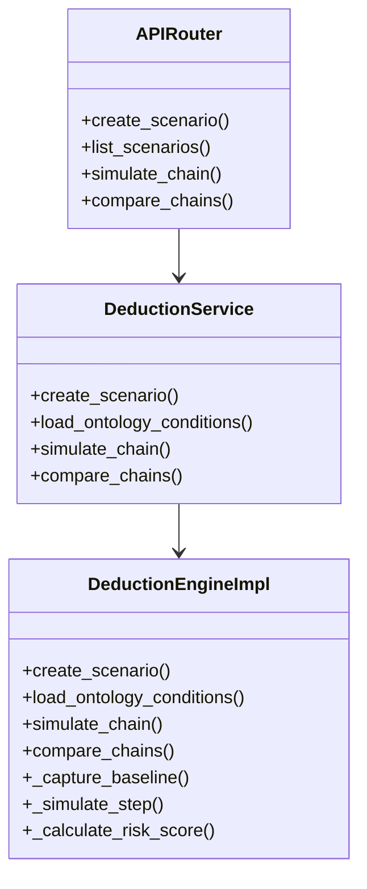
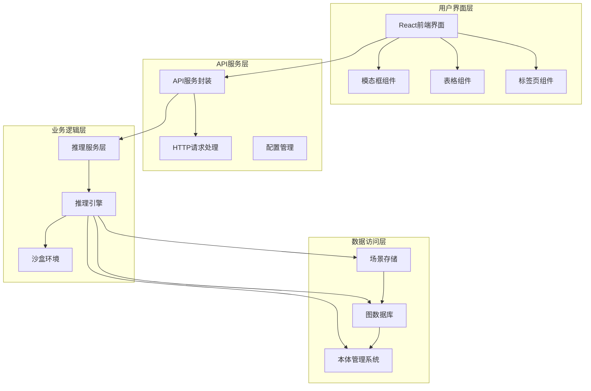
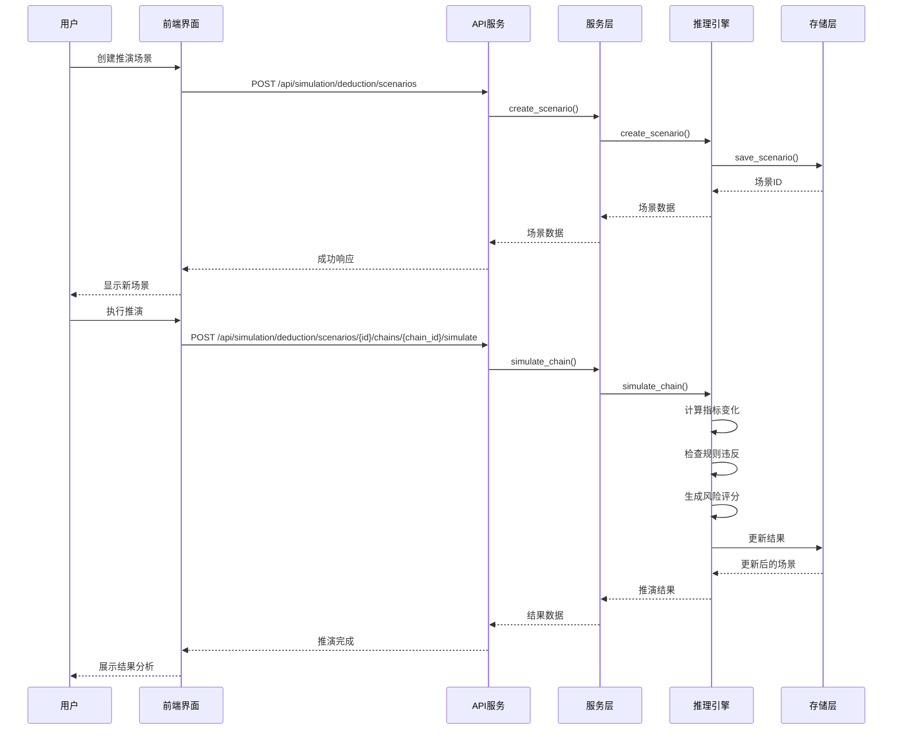
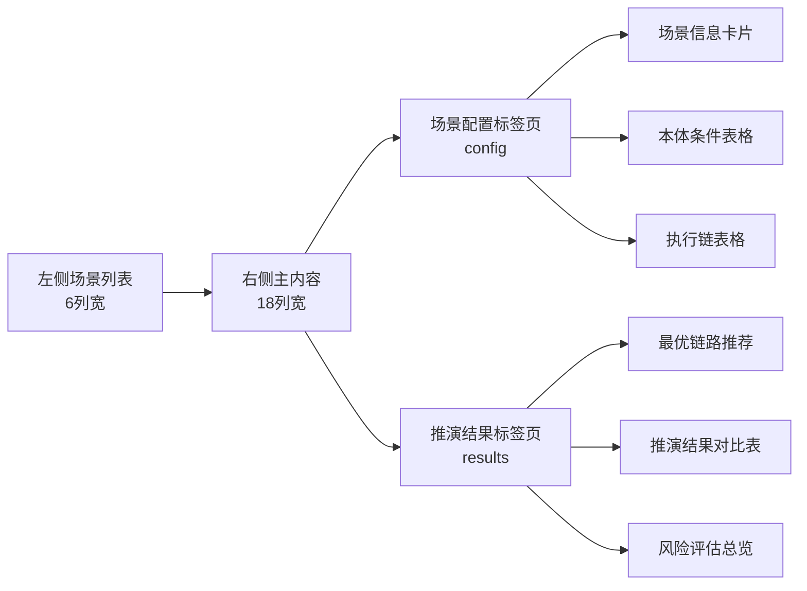
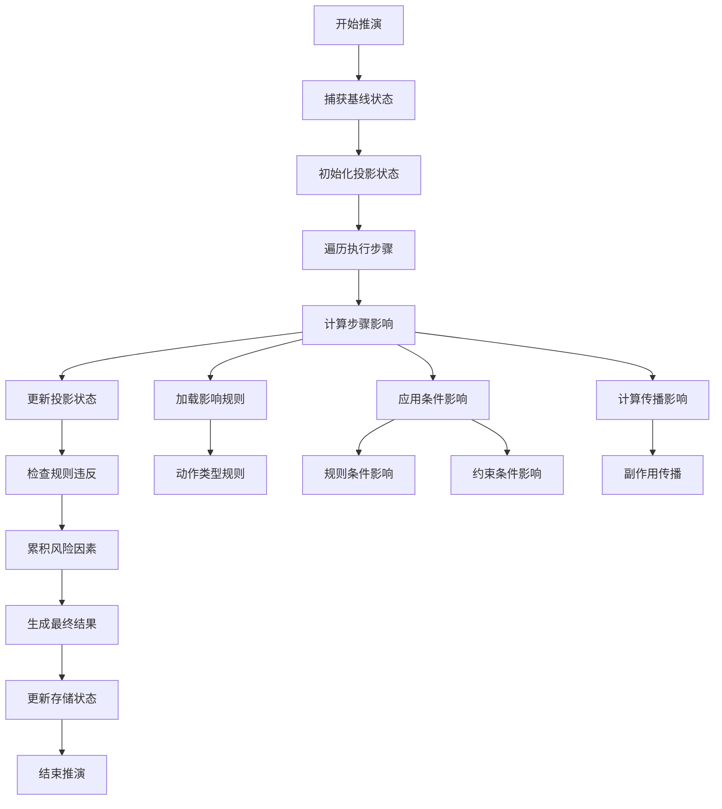
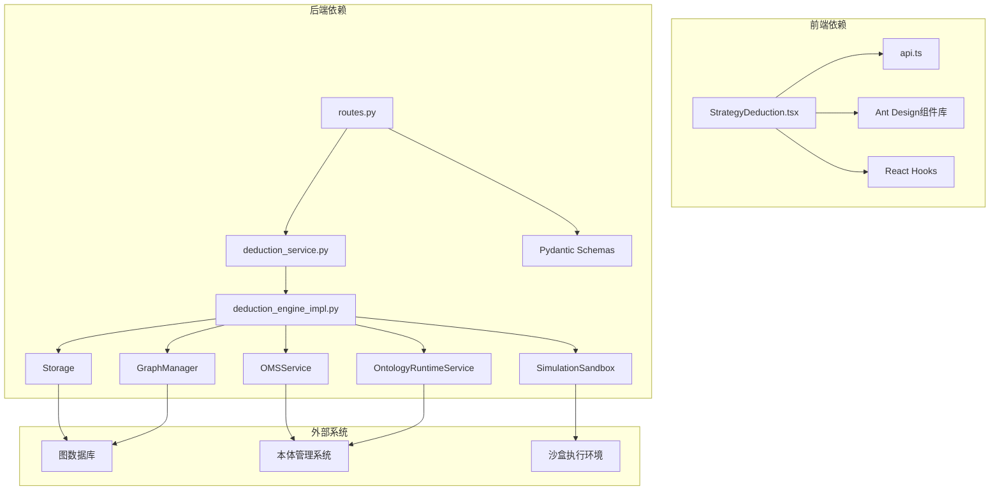
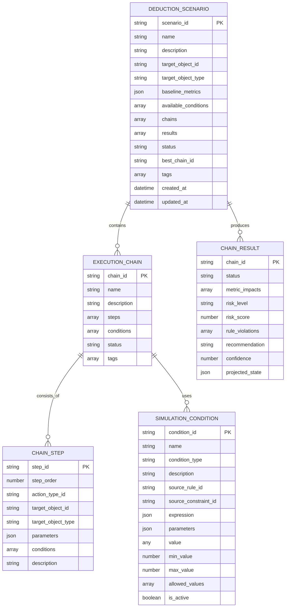

# Simulation模块

<cite>
**本文档引用的文件**
- [StrategyDeduction.tsx](file://frontend/src/modules/simulation/pages/StrategyDeduction.tsx)
- [api.ts](file://frontend/src/modules/shared/services/api.ts)
- [routes.py](file://odap/biz/simulation/simulation_deduction/api/routes.py)
- [deduction_service.py](file://odap/biz/simulation/simulation_deduction/services/deduction_service.py)
- [deduction_engine_impl.py](file://odap/biz/simulation/simulation_deduction/impl/deduction_engine_impl.py)
- [schemas.py](file://odap/biz/simulation/simulation_deduction/api/schemas.py)
</cite>

## 目录
1. [简介](#简介)
2. [项目结构](#项目结构)
3. [核心组件](#核心组件)
4. [架构概览](#架构概览)
5. [详细组件分析](#详细组件分析)
6. [依赖分析](#依赖分析)
7. [性能考虑](#性能考虑)
8. [故障排除指南](#故障排除指南)
9. [结论](#结论)

## 简介

Simulation模块是本体图平台中的核心仿真推理模块，专注于策略推导和模拟执行。该模块提供了完整的策略推导工作流，包括场景创建、条件配置、执行链构建、模拟推演和结果分析等功能。

该模块的核心价值在于：
- **可视化策略推导**：通过直观的界面展示复杂的推理过程
- **实时数据处理**：支持动态条件配置和即时结果反馈
- **多维度结果分析**：提供风险评估、指标变化和规则违反检测
- **灵活的执行链配置**：支持复杂动作序列的组合和模拟

## 项目结构

Simulation模块在前端和后端均实现了完整的策略推导功能：



**图表来源**
- [StrategyDeduction.tsx:160-178](file://frontend/src/modules/simulation/pages/StrategyDeduction.tsx#L160-L178)
- [routes.py:10](file://odap/biz/simulation/simulation_deduction/api/routes.py#L10-L11)

**章节来源**
- [StrategyDeduction.tsx:1-800](file://frontend/src/modules/simulation/pages/StrategyDeduction.tsx#L1-L800)
- [routes.py:1-196](file://odap/biz/simulation/simulation_deduction/api/routes.py#L1-L196)

## 核心组件

### 前端核心组件

策略推导页面是整个模块的核心界面，采用了响应式布局和标签页组织方式：



**图表来源**
- [StrategyDeduction.tsx:87-102](file://frontend/src/modules/simulation/pages/StrategyDeduction.tsx#L87-L102)
- [StrategyDeduction.tsx:48-56](file://frontend/src/modules/simulation/pages/StrategyDeduction.tsx#L48-L56)

### 后端核心组件

后端采用分层架构设计，确保了良好的可维护性和扩展性：



**图表来源**
- [deduction_engine_impl.py:18](file://odap/biz/simulation/simulation_deduction/impl/deduction_engine_impl.py#L18-L23)
- [deduction_service.py:9](file://odap/biz/simulation/simulation_deduction/services/deduction_service.py#L9-L11)

**章节来源**
- [StrategyDeduction.tsx:160-1423](file://frontend/src/modules/simulation/pages/StrategyDeduction.tsx#L160-L1423)
- [deduction_engine_impl.py:18-622](file://odap/biz/simulation/simulation_deduction/impl/deduction_engine_impl.py#L18-L622)

## 架构概览

### 整体架构设计



**图表来源**
- [StrategyDeduction.tsx:1366-1420](file://frontend/src/modules/simulation/pages/StrategyDeduction.tsx#L1366-L1420)
- [api.ts:1991-2057](file://frontend/src/modules/shared/services/api.ts#L1991-L2057)

### 数据流架构



**图表来源**
- [routes.py:14](file://odap/biz/simulation/simulation_deduction/api/routes.py#L14-L31)
- [deduction_service.py:13](file://odap/biz/simulation/simulation_deduction/services/deduction_service.py#L13-L38)
- [deduction_engine_impl.py:203](file://odap/biz/simulation/simulation_deduction/impl/deduction_engine_impl.py#L203-L272)

**章节来源**
- [routes.py:1-196](file://odap/biz/simulation/simulation_deduction/api/routes.py#L1-L196)
- [deduction_service.py:1-200](file://odap/biz/simulation/simulation_deduction/services/deduction_service.py#L1-L200)

## 详细组件分析

### 策略推导页面实现

#### 页面布局设计

策略推导页面采用了经典的左右布局设计，左侧为场景列表，右侧为主内容区域：



**图表来源**
- [StrategyDeduction.tsx:1366-1420](file://frontend/src/modules/simulation/pages/StrategyDeduction.tsx#L1366-L1420)
- [StrategyDeduction.tsx:821-962](file://frontend/src/modules/simulation/pages/StrategyDeduction.tsx#L821-L962)

#### 场景配置功能

场景配置是策略推导的核心功能之一，支持以下操作：

1. **场景创建**：通过模态框创建新的推演场景
2. **条件加载**：从本体管理系统加载可用条件
3. **执行链管理**：创建、编辑、删除执行链
4. **参数配置**：动态调整条件参数值

**章节来源**
- [StrategyDeduction.tsx:251-414](file://frontend/src/modules/simulation/pages/StrategyDeduction.tsx#L251-L414)

### 推理引擎实现

#### 推理算法核心

推理引擎实现了完整的策略推导算法，包括：



**图表来源**
- [deduction_engine_impl.py:227](file://odap/biz/simulation/simulation_deduction/impl/deduction_engine_impl.py#L227-L237)
- [deduction_engine_impl.py:441](file://odap/biz/simulation/simulation_deduction/impl/deduction_engine_impl.py#L441-L482)

#### 风险评估机制

引擎实现了多层次的风险评估机制：

| 风险等级 | 分数范围 | 颜色标识 | 描述 |
|---------|---------|---------|------|
| low | 0-29 | 绿色 | 低风险，可以安全执行 |
| medium | 30-59 | 橙色 | 中等风险，建议评估后执行 |
| high | 60-79 | 红色 | 高风险操作，建议谨慎评估 |
| critical | 80-100 | 深红色 | 极高风险，强烈不建议执行 |

**章节来源**
- [deduction_engine_impl.py:239](file://odap/biz/simulation/simulation_deduction/impl/deduction_engine_impl.py#L239-L241)
- [StrategyDeduction.tsx:153-158](file://frontend/src/modules/simulation/pages/StrategyDeduction.tsx#L153-L158)

### API接口设计

#### 前端API封装

前端使用统一的API服务封装所有后端接口：

```mermaid
classDiagram
class APIService {
+createDeductionScenario()
+listDeductionScenarios()
+getDeductionScenario()
+deleteDeductionScenario()
+loadDeductionConditions()
+updateDeductionCondition()
+addDeductionChain()
+simulateDeductionChain()
+simulateAllDeductionChains()
+compareDeductionChains()
}
class Routes {
+POST /api/simulation/deduction/scenarios
+GET /api/simulation/deduction/scenarios
+GET /api/simulation/deduction/scenarios/{id}
+DELETE /api/simulation/deduction/scenarios/{id}
+POST /api/simulation/deduction/scenarios/{id}/conditions
+PUT /api/simulation/deduction/scenarios/{id}/conditions/{cid}
+POST /api/simulation/deduction/scenarios/{id}/chains
+POST /api/simulation/deduction/scenarios/{id}/chains/{cid}/simulate
+POST /api/simulation/deduction/scenarios/{id}/simulate-all
+POST /api/simulation/deduction/scenarios/{id}/compare
}
APIService --> Routes
```

**图表来源**
- [api.ts:1991-2057](file://frontend/src/modules/shared/services/api.ts#L1991-L2057)
- [routes.py:14](file://odap/biz/simulation/simulation_deduction/api/routes.py#L14-L196)

**章节来源**
- [api.ts:1980-2061](file://frontend/src/modules/shared/services/api.ts#L1980-L2061)
- [routes.py:1-196](file://odap/biz/simulation/simulation_deduction/api/routes.py#L1-L196)

## 依赖分析

### 组件间依赖关系



**图表来源**
- [StrategyDeduction.tsx:14](file://frontend/src/modules/simulation/pages/StrategyDeduction.tsx#L14-L15)
- [deduction_engine_impl.py:19](file://odap/biz/simulation/simulation_deduction/impl/deduction_engine_impl.py#L19-L44)

### 数据模型依赖



**图表来源**
- [StrategyDeduction.tsx:87-102](file://frontend/src/modules/simulation/pages/StrategyDeduction.tsx#L87-L102)
- [StrategyDeduction.tsx:21-56](file://frontend/src/modules/simulation/pages/StrategyDeduction.tsx#L21-L56)

**章节来源**
- [StrategyDeduction.tsx:1-1423](file://frontend/src/modules/simulation/pages/StrategyDeduction.tsx#L1-L1423)
- [schemas.py:5-37](file://odap/biz/simulation/simulation_deduction/api/schemas.py#L5-L37)

## 性能考虑

### 前端性能优化

1. **虚拟滚动**：对于大量数据的表格使用虚拟滚动技术
2. **懒加载**：场景详情和结果数据按需加载
3. **缓存机制**：本地缓存常用数据减少重复请求
4. **并发控制**：限制同时进行的推演任务数量

### 后端性能优化

1. **异步处理**：所有推演操作采用异步执行避免阻塞
2. **线程池管理**：使用线程池处理长时间运行的任务
3. **超时控制**：设置合理的超时时间防止资源泄露
4. **内存管理**：及时清理临时数据和中间结果

## 故障排除指南

### 常见问题及解决方案

#### 场景创建失败
- **症状**：创建场景时报错
- **原因**：必填字段缺失或格式错误
- **解决**：检查表单验证规则，确保所有必填字段都已填写

#### 推演执行超时
- **症状**：推演长时间无响应
- **原因**：推演计算过于复杂或数据量过大
- **解决**：简化执行链配置，减少步骤数量

#### 条件更新失败
- **症状**：修改条件值后无法保存
- **原因**：网络连接问题或权限不足
- **解决**：检查网络连接，确认用户权限

**章节来源**
- [deduction_service.py:18](file://odap/biz/simulation/simulation_deduction/services/deduction_service.py#L18-L38)
- [deduction_engine_impl.py:274](file://odap/biz/simulation/simulation_deduction/impl/deduction_engine_impl.py#L274-L279)

## 结论

Simulation模块的策略推导功能为本体图平台提供了强大的推理能力。通过前后端协同设计，实现了从场景创建到结果分析的完整工作流。

### 主要优势

1. **用户体验优秀**：直观的界面设计和流畅的交互体验
2. **功能完整性**：覆盖策略推导的所有关键环节
3. **扩展性强**：模块化设计便于功能扩展和维护
4. **性能稳定**：合理的架构设计确保了系统的稳定性

### 技术亮点

- **可视化推理**：将复杂的推理过程以图形化方式展现
- **实时反馈**：提供即时的结果更新和状态反馈
- **智能分析**：自动化的风险评估和推荐生成
- **灵活配置**：支持动态条件调整和执行链定制

该模块为后续的功能扩展奠定了坚实的基础，可以支持更复杂的推理场景和更丰富的分析需求。