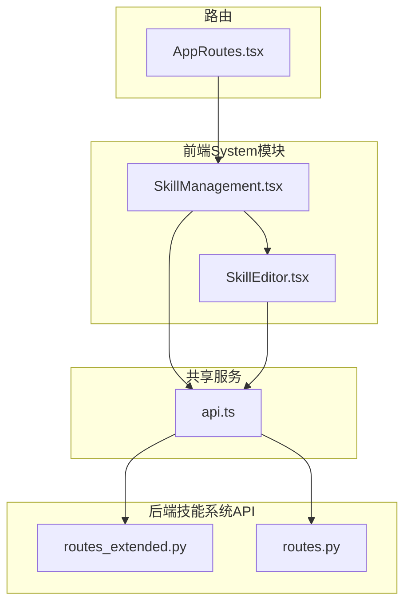
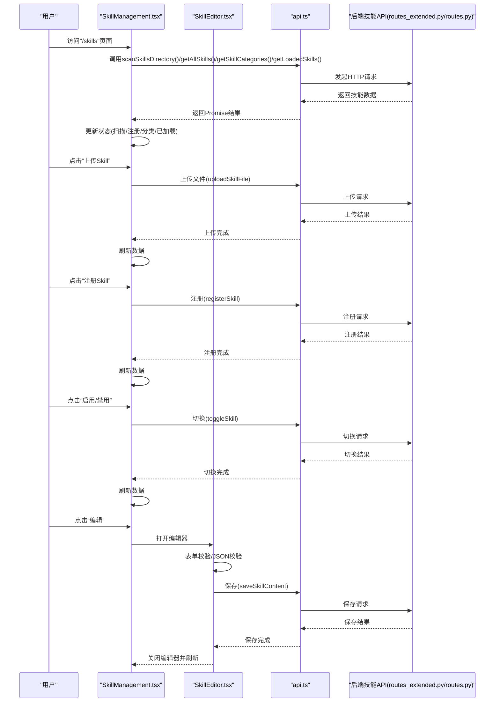
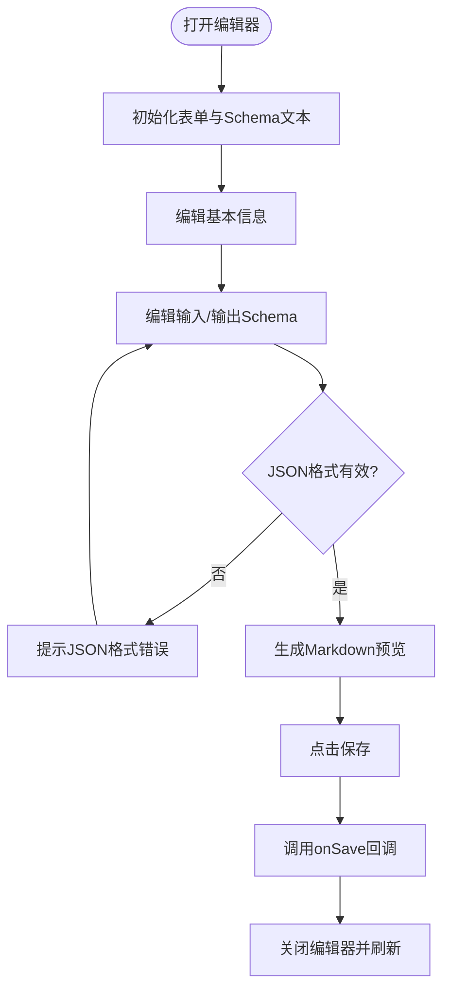
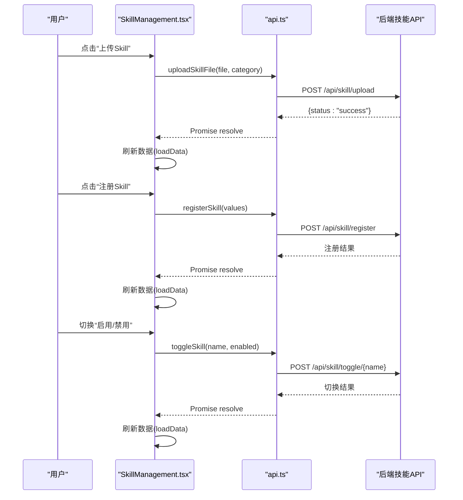
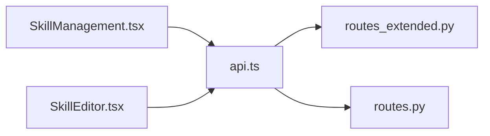

# System模块

<cite>
**本文档引用的文件**
- [SkillManagement.tsx](file://frontend/src/modules/system/pages/SkillManagement.tsx)
- [SkillEditor.tsx](file://frontend/src/modules/system/components/SkillEditor.tsx)
- [AppRoutes.tsx](file://frontend/src/AppRoutes.tsx)
- [api.ts](file://frontend/src/modules/shared/services/api.ts)
- [routes_extended.py](file://odap/biz/platform/skill_system/api/routes_extended.py)
- [routes.py](file://odap/biz/platform/skill_system/api/routes.py)
</cite>

## 目录
1. [简介](#简介)
2. [项目结构](#项目结构)
3. [核心组件](#核心组件)
4. [架构总览](#架构总览)
5. [详细组件分析](#详细组件分析)
6. [依赖关系分析](#依赖关系分析)
7. [性能考虑](#性能考虑)
8. [故障排除指南](#故障排除指南)
9. [结论](#结论)

## 简介
本文件面向System模块的前端实现，聚焦“技能编辑器”与“技能管理页面”的设计与实现。内容涵盖：
- 技能的定义结构与数据模型
- 技能编辑器的界面与交互流程
- 技能管理页面的功能与状态管理
- 前后端集成点与API契约
- 用户界面设计与操作流程
- 架构设计与扩展机制建议

## 项目结构
System模块位于前端src/modules/system目录下，包含页面与组件两部分：
- 页面：SkillManagement（技能管理）
- 组件：SkillEditor（技能编辑器）

**图表来源**
- [SkillManagement.tsx:1-562](file://frontend/src/modules/system/pages/SkillManagement.tsx#L1-L562)
- [SkillEditor.tsx:1-358](file://frontend/src/modules/system/components/SkillEditor.tsx#L1-L358)
- [AppRoutes.tsx:1-61](file://frontend/src/AppRoutes.tsx#L1-L61)
- [api.ts:1098-1207](file://frontend/src/modules/shared/services/api.ts#L1098-L1207)
- [routes_extended.py:1-301](file://odap/biz/platform/skill_system/api/routes_extended.py#L1-L301)
- [routes.py:37-73](file://odap/biz/platform/skill_system/api/routes.py#L37-L73)

**章节来源**
- [SkillManagement.tsx:1-562](file://frontend/src/modules/system/pages/SkillManagement.tsx#L1-L562)
- [SkillEditor.tsx:1-358](file://frontend/src/modules/system/components/SkillEditor.tsx#L1-L358)
- [AppRoutes.tsx:1-61](file://frontend/src/AppRoutes.tsx#L1-L61)

## 核心组件
- 技能数据模型（前端）
  - 字段：name、category、path、files、description、parsed（含name/description/input_schema/output_schema/sections）、enabled、skill_id、type、status
  - 用途：用于表格展示、详情弹窗、注册/启用/禁用等操作
- 技能编辑器（SkillEditor）
  - 功能：基础信息、Schema定义（输入/输出）、高级说明（Instructions/Examples/Notes）、Markdown预览
  - 交互：表单校验、JSON格式校验、保存回调
- 技能管理页面（SkillManagement）
  - 功能：目录扫描、已注册技能、分类统计、上传/注册/启用/禁用、详情查看、快速编辑入口
  - 状态：活动标签页、加载状态、弹窗可见性、选中技能、已加载技能集合

**章节来源**
- [SkillManagement.tsx:11-28](file://frontend/src/modules/system/pages/SkillManagement.tsx#L11-L28)
- [SkillEditor.tsx:15-28](file://frontend/src/modules/system/components/SkillEditor.tsx#L15-L28)

## 架构总览
System模块通过共享API服务与后端技能系统对接，前端负责UI渲染与用户交互，后端提供技能目录扫描、分类聚合、注册/启用/禁用、上传与加载状态查询等能力。

**图表来源**
- [AppRoutes.tsx:44-44](file://frontend/src/AppRoutes.tsx#L44-L44)
- [SkillManagement.tsx:50-75](file://frontend/src/modules/system/pages/SkillManagement.tsx#L50-L75)
- [SkillEditor.tsx:70-91](file://frontend/src/modules/system/components/SkillEditor.tsx#L70-L91)
- [api.ts:1098-1207](file://frontend/src/modules/shared/services/api.ts#L1098-L1207)
- [routes_extended.py:215-301](file://odap/biz/platform/skill_system/api/routes_extended.py#L215-L301)
- [routes.py:37-73](file://odap/biz/platform/skill_system/api/routes.py#L37-L73)

## 详细组件分析

### 技能编辑器（SkillEditor）
- 结构与职责
  - 基本信息页：名称、分类、触发词、简短描述、使用说明
  - Schema定义页：输入/输出JSON Schema编辑区，字段增删与校验
  - 预览页：生成Markdown预览，便于审阅
  - 快速编辑器（QuickSkillEditor）：最小化交互，快速保存基础信息
- 数据绑定与状态
  - 使用Ant Design Form进行表单绑定；输入/输出Schema通过受控TextArea维护
  - 保存前对JSON进行解析校验，失败则提示错误
- 交互流程
  - 初始化：根据传入skill填充表单与Schema文本
  - 保存：收集表单值与JSON，调用onSave回调
  - 预览：动态生成Markdown文本供预览

**图表来源**
- [SkillEditor.tsx:46-91](file://frontend/src/modules/system/components/SkillEditor.tsx#L46-L91)
- [SkillEditor.tsx:93-131](file://frontend/src/modules/system/components/SkillEditor.tsx#L93-L131)

**章节来源**
- [SkillEditor.tsx:1-358](file://frontend/src/modules/system/components/SkillEditor.tsx#L1-L358)

### 技能管理页面（SkillManagement）
- 视图与标签页
  - 目录Skills：统计与表格展示，支持刷新、上传、注册、启用/禁用、删除、详情查看
  - 已注册：展示注册技能，支持启用/禁用
  - 分类：展示分类统计卡片
- 状态管理
  - 活动标签页、加载状态、弹窗可见性、选中技能、已加载技能集合
  - 通过Promise.all并发拉取扫描、注册、分类、已加载数据，并合并启用状态
- 用户操作流程
  - 刷新：重新拉取全部数据
  - 上传：选择分类，拖拽上传文件，后端写入对应目录
  - 注册：填写名称、类型、分类、描述，后端注册到技能目录
  - 启用/禁用：切换开关，后端更新技能状态
  - 详情：弹窗展示技能元数据与解析后的Schema
  - 编辑：打开技能编辑器，保存后刷新数据

**图表来源**
- [SkillManagement.tsx:99-111](file://frontend/src/modules/system/pages/SkillManagement.tsx#L99-L111)
- [SkillManagement.tsx:87-97](file://frontend/src/modules/system/pages/SkillManagement.tsx#L87-L97)
- [SkillManagement.tsx:77-85](file://frontend/src/modules/system/pages/SkillManagement.tsx#L77-L85)
- [api.ts:1155-1172](file://frontend/src/modules/shared/services/api.ts#L1155-L1172)
- [routes_extended.py:292-301](file://odap/biz/platform/skill_system/api/routes_extended.py#L292-L301)

**章节来源**
- [SkillManagement.tsx:1-562](file://frontend/src/modules/system/pages/SkillManagement.tsx#L1-L562)

### 路由与入口
- 路由配置：/skills 挂载 SkillManagement 组件，并通过受保护路由确保登录态
- 入口：AppRoutes 将系统模块路由集中管理

**章节来源**
- [AppRoutes.tsx:44-44](file://frontend/src/AppRoutes.tsx#L44-L44)

## 依赖关系分析
- 前端依赖
  - Ant Design UI组件库：Modal、Table、Form、Tabs、Select、Upload、Button、Space、Tag、Switch、Statistic、Descriptions、Badge、Divider、Typography等
  - 共享API服务：封装后端技能系统接口
- 后端依赖
  - FastAPI路由：提供扫描、分类、注册、启用/禁用、上传、加载状态等接口
  - 技能服务与热插拔服务：提供技能目录、版本与工具加载状态

**图表来源**
- [SkillManagement.tsx:1-10](file://frontend/src/modules/system/pages/SkillManagement.tsx#L1-L10)
- [SkillEditor.tsx:1-13](file://frontend/src/modules/system/components/SkillEditor.tsx#L1-L13)
- [api.ts:1098-1207](file://frontend/src/modules/shared/services/api.ts#L1098-L1207)
- [routes_extended.py:1-301](file://odap/biz/platform/skill_system/api/routes_extended.py#L1-L301)
- [routes.py:37-73](file://odap/biz/platform/skill_system/api/routes.py#L37-L73)

**章节来源**
- [SkillManagement.tsx:1-10](file://frontend/src/modules/system/pages/SkillManagement.tsx#L1-L10)
- [SkillEditor.tsx:1-13](file://frontend/src/modules/system/components/SkillEditor.tsx#L1-L13)
- [api.ts:1098-1207](file://frontend/src/modules/shared/services/api.ts#L1098-L1207)
- [routes_extended.py:1-301](file://odap/biz/platform/skill_system/api/routes_extended.py#L1-L301)
- [routes.py:37-73](file://odap/biz/platform/skill_system/api/routes.py#L37-L73)

## 性能考虑
- 并发加载：使用Promise.all同时拉取扫描、注册、分类、已加载数据，减少首屏等待时间
- 表格分页：目录与已注册列表均采用分页，控制单次渲染数据量
- 弹窗懒加载：详情弹窗与上传/注册弹窗按需打开，避免不必要的DOM渲染
- JSON编辑区：输入/输出Schema采用受控TextArea，避免频繁重渲染；仅在保存时进行JSON解析校验
- 图标与统计：使用轻量级图标与统计组件，降低渲染成本

[本节为通用性能建议，无需特定文件引用]

## 故障排除指南
- 上传失败
  - 现象：上传文件后提示失败
  - 排查：检查后端上传接口返回状态；确认文件类型与大小限制；检查网络连接
  - 参考接口：[api.ts:1155-1172](file://frontend/src/modules/shared/services/api.ts#L1155-L1172)、[routes_extended.py:215-232](file://odap/biz/platform/skill_system/api/routes_extended.py#L215-L232)
- 注册失败
  - 现象：注册新技能后提示失败
  - 排查：检查必填字段是否完整；确认后端注册接口返回；查看控制台错误
  - 参考接口：[api.ts:1131-1140](file://frontend/src/modules/shared/services/api.ts#L1131-L1140)、[routes_extended.py:170-213](file://odap/biz/platform/skill_system/api/routes_extended.py#L170-L213)
- 启用/禁用失败
  - 现象：切换技能状态后提示失败
  - 排查：确认技能名称正确；检查后端toggle接口；查看消息提示
  - 参考接口：[api.ts:1172-1180](file://frontend/src/modules/shared/services/api.ts#L1172-L1180)、[routes_extended.py:292-301](file://odap/biz/platform/skill_system/api/routes_extended.py#L292-L301)
- 编辑器保存失败
  - 现象：编辑器保存时报JSON格式错误
  - 排查：检查输入/输出Schema的JSON格式；确保语法正确；重新编辑
  - 参考逻辑：[SkillEditor.tsx:70-91](file://frontend/src/modules/system/components/SkillEditor.tsx#L70-L91)
- 数据未刷新
  - 现象：操作完成后页面未更新
  - 排查：确认loadData被调用；检查Promise.all是否抛错；查看控制台错误
  - 参考逻辑：[SkillManagement.tsx:50-75](file://frontend/src/modules/system/pages/SkillManagement.tsx#L50-L75)

**章节来源**
- [SkillManagement.tsx:70-111](file://frontend/src/modules/system/pages/SkillManagement.tsx#L70-L111)
- [SkillEditor.tsx:70-91](file://frontend/src/modules/system/components/SkillEditor.tsx#L70-L91)
- [api.ts:1131-1207](file://frontend/src/modules/shared/services/api.ts#L1131-L1207)
- [routes_extended.py:170-301](file://odap/biz/platform/skill_system/api/routes_extended.py#L170-L301)

## 结论
System模块的前端实现围绕“技能管理页面”与“技能编辑器”两大核心展开，采用Ant Design组件体系与受控表单模式，结合共享API服务与后端技能系统接口，实现了从技能扫描、注册、启用/禁用、上传到编辑预览的完整工作流。页面通过并发加载与分页展示优化用户体验，编辑器提供Schema可视化与Markdown预览增强可维护性。后续可在以下方面持续演进：
- 增强编辑器的Schema可视化与字段自动补全
- 支持批量操作（批量启用/禁用/删除）
- 增加搜索与过滤功能，提升大规模技能集的可发现性
- 完善编辑器的撤销/重做与草稿保存机制

[本节为总结性内容，无需特定文件引用]