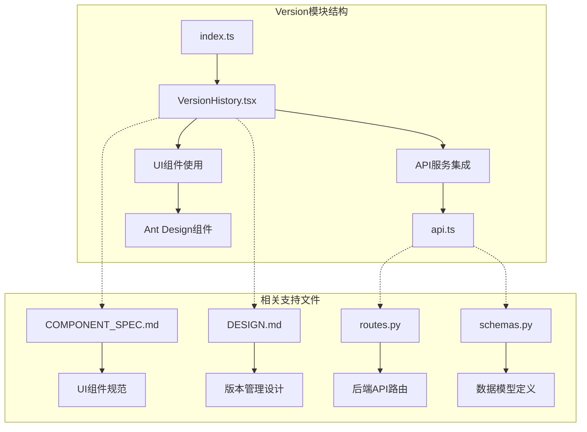
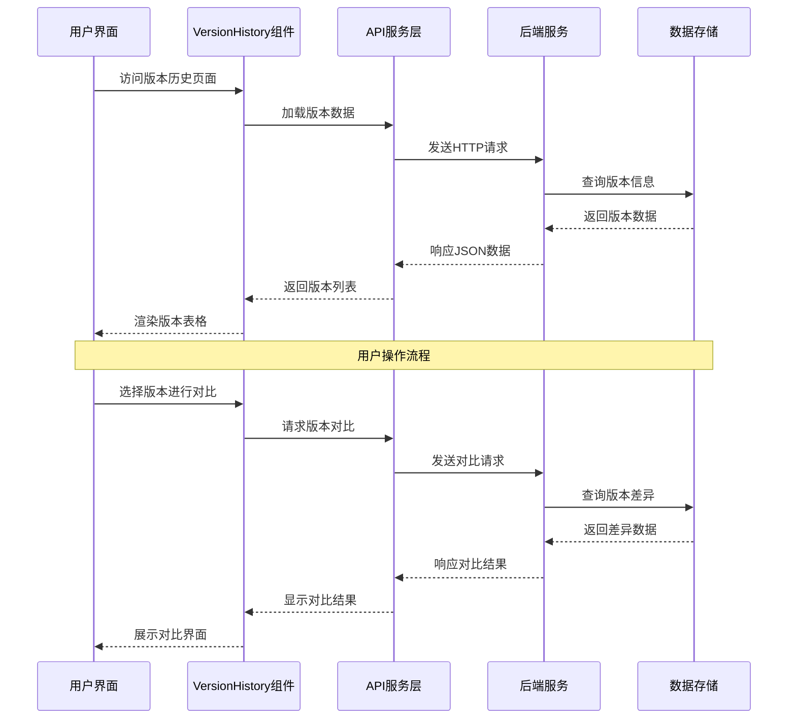
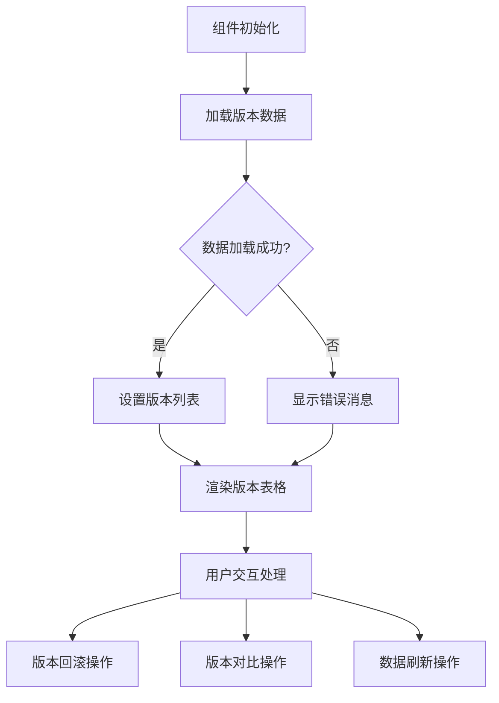
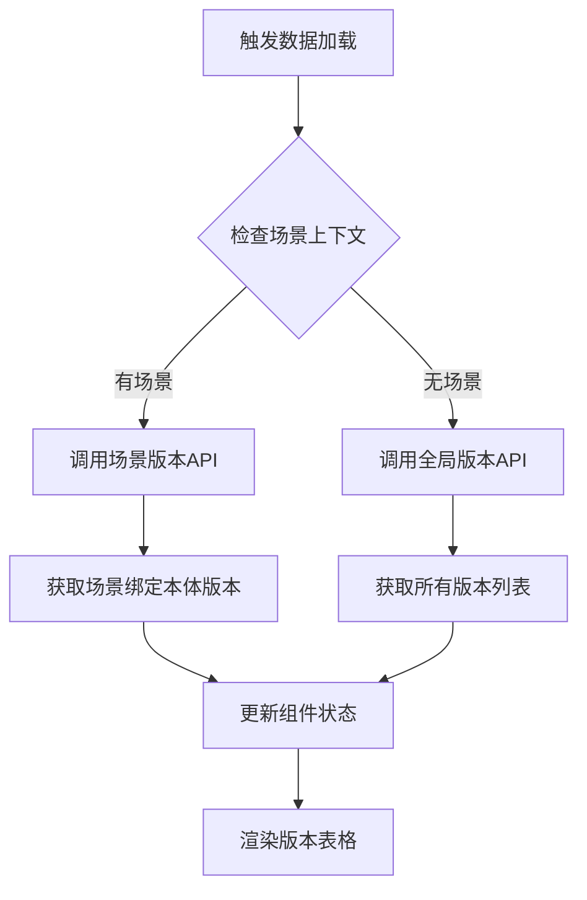
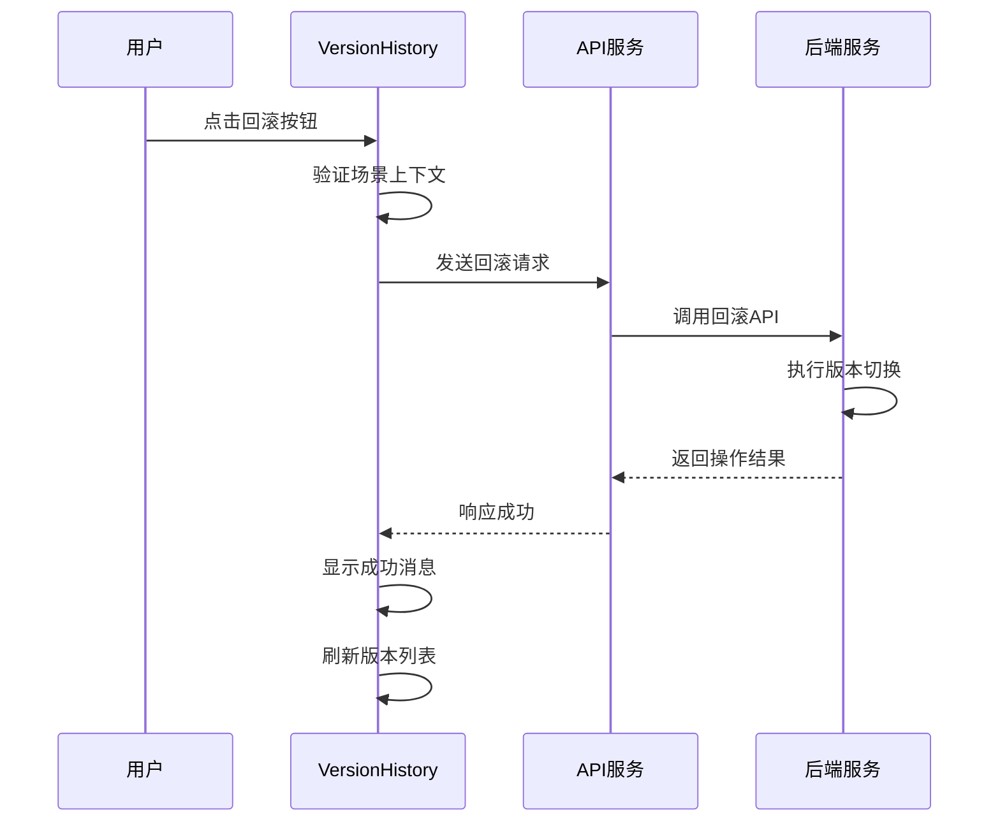
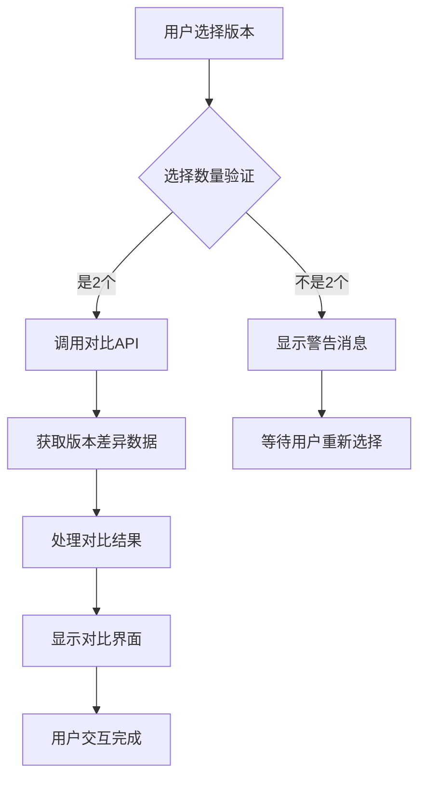
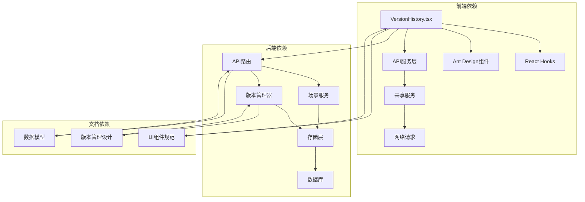

# Version模块

<cite>
**本文档引用的文件**
- [VersionHistory.tsx](file://frontend/src/modules/version/pages/VersionHistory.tsx)
- [index.ts](file://frontend/src/modules/version/index.ts)
- [api.ts](file://frontend/src/modules/shared/services/api.ts)
- [routes.py](file://odap/biz/platform/workspace/api/routes.py)
- [schemas.py](file://odap/biz/platform/workspace/api/schemas.py)
- [COMPONENT_SPEC.md](file://docs/04-ui/COMPONENT_SPEC.md)
- [DESIGN.md](file://docs/03-modules/ontology_management_engine/DESIGN.md)
</cite>

## 目录
1. [简介](#简介)
2. [项目结构](#项目结构)
3. [核心组件](#核心组件)
4. [架构概览](#架构概览)
5. [详细组件分析](#详细组件分析)
6. [依赖关系分析](#依赖关系分析)
7. [性能考虑](#性能考虑)
8. [故障排除指南](#故障排除指南)
9. [结论](#结论)

## 简介

Version模块是Ontology Graphiti平台中负责版本管理的核心前端模块。该模块提供了完整的版本历史查看、版本对比、版本切换和版本回滚功能。通过直观的用户界面设计和流畅的交互逻辑，用户可以轻松管理本体的版本历史，跟踪变更记录，并进行版本间的对比分析。

该模块基于React和Ant Design技术栈构建，集成了现代化的前端开发实践，包括TypeScript类型安全、React Hooks状态管理和组件化设计模式。后端通过RESTful API提供版本管理服务，支持场景级别的本体版本控制和跨场景的版本切换功能。

## 项目结构

Version模块采用模块化的文件组织结构，主要包含以下关键文件：

**图表来源**
- [index.ts:1-1](file://frontend/src/modules/version/index.ts#L1-L1)
- [VersionHistory.tsx:1-194](file://frontend/src/modules/version/pages/VersionHistory.tsx#L1-L194)

**章节来源**
- [index.ts:1-1](file://frontend/src/modules/version/index.ts#L1-L1)
- [COMPONENT_SPEC.md:204-241](file://docs/04-ui/COMPONENT_SPEC.md#L204-L241)

## 核心组件

Version模块的核心组件是VersionHistory，这是一个功能完整的版本历史管理界面。该组件实现了以下核心功能：

### 主要功能特性

1. **版本历史展示**：以表格形式展示所有版本的历史记录
2. **版本选择**：支持多选操作，用于版本对比
3. **版本回滚**：一键回滚到指定版本
4. **版本对比**：对比两个版本之间的差异
5. **数据刷新**：实时刷新版本数据
6. **状态管理**：显示版本的当前状态和统计数据

### 数据结构定义

组件使用了标准化的VersionItem接口来管理版本数据：

| 字段名 | 类型 | 描述 | 默认值 |
|--------|------|------|--------|
| version_id | string | 版本唯一标识符 | 必填 |
| ontology_id | string | 关联的本体ID | 可选 |
| parent_version | string | 父版本ID | 可选 |
| commit_message | string | 提交信息 | 可选 |
| created_at | string | 创建时间戳 | 必填 |
| status | string | 版本状态 | 可选 |
| is_current | boolean | 是否为当前版本 | 可选 |
| entity_count | number | 实体数量 | 可选 |
| relation_count | number | 关系数量 | 可选 |
| event_count | number | 事件数量 | 可选 |

**章节来源**
- [VersionHistory.tsx:7-18](file://frontend/src/modules/version/pages/VersionHistory.tsx#L7-L18)

## 架构概览

Version模块采用了清晰的分层架构设计，从前端界面到后端服务形成了完整的数据流：

**图表来源**
- [VersionHistory.tsx:31-47](file://frontend/src/modules/version/pages/VersionHistory.tsx#L31-L47)
- [api.ts:880-918](file://frontend/src/modules/shared/services/api.ts#L880-L918)
- [routes.py:551-708](file://odap/biz/platform/workspace/api/routes.py#L551-L708)

## 详细组件分析

### VersionHistory组件深度解析

VersionHistory组件是一个高度集成的React组件，实现了完整的版本管理功能。该组件使用了多种React高级特性来确保代码的可维护性和性能。

#### 组件状态管理

组件使用useState Hook管理核心状态：

**图表来源**
- [VersionHistory.tsx:20-76](file://frontend/src/modules/version/pages/VersionHistory.tsx#L20-L76)

#### 版本数据加载机制

组件通过智能的数据加载策略支持两种模式：

1. **场景级别模式**：当存在当前场景时，加载该场景绑定的本体版本
2. **全局模式**：当无场景上下文时，加载所有可用版本

**图表来源**
- [VersionHistory.tsx:31-47](file://frontend/src/modules/version/pages/VersionHistory.tsx#L31-L47)
- [api.ts:880-918](file://frontend/src/modules/shared/services/api.ts#L880-L918)

#### 版本回滚功能实现

版本回滚功能提供了安全的版本切换机制：

**图表来源**
- [VersionHistory.tsx:49-62](file://frontend/src/modules/version/pages/VersionHistory.tsx#L49-L62)
- [api.ts:890-898](file://frontend/src/modules/shared/services/api.ts#L890-L898)

#### 版本对比功能设计

版本对比功能允许用户选择任意两个版本进行详细对比：

**图表来源**
- [VersionHistory.tsx:64-76](file://frontend/src/modules/version/pages/VersionHistory.tsx#L64-L76)
- [COMPONENT_SPEC.md:229-241](file://docs/04-ui/COMPONENT_SPEC.md#L229-L241)

### UI组件集成与样式设计

VersionHistory组件充分利用了Ant Design的设计系统，提供了丰富的UI组件和一致的视觉体验：

#### 表格列配置

组件定义了多个精心设计的表格列来展示版本信息：

| 列名称 | 数据字段 | 显示格式 | 功能作用 |
|--------|----------|----------|----------|
| 版本号 | version_id | 图标+文本 | 标识版本唯一性 |
| 时间 | created_at | 本地化日期时间 | 显示创建时间 |
| 提交信息 | commit_message | 文本省略 | 描述版本变更内容 |
| 状态 | status/is_current | 颜色标签 | 显示版本状态和当前版本标识 |
| 数据量 | entity_count/relation_count/event_count | 多指标统计 | 展示版本数据规模 |

#### 操作按钮设计

组件提供了直观的操作按钮来支持版本管理：

- **回滚按钮**：使用撤销图标，一键切换到目标版本
- **删除确认**：使用危险按钮和确认对话框，防止误操作
- **对比按钮**：启用条件为恰好选择了两个版本
- **刷新按钮**：重新加载最新的版本数据

**章节来源**
- [VersionHistory.tsx:78-151](file://frontend/src/modules/version/pages/VersionHistory.tsx#L78-L151)

## 依赖关系分析

Version模块的依赖关系体现了清晰的分层架构和模块化设计原则：

**图表来源**
- [VersionHistory.tsx:1-6](file://frontend/src/modules/version/pages/VersionHistory.tsx#L1-L6)
- [routes.py:551-588](file://odap/biz/platform/workspace/api/routes.py#L551-L588)
- [COMPONENT_SPEC.md:204-241](file://docs/04-ui/COMPONENT_SPEC.md#L204-L241)

### 外部依赖分析

Version模块依赖于多个关键的外部库和框架：

1. **React生态系统**：使用现代React特性确保组件性能和开发效率
2. **Ant Design**：提供企业级UI组件和设计系统
3. **TypeScript**：增强代码类型安全性和开发体验
4. **API服务层**：封装网络请求逻辑，提供类型安全的接口

### 内部模块耦合

模块内部的耦合度保持在合理范围内，主要体现在：

- **组件与服务层**：通过API服务进行松耦合通信
- **状态管理**：使用React Hooks避免复杂的状态管理库依赖
- **UI组件**：统一使用Ant Design确保视觉一致性

**章节来源**
- [VersionHistory.tsx:1-6](file://frontend/src/modules/version/pages/VersionHistory.tsx#L1-L6)
- [api.ts:880-918](file://frontend/src/modules/shared/services/api.ts#L880-L918)

## 性能考虑

Version模块在设计时充分考虑了性能优化，采用了多种策略来确保良好的用户体验：

### 数据加载优化

1. **条件加载**：根据场景上下文智能选择数据源
2. **缓存策略**：利用浏览器缓存减少重复请求
3. **分页加载**：表格默认每页10条记录，支持大数据集浏览

### 渲染性能优化

1. **虚拟滚动**：对于大量数据，可考虑实现虚拟滚动提升渲染性能
2. **状态分离**：将复杂状态分解为独立的useState调用
3. **memo优化**：对不频繁变化的数据使用useMemo进行缓存

### 网络请求优化

1. **并发请求**：合理安排API调用顺序，避免不必要的等待
2. **错误重试**：在网络异常时提供自动重试机制
3. **请求去重**：避免重复发送相同的请求

## 故障排除指南

### 常见问题及解决方案

#### 版本数据加载失败

**问题表现**：版本表格显示为空或加载状态持续

**可能原因**：
1. 网络连接问题
2. 场景上下文缺失
3. API服务不可用

**解决步骤**：
1. 检查网络连接状态
2. 确认当前场景是否正确设置
3. 查看浏览器开发者工具中的网络请求
4. 尝试刷新页面重新加载数据

#### 版本回滚操作失败

**问题表现**：点击回滚按钮后无响应或显示错误

**可能原因**：
1. 目标版本不存在
2. 权限不足
3. 场景绑定问题

**解决步骤**：
1. 确认目标版本ID正确性
2. 检查用户权限设置
3. 验证场景与本体的绑定关系
4. 查看控制台错误日志

#### 版本对比功能异常

**问题表现**：对比按钮不可用或对比结果为空

**可能原因**：
1. 未选择正确的版本数量
2. API服务端点问题
3. 版本数据格式不兼容

**解决步骤**：
1. 确保恰好选择了两个版本
2. 检查API服务端点可用性
3. 验证版本数据的完整性
4. 重新尝试对比操作

### 调试技巧

1. **浏览器开发者工具**：使用Network标签监控API请求
2. **控制台日志**：利用console.error输出详细的错误信息
3. **状态检查**：通过React DevTools检查组件状态
4. **API测试**：使用Postman等工具直接测试后端API

**章节来源**
- [VersionHistory.tsx:41-61](file://frontend/src/modules/version/pages/VersionHistory.tsx#L41-L61)

## 结论

Version模块作为Ontology Graphiti平台的核心功能模块，成功实现了完整的版本管理解决方案。该模块通过现代化的技术栈和清晰的架构设计，为用户提供了直观易用的版本管理界面。

### 主要成就

1. **功能完整性**：涵盖了版本历史查看、版本对比、版本回滚等核心功能
2. **用户体验**：采用Ant Design设计系统，提供一致且美观的界面
3. **技术先进性**：使用React Hooks和TypeScript确保代码质量和开发效率
4. **可扩展性**：模块化设计便于未来功能扩展和维护

### 技术亮点

- **智能数据加载**：根据场景上下文动态调整数据源
- **类型安全**：完整的TypeScript类型定义确保开发安全性
- **错误处理**：完善的错误处理机制提升系统稳定性
- **性能优化**：合理的状态管理和渲染策略保证良好性能

### 未来发展建议

1. **增强对比功能**：实现更详细的版本差异可视化
2. **添加搜索过滤**：支持按时间、状态等条件筛选版本
3. **导出功能**：提供版本数据的导出能力
4. **通知系统**：集成版本变更的通知机制

Version模块为整个平台的版本管理奠定了坚实的基础，其设计理念和实现方式为后续的功能扩展提供了良好的技术支撑。