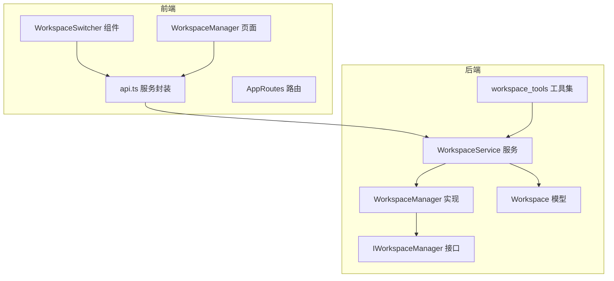
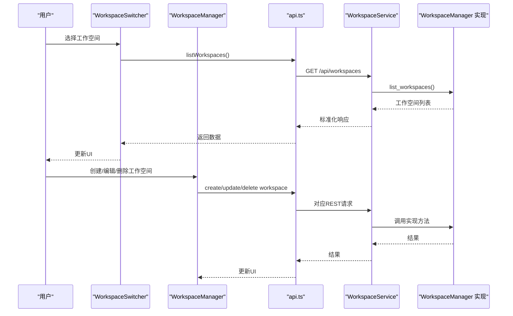
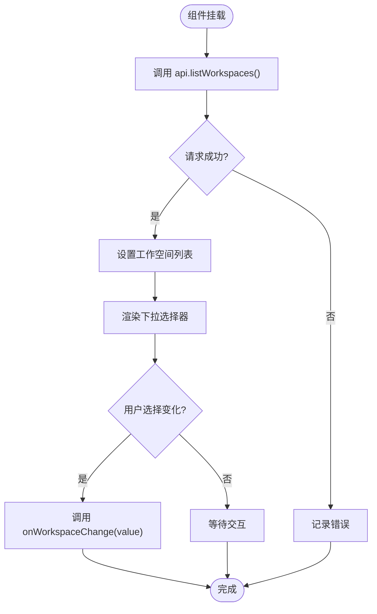
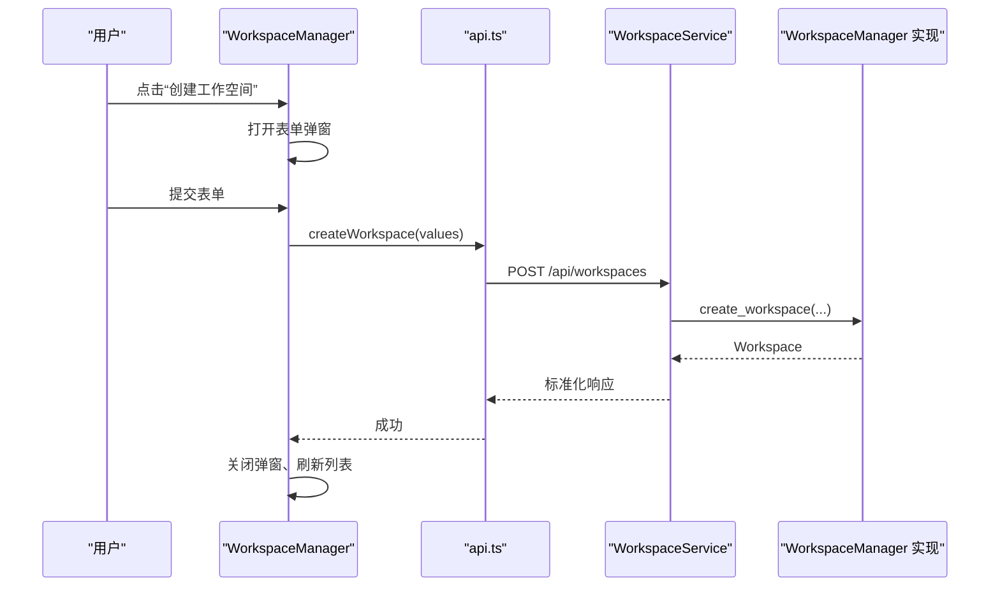
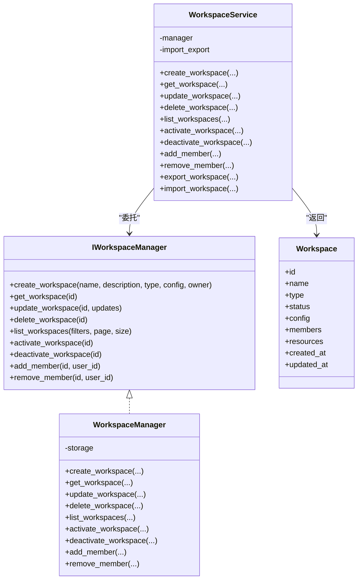
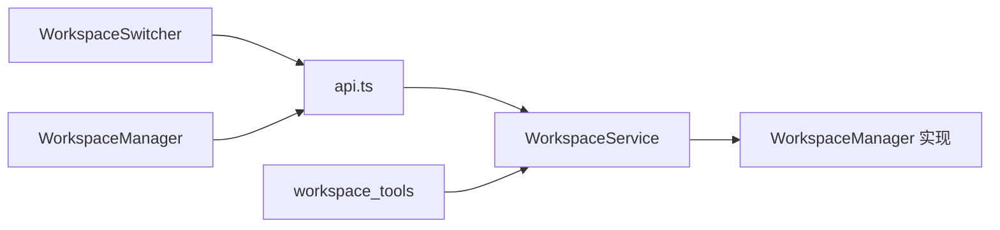

# Workspace模块

<cite>
**本文引用的文件**
- [WorkspaceSwitcher.tsx](file://frontend/src/modules/workspace/components/WorkspaceSwitcher.tsx)
- [WorkspaceManager.tsx](file://frontend/src/modules/workspace/pages/WorkspaceManager.tsx)
- [index.ts](file://frontend/src/modules/workspace/index.ts)
- [AppRoutes.tsx](file://frontend/src/AppRoutes.tsx)
- [api.ts](file://frontend/src/modules/shared/services/api.ts)
- [workspace.py（接口）](file://odap/biz/platform/workspace/interfaces/workspace.py)
- [workspace.py（实现）](file://odap/biz/platform/workspace/impl/workspace.py)
- [workspace_service.py](file://odap/biz/platform/workspace/services/workspace_service.py)
- [workspace.py（模型）](file://odap/biz/platform/workspace/models/workspace.py)
- [workspace_tools.py](file://odap/tools/agent_tools/workspace_tools.py)
- [BACKEND_API_DESIGN.md](file://docs/10-api/BACKEND_API_DESIGN.md)
- [test_e2e_flows.py](file://tests/e2e/test_e2e_flows.py)
</cite>

## 目录
1. [简介](#简介)
2. [项目结构](#项目结构)
3. [核心组件](#核心组件)
4. [架构概览](#架构概览)
5. [详细组件分析](#详细组件分析)
6. [依赖关系分析](#依赖关系分析)
7. [性能考虑](#性能考虑)
8. [故障排除指南](#故障排除指南)
9. [结论](#结论)
10. [附录](#附录)

## 简介
本文件面向Workspace模块的前端实现，系统性阐述工作空间切换器与工作空间管理页面的设计与实现，涵盖工作空间概念、隔离机制与切换逻辑，以及工作空间API的设计与实现（含场景管理与资源分配）。文档同时介绍组件状态管理与用户交互，并提供界面设计与操作流程说明，最后给出实际的实现示例与管理功能。

## 项目结构
Workspace模块位于前端与后端两侧，前端通过组件与页面提供用户交互，后端通过接口、服务与实现层支撑工作空间的生命周期管理与场景管理能力。

**图表来源**
- [WorkspaceSwitcher.tsx:1-79](file://frontend/src/modules/workspace/components/WorkspaceSwitcher.tsx#L1-L79)
- [WorkspaceManager.tsx:1-556](file://frontend/src/modules/workspace/pages/WorkspaceManager.tsx#L1-L556)
- [api.ts:649-689](file://frontend/src/modules/shared/services/api.ts#L649-L689)
- [workspace.py（接口）:8-131](file://odap/biz/platform/workspace/interfaces/workspace.py#L8-L131)
- [workspace.py（实现）:10-109](file://odap/biz/platform/workspace/impl/workspace.py#L10-L109)
- [workspace_service.py:10-304](file://odap/biz/platform/workspace/services/workspace_service.py#L10-L304)
- [workspace.py（模型）:10-52](file://odap/biz/platform/workspace/models/workspace.py#L10-L52)
- [workspace_tools.py:1-54](file://odap/tools/agent_tools/workspace_tools.py#L1-L54)

**章节来源**
- [index.ts:1-2](file://frontend/src/modules/workspace/index.ts#L1-L2)
- [AppRoutes.tsx:27-59](file://frontend/src/AppRoutes.tsx#L27-L59)

## 核心组件
- 工作空间切换器：提供工作空间下拉选择、新建与设置入口，支持加载与切换工作空间。
- 工作空间管理页面：提供工作空间列表、创建/编辑/删除/启用/停用操作，以及场景管理与图谱构建能力。
- API封装：统一调用后端工作空间相关REST接口，返回标准化响应。
- 路由集成：在应用路由中注册工作空间管理页面，提供受保护访问。

**章节来源**
- [WorkspaceSwitcher.tsx:7-79](file://frontend/src/modules/workspace/components/WorkspaceSwitcher.tsx#L7-L79)
- [WorkspaceManager.tsx:21-556](file://frontend/src/modules/workspace/pages/WorkspaceManager.tsx#L21-L556)
- [api.ts:649-689](file://frontend/src/modules/shared/services/api.ts#L649-L689)
- [AppRoutes.tsx:49-49](file://frontend/src/AppRoutes.tsx#L49-L49)

## 架构概览
前端组件通过api.ts封装的HTTP请求与后端交互；后端通过WorkspaceService协调WorkspaceManager实现与存储，完成工作空间的增删改查、启停、成员管理与导入导出等操作；同时提供场景管理能力，支持在工作空间内创建、编辑、删除场景并触发图谱构建。

**图表来源**
- [WorkspaceSwitcher.tsx:18-28](file://frontend/src/modules/workspace/components/WorkspaceSwitcher.tsx#L18-L28)
- [WorkspaceManager.tsx:48-129](file://frontend/src/modules/workspace/pages/WorkspaceManager.tsx#L48-L129)
- [api.ts:649-689](file://frontend/src/modules/shared/services/api.ts#L649-L689)
- [workspace_service.py:126-164](file://odap/biz/platform/workspace/services/workspace_service.py#L126-L164)
- [workspace.py（实现）:76-79](file://odap/biz/platform/workspace/impl/workspace.py#L76-L79)

## 详细组件分析

### 工作空间切换器（WorkspaceSwitcher）
- 功能要点
  - 加载工作空间列表并在下拉框中展示，支持活跃状态标签。
  - 处理工作空间切换回调，传递给父级组件。
  - 提供“新建”和“设置”按钮占位，便于后续扩展。
- 状态管理
  - 使用useState维护工作空间列表与加载状态。
  - 使用useEffect在挂载时加载数据。
- 用户交互
  - 下拉选择触发onWorkspaceChange回调。
  - 按钮点击目前为占位行为，预留扩展点。

**图表来源**
- [WorkspaceSwitcher.tsx:14-32](file://frontend/src/modules/workspace/components/WorkspaceSwitcher.tsx#L14-L32)

**章节来源**
- [WorkspaceSwitcher.tsx:1-79](file://frontend/src/modules/workspace/components/WorkspaceSwitcher.tsx#L1-L79)

### 工作空间管理页面（WorkspaceManager）
- 功能要点
  - 工作空间管理：列表展示、创建/编辑、启用/停用、删除。
  - 场景管理：按工作空间维度展示场景，支持创建/编辑/删除与图谱构建。
  - 统计面板：显示总数、活跃数、停用数与场景总数。
  - Tab切换：在“场景管理”与“工作空间管理”之间切换。
- 状态管理
  - 使用多个useState维护工作空间、场景、加载状态、弹窗可见性、当前编辑项等。
  - 使用useEffect在挂载与依赖变化时加载数据。
- 用户交互
  - 表单校验与提交，弹窗确认删除，消息提示反馈。
  - 图谱构建流程中使用消息提示与加载态。

**图表来源**
- [WorkspaceManager.tsx:61-129](file://frontend/src/modules/workspace/pages/WorkspaceManager.tsx#L61-L129)
- [api.ts:649-653](file://frontend/src/modules/shared/services/api.ts#L649-L653)
- [workspace_service.py:17-55](file://odap/biz/platform/workspace/services/workspace_service.py#L17-L55)
- [workspace.py（实现）:16-36](file://odap/biz/platform/workspace/impl/workspace.py#L16-L36)

**章节来源**
- [WorkspaceManager.tsx:1-556](file://frontend/src/modules/workspace/pages/WorkspaceManager.tsx#L1-L556)

### 工作空间API设计与实现
- 前端API封装
  - 提供创建、更新、删除、启用、停用、列表等方法，对应后端REST接口。
  - 提供场景相关的查询、创建、更新、删除与图谱构建方法。
- 后端服务与实现
  - WorkspaceService作为门面，协调WorkspaceManager实现与导入导出管理。
  - WorkspaceManager实现具体CRUD、启停、成员管理与列表过滤。
  - Workspace模型定义状态、类型、配置、资源与元数据等字段。
- 场景管理
  - 支持在工作空间内创建/编辑/删除场景，并可触发图谱构建。
  - 提供场景统计指标（文档数、事件数、实体数）。

**图表来源**
- [workspace.py（接口）:8-131](file://odap/biz/platform/workspace/interfaces/workspace.py#L8-L131)
- [workspace.py（实现）:10-109](file://odap/biz/platform/workspace/impl/workspace.py#L10-L109)
- [workspace_service.py:10-304](file://odap/biz/platform/workspace/services/workspace_service.py#L10-L304)
- [workspace.py（模型）:36-52](file://odap/biz/platform/workspace/models/workspace.py#L36-L52)

**章节来源**
- [api.ts:649-689](file://frontend/src/modules/shared/services/api.ts#L649-L689)
- [workspace_service.py:10-304](file://odap/biz/platform/workspace/services/workspace_service.py#L10-L304)
- [workspace.py（实现）:10-109](file://odap/biz/platform/workspace/impl/workspace.py#L10-L109)
- [workspace.py（模型）:10-52](file://odap/biz/platform/workspace/models/workspace.py#L10-L52)
- [BACKEND_API_DESIGN.md:200-305](file://docs/10-api/BACKEND_API_DESIGN.md#L200-L305)

### 工作空间概念、隔离机制与切换逻辑
- 概念
  - 工作空间用于组织与隔离资源、成员与场景，支持多种类型（默认、共享、私有、临时）与状态（创建中、活跃、停用、删除中、错误）。
- 隔离机制
  - 配置中包含隔离级别、资源配额、网络策略、环境变量与特性开关，用于在运行时进行资源与行为控制。
- 切换逻辑
  - 前端通过WorkspaceSwitcher加载并选择工作空间，调用回调通知上层；WorkspaceManager在场景管理tab中根据当前工作空间加载对应场景列表。

**章节来源**
- [workspace.py（模型）:27-52](file://odap/biz/platform/workspace/models/workspace.py#L27-L52)
- [WorkspaceSwitcher.tsx:18-32](file://frontend/src/modules/workspace/components/WorkspaceSwitcher.tsx#L18-L32)
- [WorkspaceManager.tsx:40-46](file://frontend/src/modules/workspace/pages/WorkspaceManager.tsx#L40-L46)

### 组件状态管理与用户交互
- 状态管理
  - 使用React Hooks管理工作空间列表、场景数据、加载状态、弹窗与表单状态。
  - 通过useEffect在依赖变化时触发数据加载。
- 用户交互
  - 表格列渲染结合状态标签与图标，增强可读性。
  - 弹窗表单提供校验与提交，消息提示反馈操作结果。
  - 场景构建流程中使用消息提示与加载态，避免重复提交。

**章节来源**
- [WorkspaceManager.tsx:21-556](file://frontend/src/modules/workspace/pages/WorkspaceManager.tsx#L21-L556)

### 界面设计与操作流程
- 设计要点
  - 使用Ant Design组件（Select、Table、Modal、Button、Tabs、Statistic）保证一致性与可用性。
  - 统一的消息提示风格，区分成功/失败/警告。
- 操作流程
  - 工作空间管理：创建/编辑/删除/启用/停用。
  - 场景管理：创建/编辑/删除/构建图谱。
  - 切换流程：顶部选择器切换工作空间，场景tab自动加载对应场景。

**章节来源**
- [WorkspaceManager.tsx:407-556](file://frontend/src/modules/workspace/pages/WorkspaceManager.tsx#L407-L556)
- [WorkspaceSwitcher.tsx:42-79](file://frontend/src/modules/workspace/components/WorkspaceSwitcher.tsx#L42-L79)

## 依赖关系分析
- 前端依赖
  - WorkspaceSwitcher依赖api.ts提供的工作空间列表与切换回调。
  - WorkspaceManager依赖api.ts提供的工作空间与场景相关接口，并通过useWorkspace/useScenario刷新上下文。
- 后端依赖
  - WorkspaceService依赖WorkspaceManager实现与导入导出管理。
  - workspace_tools提供Agent侧工作空间查询与分析能力，依赖WorkspaceService。

**图表来源**
- [WorkspaceSwitcher.tsx:1-10](file://frontend/src/modules/workspace/components/WorkspaceSwitcher.tsx#L1-L10)
- [WorkspaceManager.tsx:4-6](file://frontend/src/modules/workspace/pages/WorkspaceManager.tsx#L4-L6)
- [api.ts:649-689](file://frontend/src/modules/shared/services/api.ts#L649-L689)
- [workspace_service.py:10-16](file://odap/biz/platform/workspace/services/workspace_service.py#L10-L16)
- [workspace_tools.py:1-12](file://odap/tools/agent_tools/workspace_tools.py#L1-L12)

**章节来源**
- [index.ts:1-2](file://frontend/src/modules/workspace/index.ts#L1-L2)
- [AppRoutes.tsx:2-49](file://frontend/src/AppRoutes.tsx#L2-L49)
- [workspace_tools.py:1-54](file://odap/tools/agent_tools/workspace_tools.py#L1-L54)

## 性能考虑
- 列表分页与懒加载：后端提供分页参数，前端按需加载，减少一次性数据量。
- 并发控制：场景加载使用按工作空间的并发状态字典，避免重复请求。
- UI反馈：长耗时操作（如图谱构建）使用消息提示与加载态，提升用户体验。
- 数据缓存：前端可基于useEffect依赖与状态合并策略减少无效重渲染。

## 故障排除指南
- 加载失败
  - 检查api.ts中的请求URL与认证头是否正确。
  - 查看控制台错误日志与消息提示。
- 权限问题
  - E2E测试中模拟权限检查，确保OPA策略与权限后端正常。
- 状态不一致
  - 确保调用reloadWorkspaces/reloadScenarios刷新上下文状态。
- 接口变更
  - 对照后端API设计文档核对路径与请求体格式。

**章节来源**
- [test_e2e_flows.py:86-137](file://tests/e2e/test_e2e_flows.py#L86-L137)
- [BACKEND_API_DESIGN.md:200-305](file://docs/10-api/BACKEND_API_DESIGN.md#L200-L305)

## 结论
Workspace模块在前端提供了直观的工作空间切换与管理能力，在后端通过清晰的接口与服务层实现了工作空间的全生命周期管理与场景管理。整体设计遵循前后端分离与职责单一原则，具备良好的扩展性与可维护性。

## 附录
- 实际实现示例路径
  - 工作空间切换器：[WorkspaceSwitcher.tsx:1-79](file://frontend/src/modules/workspace/components/WorkspaceSwitcher.tsx#L1-L79)
  - 工作空间管理页面：[WorkspaceManager.tsx:1-556](file://frontend/src/modules/workspace/pages/WorkspaceManager.tsx#L1-L556)
  - API封装：[api.ts:649-689](file://frontend/src/modules/shared/services/api.ts#L649-L689)
  - 后端接口与实现：[workspace.py（接口）:8-131](file://odap/biz/platform/workspace/interfaces/workspace.py#L8-L131)、[workspace.py（实现）:10-109](file://odap/biz/platform/workspace/impl/workspace.py#L10-L109)、[workspace_service.py:10-304](file://odap/biz/platform/workspace/services/workspace_service.py#L10-L304)
  - Agent工具集：[workspace_tools.py:1-54](file://odap/tools/agent_tools/workspace_tools.py#L1-L54)
  - 后端API设计：[BACKEND_API_DESIGN.md:200-305](file://docs/10-api/BACKEND_API_DESIGN.md#L200-L305)