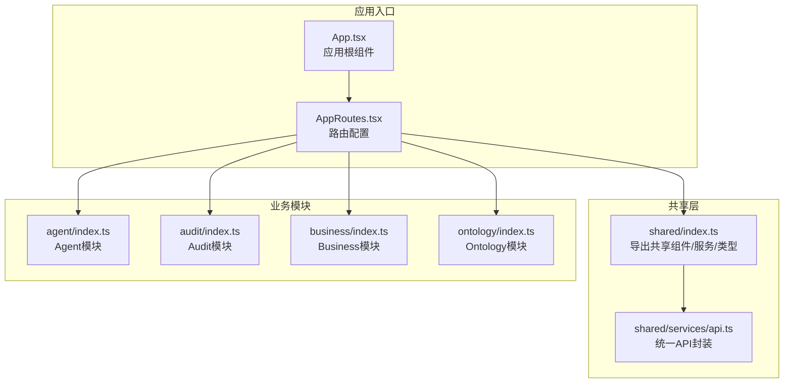
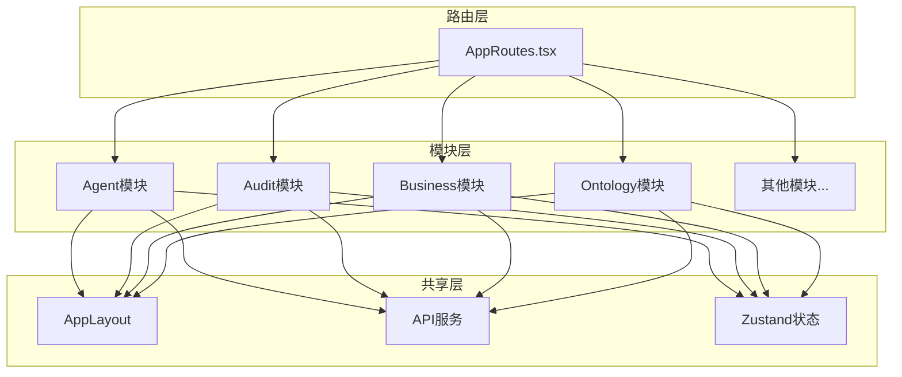
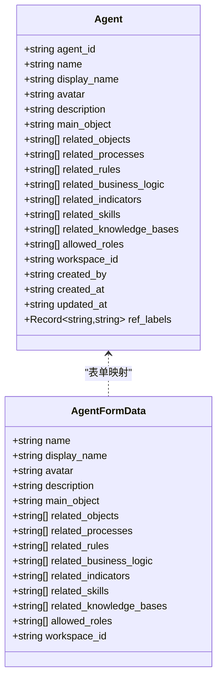
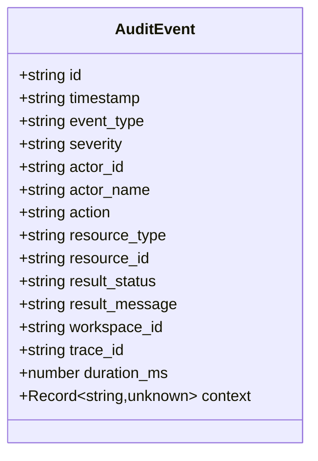
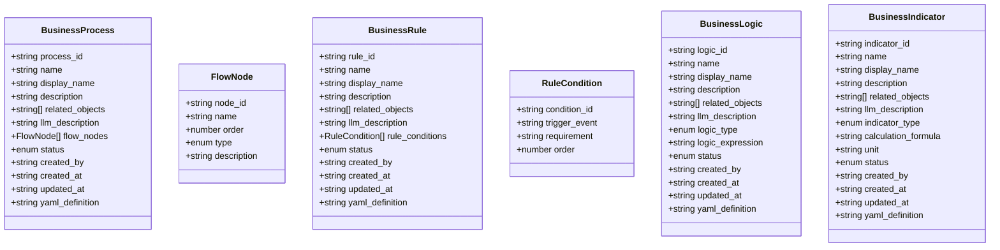
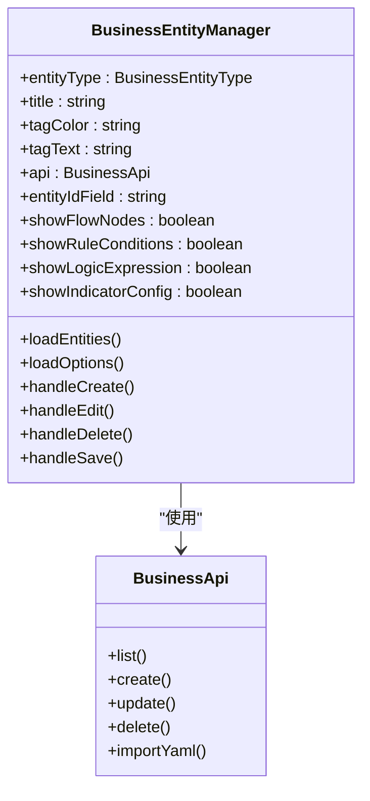
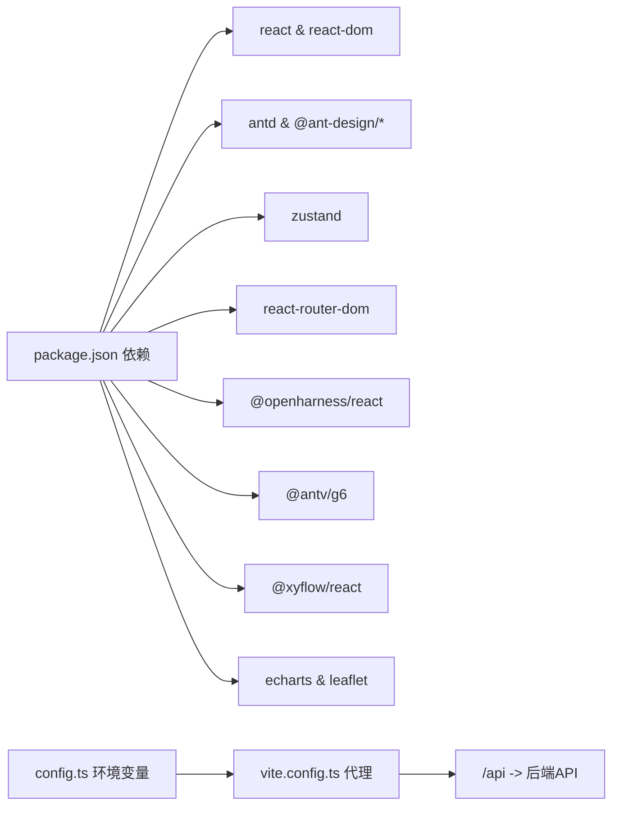

# 业务模块前端实现

<cite>
**本文档引用的文件**
- [frontend/src/App.tsx](file://frontend/src/App.tsx)
- [frontend/src/AppRoutes.tsx](file://frontend/src/AppRoutes.tsx)
- [frontend/src/config.ts](file://frontend/src/config.ts)
- [frontend/package.json](file://frontend/package.json)
- [frontend/vite.config.ts](file://frontend/vite.config.ts)
- [frontend/src/modules/shared/index.ts](file://frontend/src/modules/shared/index.ts)
- [frontend/src/modules/shared/services/api.ts](file://frontend/src/modules/shared/services/api.ts)
- [frontend/src/modules/agent/index.ts](file://frontend/src/modules/agent/index.ts)
- [frontend/src/modules/agent/types.ts](file://frontend/src/modules/agent/types.ts)
- [frontend/src/modules/audit/index.ts](file://frontend/src/modules/audit/index.ts)
- [frontend/src/modules/business/index.ts](file://frontend/src/modules/business/index.ts)
- [frontend/src/modules/business/types.ts](file://frontend/src/modules/business/types.ts)
- [frontend/src/modules/business/components/BusinessEntityManager.tsx](file://frontend/src/modules/business/components/BusinessEntityManager.tsx)
- [frontend/src/modules/business/services/businessApi.ts](file://frontend/src/modules/business/services/businessApi.ts)
- [frontend/src/modules/ontology/index.ts](file://frontend/src/modules/ontology/index.ts)
- [frontend/src/modules/ontology/pages/OntologySemanticNetwork.tsx](file://frontend/src/modules/ontology/pages/OntologySemanticNetwork.tsx)
</cite>

## 更新摘要
**变更内容**
- 业务规则管理（业务过程、规则、指标、逻辑）已从独立菜单迁移到语义地图菜单中
- BusinessEntityManager组件现在直接集成到语义地图界面中
- 路由配置中移除了独立的业务规则菜单路径
- 业务实体管理功能与语义地图展示紧密结合

## 目录
1. [引言](#引言)
2. [项目结构](#项目结构)
3. [核心组件](#核心组件)
4. [架构总览](#架构总览)
5. [详细组件分析](#详细组件分析)
6. [依赖关系分析](#依赖关系分析)
7. [性能考虑](#性能考虑)
8. [故障排查指南](#故障排查指南)
9. [结论](#结论)
10. [附录](#附录)

## 引言
本文件面向ODAP平台的前端业务模块，系统化梳理按业务域划分的模块化架构，覆盖Agent、Audit、Business、Config、Ingest、Knowledge、Ontology、QA、Roles、Shared、Simulation、System、Version、Workspace等模块。文档从架构设计、组件组织、路由配置、模块间通信与状态共享、数据流转、独立性与可复用性、开发规范与接口约定、集成测试策略以及实际业务场景实现等方面进行全面说明，帮助开发者快速理解并高效扩展前端能力。

**更新** 业务模块前端实现已更新以反映菜单结构的变化：业务规则管理（业务过程、规则、指标、逻辑）现在直接集成到语义地图菜单中，不再作为独立的业务规则菜单存在。

## 项目结构
前端采用模块化目录结构，按业务域划分模块，每个模块内部再细分为页面、组件、服务、类型定义、状态管理等子目录，确保高内聚低耦合。应用入口通过路由集中注册，配合共享布局与认证保护，形成清晰的导航与权限控制体系。

**图示来源**
- [frontend/src/App.tsx:1-65](file://frontend/src/App.tsx#L1-L65)
- [frontend/src/AppRoutes.tsx:1-71](file://frontend/src/AppRoutes.tsx#L1-L71)
- [frontend/src/modules/shared/index.ts:1-11](file://frontend/src/modules/shared/index.ts#L1-L11)
- [frontend/src/modules/shared/services/api.ts:1-800](file://frontend/src/modules/shared/services/api.ts#L1-L800)
- [frontend/src/modules/agent/index.ts:1-5](file://frontend/src/modules/agent/index.ts#L1-L5)
- [frontend/src/modules/audit/index.ts:1-2](file://frontend/src/modules/audit/index.ts#L1-L2)
- [frontend/src/modules/business/index.ts:1-6](file://frontend/src/modules/business/index.ts#L1-L6)
- [frontend/src/modules/ontology/index.ts:1-2](file://frontend/src/modules/ontology/index.ts#L1-L2)

**章节来源**
- [frontend/src/App.tsx:1-65](file://frontend/src/App.tsx#L1-L65)
- [frontend/src/AppRoutes.tsx:1-71](file://frontend/src/AppRoutes.tsx#L1-L71)
- [frontend/src/modules/shared/index.ts:1-11](file://frontend/src/modules/shared/index.ts#L1-L11)

## 核心组件
- 应用根组件与工作空间初始化：负责登录页识别、工作空间列表加载与持久化选择、主内容区域渲染。
- 路由系统：集中声明所有业务路由，提供登录保护与默认跳转。
- 共享API服务：统一封装后端接口，支持场景、本体摄入、版本、审计、查询等能力。
- 构建代理与环境变量：通过Vite代理转发请求，支持开发期跨域与调试。

**章节来源**
- [frontend/src/App.tsx:8-54](file://frontend/src/App.tsx#L8-L54)
- [frontend/src/AppRoutes.tsx:21-27](file://frontend/src/AppRoutes.tsx#L21-L27)
- [frontend/src/modules/shared/services/api.ts:77-800](file://frontend/src/modules/shared/services/api.ts#L77-L800)
- [frontend/vite.config.ts:10-45](file://frontend/vite.config.ts#L10-L45)
- [frontend/src/config.ts:1-4](file://frontend/src/config.ts#L1-L4)

## 架构总览
ODAP前端采用"模块化+共享层"的双层架构：
- 模块层：按业务域拆分，每个模块自包含页面、组件、服务与类型定义，便于独立演进与复用。
- 共享层：提供统一布局、国际化、样式、工具函数与API客户端，降低重复代码与提升一致性。
- 路由层：集中管理页面级路由，结合认证守卫实现访问控制。
- 数据流：通过共享API服务与Zustand状态库实现跨模块状态共享与数据缓存。

**图示来源**
- [frontend/src/AppRoutes.tsx:29-71](file://frontend/src/AppRoutes.tsx#L29-L71)
- [frontend/src/modules/shared/index.ts:1-11](file://frontend/src/modules/shared/index.ts#L1-L11)
- [frontend/src/modules/shared/services/api.ts:77-800](file://frontend/src/modules/shared/services/api.ts#L77-L800)

## 详细组件分析

### Agent模块
- 功能职责：Agent管理、我的Agent列表、Agent聊天界面。
- 组件组织：页面组件位于pages目录，类型定义位于types目录；通过index导出页面组件供路由使用。
- 路由配置：在AppRoutes中注册"/my-agents"、"/agent-chat/:agentId"等路径。
- 数据模型：Agent类型包含标识、名称、头像、描述、关联对象与技能、允许角色等字段；表单类型用于创建/编辑。
- 状态共享：通过共享API服务与Zustand状态实现Agent列表、当前会话等状态的跨页面共享。

**图示来源**
- [frontend/src/modules/agent/types.ts:1-45](file://frontend/src/modules/agent/types.ts#L1-L45)

**章节来源**
- [frontend/src/modules/agent/index.ts:1-5](file://frontend/src/modules/agent/index.ts#L1-L5)
- [frontend/src/modules/agent/types.ts:1-45](file://frontend/src/modules/agent/types.ts#L1-L45)
- [frontend/src/AppRoutes.tsx:34-36](file://frontend/src/AppRoutes.tsx#L34-L36)

### Audit模块
- 功能职责：审计日志查看、统计与时间线展示。
- 组件组织：页面组件位于pages目录；通过index导出页面组件。
- 路由配置：在AppRoutes中注册"/audit"路径。
- 数据模型：审计事件类型包含时间戳、事件类型、严重级别、操作者、动作、资源、结果、工作空间、追踪ID等字段；提供查询与统计API。

**图示来源**
- [frontend/src/modules/shared/services/api.ts:40-56](file://frontend/src/modules/shared/services/api.ts#L40-L56)

**章节来源**
- [frontend/src/modules/audit/index.ts:1-2](file://frontend/src/modules/audit/index.ts#L1-L2)
- [frontend/src/AppRoutes.tsx:63](file://frontend/src/AppRoutes.tsx#L63)
- [frontend/src/modules/shared/services/api.ts:680-746](file://frontend/src/modules/shared/services/api.ts#L680-L746)

### Business模块
- 功能职责：业务流程、规则、逻辑、指标的定义与管理，支持YAML定义与发布状态管理。
- 组件组织：页面组件位于pages目录，类型定义位于types目录；通过index导出页面组件。
- 路由配置：在AppRoutes中注册"/business/process"、"/business/rules"、"/business/indicators"、"/business/logic"、"/business/entities"、"/business/extraction"等路径。
- 数据模型：包含流程节点、规则条件、逻辑表达式、指标计算公式等类型；提供统一的业务实体抽象与表单类型。
- **更新** 业务实体管理器现在直接集成到语义地图界面中，通过BusinessEntityManager组件提供统一的业务实体管理功能。

**图示来源**
- [frontend/src/modules/business/types.ts:1-167](file://frontend/src/modules/business/types.ts#L1-L167)

**章节来源**
- [frontend/src/modules/business/index.ts:1-6](file://frontend/src/modules/business/index.ts#L1-L6)
- [frontend/src/modules/business/types.ts:1-167](file://frontend/src/modules/business/types.ts#L1-L167)
- [frontend/src/AppRoutes.tsx:42-47](file://frontend/src/AppRoutes.tsx#L42-L47)

### Ontology模块
- 功能职责：本体语义网络展示与蓝图设计器，现集成了业务实体管理功能。
- 组件组织：页面组件位于pages目录；通过index导出页面组件。
- 路由配置：在AppRoutes中注册"/ontology"、"/blueprint"等路径。
- 数据模型：通过共享API服务提供本体摄入、构建、版本管理、文档查询等能力。
- **更新** OntologySemanticNetwork页面现在集成了业务实体管理功能，可以直接在语义地图中管理业务过程、规则、逻辑和指标。

**章节来源**
- [frontend/src/modules/ontology/index.ts:1-2](file://frontend/src/modules/ontology/index.ts#L1-L2)
- [frontend/src/AppRoutes.tsx:38-41](file://frontend/src/AppRoutes.tsx#L38-L41)

### Shared模块
- 功能职责：提供共享布局、组件、服务、类型与状态管理。
- 组件组织：components、services、stores、types等目录；index集中导出。
- API封装：统一的fetch封装与客户端，支持JSON与文件上传、健康检查、工作空间管理等。
- 状态管理：推荐使用Zustand实现跨模块状态共享（如当前工作空间、右侧面板开关等）。

**章节来源**
- [frontend/src/modules/shared/index.ts:1-11](file://frontend/src/modules/shared/index.ts#L1-L11)
- [frontend/src/modules/shared/services/api.ts:1-800](file://frontend/src/modules/shared/services/api.ts#L1-L800)

### BusinessEntityManager组件
- 功能职责：统一的业务实体管理器，支持业务过程、规则、逻辑、指标的创建、编辑、删除和查看。
- 组件特点：通过entityType参数区分不同类型的业务实体，动态显示相应的表单字段和验证规则。
- 集成方式：直接集成到语义地图界面中，提供无缝的业务实体管理体验。
- 关联关系：支持与其他业务实体的关联管理，如业务过程与规则、逻辑、指标的关联。

**图示来源**
- [frontend/src/modules/business/components/BusinessEntityManager.tsx:111-142](file://frontend/src/modules/business/components/BusinessEntityManager.tsx#L111-L142)

**章节来源**
- [frontend/src/modules/business/components/BusinessEntityManager.tsx:1-200](file://frontend/src/modules/business/components/BusinessEntityManager.tsx#L1-L200)
- [frontend/src/modules/business/services/businessApi.ts:1-82](file://frontend/src/modules/business/services/businessApi.ts#L1-L82)

### 其他模块（概览）
- Config模块：策略/配置管理（页面位于pages目录，通过index导出）。
- Ingest模块：数据摄入面板（页面位于pages目录，通过index导出）。
- Knowledge模块：知识库（页面位于pages目录，通过index导出）。
- Roles模块：角色管理（页面位于pages目录，通过index导出）。
- Simulation模块：仿真器（页面位于pages目录，通过index导出）。
- System模块：系统管理（页面位于pages目录，通过index导出）。
- Version模块：版本历史（页面位于pages目录，通过index导出）。
- Workspace模块：工作空间管理（页面位于pages目录，通过index导出）。

**章节来源**
- [frontend/src/AppRoutes.tsx:4-17](file://frontend/src/AppRoutes.tsx#L4-L17)
- [frontend/src/AppRoutes.tsx:48-67](file://frontend/src/AppRoutes.tsx#L48-L67)

## 依赖关系分析
- 技术栈：React 19、Ant Design 6、@openharness/react、Zustand、React Router Dom 7、@ant-design/* 图表库、@antv/g6、@xyflow/react、ECharts、Leaflet等。
- 构建与代理：Vite提供开发服务器与代理，支持跨域转发至后端API；环境变量控制代理目标。
- 依赖注入：通过共享API服务与全局状态库实现模块间解耦与数据共享。

**图示来源**
- [frontend/package.json:15-33](file://frontend/package.json#L15-L33)
- [frontend/vite.config.ts:10-45](file://frontend/vite.config.ts#L10-L45)
- [frontend/src/config.ts:1-4](file://frontend/src/config.ts#L1-L4)

**章节来源**
- [frontend/package.json:15-33](file://frontend/package.json#L15-L33)
- [frontend/vite.config.ts:10-45](file://frontend/vite.config.ts#L10-L45)
- [frontend/src/config.ts:1-4](file://frontend/src/config.ts#L1-L4)

## 性能考虑
- 懒加载与按需导入：对大型图表库与可视化组件采用动态导入，减少首屏体积。
- 状态缓存：使用Zustand缓存常用数据（如工作空间、场景、审计统计），避免重复请求。
- 请求合并与节流：对高频查询（如搜索、筛选）增加防抖/节流，减少后端压力。
- 图表优化：对G6、ECharts等组件启用虚拟滚动与增量更新，限制节点数量与层级深度。
- 缓存策略：对静态资源与API响应设置合理的缓存头，结合版本号实现失效控制。

## 故障排查指南
- 登录与鉴权：若出现未授权跳转，请检查本地存储中的token是否存在与有效。
- 工作空间加载：若加载中长时间卡顿，检查后端健康状态与代理配置是否正确。
- API请求失败：确认Vite代理目标与后端服务连通性，查看代理日志输出。
- 审计查询：若审计事件为空，请检查查询参数（时间范围、严重级别、Actor等）是否合理。
- **更新** 业务实体管理：若业务实体无法加载或保存，请检查语义地图版本切换和本体ID配置。

**章节来源**
- [frontend/src/App.tsx:14-34](file://frontend/src/App.tsx#L14-L34)
- [frontend/src/AppRoutes.tsx:21-27](file://frontend/src/AppRoutes.tsx#L21-L27)
- [frontend/vite.config.ts:23-43](file://frontend/vite.config.ts#L23-L43)

## 结论
ODAP前端通过模块化架构实现了高内聚、低耦合的业务域划分，配合共享层与统一API服务，既保证了各模块的独立演进能力，又确保了跨模块协作的一致性与可靠性。业务规则管理的菜单结构调整使得业务实体管理更加直观和高效，用户可以在语义地图环境中直接管理业务过程、规则、逻辑和指标，提升了整体的用户体验和工作效率。建议在后续开发中持续完善模块边界、强化类型约束与单元测试，并引入端到端测试以保障集成质量。

## 附录

### 模块开发规范
- 目录结构：每个模块遵循"pages/components/services/stores/types/index.ts"的标准结构，保持一致性。
- 类型优先：所有对外接口与状态均应有明确的TypeScript类型定义。
- 组件复用：共享组件尽量无副作用，通过props传参实现差异化。
- 状态管理：跨模块状态使用Zustand，避免深层props传递。
- 路由与权限：所有页面路由均需包裹认证守卫，避免未授权访问。

### 接口约定
- 统一通过共享API服务发起请求，错误处理与重试策略在服务层集中实现。
- 文件上传使用multipart/form-data，返回标准化结构（含任务ID、状态、耗时等）。
- 查询接口支持分页与过滤参数，返回结构包含总数与数据列表。

### 集成测试策略
- 页面路由：验证登录保护、默认跳转、路径存在性。
- 模块交互：验证跨模块状态同步（如工作空间切换影响多个模块）。
- API集成：对关键API（场景、本体摄入、审计、查询）编写集成测试，覆盖成功与异常分支。
- 可视化组件：对图表与流程图组件进行截图比对测试，确保渲染一致性。
- **更新** 业务实体管理：测试业务实体在语义地图中的创建、编辑、删除和关联关系功能。

### 实际业务场景实现示例
- Agent聊天：从Agent列表进入聊天页，通过共享API服务拉取对话上下文，支持消息发送与历史记录展示。
- 本体摄入：在Ingest模块选择摄入类型（新闻、手动、JSON、自然语言、随机），提交后轮询摄入状态并触发本体检构建。
- 审计报表：在Audit模块按时间范围与严重级别筛选事件，查看事件详情与统计信息。
- **更新** 业务规则管理：在语义地图中直接管理业务过程、规则、逻辑和指标，支持YAML导入导出和版本管理。
- 业务实体关联：在语义地图中查看业务实体之间的关联关系，支持双向关联和关系类型标注。