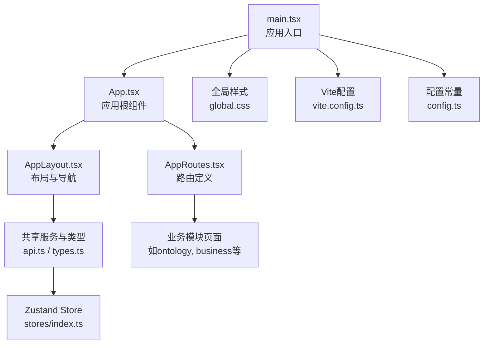
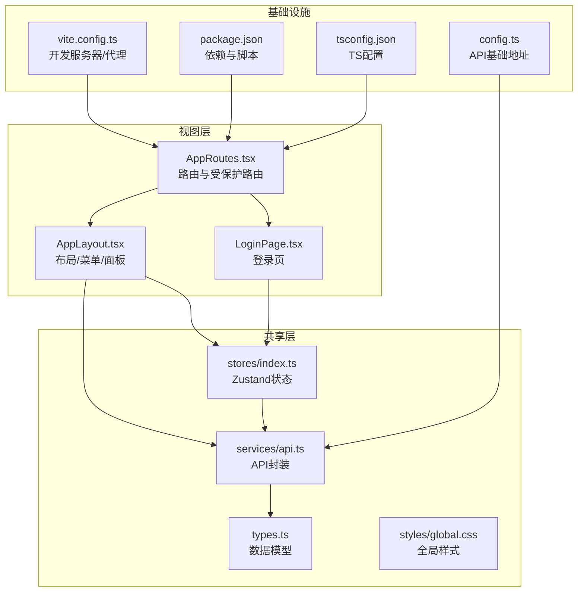
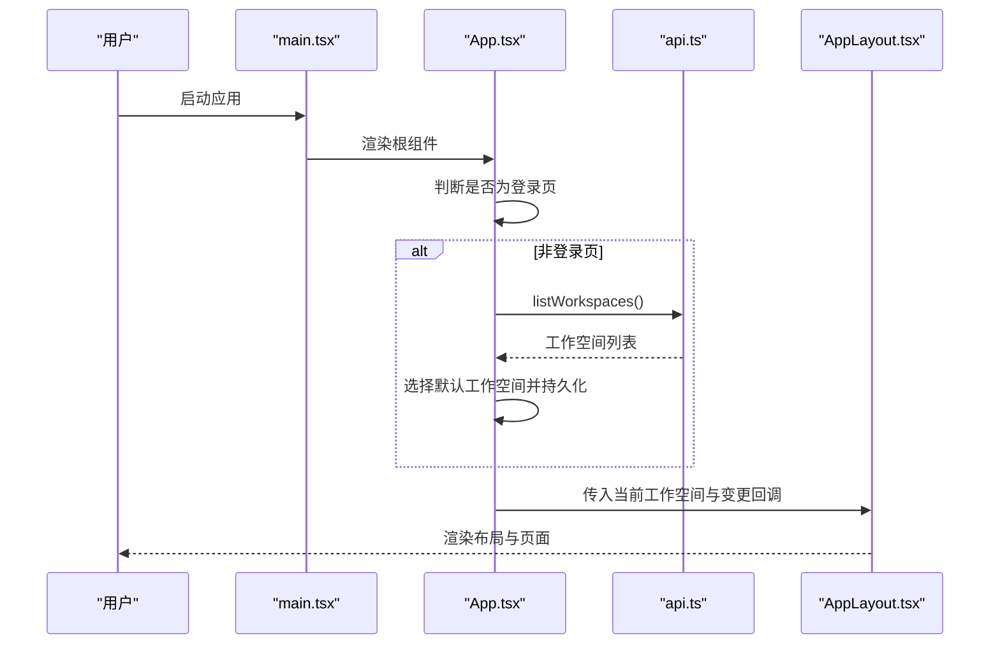
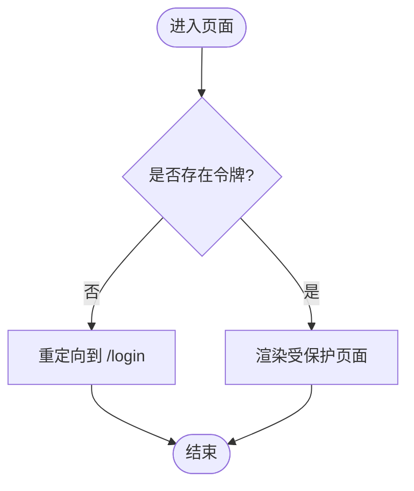
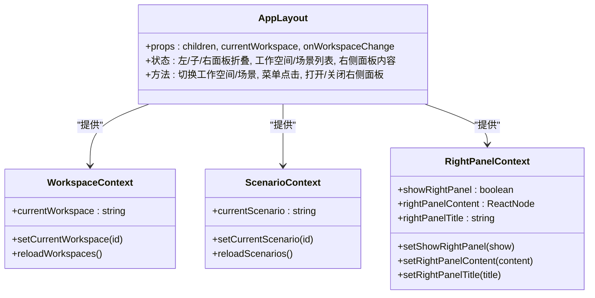
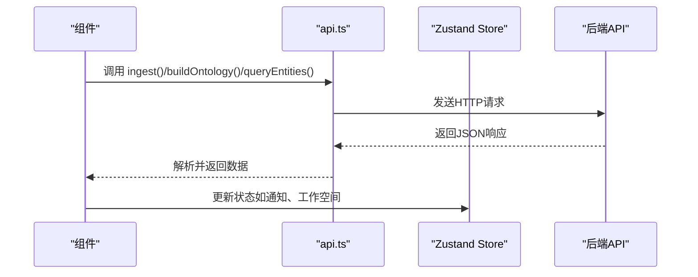
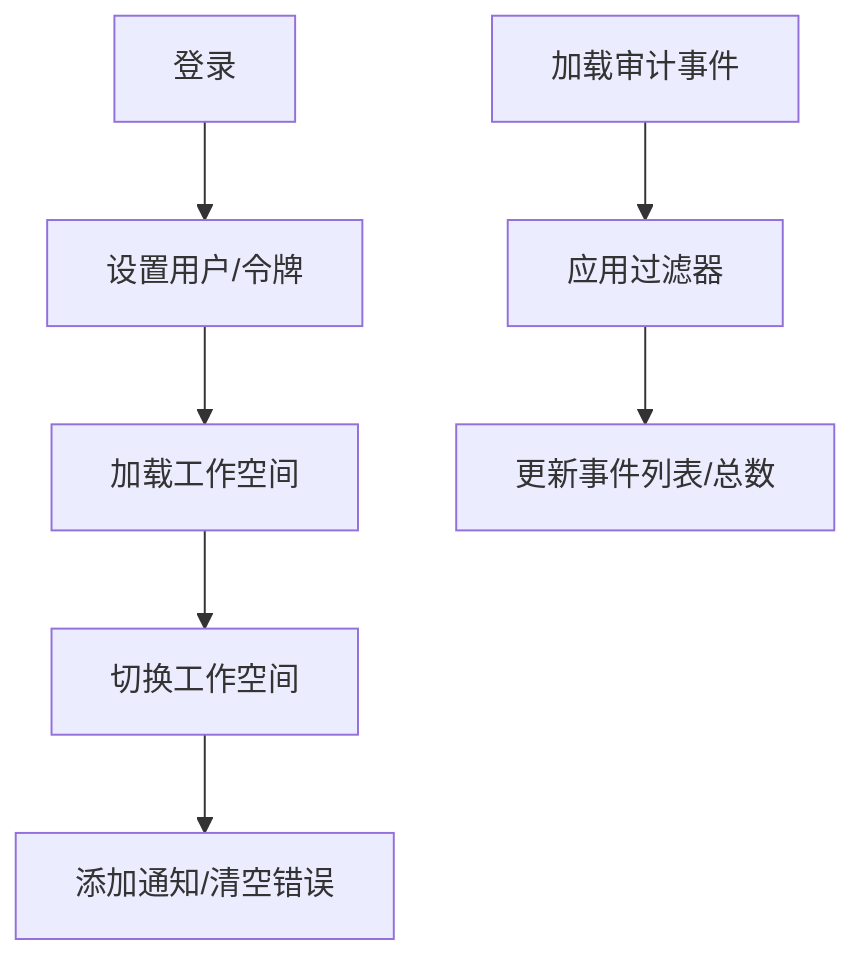
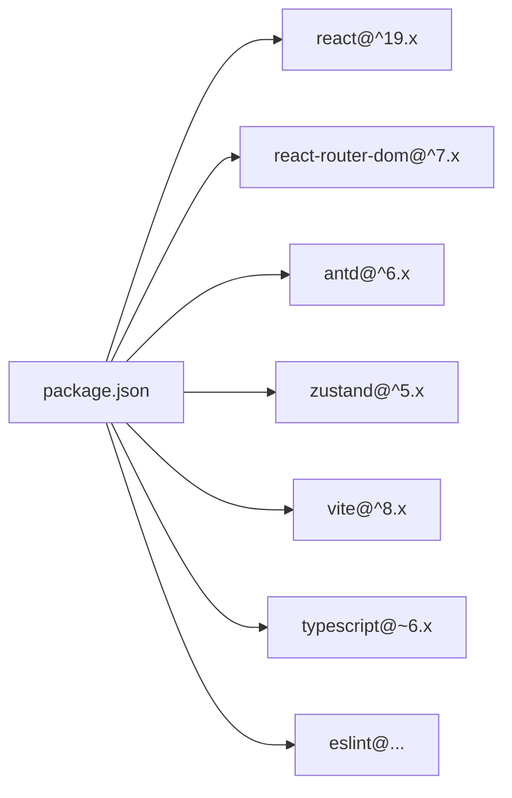

# 前端架构

<cite>
**本文引用的文件**   
- [frontend/package.json](file://frontend/package.json)
- [frontend/vite.config.ts](file://frontend/vite.config.ts)
- [frontend/src/main.tsx](file://frontend/src/main.tsx)
- [frontend/src/App.tsx](file://frontend/src/App.tsx)
- [frontend/src/AppRoutes.tsx](file://frontend/src/AppRoutes.tsx)
- [frontend/src/config.ts](file://frontend/src/config.ts)
- [frontend/src/modules/shared/index.ts](file://frontend/src/modules/shared/index.ts)
- [frontend/src/modules/shared/types.ts](file://frontend/src/modules/shared/types.ts)
- [frontend/src/modules/shared/services/api.ts](file://frontend/src/modules/shared/services/api.ts)
- [frontend/src/modules/shared/stores/index.ts](file://frontend/src/modules/shared/stores/index.ts)
- [frontend/src/modules/shared/components/AppLayout.tsx](file://frontend/src/modules/shared/components/AppLayout.tsx)
- [frontend/src/modules/shared/styles/global.css](file://frontend/src/modules/shared/styles/global.css)
- [frontend/src/modules/shared/pages/LoginPage.tsx](file://frontend/src/modules/shared/pages/LoginPage.tsx)
- [frontend/tsconfig.json](file://frontend/tsconfig.json)
</cite>

## 目录
1. [简介](#简介)
2. [项目结构](#项目结构)
3. [核心组件](#核心组件)
4. [架构总览](#架构总览)
5. [详细组件分析](#详细组件分析)
6. [依赖关系分析](#依赖关系分析)
7. [性能考量](#性能考量)
8. [故障排查指南](#故障排查指南)
9. [结论](#结论)
10. [附录](#附录)

## 简介
本文件面向ODAP前端应用，系统性梳理基于React 19 + TypeScript的前端架构与实现细节。文档覆盖模块化前端架构、按业务域划分的组件体系、组件层次结构、状态管理模式、路由设计策略、与后端API的交互模式、实时通信机制、UI组件库（Ant Design）使用与自定义主题、响应式与移动端适配策略、性能优化与代码分割、组件开发规范与最佳实践。

## 项目结构
前端工程位于frontend目录，采用Vite作为构建工具，React 19与TypeScript提供类型安全与现代化开发体验。项目通过模块化目录组织业务域，共享层提供通用组件、服务与样式，各业务模块按需导出页面与服务。

- 核心入口与路由
  - 应用入口：[frontend/src/main.tsx](file://frontend/src/main.tsx)
  - 应用根组件与工作空间初始化：[frontend/src/App.tsx](file://frontend/src/App.tsx)
  - 路由定义与受保护路由：[frontend/src/AppRoutes.tsx](file://frontend/src/AppRoutes.tsx)
  - API基础地址配置：[frontend/src/config.ts](file://frontend/src/config.ts)

- 构建与开发环境
  - Vite配置（代理、别名、插件）：[frontend/vite.config.ts](file://frontend/vite.config.ts)
  - 依赖与脚本（React、Ant Design、Zustand、路由等）：[frontend/package.json](file://frontend/package.json)
  - TypeScript配置（应用与Node环境）：[frontend/tsconfig.json](file://frontend/tsconfig.json)

- 共享层
  - 导出入口（布局、服务、类型、状态）：[frontend/src/modules/shared/index.ts](file://frontend/src/modules/shared/index.ts)
  - 类型定义（场景、实体、版本、统计等）：[frontend/src/modules/shared/types.ts](file://frontend/src/modules/shared/types.ts)
  - API封装与客户端：[frontend/src/modules/shared/services/api.ts](file://frontend/src/modules/shared/services/api.ts)
  - Zustand状态管理（应用与审计）：[frontend/src/modules/shared/stores/index.ts](file://frontend/src/modules/shared/stores/index.ts)
  - 全局样式与通用组件：[frontend/src/modules/shared/styles/global.css](file://frontend/src/modules/shared/styles/global.css)，[frontend/src/modules/shared/components/AppLayout.tsx](file://frontend/src/modules/shared/components/AppLayout.tsx)

**图表来源**
- [frontend/src/main.tsx:1-11](file://frontend/src/main.tsx#L1-L11)
- [frontend/src/App.tsx:1-65](file://frontend/src/App.tsx#L1-L65)
- [frontend/src/AppRoutes.tsx:1-61](file://frontend/src/AppRoutes.tsx#L1-L61)
- [frontend/src/modules/shared/components/AppLayout.tsx:1-712](file://frontend/src/modules/shared/components/AppLayout.tsx#L1-L712)
- [frontend/src/modules/shared/services/api.ts:1-2061](file://frontend/src/modules/shared/services/api.ts#L1-L2061)
- [frontend/src/modules/shared/stores/index.ts:1-219](file://frontend/src/modules/shared/stores/index.ts#L1-L219)
- [frontend/src/modules/shared/styles/global.css:1-232](file://frontend/src/modules/shared/styles/global.css#L1-L232)
- [frontend/vite.config.ts:1-46](file://frontend/vite.config.ts#L1-L46)
- [frontend/src/config.ts:1-4](file://frontend/src/config.ts#L1-L4)

**章节来源**
- [frontend/src/main.tsx:1-11](file://frontend/src/main.tsx#L1-L11)
- [frontend/src/App.tsx:1-65](file://frontend/src/App.tsx#L1-L65)
- [frontend/src/AppRoutes.tsx:1-61](file://frontend/src/AppRoutes.tsx#L1-L61)
- [frontend/src/modules/shared/index.ts:1-11](file://frontend/src/modules/shared/index.ts#L1-L11)
- [frontend/src/modules/shared/types.ts:1-85](file://frontend/src/modules/shared/types.ts#L1-L85)
- [frontend/src/modules/shared/services/api.ts:1-2061](file://frontend/src/modules/shared/services/api.ts#L1-L2061)
- [frontend/src/modules/shared/stores/index.ts:1-219](file://frontend/src/modules/shared/stores/index.ts#L1-L219)
- [frontend/src/modules/shared/styles/global.css:1-232](file://frontend/src/modules/shared/styles/global.css#L1-L232)
- [frontend/vite.config.ts:1-46](file://frontend/vite.config.ts#L1-L46)
- [frontend/src/config.ts:1-4](file://frontend/src/config.ts#L1-L4)
- [frontend/tsconfig.json:1-8](file://frontend/tsconfig.json#L1-L8)

## 核心组件
- 应用根组件与工作空间初始化
  - 负责登录页判断、工作空间加载与持久化、路由渲染。
  - 关键路径：[frontend/src/App.tsx:1-65](file://frontend/src/App.tsx#L1-L65)

- 路由系统
  - 使用受保护路由包装业务页面，支持登录跳转与权限拦截。
  - 关键路径：[frontend/src/AppRoutes.tsx:1-61](file://frontend/src/AppRoutes.tsx#L1-L61)

- 布局与导航
  - 提供左侧主菜单、子菜单、右侧扩展面板、工作空间与场景选择、用户下拉菜单。
  - 关键路径：[frontend/src/modules/shared/components/AppLayout.tsx:1-712](file://frontend/src/modules/shared/components/AppLayout.tsx#L1-L712)

- API与数据模型
  - 统一封装本体摄入、构建、查询、版本回滚、审计日志、健康检查等接口。
  - 数据模型定义于共享类型文件。
  - 关键路径：
    - [frontend/src/modules/shared/services/api.ts:1-2061](file://frontend/src/modules/shared/services/api.ts#L1-L2061)
    - [frontend/src/modules/shared/types.ts:1-85](file://frontend/src/modules/shared/types.ts#L1-L85)

- 状态管理
  - 应用状态（用户、令牌、工作空间、通知）、审计过滤与事件列表。
  - 关键路径：[frontend/src/modules/shared/stores/index.ts:1-219](file://frontend/src/modules/shared/stores/index.ts#L1-L219)

- 登录页
  - 表单校验、登录流程、消息提示与演示账号信息。
  - 关键路径：[frontend/src/modules/shared/pages/LoginPage.tsx:1-192](file://frontend/src/modules/shared/pages/LoginPage.tsx#L1-L192)

**章节来源**
- [frontend/src/App.tsx:1-65](file://frontend/src/App.tsx#L1-L65)
- [frontend/src/AppRoutes.tsx:1-61](file://frontend/src/AppRoutes.tsx#L1-L61)
- [frontend/src/modules/shared/components/AppLayout.tsx:1-712](file://frontend/src/modules/shared/components/AppLayout.tsx#L1-L712)
- [frontend/src/modules/shared/services/api.ts:1-2061](file://frontend/src/modules/shared/services/api.ts#L1-L2061)
- [frontend/src/modules/shared/types.ts:1-85](file://frontend/src/modules/shared/types.ts#L1-L85)
- [frontend/src/modules/shared/stores/index.ts:1-219](file://frontend/src/modules/shared/stores/index.ts#L1-L219)
- [frontend/src/modules/shared/pages/LoginPage.tsx:1-192](file://frontend/src/modules/shared/pages/LoginPage.tsx#L1-L192)

## 架构总览
前端采用“共享层 + 业务模块”的模块化架构，围绕Ant Design组件库与Zustand状态管理，结合React Router实现受保护路由与页面级导航。API层统一封装HTTP请求与错误处理，支持多场景数据摄入与本体构建流程。

**图表来源**
- [frontend/src/AppRoutes.tsx:1-61](file://frontend/src/AppRoutes.tsx#L1-L61)
- [frontend/src/modules/shared/components/AppLayout.tsx:1-712](file://frontend/src/modules/shared/components/AppLayout.tsx#L1-L712)
- [frontend/src/modules/shared/pages/LoginPage.tsx:1-192](file://frontend/src/modules/shared/pages/LoginPage.tsx#L1-L192)
- [frontend/src/modules/shared/services/api.ts:1-2061](file://frontend/src/modules/shared/services/api.ts#L1-L2061)
- [frontend/src/modules/shared/stores/index.ts:1-219](file://frontend/src/modules/shared/stores/index.ts#L1-L219)
- [frontend/src/modules/shared/types.ts:1-85](file://frontend/src/modules/shared/types.ts#L1-L85)
- [frontend/src/modules/shared/styles/global.css:1-232](file://frontend/src/modules/shared/styles/global.css#L1-L232)
- [frontend/vite.config.ts:1-46](file://frontend/vite.config.ts#L1-L46)
- [frontend/src/config.ts:1-4](file://frontend/src/config.ts#L1-L4)
- [frontend/package.json:1-55](file://frontend/package.json#L1-L55)
- [frontend/tsconfig.json:1-8](file://frontend/tsconfig.json#L1-L8)

## 详细组件分析

### 应用根组件与工作空间初始化
- 功能要点
  - 判断当前是否为登录页，非登录页时加载工作空间列表并持久化当前工作空间。
  - 加载期间显示加载指示，异常时记录错误。
  - 将当前工作空间与变更回调传递给AppLayout。
- 关键路径：[frontend/src/App.tsx:1-65](file://frontend/src/App.tsx#L1-L65)

**图表来源**
- [frontend/src/main.tsx:1-11](file://frontend/src/main.tsx#L1-L11)
- [frontend/src/App.tsx:1-65](file://frontend/src/App.tsx#L1-L65)
- [frontend/src/modules/shared/services/api.ts:639-642](file://frontend/src/modules/shared/services/api.ts#L639-L642)
- [frontend/src/modules/shared/components/AppLayout.tsx:201-263](file://frontend/src/modules/shared/components/AppLayout.tsx#L201-L263)

**章节来源**
- [frontend/src/App.tsx:1-65](file://frontend/src/App.tsx#L1-L65)

### 路由设计与受保护路由
- 设计策略
  - 使用受保护路由包装业务页面，未携带令牌则重定向至登录页。
  - 路由覆盖智能体、本体、业务、技能、模拟推演、知识、系统配置、审计等模块。
- 关键路径：[frontend/src/AppRoutes.tsx:1-61](file://frontend/src/AppRoutes.tsx#L1-L61)

**图表来源**
- [frontend/src/AppRoutes.tsx:19-25](file://frontend/src/AppRoutes.tsx#L19-L25)

**章节来源**
- [frontend/src/AppRoutes.tsx:1-61](file://frontend/src/AppRoutes.tsx#L1-L61)

### 布局与导航（AppLayout）
- 组件层次
  - WorkspaceContext/ScenarioContext/OntologyVersionContext/RightPanelContext提供跨组件上下文。
  - 主菜单与子菜单联动，支持折叠/展开；右侧扩展面板可动态注入内容。
  - 工作空间与场景选择、用户下拉菜单、模式切换（智能体/管理后台）。
- 关键路径：[frontend/src/modules/shared/components/AppLayout.tsx:1-712](file://frontend/src/modules/shared/components/AppLayout.tsx#L1-L712)

**图表来源**
- [frontend/src/modules/shared/components/AppLayout.tsx:51-119](file://frontend/src/modules/shared/components/AppLayout.tsx#L51-L119)

**章节来源**
- [frontend/src/modules/shared/components/AppLayout.tsx:1-712](file://frontend/src/modules/shared/components/AppLayout.tsx#L1-L712)

### API交互模式与数据模型
- API封装
  - 统一前缀与错误处理，提供本体摄入、构建、查询、版本回滚、审计日志、健康检查等方法。
  - 支持多场景摄入类型（新闻、手动、JSON、自然语言、随机）与灵活参数。
- 数据模型
  - 场景、实体、时间线事件、版本、差异结果、统计、地图单元等。
- 关键路径：
  - [frontend/src/modules/shared/services/api.ts:1-2061](file://frontend/src/modules/shared/services/api.ts#L1-L2061)
  - [frontend/src/modules/shared/types.ts:1-85](file://frontend/src/modules/shared/types.ts#L1-L85)

**图表来源**
- [frontend/src/modules/shared/services/api.ts:233-269](file://frontend/src/modules/shared/services/api.ts#L233-L269)
- [frontend/src/modules/shared/stores/index.ts:51-167](file://frontend/src/modules/shared/stores/index.ts#L51-L167)

**章节来源**
- [frontend/src/modules/shared/services/api.ts:1-2061](file://frontend/src/modules/shared/services/api.ts#L1-L2061)
- [frontend/src/modules/shared/types.ts:1-85](file://frontend/src/modules/shared/types.ts#L1-L85)

### 状态管理模式（Zustand）
- 应用状态
  - 用户、令牌、当前工作空间、工作空间列表、通知、加载与错误状态。
  - 登录、登出、加载工作空间、切换工作空间、添加/移除通知、清空错误。
- 审计状态
  - 审计事件列表、总数、加载状态与过滤器（时间范围、事件类型、严重级别、操作者）。
- 关键路径：[frontend/src/modules/shared/stores/index.ts:1-219](file://frontend/src/modules/shared/stores/index.ts#L1-L219)

**图表来源**
- [frontend/src/modules/shared/stores/index.ts:51-167](file://frontend/src/modules/shared/stores/index.ts#L51-L167)
- [frontend/src/modules/shared/stores/index.ts:180-219](file://frontend/src/modules/shared/stores/index.ts#L180-L219)

**章节来源**
- [frontend/src/modules/shared/stores/index.ts:1-219](file://frontend/src/modules/shared/stores/index.ts#L1-L219)

### 登录页与认证流程
- 表单校验、提交、消息提示与演示账号展示。
- 登录成功后跳转首页并触发工作空间加载。
- 关键路径：[frontend/src/modules/shared/pages/LoginPage.tsx:1-192](file://frontend/src/modules/shared/pages/LoginPage.tsx#L1-L192)

**章节来源**
- [frontend/src/modules/shared/pages/LoginPage.tsx:1-192](file://frontend/src/modules/shared/pages/LoginPage.tsx#L1-L192)

### UI组件库与自定义主题
- Ant Design作为主要UI库，配合@ant-design/icons、@ant-design/charts、@ant-design/graphs、@antv/g6、@xyflow/react等生态组件。
- 全局样式通过global.css统一字体、滚动条、卡片、容器等通用样式。
- 关键路径：
  - [frontend/src/modules/shared/styles/global.css:1-232](file://frontend/src/modules/shared/styles/global.css#L1-L232)
  - [frontend/package.json:15-32](file://frontend/package.json#L15-L32)

**章节来源**
- [frontend/src/modules/shared/styles/global.css:1-232](file://frontend/src/modules/shared/styles/global.css#L1-L232)
- [frontend/package.json:15-32](file://frontend/package.json#L15-L32)

### 响应式与移动端适配
- 布局组件支持折叠/展开，左侧主菜单与子菜单宽度可变，右侧扩展面板可隐藏。
- 页面容器与卡片样式提供一致的视觉与间距。
- 关键路径：[frontend/src/modules/shared/components/AppLayout.tsx:380-538](file://frontend/src/modules/shared/components/AppLayout.tsx#L380-L538)，[frontend/src/modules/shared/styles/global.css:51-232](file://frontend/src/modules/shared/styles/global.css#L51-L232)

**章节来源**
- [frontend/src/modules/shared/components/AppLayout.tsx:380-538](file://frontend/src/modules/shared/components/AppLayout.tsx#L380-L538)
- [frontend/src/modules/shared/styles/global.css:51-232](file://frontend/src/modules/shared/styles/global.css#L51-L232)

### 性能优化与代码分割
- 构建与开发
  - Vite提供快速冷启动与热更新；代理配置支持本地联调后端。
  - TypeScript配置拆分为应用与Node环境两套引用。
- 优化建议
  - 页面级路由按需加载（结合React.lazy与Suspense）。
  - 大型图表组件（G6、AntV）按需引入与懒加载。
  - 图标与第三方库通过Vite按需打包。
- 关键路径：
  - [frontend/vite.config.ts:1-46](file://frontend/vite.config.ts#L1-L46)
  - [frontend/tsconfig.json:1-8](file://frontend/tsconfig.json#L1-L8)
  - [frontend/package.json:6-14](file://frontend/package.json#L6-L14)

**章节来源**
- [frontend/vite.config.ts:1-46](file://frontend/vite.config.ts#L1-L46)
- [frontend/tsconfig.json:1-8](file://frontend/tsconfig.json#L1-L8)
- [frontend/package.json:6-14](file://frontend/package.json#L6-L14)

### 组件开发规范与最佳实践
- 目录组织
  - 按业务域划分模块（如ontology、business、agent等），每个模块包含pages、components、services、stores、types等子目录。
  - 共享层统一导出入口，便于跨模块复用。
- 组件设计
  - 优先使用Ant Design组件，保持一致的交互与视觉风格。
  - 使用Context与Zustand进行状态管理，避免深层属性传递。
- API与类型
  - 所有API调用统一通过共享服务层，确保错误处理与日志一致性。
  - 类型定义集中于shared/types.ts，保证前后端契约清晰。
- 路由与导航
  - 使用受保护路由包装需要鉴权的页面，避免未授权访问。
- 样式与主题
  - 全局样式集中管理，业务样式按模块隔离，避免冲突。
- 开发与测试
  - 使用Vitest进行单元测试，ESLint与TypeScript检查保障代码质量。
- 关键路径：
  - [frontend/src/modules/shared/index.ts:1-11](file://frontend/src/modules/shared/index.ts#L1-L11)
  - [frontend/src/modules/shared/services/api.ts:1-2061](file://frontend/src/modules/shared/services/api.ts#L1-L2061)
  - [frontend/src/modules/shared/stores/index.ts:1-219](file://frontend/src/modules/shared/stores/index.ts#L1-L219)

**章节来源**
- [frontend/src/modules/shared/index.ts:1-11](file://frontend/src/modules/shared/index.ts#L1-L11)
- [frontend/src/modules/shared/services/api.ts:1-2061](file://frontend/src/modules/shared/services/api.ts#L1-L2061)
- [frontend/src/modules/shared/stores/index.ts:1-219](file://frontend/src/modules/shared/stores/index.ts#L1-L219)

## 依赖关系分析
- 运行时依赖
  - React 19、React Router DOM 7、Ant Design 6、Zustand 5、@ant-design/icons、@ant-design/charts、@ant-design/graphs、@antv/g6、@xyflow/react、echarts、leaflet、react-leaflet、ai等。
- 开发依赖
  - Vite、TypeScript、ESLint、React Hooks/Refresh插件、Jest/Testing Library、覆盖率工具等。
- 关键路径：[frontend/package.json:15-52](file://frontend/package.json#L15-L52)

**图表来源**
- [frontend/package.json:15-52](file://frontend/package.json#L15-L52)

**章节来源**
- [frontend/package.json:15-52](file://frontend/package.json#L15-L52)

## 性能考量
- 构建与打包
  - 使用Vite进行快速构建与开发，按需加载第三方库与图标。
- 运行时性能
  - 大型图谱与可视化组件采用懒加载与按需渲染，减少首屏压力。
  - 状态管理集中在Zustand，避免不必要的重渲染。
- 网络与缓存
  - API统一前缀与错误处理，合理利用浏览器缓存与本地存储（如工作空间ID）。
- 关键路径：
  - [frontend/vite.config.ts:1-46](file://frontend/vite.config.ts#L1-L46)
  - [frontend/src/modules/shared/services/api.ts:1-2061](file://frontend/src/modules/shared/services/api.ts#L1-L2061)
  - [frontend/src/modules/shared/stores/index.ts:1-219](file://frontend/src/modules/shared/stores/index.ts#L1-L219)

## 故障排查指南
- 登录失败
  - 检查令牌存储与受保护路由逻辑，确认登录页与路由守卫。
  - 关键路径：[frontend/src/modules/shared/pages/LoginPage.tsx:1-192](file://frontend/src/modules/shared/pages/LoginPage.tsx#L1-L192)，[frontend/src/AppRoutes.tsx:19-25](file://frontend/src/AppRoutes.tsx#L19-L25)
- 工作空间加载异常
  - 检查API基础地址与代理配置，确认listWorkspaces接口返回。
  - 关键路径：[frontend/src/config.ts:1-4](file://frontend/src/config.ts#L1-L4)，[frontend/vite.config.ts:23-43](file://frontend/vite.config.ts#L23-L43)，[frontend/src/modules/shared/services/api.ts:639-642](file://frontend/src/modules/shared/services/api.ts#L639-L642)
- 图表/可视化组件不显示
  - 检查组件懒加载与容器尺寸，确认全局样式与容器高度设置。
  - 关键路径：[frontend/src/modules/shared/styles/global.css:120-142](file://frontend/src/modules/shared/styles/global.css#L120-L142)，[frontend/src/modules/shared/components/AppLayout.tsx:654-658](file://frontend/src/modules/shared/components/AppLayout.tsx#L654-L658)
- 审计事件加载失败
  - 检查过滤器参数与URL拼接，确认响应结构。
  - 关键路径：[frontend/src/modules/shared/stores/index.ts:186-208](file://frontend/src/modules/shared/stores/index.ts#L186-L208)

**章节来源**
- [frontend/src/modules/shared/pages/LoginPage.tsx:1-192](file://frontend/src/modules/shared/pages/LoginPage.tsx#L1-L192)
- [frontend/src/AppRoutes.tsx:19-25](file://frontend/src/AppRoutes.tsx#L19-L25)
- [frontend/src/config.ts:1-4](file://frontend/src/config.ts#L1-L4)
- [frontend/vite.config.ts:23-43](file://frontend/vite.config.ts#L23-L43)
- [frontend/src/modules/shared/services/api.ts:639-642](file://frontend/src/modules/shared/services/api.ts#L639-L642)
- [frontend/src/modules/shared/styles/global.css:120-142](file://frontend/src/modules/shared/styles/global.css#L120-L142)
- [frontend/src/modules/shared/components/AppLayout.tsx:654-658](file://frontend/src/modules/shared/components/AppLayout.tsx#L654-L658)
- [frontend/src/modules/shared/stores/index.ts:186-208](file://frontend/src/modules/shared/stores/index.ts#L186-L208)

## 结论
ODAP前端采用模块化架构与共享层设计，结合Ant Design与Zustand，实现了清晰的组件层次、统一的状态管理与API封装。路由系统通过受保护路由保障安全访问，布局组件提供灵活的导航与扩展能力。通过Vite与TypeScript提升开发效率与代码质量，配合合理的性能优化策略，满足复杂业务场景下的前端需求。

## 附录
- 开发命令
  - dev/build/lint/preview/test等脚本定义见：[frontend/package.json:6-14](file://frontend/package.json#L6-L14)
- TypeScript配置
  - 应用与Node环境分别配置，见：[frontend/tsconfig.json:1-8](file://frontend/tsconfig.json#L1-L8)
- API基础地址
  - 通过环境变量注入，见：[frontend/src/config.ts:1-4](file://frontend/src/config.ts#L1-L4)，[frontend/vite.config.ts:5-8](file://frontend/vite.config.ts#L5-L8)