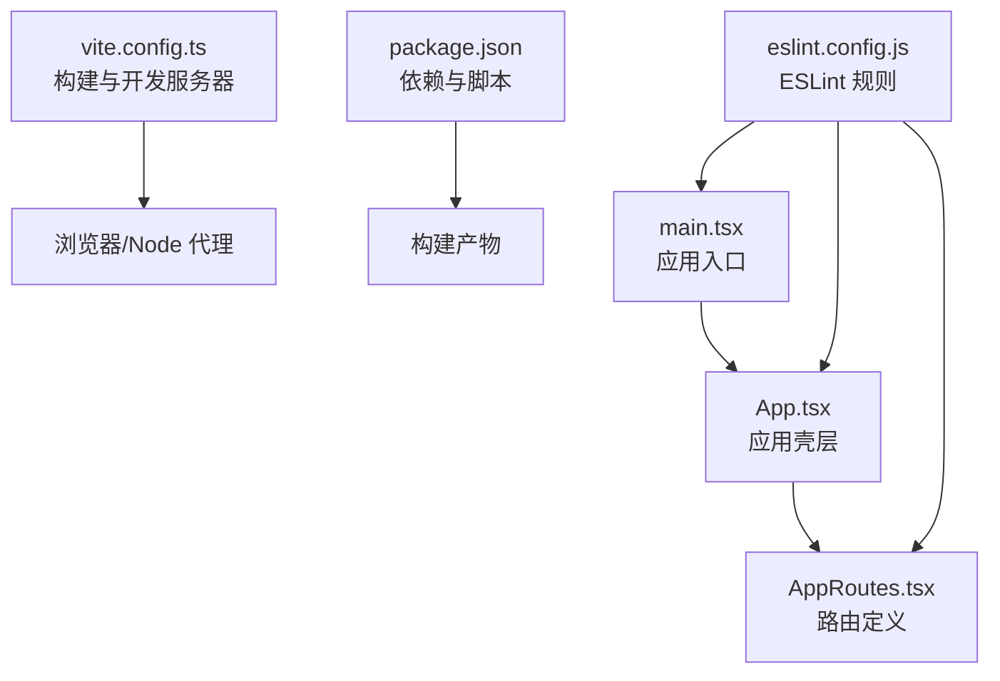
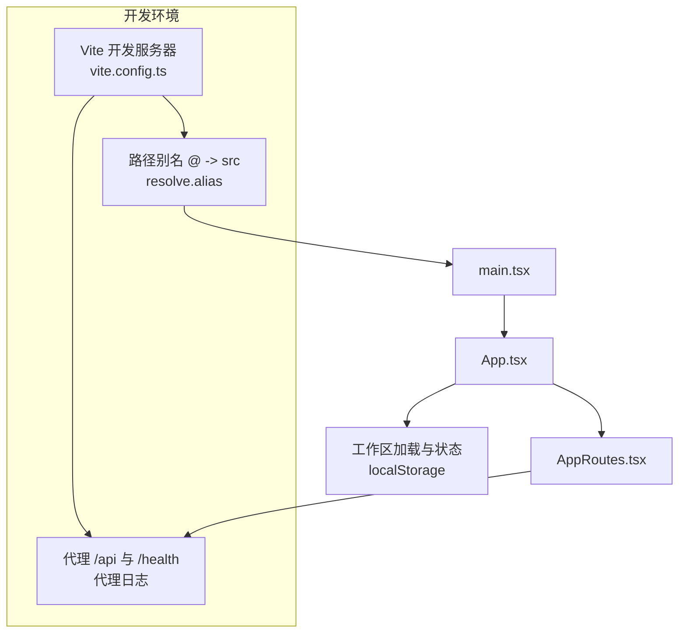
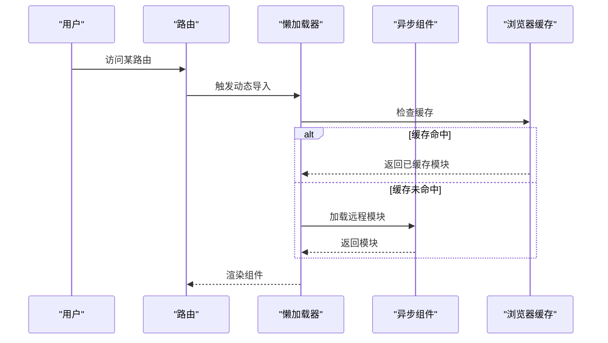
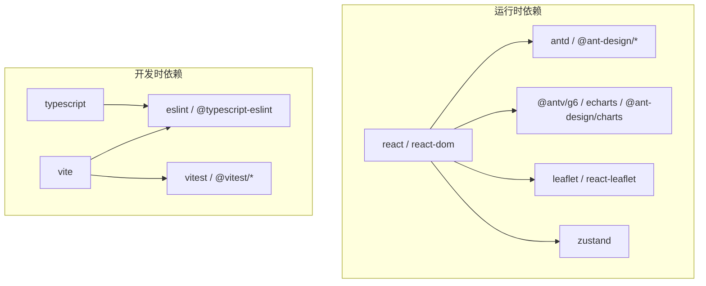

# 性能优化

<cite>
**本文引用的文件**
- [vite.config.ts](file://frontend/vite.config.ts)
- [package.json](file://frontend/package.json)
- [main.tsx](file://frontend/src/main.tsx)
- [App.tsx](file://frontend/src/App.tsx)
- [AppRoutes.tsx](file://frontend/src/AppRoutes.tsx)
- [eslint.config.js](file://frontend/eslint.config.js)
</cite>

## 目录
1. [简介](#简介)
2. [项目结构](#项目结构)
3. [核心组件](#核心组件)
4. [架构总览](#架构总览)
5. [详细组件分析](#详细组件分析)
6. [依赖分析](#依赖分析)
7. [性能考量](#性能考量)
8. [故障排查指南](#故障排查指南)
9. [结论](#结论)
10. [附录](#附录)

## 简介
本文件面向 ODAP 前端的性能优化目标，围绕 Vite 构建工具，系统梳理代码分割、懒加载与动态导入策略；结合打包分析、Tree Shaking 与压缩优化；总结组件级性能技巧（如 React.memo、useMemo、useCallback）；并覆盖图片与字体优化、静态资源处理、浏览器缓存与 CDN 配置、PWA 支持、性能监控与错误边界、用户体验优化以及性能测试与基准策略。文档以仓库现有配置与代码为依据，给出可落地的实践建议。

## 项目结构
前端工程位于 frontend 目录，采用 Vite + React 技术栈，使用 TypeScript 编写。关键入口与配置如下：
- 入口文件：main.tsx 负责挂载应用根节点
- 应用壳层：App.tsx 提供路由容器与工作区初始化逻辑
- 路由定义：AppRoutes.tsx 组织页面级路由与受保护路由
- 构建配置：vite.config.ts 定义开发服务器、代理与路径别名
- 依赖与脚本：package.json 管理运行时与开发时依赖、构建与测试脚本
- Lint 规则：eslint.config.js 集成 React Hooks 与刷新规则

**图示来源**
- [main.tsx:1-11](file://frontend/src/main.tsx#L1-L11)
- [App.tsx:1-65](file://frontend/src/App.tsx#L1-L65)
- [AppRoutes.tsx:1-61](file://frontend/src/AppRoutes.tsx#L1-L61)
- [vite.config.ts:1-46](file://frontend/vite.config.ts#L1-L46)
- [package.json:1-55](file://frontend/package.json#L1-L55)
- [eslint.config.js:1-24](file://frontend/eslint.config.js#L1-L24)

**章节来源**
- [main.tsx:1-11](file://frontend/src/main.tsx#L1-L11)
- [App.tsx:1-65](file://frontend/src/App.tsx#L1-L65)
- [AppRoutes.tsx:1-61](file://frontend/src/AppRoutes.tsx#L1-L61)
- [vite.config.ts:1-46](file://frontend/vite.config.ts#L1-L46)
- [package.json:1-55](file://frontend/package.json#L1-L55)
- [eslint.config.js:1-24](file://frontend/eslint.config.js#L1-L24)

## 核心组件
- 应用入口与挂载：在入口文件中创建根节点并渲染应用，确保严格模式启用，便于早期发现潜在问题。
- 应用壳层：负责登录页判定、工作区加载与状态管理，避免非必要重渲染。
- 路由系统：集中声明页面路由与受保护路由，为后续按需加载与代码分割奠定基础。
- 构建配置：提供路径别名、开发服务器、代理与日志输出，便于联调与性能观测。

**章节来源**
- [main.tsx:1-11](file://frontend/src/main.tsx#L1-L11)
- [App.tsx:1-65](file://frontend/src/App.tsx#L1-L65)
- [AppRoutes.tsx:1-61](file://frontend/src/AppRoutes.tsx#L1-L61)
- [vite.config.ts:10-46](file://frontend/vite.config.ts#L10-L46)

## 架构总览
下图展示从入口到路由与构建配置的整体交互关系，体现开发期代理、路径解析与应用启动流程。

**图示来源**
- [vite.config.ts:10-46](file://frontend/vite.config.ts#L10-L46)
- [main.tsx:1-11](file://frontend/src/main.tsx#L1-L11)
- [App.tsx:1-65](file://frontend/src/App.tsx#L1-L65)
- [AppRoutes.tsx:1-61](file://frontend/src/AppRoutes.tsx#L1-L61)

## 详细组件分析

### 代码分割与懒加载策略
- 页面级懒加载：将大型页面组件通过动态导入进行拆分，仅在访问对应路由时加载，降低首屏包体与白屏时间。
- 模块级懒加载：对重型可视化库（如 Ant Design 图表、G6、Leaflet 等）采用动态导入，按需引入，减少初始依赖。
- 动态导入最佳实践：
  - 使用 React.lazy 与 Suspense 包裹异步组件，提供占位与错误边界。
  - 对于路由级组件，结合 React Router 的 lazy 与 preload，提升导航体验。
  - 将第三方大包拆分为独立 chunk，配合 CDN 与浏览器缓存策略。

[本图为概念性流程示意，无需“图示来源”]

### Bundle 分析与 Tree Shaking
- 使用 Vite 内置的预构建与打包能力，结合构建脚本生成产物，利用浏览器开发者工具 Network 面板观察分包与缓存命中情况。
- 在 package.json 中的构建脚本组合了类型检查与打包，确保构建前类型安全。
- Tree Shaking 建议：
  - 保持 ES Module 导出风格，避免默认导出导致的副作用标记。
  - 第三方库尽量选择 ESM 版本，避免打包进入无用代码。
  - 对于条件导入与动态导入，确保分支不会被静态分析误判为“使用”。

**章节来源**
- [package.json:6-14](file://frontend/package.json#L6-L14)

### 代码压缩与资源优化
- 生产构建默认启用压缩与最小化，建议结合 gzip 或 brotli 压缩部署，进一步降低传输体积。
- 静态资源处理：
  - 将图片、字体等静态资源置于 public 目录或通过构建管线处理，设置合适的缓存头与版本号策略。
  - 对于内联资源，评估体积阈值，避免过度内联导致首屏阻塞。

**章节来源**
- [vite.config.ts:10-46](file://frontend/vite.config.ts#L10-L46)

### 组件级性能优化
- React.memo：对纯展示型组件使用浅比较，避免无关 props 变化引发的重渲染。
- useMemo/useCallback：缓存计算结果与回调函数，减少子组件重渲染与闭包重建成本。
- 渲染优化：
  - 合理拆分子组件，缩小重渲染范围。
  - 使用虚拟滚动处理长列表，减少 DOM 节点数量。
  - 避免在渲染期间执行昂贵操作，将计算移至 Effect 或事件处理器。

[本节为通用实践说明，无需“章节来源”]

### 图片与字体优化
- 图片：
  - 优先使用现代格式（WebP/AVIF），提供降级方案（JPEG/PNG）。
  - 采用响应式尺寸与 srcset，按设备像素比提供合适尺寸。
  - 使用懒加载与占位图，避免布局抖动。
- 字体：
  - 使用 font-display: swap 或 optional，保证文本快速可见。
  - 限制字体族数量与字重，避免不必要的网络请求。
  - 通过子集化与缓存策略提升加载速度。

[本节为通用实践说明，无需“章节来源”]

### 浏览器缓存、CDN 与 PWA
- 缓存策略：
  - 对静态资源设置长缓存（immutable），对 HTML 设置较短缓存并开启协商缓存。
  - 对动态资源（API）合理设置 Cache-Control 与 ETag。
- CDN：
  - 将静态资源托管至 CDN，结合全球节点与边缘缓存提升访问速度。
  - 对大体积第三方库使用 CDN 引入，减少主站带宽压力。
- PWA：
  - 提供 service worker，缓存关键资源与页面，实现离线访问与渐进增强。
  - 配置 manifest，支持安装与桌面图标。

[本节为通用实践说明，无需“章节来源”]

### 性能监控、错误边界与用户体验
- 性能监控：
  - 使用浏览器 Performance API、Navigation Timing、Resource Timing 进行指标采集。
  - 结合 Web Vitals（CLS、FID、LCP、INP）衡量用户体验。
- 错误边界：
  - 使用 React 错误边界捕获渲染异常，提供降级 UI 与错误日志上报。
- 用户体验：
  - 首屏骨架屏与占位图，减少感知延迟。
  - 路由切换过渡动画，避免突兀跳转。
  - 网络状态提示与重试机制，提升弱网体验。

[本节为通用实践说明，无需“章节来源”]

### 性能测试与基准策略
- 工具：
  - Lighthouse：自动化网页质量评估，包含性能、可访问性与最佳实践。
  - WebPageTest：跨地区、跨网络条件的性能测试。
  - Chrome DevTools：Network、Performance、Memory 面板深度分析。
  - Vitest：单元测试与覆盖率，保障变更不引入回归。
- 基准策略：
  - 设定关键指标阈值（首屏时间、交互时间、内存峰值）。
  - 建立持续集成中的性能回归检测，对关键页面进行定期回归测试。
  - 对比不同构建配置与缓存策略的效果，选择最优方案。

**章节来源**
- [package.json:11-13](file://frontend/package.json#L11-L13)

## 依赖分析
- 运行时依赖涵盖 React 19、Ant Design 生态、可视化库（AntV G6、ECharts、Ant Design Charts）、地图库（Leaflet）与状态管理（Zustand）等。
- 开发时依赖包含 Vite、TypeScript、ESLint、Vitest 等，支撑构建、类型检查、代码质量与测试。

**图示来源**
- [package.json:15-53](file://frontend/package.json#L15-L53)

**章节来源**
- [package.json:15-53](file://frontend/package.json#L15-L53)

## 性能考量
- 代码分割与懒加载：通过动态导入与路由懒加载，显著降低首屏包体与加载时间。
- Tree Shaking：保持 ESM 导出与第三方库的 ESM 版本，减少无效代码进入产物。
- 资源优化：图片与字体采用现代格式与缓存策略，静态资源走 CDN。
- 组件优化：合理使用 memo 与缓存钩子，控制渲染范围与频率。
- 构建与部署：结合压缩、缓存与 PWA，提升加载速度与离线可用性。
- 监控与测试：建立性能基线与回归检测，持续优化用户体验。

[本节为通用指导，无需“章节来源”]

## 故障排查指南
- 开发代理问题：
  - 检查代理目标地址与变更来源配置，关注代理错误事件日志。
  - 确认本地环境变量与代理配置一致。
- 路由与权限：
  - 登录态缺失时自动跳转登录页，确认本地存储令牌有效性。
  - 受保护路由在无令牌时重定向，确保拦截逻辑正确。
- 构建与测试：
  - 构建脚本先执行类型检查再打包，确保类型安全。
  - 单元测试与覆盖率通过 Vitest 执行，发现问题及时修复。

**章节来源**
- [vite.config.ts:17-44](file://frontend/vite.config.ts#L17-L44)
- [AppRoutes.tsx:19-25](file://frontend/src/AppRoutes.tsx#L19-L25)
- [package.json:6-14](file://frontend/package.json#L6-L14)

## 结论
通过对 Vite 构建配置、路由与应用壳层的梳理，结合代码分割、懒加载、Tree Shaking、资源优化与组件级性能技巧，可系统性提升 ODAP 前端的加载速度与交互流畅度。建议在 CI 中加入性能回归检测与 Web Vitals 监控，形成持续优化闭环。

## 附录
- 关键实现位置参考：
  - 应用入口与挂载：[main.tsx:1-11](file://frontend/src/main.tsx#L1-L11)
  - 应用壳层与工作区加载：[App.tsx:1-65](file://frontend/src/App.tsx#L1-L65)
  - 路由定义与受保护路由：[AppRoutes.tsx:1-61](file://frontend/src/AppRoutes.tsx#L1-L61)
  - 构建与开发服务器配置：[vite.config.ts:10-46](file://frontend/vite.config.ts#L10-L46)
  - 依赖与脚本：[package.json:1-55](file://frontend/package.json#L1-L55)
  - ESLint 规则：[eslint.config.js:1-24](file://frontend/eslint.config.js#L1-L24)