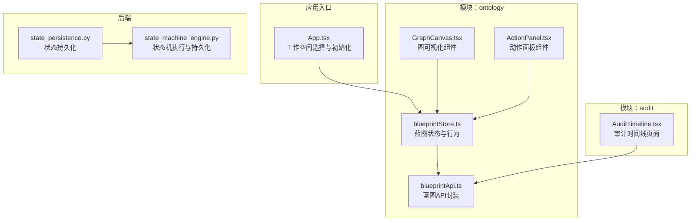
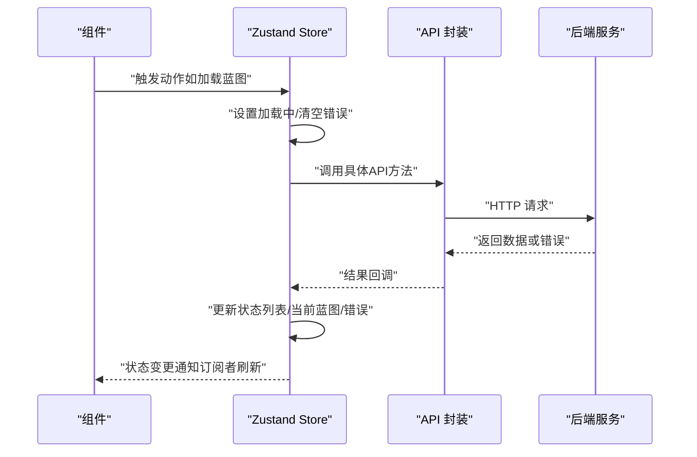
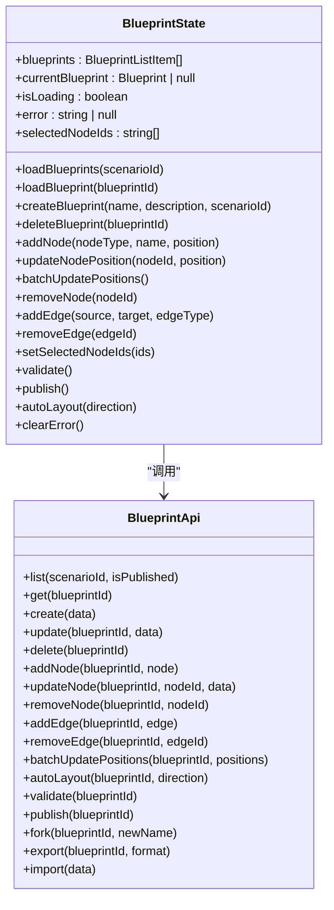
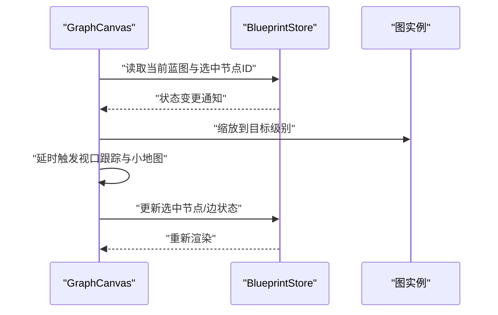
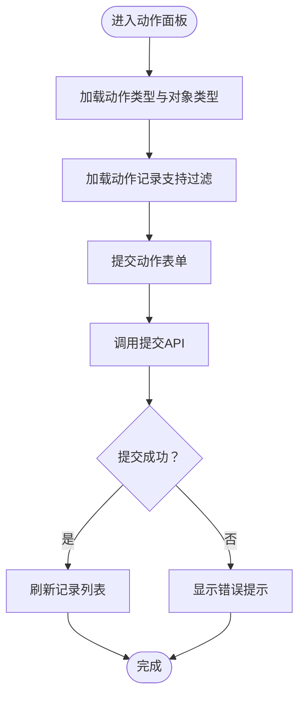
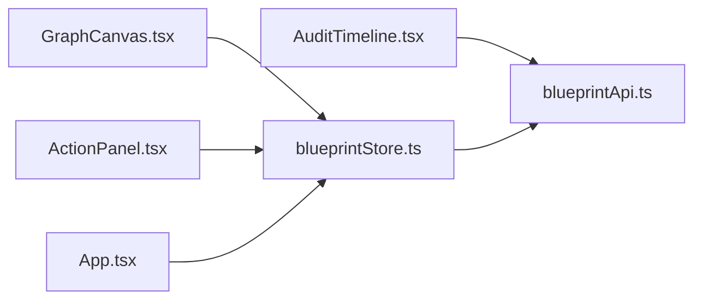

# 状态管理

<cite>
**本文引用的文件**
- [App.tsx](file://frontend/src/App.tsx)
- [blueprintStore.ts](file://frontend/src/modules/ontology/stores/blueprintStore.ts)
- [blueprintApi.ts](file://frontend/src/modules/ontology/services/blueprintApi.ts)
- [GraphCanvas.tsx](file://frontend/src/modules/ontology/components/GraphCanvas.tsx)
- [ActionPanel.tsx](file://frontend/src/modules/ontology/components/ActionPanel.tsx)
- [AuditTimeline.tsx](file://frontend/src/modules/audit/pages/AuditTimeline.tsx)
- [state_persistence.py](file://odap/infra/resilience/state_persistence.py)
- [state_machine_engine.py](file://odap/biz/core/ontology/runtime/state_machine/impl/state_machine_engine.py)
</cite>

## 目录
1. [简介](#简介)
2. [项目结构](#项目结构)
3. [核心组件](#核心组件)
4. [架构总览](#架构总览)
5. [详细组件分析](#详细组件分析)
6. [依赖分析](#依赖分析)
7. [性能考虑](#性能考虑)
8. [故障排查指南](#故障排查指南)
9. [结论](#结论)
10. [附录](#附录)

## 简介
本文件围绕ODAP前端的状态管理进行系统性梳理，重点基于Zustand实现的模块化状态方案，覆盖全局状态设计模式、状态结构与更新机制；介绍Agent状态、Ontology状态、Workspace状态等模块化策略；阐述状态持久化、同步与恢复机制；说明状态与组件的绑定、订阅模式与性能优化；总结最佳实践、错误处理与调试技巧，并给出状态设计规范与迁移策略及实际使用示例与性能监控方法。

## 项目结构
前端状态管理主要集中在模块化的Zustand Store中，以功能域划分（如ontology），并通过服务层与后端API交互。全局应用层面负责工作空间选择与初始加载，组件通过订阅Store状态驱动UI更新。

**图表来源**
- [App.tsx:1-65](file://frontend/src/App.tsx#L1-L65)
- [blueprintStore.ts:1-227](file://frontend/src/modules/ontology/stores/blueprintStore.ts#L1-L227)
- [blueprintApi.ts:1-148](file://frontend/src/modules/ontology/services/blueprintApi.ts#L1-L148)
- [GraphCanvas.tsx:188-233](file://frontend/src/modules/ontology/components/GraphCanvas.tsx#L188-L233)
- [ActionPanel.tsx:23-103](file://frontend/src/modules/ontology/components/ActionPanel.tsx#L23-L103)
- [AuditTimeline.tsx:1-67](file://frontend/src/modules/audit/pages/AuditTimeline.tsx#L1-L67)
- [state_persistence.py:1-44](file://odap/infra/resilience/state_persistence.py#L1-L44)
- [state_machine_engine.py:82-107](file://odap/biz/core/ontology/runtime/state_machine/impl/state_machine_engine.py#L82-L107)

**章节来源**
- [App.tsx:1-65](file://frontend/src/App.tsx#L1-L65)
- [blueprintStore.ts:1-227](file://frontend/src/modules/ontology/stores/blueprintStore.ts#L1-L227)
- [blueprintApi.ts:1-148](file://frontend/src/modules/ontology/services/blueprintApi.ts#L1-L148)
- [GraphCanvas.tsx:188-233](file://frontend/src/modules/ontology/components/GraphCanvas.tsx#L188-L233)
- [ActionPanel.tsx:23-103](file://frontend/src/modules/ontology/components/ActionPanel.tsx#L23-L103)
- [AuditTimeline.tsx:1-67](file://frontend/src/modules/audit/pages/AuditTimeline.tsx#L1-L67)
- [state_persistence.py:1-44](file://odap/infra/resilience/state_persistence.py#L1-L44)
- [state_machine_engine.py:82-107](file://odap/biz/core/ontology/runtime/state_machine/impl/state_machine_engine.py#L82-L107)

## 核心组件
- 全局应用状态（工作空间）
  - 在应用入口中根据路由与本地存储决定当前工作空间，并在加载完成后渲染布局与路由。
  - 关键逻辑：登录页跳过初始化；非登录页拉取工作空间列表，读取本地保存的工作空间ID，回退到首个工作空间并写回本地存储。
- 蓝图状态（Zustand）
  - 提供蓝图列表、当前蓝图、加载状态、错误信息、选中节点ID等字段。
  - 提供加载、创建、删除、增删节点与边、批量位置更新、布局、校验、发布、清错等动作方法。
  - 方法内部通过API封装进行网络请求，并在成功/失败时更新状态。
- 图可视化组件
  - 订阅蓝图状态中的节点/边数据与选中状态，响应缩放、平移、布局变化等交互。
- 动作面板组件
  - 订阅动作记录、动作类型、对象类型等状态，发起动作提交与审批流程。
- 审计时间线页面
  - 订阅审计事件列表与统计，支持筛选与抽屉查看详情。

**章节来源**
- [App.tsx:8-54](file://frontend/src/App.tsx#L8-L54)
- [blueprintStore.ts:5-27](file://frontend/src/modules/ontology/stores/blueprintStore.ts#L5-L27)
- [blueprintStore.ts:29-226](file://frontend/src/modules/ontology/stores/blueprintStore.ts#L29-L226)
- [blueprintApi.ts:53-147](file://frontend/src/modules/ontology/services/blueprintApi.ts#L53-L147)
- [GraphCanvas.tsx:188-233](file://frontend/src/modules/ontology/components/GraphCanvas.tsx#L188-L233)
- [ActionPanel.tsx:23-103](file://frontend/src/modules/ontology/components/ActionPanel.tsx#L23-L103)
- [AuditTimeline.tsx:1-67](file://frontend/src/modules/audit/pages/AuditTimeline.tsx#L1-L67)

## 架构总览
ODAP前端采用“模块化Zustand Store + 服务层API封装 + 组件订阅”的架构。Store集中管理状态与副作用，服务层抽象HTTP请求，组件通过订阅Store状态实现UI联动。后端侧提供状态持久化与状态机执行，支撑前端状态的同步与恢复。

**图表来源**
- [blueprintStore.ts:36-55](file://frontend/src/modules/ontology/stores/blueprintStore.ts#L36-L55)
- [blueprintApi.ts:54-77](file://frontend/src/modules/ontology/services/blueprintApi.ts#L54-L77)

## 详细组件分析

### 蓝图状态（Zustand Store）
- 设计模式
  - 使用Zustand的create函数定义状态切片，集中管理蓝图相关状态与动作。
  - 动作方法内部通过set/get访问状态，异步方法内捕获异常并更新错误状态。
- 状态结构
  - 字段：蓝图列表、当前蓝图、加载状态、错误信息、选中节点ID集合。
- 更新机制
  - 同步更新：updateNodePosition等直接映射到当前蓝图节点数组。
  - 异步更新：loadBlueprints/loadBlueprint/createBlueprint/deleteBlueprint等通过API调用后更新状态。
  - 批量更新：batchUpdatePositions收集当前节点位置后一次性提交。
- 与API的协作
  - 所有外部数据交互通过blueprintApi封装，确保接口一致与错误统一处理。
- 与组件的绑定
  - 组件通过useBlueprintStore订阅状态，按需读取当前蓝图与选中节点，触发动作更新状态。

**图表来源**
- [blueprintStore.ts:5-27](file://frontend/src/modules/ontology/stores/blueprintStore.ts#L5-L27)
- [blueprintStore.ts:29-226](file://frontend/src/modules/ontology/stores/blueprintStore.ts#L29-L226)
- [blueprintApi.ts:53-147](file://frontend/src/modules/ontology/services/blueprintApi.ts#L53-L147)

**章节来源**
- [blueprintStore.ts:1-227](file://frontend/src/modules/ontology/stores/blueprintStore.ts#L1-L227)
- [blueprintApi.ts:1-148](file://frontend/src/modules/ontology/services/blueprintApi.ts#L1-L148)

### 图可视化组件（订阅与交互）
- 订阅模式
  - 组件从蓝图Store读取节点/边数据与选中状态，响应状态变化重绘图。
- 交互流程
  - 缩放/平移：通过图实例获取相机状态并稳定缩放级别，随后触发视口跟踪与小地图绘制。
  - 选中节点/边：点击事件切换选中项，清空另一类选中状态。
- 性能要点
  - 使用ResizeObserver与窗口resize监听动态计算画布高度，避免重复渲染。
  - 缩放后延迟触发多次跟踪与小地图绘制，减少抖动。

**图表来源**
- [GraphCanvas.tsx:188-233](file://frontend/src/modules/ontology/components/GraphCanvas.tsx#L188-L233)
- [blueprintStore.ts:191-191](file://frontend/src/modules/ontology/stores/blueprintStore.ts#L191-L191)

**章节来源**
- [GraphCanvas.tsx:188-233](file://frontend/src/modules/ontology/components/GraphCanvas.tsx#L188-L233)
- [blueprintStore.ts:104-124](file://frontend/src/modules/ontology/stores/blueprintStore.ts#L104-L124)

### 动作面板组件（订阅与提交）
- 订阅内容
  - 动作记录列表、动作类型、对象类型；支持按状态过滤。
- 提交流程
  - 表单提交时解析参数，调用API提交动作，成功后刷新记录列表。
  - 审批流程：调用审批接口，成功后刷新列表并关闭详情抽屉。
- 错误处理
  - 捕获异常并提示用户，保持列表与表单状态不变以便重试。

**图表来源**
- [ActionPanel.tsx:34-103](file://frontend/src/modules/ontology/components/ActionPanel.tsx#L34-L103)

**章节来源**
- [ActionPanel.tsx:23-103](file://frontend/src/modules/ontology/components/ActionPanel.tsx#L23-L103)

### 审计时间线页面（订阅与统计）
- 订阅内容
  - 审计事件列表与统计信息；支持按严重程度与事件类型筛选。
- 流程
  - 加载事件与统计；点击事件查看详情抽屉；支持完整性验证。
- 错误处理
  - 请求失败时记录日志并清空列表，保证界面可用。

**章节来源**
- [AuditTimeline.tsx:1-67](file://frontend/src/modules/audit/pages/AuditTimeline.tsx#L1-L67)

### 工作空间状态（全局）
- 初始化逻辑
  - 登录页不初始化；非登录页拉取工作空间列表，读取本地存储的当前工作空间ID，若有效则使用，否则使用首个工作空间并写回本地存储。
- 绑定方式
  - AppLayout接收currentWorkspace与onWorkspaceChange，组件树内各模块可基于此进行资源隔离与数据筛选。

**章节来源**
- [App.tsx:8-54](file://frontend/src/App.tsx#L8-L54)

### 后端状态持久化与同步
- 状态持久化
  - 管理Agent状态与任务检查点的持久化与恢复，提供保存、加载与元数据管理。
- 状态机执行
  - 执行状态转换时更新当前状态并保存，支持权限守卫、条件守卫与人工审批守卫。
- 与前端的协同
  - 前端Store可通过API与后端交互，后端在执行关键步骤时持久化状态，保障异常恢复与一致性。

**章节来源**
- [state_persistence.py:1-44](file://odap/infra/resilience/state_persistence.py#L1-L44)
- [state_machine_engine.py:82-107](file://odap/biz/core/ontology/runtime/state_machine/impl/state_machine_engine.py#L82-L107)

## 依赖分析
- Store对API的依赖
  - 所有异步动作均依赖blueprintApi封装的HTTP调用，确保错误路径统一与状态更新一致。
- 组件对Store的依赖
  - 图可视化与动作面板组件通过useBlueprintStore订阅状态，形成松耦合的数据流。
- 全局对模块的依赖
  - App.tsx负责工作空间选择，为模块级Store提供上下文环境。

**图表来源**
- [GraphCanvas.tsx:188-233](file://frontend/src/modules/ontology/components/GraphCanvas.tsx#L188-L233)
- [ActionPanel.tsx:23-103](file://frontend/src/modules/ontology/components/ActionPanel.tsx#L23-L103)
- [AuditTimeline.tsx:1-67](file://frontend/src/modules/audit/pages/AuditTimeline.tsx#L1-L67)
- [blueprintStore.ts:1-227](file://frontend/src/modules/ontology/stores/blueprintStore.ts#L1-L227)
- [blueprintApi.ts:1-148](file://frontend/src/modules/ontology/services/blueprintApi.ts#L1-L148)
- [App.tsx:1-65](file://frontend/src/App.tsx#L1-L65)

**章节来源**
- [blueprintStore.ts:1-227](file://frontend/src/modules/ontology/stores/blueprintStore.ts#L1-L227)
- [blueprintApi.ts:1-148](file://frontend/src/modules/ontology/services/blueprintApi.ts#L1-L148)
- [GraphCanvas.tsx:188-233](file://frontend/src/modules/ontology/components/GraphCanvas.tsx#L188-L233)
- [ActionPanel.tsx:23-103](file://frontend/src/modules/ontology/components/ActionPanel.tsx#L23-L103)
- [AuditTimeline.tsx:1-67](file://frontend/src/modules/audit/pages/AuditTimeline.tsx#L1-L67)
- [App.tsx:1-65](file://frontend/src/App.tsx#L1-L65)

## 性能考虑
- 订阅粒度
  - 将状态拆分为细粒度切片，仅在需要的组件中订阅相关字段，减少不必要的重渲染。
- 批量更新
  - 对于频繁的节点位置更新，采用批量提交策略（如batchUpdatePositions），降低网络请求次数。
- 渲染优化
  - 图可视化组件使用ResizeObserver与节流/防抖策略，避免高频重排导致的卡顿。
- 网络与缓存
  - API封装统一处理错误与超时，Store在加载中状态中提供占位与反馈，提升用户体验。
- 内存管理
  - 及时清理事件监听与观察者，避免内存泄漏。

## 故障排查指南
- 常见问题
  - 状态未更新：确认动作方法是否正确调用API并更新状态；检查错误字段是否被设置。
  - 图不刷新：确认组件是否订阅了正确的状态字段；检查批量更新后是否触发重新加载。
  - 工作空间无效：检查本地存储ID是否仍存在于后端列表；必要时回退到首个工作空间。
- 调试技巧
  - 在Store动作中打印关键状态与错误信息，定位异步流程中的失败点。
  - 使用浏览器开发者工具的Redux DevTools（Zustand插件）观察状态变化轨迹。
  - 对高频交互（如缩放）增加节流，减少重渲染压力。
- 错误处理
  - 统一在Store中设置error字段并在组件中展示；对可恢复的操作提供重试按钮。

**章节来源**
- [blueprintStore.ts:36-55](file://frontend/src/modules/ontology/stores/blueprintStore.ts#L36-L55)
- [blueprintStore.ts:114-124](file://frontend/src/modules/ontology/stores/blueprintStore.ts#L114-L124)
- [GraphCanvas.tsx:218-233](file://frontend/src/modules/ontology/components/GraphCanvas.tsx#L218-L233)
- [App.tsx:14-34](file://frontend/src/App.tsx#L14-L34)

## 结论
ODAP前端基于Zustand实现了清晰的模块化状态管理：以Store为中心组织状态与动作，以服务层封装API，以组件订阅状态驱动UI。配合后端的状态持久化与状态机执行，整体具备良好的可维护性与可扩展性。建议持续细化状态切片、完善错误与边界场景处理，并引入性能监控与调试工具以保障长期演进。

## 附录

### 最佳实践
- 状态设计
  - 将状态按功能域拆分（如Agent/Ontology/Workspace），避免跨域耦合。
  - 将UI状态与业务状态分离，UI状态尽量无副作用。
- 更新策略
  - 同步更新优先，异步更新必须明确加载与错误状态。
  - 对批量操作采用批处理API，减少网络往返。
- 订阅与渲染
  - 仅订阅所需字段，避免过度渲染。
  - 大型图组件使用虚拟化与节流策略。
- 错误与回滚
  - 统一错误处理与提示；对关键操作提供撤销/重试。
- 持久化与恢复
  - 重要状态定期持久化，异常时从后端或本地恢复。
  - 状态机执行过程务必落盘，确保一致性。

### 迁移策略
- 从全局状态迁移到模块化Store
  - 按模块抽取状态与动作，逐步替换旧的全局状态访问。
  - 保留兼容层，逐步迁移组件订阅范围。
- API升级
  - 通过服务层封装版本化接口，保证Store动作签名稳定。
- 数据模型演进
  - 为新字段提供默认值与兼容解析，避免破坏既有逻辑。

### 实际使用示例（路径指引）
- 加载蓝图列表
  - 触发动作：[loadBlueprints:36-45](file://frontend/src/modules/ontology/stores/blueprintStore.ts#L36-L45)
  - API封装：[list:54-58](file://frontend/src/modules/ontology/services/blueprintApi.ts#L54-L58)
- 创建并设置当前蓝图
  - 触发动作：[createBlueprint:57-68](file://frontend/src/modules/ontology/stores/blueprintStore.ts#L57-L68)
  - API封装：[create:64-74](file://frontend/src/modules/ontology/services/blueprintApi.ts#L64-L74)
- 批量更新节点位置
  - 触发动作：[batchUpdatePositions:114-124](file://frontend/src/modules/ontology/stores/blueprintStore.ts#L114-L124)
  - API封装：[batchUpdatePositions:115-119](file://frontend/src/modules/ontology/services/blueprintApi.ts#L115-L119)
- 发布蓝图
  - 触发动作：[publish:199-212](file://frontend/src/modules/ontology/stores/blueprintStore.ts#L199-L212)
  - API封装：[publish:130-131](file://frontend/src/modules/ontology/services/blueprintApi.ts#L130-L131)

### 性能监控方法
- 状态变更追踪
  - 使用Zustand DevTools记录动作与状态快照，定位异常更新。
- 网络请求监控
  - 包装fetchJson，记录请求耗时与错误率，识别慢接口。
- 渲染性能
  - 使用React Profiler测量组件渲染时间，结合ResizeObserver与节流策略优化高频交互。