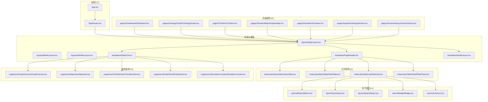
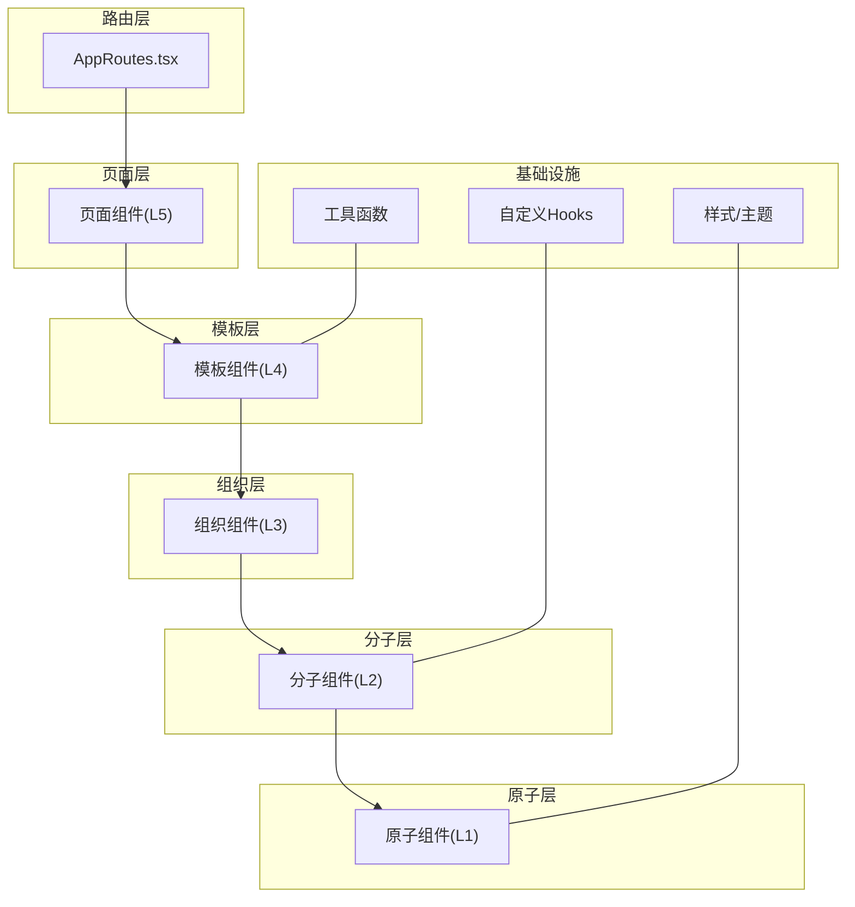
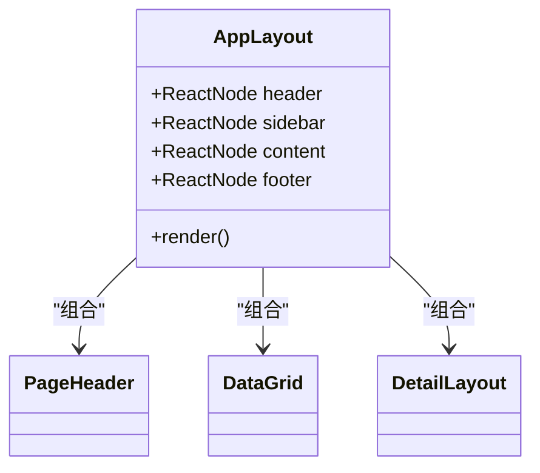
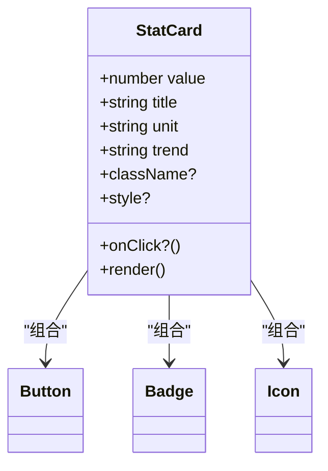
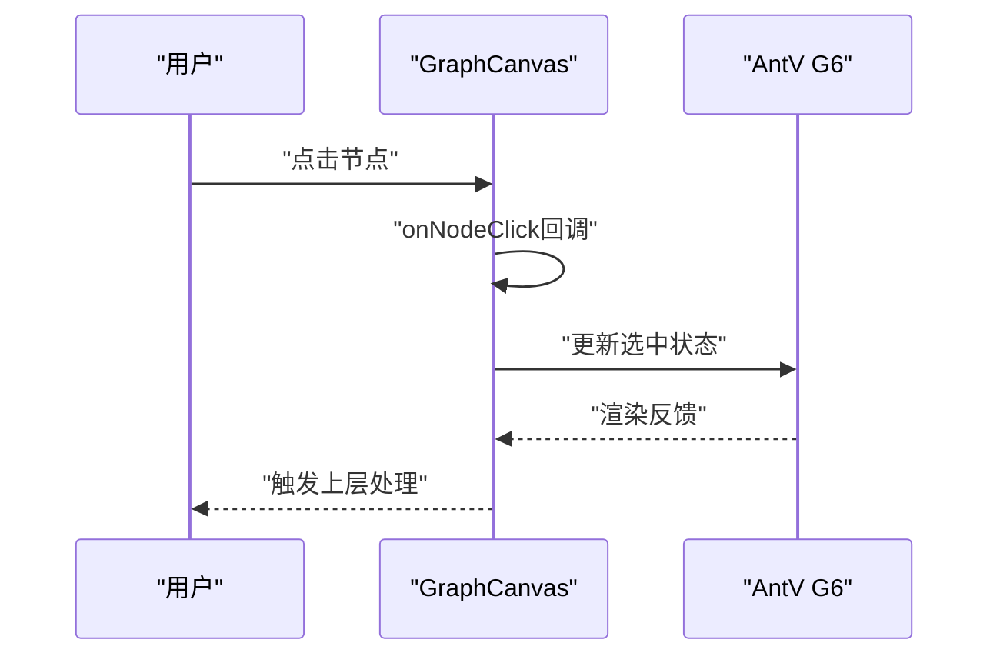
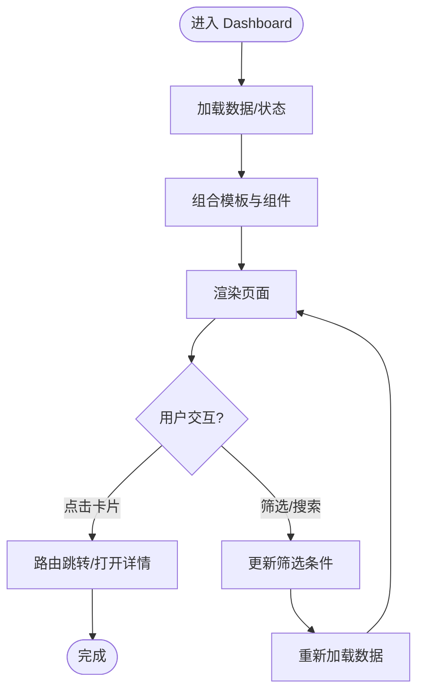
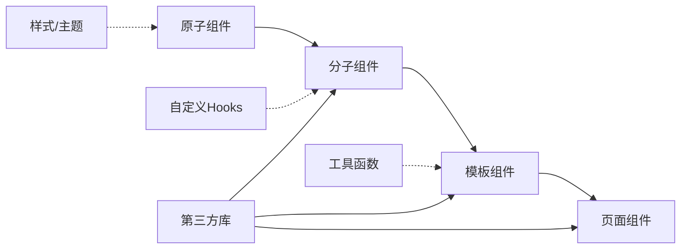

# 组件体系

<cite>
**本文引用的文件**   
- [COMPONENT_HIERARCHY.md](file://docs/04-ui/COMPONENT_HIERARCHY.md)
- [COMPONENT_SPEC.md](file://docs/04-ui/COMPONENT_SPEC.md)
- [FRONTEND_COMPONENT_DESIGN.md](file://docs/04-ui/FRONTEND_COMPONENT_DESIGN.md)
- [App.tsx](file://frontend/src/App.tsx)
- [AppRoutes.tsx](file://frontend/src/AppRoutes.tsx)
- [index.css](file://frontend/src/index.css)
- [variables.css](file://frontend/src/styles/variables.css)
- [global.css](file://frontend/src/styles/global.css)
- [theme.ts](file://frontend/src/styles/theme.ts)
- [responsive.ts](file://frontend/src/utils/responsive.ts)
- [i18n.ts](file://frontend/src/utils/i18n.ts)
- [formatters.ts](file://frontend/src/utils/formatters.ts)
- [useBreakpoint.ts](file://frontend/src/hooks/useBreakpoint.ts)
- [useScenario.ts](file://frontend/src/hooks/useScenario.ts)
- [useGraph.ts](file://frontend/src/hooks/useGraph.ts)
- [StatCard.tsx](file://frontend/src/modules/shared/components/StatCard.tsx)
- [PageHeader.tsx](file://frontend/src/modules/shared/components/PageHeader.tsx)
- [AppLayout.tsx](file://frontend/src/layouts/AppLayout.tsx)
- [BlankLayout.tsx](file://frontend/src/layouts/BlankLayout.tsx)
- [MobileLayout.tsx](file://frontend/src/layouts/MobileLayout.tsx)
- [Button.tsx](file://frontend/src/components/atoms/Button/Button.tsx)
- [Input.tsx](file://frontend/src/components/atoms/Input/Input.tsx)
- [Select.tsx](file://frontend/src/components/atoms/Select/Select.tsx)
- [Badge.tsx](file://frontend/src/components/atoms/Badge/Badge.tsx)
- [Icon.tsx](file://frontend/src/components/atoms/Icon/Icon.tsx)
- [SearchBar.tsx](file://frontend/src/components/molecules/SearchBar/SearchBar.tsx)
- [DataTable.tsx](file://frontend/src/components/molecules/DataTable/DataTable.tsx)
- [StatCard.tsx](file://frontend/src/components/molecules/StatCard/StatCard.tsx)
- [FilterPanel.tsx](file://frontend/src/components/molecules/FilterPanel/FilterPanel.tsx)
- [GraphCanvas.tsx](file://frontend/src/components/organisms/GraphCanvas/GraphCanvas.tsx)
- [MapView.tsx](file://frontend/src/components/organisms/MapView/MapView.tsx)
- [TimelineView.tsx](file://frontend/src/components/organisms/TimelineView/TimelineView.tsx)
- [EntityPanel.tsx](file://frontend/src/components/organisms/EntityPanel/EntityPanel.tsx)
- [SimulatorConsole.tsx](file://frontend/src/components/organisms/SimulatorConsole/SimulatorConsole.tsx)
- [PageHeader.tsx](file://frontend/src/components/templates/PageHeader/PageHeader.tsx)
- [DataGrid.tsx](file://frontend/src/components/templates/DataGrid/DataGrid.tsx)
- [DetailLayout.tsx](file://frontend/src/components/templates/DetailLayout/DetailLayout.tsx)
- [Dashboard.tsx](file://frontend/src/pages/Dashboard/Dashboard.tsx)
- [OntologyGraph.tsx](file://frontend/src/pages/OntologyGraph/OntologyGraph.tsx)
- [Timeline.tsx](file://frontend/src/pages/Timeline/Timeline.tsx)
- [SituationMap.tsx](file://frontend/src/pages/SituationMap/SituationMap.tsx)
- [Simulator.tsx](file://frontend/src/pages/Simulator/Simulator.tsx)
- [IngestPanel.tsx](file://frontend/src/pages/IngestPanel/IngestPanel.tsx)
- [VersionHistory.tsx](file://frontend/src/pages/VersionHistory/VersionHistory.tsx)
</cite>

## 目录
1. [引言](#引言)
2. [项目结构](#项目结构)
3. [核心组件](#核心组件)
4. [架构总览](#架构总览)
5. [详细组件分析](#详细组件分析)
6. [依赖分析](#依赖分析)
7. [性能考虑](#性能考虑)
8. [故障排查指南](#故障排查指南)
9. [结论](#结论)
10. [附录](#附录)

## 引言
本文件面向ODAP前端组件体系，围绕5级组件层次结构（AppLayout、PageHeader、StatCard等）进行系统化说明。内容涵盖组件设计原则、命名规范、复用策略；层级关系、依赖关系与组合模式；props接口设计、事件处理与状态管理；样式系统、主题定制与响应式设计；最佳实践、性能优化与可访问性；以及具体使用示例与集成指导。目标是帮助开发者快速理解并高效构建高质量的前端界面。

## 项目结构
前端采用模块化与层级化组织方式，结合组件分级与模板布局，形成清晰的“原子-分子-组织-模板-页面”五级体系，并配套自定义Hooks、工具函数与样式变量，支撑跨模块复用与一致性体验。

**图表来源**
- [App.tsx](file://frontend/src/App.tsx)
- [AppRoutes.tsx](file://frontend/src/AppRoutes.tsx)
- [AppLayout.tsx](file://frontend/src/layouts/AppLayout.tsx)
- [PageHeader.tsx](file://frontend/src/components/templates/PageHeader/PageHeader.tsx)
- [StatCard.tsx](file://frontend/src/components/molecules/StatCard/StatCard.tsx)
- [Button.tsx](file://frontend/src/components/atoms/Button/Button.tsx)
- [GraphCanvas.tsx](file://frontend/src/components/organisms/GraphCanvas/GraphCanvas.tsx)
- [Dashboard.tsx](file://frontend/src/pages/Dashboard/Dashboard.tsx)

**章节来源**
- [COMPONENT_HIERARCHY.md:21-88](file://docs/04-ui/COMPONENT_HIERARCHY.md#L21-L88)
- [FRONTEND_COMPONENT_DESIGN.md:26-53](file://docs/04-ui/FRONTEND_COMPONENT_DESIGN.md#L26-L53)

## 核心组件
本节聚焦于5级组件体系中的关键构件，包括布局、页面与典型业务组件，阐明其职责边界、接口约定与组合方式。

- 布局组件
  - AppLayout：提供统一的头部、侧边栏与内容区布局，作为页面级容器。
  - BlankLayout：无侧边栏的空白布局，适用于登录页或简单页面。
  - MobileLayout：移动端优先的布局适配，折叠侧边栏与底部导航。

- 模板组件
  - PageHeader：页面级头部模板，承载面包屑、操作区与快捷入口。
  - DataGrid：数据网格模板，抽象表格与分页、筛选等通用行为。
  - DetailLayout：详情页布局模板，左侧列表右侧详情的三栏结构。

- 分子组件（以StatCard为例）
  - StatCard：统计卡片，接收指标数据与样式配置，组合原子组件实现展示与交互。
  - SearchBar：搜索输入与过滤面板的组合，支持回调事件与默认值处理。
  - DataTable：数据表格，封装排序、分页与空状态处理。
  - FilterPanel：筛选面板，支持多维度筛选与重置。

- 组织组件（以GraphCanvas为例）
  - GraphCanvas：本体图谱画布，集成AntV G6，负责节点/关系渲染、交互与缩放平移。
  - MapView、TimelineView、EntityPanel、SimulatorConsole：地图、时间轴、实体面板与模拟控制台等业务功能区。

- 页面组件
  - Dashboard、OntologyGraph、Timeline、SituationMap、Simulator、IngestPanel、VersionHistory：路由级页面，组装L1-L4组件并连接状态与API。

**章节来源**
- [COMPONENT_HIERARCHY.md:94-182](file://docs/04-ui/COMPONENT_HIERARCHY.md#L94-L182)
- [FRONTEND_COMPONENT_DESIGN.md:551-596](file://docs/04-ui/FRONTEND_COMPONENT_DESIGN.md#L551-L596)

## 架构总览
ODAP前端采用“路由驱动 + 组件分层 + 模块化”的架构。应用入口负责挂载路由，路由根据路径选择页面组件；页面组件通过模板与组织组件搭建页面骨架；模板进一步组合分子组件；分子组件复用原子组件；全局样式与主题变量统一视觉风格；自定义Hooks与工具函数提供横切能力。

**图表来源**
- [AppRoutes.tsx](file://frontend/src/AppRoutes.tsx)
- [COMPONENT_HIERARCHY.md:21-88](file://docs/04-ui/COMPONENT_HIERARCHY.md#L21-L88)
- [variables.css](file://frontend/src/styles/variables.css)
- [responsive.ts](file://frontend/src/utils/responsive.ts)
- [useBreakpoint.ts](file://frontend/src/hooks/useBreakpoint.ts)

## 详细组件分析

### 布局组件：AppLayout
- 设计原则
  - 统一头部、侧边栏与内容区，支持折叠与响应式。
  - 通过模板组件承载页面级元素，避免重复布局代码。
- Props接口
  - header、sidebar、content、footer等可选节点，支持灵活组合。
- 事件与状态
  - 通过外部传入回调控制菜单切换、搜索与通知等交互。
- 样式与主题
  - 使用CSS变量与主题文件统一尺寸、颜色与阴影。
- 响应式
  - 结合断点Hook与媒体查询，移动端自动折叠侧边栏。

**图表来源**
- [AppLayout.tsx](file://frontend/src/layouts/AppLayout.tsx)
- [PageHeader.tsx](file://frontend/src/components/templates/PageHeader/PageHeader.tsx)
- [DataGrid.tsx](file://frontend/src/components/templates/DataGrid/DataGrid.tsx)
- [DetailLayout.tsx](file://frontend/src/components/templates/DetailLayout/DetailLayout.tsx)

**章节来源**
- [COMPONENT_HIERARCHY.md:186-248](file://docs/04-ui/COMPONENT_HIERARCHY.md#L186-L248)
- [FRONTEND_COMPONENT_DESIGN.md:551-596](file://docs/04-ui/FRONTEND_COMPONENT_DESIGN.md#L551-L596)

### 分子组件：StatCard
- 设计原则
  - 由原子组件组合，提供单一指标展示与交互入口。
  - 支持默认值与样式覆盖，便于在不同页面复用。
- Props接口
  - 接收指标数据、单位、趋势、点击回调与样式扩展。
- 事件处理
  - 点击回调用于跳转详情或触发动作。
- 样式系统
  - 使用模块化CSS与BEM风格，支持className/style透传。

**图表来源**
- [StatCard.tsx](file://frontend/src/components/molecules/StatCard/StatCard.tsx)
- [Button.tsx](file://frontend/src/components/atoms/Button/Button.tsx)
- [Badge.tsx](file://frontend/src/components/atoms/Badge/Badge.tsx)
- [Icon.tsx](file://frontend/src/components/atoms/Icon/Icon.tsx)

**章节来源**
- [COMPONENT_HIERARCHY.md:113-129](file://docs/04-ui/COMPONENT_HIERARCHY.md#L113-L129)
- [COMPONENT_SPEC.md:352-433](file://docs/04-ui/COMPONENT_SPEC.md#L352-L433)

### 组织组件：GraphCanvas
- 设计原则
  - 封装AntV G6，提供节点/关系渲染、拖拽、缩放、平移与选中反馈。
- Props接口
  - nodes、relationships、selectedNodeId/RelId、布局类型与交互回调。
- 事件处理
  - 节点/关系点击、双击、拖拽、缩放、平移等回调。
- 性能优化
  - 力导向参数预设、碰撞半径与中心力配置，平衡视觉与性能。
- 可访问性
  - 提供键盘导航与焦点管理建议（在实现中补充）。

**图表来源**
- [GraphCanvas.tsx](file://frontend/src/components/organisms/GraphCanvas/GraphCanvas.tsx)
- [COMPONENT_SPEC.md:242-324](file://docs/04-ui/COMPONENT_SPEC.md#L242-L324)

**章节来源**
- [COMPONENT_HIERARCHY.md:131-147](file://docs/04-ui/COMPONENT_HIERARCHY.md#L131-L147)
- [COMPONENT_SPEC.md:242-324](file://docs/04-ui/COMPONENT_SPEC.md#L242-L324)

### 页面组件：Dashboard
- 设计原则
  - 路由级组件，组装模板与组织组件，连接状态与API。
- 状态管理
  - 可使用本地useState或Zustand Store，按需选择。
- 组合模式
  - 使用DataGrid与StatCard等模板/分子组件快速搭建仪表盘。
- 事件与交互
  - 通过回调与路由参数传递上下文。

**图表来源**
- [Dashboard.tsx](file://frontend/src/pages/Dashboard/Dashboard.tsx)
- [DataGrid.tsx](file://frontend/src/components/templates/DataGrid/DataGrid.tsx)
- [StatCard.tsx](file://frontend/src/components/molecules/StatCard/StatCard.tsx)

**章节来源**
- [COMPONENT_HIERARCHY.md:168-182](file://docs/04-ui/COMPONENT_HIERARCHY.md#L168-L182)
- [FRONTEND_COMPONENT_DESIGN.md:551-596](file://docs/04-ui/FRONTEND_COMPONENT_DESIGN.md#L551-L596)

## 依赖分析
- 组件耦合
  - 分子组件依赖原子组件，模板组件依赖分子组件，页面组件依赖模板与组织组件。
- 外部依赖
  - Ant Design、AntV G6、ECharts、Leaflet等第三方库提供UI与可视化能力。
- 环境与配置
  - Vite构建、Vitest测试、Emotion CSS-in-JS、响应式断点与国际化工具。

**图表来源**
- [COMPONENT_HIERARCHY.md:21-88](file://docs/04-ui/COMPONENT_HIERARCHY.md#L21-L88)
- [FRONTEND_COMPONENT_DESIGN.md:10-25](file://docs/04-ui/FRONTEND_COMPONENT_DESIGN.md#L10-L25)

**章节来源**
- [FRONTEND_COMPONENT_DESIGN.md:600-641](file://docs/04-ui/FRONTEND_COMPONENT_DESIGN.md#L600-L641)

## 性能考虑
- 组件拆分与懒加载
  - 将大型页面组件拆分为独立文件，按需加载，减少首屏负担。
- 渲染优化
  - 使用memo与key稳定列表项，避免不必要的重渲染。
- 图形与图表
  - GraphCanvas与图表组件限制刷新频率，启用虚拟滚动与分页。
- 样式与主题
  - 使用CSS变量与主题文件集中管理，减少样式抖动与重绘。
- 响应式
  - 在断点变化时缓存布局状态，避免频繁计算。

[本节为通用指导，无需特定文件引用]

## 故障排查指南
- 常见问题定位
  - 组件未使用：检查路由是否注册，确认导出与使用一致性。
  - Props不匹配：核对接口定义与调用处传参，确保可选/必选字段正确。
  - 样式冲突：检查模块化CSS命名与BEM风格，避免全局污染。
  - 响应式异常：验证断点Hook与媒体查询，确保布局容器具备响应式类名。
- 调试建议
  - 使用React DevTools查看组件树与Props，定位渲染问题。
  - 在GraphCanvas中开启调试模式，观察节点/关系渲染与交互反馈。
  - 检查API服务层返回格式，确保页面组件解析一致。

**章节来源**
- [FRONTEND_COMPONENT_DESIGN.md:658-674](file://docs/04-ui/FRONTEND_COMPONENT_DESIGN.md#L658-L674)

## 结论
ODAP前端组件体系以5级分层为核心，通过布局、模板、组织、分子与原子组件的有序组合，实现了高复用、强一致与易维护的前端架构。配合统一的命名规范、样式系统与响应式策略，开发者可以快速构建复杂业务页面。建议持续完善大型组件拆分、统一状态管理策略与测试覆盖，以提升长期可维护性与质量。

[本节为总结性内容，无需特定文件引用]

## 附录

### 组件命名规范与样式约定
- 目录与文件命名：PascalCase；样式文件采用模块化CSS。
- Props类型：{ComponentName}Props；默认值在函数签名中声明。
- 样式类：BEM风格，支持className/style透传。

**章节来源**
- [COMPONENT_HIERARCHY.md:186-196](file://docs/04-ui/COMPONENT_HIERARCHY.md#L186-L196)
- [COMPONENT_HIERARCHY.md:201-240](file://docs/04-ui/COMPONENT_HIERARCHY.md#L201-L240)

### 样式系统与主题定制
- 全局样式：基础样式与全局变量。
- 主题文件：集中管理颜色、字体、阴影与动画参数。
- 响应式断点：桌面、平板、移动端的网格与布局调整。

**章节来源**
- [index.css](file://frontend/src/index.css)
- [variables.css](file://frontend/src/styles/variables.css)
- [global.css](file://frontend/src/styles/global.css)
- [theme.ts](file://frontend/src/styles/theme.ts)
- [COMPONENT_SPEC.md:476-508](file://docs/04-ui/COMPONENT_SPEC.md#L476-L508)

### 自定义Hooks与工具函数
- 断点检测：useBreakpoint，适配不同屏幕尺寸。
- 场景与图谱：useScenario、useGraph，提供业务上下文。
- 国际化与格式化：i18n与formatters，统一文案与数值展示。

**章节来源**
- [useBreakpoint.ts](file://frontend/src/hooks/useBreakpoint.ts)
- [useScenario.ts](file://frontend/src/hooks/useScenario.ts)
- [useGraph.ts](file://frontend/src/hooks/useGraph.ts)
- [i18n.ts](file://frontend/src/utils/i18n.ts)
- [formatters.ts](file://frontend/src/utils/formatters.ts)