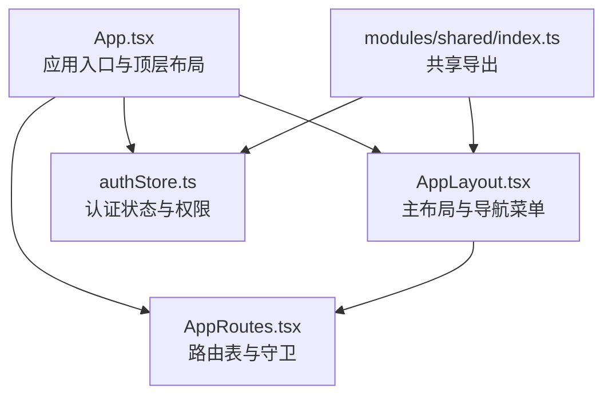
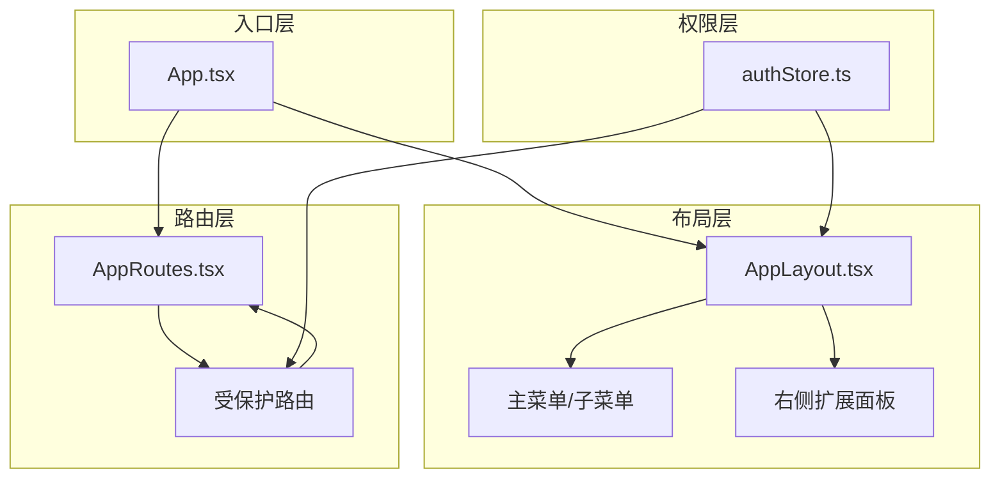
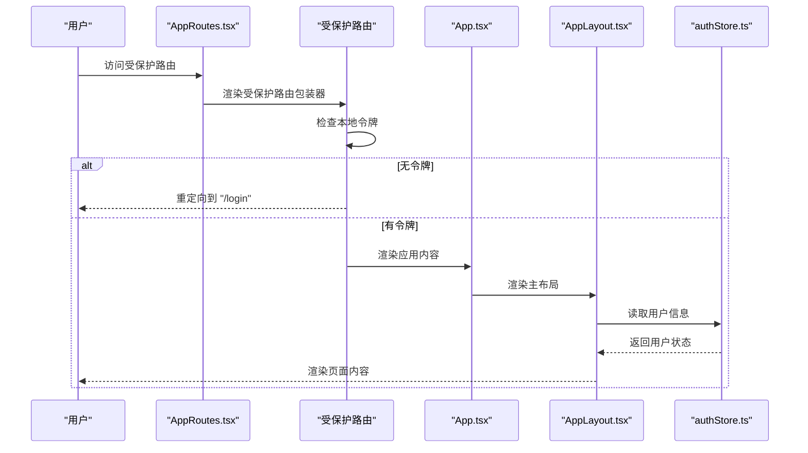
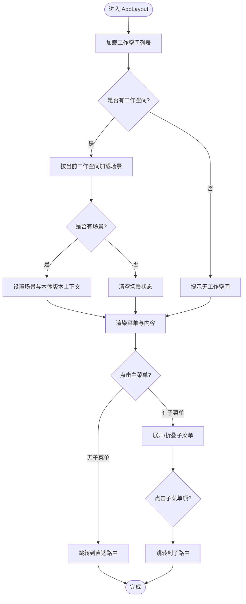
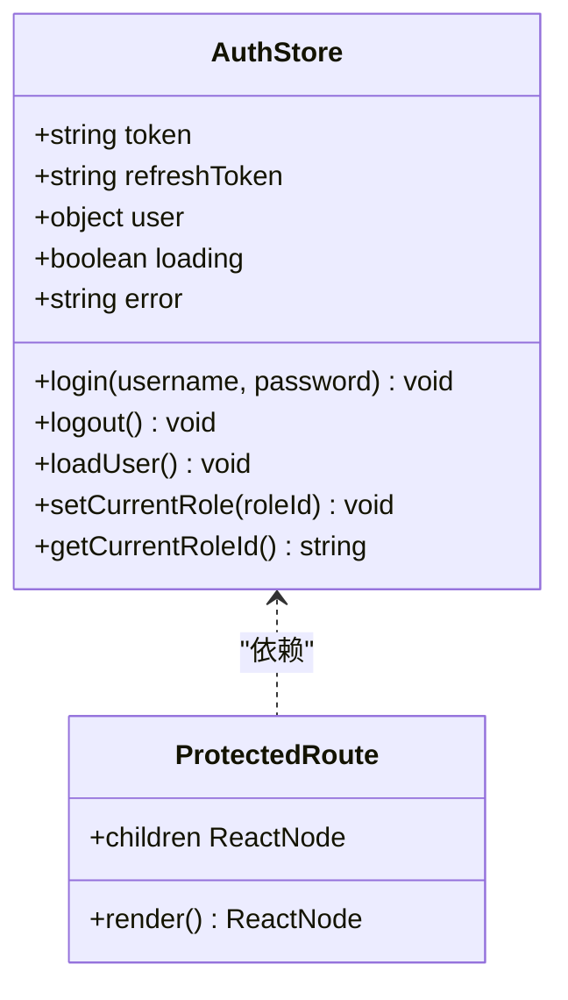
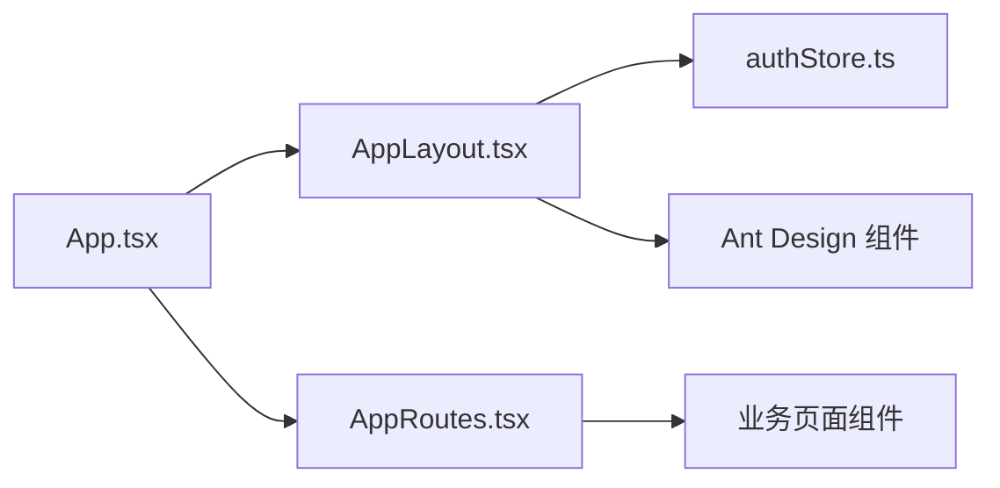

# 路由与导航

<cite>
**本文引用的文件**
- [App.tsx](file://frontend/src/App.tsx)
- [AppRoutes.tsx](file://frontend/src/AppRoutes.tsx)
- [AppLayout.tsx](file://frontend/src/modules/shared/components/AppLayout.tsx)
- [authStore.ts](file://frontend/src/modules/shared/stores/authStore.ts)
- [index.ts](file://frontend/src/modules/shared/index.ts)
</cite>

## 目录
1. [引言](#引言)
2. [项目结构](#项目结构)
3. [核心组件](#核心组件)
4. [架构总览](#架构总览)
5. [详细组件分析](#详细组件分析)
6. [依赖关系分析](#依赖关系分析)
7. [性能考虑](#性能考虑)
8. [故障排查指南](#故障排查指南)
9. [结论](#结论)
10. [附录](#附录)

## 引言
本文件面向 ODAP 前端的路由与导航系统，基于 React Router DOM 实现，覆盖路由配置、嵌套路由与动态路由设计；页面级导航结构、面包屑系统与页面标题管理；权限控制与路由守卫；页面切换动画与加载状态、错误处理；导航菜单的动态生成、权限过滤与响应式布局；路由参数传递、查询字符串处理与历史记录管理；以及 SEO 优化与页面预加载策略。文档以渐进方式呈现，既适合初学者理解整体结构，也便于资深开发者深入分析具体实现。

## 项目结构
ODAP 前端采用模块化组织，路由与导航相关的关键文件集中在 frontend/src 目录下：
- 应用入口与顶层布局：App.tsx、AppLayout.tsx
- 路由定义：AppRoutes.tsx
- 权限状态管理：authStore.ts
- 共享导出入口：modules/shared/index.ts

图示来源
- [App.tsx:1-65](file://frontend/src/App.tsx#L1-L65)
- [AppLayout.tsx:1-712](file://frontend/src/modules/shared/components/AppLayout.tsx#L1-L712)
- [AppRoutes.tsx:1-61](file://frontend/src/AppRoutes.tsx#L1-L61)
- [authStore.ts:1-148](file://frontend/src/modules/shared/stores/authStore.ts#L1-L148)
- [index.ts:1-11](file://frontend/src/modules/shared/index.ts#L1-L11)

章节来源
- [App.tsx:1-65](file://frontend/src/App.tsx#L1-L65)
- [AppRoutes.tsx:1-61](file://frontend/src/AppRoutes.tsx#L1-L61)
- [AppLayout.tsx:1-712](file://frontend/src/modules/shared/components/AppLayout.tsx#L1-L712)
- [authStore.ts:1-148](file://frontend/src/modules/shared/stores/authStore.ts#L1-L148)
- [index.ts:1-11](file://frontend/src/modules/shared/index.ts#L1-L11)

## 核心组件
- 应用入口与顶层布局
  - App.tsx：使用浏览器路由容器包裹应用内容，按路径决定是否渲染登录页或带布局的页面；在非登录页时加载工作空间并控制初始加载状态。
- 主布局与导航菜单
  - AppLayout.tsx：提供左侧主菜单、二级子菜单、右侧扩展面板、顶部工作空间/场景选择与用户操作区；支持响应式折叠与展开；维护工作空间与场景上下文；提供右侧扩展面板上下文。
- 路由表与守卫
  - AppRoutes.tsx：集中声明所有页面路由，使用受保护路由包装器实现登录态校验；暴露登录页与多个业务页面的路径映射。
- 权限状态管理
  - authStore.ts：基于 zustand 管理 token、用户信息、当前角色等；提供登录、登出、加载用户信息与角色切换能力；初始化时尝试从本地存储恢复用户状态。

章节来源
- [App.tsx:1-65](file://frontend/src/App.tsx#L1-L65)
- [AppLayout.tsx:1-712](file://frontend/src/modules/shared/components/AppLayout.tsx#L1-L712)
- [AppRoutes.tsx:1-61](file://frontend/src/AppRoutes.tsx#L1-L61)
- [authStore.ts:1-148](file://frontend/src/modules/shared/stores/authStore.ts#L1-L148)

## 架构总览
ODAP 的路由与导航采用“入口 -> 布局 -> 路由”的分层架构：
- 入口层负责环境准备（如工作空间加载）与登录态判断；
- 布局层负责菜单、面包屑、标题与响应式布局；
- 路由层负责页面级导航与权限守卫。

图示来源
- [App.tsx:1-65](file://frontend/src/App.tsx#L1-L65)
- [AppLayout.tsx:1-712](file://frontend/src/modules/shared/components/AppLayout.tsx#L1-L712)
- [AppRoutes.tsx:1-61](file://frontend/src/AppRoutes.tsx#L1-L61)
- [authStore.ts:1-148](file://frontend/src/modules/shared/stores/authStore.ts#L1-L148)

## 详细组件分析

### 受保护路由与登录流程
- 登录页与重定向：登录页路由独立存在；未携带有效令牌时访问受保护路由将被重定向至登录页。
- 登录成功后：authStore 写入 token、刷新 token 与用户信息到本地存储；随后可访问受保护路由。
- 登出：清除本地存储并重置状态，返回登录页。

图示来源
- [AppRoutes.tsx:19-25](file://frontend/src/AppRoutes.tsx#L19-L25)
- [AppRoutes.tsx:30-58](file://frontend/src/AppRoutes.tsx#L30-L58)
- [App.tsx:8-54](file://frontend/src/App.tsx#L8-L54)
- [authStore.ts:25-85](file://frontend/src/modules/shared/stores/authStore.ts#L25-L85)

章节来源
- [AppRoutes.tsx:19-25](file://frontend/src/AppRoutes.tsx#L19-L25)
- [AppRoutes.tsx:30-58](file://frontend/src/AppRoutes.tsx#L30-L58)
- [App.tsx:8-54](file://frontend/src/App.tsx#L8-L54)
- [authStore.ts:25-85](file://frontend/src/modules/shared/stores/authStore.ts#L25-L85)

### 菜单与导航结构
- 主菜单与子菜单：通过主菜单配置与映射表实现“路由 -> 主菜单”的关联；点击主菜单可展开子菜单或直接跳转；点击子菜单项进行页面跳转。
- 动态路由映射：routeToPrimaryMap 将子路由映射到对应主菜单键值；directRoutes 提供直达路由映射。
- 左侧/右侧布局与折叠：根据是否处于“我的智能体”模式，动态隐藏/显示左侧菜单与子菜单；右侧扩展面板可折叠/展开。
- 工作空间与场景联动：顶部区域提供工作空间与场景选择，切换后更新本地存储并触发相关上下文刷新。

图示来源
- [AppLayout.tsx:232-298](file://frontend/src/modules/shared/components/AppLayout.tsx#L232-L298)
- [AppLayout.tsx:313-333](file://frontend/src/modules/shared/components/AppLayout.tsx#L313-L333)
- [AppLayout.tsx:185-199](file://frontend/src/modules/shared/components/AppLayout.tsx#L185-L199)
- [AppLayout.tsx:128-183](file://frontend/src/modules/shared/components/AppLayout.tsx#L128-L183)

章节来源
- [AppLayout.tsx:128-199](file://frontend/src/modules/shared/components/AppLayout.tsx#L128-L199)
- [AppLayout.tsx:232-298](file://frontend/src/modules/shared/components/AppLayout.tsx#L232-L298)
- [AppLayout.tsx:313-333](file://frontend/src/modules/shared/components/AppLayout.tsx#L313-L333)

### 页面级导航与面包屑
- 导航结构：主菜单与子菜单构成页面导航骨架；通过路由映射实现“主菜单 -> 子菜单 -> 页面”的层级关系。
- 面包屑：当前页面的面包屑通常由当前路由路径与主菜单映射关系推导；若需要更精细的面包屑，可在页面级组件中基于路由参数与静态配置生成。
- 页面标题：建议在页面组件中通过 effect 或路由监听设置 document.title；也可在布局层根据当前路径与主菜单标签动态更新标题。

章节来源
- [AppLayout.tsx:128-183](file://frontend/src/modules/shared/components/AppLayout.tsx#L128-L183)
- [AppRoutes.tsx:27-58](file://frontend/src/AppRoutes.tsx#L27-L58)

### 权限控制与路由守卫
- 守卫实现：受保护路由包装器检查本地令牌，无令牌则重定向至登录页。
- 用户状态：authStore 维护 token、用户信息与当前角色；提供登录、登出与加载用户信息方法；初始化时尝试恢复用户状态。
- 角色与权限：当前实现以令牌存在性作为基础守卫；如需细粒度权限控制，可在受保护路由包装器内集成角色/资源授权逻辑。

图示来源
- [authStore.ts:25-142](file://frontend/src/modules/shared/stores/authStore.ts#L25-L142)
- [AppRoutes.tsx:19-25](file://frontend/src/AppRoutes.tsx#L19-L25)

章节来源
- [authStore.ts:25-142](file://frontend/src/modules/shared/stores/authStore.ts#L25-L142)
- [AppRoutes.tsx:19-25](file://frontend/src/AppRoutes.tsx#L19-L25)

### 页面切换动画、加载状态与错误处理
- 初始加载：App.tsx 在非登录页时异步加载工作空间列表，期间显示加载指示；加载完成后渲染主布局与路由。
- 加载状态：AppLayout.tsx 在加载工作空间与场景时分别显示加载指示，避免空白渲染。
- 错误处理：工作空间/场景加载失败时弹出消息提示；登录失败时设置错误状态并阻止进入受保护路由。
- 动画与过渡：布局层对边距变化使用 CSS 过渡，实现菜单折叠/展开的平滑体验。

章节来源
- [App.tsx:14-34](file://frontend/src/App.tsx#L14-L34)
- [App.tsx:45-47](file://frontend/src/App.tsx#L45-L47)
- [AppLayout.tsx:242-263](file://frontend/src/modules/shared/components/AppLayout.tsx#L242-L263)
- [AppLayout.tsx:265-298](file://frontend/src/modules/shared/components/AppLayout.tsx#L265-L298)
- [authStore.ts:66-72](file://frontend/src/modules/shared/stores/authStore.ts#L66-L72)

### 导航菜单的动态生成、权限过滤与响应式设计
- 动态生成：主菜单与子菜单通过配置数组 primaryMenus 生成；点击事件处理函数根据映射表与直达路由表进行跳转。
- 权限过滤：当前实现未在菜单层面做权限过滤；如需按角色/资源过滤，可在渲染前对菜单项进行筛选。
- 响应式设计：支持左侧主菜单与子菜单的折叠/展开；右侧扩展面板可折叠；根据是否处于“我的智能体”模式动态隐藏左侧菜单。

章节来源
- [AppLayout.tsx:128-183](file://frontend/src/modules/shared/components/AppLayout.tsx#L128-L183)
- [AppLayout.tsx:313-333](file://frontend/src/modules/shared/components/AppLayout.tsx#L313-L333)
- [AppLayout.tsx:202-228](file://frontend/src/modules/shared/components/AppLayout.tsx#L202-L228)

### 路由参数传递、查询字符串处理与历史记录管理
- 路由参数：示例中存在动态路由片段（如聊天页的 agentId），可通过路由参数读取并在页面组件中使用。
- 查询字符串：可结合 useSearchParams 获取与更新查询参数；在菜单点击或页面跳转时统一管理。
- 历史记录：使用 useNavigate 与 useLocation 管理前进/后退与页面跳转；建议在复杂页面中使用 history 状态传递上下文。

章节来源
- [AppRoutes.tsx:33-33](file://frontend/src/AppRoutes.tsx#L33-L33)
- [AppLayout.tsx:313-333](file://frontend/src/modules/shared/components/AppLayout.tsx#L313-L333)

### SEO 优化与页面预加载策略
- 页面标题：建议在页面组件中设置 document.title；可结合路由监听与主菜单标签动态生成标题。
- 预加载：对高频访问页面（如语义网络、蓝图设计）可采用链接预加载策略；对大体积页面可采用懒加载与骨架屏提升感知性能。
- 元信息：可在页面组件中注入 meta 描述与关键词；对多语言场景可结合 i18n 与路由参数动态设置。

## 依赖关系分析
- 组件耦合
  - App.tsx 依赖 AppLayout.tsx 与 AppRoutes.tsx；AppLayout.tsx 依赖 authStore.ts 与共享服务；AppRoutes.tsx 依赖各业务页面组件。
- 外部依赖
  - React Router DOM：提供路由容器、导航与位置状态；Ant Design：提供布局、菜单、选择器与图标等 UI 组件。
- 上下文与状态
  - Workspace/Scenario/OntologyVersion/RightPanel 四个上下文贯穿布局与页面；authStore 提供全局认证状态。

图示来源
- [App.tsx:1-65](file://frontend/src/App.tsx#L1-L65)
- [AppLayout.tsx:1-712](file://frontend/src/modules/shared/components/AppLayout.tsx#L1-L712)
- [AppRoutes.tsx:1-61](file://frontend/src/AppRoutes.tsx#L1-L61)
- [authStore.ts:1-148](file://frontend/src/modules/shared/stores/authStore.ts#L1-L148)

章节来源
- [App.tsx:1-65](file://frontend/src/App.tsx#L1-L65)
- [AppLayout.tsx:1-712](file://frontend/src/modules/shared/components/AppLayout.tsx#L1-L712)
- [AppRoutes.tsx:1-61](file://frontend/src/AppRoutes.tsx#L1-L61)
- [authStore.ts:1-148](file://frontend/src/modules/shared/stores/authStore.ts#L1-L148)

## 性能考虑
- 路由懒加载：对大型页面采用动态导入，减少首屏体积。
- 缓存策略：工作空间与场景列表结果缓存于本地存储，避免重复请求。
- 渲染优化：菜单与面板的折叠/展开使用 CSS 过渡，减少强制布局；对频繁切换的页面使用 React.memo 与 useMemo 降低重渲染。
- 预加载：对热点页面进行预加载，提升交互流畅度。

## 故障排查指南
- 登录后仍被重定向到登录页
  - 检查本地存储中的 token 是否正确写入；确认受保护路由包装器的令牌检查逻辑。
- 工作空间/场景加载失败
  - 查看控制台错误输出；确认 API 接口可用性与鉴权头；检查返回数据格式。
- 菜单点击无效
  - 检查主菜单配置与 routeToPrimaryMap 映射；确认 directRoutes 中是否存在直达路由。
- 页面标题未更新
  - 在页面组件中添加标题设置逻辑；确保在路由切换时执行。

章节来源
- [AppRoutes.tsx:19-25](file://frontend/src/AppRoutes.tsx#L19-L25)
- [App.tsx:26-28](file://frontend/src/App.tsx#L26-L28)
- [AppLayout.tsx:242-263](file://frontend/src/modules/shared/components/AppLayout.tsx#L242-L263)
- [authStore.ts:66-72](file://frontend/src/modules/shared/stores/authStore.ts#L66-L72)

## 结论
ODAP 前端路由与导航系统以 React Router DOM 为核心，结合自研布局与受保护路由包装器，实现了清晰的页面级导航、动态菜单与响应式布局。当前实现以令牌存在性为基础守卫，具备良好的可扩展性：可在受保护路由中集成细粒度权限控制；在布局层增强面包屑与页面标题管理；在页面层完善参数传递与查询字符串处理；并通过懒加载与预加载策略进一步优化性能与用户体验。

## 附录
- 共享导出入口：modules/shared/index.ts 暴露 AppLayout、useWorkspace/useScenario/useRightPanel、PageHeader、QAPanel、StatCard、ToolHealthIndicator、api/fetchJson、API_BASE、类型与 stores，便于模块间复用。

章节来源
- [index.ts:1-11](file://frontend/src/modules/shared/index.ts#L1-L11)