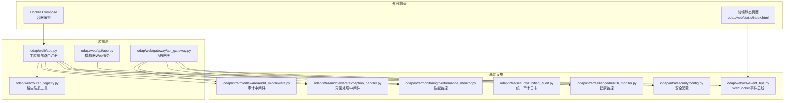
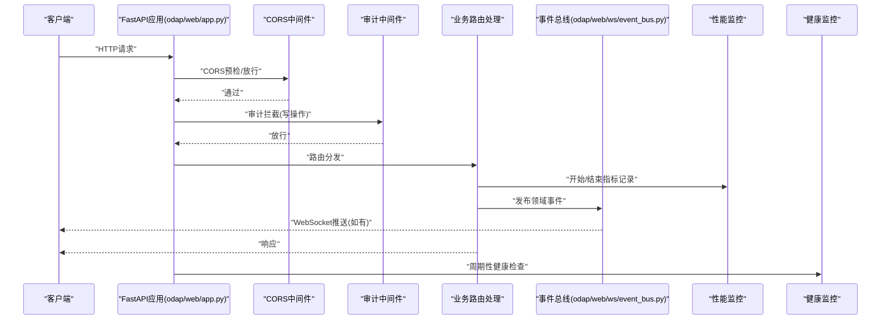
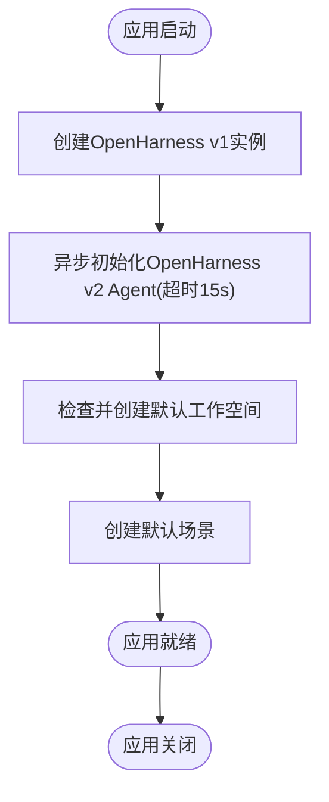
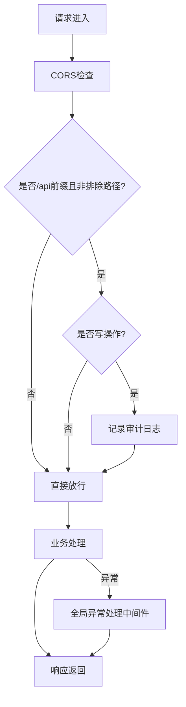
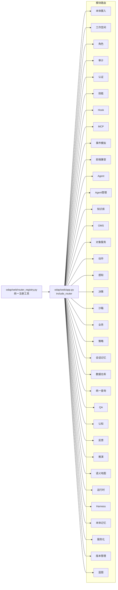
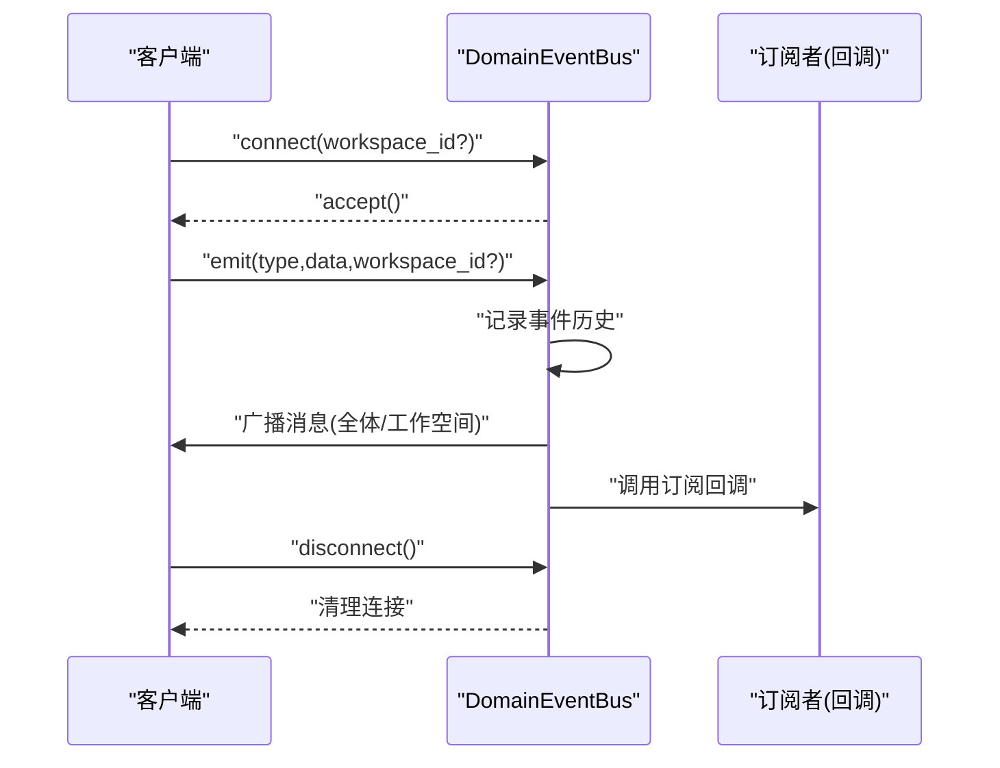
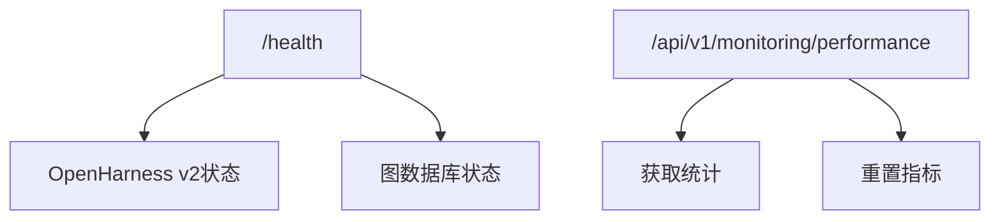
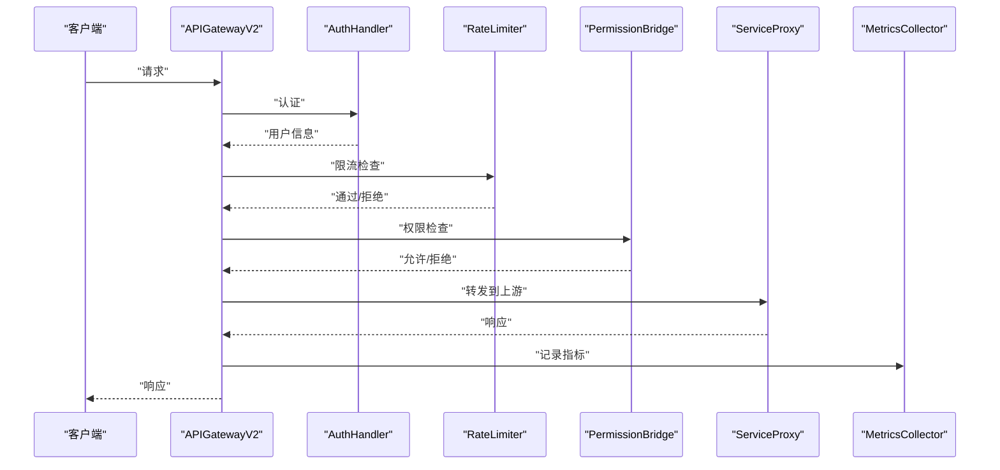
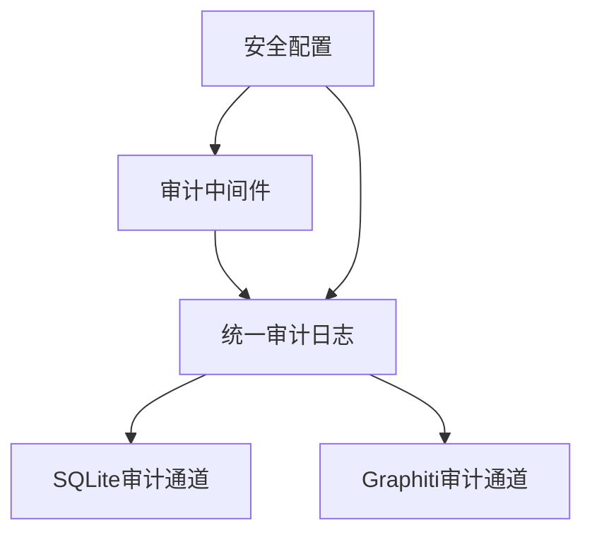
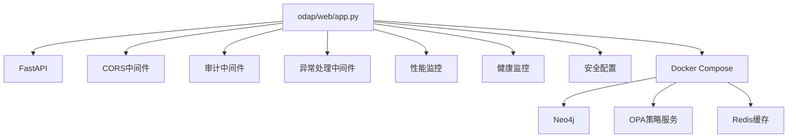

# Web应用服务

<cite>
**本文引用的文件**
- [odap/web/app.py](file://odap/web/app.py)
- [odap/web/api/app.py](file://odap/web/api/app.py)
- [odap/web/router_registry.py](file://odap/web/router_registry.py)
- [odap/web/ws/event_bus.py](file://odap/web/ws/event_bus.py)
- [odap/infra/middleware/audit_middleware.py](file://odap/infra/middleware/audit_middleware.py)
- [odap/infra/middleware/exception_handler.py](file://odap/infra/middleware/exception_handler.py)
- [odap/infra/security/unified_audit.py](file://odap/infra/security/unified_audit.py)
- [odap/infra/monitoring/performance_monitor.py](file://odap/infra/monitoring/performance_monitor.py)
- [odap/web/gateway/api_gateway.py](file://odap/web/gateway/api_gateway.py)
- [odap/infra/resilience/health_monitor.py](file://odap/infra/resilience/health_monitor.py)
- [odap/infra/security/config.py](file://odap/infra/security/config.py)
- [docker/docker-compose.yml](file://docker/docker-compose.yml)
- [odap/biz/core/ontology/api/routes.py](file://odap/biz/core/ontology/api/routes.py)
- [odap/infra/security/auth_routes.py](file://odap/infra/security/auth_routes.py)
- [odap/web/static/index.html](file://odap/web/static/index.html)
</cite>

## 目录
1. [简介](#简介)
2. [项目结构](#项目结构)
3. [核心组件](#核心组件)
4. [架构总览](#架构总览)
5. [详细组件分析](#详细组件分析)
6. [依赖分析](#依赖分析)
7. [性能考虑](#性能考虑)
8. [故障排查指南](#故障排查指南)
9. [结论](#结论)
10. [附录](#附录)

## 简介
本文件面向ODAP Web应用服务，围绕基于FastAPI的主应用架构进行系统化技术文档编制。内容涵盖应用初始化与生命周期管理、中间件配置（CORS、审计、异常处理）、路由系统设计（模块化组织、API版本与前缀规范）、WebSocket事件总线（实时消息、订阅与连接管理）、健康检查与性能监控接口、部署配置与环境变量管理、安全配置最佳实践，以及面向开发者的完整开发与维护指南。

## 项目结构
ODAP Web应用采用模块化分层组织：
- 应用入口与生命周期：odap/web/app.py
- API网关与路由注册：odap/web/gateway/api_gateway.py、odap/web/router_registry.py
- 中间件与安全：odap/infra/middleware/*、odap/infra/security/*
- WebSocket事件总线：odap/web/ws/event_bus.py
- 性能监控：odap/infra/monitoring/performance_monitor.py
- 健康监控：odap/infra/resilience/health_monitor.py
- 示例静态页面与前端交互：odap/web/static/index.html
- Docker编排：docker/docker-compose.yml

**图示来源**
- [odap/web/app.py:122-191](file://odap/web/app.py#L122-L191)
- [odap/web/router_registry.py:34-98](file://odap/web/router_registry.py#L34-L98)
- [odap/web/gateway/api_gateway.py:360-494](file://odap/web/gateway/api_gateway.py#L360-L494)
- [odap/web/ws/event_bus.py:13-147](file://odap/web/ws/event_bus.py#L13-L147)
- [odap/infra/middleware/audit_middleware.py:51-112](file://odap/infra/middleware/audit_middleware.py#L51-L112)
- [odap/infra/middleware/exception_handler.py:14-137](file://odap/infra/middleware/exception_handler.py#L14-L137)
- [odap/infra/security/unified_audit.py:292-340](file://odap/infra/security/unified_audit.py#L292-L340)
- [odap/infra/monitoring/performance_monitor.py:12-184](file://odap/infra/monitoring/performance_monitor.py#L12-L184)
- [odap/infra/resilience/health_monitor.py:28-216](file://odap/infra/resilience/health_monitor.py#L28-L216)
- [odap/infra/security/config.py:29-80](file://odap/infra/security/config.py#L29-L80)
- [docker/docker-compose.yml:1-97](file://docker/docker-compose.yml#L1-L97)
- [odap/web/static/index.html:504-548](file://odap/web/static/index.html#L504-L548)

**章节来源**
- [odap/web/app.py:122-191](file://odap/web/app.py#L122-L191)
- [odap/web/router_registry.py:34-98](file://odap/web/router_registry.py#L34-L98)
- [odap/web/gateway/api_gateway.py:360-494](file://odap/web/gateway/api_gateway.py#L360-L494)
- [odap/web/ws/event_bus.py:13-147](file://odap/web/ws/event_bus.py#L13-L147)
- [odap/infra/middleware/audit_middleware.py:51-112](file://odap/infra/middleware/audit_middleware.py#L51-L112)
- [odap/infra/middleware/exception_handler.py:14-137](file://odap/infra/middleware/exception_handler.py#L14-L137)
- [odap/infra/security/unified_audit.py:292-340](file://odap/infra/security/unified_audit.py#L292-L340)
- [odap/infra/monitoring/performance_monitor.py:12-184](file://odap/infra/monitoring/performance_monitor.py#L12-L184)
- [odap/infra/resilience/health_monitor.py:28-216](file://odap/infra/resilience/health_monitor.py#L28-L216)
- [odap/infra/security/config.py:29-80](file://odap/infra/security/config.py#L29-L80)
- [docker/docker-compose.yml:1-97](file://docker/docker-compose.yml#L1-L97)
- [odap/web/static/index.html:504-548](file://odap/web/static/index.html#L504-L548)

## 核心组件
- 应用初始化与生命周期：通过FastAPI lifespan钩子实现，包含OpenHarness v1/v2集成、默认工作空间与场景初始化等。
- 中间件体系：CORS、审计中间件、全局异常处理中间件。
- 路由系统：集中注册各业务模块路由，支持统一前缀与批量注册工具。
- WebSocket事件总线：支持客户端连接、按工作空间分发、事件历史与订阅回调。
- 性能监控：统一指标采集与统计，支持装饰器与手动埋点。
- 健康监控：Swarm组件与Agent状态监控、阈值告警与健康报告。
- 安全配置：JWT、CORS、日志级别与密钥校验。
- API网关：认证、限流、权限桥接、服务代理、连接管理与指标采集。

**章节来源**
- [odap/web/app.py:68-127](file://odap/web/app.py#L68-L127)
- [odap/infra/middleware/audit_middleware.py:51-112](file://odap/infra/middleware/audit_middleware.py#L51-L112)
- [odap/infra/middleware/exception_handler.py:70-73](file://odap/infra/middleware/exception_handler.py#L70-L73)
- [odap/web/router_registry.py:10-32](file://odap/web/router_registry.py#L10-L32)
- [odap/web/ws/event_bus.py:13-147](file://odap/web/ws/event_bus.py#L13-L147)
- [odap/infra/monitoring/performance_monitor.py:12-184](file://odap/infra/monitoring/performance_monitor.py#L12-L184)
- [odap/infra/resilience/health_monitor.py:28-216](file://odap/infra/resilience/health_monitor.py#L28-L216)
- [odap/infra/security/config.py:29-80](file://odap/infra/security/config.py#L29-L80)
- [odap/web/gateway/api_gateway.py:360-494](file://odap/web/gateway/api_gateway.py#L360-L494)

## 架构总览
下图展示Web应用的核心交互流程：应用启动、中间件拦截、路由分发、业务处理、事件总线与监控上报。

**图示来源**
- [odap/web/app.py:129-144](file://odap/web/app.py#L129-L144)
- [odap/infra/middleware/audit_middleware.py:51-112](file://odap/infra/middleware/audit_middleware.py#L51-L112)
- [odap/web/ws/event_bus.py:34-129](file://odap/web/ws/event_bus.py#L34-L129)
- [odap/infra/monitoring/performance_monitor.py:30-61](file://odap/infra/monitoring/performance_monitor.py#L30-L61)
- [odap/infra/resilience/health_monitor.py:46-89](file://odap/infra/resilience/health_monitor.py#L46-L89)

## 详细组件分析

### 应用初始化与生命周期
- 使用FastAPI lifespan钩子在启动阶段创建OpenHarness v1实例，并异步初始化OpenHarness v2 Agent；同时尝试创建默认工作空间与场景。
- 应用关闭时输出日志，便于运维观察。

**图示来源**
- [odap/web/app.py:68-127](file://odap/web/app.py#L68-L127)

**章节来源**
- [odap/web/app.py:68-127](file://odap/web/app.py#L68-L127)

### 中间件配置
- CORS：允许跨域来源、方法与头部，支持凭证。
- 审计中间件：仅对写操作记录，排除文档、健康检查、静态资源与审计自身路由。
- 全局异常处理：统一捕获未处理异常，按类型映射HTTP状态码并返回标准化错误响应。

**图示来源**
- [odap/web/app.py:129-144](file://odap/web/app.py#L129-L144)
- [odap/infra/middleware/audit_middleware.py:51-112](file://odap/infra/middleware/audit_middleware.py#L51-L112)
- [odap/infra/middleware/exception_handler.py:14-68](file://odap/infra/middleware/exception_handler.py#L14-L68)

**章节来源**
- [odap/web/app.py:129-144](file://odap/web/app.py#L129-L144)
- [odap/infra/middleware/audit_middleware.py:16-27](file://odap/infra/middleware/audit_middleware.py#L16-L27)
- [odap/infra/middleware/audit_middleware.py:51-112](file://odap/infra/middleware/audit_middleware.py#L51-L112)
- [odap/infra/middleware/exception_handler.py:14-68](file://odap/infra/middleware/exception_handler.py#L14-L68)

### 路由系统设计
- 路由注册：主应用集中include各模块路由；提供统一注册工具以支持批量注册与前缀控制。
- 模块化组织：本体摄入、工作空间、角色、审计、认证、技能、Hook、MCP、事件模拟、前端兼容、Agent、Agent管理、知识库、OMS、对象服务、动作、感知、决策、沙箱、业务、策略、会话记忆、数据仓库、统一查询、QA、认知、反馈、推演、语义地图、运行时、Harness、本体记忆、服务化、版本管理、蓝图等。
- API版本与前缀：主应用在独立APIRouter上挂载监控端点，统一前缀“/api/v1/monitoring”。

**图示来源**
- [odap/web/router_registry.py:10-32](file://odap/web/router_registry.py#L10-L32)
- [odap/web/router_registry.py:34-98](file://odap/web/router_registry.py#L34-L98)
- [odap/web/app.py:146-191](file://odap/web/app.py#L146-L191)

**章节来源**
- [odap/web/router_registry.py:10-32](file://odap/web/router_registry.py#L10-L32)
- [odap/web/router_registry.py:34-98](file://odap/web/router_registry.py#L34-L98)
- [odap/web/app.py:146-191](file://odap/web/app.py#L146-L191)

### WebSocket事件总线
- 连接管理：接受WebSocket连接，支持按工作空间分组。
- 事件广播：向全体或指定工作空间客户端广播消息，自动清理无效连接。
- 事件历史：维护固定长度的历史队列，支持查询最近事件。
- 订阅回调：支持为特定事件类型注册回调函数，便于内部模块联动。

**图示来源**
- [odap/web/ws/event_bus.py:21-129](file://odap/web/ws/event_bus.py#L21-L129)
- [odap/web/ws/event_bus.py:130-140](file://odap/web/ws/event_bus.py#L130-L140)

**章节来源**
- [odap/web/ws/event_bus.py:13-147](file://odap/web/ws/event_bus.py#L13-L147)

### 健康检查与性能监控
- 健康检查：根路径返回应用基本信息，/health返回服务状态、OpenHarness集成状态与图数据库状态。
- 性能监控：提供统一指标采集与统计，支持装饰器与手动埋点；监控端点位于/api/v1/monitoring。

**图示来源**
- [odap/web/app.py:193-242](file://odap/web/app.py#L193-L242)
- [odap/web/app.py:248-261](file://odap/web/app.py#L248-L261)
- [odap/infra/monitoring/performance_monitor.py:107-140](file://odap/infra/monitoring/performance_monitor.py#L107-L140)

**章节来源**
- [odap/web/app.py:193-242](file://odap/web/app.py#L193-L242)
- [odap/web/app.py:248-261](file://odap/web/app.py#L248-L261)
- [odap/infra/monitoring/performance_monitor.py:107-140](file://odap/infra/monitoring/performance_monitor.py#L107-L140)

### API网关（认证、限流、权限、代理）
- 认证：支持JWT，提供登录、刷新、注销与用户管理。
- 限流：令牌桶算法，支持按用户/IP维度配置。
- 权限：基于OPA策略查询，细粒度权限控制。
- 代理：转发到上游服务，支持WebSocket/SSE。
- 连接管理：维护WebSocket连接，支持广播与统计。
- 指标采集：记录请求总量、成功率、平均延迟等。

**图示来源**
- [odap/web/gateway/api_gateway.py:101-173](file://odap/web/gateway/api_gateway.py#L101-L173)
- [odap/web/gateway/api_gateway.py:175-216](file://odap/web/gateway/api_gateway.py#L175-L216)
- [odap/web/gateway/api_gateway.py:218-246](file://odap/web/gateway/api_gateway.py#L218-L246)
- [odap/web/gateway/api_gateway.py:248-283](file://odap/web/gateway/api_gateway.py#L248-L283)
- [odap/web/gateway/api_gateway.py:285-324](file://odap/web/gateway/api_gateway.py#L285-L324)
- [odap/web/gateway/api_gateway.py:326-358](file://odap/web/gateway/api_gateway.py#L326-L358)
- [odap/web/gateway/api_gateway.py:360-494](file://odap/web/gateway/api_gateway.py#L360-L494)

**章节来源**
- [odap/web/gateway/api_gateway.py:101-173](file://odap/web/gateway/api_gateway.py#L101-L173)
- [odap/web/gateway/api_gateway.py:175-216](file://odap/web/gateway/api_gateway.py#L175-L216)
- [odap/web/gateway/api_gateway.py:218-246](file://odap/web/gateway/api_gateway.py#L218-L246)
- [odap/web/gateway/api_gateway.py:248-283](file://odap/web/gateway/api_gateway.py#L248-L283)
- [odap/web/gateway/api_gateway.py:285-324](file://odap/web/gateway/api_gateway.py#L285-L324)
- [odap/web/gateway/api_gateway.py:326-358](file://odap/web/gateway/api_gateway.py#L326-L358)
- [odap/web/gateway/api_gateway.py:360-494](file://odap/web/gateway/api_gateway.py#L360-L494)

### 审计日志与安全配置
- 审计中间件：自动识别写操作，提取用户信息，记录到统一审计通道。
- 统一审计：支持SQLite主存储与Graphiti辅助存储，提供查询与统计接口。
- 安全配置：JWT密钥、算法、CORS来源、日志级别与密钥校验。

**图示来源**
- [odap/infra/middleware/audit_middleware.py:51-112](file://odap/infra/middleware/audit_middleware.py#L51-L112)
- [odap/infra/security/unified_audit.py:292-340](file://odap/infra/security/unified_audit.py#L292-L340)
- [odap/infra/security/config.py:29-80](file://odap/infra/security/config.py#L29-L80)

**章节来源**
- [odap/infra/middleware/audit_middleware.py:51-112](file://odap/infra/middleware/audit_middleware.py#L51-L112)
- [odap/infra/security/unified_audit.py:292-340](file://odap/infra/security/unified_audit.py#L292-L340)
- [odap/infra/security/config.py:29-80](file://odap/infra/security/config.py#L29-L80)

### 开发与维护指南
- 开发环境：通过docker-compose启动应用、Neo4j、OPA策略服务与Redis缓存。
- 健康检查：容器健康探测指向应用/health端点。
- 前端交互：静态页面通过WebSocket订阅事件，自动刷新统计与视图。

**章节来源**
- [docker/docker-compose.yml:28-34](file://docker/docker-compose.yml#L28-L34)
- [odap/web/static/index.html:504-548](file://odap/web/static/index.html#L504-L548)

## 依赖分析
- 应用依赖：FastAPI、uvicorn、CORS、审计中间件、异常处理中间件、性能监控、健康监控、安全配置。
- 外部依赖：Neo4j、OPA策略服务、Redis缓存、Docker Compose。

**图示来源**
- [odap/web/app.py:122-191](file://odap/web/app.py#L122-L191)
- [docker/docker-compose.yml:1-97](file://docker/docker-compose.yml#L1-L97)

**章节来源**
- [odap/web/app.py:122-191](file://odap/web/app.py#L122-L191)
- [docker/docker-compose.yml:1-97](file://docker/docker-compose.yml#L1-L97)

## 性能考虑
- 指标采集：使用deque维护滑动窗口，支持均值、中位数、分位数统计。
- 装饰器埋点：monitor_performance装饰器自动记录异步/同步函数耗时。
- 历史限制：通过max_history限制内存占用，定期清理。

**章节来源**
- [odap/infra/monitoring/performance_monitor.py:12-184](file://odap/infra/monitoring/performance_monitor.py#L12-L184)

## 故障排查指南
- 审计日志：确认审计中间件未被排除路径影响，核对用户身份解析逻辑。
- 异常处理：关注全局异常中间件返回的标准化错误结构，结合请求ID定位问题。
- 健康监控：查看健康报告与告警历史，定位组件状态与阈值触发情况。
- 网关问题：检查认证、限流、权限与代理转发链路，确认上游服务可达。

**章节来源**
- [odap/infra/middleware/audit_middleware.py:51-112](file://odap/infra/middleware/audit_middleware.py#L51-L112)
- [odap/infra/middleware/exception_handler.py:14-68](file://odap/infra/middleware/exception_handler.py#L14-L68)
- [odap/infra/resilience/health_monitor.py:175-198](file://odap/infra/resilience/health_monitor.py#L175-L198)
- [odap/web/gateway/api_gateway.py:435-477](file://odap/web/gateway/api_gateway.py#L435-L477)

## 结论
ODAP Web应用服务以FastAPI为核心，结合统一的中间件体系、模块化路由、事件总线与监控能力，形成高内聚、低耦合的架构。通过Docker编排与健康检查保障运行稳定性，配合API网关实现认证、限流与权限治理。开发者可基于现有工具快速扩展新功能模块，并遵循统一的中间件与监控规范保证可观测性与安全性。

## 附录
- 环境变量与配置：参考安全配置模块加载逻辑与Docker Compose环境变量注入。
- 路由前缀规范：主应用统一前缀“/api”，监控端点位于“/api/v1/monitoring”。
- 认证与权限：使用JWT认证，权限桥接基于OPA策略评估。

**章节来源**
- [odap/infra/security/config.py:29-80](file://odap/infra/security/config.py#L29-L80)
- [docker/docker-compose.yml:11-18](file://docker/docker-compose.yml#L11-L18)
- [odap/web/app.py:248-261](file://odap/web/app.py#L248-L261)
- [odap/web/gateway/api_gateway.py:360-494](file://odap/web/gateway/api_gateway.py#L360-L494)