# 业务领域服务

<cite>
**本文引用的文件**
- [odap/biz/core/__init__.py](file://odap/biz/core/__init__.py)
- [odap/biz/core/cognition/user_cognition_engine.py](file://odap/biz/core/cognition/user_cognition_engine.py)
- [odap/biz/core/agent/orchestrator.py](file://odap/biz/core/agent/orchestrator.py)
- [odap/biz/core/ontology/__init__.py](file://odap/biz/core/ontology/__init__.py)
- [odap/biz/decision/__init__.py](file://odap/biz/decision/__init__.py)
- [odap/biz/decision/decision_recommendation/engine.py](file://odap/biz/decision/decision_recommendation/engine.py)
- [odap/biz/decision/decision_pipeline/pipeline.py](file://odap/biz/decision/decision_pipeline/pipeline.py)
- [odap/biz/decision/action_service/executor.py](file://odap/biz/decision/action_service/executor.py)
- [odap/biz/integration/__init__.py](file://odap/biz/integration/__init__.py)
- [odap/biz/integration/mcp_adapter/__init__.py](file://odap/biz/integration/mcp_adapter/__init__.py)
- [odap/biz/integration/hook_system/__init__.py](file://odap/biz/integration/hook_system/__init__.py)
- [odap/biz/platform/__init__.py](file://odap/biz/platform/__init__.py)
- [odap/biz/platform/workspace/__init__.py](file://odap/biz/platform/workspace/__init__.py)
- [odap/biz/platform/tool_registry/registry.py](file://odap/biz/platform/tool_registry/registry.py)
- [odap/biz/simulation/__init__.py](file://odap/biz/simulation/__init__.py)
</cite>

## 目录
1. [简介](#简介)
2. [项目结构](#项目结构)
3. [核心组件](#核心组件)
4. [架构总览](#架构总览)
5. [详细组件分析](#详细组件分析)
6. [依赖分析](#依赖分析)
7. [性能考量](#性能考量)
8. [故障排查指南](#故障排查指南)
9. [结论](#结论)
10. [附录](#附录)

## 简介
本文件为 ODAP 业务领域服务的权威技术文档，面向业务开发者与平台工程师，系统阐述以下核心能力：
- 本体管理与构建：数据入湖、本体构建、版本管理、校验与服务化
- 认知引擎：意图识别、知识导航、推理链追踪、解释引擎、角色视图
- Agent 系统：任务路由、自校正编排、技能目录与权限控制
- 决策支持：推荐引擎、决策管道、动作执行与策略校验、闭环反馈
- 平台服务：工作空间、角色权限、技能系统、工具注册表
- 集成服务：OpenHarness 集成、MCP 协议适配、Hook 系统
- 仿真系统：事件模拟、推演沙箱、反馈闭环、可视化

文档以“从上到下”的方式呈现架构与实现，辅以多种图示帮助理解模块间协作、数据流与接口规范。

## 项目结构
ODAP 将业务域划分为多个子域，分别由独立模块承载，并通过统一的基础设施与平台服务协同工作：
- 核心域：本体、认知、Agent
- 决策域：推荐、管道、动作
- 平台域：工作空间、角色、技能、工具注册表、会话
- 集成域：OpenHarness、MCP、Hook、前端兼容
- 仿真域：事件、沙箱、反馈、可视化

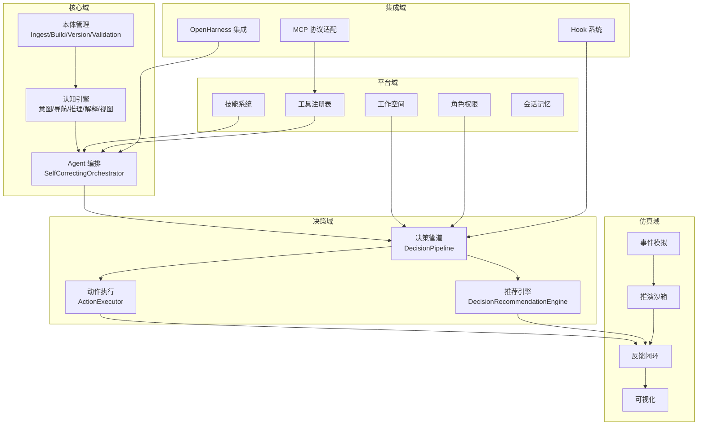

**章节来源**
- [odap/biz/core/__init__.py:1-16](file://odap/biz/core/__init__.py#L1-L16)
- [odap/biz/decision/__init__.py:1-19](file://odap/biz/decision/__init__.py#L1-L19)
- [odap/biz/platform/__init__.py:1-29](file://odap/biz/platform/__init__.py#L1-L29)
- [odap/biz/integration/__init__.py:1-29](file://odap/biz/integration/__init__.py#L1-L29)
- [odap/biz/simulation/__init__.py:1-29](file://odap/biz/simulation/__init__.py#L1-L29)

## 核心组件
- 本体管理：提供入湖、构建、版本管理与校验服务，支撑知识抽取与推理。
- 认知引擎：完成用户意图解析、知识检索与导航、推理链追踪、解释生成与角色视图。
- Agent 编排：根据用户角色与查询，路由到合适技能并进行权限校验与执行。
- 决策推荐：基于分析结果生成候选方案，评估优先级与风险，结合策略校验输出推荐。
- 决策管道：串联理解、决策、策略校验、执行与反馈，形成闭环。
- 动作执行：对推荐动作进行参数校验、OPA 权限检查、图谱写回与回写通知。
- 工具注册表：统一注册与发现 Skill/MCP/REST/Function，支持语义发现、健康监控与工具链。
- OpenHarness 集成：桥接外部 Agent 平台能力，统一内存、权限与工具适配。
- Hook 系统：事件钩子与增强编排，支持前置/后置钩子与增强执行器。
- 仿真系统：事件模拟与推演沙箱，配合反馈闭环与可视化。

**章节来源**
- [odap/biz/core/ontology/__init__.py:1-19](file://odap/biz/core/ontology/__init__.py#L1-L19)
- [odap/biz/core/cognition/user_cognition_engine.py:1-800](file://odap/biz/core/cognition/user_cognition_engine.py#L1-L800)
- [odap/biz/core/agent/orchestrator.py:1-151](file://odap/biz/core/agent/orchestrator.py#L1-L151)
- [odap/biz/decision/decision_recommendation/engine.py:1-603](file://odap/biz/decision/decision_recommendation/engine.py#L1-L603)
- [odap/biz/decision/decision_pipeline/pipeline.py:1-283](file://odap/biz/decision/decision_pipeline/pipeline.py#L1-L283)
- [odap/biz/decision/action_service/executor.py:1-297](file://odap/biz/decision/action_service/executor.py#L1-L297)
- [odap/biz/platform/tool_registry/registry.py:1-800](file://odap/biz/platform/tool_registry/registry.py#L1-L800)
- [odap/biz/integration/mcp_adapter/__init__.py:1-8](file://odap/biz/integration/mcp_adapter/__init__.py#L1-L8)
- [odap/biz/integration/hook_system/__init__.py:1-8](file://odap/biz/integration/hook_system/__init__.py#L1-L8)

## 架构总览
ODAP 的业务架构以“理解—决策—执行—反馈”为主线，结合本体与认知能力，形成可解释、可观测、可治理的闭环。

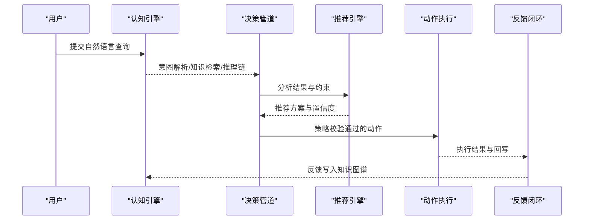

**图示来源**
- [odap/biz/core/cognition/user_cognition_engine.py:787-800](file://odap/biz/core/cognition/user_cognition_engine.py#L787-L800)
- [odap/biz/decision/decision_pipeline/pipeline.py:64-139](file://odap/biz/decision/decision_pipeline/pipeline.py#L64-L139)
- [odap/biz/decision/decision_recommendation/engine.py:63-123](file://odap/biz/decision/decision_recommendation/engine.py#L63-L123)
- [odap/biz/decision/action_service/executor.py:48-92](file://odap/biz/decision/action_service/executor.py#L48-L92)

## 详细组件分析

### 本体管理
- 入湖服务：负责原始数据接入与清洗，为后续构建提供高质量数据源。
- 构建服务：将结构化/半结构化数据映射为本体图谱，建立实体、属性与关系。
- 版本管理：记录本体版本与变更，支持回溯与一致性校验。
- 校验服务：对本体重构与更新进行一致性、完整性与冲突检测。

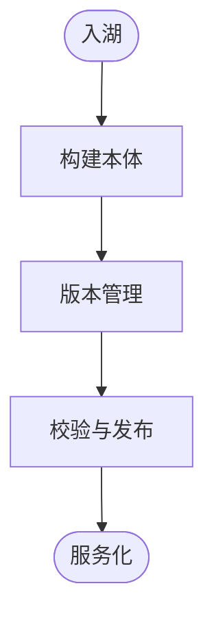

**图示来源**
- [odap/biz/core/ontology/__init__.py:3-18](file://odap/biz/core/ontology/__init__.py#L3-L18)

**章节来源**
- [odap/biz/core/ontology/__init__.py:1-19](file://odap/biz/core/ontology/__init__.py#L1-L19)

### 认知引擎
- 意图识别：基于规则与关键词识别用户意图类型与实体，输出解析结果。
- 知识导航：支持图谱检索与拓扑邻居探索，返回相关实体与上下文。
- 推理链追踪：构建推理步骤序列，支持可视化与解释生成。
- 解释引擎：针对“为什么”类问题生成可追溯的解释与替代方案。
- 角色视图：为不同角色提供定制化的界面布局与过滤器。

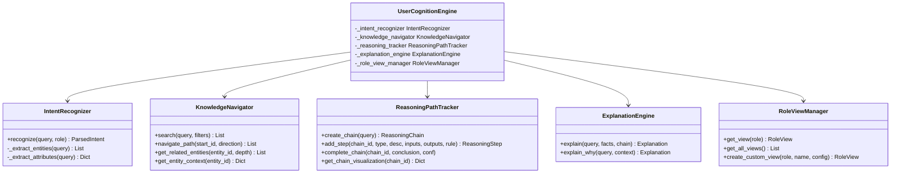

**图示来源**
- [odap/biz/core/cognition/user_cognition_engine.py:140-786](file://odap/biz/core/cognition/user_cognition_engine.py#L140-L786)

**章节来源**
- [odap/biz/core/cognition/user_cognition_engine.py:1-800](file://odap/biz/core/cognition/user_cognition_engine.py#L1-L800)

### Agent 系统
- 自校正编排器：解析用户查询，路由到技能目录，执行前进行权限校验，捕获异常并返回结果。
- 技能目录：集中管理可执行能力，支持按角色与场景动态选择。

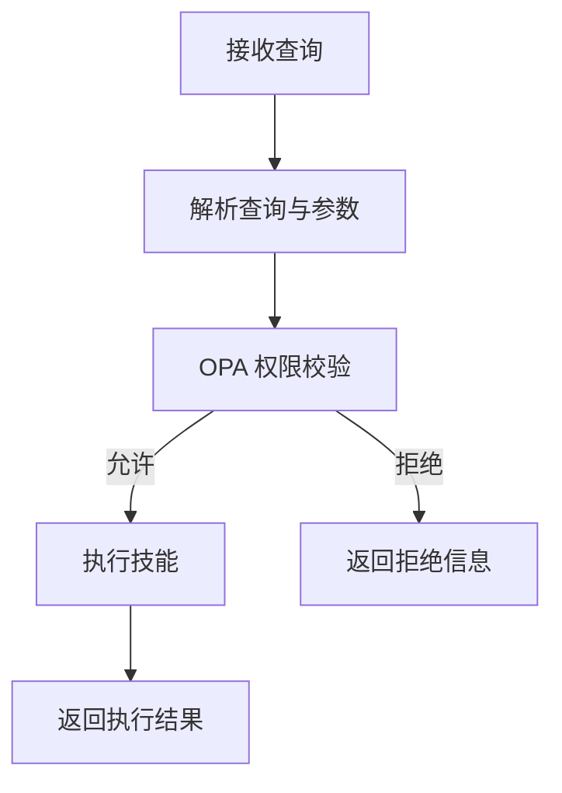

**图示来源**
- [odap/biz/core/agent/orchestrator.py:33-62](file://odap/biz/core/agent/orchestrator.py#L33-L62)

**章节来源**
- [odap/biz/core/agent/orchestrator.py:1-151](file://odap/biz/core/agent/orchestrator.py#L1-L151)

### 决策推荐引擎
- 输入：分析结果、上下文与约束
- 处理：生成候选方案、评估优先级与风险、策略校验、排序与理由生成
- 输出：推荐方案、置信度、风险评估与证据

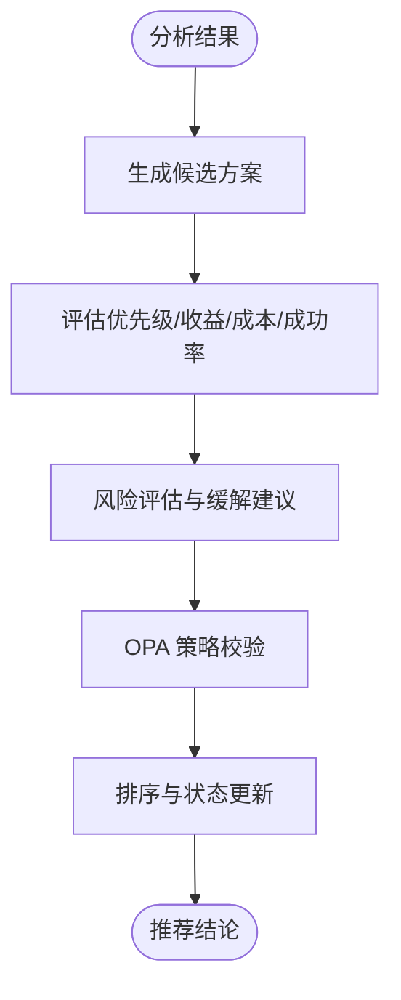

**图示来源**
- [odap/biz/decision/decision_recommendation/engine.py:63-123](file://odap/biz/decision/decision_recommendation/engine.py#L63-L123)
- [odap/biz/decision/decision_recommendation/engine.py:197-221](file://odap/biz/decision/decision_recommendation/engine.py#L197-L221)
- [odap/biz/decision/decision_recommendation/engine.py:351-395](file://odap/biz/decision/decision_recommendation/engine.py#L351-L395)

**章节来源**
- [odap/biz/decision/decision_recommendation/engine.py:1-603](file://odap/biz/decision/decision_recommendation/engine.py#L1-L603)

### 决策管道
- 管道阶段：理解、决策、策略校验、执行、反馈
- 容错策略：失败阶段标记、降级决策、OPA fail-closed
- 与动作执行：仅在推荐且策略通过时执行

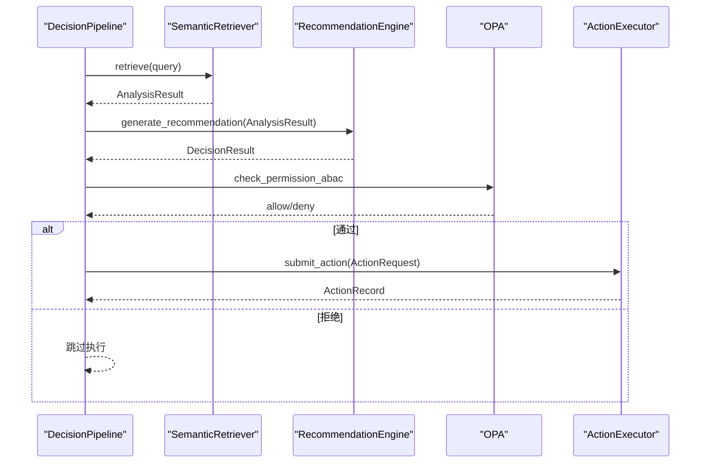

**图示来源**
- [odap/biz/decision/decision_pipeline/pipeline.py:64-139](file://odap/biz/decision/decision_pipeline/pipeline.py#L64-L139)
- [odap/biz/decision/decision_pipeline/pipeline.py:232-255](file://odap/biz/decision/decision_pipeline/pipeline.py#L232-L255)
- [odap/biz/decision/action_service/executor.py:48-92](file://odap/biz/decision/action_service/executor.py#L48-L92)

**章节来源**
- [odap/biz/decision/decision_pipeline/pipeline.py:1-283](file://odap/biz/decision/decision_pipeline/pipeline.py#L1-L283)

### 动作执行
- 参数校验：必填参数与目标类型匹配
- OPA 校验：ABAC 权限检查，fail-closed
- 执行与回写：图谱写回、Webhook 或自定义回写器
- 反馈闭环：执行完成后触发反馈回路

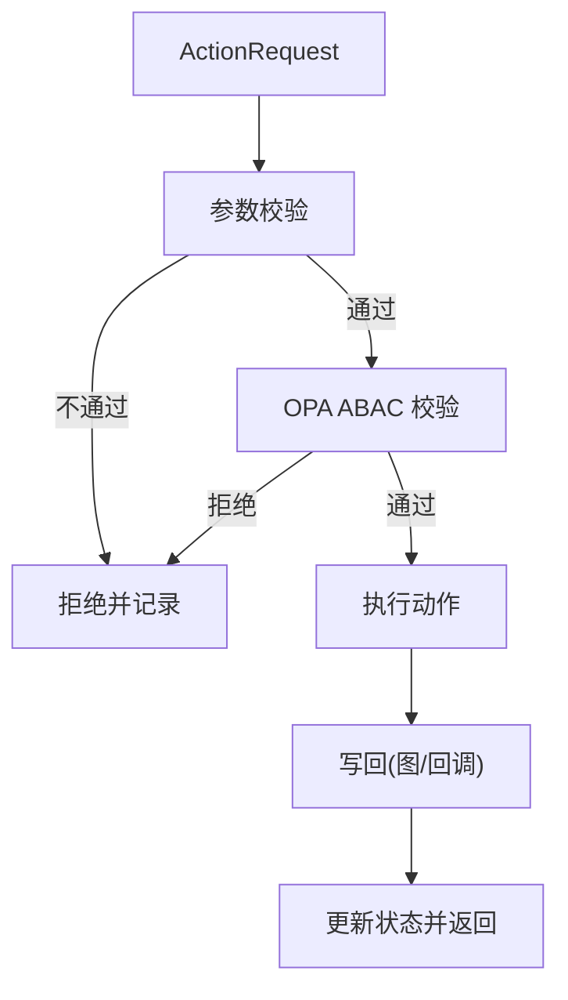

**图示来源**
- [odap/biz/decision/action_service/executor.py:103-137](file://odap/biz/decision/action_service/executor.py#L103-L137)
- [odap/biz/decision/action_service/executor.py:177-245](file://odap/biz/decision/action_service/executor.py#L177-L245)
- [odap/biz/decision/action_service/executor.py:247-286](file://odap/biz/decision/action_service/executor.py#L247-L286)

**章节来源**
- [odap/biz/decision/action_service/executor.py:1-297](file://odap/biz/decision/action_service/executor.py#L1-L297)

### 平台服务
- 工作空间：隔离与资源边界，支持多租户场景
- 角色权限：基于 OPA 的策略治理，支持热生效
- 技能系统：技能注册、执行与版本管理
- 工具注册表：统一注册 Skill/MCP/REST/Function，语义发现、健康监控、工具链与 OPA 权限桥接

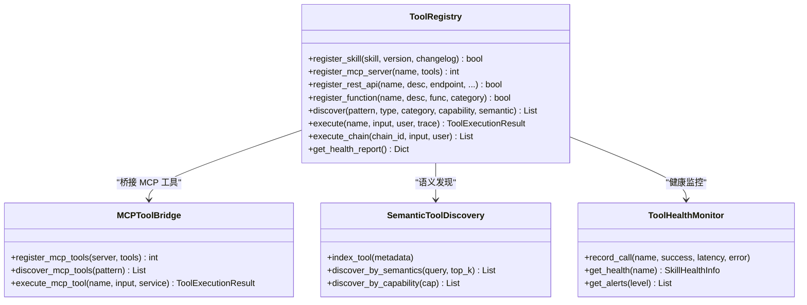

**图示来源**
- [odap/biz/platform/tool_registry/registry.py:403-800](file://odap/biz/platform/tool_registry/registry.py#L403-L800)

**章节来源**
- [odap/biz/platform/tool_registry/registry.py:1-800](file://odap/biz/platform/tool_registry/registry.py#L1-L800)
- [odap/biz/platform/workspace/__init__.py:1-10](file://odap/biz/platform/workspace/__init__.py#L1-L10)

### 集成服务
- OpenHarness 集成：统一网关、内存适配、权限后端、工具适配与 v2 适配器
- MCP 协议适配：MCPService 对外暴露工具能力，支持工具桥接与执行
- Hook 系统：事件钩子与增强执行器，支持前置/后置钩子与增强流程

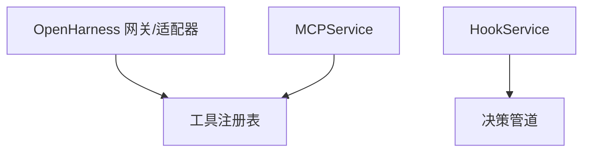

**图示来源**
- [odap/biz/integration/__init__.py:1-29](file://odap/biz/integration/__init__.py#L1-L29)
- [odap/biz/integration/mcp_adapter/__init__.py:1-8](file://odap/biz/integration/mcp_adapter/__init__.py#L1-L8)
- [odap/biz/integration/hook_system/__init__.py:1-8](file://odap/biz/integration/hook_system/__init__.py#L1-L8)

**章节来源**
- [odap/biz/integration/__init__.py:1-29](file://odap/biz/integration/__init__.py#L1-L29)
- [odap/biz/integration/mcp_adapter/__init__.py:1-8](file://odap/biz/integration/mcp_adapter/__init__.py#L1-L8)
- [odap/biz/integration/hook_system/__init__.py:1-8](file://odap/biz/integration/hook_system/__init__.py#L1-L8)

### 仿真系统
- 事件模拟：构造仿真事件，驱动系统行为
- 推演沙箱：隔离执行环境，保障安全与可重复
- 反馈闭环：将执行结果写回知识图谱，形成学习闭环
- 可视化：实时展示推演过程与结果

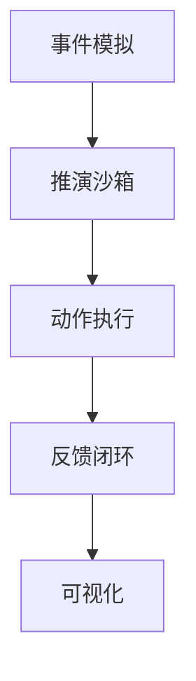

**图示来源**
- [odap/biz/simulation/__init__.py:1-29](file://odap/biz/simulation/__init__.py#L1-L29)

**章节来源**
- [odap/biz/simulation/__init__.py:1-29](file://odap/biz/simulation/__init__.py#L1-L29)

## 依赖分析
- 模块内聚：各域内部职责清晰，跨域通过统一接口与服务化能力耦合
- 外部依赖：OPA 策略管理、Graphiti 图谱服务、MCP 工具服务、SQLite 存储
- 循环依赖：当前设计避免循环导入，通过延迟导入与工厂方法降低耦合

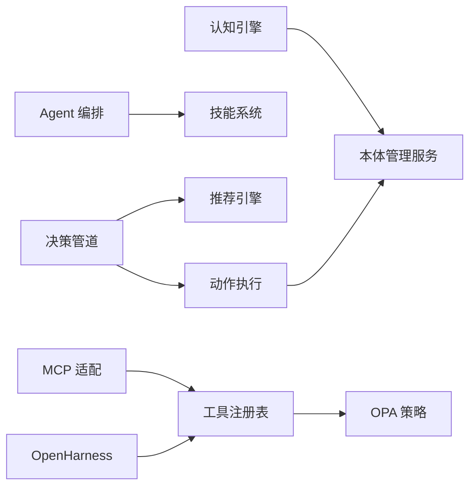

**图示来源**
- [odap/biz/decision/decision_pipeline/pipeline.py:24-62](file://odap/biz/decision/decision_pipeline/pipeline.py#L24-L62)
- [odap/biz/decision/action_service/executor.py:38-46](file://odap/biz/decision/action_service/executor.py#L38-L46)
- [odap/biz/platform/tool_registry/registry.py:414-420](file://odap/biz/platform/tool_registry/registry.py#L414-L420)

**章节来源**
- [odap/biz/decision/decision_pipeline/pipeline.py:1-283](file://odap/biz/decision/decision_pipeline/pipeline.py#L1-L283)
- [odap/biz/decision/action_service/executor.py:1-297](file://odap/biz/decision/action_service/executor.py#L1-L297)
- [odap/biz/platform/tool_registry/registry.py:1-800](file://odap/biz/platform/tool_registry/registry.py#L1-L800)

## 性能考量
- 异步与并发：推荐引擎与动作执行支持异步处理，减少阻塞
- 缓存与索引：知识导航与工具注册表具备缓存与语义索引，提升检索效率
- 健康监控：工具健康监控记录错误率与平均耗时，及时预警
- 策略校验：OPA 校验采用 fail-closed，确保安全边界

[本节为通用指导，无需具体文件分析]

## 故障排查指南
- 决策管道失败：检查理解阶段异常、推荐引擎降级、OPA 校验失败与执行异常
- 动作执行失败：核对参数校验、OPA 权限、图谱写回与回写器配置
- 工具执行失败：查看工具健康报告、告警列表与执行历史
- OpenHarness/MCP 集成问题：确认网关路由、内存适配与工具桥接状态

**章节来源**
- [odap/biz/decision/decision_pipeline/pipeline.py:82-85](file://odap/biz/decision/decision_pipeline/pipeline.py#L82-L85)
- [odap/biz/decision/action_service/executor.py:85-91](file://odap/biz/decision/action_service/executor.py#L85-L91)
- [odap/biz/platform/tool_registry/registry.py:719-740](file://odap/biz/platform/tool_registry/registry.py#L719-L740)

## 结论
ODAP 业务领域服务以“本体—认知—Agent—决策—执行—反馈”为主线，结合平台化能力与集成服务，形成可解释、可观测、可治理的闭环体系。通过统一的工具注册表与 OpenHarness/MCP 集成，平台实现了对多源工具的统一管理与高效调度；通过决策管道与动作执行的策略校验，确保安全可控的自动化执行；通过仿真系统与反馈闭环，持续优化推荐质量与执行效果。

[本节为总结性内容，无需具体文件分析]

## 附录
- 开发者指南要点
  - 新增技能：通过技能注册接口与版本管理，确保可追溯与可回滚
  - 新增工具：统一注册到工具注册表，配置语义标签与能力，启用健康监控
  - 新增动作：在 OMS 中定义动作类型与参数约束，配置 OPA 策略与回写器
  - 新增推荐：扩展推荐引擎评估模型与证据检索，完善理由生成
  - 新增仿真：定义事件与沙箱规则，接入反馈闭环与可视化

[本节为通用指导，无需具体文件分析]