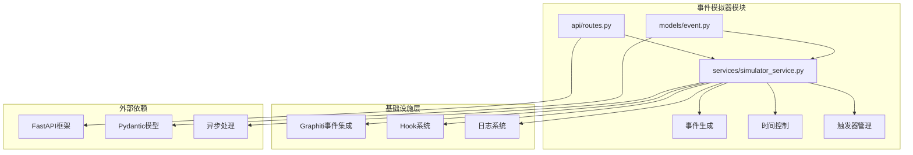
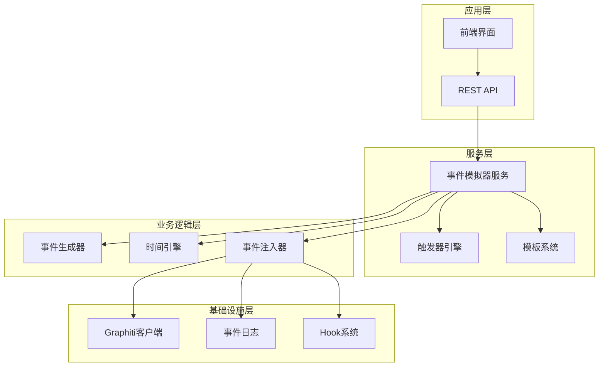
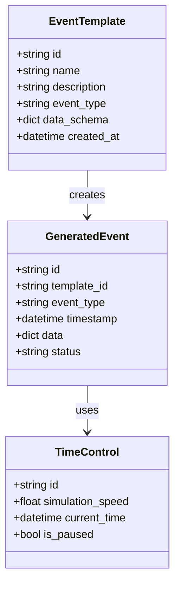
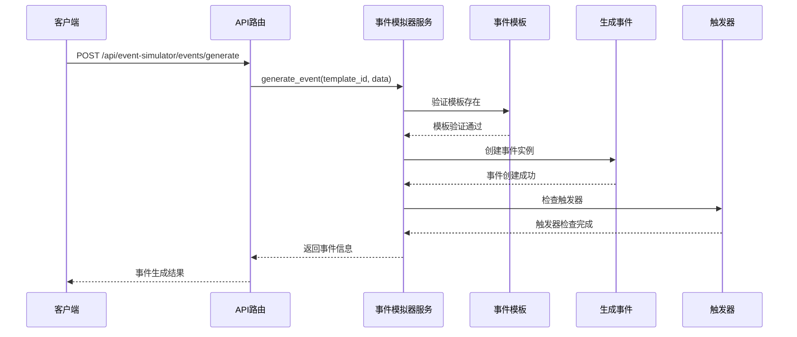
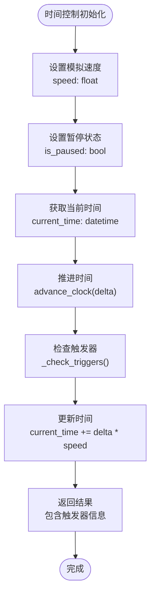
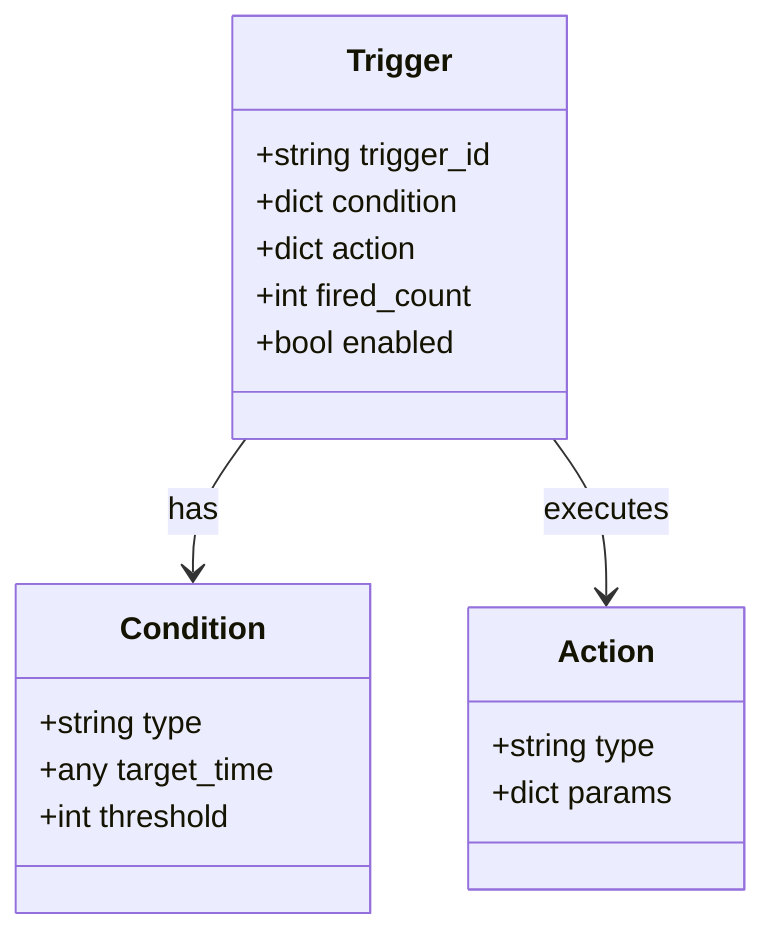
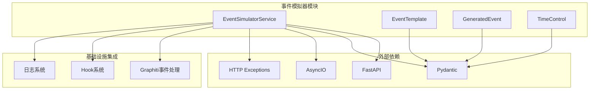

# 事件模拟器

<cite>
**本文档引用的文件**
- [DESIGN.md](file://docs/03-modules/event_simulator/DESIGN.md)
- [event.py](file://odap/biz/simulation/event_simulator/models/event.py)
- [simulator_service.py](file://odap/biz/simulation/event_simulator/services/simulator_service.py)
- [routes.py](file://odap/biz/simulation/event_simulator/api/routes.py)
- [test_event_simulator.py](file://tests/unit/test_event_simulator.py)
- [graphiti_events.py](file://odap/infra/logging/graphiti_events.py)
- [hook_system.py](file://odap/infra/events/hook_system.py)
- [__init__.py](file://odap/biz/simulation/__init__.py)
</cite>

## 目录
1. [简介](#简介)
2. [项目结构](#项目结构)
3. [核心组件](#核心组件)
4. [架构概览](#架构概览)
5. [详细组件分析](#详细组件分析)
6. [依赖关系分析](#依赖关系分析)
7. [性能考虑](#性能考虑)
8. [故障排除指南](#故障排除指南)
9. [结论](#结论)
10. [附录](#附录)

## 简介

事件模拟器是 ODAP 平台的场景驱动引擎，负责自动/手动生成模拟事件并注入到知识图谱中，驱动本体状态演化。它是"推演"的前端——模拟器生成"发生了什么"，推演引擎分析"这意味着什么"和"该怎么做"。

### 核心价值

| 维度 | 价值 | 说明 |
|------|------|------|
| **场景驱动** | 自动生成事件 | 按剧本/模板自动生成事件序列，驱动态势演化 |
| **可控注入** | 手动干预 | 支持手动注入关键事件（如突发打击） |
| **时间控制** | 加速/减速/暂停 | 模拟时钟独立于系统时钟，支持时间加速 |
| **模板复用** | 事件模板 | 预定义事件模板，一键生成标准事件序列 |
| **真实感** | 随机变异 | 事件参数支持随机扰动，避免机械重复 |

## 项目结构

事件模拟器模块位于 ODAP 平台的仿真领域中，采用清晰的分层架构设计：



**图表来源**
- [event.py:1-36](file://odap/biz/simulation/event_simulator/models/event.py#L1-L36)
- [simulator_service.py:1-134](file://odap/biz/simulation/event_simulator/services/simulator_service.py#L1-L134)
- [routes.py:1-69](file://odap/biz/simulation/event_simulator/api/routes.py#L1-L69)

**章节来源**
- [__init__.py:1-29](file://odap/biz/simulation/__init__.py#L1-L29)

## 核心组件

事件模拟器采用模块化设计，包含以下核心组件：

### 数据模型层
- **事件模板**：定义事件的结构和约束
- **生成事件**：实际生成的事件实例
- **时间控制**：模拟时钟管理

### 服务层
- **事件模拟器服务**：核心业务逻辑实现
- **事件生成器**：负责事件的创建和管理
- **触发器系统**：条件触发机制

### API层
- **RESTful API**：对外提供的接口服务
- **路由管理**：请求处理和响应格式化

**章节来源**
- [event.py:10-36](file://odap/biz/simulation/event_simulator/models/event.py#L10-L36)
- [simulator_service.py:9-134](file://odap/biz/simulation/event_simulator/services/simulator_service.py#L9-L134)

## 架构概览

事件模拟器采用分层架构，确保关注点分离和模块化设计：



**图表来源**
- [DESIGN.md:28-43](file://docs/03-modules/event_simulator/DESIGN.md#L28-L43)
- [routes.py:1-69](file://odap/biz/simulation/event_simulator/api/routes.py#L1-L69)

## 详细组件分析

### 事件模型设计

事件模拟器采用强类型设计，确保数据完整性和一致性：

#### 事件类型定义


**图表来源**
- [event.py:10-36](file://odap/biz/simulation/event_simulator/models/event.py#L10-L36)

#### 事件生成流程


**图表来源**
- [routes.py:35-42](file://odap/biz/simulation/event_simulator/api/routes.py#L35-L42)
- [simulator_service.py:47-66](file://odap/biz/simulation/event_simulator/services/simulator_service.py#L47-L66)

**章节来源**
- [event.py:10-36](file://odap/biz/simulation/event_simulator/models/event.py#L10-L36)
- [simulator_service.py:18-66](file://odap/biz/simulation/event_simulator/services/simulator_service.py#L18-L66)

### 时间控制系统

时间控制是事件模拟器的核心特性之一，提供灵活的时间管理机制：

#### 时间控制机制


**图表来源**
- [simulator_service.py:78-104](file://odap/biz/simulation/event_simulator/services/simulator_service.py#L78-L104)

#### 触发器系统


**图表来源**
- [simulator_service.py:106-134](file://odap/biz/simulation/event_simulator/services/simulator_service.py#L106-L134)

**章节来源**
- [simulator_service.py:78-134](file://odap/biz/simulation/event_simulator/services/simulator_service.py#L78-L134)

### API 接口设计

事件模拟器提供完整的 RESTful API 接口：

| 方法 | 路径 | 描述 | 权限 |
|------|------|------|------|
| POST | /api/event-simulator/templates | 创建事件模板 | simulation:template:create |
| GET | /api/event-simulator/templates | 列出事件模板 | simulation:template:list |
| POST | /api/event-simulator/events/generate | 生成事件 | simulation:event:generate |
| GET | /api/event-simulator/events | 获取事件列表 | simulation:event:list |
| POST | /api/event-simulator/time-control | 设置时间控制 | simulation:time:control |
| GET | /api/event-simulator/time-control | 获取时间控制 | simulation:time:read |

**章节来源**
- [routes.py:12-69](file://odap/biz/simulation/event_simulator/api/routes.py#L12-L69)

## 依赖关系分析

事件模拟器模块具有清晰的依赖关系，遵循依赖倒置原则：



**图表来源**
- [routes.py:3-6](file://odap/biz/simulation/event_simulator/api/routes.py#L3-L6)
- [simulator_service.py:3-7](file://odap/biz/simulation/event_simulator/services/simulator_service.py#L3-L7)

**章节来源**
- [graphiti_events.py:1-282](file://odap/infra/logging/graphiti_events.py#L1-L282)
- [hook_system.py:1-428](file://odap/infra/events/hook_system.py#L1-L428)

## 性能考虑

事件模拟器在设计时充分考虑了性能要求：

### 性能指标
- **事件生成吞吐**：> 100 events/s
- **注入延迟**：< 100ms/event  
- **时间精度**：毫秒级
- **最大时间缩放**：100x
- **并发场景**：> 10
- **可靠性**：注入可回滚

### 优化策略
1. **异步处理**：使用 asyncio 提高并发性能
2. **批量操作**：支持批量事件生成和注入
3. **内存管理**：合理控制事件缓存大小
4. **触发器优化**：高效的触发器检查机制
5. **时间控制**：独立的模拟时钟减少系统时钟依赖

## 故障排除指南

### 常见问题及解决方案

#### 模板相关问题
- **问题**：模板不存在
- **原因**：模板ID错误或模板已被删除
- **解决**：验证模板ID有效性，重新创建模板

#### 事件生成问题
- **问题**：事件生成失败
- **原因**：模板验证失败或数据格式不正确
- **解决**：检查模板schema，验证事件数据格式

#### 时间控制问题
- **问题**：时间推进异常
- **原因**：模拟速度设置不当或暂停状态异常
- **解决**：重置时间控制参数，检查触发器状态

**章节来源**
- [test_event_simulator.py:13-206](file://tests/unit/test_event_simulator.py#L13-L206)

## 结论

事件模拟器模块为 ODAP 平台提供了强大的场景驱动能力，通过模块化设计和清晰的分层架构，实现了高度的可扩展性和可维护性。其核心特性包括：

1. **灵活的事件模型**：支持多种事件类型和复杂的事件效果
2. **强大的时间控制**：提供精确的时间管理和加速/减速功能
3. **智能触发机制**：基于条件的事件触发系统
4. **完善的 API 接口**：RESTful API 支持完整的事件生命周期管理
5. **可靠的基础设施集成**：与 Graphiti 和 Hook 系统深度集成

该模块为仿真分析师提供了完整的事件模拟工具，支持从简单的事件生成到复杂场景驱动的全方位需求。

## 附录

### 使用示例

#### 创建事件模板
```bash
curl -X POST "/api/event-simulator/templates" \
  -H "Content-Type: application/json" \
  -d '{
    "name": "threat_alert",
    "event_type": "threat",
    "description": "威胁检测事件",
    "schema": {
      "severity": {"type": "string"},
      "location": {"type": "object"}
    }
  }'
```

#### 生成事件
```bash
curl -X POST "/api/event-simulator/events/generate" \
  -H "Content-Type: application/json" \
  -d '{
    "template_id": "TEMPLATE_ID",
    "data": {
      "severity": "high",
      "location": {"lat": 39.9, "lng": 116.4}
    }
  }'
```

#### 设置时间控制
```bash
curl -X POST "/api/event-simulator/time-control" \
  -H "Content-Type: application/json" \
  -d '{
    "speed": 10.0,
    "is_paused": false
  }'
```

### 最佳实践

1. **模板设计**：合理设计事件模板，确保数据结构的完整性和一致性
2. **触发器配置**：谨慎配置触发器，避免过度触发导致系统过载
3. **时间管理**：根据场景需求合理设置模拟速度，平衡性能和准确性
4. **监控告警**：建立完善的监控体系，及时发现和处理异常情况
5. **测试验证**：充分测试事件模拟器的各项功能，确保系统的稳定性