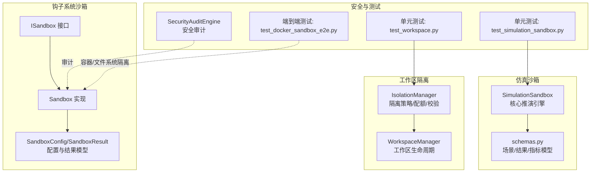
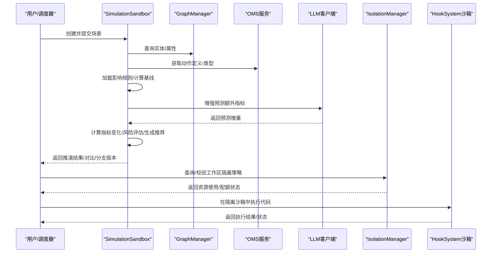
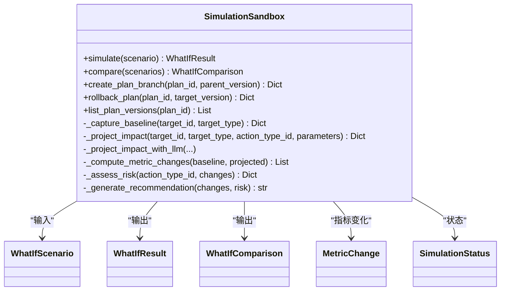
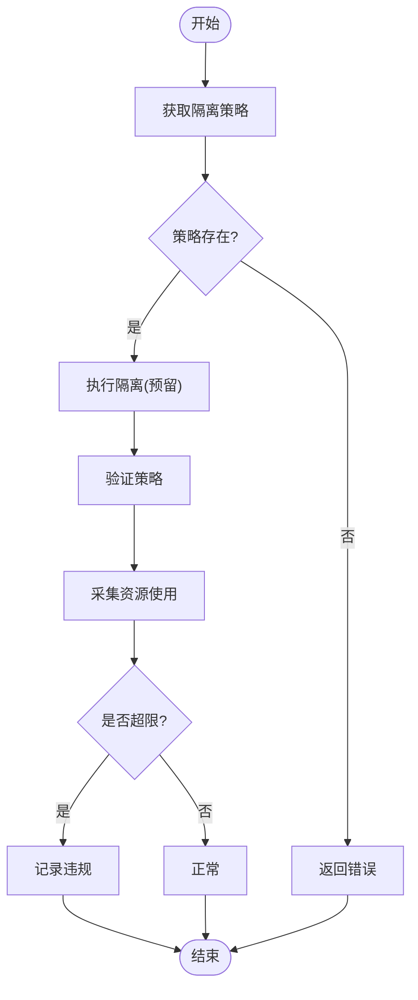
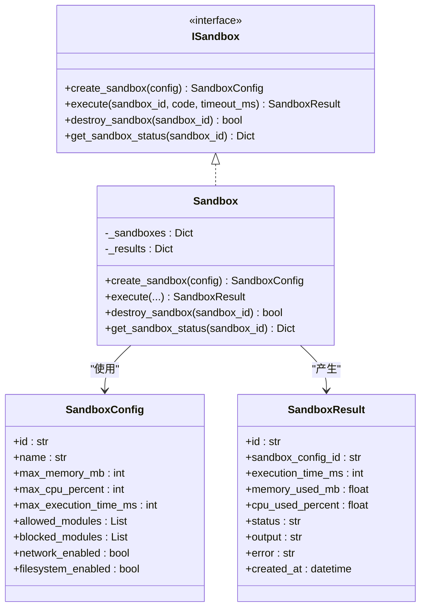
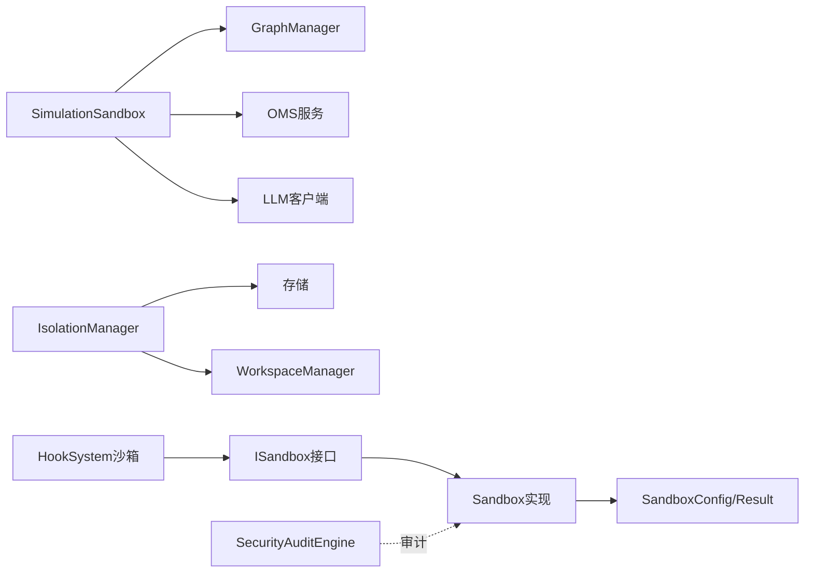

# 仿真沙箱

<cite>
**本文引用的文件**
- [sandbox.py](file://odap/biz/simulation/simulation_sandbox/sandbox.py)
- [schemas.py](file://odap/biz/simulation/simulation_sandbox/schemas.py)
- [isolation.py](file://odap/biz/platform/workspace/impl/isolation.py)
- [workspace.py](file://odap/biz/platform/workspace/impl/workspace.py)
- [models.sandbox.py](file://odap/biz/integration/hook_system/models/sandbox.py)
- [interfaces.sandbox.py](file://odap/biz/integration/hook_system/interfaces/sandbox.py)
- [impl.sandbox.py](file://odap/biz/integration/hook_system/impl/sandbox.py)
- [test_simulation_sandbox.py](file://tests/unit/test_simulation_sandbox.py)
- [test_workspace.py](file://tests/unit/test_workspace.py)
- [test_docker_sandbox_e2e.py](file://openharness/scripts/test_docker_sandbox_e2e.py)
- [security_audit.py](file://odap/infra/security/security_audit.py)
</cite>

## 目录
1. [引言](#引言)
2. [项目结构](#项目结构)
3. [核心组件](#核心组件)
4. [架构总览](#架构总览)
5. [详细组件分析](#详细组件分析)
6. [依赖分析](#依赖分析)
7. [性能考虑](#性能考虑)
8. [故障排查指南](#故障排查指南)
9. [结论](#结论)
10. [附录](#附录)

## 引言
本技术文档聚焦于“仿真沙箱”模块，围绕两类能力展开：其一为“仿真沙箱”，用于在受控环境中对军事行动进行推演与风险评估；其二为“工作区隔离与资源配额”，用于保障多租户工作区的资源边界与运行安全。文档将系统性阐述隔离机制（进程、网络、文件系统）、资源管理（CPU、内存、磁盘、网络带宽）、安全控制（权限、审计、恶意行为检测）、状态持久化（快照/分支/回滚）、配置参数、性能监控指标与故障恢复策略，并提供面向系统管理员的部署与运维指南。

## 项目结构
仿真沙箱相关代码主要分布在如下位置：
- 仿真沙箱核心逻辑与推演流程：odap/biz/simulation/simulation_sandbox
- 工作区隔离与资源配额：odap/biz/platform/workspace/impl/isolation.py
- 钩子系统沙箱（可插拔的沙箱执行器）：odap/biz/integration/hook_system/impl/sandbox.py
- 安全审计与漏洞检测：odap/infra/security/security_audit.py
- 单元测试与端到端测试：tests/unit/test_simulation_sandbox.py、tests/unit/test_workspace.py、openharness/scripts/test_docker_sandbox_e2e.py

图示来源
- [sandbox.py:14-511](file://odap/biz/simulation/simulation_sandbox/sandbox.py#L14-L511)
- [schemas.py](file://odap/biz/simulation/simulation_sandbox/schemas.py)
- [isolation.py:9-112](file://odap/biz/platform/workspace/impl/isolation.py#L9-L112)
- [workspace.py](file://odap/biz/platform/workspace/impl/workspace.py)
- [interfaces.sandbox.py:8-30](file://odap/biz/integration/hook_system/interfaces/sandbox.py#L8-L30)
- [impl.sandbox.py:9-63](file://odap/biz/integration/hook_system/impl/sandbox.py#L9-L63)
- [models.sandbox.py:9-33](file://odap/biz/integration/hook_system/models/sandbox.py#L9-L33)
- [security_audit.py:298-324](file://odap/infra/security/security_audit.py#L298-L324)
- [test_simulation_sandbox.py:1-245](file://tests/unit/test_simulation_sandbox.py#L1-L245)
- [test_workspace.py:1-256](file://tests/unit/test_workspace.py#L1-L256)
- [test_docker_sandbox_e2e.py:287-325](file://openharness/scripts/test_docker_sandbox_e2e.py#L287-L325)

章节来源
- [sandbox.py:14-511](file://odap/biz/simulation/simulation_sandbox/sandbox.py#L14-L511)
- [isolation.py:9-112](file://odap/biz/platform/workspace/impl/isolation.py#L9-L112)
- [impl.sandbox.py:9-63](file://odap/biz/integration/hook_system/impl/sandbox.py#L9-L63)

## 核心组件
- 仿真沙箱（SimulationSandbox）
  - 负责构建基线、加载影响规则、调用LLM增强预测、计算指标变化、风险评估与推荐生成，并支持场景对比与计划分支/回滚。
  - 关键方法路径：[simulate:56-97](file://odap/biz/simulation/simulation_sandbox/sandbox.py#L56-L97)、[_project_impact:147-174](file://odap/biz/simulation/simulation_sandbox/sandbox.py#L147-L174)、[_compute_metric_changes:324-346](file://odap/biz/simulation/simulation_sandbox/sandbox.py#L324-L346)、[_assess_risk:348-378](file://odap/biz/simulation/simulation_sandbox/sandbox.py#L348-L378)、[_generate_recommendation:428-440](file://odap/biz/simulation/simulation_sandbox/sandbox.py#L428-L440)、[create_plan_branch:187-206](file://odap/biz/simulation/simulation_sandbox/sandbox.py#L187-L206)、[rollback_plan:208-225](file://odap/biz/simulation/simulation_sandbox/sandbox.py#L208-L225)。
- 工作区隔离（IsolationManager）
  - 提供隔离策略的创建、查询、更新、强制执行与验证；提供资源使用采集与配额违规检查；为工作区提供资源边界与网络策略。
  - 关键方法路径：[create_isolation_policy:15-31](file://odap/biz/platform/workspace/impl/isolation.py#L15-L31)、[get_isolation_policy:33-35](file://odap/biz/platform/workspace/impl/isolation.py#L33-L35)、[enforce_isolation:50-62](file://odap/biz/platform/workspace/impl/isolation.py#L50-L62)、[validate_isolation:64-80](file://odap/biz/platform/workspace/impl/isolation.py#L64-L80)、[get_resource_usage:82-93](file://odap/biz/platform/workspace/impl/isolation.py#L82-L93)、[check_quota_violation:95-112](file://odap/biz/platform/workspace/impl/isolation.py#L95-L112)。
- 钩子系统沙箱（Sandbox）
  - 提供可插拔的沙箱执行器，支持创建/销毁沙箱、执行代码、查询状态；配置项包含内存/CPU/执行时长/模块白名单/网络/文件系统开关。
  - 关键方法路径：[create_sandbox:16-19](file://odap/biz/integration/hook_system/impl/sandbox.py#L16-L19)、[execute:21-40](file://odap/biz/integration/hook_system/impl/sandbox.py#L21-L40)、[destroy_sandbox:42-47](file://odap/biz/integration/hook_system/impl/sandbox.py#L42-L47)、[get_sandbox_status:49-62](file://odap/biz/integration/hook_system/impl/sandbox.py#L49-L62)。
- 安全审计（SecurityAuditEngine）
  - 提供OWASP Top 10等安全检查能力，可用于对注入类、CORS等漏洞进行扫描与报告生成。
  - 关键方法路径：[audit_code:311-321](file://odap/infra/security/security_audit.py#L311-L321)、[OWASPTop10Checker:298-324](file://odap/infra/security/security_audit.py#L298-L324)。

章节来源
- [sandbox.py:14-511](file://odap/biz/simulation/simulation_sandbox/sandbox.py#L14-L511)
- [isolation.py:9-112](file://odap/biz/platform/workspace/impl/isolation.py#L9-L112)
- [impl.sandbox.py:9-63](file://odap/biz/integration/hook_system/impl/sandbox.py#L9-L63)
- [security_audit.py:298-324](file://odap/infra/security/security_audit.py#L298-L324)

## 架构总览
仿真沙箱由“场景建模—基线采集—规则/LLM预测—指标变化—风险评估—推荐生成—计划分支/回滚”构成闭环；工作区隔离负责在资源与网络层面提供边界；钩子系统沙箱提供可插拔的执行环境；安全审计贯穿代码与配置环节。

图示来源
- [sandbox.py:56-97](file://odap/biz/simulation/simulation_sandbox/sandbox.py#L56-L97)
- [isolation.py:64-80](file://odap/biz/platform/workspace/impl/isolation.py#L64-L80)
- [impl.sandbox.py:21-40](file://odap/biz/integration/hook_system/impl/sandbox.py#L21-L40)

## 详细组件分析

### 仿真沙箱（SimulationSandbox）
- 场景与结果模型
  - 场景输入：场景ID、名称、描述、目标对象ID/类型、动作类型ID、参数、变体参数等。
  - 结果输出：基线指标、预测指标、指标变化、风险评估、推荐、置信度等。
  - 参考路径：[schemas.py](file://odap/biz/simulation/simulation_sandbox/schemas.py)。
- 基线采集与影响规则
  - 通过图谱查询目标实体属性，结合本体动作定义加载默认或自定义影响规则。
  - 规则来源：[schemas.py](file://odap/biz/simulation/simulation_sandbox/schemas.py)、[sandbox.py:121-174](file://odap/biz/simulation/simulation_sandbox/sandbox.py#L121-L174)。
- LLM增强预测
  - 使用提示词驱动LLM识别规则未覆盖的间接影响与连锁反应，返回JSON格式的额外指标影响系数。
  - 参考路径：[sandbox.py:230-283](file://odap/biz/simulation/simulation_sandbox/sandbox.py#L230-L283)。
- 指标变化与风险评估
  - 基于规则与LLM预测合成影响，计算变化量与最终值；按阈值判定风险等级与严重度。
  - 参考路径：[sandbox.py:324-378](file://odap/biz/simulation/simulation_sandbox/sandbox.py#L324-L378)。
- 推荐生成
  - 综合规则建议与LLM建议，输出简明中文建议文本。
  - 参考路径：[sandbox.py:428-500](file://odap/biz/simulation/simulation_sandbox/sandbox.py#L428-L500)。
- 计划分支与回滚
  - 支持为推演计划创建分支、列出版本、回滚至指定版本，便于探索不同参数组合与策略。
  - 参考路径：[sandbox.py:187-228](file://odap/biz/simulation/simulation_sandbox/sandbox.py#L187-L228)。

图示来源
- [sandbox.py:14-511](file://odap/biz/simulation/simulation_sandbox/sandbox.py#L14-L511)
- [schemas.py](file://odap/biz/simulation/simulation_sandbox/schemas.py)

章节来源
- [sandbox.py:14-511](file://odap/biz/simulation/simulation_sandbox/sandbox.py#L14-L511)
- [schemas.py](file://odap/biz/simulation/simulation_sandbox/schemas.py)

### 工作区隔离（IsolationManager）
- 策略管理
  - 创建/查询/更新隔离策略，策略包含隔离级别、资源配额、网络策略等。
  - 参考路径：[isolation.py:15-48](file://odap/biz/platform/workspace/impl/isolation.py#L15-L48)。
- 执行与验证
  - 强制执行隔离（预留对接底层隔离设施），验证策略有效性。
  - 参考路径：[isolation.py:50-80](file://odap/biz/platform/workspace/impl/isolation.py#L50-L80)。
- 资源使用与配额检查
  - 提供资源使用采集与配额违规检查（示例：CPU使用率阈值）。
  - 参考路径：[isolation.py:82-112](file://odap/biz/platform/workspace/impl/isolation.py#L82-L112)。

图示来源
- [isolation.py:50-112](file://odap/biz/platform/workspace/impl/isolation.py#L50-L112)

章节来源
- [isolation.py:9-112](file://odap/biz/platform/workspace/impl/isolation.py#L9-L112)

### 钩子系统沙箱（Sandbox）
- 配置模型
  - SandboxConfig：包含沙箱ID、名称、最大内存、CPU百分比、执行时长、允许/禁止模块列表、网络与文件系统开关等。
  - SandboxResult：包含执行耗时、内存/CPU使用、状态、输出、错误、创建时间等。
  - 参考路径：[models.sandbox.py:9-33](file://odap/biz/integration/hook_system/models/sandbox.py#L9-L33)。
- 接口与实现
  - ISandbox定义了创建、执行、销毁、查询状态等抽象方法；Sandbox提供具体实现。
  - 参考路径：[interfaces.sandbox.py:8-30](file://odap/biz/integration/hook_system/interfaces/sandbox.py#L8-L30)、[impl.sandbox.py:9-63](file://odap/biz/integration/hook_system/impl/sandbox.py#L9-L63)。

图示来源
- [interfaces.sandbox.py:8-30](file://odap/biz/integration/hook_system/interfaces/sandbox.py#L8-L30)
- [impl.sandbox.py:9-63](file://odap/biz/integration/hook_system/impl/sandbox.py#L9-L63)
- [models.sandbox.py:9-33](file://odap/biz/integration/hook_system/models/sandbox.py#L9-L33)

章节来源
- [interfaces.sandbox.py:8-30](file://odap/biz/integration/hook_system/interfaces/sandbox.py#L8-L30)
- [impl.sandbox.py:9-63](file://odap/biz/integration/hook_system/impl/sandbox.py#L9-L63)
- [models.sandbox.py:9-33](file://odap/biz/integration/hook_system/models/sandbox.py#L9-L33)

### 安全控制与审计
- 安全审计引擎
  - 提供OWASP Top 10检查器与审计报告生成，可用于扫描注入、CORS等高危问题。
  - 参考路径：[security_audit.py:298-324](file://odap/infra/security/security_audit.py#L298-L324)。
- 与沙箱集成
  - 建议在执行外部代码前进行安全审计，阻断高危代码进入沙箱执行。

章节来源
- [security_audit.py:298-324](file://odap/infra/security/security_audit.py#L298-L324)

## 依赖分析
- 组件耦合
  - SimulationSandbox依赖图谱服务与本体动作/类型定义，可选依赖LLM服务；与schemas紧密耦合。
  - IsolationManager依赖存储层以持久化策略；与WorkspaceManager共同维护工作区生命周期。
  - HookSystem沙箱通过接口解耦，便于替换不同后端（如Docker、Podman、Kubernetes）。
- 外部依赖
  - Docker/Podman容器运行时（端到端测试覆盖文件系统挂载与可写性）。
  - LLM服务（OpenAI兼容接口）用于增强预测与推荐。

图示来源
- [sandbox.py:23-54](file://odap/biz/simulation/simulation_sandbox/sandbox.py#L23-L54)
- [isolation.py:12-35](file://odap/biz/platform/workspace/impl/isolation.py#L12-L35)
- [impl.sandbox.py:9-63](file://odap/biz/integration/hook_system/impl/sandbox.py#L9-L63)
- [models.sandbox.py:9-33](file://odap/biz/integration/hook_system/models/sandbox.py#L9-L33)
- [security_audit.py:298-324](file://odap/infra/security/security_audit.py#L298-L324)

章节来源
- [sandbox.py:23-54](file://odap/biz/simulation/simulation_sandbox/sandbox.py#L23-L54)
- [isolation.py:12-35](file://odap/biz/platform/workspace/impl/isolation.py#L12-L35)
- [impl.sandbox.py:9-63](file://odap/biz/integration/hook_system/impl/sandbox.py#L9-L63)
- [models.sandbox.py:9-33](file://odap/biz/integration/hook_system/models/sandbox.py#L9-L33)
- [security_audit.py:298-324](file://odap/infra/security/security_audit.py#L298-L324)

## 性能考虑
- 推演性能
  - 基线采集与规则加载应尽量缓存；对LLM调用设置合理超时与并发限制，避免阻塞主线程。
  - 指标变化与风险评估为纯计算，复杂度与指标数量线性相关，建议批量处理与异步化。
- 资源配额
  - CPU/内存/磁盘/网络带宽应结合历史峰值与SLA设定动态阈值，定期校准。
- 沙箱执行
  - 严格限制执行时长与内存峰值，防止资源滥用；对IO密集型任务启用只读挂载与最小权限。
- 监控指标建议
  - CPU使用率、内存占用、磁盘IO、网络吞吐、执行耗时、错误率、队列长度、并发数。

## 故障排查指南
- 仿真沙箱
  - 症状：推演结果为空或异常
  - 排查：确认图谱查询是否返回目标实体；检查动作定义是否存在；验证LLM可用性与密钥配置。
  - 参考路径：[sandbox.py:121-174](file://odap/biz/simulation/simulation_sandbox/sandbox.py#L121-L174)、[test_simulation_sandbox.py:87-123](file://tests/unit/test_simulation_sandbox.py#L87-L123)。
- 工作区隔离
  - 症状：资源使用持续偏高或触发配额告警
  - 排查：核对隔离策略配置与实际执行环境；检查配额阈值与采集周期。
  - 参考路径：[isolation.py:82-112](file://odap/biz/platform/workspace/impl/isolation.py#L82-L112)、[test_workspace.py:239-255](file://tests/unit/test_workspace.py#L239-L255)。
- 钩子系统沙箱
  - 症状：执行超时或失败
  - 排查：检查沙箱配置（内存/CPU/时长）、模块白名单、网络/文件系统开关；查看执行日志与错误码。
  - 参考路径：[impl.sandbox.py:21-40](file://odap/biz/integration/hook_system/impl/sandbox.py#L21-L40)、[models.sandbox.py:22-33](file://odap/biz/integration/hook_system/models/sandbox.py#L22-L33)。
- 容器/文件系统隔离
  - 症状：宿主机文件泄露或不可写
  - 排查：参考端到端测试用例，验证只读挂载与可写挂载行为。
  - 参考路径：[test_docker_sandbox_e2e.py:287-325](file://openharness/scripts/test_docker_sandbox_e2e.py#L287-L325)。

章节来源
- [sandbox.py:121-174](file://odap/biz/simulation/simulation_sandbox/sandbox.py#L121-L174)
- [isolation.py:82-112](file://odap/biz/platform/workspace/impl/isolation.py#L82-L112)
- [impl.sandbox.py:21-40](file://odap/biz/integration/hook_system/impl/sandbox.py#L21-L40)
- [models.sandbox.py:22-33](file://odap/biz/integration/hook_system/models/sandbox.py#L22-L33)
- [test_docker_sandbox_e2e.py:287-325](file://openharness/scripts/test_docker_sandbox_e2e.py#L287-L325)

## 结论
仿真沙箱模块通过“规则+LLM”的双轨预测、严格的计划分支/回滚与工作区隔离策略，实现了可控、可观测、可追溯的推演闭环。结合安全审计与端到端测试，可有效降低运行风险并提升系统稳定性。建议在生产环境中进一步完善底层隔离设施对接、监控指标体系与自动化运维脚本。

## 附录

### 隔离与资源管理策略
- 进程隔离
  - 通过钩子系统沙箱限制执行时长与模块集，必要时接入容器运行时实现更强隔离。
  - 参考路径：[impl.sandbox.py:21-40](file://odap/biz/integration/hook_system/impl/sandbox.py#L21-L40)、[models.sandbox.py:13-19](file://odap/biz/integration/hook_system/models/sandbox.py#L13-L19)。
- 网络隔离
  - 工作区隔离策略支持网络策略字段，建议结合防火墙/ACL实现出站/入站控制。
  - 参考路径：[isolation.py:15-31](file://odap/biz/platform/workspace/impl/isolation.py#L15-L31)。
- 文件系统隔离
  - 端到端测试验证只读/可写挂载，建议默认只读并按需挂载必要目录。
  - 参考路径：[test_docker_sandbox_e2e.py:300-325](file://openharness/scripts/test_docker_sandbox_e2e.py#L300-L325)。
- 资源管理
  - CPU：设置百分比上限；内存：设置MB上限；磁盘：设置配额；网络：设置带宽上限。
  - 参考路径：[models.sandbox.py:13-19](file://odap/biz/integration/hook_system/models/sandbox.py#L13-L19)、[isolation.py:82-112](file://odap/biz/platform/workspace/impl/isolation.py#L82-L112)。

### 安全控制机制
- 权限控制
  - 模块白名单/黑名单、网络/文件系统开关。
  - 参考路径：[models.sandbox.py:16-19](file://odap/biz/integration/hook_system/models/sandbox.py#L16-L19)。
- 访问审计
  - 对沙箱执行与策略变更进行审计留痕，便于追踪与溯源。
  - 参考路径：[security_audit.py:298-324](file://odap/infra/security/security_audit.py#L298-L324)。
- 恶意行为检测
  - 使用安全审计引擎扫描注入、CORS等高危模式，阻断高危代码进入沙箱。
  - 参考路径：[security_audit.py:298-324](file://odap/infra/security/security_audit.py#L298-L324)。

### 状态持久化方案
- 快照与分支
  - 推演计划支持分支与回滚，便于探索不同参数组合与策略迭代。
  - 参考路径：[sandbox.py:187-228](file://odap/biz/simulation/simulation_sandbox/sandbox.py#L187-L228)。
- 状态恢复
  - 借助版本列表与回滚接口，可在异常后快速恢复到稳定版本。
  - 参考路径：[sandbox.py:208-225](file://odap/biz/simulation/simulation_sandbox/sandbox.py#L208-L225)。
- 数据备份
  - 建议定期备份隔离策略、推演结果与审计日志，确保可恢复性。

### 配置参数清单
- 沙箱执行配置
  - 最大内存（MB）、最大CPU百分比、最大执行时长（ms）、允许/禁止模块列表、网络开关、文件系统开关。
  - 参考路径：[models.sandbox.py:13-19](file://odap/biz/integration/hook_system/models/sandbox.py#L13-L19)。
- 隔离策略配置
  - 隔离级别、资源配额（CPU/内存/磁盘）、网络策略（允许IP/端口/协议）。
  - 参考路径：[isolation.py:15-31](file://odap/biz/platform/workspace/impl/isolation.py#L15-L31)。

### 性能监控指标
- 推演侧：基线采集耗时、规则加载耗时、LLM调用耗时、指标计算耗时、风险评估耗时。
- 资源侧：CPU使用率、内存占用、磁盘IO、网络吞吐、执行队列长度、并发数、错误率。
- 参考路径：[sandbox.py:230-283](file://odap/biz/simulation/simulation_sandbox/sandbox.py#L230-L283)、[isolation.py:82-112](file://odap/biz/platform/workspace/impl/isolation.py#L82-L112)。

### 故障恢复策略
- 自动降级：当LLM不可用时，回退到纯规则预测。
- 超时保护：执行超时自动终止并记录错误。
- 配额告警：超过阈值触发告警与限流。
- 回滚策略：发现异常后回滚到上一个稳定版本。
- 参考路径：[sandbox.py:230-283](file://odap/biz/simulation/simulation_sandbox/sandbox.py#L230-L283)、[isolation.py:95-112](file://odap/biz/platform/workspace/impl/isolation.py#L95-L112)。

### 系统管理员部署与运维指南
- 部署准备
  - 准备容器运行时（Docker/Podman）与网络/文件系统隔离能力。
  - 配置LLM服务（API Key/Base/模型）与图谱/本体服务。
  - 参考路径：[sandbox.py:38-54](file://odap/biz/simulation/simulation_sandbox/sandbox.py#L38-L54)、[test_docker_sandbox_e2e.py:287-325](file://openharness/scripts/test_docker_sandbox_e2e.py#L287-L325)。
- 隔离策略下发
  - 为每个工作区创建隔离策略，设定资源配额与网络策略。
  - 参考路径：[isolation.py:15-31](file://odap/biz/platform/workspace/impl/isolation.py#L15-L31)。
- 沙箱执行
  - 通过HookSystem沙箱创建并执行代码，监控执行耗时与资源使用。
  - 参考路径：[impl.sandbox.py:21-40](file://odap/biz/integration/hook_system/impl/sandbox.py#L21-L40)。
- 审计与巡检
  - 定期运行安全审计，修复高危漏洞；检查隔离策略与资源使用趋势。
  - 参考路径：[security_audit.py:311-321](file://odap/infra/security/security_audit.py#L311-L321)、[isolation.py:82-112](file://odap/biz/platform/workspace/impl/isolation.py#L82-L112)。
- 故障处置
  - 发现异常立即回滚推演计划；检查沙箱配置与资源配额；必要时临时提高阈值并扩容。
  - 参考路径：[sandbox.py:208-225](file://odap/biz/simulation/simulation_sandbox/sandbox.py#L208-L225)、[isolation.py:95-112](file://odap/biz/platform/workspace/impl/isolation.py#L95-L112)。