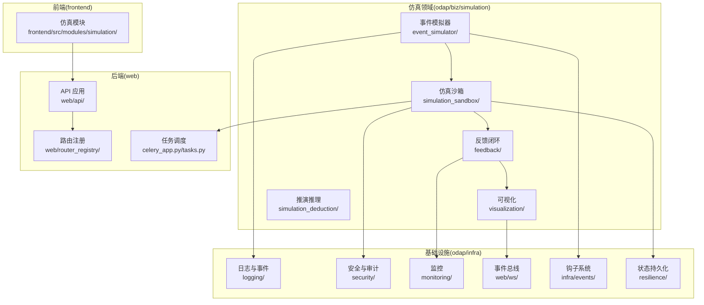
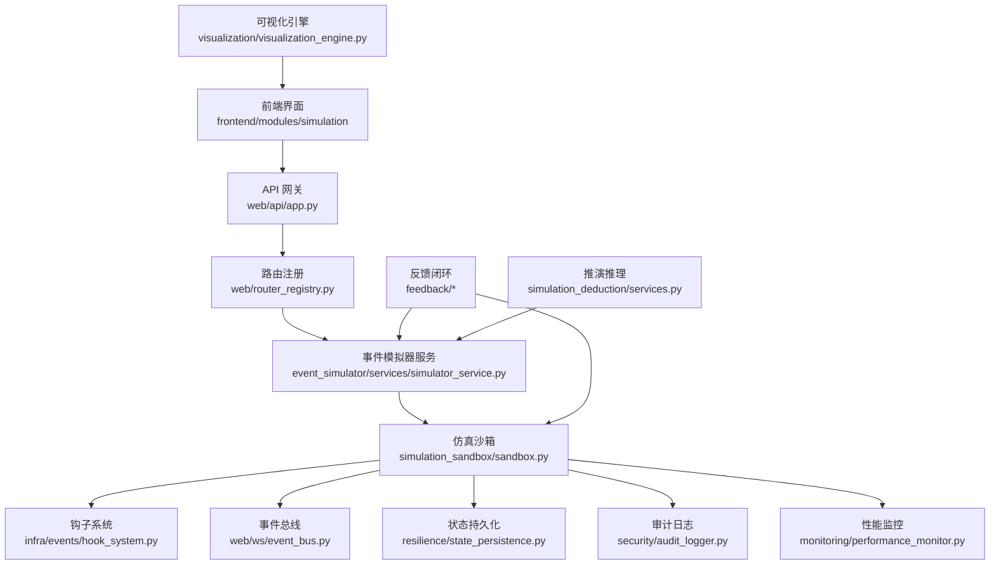
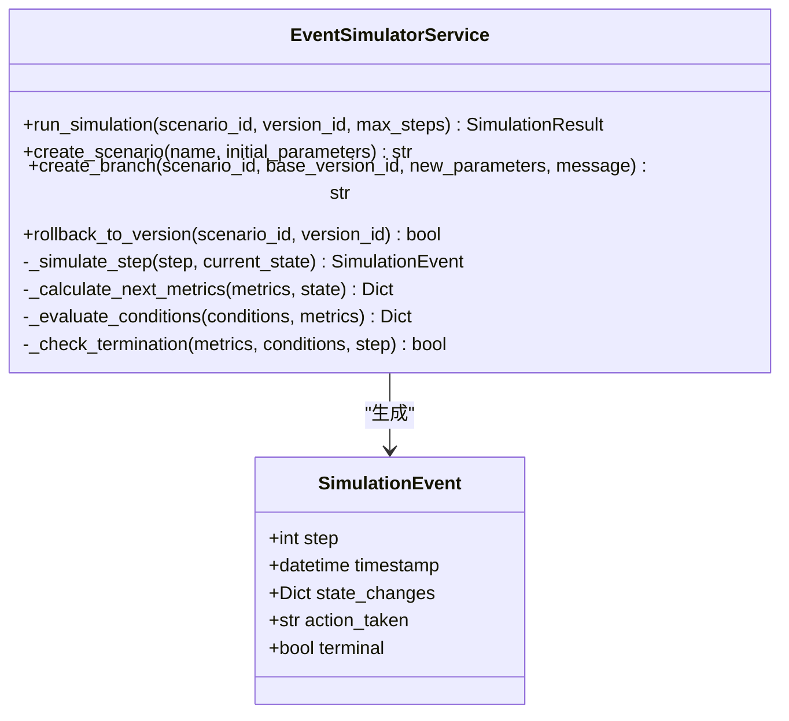
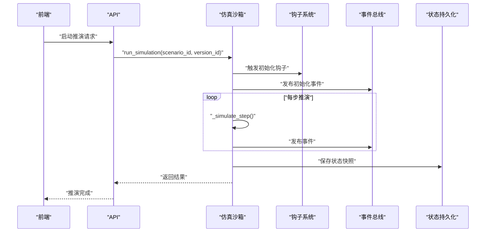
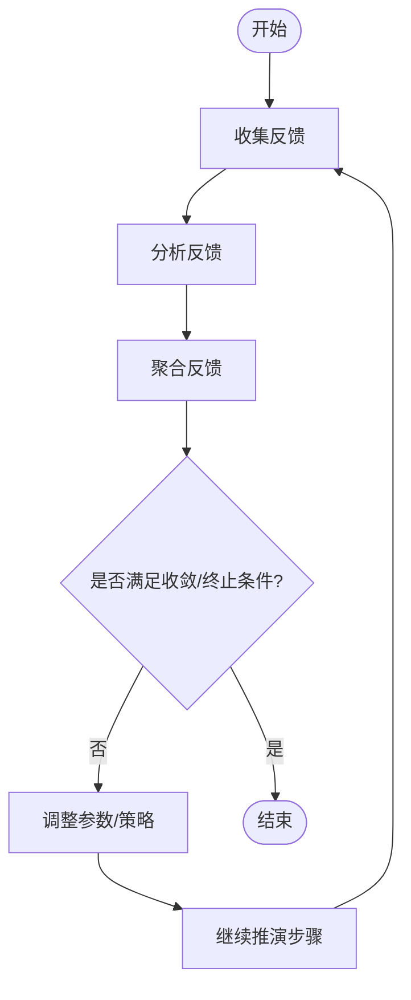
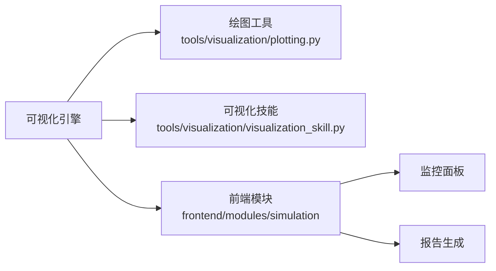
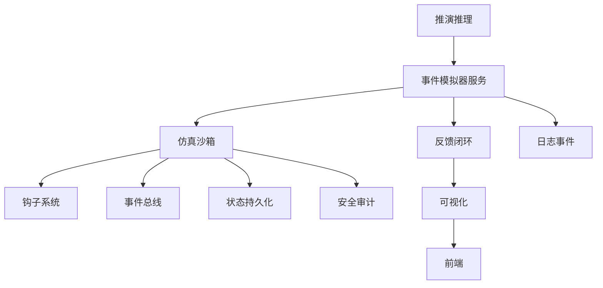

# 仿真系统

<cite>
**本文引用的文件**
- [odap/biz/simulation/__init__.py](file://odap/biz/simulation/__init__.py)
- [odap/biz/simulation/event_simulator/__init__.py](file://odap/biz/simulation/event_simulator/__init__.py)
- [odap/biz/simulation/event_simulator/models/event.py](file://odap/biz/simulation/event_simulator/models/event.py)
- [odap/biz/simulation/event_simulator/services/simulator_service.py](file://odap/biz/simulation/event_simulator/services/simulator_service.py)
- [odap/biz/simulation/simulation_sandbox/sandbox.py](file://odap/biz/simulation/simulation_sandbox/sandbox.py)
- [odap/biz/simulation/simulation_sandbox/routes.py](file://odap/biz/simulation/simulation_sandbox/routes.py)
- [odap/biz/simulation/simulation_sandbox/schemas.py](file://odap/biz/simulation/simulation_sandbox/schemas.py)
- [odap/biz/simulation/feedback/__init__.py](file://odap/biz/simulation/feedback/__init__.py)
- [odap/biz/simulation/feedback/models.py](file://odap/biz/simulation/feedback/models.py)
- [odap/biz/simulation/feedback/collector.py](file://odap/biz/simulation/feedback/collector.py)
- [odap/biz/simulation/feedback/analyzer.py](file://odap/biz/simulation/feedback/analyzer.py)
- [odap/biz/simulation/feedback/aggregator.py](file://odap/biz/simulation/feedback/aggregator.py)
- [odap/biz/simulation/feedback/loop.py](file://odap/biz/simulation/feedback/loop.py)
- [odap/biz/simulation/visualization/visualization_engine.py](file://odap/biz/simulation/visualization/visualization_engine.py)
- [odap/tools/visualization/plotting.py](file://odap/tools/visualization/plotting.py)
- [odap/tools/visualization/visualization_skill.py](file://odap/tools/visualization/visualization_skill.py)
- [odap/biz/simulation/simulation_deduction/services.py](file://odap/biz/simulation/simulation_deduction/services.py)
- [odap/web/ws/event_bus.py](file://odap/web/ws/event_bus.py)
- [odap/infra/events/hook_system.py](file://odap/infra/events/hook_system.py)
- [odap/infra/resilience/state_persistence.py](file://odap/infra/resilience/state_persistence.py)
- [odap/infra/security/audit_logger.py](file://odap/infra/security/audit_logger.py)
- [odap/infra/security/unified_audit.py](file://odap/infra/security/unified_audit.py)
- [odap/infra/monitoring/performance_monitor.py](file://odap/infra/monitoring/performance_monitor.py)
- [odap/infra/logging/graphiti_events.py](file://odap/infra/logging/graphiti_events.py)
- [odap/infra/utils/data_generator.py](file://odap/infra/utils/data_generator.py)
- [odap/storage/versions/scenarios/](file://odap/storage/versions/scenarios/)
- [odap/common/constants.py](file://odap/common/constants.py)
- [odap/web/api/app.py](file://odap/web/api/app.py)
- [odap/web/router_registry.py](file://odap/web/router_registry.py)
- [odap/celery_app.py](file://odap/celery_app.py)
- [odap/tasks.py](file://odap/tasks.py)
- [frontend/src/modules/simulation/index.ts](file://frontend/src/modules/simulation/index.ts)
- [frontend/src/modules/simulation/pages/](file://frontend/src/modules/simulation/pages/)
- [docs/03-modules/simulator/DESIGN.md](file://docs/03-modules/simulator/DESIGN.md)
- [docs/03-modules/agent/DESIGN.md](file://docs/03-modules/agent/DESIGN.md)
- [docs/03-modules/ontology/DESIGN.md](file://docs/03-modules/ontology/DESIGN.md)
- [docs/03-modules/visualization/DESIGN.md](file://docs/03-modules/visualization/DESIGN.md)
- [docs/07-adr/ADR-051_闭环反馈机制设计.md](file://docs/07-adr/ADR-051_闭环反馈机制设计.md)
- [docs/07-adr/ADR-031_simulator_web_visualization_realtime_ontology.md](file://docs/07-adr/ADR-031_simulator_web_visualization_realtime_ontology.md)
- [docs/07-adr/ADR-041_workspace_resource_isolation.md](file://docs/07-adr/ADR-041_workspace_resource_isolation.md)
- [docs/07-adr/ADR-018_领域模拟推演引擎.md](file://docs/07-adr/ADR-018_领域模拟推演引擎.md)
</cite>

## 目录
1. [简介](#简介)
2. [项目结构](#项目结构)
3. [核心组件](#核心组件)
4. [架构总览](#架构总览)
5. [详细组件分析](#详细组件分析)
6. [依赖分析](#依赖分析)
7. [性能考虑](#性能考虑)
8. [故障排查指南](#故障排查指南)
9. [结论](#结论)
10. [附录](#附录)

## 简介
本文件为 ODAP 仿真系统的技术文档，聚焦事件模拟器、仿真沙箱、反馈闭环与可视化等核心子系统，系统性阐述其设计原则、数据模型、处理流程、技术架构与集成方式，并提供配置参数、性能优化策略与扩展接口，帮助仿真分析师与系统管理员高效使用与运维仿真系统。

## 项目结构
仿真系统位于 odap/biz/simulation 下，围绕“事件模拟器 + 仿真沙箱 + 反馈闭环 + 可视化”四条主线展开，同时与基础设施层（日志、审计、监控、事件总线）、前端模块以及任务调度系统协同工作。

**图表来源**
- [odap/biz/simulation/__init__.py](file://odap/biz/simulation/__init__.py)
- [odap/web/api/app.py](file://odap/web/api/app.py)
- [odap/web/router_registry.py](file://odap/web/router_registry.py)
- [odap/web/ws/event_bus.py](file://odap/web/ws/event_bus.py)
- [odap/infra/events/hook_system.py](file://odap/infra/events/hook_system.py)
- [odap/infra/resilience/state_persistence.py](file://odap/infra/resilience/state_persistence.py)
- [odap/infra/security/audit_logger.py](file://odap/infra/security/audit_logger.py)
- [odap/infra/monitoring/performance_monitor.py](file://odap/infra/monitoring/performance_monitor.py)

**章节来源**
- [odap/biz/simulation/__init__.py](file://odap/biz/simulation/__init__.py)
- [odap/biz/simulation/event_simulator/__init__.py](file://odap/biz/simulation/event_simulator/__init__.py)
- [odap/biz/simulation/simulation_sandbox/sandbox.py](file://odap/biz/simulation/simulation_sandbox/sandbox.py)
- [odap/biz/simulation/feedback/__init__.py](file://odap/biz/simulation/feedback/__init__.py)
- [odap/biz/simulation/visualization/visualization_engine.py](file://odap/biz/simulation/visualization/visualization_engine.py)

## 核心组件
- 事件模拟器：负责事件建模、模拟算法与数据生成，支撑动态推演。
- 仿真沙箱：提供隔离环境、资源管理、状态控制与持久化。
- 反馈闭环：收集、分析、聚合反馈并驱动循环控制。
- 可视化：提供推演展示、实时监控与结果分析。
- 推演推理：基于本体与规则的推理服务，支撑闭环与决策。

**章节来源**
- [docs/03-modules/simulator/DESIGN.md](file://docs/03-modules/simulator/DESIGN.md)
- [odap/biz/simulation/event_simulator/models/event.py](file://odap/biz/simulation/event_simulator/models/event.py)
- [odap/biz/simulation/simulation_sandbox/sandbox.py](file://odap/biz/simulation/simulation_sandbox/sandbox.py)
- [odap/biz/simulation/feedback/loop.py](file://odap/biz/simulation/feedback/loop.py)
- [odap/biz/simulation/visualization/visualization_engine.py](file://odap/biz/simulation/visualization/visualization_engine.py)
- [odap/biz/simulation/simulation_deduction/services.py](file://odap/biz/simulation/simulation_deduction/services.py)

## 架构总览
仿真系统采用分层架构：上层为仿真领域模块，中层为基础设施与集成层，底层为前端与外部系统。事件模拟器作为核心引擎，驱动沙箱执行；沙箱通过钩子系统与事件总线与外部系统交互；反馈闭环贯穿执行过程；可视化负责结果呈现与监控。

**图表来源**
- [odap/web/api/app.py](file://odap/web/api/app.py)
- [odap/web/router_registry.py](file://odap/web/router_registry.py)
- [odap/biz/simulation/event_simulator/services/simulator_service.py](file://odap/biz/simulation/event_simulator/services/simulator_service.py)
- [odap/biz/simulation/simulation_sandbox/sandbox.py](file://odap/biz/simulation/simulation_sandbox/sandbox.py)
- [odap/infra/events/hook_system.py](file://odap/infra/events/hook_system.py)
- [odap/web/ws/event_bus.py](file://odap/web/ws/event_bus.py)
- [odap/infra/resilience/state_persistence.py](file://odap/infra/resilience/state_persistence.py)
- [odap/infra/security/audit_logger.py](file://odap/infra/security/audit_logger.py)
- [odap/infra/monitoring/performance_monitor.py](file://odap/infra/monitoring/performance_monitor.py)
- [odap/biz/simulation/feedback/loop.py](file://odap/biz/simulation/feedback/loop.py)
- [odap/biz/simulation/visualization/visualization_engine.py](file://odap/biz/simulation/visualization/visualization_engine.py)
- [odap/biz/simulation/simulation_deduction/services.py](file://odap/biz/simulation/simulation_deduction/services.py)

## 详细组件分析

### 事件模拟器
事件模拟器负责事件建模、模拟算法与数据生成，支持通用状态转移与领域定制扩展。

- 事件模型
  - 事件结构包含步骤序号、时间戳、状态变更、动作与终止标记。
  - 事件序列用于记录推演过程中的状态演化。
- 模拟算法
  - 默认实现采用通用状态转移模型：读取当前状态中的指标与条件，计算下一步指标与条件，检测终止条件并生成事件。
  - 子类可重写状态转移方法以实现领域定制逻辑。
- 数据生成
  - 提供数据生成工具与网页抓取工具，支持推演所需样本数据的准备。
- 实时性保证
  - 通过事件总线与钩子系统实现异步事件传播与解耦，结合性能监控保障执行延迟可控。

**图表来源**
- [odap/biz/simulation/event_simulator/services/simulator_service.py](file://odap/biz/simulation/event_simulator/services/simulator_service.py)
- [odap/biz/simulation/event_simulator/models/event.py](file://odap/biz/simulation/event_simulator/models/event.py)

**章节来源**
- [odap/biz/simulation/event_simulator/models/event.py](file://odap/biz/simulation/event_simulator/models/event.py)
- [odap/biz/simulation/event_simulator/services/simulator_service.py](file://odap/biz/simulation/event_simulator/services/simulator_service.py)
- [odap/infra/utils/data_generator.py](file://odap/infra/utils/data_generator.py)
- [odap/web/ws/event_bus.py](file://odap/web/ws/event_bus.py)
- [odap/infra/monitoring/performance_monitor.py](file://odap/infra/monitoring/performance_monitor.py)

### 仿真沙箱
仿真沙箱提供隔离环境与资源管理，支持沙箱生命周期控制与状态持久化。

- 隔离机制
  - 通过工作区隔离与容器/进程边界限制资源占用，避免相互干扰。
- 资源管理
  - 任务调度系统负责并发与队列管理，确保沙箱执行的稳定性。
- 安全控制
  - 审计日志与统一审计通道记录沙箱操作轨迹，支持合规追溯。
- 状态持久化
  - 沙箱状态与中间结果持久化至本地存储，支持断点续跑与回放。

**图表来源**
- [odap/biz/simulation/simulation_sandbox/sandbox.py](file://odap/biz/simulation/simulation_sandbox/sandbox.py)
- [odap/infra/events/hook_system.py](file://odap/infra/events/hook_system.py)
- [odap/web/ws/event_bus.py](file://odap/web/ws/event_bus.py)
- [odap/infra/resilience/state_persistence.py](file://odap/infra/resilience/state_persistence.py)

**章节来源**
- [odap/biz/simulation/simulation_sandbox/sandbox.py](file://odap/biz/simulation/simulation_sandbox/sandbox.py)
- [odap/biz/simulation/simulation_sandbox/routes.py](file://odap/biz/simulation/simulation_sandbox/routes.py)
- [odap/biz/simulation/simulation_sandbox/schemas.py](file://odap/biz/simulation/simulation_sandbox/schemas.py)
- [odap/infra/security/audit_logger.py](file://odap/infra/security/audit_logger.py)
- [odap/infra/security/unified_audit.py](file://odap/infra/security/unified_audit.py)
- [odap/celery_app.py](file://odap/celery_app.py)
- [odap/tasks.py](file://odap/tasks.py)

### 反馈闭环系统
反馈闭环贯穿推演全过程，形成“收集-分析-聚合-控制”的循环，提升推演质量与适应性。

- 反馈收集
  - 多源采集：事件流、状态变更、人工标注与外部系统信号。
- 分析器
  - 基于规则与统计模型对反馈进行分类与评分。
- 聚合器
  - 将多维度反馈聚合为统一指标，指导后续策略调整。
- 循环控制
  - 将聚合结果反馈至事件模拟器与沙箱，动态调整推演参数或终止条件。

**图表来源**
- [odap/biz/simulation/feedback/collector.py](file://odap/biz/simulation/feedback/collector.py)
- [odap/biz/simulation/feedback/analyzer.py](file://odap/biz/simulation/feedback/analyzer.py)
- [odap/biz/simulation/feedback/aggregator.py](file://odap/biz/simulation/feedback/aggregator.py)
- [odap/biz/simulation/feedback/loop.py](file://odap/biz/simulation/feedback/loop.py)

**章节来源**
- [odap/biz/simulation/feedback/models.py](file://odap/biz/simulation/feedback/models.py)
- [odap/biz/simulation/feedback/collector.py](file://odap/biz/simulation/feedback/collector.py)
- [odap/biz/simulation/feedback/analyzer.py](file://odap/biz/simulation/feedback/analyzer.py)
- [odap/biz/simulation/feedback/aggregator.py](file://odap/biz/simulation/feedback/aggregator.py)
- [odap/biz/simulation/feedback/loop.py](file://odap/biz/simulation/feedback/loop.py)
- [docs/07-adr/ADR-051_闭环反馈机制设计.md](file://docs/07-adr/ADR-051_闭环反馈机制设计.md)

### 可视化组件
可视化覆盖推演展示、实时监控与结果分析，支持报告生成与前端交互。

- 推演展示
  - 图表绘制与可视化技能封装，支持多维指标与事件序列展示。
- 实时监控
  - 事件总线推送关键指标，前端轮询或订阅更新。
- 结果分析
  - 提供对比分析、收敛趋势与异常检测。
- 报告生成
  - 基于推演结果与可视化输出生成可分享报告。

**图表来源**
- [odap/biz/simulation/visualization/visualization_engine.py](file://odap/biz/simulation/visualization/visualization_engine.py)
- [odap/tools/visualization/plotting.py](file://odap/tools/visualization/plotting.py)
- [odap/tools/visualization/visualization_skill.py](file://odap/tools/visualization/visualization_skill.py)
- [frontend/src/modules/simulation/index.ts](file://frontend/src/modules/simulation/index.ts)

**章节来源**
- [odap/biz/simulation/visualization/visualization_engine.py](file://odap/biz/simulation/visualization/visualization_engine.py)
- [odap/tools/visualization/plotting.py](file://odap/tools/visualization/plotting.py)
- [odap/tools/visualization/visualization_skill.py](file://odap/tools/visualization/visualization_skill.py)
- [frontend/src/modules/simulation/index.ts](file://frontend/src/modules/simulation/index.ts)
- [docs/03-modules/visualization/DESIGN.md](file://docs/03-modules/visualization/DESIGN.md)
- [docs/07-adr/ADR-031_simulator_web_visualization_realtime_ontology.md](file://docs/07-adr/ADR-031_simulator_web_visualization_realtime_ontology.md)

### 推演推理服务
推演推理服务基于本体与规则，为仿真提供语义层面的推理能力，支撑闭环与决策。

- 本体集成
  - 与本体管理与用户认知引擎协作，提供语义解释与一致性校验。
- 规则引擎
  - 基于策略与规则对推演状态进行判定与建议。
- 决策支持
  - 输出推理结论与建议，辅助仿真分析师制定策略。

**章节来源**
- [odap/biz/simulation/simulation_deduction/services.py](file://odap/biz/simulation/simulation_deduction/services.py)
- [docs/03-modules/ontology/DESIGN.md](file://docs/03-modules/ontology/DESIGN.md)
- [docs/03-modules/agent/DESIGN.md](file://docs/03-modules/agent/DESIGN.md)

## 依赖分析
仿真系统模块间依赖清晰，遵循“领域模块 → 基础设施 → 外部系统”的层次化设计，避免循环依赖。

**图表来源**
- [odap/biz/simulation/event_simulator/services/simulator_service.py](file://odap/biz/simulation/event_simulator/services/simulator_service.py)
- [odap/biz/simulation/simulation_sandbox/sandbox.py](file://odap/biz/simulation/simulation_sandbox/sandbox.py)
- [odap/biz/simulation/feedback/loop.py](file://odap/biz/simulation/feedback/loop.py)
- [odap/biz/simulation/visualization/visualization_engine.py](file://odap/biz/simulation/visualization/visualization_engine.py)
- [odap/biz/simulation/simulation_deduction/services.py](file://odap/biz/simulation/simulation_deduction/services.py)

**章节来源**
- [odap/biz/simulation/__init__.py](file://odap/biz/simulation/__init__.py)
- [odap/web/api/app.py](file://odap/web/api/app.py)
- [odap/web/router_registry.py](file://odap/web/router_registry.py)

## 性能考虑
- 异步事件传播：通过事件总线与钩子系统降低耦合，提高吞吐。
- 并发与限流：利用任务调度系统与路由注册控制并发度，避免资源争用。
- 监控与告警：性能监控组件持续跟踪执行延迟与错误率，及时预警。
- 数据持久化：状态持久化减少重复计算，支持断点续跑与回放。
- 前端渲染：可视化组件按需加载与懒更新，降低页面卡顿。

**章节来源**
- [odap/web/ws/event_bus.py](file://odap/web/ws/event_bus.py)
- [odap/infra/events/hook_system.py](file://odap/infra/events/hook_system.py)
- [odap/infra/monitoring/performance_monitor.py](file://odap/infra/monitoring/performance_monitor.py)
- [odap/infra/resilience/state_persistence.py](file://odap/infra/resilience/state_persistence.py)
- [odap/celery_app.py](file://odap/celery_app.py)
- [odap/web/router_registry.py](file://odap/web/router_registry.py)

## 故障排查指南
- 日志与事件
  - 使用结构化日志与图谱事件记录关键路径，定位异常。
- 审计与追踪
  - 审计日志与统一审计通道记录沙箱操作，便于回溯。
- 监控告警
  - 性能监控组件提供延迟、错误与资源使用指标，快速发现瓶颈。
- 持久化检查
  - 确认状态快照与版本文件完整性，必要时回滚至上一稳定版本。
- 前端问题
  - 检查事件总线连接与路由注册，确认可视化组件正常加载。

**章节来源**
- [odap/infra/logging/graphiti_events.py](file://odap/infra/logging/graphiti_events.py)
- [odap/infra/security/audit_logger.py](file://odap/infra/security/audit_logger.py)
- [odap/infra/security/unified_audit.py](file://odap/infra/security/unified_audit.py)
- [odap/infra/monitoring/performance_monitor.py](file://odap/infra/monitoring/performance_monitor.py)
- [odap/infra/resilience/state_persistence.py](file://odap/infra/resilience/state_persistence.py)

## 结论
ODAP 仿真系统通过事件模拟器、仿真沙箱、反馈闭环与可视化四大支柱，构建了高内聚、低耦合的推演平台。系统在隔离、安全、持久化与实时性方面具备完善设计，并通过可视化与推理服务增强决策支持能力。建议在部署时结合监控与审计体系，持续优化性能与稳定性。

## 附录

### 仿真配置参数
- 推演参数
  - 场景与版本：场景标识、版本参数、父版本、消息。
  - 执行参数：最大步数、收敛阈值、终止条件。
- 沙箱参数
  - 隔离策略、资源上限、超时时间、重试策略。
- 可视化参数
  - 指标维度、图表类型、刷新频率、导出格式。
- 反馈参数
  - 收集范围、分析规则、聚合权重、控制阈值。

**章节来源**
- [odap/biz/simulation/simulation_sandbox/schemas.py](file://odap/biz/simulation/simulation_sandbox/schemas.py)
- [odap/biz/simulation/event_simulator/models/event.py](file://odap/biz/simulation/event_simulator/models/event.py)
- [odap/biz/simulation/feedback/models.py](file://odap/biz/simulation/feedback/models.py)

### 性能优化策略
- 事件批处理：合并小事件，减少总线压力。
- 缓存策略：对热点状态与指标进行缓存，降低重复计算。
- 并行化：在允许的范围内并行执行独立推演分支。
- 存储优化：压缩状态快照，定期清理历史版本。

**章节来源**
- [odap/web/ws/event_bus.py](file://odap/web/ws/event_bus.py)
- [odap/infra/resilience/state_persistence.py](file://odap/infra/resilience/state_persistence.py)
- [odap/infra/monitoring/performance_monitor.py](file://odap/infra/monitoring/performance_monitor.py)

### 扩展接口
- 自定义事件模拟器
  - 继承事件模拟器服务，重写状态转移方法以适配领域模型。
- 自定义反馈处理器
  - 实现反馈收集、分析与聚合的插件接口。
- 自定义可视化组件
  - 基于绘图工具与可视化技能扩展图表类型与交互方式。
- 集成推理服务
  - 通过本体与规则引擎接入语义推理，增强闭环能力。

**章节来源**
- [odap/biz/simulation/event_simulator/services/simulator_service.py](file://odap/biz/simulation/event_simulator/services/simulator_service.py)
- [odap/biz/simulation/feedback/collector.py](file://odap/biz/simulation/feedback/collector.py)
- [odap/biz/simulation/feedback/analyzer.py](file://odap/biz/simulation/feedback/analyzer.py)
- [odap/biz/simulation/feedback/aggregator.py](file://odap/biz/simulation/feedback/aggregator.py)
- [odap/biz/simulation/visualization/visualization_engine.py](file://odap/biz/simulation/visualization/visualization_engine.py)
- [odap/biz/simulation/simulation_deduction/services.py](file://odap/biz/simulation/simulation_deduction/services.py)

### 使用指南（面向仿真分析师与系统管理员）
- 仿真分析师
  - 使用前端仿真模块创建场景与版本，配置参数并启动推演。
  - 通过可视化面板观察实时监控与结果分析，生成报告。
  - 利用反馈闭环调整策略，迭代优化方案。
- 系统管理员
  - 部署与维护 API、事件总线与任务调度系统。
  - 配置审计与监控，确保沙箱安全与性能达标。
  - 定期备份状态快照，保障数据可恢复性。

**章节来源**
- [frontend/src/modules/simulation/index.ts](file://frontend/src/modules/simulation/index.ts)
- [odap/web/api/app.py](file://odap/web/api/app.py)
- [odap/web/router_registry.py](file://odap/web/router_registry.py)
- [odap/infra/security/unified_audit.py](file://odap/infra/security/unified_audit.py)
- [odap/infra/monitoring/performance_monitor.py](file://odap/infra/monitoring/performance_monitor.py)
- [odap/infra/resilience/state_persistence.py](file://odap/infra/resilience/state_persistence.py)