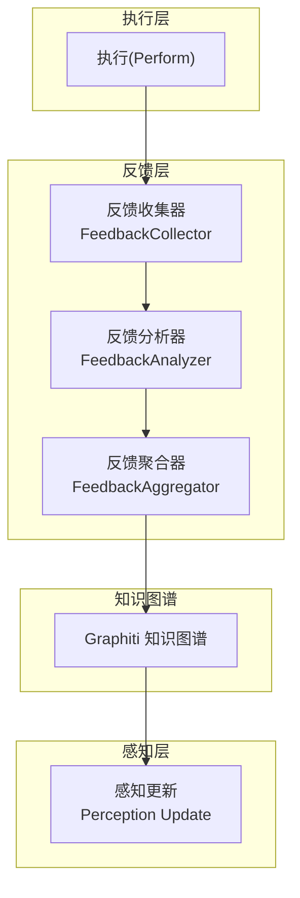
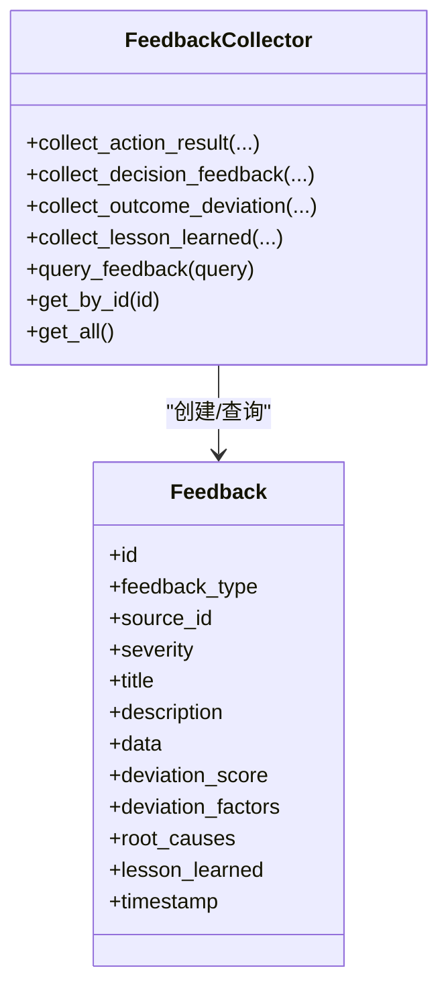
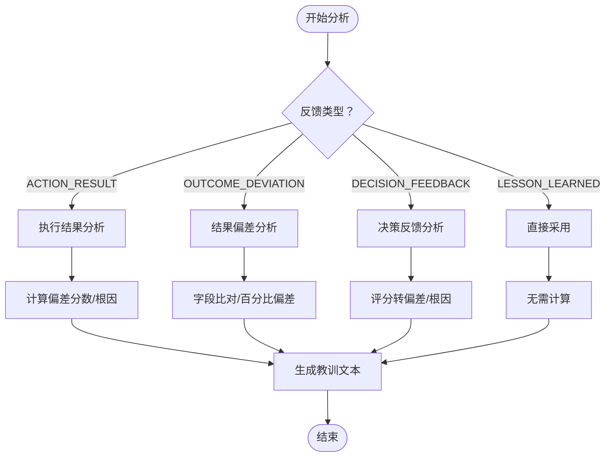
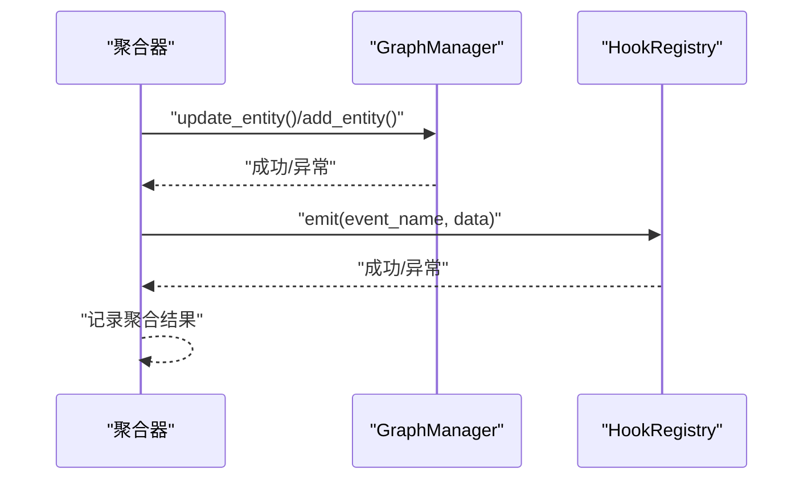
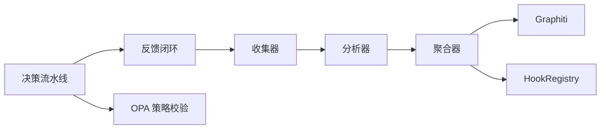

# 反馈闭环

<cite>
**本文引用的文件**
- [反馈闭环设计 ADR-051](file://docs/07-adr/ADR-051_闭环反馈机制设计.md)
- [架构总览（业务）](file://docs/02-architecture/ARCHITECTURE_BIZ.md)
- [架构总览（全链路深度）](file://docs/02-architecture/ARCHITECTURE_FULL_CHAIN_DEEP.md)
- [决策流水线](file://odap/biz/decision/decision_pipeline/pipeline.py)
- [反馈收集器（仿真）](file://odap/biz/simulation/feedback/collector.py)
- [反馈分析器（仿真）](file://odap/biz/simulation/feedback/analyzer.py)
- [反馈聚合器（仿真）](file://odap/biz/simulation/feedback/aggregator.py)
- [反馈模型（仿真）](file://odap/biz/simulation/feedback/models.py)
- [反馈闭环（行动服务）](file://odap/biz/decision/action_service/feedback_loop.py)
- [单元测试：反馈闭环](file://tests/unit/test_feedback.py)
- [异常检测系统](file://docs/02-architecture/ARCHITECTURE_FULL_CHAIN_DEEP.md)
- [反馈聚合分析引擎](file://docs/02-architecture/ARCHITECTURE_FULL_CHAIN_DEEP.md)
- [故障恢复与状态管理（Swarm Orchestrator）](file://docs/03-modules/swarm_orchestrator/DESIGN.md)
- [健康监控（Swarm Orchestrator）](file://docs/03-modules/swarm_orchestrator/DESIGN.md)
- [配置示例（Swarm Orchestrator）](file://docs/03-modules/swarm_orchestrator/DESIGN.md)
- [配置模块（基础设施）](file://docs/03-modules/infra/DESIGN.md)
- [决策推荐模块设计](file://docs/03-modules/decision_recommendation/DESIGN.md)
</cite>

## 目录
1. [简介](#简介)
2. [项目结构](#项目结构)
3. [核心组件](#核心组件)
4. [架构总览](#架构总览)
5. [详细组件分析](#详细组件分析)
6. [依赖分析](#依赖分析)
7. [性能考量](#性能考量)
8. [故障排查指南](#故障排查指南)
9. [结论](#结论)
10. [附录](#附录)

## 简介
本文件面向研究人员与工程团队，系统化阐述“反馈闭环系统”的设计与实现，覆盖数据采集、传输、预处理，分析器的统计分析与偏差识别，聚合器的知识图谱更新与事件发射，以及闭环控制中的阈值与调节策略。同时提供配置参数、性能优化建议与扩展接口说明，并给出实验设计方法，帮助在真实业务场景中落地与迭代。

## 项目结构
反馈闭环位于业务域的 OADP（感知-理解-决策-执行）链条末端，通过“执行结果 → 反馈收集 → 反馈分析 → 反馈聚合 → 知识图谱更新 → 感知更新”的闭环，实现持续学习与优化。核心代码分布在仿真反馈模块与行动服务反馈模块两套实现中，分别服务于离线仿真与在线执行。



**图表来源**
- [反馈闭环设计 ADR-051:34-85](file://docs/07-adr/ADR-051_闭环反馈机制设计.md#L34-L85)
- [反馈闭环（行动服务）:290-311](file://odap/biz/decision/action_service/feedback_loop.py#L290-L311)

**章节来源**
- [反馈闭环设计 ADR-051:1-343](file://docs/07-adr/ADR-051_闭环反馈机制设计.md#L1-L343)
- [架构总览（业务）:413-438](file://docs/02-architecture/ARCHITECTURE_BIZ.md#L413-L438)

## 核心组件
- 反馈收集器：从执行结果中抽取并标准化为统一反馈模型，支持按来源、类型、严重度查询。
- 反馈分析器：计算偏差分数、识别偏差因子与根因，生成经验教训文本；支持模式识别与统计汇总。
- 反馈聚合器：将分析结果写入知识图谱，创建反馈事件节点，触发钩子事件，支持回退与容错。
- 闭环控制器：在决策流水线末尾触发闭环，串联收集、分析、聚合三阶段，输出闭环摘要。

**章节来源**
- [反馈收集器（仿真）:9-135](file://odap/biz/simulation/feedback/collector.py#L9-L135)
- [反馈分析器（仿真）:9-174](file://odap/biz/simulation/feedback/analyzer.py#L9-L174)
- [反馈聚合器（仿真）:9-114](file://odap/biz/simulation/feedback/aggregator.py#L9-L114)
- [反馈模型（仿真）:8-41](file://odap/biz/simulation/feedback/models.py#L8-L41)
- [反馈闭环（行动服务）:23-311](file://odap/biz/decision/action_service/feedback_loop.py#L23-L311)
- [决策流水线:64-139](file://odap/biz/decision/decision_pipeline/pipeline.py#L64-L139)

## 架构总览
三层闭环反馈架构将“收集-分析-聚合”解耦为独立组件，通过知识图谱实现经验沉淀与感知更新。在执行完成后，闭环控制器调用反馈收集器，随后由分析器进行偏差与模式识别，最后由聚合器更新图谱并发出事件。

```mermaid
sequenceDiagram
participant EXEC as "执行层"
participant LOOP as "闭环控制器"
participant COL as "反馈收集器"
participant ANA as "反馈分析器"
participant AGG as "反馈聚合器"
participant GRAPH as "知识图谱(Graphiti)"
EXEC->>LOOP : "返回执行结果(ActionRecord)"
LOOP->>COL : "collect(action_record)"
COL-->>LOOP : "ActionFeedback"
LOOP->>ANA : "analyze_deviation(feedback, expected)"
ANA-->>LOOP : "ActionFeedback(含偏差/根因/教训)"
LOOP->>AGG : "aggregate_and_update(feedback, action_record)"
AGG->>GRAPH : "更新实体/创建事件节点"
AGG-->>LOOP : "聚合结果(图谱更新/事件发射)"
LOOP-->>EXEC : "闭环摘要(含分析结果)"
```

**图表来源**
- [反馈闭环（行动服务）:296-300](file://odap/biz/decision/action_service/feedback_loop.py#L296-L300)
- [决策流水线:126-139](file://odap/biz/decision/decision_pipeline/pipeline.py#L126-L139)

**章节来源**
- [架构总览（业务）:413-438](file://docs/02-architecture/ARCHITECTURE_BIZ.md#L413-L438)
- [反馈闭环设计 ADR-051:34-85](file://docs/07-adr/ADR-051_闭环反馈机制设计.md#L34-L85)

## 详细组件分析

### 反馈收集器
- 输入：执行结果（包含成功/失败、返回数据、错误信息等）。
- 输出：统一的 ActionFeedback 或 Feedback 对象，包含来源标识、严重度、偏差因子等。
- 查询能力：支持按来源 ID、类型、严重度过滤与排序，限制返回数量。



**图表来源**
- [反馈收集器（仿真）:9-135](file://odap/biz/simulation/feedback/collector.py#L9-L135)
- [反馈模型（仿真）:21-41](file://odap/biz/simulation/feedback/models.py#L21-L41)

**章节来源**
- [反馈收集器（仿真）:13-117](file://odap/biz/simulation/feedback/collector.py#L13-L117)
- [反馈模型（仿真）:8-41](file://odap/biz/simulation/feedback/models.py#L8-L41)

### 反馈分析器
- 偏差分析：针对执行失败与预期-实际差异，计算偏差分数、识别偏差因子与根因。
- 模式识别：统计反馈类型分布、来源重复度、根因频次与平均偏差，输出可解释的模式清单。
- 经验教训：根据反馈类型生成可读的总结文本，便于知识沉淀与复盘。



**图表来源**
- [反馈分析器（仿真）:9-174](file://odap/biz/simulation/feedback/analyzer.py#L9-L174)

**章节来源**
- [反馈分析器（仿真）:10-174](file://odap/biz/simulation/feedback/analyzer.py#L10-L174)

### 反馈聚合器
- 图谱更新：根据反馈类型更新实体属性（如状态、阶段、结果），或创建反馈事件节点。
- 事件发射：向钩子系统发出事件，供上层感知与监控系统订阅。
- 容错与回退：当图谱或钩子不可用时，记录警告并继续流程，保证闭环不中断。



**图表来源**
- [反馈聚合器（仿真）:34-114](file://odap/biz/simulation/feedback/aggregator.py#L34-L114)
- [反馈闭环（行动服务）:177-288](file://odap/biz/decision/action_service/feedback_loop.py#L177-L288)

**章节来源**
- [反馈聚合器（仿真）:34-114](file://odap/biz/simulation/feedback/aggregator.py#L34-L114)
- [反馈闭环（行动服务）:155-288](file://odap/biz/decision/action_service/feedback_loop.py#L155-L288)

### 闭环控制器（决策流水线）
- 在执行阶段结束后，自动触发闭环，传入执行结果与可选的预期结果，返回闭环摘要。
- 与决策流水线集成：在执行成功且通过策略校验后，进入反馈阶段，确保闭环仅在有效执行后发生。

```mermaid
sequenceDiagram
participant PIPE as "决策流水线"
participant LOOP as "反馈闭环"
participant COL as "收集器"
participant ANA as "分析器"
participant AGG as "聚合器"
PIPE->>PIPE : "执行完成"
PIPE->>LOOP : "close_loop(action_record, expected)"
LOOP->>COL : "collect()"
LOOP->>ANA : "analyze_deviation()"
LOOP->>AGG : "aggregate_and_update()"
AGG-->>LOOP : "聚合结果"
LOOP-->>PIPE : "闭环摘要"
```

**图表来源**
- [决策流水线:126-139](file://odap/biz/decision/decision_pipeline/pipeline.py#L126-L139)
- [反馈闭环（行动服务）:296-300](file://odap/biz/decision/action_service/feedback_loop.py#L296-L300)

**章节来源**
- [决策流水线:64-139](file://odap/biz/decision/decision_pipeline/pipeline.py#L64-L139)
- [反馈闭环（行动服务）:290-311](file://odap/biz/decision/action_service/feedback_loop.py#L290-L311)

## 依赖分析
- 组件内聚与耦合
  - 收集器与分析器之间通过统一反馈模型解耦；分析器与聚合器通过分析结果解耦。
  - 聚合器依赖图谱与钩子系统，具备容错能力，避免阻塞闭环主流程。
- 外部依赖
  - Graphiti 知识图谱：用于实体更新与事件节点创建。
  - 钩子系统：用于跨模块事件广播与订阅。
  - OPA 策略校验：在决策流水线中前置，保障闭环触发的合法性。



**图表来源**
- [反馈闭环（行动服务）:290-311](file://odap/biz/decision/action_service/feedback_loop.py#L290-L311)
- [决策流水线:232-255](file://odap/biz/decision/decision_pipeline/pipeline.py#L232-L255)

**章节来源**
- [反馈闭环（行动服务）:155-176](file://odap/biz/decision/action_service/feedback_loop.py#L155-L176)
- [决策流水线:232-255](file://odap/biz/decision/decision_pipeline/pipeline.py#L232-L255)

## 性能考量
- 收集与分析的异步化：反馈收集与分析采用异步接口，降低对执行路径的影响。
- 聚合器的容错与降级：当图谱或钩子不可用时，记录警告并继续，保证闭环可用性。
- 模式识别的批处理：分析器支持批量反馈的模式识别，适合周期性聚合与报表生成。
- 监控与告警：结合异常检测系统与健康监控，对闭环关键指标进行实时观测与预警。

[本节为通用指导，不直接分析具体文件]

## 故障排查指南
- 常见问题
  - 图谱更新失败：检查 GraphManager 初始化与连接状态，确认实体属性键集合与类型兼容。
  - 钩子事件未发出：检查 HookRegistry 是否可用，事件命名与数据结构是否符合订阅者期望。
  - 偏差分析异常：核对反馈数据结构与预期结果字段，确保数值型字段的比较逻辑一致。
- 建议步骤
  - 开启聚合器的日志记录，定位失败阶段（图谱/事件）。
  - 使用查询接口按来源与类型筛选反馈，复现分析过程。
  - 在决策流水线中加入异常捕获与重试策略，避免单点故障影响闭环。

**章节来源**
- [反馈聚合器（仿真）:44-62](file://odap/biz/simulation/feedback/aggregator.py#L44-L62)
- [单元测试：反馈闭环:339-464](file://tests/unit/test_feedback.py#L339-L464)

## 结论
反馈闭环系统以“收集-分析-聚合”三层架构为核心，通过知识图谱实现经验沉淀与感知更新，配合异常检测与健康监控，形成可观察、可诊断、可优化的闭环生态。在工程实践中，建议优先保证闭环的可用性与可观测性，再逐步引入更复杂的统计与机器学习分析能力。

[本节为总结性内容，不直接分析具体文件]

## 附录

### 反馈类型与用途
- 动作结果（action_result）：评估决策有效性与执行稳定性。
- 决策反馈（decision_feedback）：优化推荐算法与策略校验。
- 结果偏差（outcome_deviation）：调整模型参数与预期设定。
- 经验教训（lesson_learned）：知识沉淀与复盘。

**章节来源**
- [反馈闭环设计 ADR-051:87-95](file://docs/07-adr/ADR-051_闭环反馈机制设计.md#L87-L95)

### 配置参数与扩展接口
- 配置优先级与核心项
  - 配置优先级：环境变量 > config.yaml > config.default.yaml。
  - 核心配置项：数据库/图数据库连接、策略引擎地址、LLM 接口、存储路径等。
- Swarm Orchestrator 配置要点
  - 协调器并发与超时、重试次数、权限级别与工具集。
  - OODA 流程开关：流式输出、执行前确认、图谱写入。
  - 故障恢复：最大重试、断路器阈值与重置时间、降级模式与回退策略。
  - 状态持久化：检查点间隔与上限。
  - 健康监控：检查周期、告警通道与阈值。
- 扩展接口
  - 自定义分析器：实现新的偏差识别与模式识别算法。
  - 自定义聚合器：扩展图谱写入与事件发射策略。
  - 自定义收集器：适配不同来源的执行结果格式。

**章节来源**
- [配置模块（基础设施）:396-429](file://docs/03-modules/infra/DESIGN.md#L396-L429)
- [配置示例（Swarm Orchestrator）:1359-1438](file://docs/03-modules/swarm_orchestrator/DESIGN.md#L1359-L1438)
- [故障恢复与状态管理（Swarm Orchestrator）:278-634](file://docs/03-modules/swarm_orchestrator/DESIGN.md#L278-L634)
- [健康监控（Swarm Orchestrator）:783-1357](file://docs/03-modules/swarm_orchestrator/DESIGN.md#L783-L1357)

### 实验设计方法
- 设计指标
  - 决策成功率、执行成功率、偏差率、根因命中率、知识图谱更新延迟。
- 实验组
  - 对照组：无反馈闭环；实验组：启用闭环并设置阈值与调节策略。
- 评估周期
  - 日常/周度指标仪表盘，结合异常检测系统与健康监控进行预警与干预。
- 复盘流程
  - 使用分析器的模式识别与教训生成，组织跨团队复盘会议，沉淀最佳实践。

**章节来源**
- [反馈聚合分析引擎:4614-4883](file://docs/02-architecture/ARCHITECTURE_FULL_CHAIN_DEEP.md#L4614-L4883)
- [异常检测系统:4763-4883](file://docs/02-architecture/ARCHITECTURE_FULL_CHAIN_DEEP.md#L4763-L4883)
- [决策推荐模块设计:516-715](file://docs/03-modules/decision_recommendation/DESIGN.md#L516-L715)