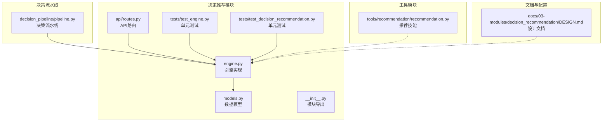
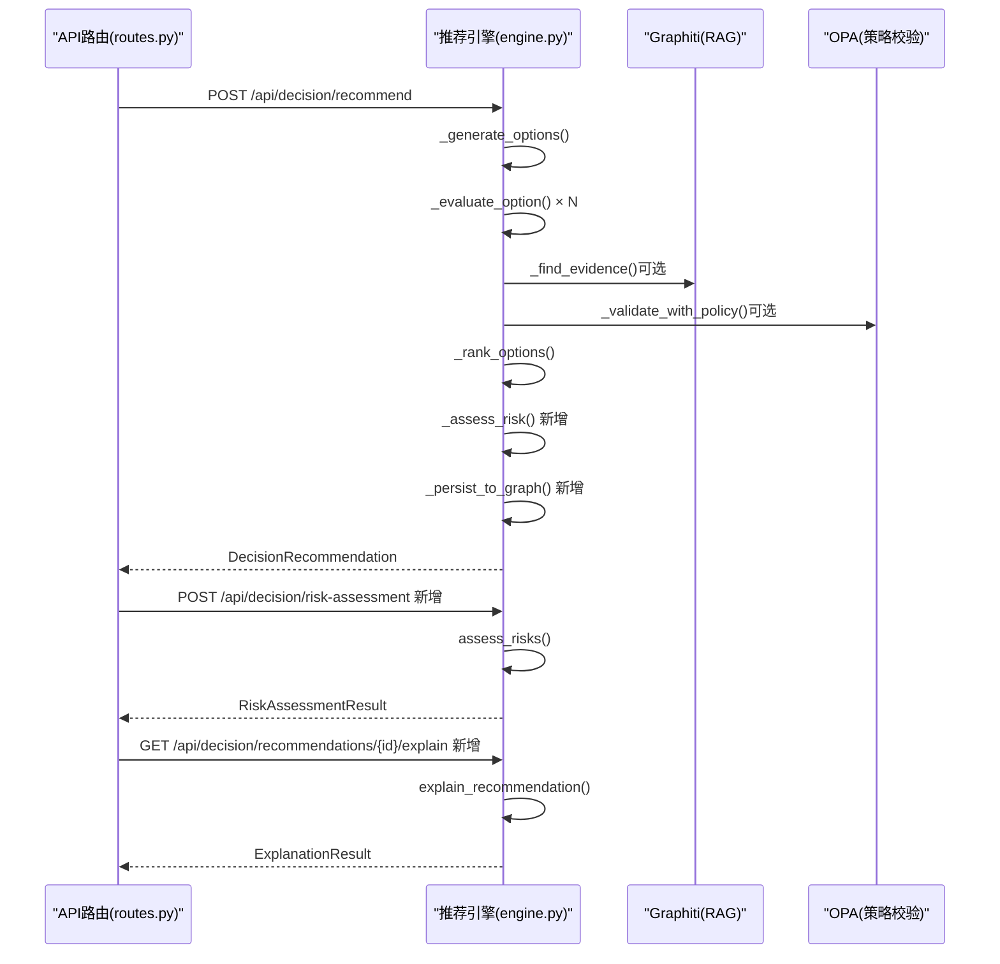
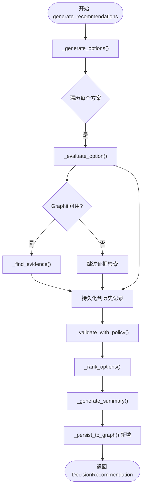
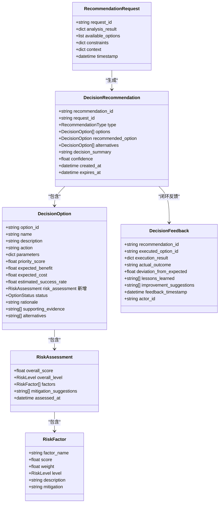
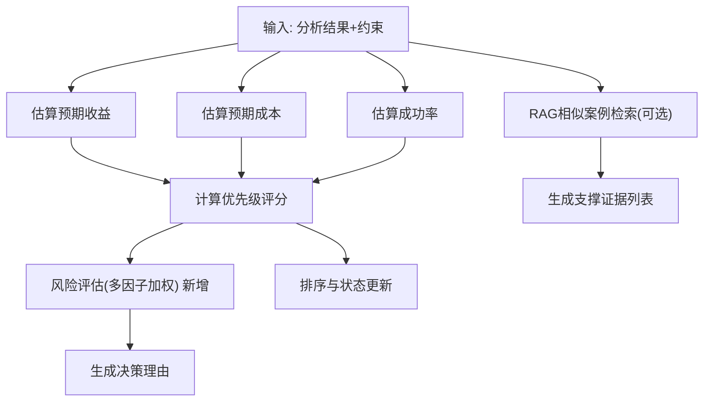
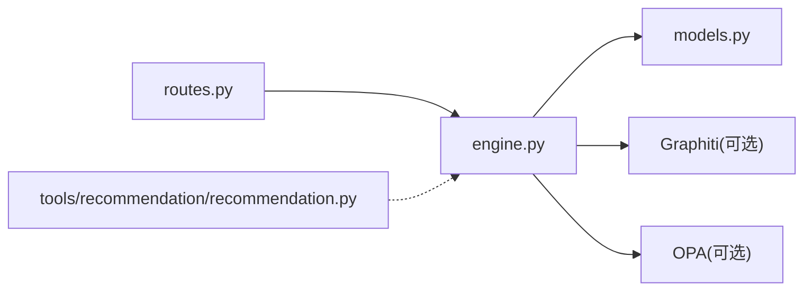

# 决策推荐引擎

<cite>
**本文引用的文件**
- [engine.py](file://odap/biz/decision/decision_recommendation/engine.py)
- [models.py](file://odap/biz/decision/decision_recommendation/models.py)
- [routes.py](file://odap/biz/decision/decision_recommendation/api/routes.py)
- [__init__.py](file://odap/biz/decision/decision_recommendation/__init__.py)
- [test_engine.py](file://odap/biz/decision/decision_recommendation/tests/test_engine.py)
- [test_decision_recommendation.py](file://tests/unit/test_decision_recommendation.py)
- [DESIGN.md](file://docs/03-modules/decision_recommendation/DESIGN.md)
</cite>

## 更新摘要
**变更内容**
- 新增多维度风险评估系统，包含执行风险、资源风险、时间风险和外部风险四个因子
- 实现历史推荐持久化功能，自动将推荐结果保存到知识图谱
- 添加可解释AI功能，支持推荐解释和历史查询
- 增强API接口，新增风险评估和解释接口
- 优化数据模型，新增风险评估相关字段

## 目录
1. [引言](#引言)
2. [项目结构](#项目结构)
3. [核心组件](#核心组件)
4. [架构总览](#架构总览)
5. [详细组件分析](#详细组件分析)
6. [依赖分析](#依赖分析)
7. [性能考量](#性能考量)
8. [故障排查指南](#故障排查指南)
9. [结论](#结论)
10. [附录](#附录)

## 引言
本文件面向 ODAP 决策推荐引擎，系统化阐述其算法实现、数据处理流程、配置参数、性能优化与扩展接口，并给出与决策组件的交互关系与数据流机制。该引擎位于"理解"之后、"执行"之前，负责将分析结果转化为可解释、可校验、可排序的决策建议，并支持策略校验与 RAG 增强。

**更新** 本次更新大幅增强了引擎功能，新增了多维度风险评估、历史推荐持久化和可解释AI功能，形成了更加完善的决策支持系统。

## 项目结构
决策推荐引擎位于 odap/biz/decision/decision_recommendation，核心由引擎类、数据模型、API路由、测试与模块导出组成；同时与决策流水线、API 路由、工具模块协同工作。

**图表来源**
- [engine.py:1-659](file://odap/biz/decision/decision_recommendation/engine.py#L1-L659)
- [models.py:1-244](file://odap/biz/decision/decision_recommendation/models.py#L1-L244)
- [routes.py:1-96](file://odap/biz/decision/decision_recommendation/api/routes.py#L1-L96)
- [test_engine.py:1-309](file://odap/biz/decision/decision_recommendation/tests/test_engine.py#L1-L309)
- [test_decision_recommendation.py:1-161](file://tests/unit/test_decision_recommendation.py#L1-L161)

**章节来源**
- [engine.py:1-659](file://odap/biz/decision/decision_recommendation/engine.py#L1-L659)
- [models.py:1-244](file://odap/biz/decision/decision_recommendation/models.py#L1-L244)
- [routes.py:1-96](file://odap/biz/decision/decision_recommendation/api/routes.py#L1-L96)
- [test_engine.py:1-309](file://odap/biz/decision/decision_recommendation/tests/test_engine.py#L1-L309)
- [test_decision_recommendation.py:1-161](file://tests/unit/test_decision_recommendation.py#L1-L161)

## 核心组件
- **决策推荐引擎（DecisionRecommendationEngine）**：接收 RecommendationRequest，生成候选方案，评估优先级与风险，进行策略校验，排序并输出 DecisionRecommendation。**新增** 支持风险评估、历史持久化和可解释AI功能。
- **数据模型**：RecommendationRequest、DecisionOption、RiskAssessment、DecisionRecommendation、DecisionFeedback、枚举 RecommendationType、RiskLevel、OptionStatus 等。**新增** RiskAssessment 和 RiskFactor 模型。
- **API路由**：提供推荐生成、风险评估、推荐解释和历史查询接口。**新增** 风险评估和解释接口。
- **模块导出**：统一暴露引擎与模型，便于上层调用。
- **测试**：覆盖推荐生成、优先级计算、风险评估、排序、置信度、摘要生成与反馈记录等关键路径。**新增** 风险评估、历史持久化和解释功能测试。
- **决策流水线**：将"理解"结果封装为 RecommendationRequest，调用引擎生成推荐，并与策略校验、执行、反馈形成闭环。
- **工具模块**：提供通用推荐技能（如打击目标、任务规划、兵力部署），与引擎互补。

**章节来源**
- [engine.py:36-46](file://odap/biz/decision/decision_recommendation/engine.py#L36-L46)
- [models.py:14-244](file://odap/biz/decision/decision_recommendation/models.py#L14-L244)
- [routes.py:19-96](file://odap/biz/decision/decision_recommendation/api/routes.py#L19-L96)
- [test_engine.py:27-309](file://odap/biz/decision/decision_recommendation/tests/test_engine.py#L27-L309)
- [test_decision_recommendation.py:15-161](file://tests/unit/test_decision_recommendation.py#L15-L161)

## 架构总览
引擎以"请求-评估-校验-排序-输出"为主线，结合 RAG 增强与策略校验，形成闭环反馈。**更新** 新增风险评估和历史持久化流程。

**图表来源**
- [routes.py:36-96](file://odap/biz/decision/decision_recommendation/api/routes.py#L36-L96)
- [engine.py:48-111](file://odap/biz/decision/decision_recommendation/engine.py#L48-L111)
- [engine.py:113-185](file://odap/biz/decision/decision_recommendation/engine.py#L113-L185)
- [engine.py:210-233](file://odap/biz/decision/decision_recommendation/engine.py#L210-L233)

## 详细组件分析

### 引擎类与处理流程
- **初始化**：可注入 Graphiti 客户端与 OPA 管理器，支持 RAG 增强与策略校验。**新增** 初始化历史记录列表。
- **generate_recommendations**：主流程包含候选方案生成、逐项评估、策略校验、排序与摘要生成。**更新** 新增历史持久化和知识图谱存储。
- **风险评估**：新增 assess_risks 方法，支持对推荐结果进行多维度风险评估。**新增**
- **历史持久化**：新增历史记录功能，支持推荐历史查询和解释。**新增**
- **评估指标**：优先级评分（收益、成本、成功率加权）、预期收益、预期成本、成功率、风险评估（多因子加权）。
- **策略校验**：构造输入上下文，调用 OPA 校验，根据结果更新状态与理由。
- **排序**：过滤拒绝方案后按优先级与成功率排序，更新状态为推荐/备选。
- **置信度**：综合方案数量、评分与证据数量计算。
- **反馈记录**：可将执行后的反馈写入知识图谱（Graphiti）。

**图表来源**
- [engine.py:48-111](file://odap/biz/decision/decision_recommendation/engine.py#L48-L111)
- [engine.py:241-279](file://odap/biz/decision/decision_recommendation/engine.py#L241-L279)
- [engine.py:310-327](file://odap/biz/decision/decision_recommendation/engine.py#L310-L327)
- [engine.py:458-494](file://odap/biz/decision/decision_recommendation/engine.py#L458-L494)
- [engine.py:496-517](file://odap/biz/decision/decision_recommendation/engine.py#L496-L517)
- [engine.py:573-590](file://odap/biz/decision/decision_recommendation/engine.py#L573-L590)

**章节来源**
- [engine.py:36-46](file://odap/biz/decision/decision_recommendation/engine.py#L36-L46)
- [engine.py:48-111](file://odap/biz/decision/decision_recommendation/engine.py#L48-L111)
- [engine.py:113-185](file://odap/biz/decision/decision_recommendation/engine.py#L113-L185)
- [engine.py:210-233](file://odap/biz/decision/decision_recommendation/engine.py#L210-L233)
- [engine.py:241-279](file://odap/biz/decision/decision_recommendation/engine.py#L241-L279)
- [engine.py:310-327](file://odap/biz/decision/decision_recommendation/engine.py#L310-L327)
- [engine.py:458-494](file://odap/biz/decision/decision_recommendation/engine.py#L458-L494)
- [engine.py:496-517](file://odap/biz/decision/decision_recommendation/engine.py#L496-L517)
- [engine.py:573-590](file://odap/biz/decision/decision_recommendation/engine.py#L573-L590)

### 数据模型与关系
**更新** 新增风险评估相关模型和字段。

**图表来源**
- [models.py:38-244](file://odap/biz/decision/decision_recommendation/models.py#L38-L244)

**章节来源**
- [models.py:14-244](file://odap/biz/decision/decision_recommendation/models.py#L14-L244)

### 评分计算模型与相似度匹配
- **优先级评分**：收益权重 0.5、成本权重 0.2、成功率权重 0.3，成本取反向评分。
- **预期收益**：基于分析结果的价值评分，对高影响描述进行系数上调。
- **预期成本**：基于约束中的最大成本归一化。
- **成功率**：基于分析结果的成功率，严格模式下下调。
- **风险评估**：执行风险、资源风险、时间风险、外部风险四因子加权，综合评分映射为风险等级。**更新** 新增多维度风险评估系统。
- **相似度匹配（RAG）**：使用 Graphiti 的 episode 搜索，查询方案名称与描述，返回支撑证据实体 ID 列表。

**图表来源**
- [engine.py:329-348](file://odap/biz/decision/decision_recommendation/engine.py#L329-L348)
- [engine.py:350-374](file://odap/biz/decision/decision_recommendation/engine.py#L350-L374)
- [engine.py:376-387](file://odap/biz/decision/decision_recommendation/engine.py#L376-L387)
- [engine.py:389-446](file://odap/biz/decision/decision_recommendation/engine.py#L389-L446)
- [engine.py:540-554](file://odap/biz/decision/decision_recommendation/engine.py#L540-L554)

**章节来源**
- [engine.py:329-387](file://odap/biz/decision/decision_recommendation/engine.py#L329-L387)
- [engine.py:389-446](file://odap/biz/decision/decision_recommendation/engine.py#L389-L446)
- [engine.py:540-554](file://odap/biz/decision/decision_recommendation/engine.py#L540-L554)

### 个性化权重配置
- **权重参数**：优先级评分的收益、成本、成功率权重在引擎内部硬编码（可通过扩展参数化）。
- **风险评估权重**：执行、资源、时间、外部风险因子权重在风险评估中固定。**更新** 新增风险评估权重配置。
- **策略校验**：OPA 输入包含 action、parameters、context、constraints，校验结果决定状态与理由。
- **置信度**：方案数量、评分、证据数量三要素加权合成。

**章节来源**
- [engine.py:334-346](file://odap/biz/decision/decision_recommendation/engine.py#L334-L346)
- [engine.py:396-434](file://odap/biz/decision/decision_recommendation/engine.py#L396-L434)
- [engine.py:592-611](file://odap/biz/decision/decision_recommendation/engine.py#L592-L611)
- [engine.py:458-494](file://odap/biz/decision/decision_recommendation/engine.py#L458-L494)

### 数据处理流程（从输入到输出）
- **输入**：AnalysisResult（来自理解阶段）+ 上下文约束。
- **封装**：RecommendationRequest（请求 ID、分析结果、约束、上下文）。
- **生成**：候选方案（用户提供的或默认方案）。
- **评估**：收益/成本/成功率/风险/理由。
- **校验**：OPA 校验，更新状态与理由。
- **排序**：过滤拒绝后按优先级与成功率排序。
- **输出**：DecisionRecommendation（推荐方案、备选、摘要、置信度）。
- **持久化**：历史记录和知识图谱存储。**新增**

**章节来源**
- [engine.py:48-111](file://odap/biz/decision/decision_recommendation/engine.py#L48-L111)
- [engine.py:241-279](file://odap/biz/decision/decision_recommendation/engine.py#L241-L279)
- [models.py:38-205](file://odap/biz/decision/decision_recommendation/models.py#L38-L205)

### 与决策组件的交互关系
- **决策流水线**：将"理解"阶段产物封装为 RecommendationRequest，调用引擎生成推荐；若引擎不可用则回退。
- **API 路由**：提供 /execute、/analyze、/decide 接口，便于集成与调试。**更新** 新增 /recommend、/risk-assessment、/recommendations/{id}/explain 接口。
- **工具模块**：提供通用推荐技能（如打击目标、任务规划、兵力部署），与引擎互补，适合非结构化场景。

**章节来源**
- [routes.py:36-96](file://odap/biz/decision/decision_recommendation/api/routes.py#L36-L96)

### 集成与使用示例（路径指引）
- **通过 API 调用决策流水线执行**：[routes.py:36-54](file://odap/biz/decision/decision_recommendation/api/routes.py#L36-L54)
- **直接调用便捷函数创建推荐**：[engine.py:646-659](file://odap/biz/decision/decision_recommendation/engine.py#L646-L659)
- **风险评估接口**：[routes.py:57-66](file://odap/biz/decision/decision_recommendation/api/routes.py#L57-L66)
- **推荐解释接口**：[routes.py:69-80](file://odap/biz/decision/decision_recommendation/api/routes.py#L69-L80)
- **历史查询接口**：[routes.py:83-95](file://odap/biz/decision/decision_recommendation/api/routes.py#L83-L95)

**章节来源**
- [routes.py:36-96](file://odap/biz/decision/decision_recommendation/api/routes.py#L36-L96)
- [engine.py:646-659](file://odap/biz/decision/decision_recommendation/engine.py#L646-L659)

## 依赖分析
- **内部依赖**：engine 依赖 models 中的数据结构；__init__ 导出引擎与模型；tests 覆盖引擎与模型。
- **外部依赖**：Graphiti（RAG 增强）、OPA（策略校验）、FastAPI（API 路由）、Pydantic（数据校验）。
- **与流水线耦合**：pipeline 动态导入引擎，形成"理解→决策"的串联。

**图表来源**
- [routes.py:1-96](file://odap/biz/decision/decision_recommendation/api/routes.py#L1-L96)
- [engine.py:1-659](file://odap/biz/decision/decision_recommendation/engine.py#L1-L659)
- [models.py:1-244](file://odap/biz/decision/decision_recommendation/models.py#L1-L244)

**章节来源**
- [routes.py:1-96](file://odap/biz/decision/decision_recommendation/api/routes.py#L1-L96)
- [engine.py:1-659](file://odap/biz/decision/decision_recommendation/engine.py#L1-L659)
- [models.py:1-244](file://odap/biz/decision/decision_recommendation/models.py#L1-L244)

## 性能考量
- **异步化**：引擎方法均为异步，利于 I/O 密集型（RAG、策略校验）并发。
- **评分与排序**：复杂度近似 O(N) 评估 + O(N log N) 排序，N 为候选方案数。
- **RAG 查询**：限制返回条数（如 3），避免长上下文开销。
- **策略校验**：OPA 调用串行，建议在上游聚合或缓存策略结果。
- **风险评估**：多因子计算复杂度为 O(F)（F为因子数），建议缓存结果。
- **历史持久化**：知识图谱写入可能成为性能瓶颈，建议异步处理。
- **日志与可观测**：关键步骤记录日志，便于定位性能瓶颈。

## 故障排查指南
- **OPA 未配置**：跳过策略校验并记录警告，不影响推荐生成。
- **RAG 查询失败**：记录告警并返回空证据列表，保证流程继续。
- **反馈写入失败**：记录错误并返回 False，不影响主流程。
- **风险评估异常**：记录错误并返回基础风险评估，保证流程继续。
- **历史持久化失败**：记录警告但不影响推荐生成。
- **测试覆盖**：优先运行单元测试，验证推荐生成、优先级、风险评估、排序、置信度与摘要生成。

**章节来源**
- [engine.py:463-494](file://odap/biz/decision/decision_recommendation/engine.py#L463-L494)
- [engine.py:545-554](file://odap/biz/decision/decision_recommendation/engine.py#L545-L554)
- [engine.py:612-643](file://odap/biz/decision/decision_recommendation/engine.py#L612-L643)
- [engine.py:113-185](file://odap/biz/decision/decision_recommendation/engine.py#L113-L185)
- [test_engine.py:122-143](file://odap/biz/decision/decision_recommendation/tests/test_engine.py#L122-L143)
- [test_decision_recommendation.py:44-51](file://tests/unit/test_decision_recommendation.py#L44-L51)

## 结论
该决策推荐引擎以清晰的职责划分与可插拔的 RAG/策略校验能力，实现了从理解结果到可执行建议的闭环。**更新** 新增的多维度风险评估、历史推荐持久化和可解释AI功能，使其成为更加完善和实用的决策支持系统。通过模块化设计与测试覆盖，具备良好的可维护性与扩展性。建议后续引入参数化权重、缓存策略结果与批量校验，进一步提升性能与灵活性。

## 附录

### 推荐类型与状态枚举
- **推荐类型**：ACTION_PLAN、RESOURCE_ALLOCATION、PRIORITY_RANKING、ALTERNATIVE_SELECTION。
- **风险等级**：LOW、MEDIUM、HIGH、CRITICAL。
- **方案状态**：RECOMMENDED、ALTERNATIVE、REJECTED、PENDING。

**章节来源**
- [models.py:14-36](file://odap/biz/decision/decision_recommendation/models.py#L14-L36)
- [models.py:22-36](file://odap/biz/decision/decision_recommendation/models.py#L22-L36)
- [models.py:30-36](file://odap/biz/decision/decision_recommendation/models.py#L30-L36)

### API 接口说明
- **推荐生成**：POST /api/decision/recommend
- **风险评估**：POST /api/decision/risk-assessment
- **推荐解释**：GET /api/decision/recommendations/{recommendation_id}/explain
- **历史查询**：GET /api/decision/history

**章节来源**
- [routes.py:36-96](file://odap/biz/decision/decision_recommendation/api/routes.py#L36-L96)

### 设计文档要点（参考）
- **模块定位**：基于 Graphiti 的 RAG 增强推理，提供打击方案与决策支持。
- **接口设计**：generate_recommendation、评估、校验、排序、摘要生成、风险评估、历史持久化。
- **模拟推演**：提供适配器与 Web 界面集成，支持策略对比与 What-if 分析。

**章节来源**
- [DESIGN.md:1-860](file://docs/03-modules/decision_recommendation/DESIGN.md#L1-L860)