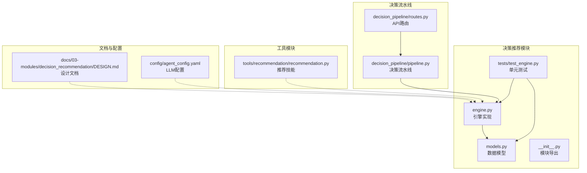
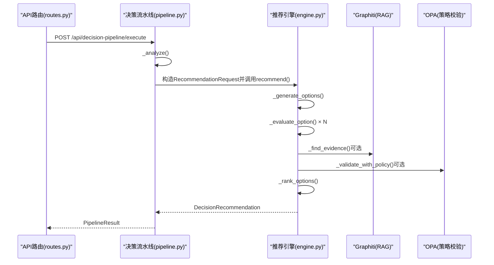
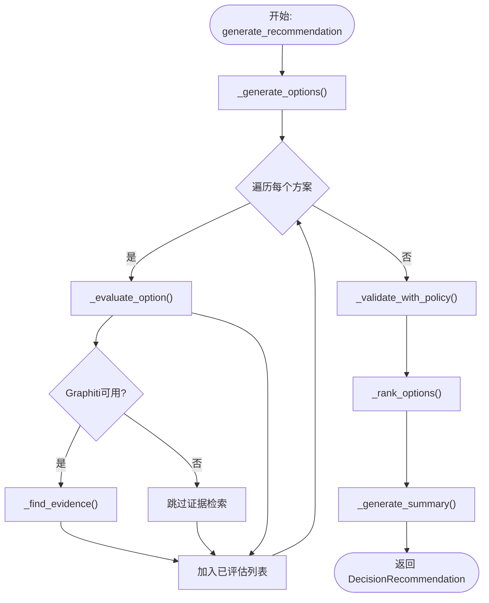
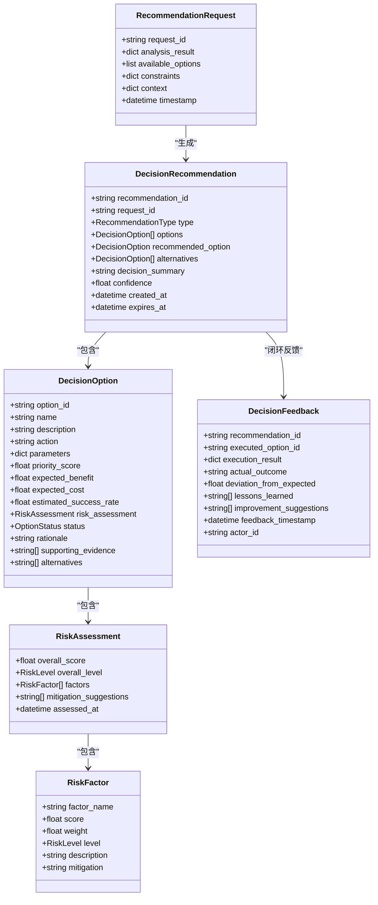
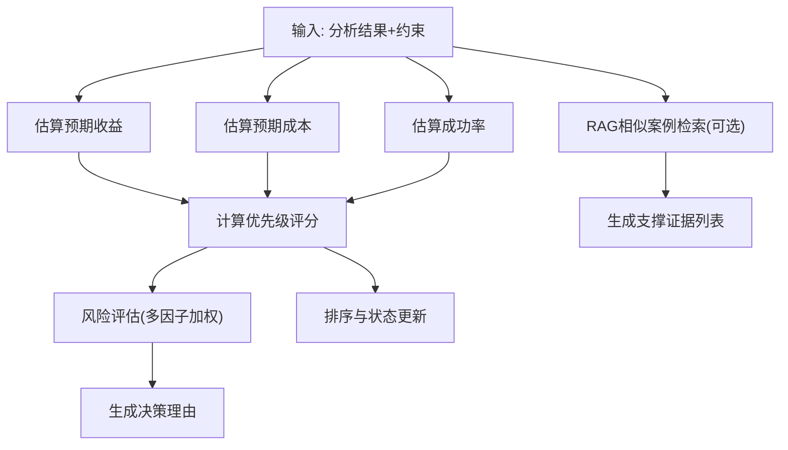
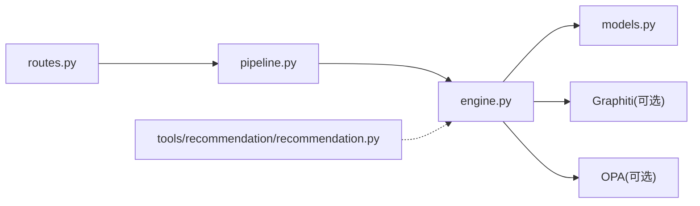

# 决策推荐引擎

<cite>
**本文引用的文件**
- [engine.py](file://odap/biz/decision/decision_recommendation/engine.py)
- [models.py](file://odap/biz/decision/decision_recommendation/models.py)
- [__init__.py](file://odap/biz/decision/decision_recommendation/__init__.py)
- [test_engine.py](file://odap/biz/decision/decision_recommendation/tests/test_engine.py)
- [pipeline.py](file://odap/biz/decision/decision_pipeline/pipeline.py)
- [routes.py](file://odap/biz/decision/decision_pipeline/routes.py)
- [recommendation.py](file://odap/tools/recommendation/recommendation.py)
- [DESIGN.md](file://docs/03-modules/decision_recommendation/DESIGN.md)
- [agent_config.yaml](file://config/agent_config.yaml)
</cite>

## 目录
1. [引言](#引言)
2. [项目结构](#项目结构)
3. [核心组件](#核心组件)
4. [架构总览](#架构总览)
5. [详细组件分析](#详细组件分析)
6. [依赖分析](#依赖分析)
7. [性能考量](#性能考量)
8. [故障排查指南](#故障排查指南)
9. [结论](#结论)
10. [附录](#附录)

## 引言
本文件面向 ODAP 决策推荐引擎，系统化阐述其算法实现、数据处理流程、配置参数、性能优化与扩展接口，并给出与决策组件的交互关系与数据流机制。该引擎位于“理解”之后、“执行”之前，负责将分析结果转化为可解释、可校验、可排序的决策建议，并支持策略校验与 RAG 增强。

## 项目结构
决策推荐引擎位于 odap/biz/decision/decision_recommendation，核心由引擎类、数据模型、测试与模块导出组成；同时与决策流水线、API 路由、工具模块协同工作。

**图表来源**
- [engine.py:1-603](file://odap/biz/decision/decision_recommendation/engine.py#L1-L603)
- [models.py:1-244](file://odap/biz/decision/decision_recommendation/models.py#L1-L244)
- [__init__.py:1-34](file://odap/biz/decision/decision_recommendation/__init__.py#L1-L34)
- [test_engine.py:1-309](file://odap/biz/decision/decision_recommendation/tests/test_engine.py#L1-L309)
- [pipeline.py:1-283](file://odap/biz/decision/decision_pipeline/pipeline.py#L1-L283)
- [routes.py:1-29](file://odap/biz/decision/decision_pipeline/routes.py#L1-L29)
- [recommendation.py:1-268](file://odap/tools/recommendation/recommendation.py#L1-L268)
- [DESIGN.md:1-860](file://docs/03-modules/decision_recommendation/DESIGN.md#L1-L860)
- [agent_config.yaml:1-23](file://config/agent_config.yaml#L1-L23)

**章节来源**
- [engine.py:1-603](file://odap/biz/decision/decision_recommendation/engine.py#L1-L603)
- [models.py:1-244](file://odap/biz/decision/decision_recommendation/models.py#L1-L244)
- [__init__.py:1-34](file://odap/biz/decision/decision_recommendation/__init__.py#L1-L34)
- [test_engine.py:1-309](file://odap/biz/decision/decision_recommendation/tests/test_engine.py#L1-L309)
- [pipeline.py:1-283](file://odap/biz/decision/decision_pipeline/pipeline.py#L1-L283)
- [routes.py:1-29](file://odap/biz/decision/decision_pipeline/routes.py#L1-L29)
- [recommendation.py:1-268](file://odap/tools/recommendation/recommendation.py#L1-L268)
- [DESIGN.md:1-860](file://docs/03-modules/decision_recommendation/DESIGN.md#L1-L860)
- [agent_config.yaml:1-23](file://config/agent_config.yaml#L1-L23)

## 核心组件
- 决策推荐引擎（DecisionRecommendationEngine）：接收 RecommendationRequest，生成候选方案，评估优先级与风险，进行策略校验，排序并输出 DecisionRecommendation。
- 数据模型：RecommendationRequest、DecisionOption、RiskAssessment、DecisionRecommendation、DecisionFeedback、枚举 RecommendationType、RiskLevel、OptionStatus 等。
- 模块导出：统一暴露引擎与模型，便于上层调用。
- 测试：覆盖推荐生成、优先级计算、风险评估、排序、置信度、摘要生成与反馈记录等关键路径。
- 决策流水线：将“理解”结果封装为 RecommendationRequest，调用引擎生成推荐，并与策略校验、执行、反馈形成闭环。
- 工具模块：提供通用推荐技能（如打击目标、任务规划、兵力部署），与引擎互补。

**章节来源**
- [engine.py:34-123](file://odap/biz/decision/decision_recommendation/engine.py#L34-L123)
- [models.py:14-244](file://odap/biz/decision/decision_recommendation/models.py#L14-L244)
- [__init__.py:10-34](file://odap/biz/decision/decision_recommendation/__init__.py#L10-L34)
- [test_engine.py:27-309](file://odap/biz/decision/decision_recommendation/tests/test_engine.py#L27-L309)
- [pipeline.py:162-198](file://odap/biz/decision/decision_pipeline/pipeline.py#L162-L198)
- [recommendation.py:20-268](file://odap/tools/recommendation/recommendation.py#L20-L268)

## 架构总览
引擎以“请求-评估-校验-排序-输出”为主线，结合 RAG 增强与策略校验，形成闭环反馈。

**图表来源**
- [routes.py:10-13](file://odap/biz/decision/decision_pipeline/routes.py#L10-L13)
- [pipeline.py:64-139](file://odap/biz/decision/decision_pipeline/pipeline.py#L64-L139)
- [engine.py:63-123](file://odap/biz/decision/decision_recommendation/engine.py#L63-L123)
- [engine.py:453-470](file://odap/biz/decision/decision_recommendation/engine.py#L453-L470)
- [engine.py:351-395](file://odap/biz/decision/decision_recommendation/engine.py#L351-L395)

## 详细组件分析

### 引擎类与处理流程
- 初始化：可注入 Graphiti 客户端与 OPA 管理器，支持 RAG 增强与策略校验。
- generate_recommendation：主流程包含候选方案生成、逐项评估、策略校验、排序与摘要生成。
- 评估指标：优先级评分（收益、成本、成功率加权）、预期收益、预期成本、成功率、风险评估（多因子加权）。
- 策略校验：构造输入上下文，调用 OPA 校验，根据结果更新状态与理由。
- 排序：过滤拒绝方案后按优先级与成功率排序，更新状态为推荐/备选。
- 置信度：综合方案数量、评分与证据数量计算。
- 反馈记录：可将执行后的反馈写入知识图谱（Graphiti）。

**图表来源**
- [engine.py:63-123](file://odap/biz/decision/decision_recommendation/engine.py#L63-L123)
- [engine.py:125-158](file://odap/biz/decision/decision_recommendation/engine.py#L125-L158)
- [engine.py:160-195](file://odap/biz/decision/decision_recommendation/engine.py#L160-L195)
- [engine.py:351-395](file://odap/biz/decision/decision_recommendation/engine.py#L351-L395)
- [engine.py:397-426](file://odap/biz/decision/decision_recommendation/engine.py#L397-L426)
- [engine.py:489-507](file://odap/biz/decision/decision_recommendation/engine.py#L489-L507)

**章节来源**
- [engine.py:46-123](file://odap/biz/decision/decision_recommendation/engine.py#L46-L123)
- [engine.py:125-195](file://odap/biz/decision/decision_recommendation/engine.py#L125-L195)
- [engine.py:197-268](file://odap/biz/decision/decision_recommendation/engine.py#L197-L268)
- [engine.py:270-350](file://odap/biz/decision/decision_recommendation/engine.py#L270-L350)
- [engine.py:351-426](file://odap/biz/decision/decision_recommendation/engine.py#L351-L426)
- [engine.py:428-470](file://odap/biz/decision/decision_recommendation/engine.py#L428-L470)
- [engine.py:489-530](file://odap/biz/decision/decision_recommendation/engine.py#L489-L530)

### 数据模型与关系

**图表来源**
- [models.py:38-244](file://odap/biz/decision/decision_recommendation/models.py#L38-L244)

**章节来源**
- [models.py:14-244](file://odap/biz/decision/decision_recommendation/models.py#L14-L244)

### 评分计算模型与相似度匹配
- 优先级评分：收益权重 0.5、成本权重 0.2、成功率权重 0.3，成本取反向评分。
- 预期收益：基于分析结果的价值评分，对高影响描述进行系数上调。
- 预期成本：基于约束中的最大成本归一化。
- 成功率：基于分析结果的成功率，严格模式下下调。
- 风险评估：执行风险、资源风险、时间风险、外部风险四因子加权，综合评分映射为风险等级。
- 相似度匹配（RAG）：使用 Graphiti 的 episode 搜索，查询方案名称与描述，返回支撑证据实体 ID 列表。

**图表来源**
- [engine.py:197-268](file://odap/biz/decision/decision_recommendation/engine.py#L197-L268)
- [engine.py:270-350](file://odap/biz/decision/decision_recommendation/engine.py#L270-L350)
- [engine.py:453-470](file://odap/biz/decision/decision_recommendation/engine.py#L453-L470)

**章节来源**
- [engine.py:197-350](file://odap/biz/decision/decision_recommendation/engine.py#L197-L350)
- [engine.py:453-470](file://odap/biz/decision/decision_recommendation/engine.py#L453-L470)

### 个性化权重配置
- 权重参数：优先级评分的收益、成本、成功率权重在引擎内部硬编码（可通过扩展参数化）。
- 风险评估权重：执行、资源、时间、外部风险因子权重在风险评估中固定。
- 策略校验：OPA 输入包含 action、parameters、context、constraints，校验结果决定状态与理由。
- 置信度：方案数量、评分、证据数量三要素加权合成。

**章节来源**
- [engine.py:207-219](file://odap/biz/decision/decision_recommendation/engine.py#L207-L219)
- [engine.py:280-324](file://odap/biz/decision/decision_recommendation/engine.py#L280-L324)
- [engine.py:509-530](file://odap/biz/decision/decision_recommendation/engine.py#L509-L530)
- [engine.py:351-395](file://odap/biz/decision/decision_recommendation/engine.py#L351-L395)

### 数据处理流程（从输入到输出）
- 输入：AnalysisResult（来自理解阶段）+ 上下文约束。
- 封装：RecommendationRequest（请求 ID、分析结果、约束、上下文）。
- 生成：候选方案（用户提供的或默认方案）。
- 评估：收益/成本/成功率/风险/理由。
- 校验：OPA 校验，更新状态与理由。
- 排序：过滤拒绝后按优先级与成功率排序。
- 输出：DecisionRecommendation（推荐方案、备选、摘要、置信度）。

**章节来源**
- [pipeline.py:162-198](file://odap/biz/decision/decision_pipeline/pipeline.py#L162-L198)
- [engine.py:63-123](file://odap/biz/decision/decision_recommendation/engine.py#L63-L123)
- [models.py:38-205](file://odap/biz/decision/decision_recommendation/models.py#L38-L205)

### 与决策组件的交互关系
- 决策流水线：将“理解”阶段产物封装为 RecommendationRequest，调用引擎生成推荐；若引擎不可用则回退。
- API 路由：提供 /execute、/analyze、/decide 接口，便于集成与调试。
- 工具模块：提供通用推荐技能（如打击目标、任务规划、兵力部署），与引擎互补，适合非结构化场景。

**章节来源**
- [pipeline.py:64-139](file://odap/biz/decision/decision_pipeline/pipeline.py#L64-L139)
- [routes.py:10-28](file://odap/biz/decision/decision_pipeline/routes.py#L10-L28)
- [recommendation.py:20-268](file://odap/tools/recommendation/recommendation.py#L20-L268)

### 集成与使用示例（路径指引）
- 通过 API 调用决策流水线执行：[routes.py:10-13](file://odap/biz/decision/decision_pipeline/routes.py#L10-L13)
- 在流水线中调用引擎生成推荐：[pipeline.py:162-198](file://odap/biz/decision/decision_pipeline/pipeline.py#L162-L198)
- 直接调用便捷函数创建推荐：[engine.py:579-602](file://odap/biz/decision/decision_recommendation/engine.py#L579-L602)
- 使用工具模块的推荐技能：[recommendation.py:20-268](file://odap/tools/recommendation/recommendation.py#L20-L268)

**章节来源**
- [routes.py:10-13](file://odap/biz/decision/decision_pipeline/routes.py#L10-L13)
- [pipeline.py:162-198](file://odap/biz/decision/decision_pipeline/pipeline.py#L162-L198)
- [engine.py:579-602](file://odap/biz/decision/decision_recommendation/engine.py#L579-L602)
- [recommendation.py:20-268](file://odap/tools/recommendation/recommendation.py#L20-L268)

## 依赖分析
- 内部依赖：engine 依赖 models 中的数据结构；__init__ 导出引擎与模型；tests 覆盖引擎与模型。
- 外部依赖：Graphiti（RAG 增强）、OPA（策略校验）、FastAPI（API 路由）、Pydantic（数据校验）。
- 与流水线耦合：pipeline 动态导入引擎，形成“理解→决策”的串联。

**图表来源**
- [routes.py:1-29](file://odap/biz/decision/decision_pipeline/routes.py#L1-L29)
- [pipeline.py:1-283](file://odap/biz/decision/decision_pipeline/pipeline.py#L1-L283)
- [engine.py:1-603](file://odap/biz/decision/decision_recommendation/engine.py#L1-L603)
- [models.py:1-244](file://odap/biz/decision/decision_recommendation/models.py#L1-L244)
- [recommendation.py:1-268](file://odap/tools/recommendation/recommendation.py#L1-L268)

**章节来源**
- [routes.py:1-29](file://odap/biz/decision/decision_pipeline/routes.py#L1-L29)
- [pipeline.py:1-283](file://odap/biz/decision/decision_pipeline/pipeline.py#L1-L283)
- [engine.py:1-603](file://odap/biz/decision/decision_recommendation/engine.py#L1-L603)
- [models.py:1-244](file://odap/biz/decision/decision_recommendation/models.py#L1-L244)
- [recommendation.py:1-268](file://odap/tools/recommendation/recommendation.py#L1-L268)

## 性能考量
- 异步化：引擎方法均为异步，利于 I/O 密集型（RAG、策略校验）并发。
- 评分与排序：复杂度近似 O(N) 评估 + O(N log N) 排序，N 为候选方案数。
- RAG 查询：限制返回条数（如 3），避免长上下文开销。
- 策略校验：OPA 调用串行，建议在上游聚合或缓存策略结果。
- 日志与可观测：关键步骤记录日志，便于定位性能瓶颈。

[本节为通用指导，无需具体文件引用]

## 故障排查指南
- OPA 未配置：跳过策略校验并记录警告，不影响推荐生成。
- RAG 查询失败：记录告警并返回空证据列表，保证流程继续。
- 反馈写入失败：记录错误并返回 False，不影响主流程。
- 测试覆盖：优先运行单元测试，验证推荐生成、优先级、风险评估、排序、置信度与摘要生成。

**章节来源**
- [engine.py:361-395](file://odap/biz/decision/decision_recommendation/engine.py#L361-L395)
- [engine.py:467-469](file://odap/biz/decision/decision_recommendation/engine.py#L467-L469)
- [engine.py:571-573](file://odap/biz/decision/decision_recommendation/engine.py#L571-L573)
- [test_engine.py:70-212](file://odap/biz/decision/decision_recommendation/tests/test_engine.py#L70-L212)

## 结论
该决策推荐引擎以清晰的职责划分与可插拔的 RAG/策略校验能力，实现了从理解结果到可执行建议的闭环。通过模块化设计与测试覆盖，具备良好的可维护性与扩展性。建议后续引入参数化权重、缓存策略结果与批量校验，进一步提升性能与灵活性。

## 附录

### 推荐类型与状态枚举
- 推荐类型：ACTION_PLAN、RESOURCE_ALLOCATION、PRIORITY_RANKING、ALTERNATIVE_SELECTION。
- 风险等级：LOW、MEDIUM、HIGH、CRITICAL。
- 方案状态：RECOMMENDED、ALTERNATIVE、REJECTED、PENDING。

**章节来源**
- [models.py:14-36](file://odap/biz/decision/decision_recommendation/models.py#L14-L36)

### 设计文档要点（参考）
- 模块定位：基于 Graphiti 的 RAG 增强推理，提供打击方案与决策支持。
- 接口设计：generate_recommendation、评估、校验、排序、摘要生成。
- 模拟推演：提供适配器与 Web 界面集成，支持策略对比与 What-if 分析。

**章节来源**
- [DESIGN.md:1-860](file://docs/03-modules/decision_recommendation/DESIGN.md#L1-L860)