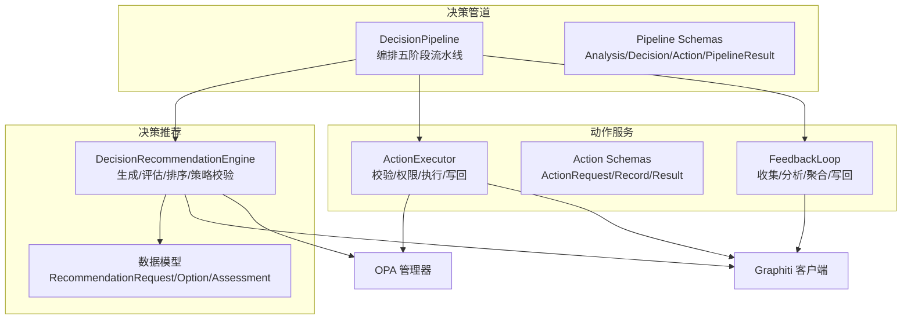
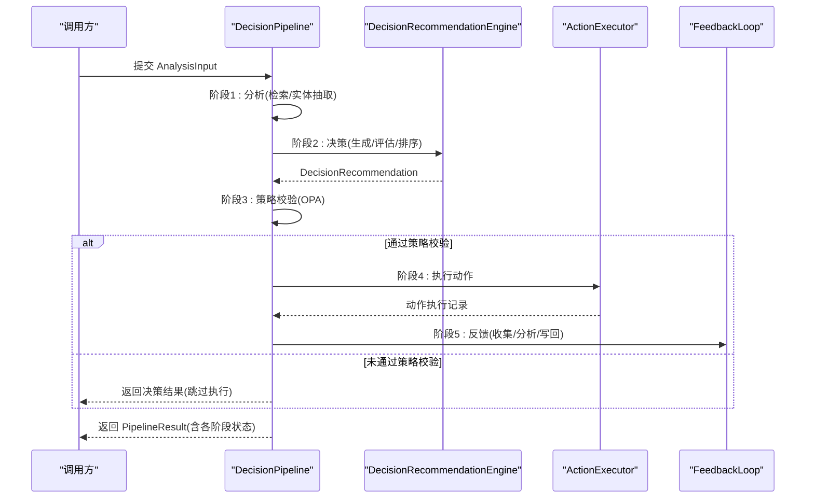
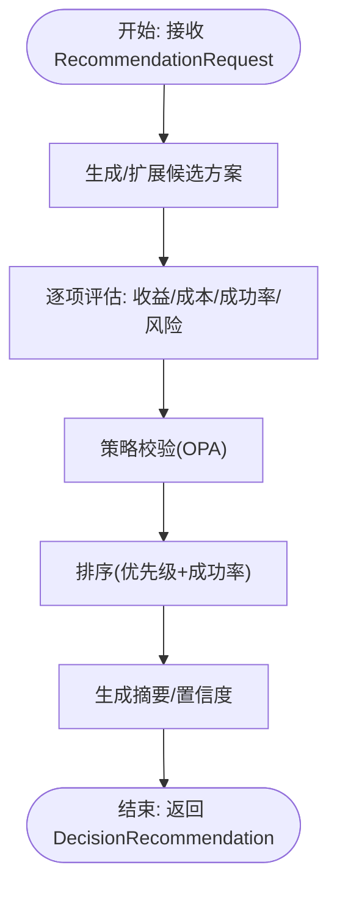
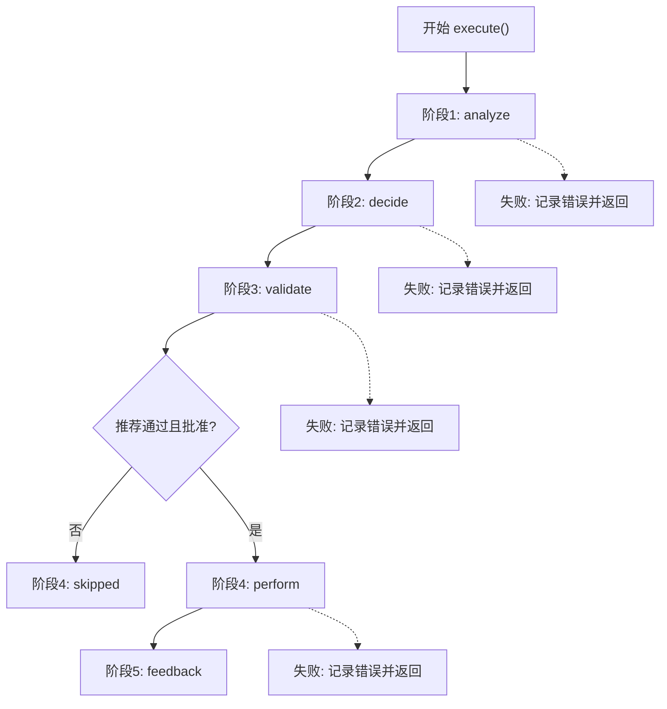
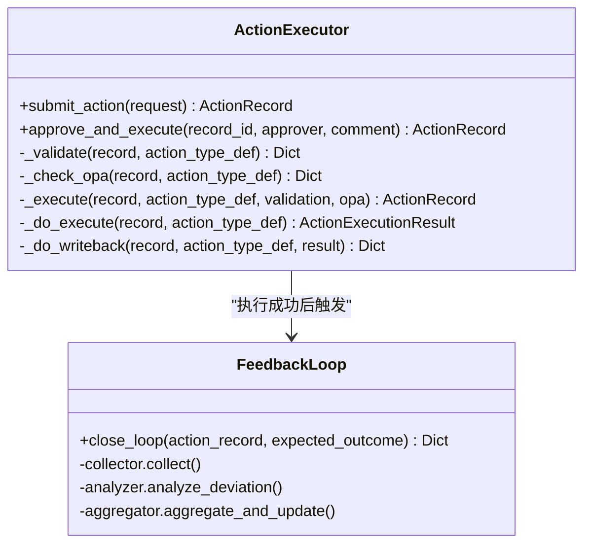
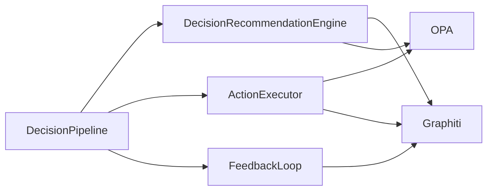

# 决策支持系统

<cite>
**本文引用的文件**
- [engine.py](file://odap/biz/decision/decision_recommendation/engine.py)
- [models.py](file://odap/biz/decision/decision_recommendation/models.py)
- [pipeline.py](file://odap/biz/decision/decision_pipeline/pipeline.py)
- [schemas.py](file://odap/biz/decision/decision_pipeline/schemas.py)
- [executor.py](file://odap/biz/decision/action_service/executor.py)
- [schemas.py](file://odap/biz/decision/action_service/schemas.py)
- [feedback_loop.py](file://odap/biz/decision/action_service/feedback_loop.py)
- [routes.py](file://odap/biz/decision/action_service/routes.py)
- [test_engine.py](file://odap/biz/decision/decision_recommendation/tests/test_engine.py)
- [DESIGN.md](file://docs/03-modules/decision_recommendation/DESIGN.md)
- [agent_config.yaml](file://config/agent_config.yaml)
</cite>

## 目录
1. [简介](#简介)
2. [项目结构](#项目结构)
3. [核心组件](#核心组件)
4. [架构总览](#架构总览)
5. [详细组件分析](#详细组件分析)
6. [依赖关系分析](#依赖关系分析)
7. [性能考虑](#性能考虑)
8. [故障排查指南](#故障排查指南)
9. [结论](#结论)
10. [附录](#附录)

## 简介
本文件面向业务分析师与系统集成商，系统性阐述 ODAP 决策支持系统的技术架构与实现细节，覆盖以下主题：
- 决策推荐引擎：推荐策略、评分机制、个性化配置与 RAG 增强
- 决策管道：输入处理、阶段执行、状态管理、结果输出
- 动作服务：动作执行器、反馈循环、写回机制、错误处理
- 配置选项、性能优化策略与扩展接口
- 使用与集成指南

## 项目结构
决策支持系统由三大子域构成：
- 决策推荐引擎：负责从“理解阶段”分析结果出发，生成候选方案、评估风险、策略校验与排序，输出推荐结论
- 决策管道：编排“理解-决策-策略校验-执行-反馈”的完整流水线，管理各阶段状态与错误
- 动作服务：封装动作提交、参数校验、OPA 权限检查、执行与写回，并驱动闭环反馈

**图表来源**
- [engine.py:34-123](file://odap/biz/decision/decision_recommendation/engine.py#L34-L123)
- [models.py:38-244](file://odap/biz/decision/decision_recommendation/models.py#L38-L244)
- [pipeline.py:13-139](file://odap/biz/decision/decision_pipeline/pipeline.py#L13-L139)
- [schemas.py:14-74](file://odap/biz/decision/decision_pipeline/schemas.py#L14-L74)
- [executor.py:10-175](file://odap/biz/decision/action_service/executor.py#L10-L175)
- [schemas.py:17-57](file://odap/biz/decision/action_service/schemas.py#L17-L57)
- [feedback_loop.py:290-310](file://odap/biz/decision/action_service/feedback_loop.py#L290-L310)

**章节来源**
- [engine.py:1-603](file://odap/biz/decision/decision_recommendation/engine.py#L1-L603)
- [pipeline.py:1-283](file://odap/biz/decision/decision_pipeline/pipeline.py#L1-L283)
- [executor.py:1-297](file://odap/biz/decision/action_service/executor.py#L1-L297)

## 核心组件
- 决策推荐引擎：接收分析结果，生成候选方案，计算优先级评分、预期收益/成本、成功率，进行风险评估与策略校验，最终排序并输出推荐
- 决策管道：按阶段顺序执行，失败时记录错误并终止后续阶段，成功则进入下一阶段
- 动作服务：动作提交与审批、参数校验、OPA 权限检查、执行与写回，以及闭环反馈

**章节来源**
- [engine.py:63-123](file://odap/biz/decision/decision_recommendation/engine.py#L63-L123)
- [pipeline.py:64-139](file://odap/biz/decision/decision_pipeline/pipeline.py#L64-L139)
- [executor.py:48-175](file://odap/biz/decision/action_service/executor.py#L48-L175)

## 架构总览
系统采用“流水线 + 引擎 + 服务”的分层架构：
- 输入层：AnalysisInput → AnalysisResult
- 决策层：RecommendationRequest → DecisionRecommendation（引擎）
- 策略层：OPA 管理器（ABAC）
- 执行层：ActionExecutor（校验/权限/执行/写回）
- 反馈层：FeedbackLoop（收集/分析/聚合）

**图表来源**
- [pipeline.py:64-139](file://odap/biz/decision/decision_pipeline/pipeline.py#L64-L139)
- [engine.py:63-123](file://odap/biz/decision/decision_recommendation/engine.py#L63-L123)
- [executor.py:48-175](file://odap/biz/decision/action_service/executor.py#L48-L175)
- [feedback_loop.py:296-300](file://odap/biz/decision/action_service/feedback_loop.py#L296-L300)

## 详细组件分析

### 决策推荐引擎
- 推荐策略
  - 若请求包含候选方案，则直接使用；否则基于分析结果生成默认方案
  - 评分机制：优先级评分 = 收益权重×收益 + 成本权重×(100-成本) + 成功率权重×成功率
  - 成功率估算受约束条件影响（如严格模式降低成功率）
  - 风险评估：执行、资源、时间、外部四类风险因子加权汇总，生成缓解建议
- 个性化配置
  - 支持通过上下文推断推荐类型（行动方案/资源分配/优先级排序/备选选择）
  - 置信度计算综合方案数量、评分与证据充分度
- RAG 增强
  - 使用 Graphiti 进行相似案例检索，补充支撑证据
- 反馈记录
  - 将执行后的反馈写入知识图谱，形成闭环学习

**图表来源**
- [engine.py:125-195](file://odap/biz/decision/decision_recommendation/engine.py#L125-L195)
- [engine.py:351-426](file://odap/biz/decision/decision_recommendation/engine.py#L351-L426)
- [engine.py:489-530](file://odap/biz/decision/decision_recommendation/engine.py#L489-L530)

**章节来源**
- [engine.py:125-195](file://odap/biz/decision/decision_recommendation/engine.py#L125-L195)
- [engine.py:197-268](file://odap/biz/decision/decision_recommendation/engine.py#L197-L268)
- [engine.py:351-426](file://odap/biz/decision/decision_recommendation/engine.py#L351-L426)
- [engine.py:489-530](file://odap/biz/decision/decision_recommendation/engine.py#L489-L530)
- [models.py:14-244](file://odap/biz/decision/decision_recommendation/models.py#L14-L244)

### 决策管道
- 阶段划分
  - analyze：语义检索、实体抽取、模式识别、风险识别
  - decide：调用决策引擎生成推荐
  - validate：OPA ABAC 权限检查（fail-closed）
  - perform：提交动作执行（仅当推荐通过且被批准）
  - feedback：执行完成后触发闭环反馈
- 状态管理
  - 每阶段独立状态（pending/running/completed/failed/skipped）
  - 任一阶段失败即记录错误并终止后续阶段
- 回退机制
  - 当引擎不可用时，使用本体动作服务生成候选动作作为回退

**图表来源**
- [pipeline.py:64-139](file://odap/biz/decision/decision_pipeline/pipeline.py#L64-L139)

**章节来源**
- [pipeline.py:64-139](file://odap/biz/decision/decision_pipeline/pipeline.py#L64-L139)
- [schemas.py:6-74](file://odap/biz/decision/decision_pipeline/schemas.py#L6-L74)

### 动作服务
- 动作执行器
  - 参数校验：必填参数缺失、目标对象类型不匹配
  - OPA 权限检查：按动作类型策略决定允许/拒绝（fail-closed）
  - 执行逻辑：根据动作类型路由到图操作（更新/创建/删除/链接），或通用属性更新
  - 写回机制：支持 Webhook 或图写回
- 反馈循环
  - 收集：根据执行结果判定成功/失败，提取结果数据与错误信息
  - 分析：比较实际与期望，计算偏差分数与根因
  - 聚合：更新目标实体属性、创建反馈事件、发出钩子事件
- API 接口
  - 提交动作、审批后执行、查询记录与按目标筛选

**图表来源**
- [executor.py:10-175](file://odap/biz/decision/action_service/executor.py#L10-L175)
- [feedback_loop.py:290-310](file://odap/biz/decision/action_service/feedback_loop.py#L290-L310)

**章节来源**
- [executor.py:48-175](file://odap/biz/decision/action_service/executor.py#L48-L175)
- [executor.py:177-245](file://odap/biz/decision/action_service/executor.py#L177-L245)
- [executor.py:247-286](file://odap/biz/decision/action_service/executor.py#L247-L286)
- [feedback_loop.py:296-300](file://odap/biz/decision/action_service/feedback_loop.py#L296-L300)
- [routes.py:13-54](file://odap/biz/decision/action_service/routes.py#L13-L54)

## 依赖关系分析
- 组件耦合
  - 决策管道对引擎、OPA、动作执行器与反馈循环存在直接依赖
  - 引擎对 Graphiti 与 OPA 存在可选依赖（RAG 增强与策略校验）
  - 动作执行器对 OMS、图管理器与 OPA 存在可选依赖
- 失败策略
  - fail-closed：OPA 未配置或异常时，默认拒绝
  - fail-silent：Graphiti 查询失败时记录告警并降级
- 外部集成
  - Graphiti：RAG 检索、知识图谱写入
  - OPA：ABAC 权限校验
  - FastAPI：动作服务对外 API

**图表来源**
- [pipeline.py:21-62](file://odap/biz/decision/decision_pipeline/pipeline.py#L21-L62)
- [engine.py:48-59](file://odap/biz/decision/decision_recommendation/engine.py#L48-L59)
- [executor.py:17-46](file://odap/biz/decision/action_service/executor.py#L17-L46)

**章节来源**
- [pipeline.py:21-62](file://odap/biz/decision/decision_pipeline/pipeline.py#L21-L62)
- [engine.py:48-59](file://odap/biz/decision/decision_recommendation/engine.py#L48-L59)
- [executor.py:17-46](file://odap/biz/decision/action_service/executor.py#L17-L46)

## 性能考虑
- 异步执行
  - 引擎与管道阶段均采用异步方法，提升并发与吞吐
- 缓存与懒加载
  - 管道与执行器内部使用属性装饰器延迟初始化依赖组件，减少启动开销
- 降级策略
  - OPA 不可用时 fail-closed，Graphiti 查询失败时降级并记录警告
- I/O 优化
  - 动作执行前先参数校验与 OPA 检查，避免无效执行
- 风险评估与排序
  - 评分与排序复杂度与候选方案数量线性相关，建议限制最大候选数以控制时延

[本节为通用指导，无需具体文件引用]

## 故障排查指南
- 决策阶段
  - 若无候选方案，引擎会生成默认方案；检查分析结果是否包含推荐动作与参数
  - 策略校验失败时，查看 OPA 返回原因；确认动作类型策略配置正确
- 管道阶段
  - analyze/decide/validate/perform 任一阶段失败会在 PipelineResult 中记录错误；按阶段状态定位问题
  - OPA 未配置或异常会导致 fail-closed，需检查 OPA 服务连通性与策略
- 动作执行
  - 参数校验失败会直接拒绝；检查必填参数与目标对象类型
  - OPA 拒绝或异常会 fail-closed；检查动作类型策略与环境变量
  - 执行失败会记录错误信息；查看执行结果中的消息与数据
- 反馈循环
  - 收集/分析/聚合任一步骤异常会记录告警；检查图写入与钩子注册

**章节来源**
- [engine.py:351-395](file://odap/biz/decision/decision_recommendation/engine.py#L351-L395)
- [pipeline.py:81-122](file://odap/biz/decision/decision_pipeline/pipeline.py#L81-L122)
- [executor.py:56-91](file://odap/biz/decision/action_service/executor.py#L56-L91)
- [feedback_loop.py:177-212](file://odap/biz/decision/action_service/feedback_loop.py#L177-L212)

## 结论
该决策支持系统通过“理解-决策-策略校验-执行-反馈”的闭环流水线，结合 RAG 增强与 OPA 策略治理，实现了可解释、可审计、可扩展的智能决策能力。动作服务提供了完善的参数校验、权限控制与写回机制，配合反馈循环形成持续改进闭环。建议在生产环境中启用 OPA 并配置 Graphiti，同时结合业务场景优化候选方案数量与评分权重。

[本节为总结性内容，无需具体文件引用]

## 附录

### A. 推荐类型与数据模型
- 推荐类型：行动方案、资源配置、优先级排序、备选选择
- 关键模型：RecommendationRequest、DecisionOption、RiskAssessment、DecisionRecommendation、DecisionFeedback

**章节来源**
- [models.py:14-244](file://odap/biz/decision/decision_recommendation/models.py#L14-L244)

### B. 决策管道数据模型
- AnalysisInput/AnalysisResult：输入查询与上下文、输出摘要/实体/风险/置信度
- DecisionResult：推荐/备选方案、OPA 审批结果、推理与置信度
- ActionCommand/PipelineResult：动作命令与流水线结果、阶段状态与错误

**章节来源**
- [schemas.py:14-74](file://odap/biz/decision/decision_pipeline/schemas.py#L14-L74)

### C. 动作服务数据模型
- ActionRequest/ActionRecord：动作请求与记录、状态与结果
- ActionExecutionResult：执行结果与写回状态

**章节来源**
- [schemas.py:17-57](file://odap/biz/decision/action_service/schemas.py#L17-L57)

### D. 动作服务 API
- 提交动作：POST /api/actions/submit
- 审批并执行：POST /api/actions/{record_id}/approve
- 查询记录：GET /api/actions/records
- 获取单条记录：GET /api/actions/records/{record_id}
- 按目标筛选：GET /api/actions/target/{target_object_id}

**章节来源**
- [routes.py:13-54](file://odap/biz/decision/action_service/routes.py#L13-L54)

### E. 配置选项
- LLM Provider 配置（示例）：默认 OpenAI，可切换其他提供商与模型参数

**章节来源**
- [agent_config.yaml:1-23](file://config/agent_config.yaml#L1-L23)

### F. 测试要点
- 引擎单元测试覆盖：推荐生成、优先级计算、风险评估、排序、置信度、摘要生成、反馈记录
- 建议在集成测试中验证：OPA 策略、Graphiti RAG、动作执行与反馈写回

**章节来源**
- [test_engine.py:69-304](file://odap/biz/decision/decision_recommendation/tests/test_engine.py#L69-L304)