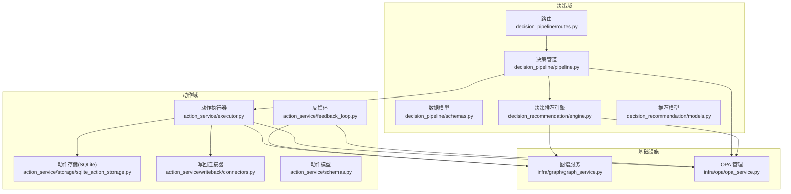
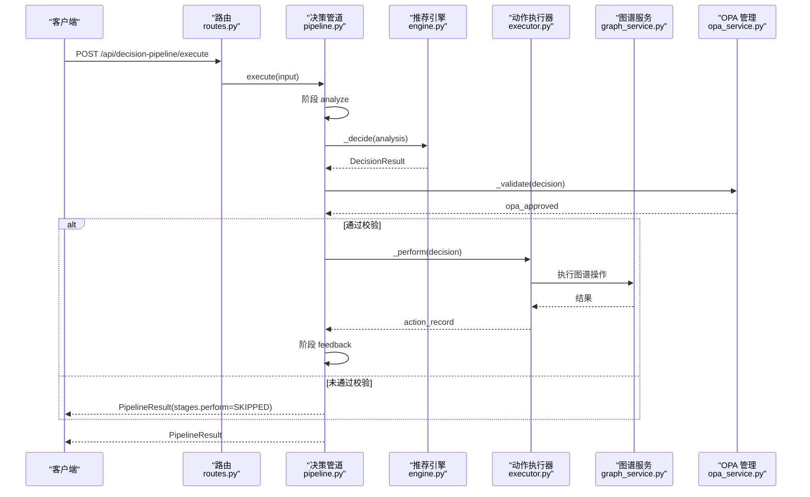
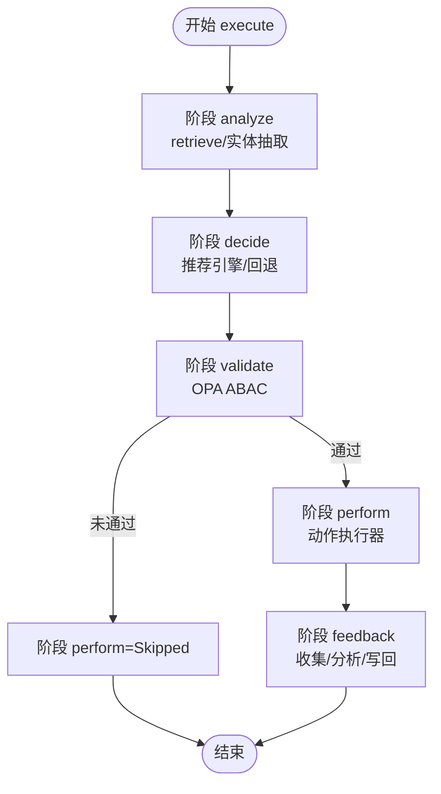
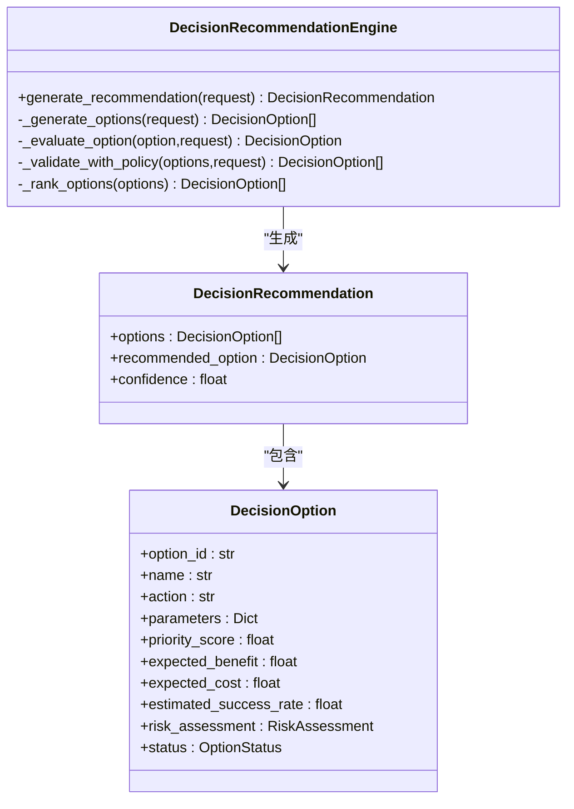
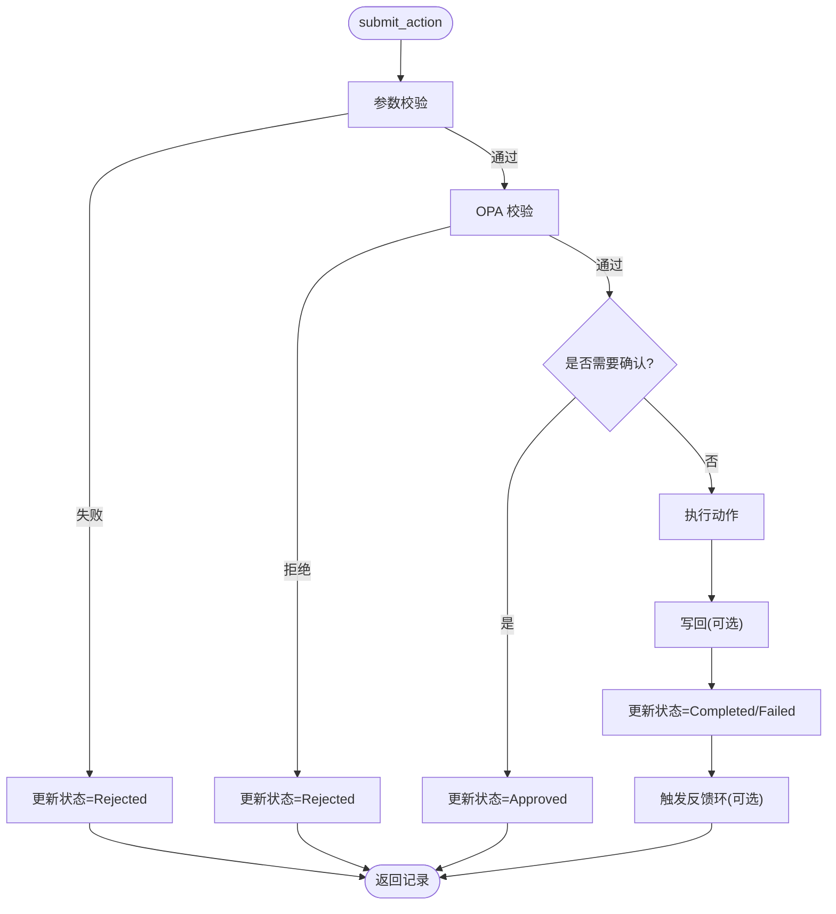
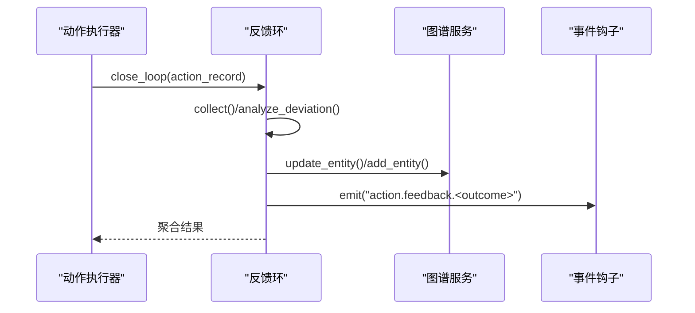
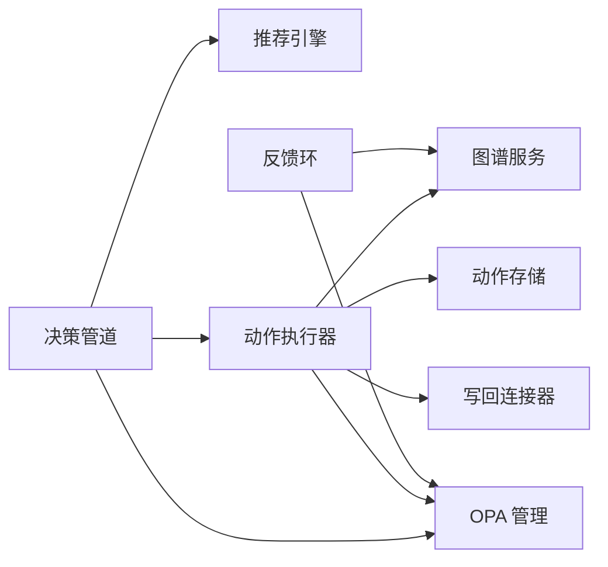

# 决策管道

<cite>
**本文引用的文件**
- [odap/biz/decision/decision_pipeline/pipeline.py](file://odap/biz/decision/decision_pipeline/pipeline.py)
- [odap/biz/decision/decision_pipeline/routes.py](file://odap/biz/decision/decision_pipeline/routes.py)
- [odap/biz/decision/decision_pipeline/schemas.py](file://odap/biz/decision/decision_pipeline/schemas.py)
- [odap/biz/decision/action_service/executor.py](file://odap/biz/decision/action_service/executor.py)
- [odap/biz/decision/action_service/feedback_loop.py](file://odap/biz/decision/action_service/feedback_loop.py)
- [odap/biz/decision/action_service/schemas.py](file://odap/biz/decision/action_service/schemas.py)
- [odap/biz/decision/action_service/storage/sqlite_action_storage.py](file://odap/biz/decision/action_service/storage/sqlite_action_storage.py)
- [odap/biz/decision/action_service/writeback/connectors.py](file://odap/biz/decision/action_service/writeback/connectors.py)
- [odap/biz/decision/decision_recommendation/engine.py](file://odap/biz/decision/decision_recommendation/engine.py)
- [odap/biz/decision/decision_recommendation/models.py](file://odap/biz/decision/decision_recommendation/models.py)
- [odap/infra/graph/graph_service.py](file://odap/infra/graph/graph_service.py)
- [odap/infra/opa/opa_service.py](file://odap/infra/opa/opa_service.py)
- [config/agent_config.yaml](file://config/agent_config.yaml)
</cite>

## 目录
1. [简介](#简介)
2. [项目结构](#项目结构)
3. [核心组件](#核心组件)
4. [架构总览](#架构总览)
5. [详细组件分析](#详细组件分析)
6. [依赖分析](#依赖分析)
7. [性能考虑](#性能考虑)
8. [故障排查指南](#故障排查指南)
9. [结论](#结论)
10. [附录](#附录)

## 简介
本文件为 ODAP 决策管道系统的全面技术文档，聚焦“从输入到输出”的完整决策流程，覆盖以下主题：
- 管道执行引擎：阶段化流水线、状态管理、错误处理与回退策略
- 状态管理机制：阶段状态枚举、持久化记录与跨阶段传递
- 并发控制策略：异步执行、连接池与断路器
- 决策流程：理解（检索/抽取）→ 决策（推荐/风险评估）→ 策略校验（OPA）→ 执行（图谱/写回）→ 反馈（闭环）
- 管道配置管理：动态路由、策略与写回配置
- 扩展接口：自定义节点与写回通道的开发与集成
- API 参考与使用示例：HTTP 接口、请求/响应模型、典型调用序列

## 项目结构
决策管道位于 odap/biz/decision 下，围绕“决策管道”“动作服务”“决策推荐引擎”三大子域协同工作，并通过基础设施模块（图谱、OPA）提供能力支撑。

**图表来源**
- [odap/biz/decision/decision_pipeline/pipeline.py:13-283](file://odap/biz/decision/decision_pipeline/pipeline.py#L13-L283)
- [odap/biz/decision/decision_pipeline/routes.py:1-29](file://odap/biz/decision/decision_pipeline/routes.py#L1-L29)
- [odap/biz/decision/decision_pipeline/schemas.py:1-74](file://odap/biz/decision/decision_pipeline/schemas.py#L1-L74)
- [odap/biz/decision/decision_recommendation/engine.py:34-603](file://odap/biz/decision/decision_recommendation/engine.py#L34-L603)
- [odap/biz/decision/decision_recommendation/models.py:1-244](file://odap/biz/decision/decision_recommendation/models.py#L1-L244)
- [odap/biz/decision/action_service/executor.py:10-297](file://odap/biz/decision/action_service/executor.py#L10-L297)
- [odap/biz/decision/action_service/storage/sqlite_action_storage.py:12-153](file://odap/biz/decision/action_service/storage/sqlite_action_storage.py#L12-L153)
- [odap/biz/decision/action_service/feedback_loop.py:290-311](file://odap/biz/decision/action_service/feedback_loop.py#L290-L311)
- [odap/biz/decision/action_service/writeback/connectors.py:131-190](file://odap/biz/decision/action_service/writeback/connectors.py#L131-L190)
- [odap/infra/graph/graph_service.py:71-800](file://odap/infra/graph/graph_service.py#L71-L800)
- [odap/infra/opa/opa_service.py:455-750](file://odap/infra/opa/opa_service.py#L455-L750)

**章节来源**
- [odap/biz/decision/decision_pipeline/pipeline.py:13-283](file://odap/biz/decision/decision_pipeline/pipeline.py#L13-L283)
- [odap/biz/decision/decision_pipeline/routes.py:1-29](file://odap/biz/decision/decision_pipeline/routes.py#L1-L29)
- [odap/biz/decision/decision_pipeline/schemas.py:1-74](file://odap/biz/decision/decision_pipeline/schemas.py#L1-L74)
- [odap/biz/decision/action_service/executor.py:10-297](file://odap/biz/decision/action_service/executor.py#L10-L297)
- [odap/biz/decision/action_service/feedback_loop.py:290-311](file://odap/biz/decision/action_service/feedback_loop.py#L290-L311)
- [odap/biz/decision/action_service/storage/sqlite_action_storage.py:12-153](file://odap/biz/decision/action_service/storage/sqlite_action_storage.py#L12-L153)
- [odap/biz/decision/action_service/writeback/connectors.py:131-190](file://odap/biz/decision/action_service/writeback/connectors.py#L131-L190)
- [odap/biz/decision/decision_recommendation/engine.py:34-603](file://odap/biz/decision/decision_recommendation/engine.py#L34-L603)
- [odap/biz/decision/decision_recommendation/models.py:1-244](file://odap/biz/decision/decision_recommendation/models.py#L1-L244)
- [odap/infra/graph/graph_service.py:71-800](file://odap/infra/graph/graph_service.py#L71-L800)
- [odap/infra/opa/opa_service.py:455-750](file://odap/infra/opa/opa_service.py#L455-L750)

## 核心组件
- 决策管道引擎：负责串联“理解→决策→校验→执行→反馈”各阶段，维护阶段状态与错误传播
- 决策推荐引擎：基于分析结果生成候选方案、评估优先级与风险、结合 OPA 策略校验
- 动作执行器：校验参数与目标类型、OPA 权限检查、执行图谱操作、写回与反馈闭环
- 反馈环：收集执行结果、偏差分析、生成经验教训并写入图谱与事件钩子
- 基础设施：图谱服务（Neo4j/回退）、OPA 管理（ABAC/Bundle/沙箱）

**章节来源**
- [odap/biz/decision/decision_pipeline/pipeline.py:13-283](file://odap/biz/decision/decision_pipeline/pipeline.py#L13-L283)
- [odap/biz/decision/decision_recommendation/engine.py:34-603](file://odap/biz/decision/decision_recommendation/engine.py#L34-L603)
- [odap/biz/decision/action_service/executor.py:10-297](file://odap/biz/decision/action_service/executor.py#L10-L297)
- [odap/biz/decision/action_service/feedback_loop.py:290-311](file://odap/biz/decision/action_service/feedback_loop.py#L290-L311)
- [odap/infra/graph/graph_service.py:71-800](file://odap/infra/graph/graph_service.py#L71-L800)
- [odap/infra/opa/opa_service.py:455-750](file://odap/infra/opa/opa_service.py#L455-L750)

## 架构总览
决策管道以 FastAPI 路由入口对外提供 HTTP 接口，内部通过异步协程串行执行各阶段。关键特性：
- 阶段化状态机：pending/running/completed/failed/skipped
- 失败即停：任一阶段失败立即记录错误并终止后续阶段
- 策略校验：OPA ABAC 在“决策→执行”两处进行 fail-closed 校验
- 写回与反馈：执行成功后写回图谱或外部 Webhook，并触发反馈闭环

**图表来源**
- [odap/biz/decision/decision_pipeline/routes.py:10-13](file://odap/biz/decision/decision_pipeline/routes.py#L10-L13)
- [odap/biz/decision/decision_pipeline/pipeline.py:64-139](file://odap/biz/decision/decision_pipeline/pipeline.py#L64-L139)
- [odap/biz/decision/decision_recommendation/engine.py:63-123](file://odap/biz/decision/decision_recommendation/engine.py#L63-L123)
- [odap/biz/decision/action_service/executor.py:48-92](file://odap/biz/decision/action_service/executor.py#L48-L92)
- [odap/infra/opa/opa_service.py:394-407](file://odap/infra/opa/opa_service.py#L394-L407)
- [odap/infra/graph/graph_service.py:758-794](file://odap/infra/graph/graph_service.py#L758-L794)

## 详细组件分析

### 决策管道引擎（DecisionPipeline）
- 职责：编排理解、决策、校验、执行、反馈五阶段；维护 pipeline_id 与阶段状态；失败即停并记录错误
- 关键点：
  - 阶段状态：Pending/Running/Completed/Failed/Skipped
  - 失败即停：任一阶段异常会设置对应阶段为 Failed，并将错误信息写入 result.error
  - 回退策略：推荐引擎不可用时，使用本体动作类型生成候选方案
  - OPA 校验：fail-closed，未配置 OPA 时 opa_approved=false
  - 执行前置条件：仅当 recommended_option 存在且 opa_approved=true 时执行

**图表来源**
- [odap/biz/decision/decision_pipeline/pipeline.py:64-139](file://odap/biz/decision/decision_pipeline/pipeline.py#L64-L139)

**章节来源**
- [odap/biz/decision/decision_pipeline/pipeline.py:13-283](file://odap/biz/decision/decision_pipeline/pipeline.py#L13-L283)

### 决策推荐引擎（DecisionRecommendationEngine）
- 职责：接收分析结果，生成候选方案，评估优先级与风险，策略校验，排序并输出推荐
- 关键点：
  - 评估指标：优先级评分、预期收益/成本、成功率、风险评估
  - 策略校验：OPA validate（可选），fail-closed
  - RAG 增强：Graphiti episode 搜索（可选）
  - 反馈闭环：记录执行反馈并写入知识图谱（可选）

**图表来源**
- [odap/biz/decision/decision_recommendation/engine.py:34-603](file://odap/biz/decision/decision_recommendation/engine.py#L34-L603)
- [odap/biz/decision/decision_recommendation/models.py:161-206](file://odap/biz/decision/decision_recommendation/models.py#L161-L206)

**章节来源**
- [odap/biz/decision/decision_recommendation/engine.py:34-603](file://odap/biz/decision/decision_recommendation/engine.py#L34-L603)
- [odap/biz/decision/decision_recommendation/models.py:1-244](file://odap/biz/decision/decision_recommendation/models.py#L1-L244)

### 动作执行器（ActionExecutor）
- 职责：动作生命周期管理（校验→OPA→执行→写回→反馈）
- 关键点：
  - 参数校验：必填参数缺失、目标类型不匹配
  - OPA 校验：按动作类型策略决定允许与否
  - 执行器：根据动作名映射到图谱操作（更新/创建/删除/链接/通用属性更新）
  - 写回：支持 Webhook/图谱写回，失败不阻塞主流程
  - 反馈：执行完成后触发反馈环

**图表来源**
- [odap/biz/decision/action_service/executor.py:48-175](file://odap/biz/decision/action_service/executor.py#L48-L175)

**章节来源**
- [odap/biz/decision/action_service/executor.py:10-297](file://odap/biz/decision/action_service/executor.py#L10-L297)
- [odap/biz/decision/action_service/schemas.py:17-57](file://odap/biz/decision/action_service/schemas.py#L17-L57)
- [odap/biz/decision/action_service/storage/sqlite_action_storage.py:12-153](file://odap/biz/decision/action_service/storage/sqlite_action_storage.py#L12-L153)
- [odap/biz/decision/action_service/writeback/connectors.py:131-190](file://odap/biz/decision/action_service/writeback/connectors.py#L131-L190)

### 反馈环（FeedbackLoop）
- 职责：收集执行结果→偏差分析→生成经验教训→写入图谱/事件钩子
- 关键点：
  - 偏差评分与根因：基于执行结果与预期差异
  - 图谱更新：将反馈事件写入图谱
  - 钩子发射：通过事件钩子系统广播反馈事件

**图表来源**
- [odap/biz/decision/action_service/feedback_loop.py:290-311](file://odap/biz/decision/action_service/feedback_loop.py#L290-L311)
- [odap/infra/graph/graph_service.py:758-794](file://odap/infra/graph/graph_service.py#L758-L794)

**章节来源**
- [odap/biz/decision/action_service/feedback_loop.py:23-311](file://odap/biz/decision/action_service/feedback_loop.py#L23-L311)

### 图谱服务（GraphManager）
- 职责：提供图谱读写能力，支持三层降级（Graphiti→Neo4j Driver→NetworkX 回退）
- 关键点：
  - 连接池与断路器：提升稳定性与性能
  - 多模式查询/更新：统一接口，自动降级
  - 性能监控：查询耗时、命中率、连接池状态

**章节来源**
- [odap/infra/graph/graph_service.py:71-800](file://odap/infra/graph/graph_service.py#L71-L800)

### OPA 管理（OPAManager）
- 职责：ABAC 策略评估、策略 Bundle 热更新、策略沙箱、批量权限检查与缓存
- 关键点：
  - fail-closed：异常或未配置时默认拒绝
  - 缓存：LRU + TTL，降低 OPA 调用压力
  - 沙箱：What-If 分析与策略模拟

**章节来源**
- [odap/infra/opa/opa_service.py:455-750](file://odap/infra/opa/opa_service.py#L455-L750)

## 依赖分析
- 决策管道对推荐引擎与动作执行器存在运行时依赖；对 OPA 与图谱服务为可选依赖，具备 fail-closed 与回退能力
- 动作执行器内部依赖 SQLite 动作存储、图谱服务与 OPA；写回模块通过连接器抽象支持多种后端
- 反馈环依赖图谱服务与事件钩子系统

**图表来源**
- [odap/biz/decision/decision_pipeline/pipeline.py:13-62](file://odap/biz/decision/decision_pipeline/pipeline.py#L13-L62)
- [odap/biz/decision/action_service/executor.py:10-46](file://odap/biz/decision/action_service/executor.py#L10-L46)
- [odap/biz/decision/action_service/feedback_loop.py:23-32](file://odap/biz/decision/action_service/feedback_loop.py#L23-L32)

**章节来源**
- [odap/biz/decision/decision_pipeline/pipeline.py:13-62](file://odap/biz/decision/decision_pipeline/pipeline.py#L13-L62)
- [odap/biz/decision/action_service/executor.py:10-46](file://odap/biz/decision/action_service/executor.py#L10-L46)
- [odap/biz/decision/action_service/feedback_loop.py:23-32](file://odap/biz/decision/action_service/feedback_loop.py#L23-L32)

## 性能考虑
- 异步执行：推荐引擎、OPA、图谱操作均采用异步，减少阻塞
- 连接池与断路器：图谱服务内置连接池与断路器，避免雪崩
- 缓存：OPA 管理器对权限检查结果进行缓存，降低重复调用
- 写回非阻塞：执行完成后写回与反馈，不影响主流程完成
- SQLite 存储：动作记录持久化，支持状态查询与审计

[本节为通用指导，无需具体文件引用]

## 故障排查指南
- 管道阶段失败：
  - 查看 PipelineResult.stages 中对应阶段状态与 error 字段
  - 常见原因：理解阶段检索异常、推荐引擎不可用、OPA 校验失败、执行器参数校验失败
- OPA 相关：
  - 若未配置 OPA 或 OPA 不可用，默认 fail-closed，需检查 OPA 服务健康与策略加载
- 动作执行失败：
  - 检查动作类型定义、目标对象类型与参数完整性
  - 查看动作记录的状态与 execution_result
- 写回失败：
  - Webhook/图谱写回失败不影响执行完成，可在动作记录中查看 writeback_result
- 反馈环异常：
  - 检查图谱更新与事件钩子是否正常，关注日志 warning

**章节来源**
- [odap/biz/decision/decision_pipeline/pipeline.py:81-97](file://odap/biz/decision/decision_pipeline/pipeline.py#L81-L97)
- [odap/biz/decision/action_service/executor.py:85-91](file://odap/biz/decision/action_service/executor.py#L85-L91)
- [odap/biz/decision/action_service/feedback_loop.py:177-212](file://odap/biz/decision/action_service/feedback_loop.py#L177-L212)

## 结论
ODAP 决策管道通过阶段化流水线、可插拔的推荐与执行模块、严格的策略校验与闭环反馈，实现了从“输入→理解→决策→执行→反馈”的全链路自动化。其可选依赖与 fail-closed 设计提升了系统韧性，异步与缓存优化保障了性能。通过标准化的数据模型与写回接口，便于扩展新的动作类型与外部系统集成。

[本节为总结，无需具体文件引用]

## 附录

### API 参考

- 路由前缀：/api/decision-pipeline
- 方法与路径
  - POST /execute
    - 请求体：AnalysisInput
    - 返回体：PipelineResult
  - POST /analyze
    - 请求体：AnalysisInput
    - 返回体：AnalysisResult
  - POST /decide
    - 请求体：AnalysisInput
    - 返回体：DecisionResult

- 数据模型
  - AnalysisInput：query、context、workspace_id、scenario_id、agent_id
  - AnalysisResult：summary、entities、patterns、risks、confidence、raw_context
  - DecisionOption：option_id、name、description、action_type_id、target_object_id、parameters、risk_level、priority
  - DecisionResult：decision_id、recommended_option、alternative_options、opa_approved、opa_decision、reasoning、confidence
  - ActionCommand：动作命令（与执行器 ActionRequest 对应）
  - PipelineResult：pipeline_id、analysis、decision、action_record、feedback、stages、error

**章节来源**
- [odap/biz/decision/decision_pipeline/routes.py:10-29](file://odap/biz/decision/decision_pipeline/routes.py#L10-L29)
- [odap/biz/decision/decision_pipeline/schemas.py:14-74](file://odap/biz/decision/decision_pipeline/schemas.py#L14-L74)
- [odap/biz/decision/action_service/schemas.py:17-57](file://odap/biz/decision/action_service/schemas.py#L17-L57)

### 使用示例

- 执行完整决策流程
  - 请求：POST /api/decision-pipeline/execute
  - Body：包含 query、context、agent_id 等字段
  - 返回：PipelineResult，包含各阶段状态与最终决策

- 仅执行分析阶段
  - 请求：POST /api/decision-pipeline/analyze
  - Body：AnalysisInput
  - 返回：AnalysisResult

- 仅执行决策阶段
  - 请求：POST /api/decision-pipeline/decide
  - Body：AnalysisInput
  - 返回：DecisionResult

- 动作执行
  - 提交动作请求：ActionRequest（包含 action_type_id、target_object_id、parameters 等）
  - 动作记录：ActionRecord（包含状态、OPA 决策、执行结果、写回结果等）
  - 写回：通过 writeback_config 指定类型（webhook/graph）

**章节来源**
- [odap/biz/decision/decision_pipeline/routes.py:10-29](file://odap/biz/decision/decision_pipeline/routes.py#L10-L29)
- [odap/biz/decision/action_service/schemas.py:17-57](file://odap/biz/decision/action_service/schemas.py#L17-L57)
- [odap/biz/decision/action_service/writeback/connectors.py:131-190](file://odap/biz/decision/action_service/writeback/connectors.py#L131-L190)

### 扩展接口与最佳实践

- 自定义动作类型
  - 在 OMS（动作类型注册中心）中注册动作类型，定义参数、目标类型、OPA 策略与写回配置
  - 动作执行器根据动作名映射到图谱操作，必要时扩展执行分支

- 自定义写回通道
  - 实现 WritebackConnector 抽象类，注册到 WritebackManager
  - 通过 writeback_config.type 指定连接器类型

- 动态路由与配置
  - 通过 AnalysisInput.context 注入约束与上下文，影响推荐与策略校验
  - Agent 配置可通过 config/agent_config.yaml 管理不同提供商参数

**章节来源**
- [odap/biz/decision/action_service/executor.py:177-245](file://odap/biz/decision/action_service/executor.py#L177-L245)
- [odap/biz/decision/action_service/writeback/connectors.py:20-32](file://odap/biz/decision/action_service/writeback/connectors.py#L20-L32)
- [config/agent_config.yaml:1-23](file://config/agent_config.yaml#L1-L23)