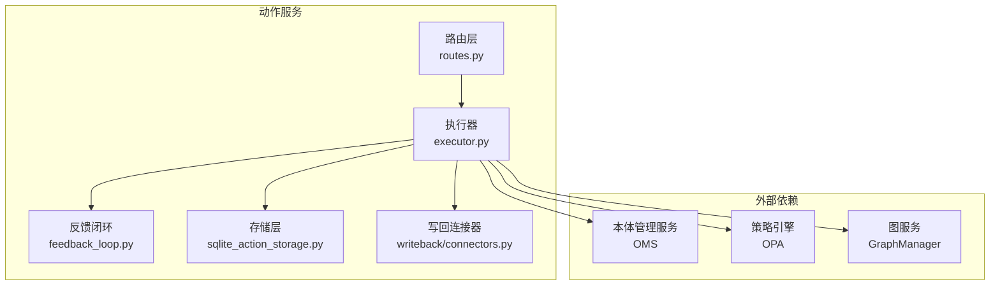
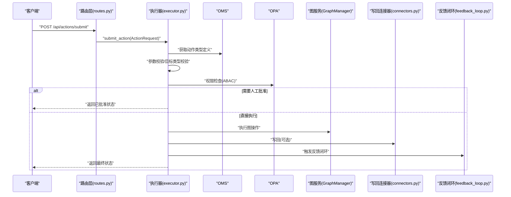
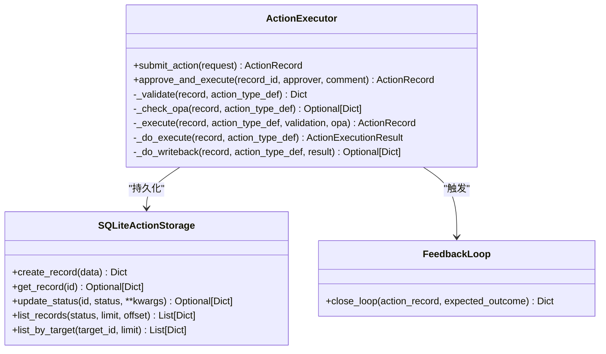
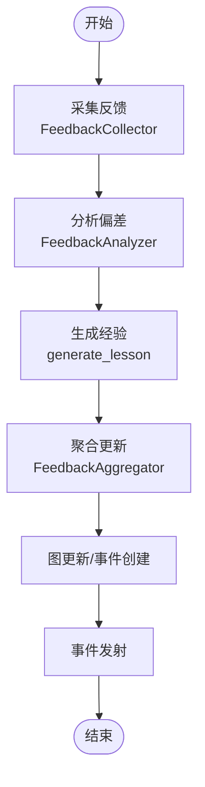
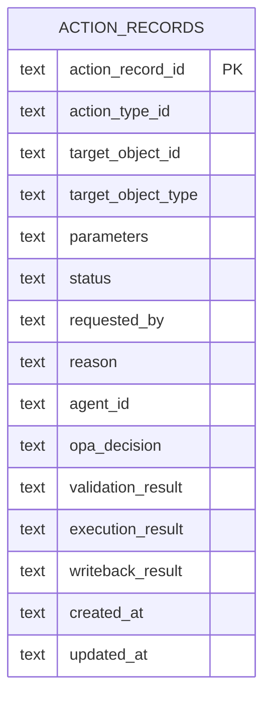
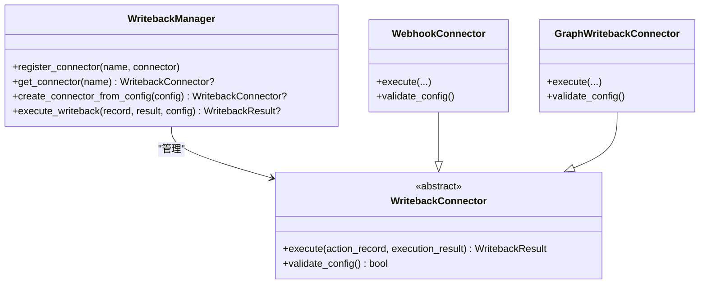
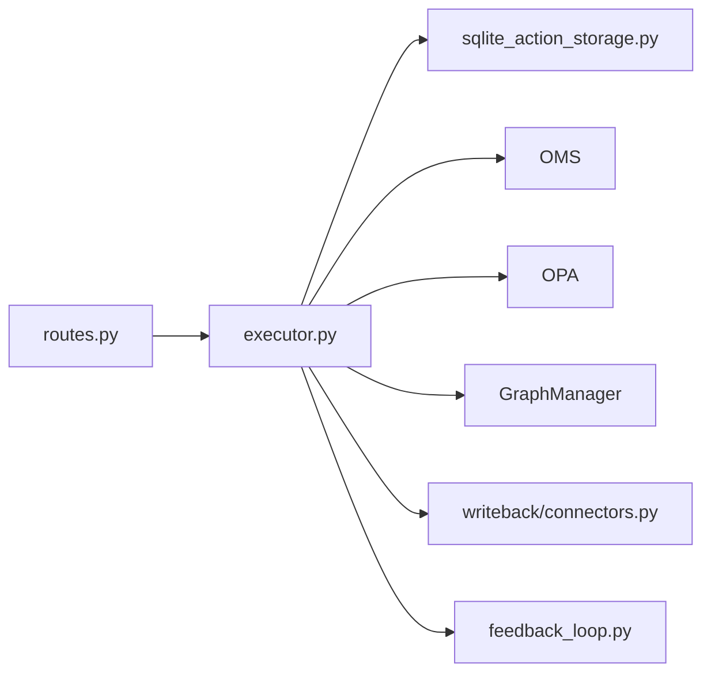

# 动作服务

<cite>
**本文引用的文件**
- [executor.py](file://odap/biz/decision/action_service/executor.py)
- [feedback_loop.py](file://odap/biz/decision/action_service/feedback_loop.py)
- [schemas.py](file://odap/biz/decision/action_service/schemas.py)
- [routes.py](file://odap/biz/decision/action_service/routes.py)
- [sqlite_action_storage.py](file://odap/biz/decision/action_service/storage/sqlite_action_storage.py)
- [connectors.py](file://odap/biz/decision/action_service/writeback/connectors.py)
</cite>

## 目录
1. [简介](#简介)
2. [项目结构](#项目结构)
3. [核心组件](#核心组件)
4. [架构总览](#架构总览)
5. [详细组件分析](#详细组件分析)
6. [依赖分析](#依赖分析)
7. [性能考虑](#性能考虑)
8. [故障排查指南](#故障排查指南)
9. [结论](#结论)
10. [附录：API 文档与集成示例](#附录api-文档与集成示例)

## 简介
本文件为 ODAP 动作服务系统的深度技术文档，聚焦动作执行器的设计与实现，覆盖动作解析、执行调度、状态跟踪、结果反馈机制；详述反馈闭环（执行监控、异常捕获、自动重试、人工干预）的架构与流程；阐述动作存储系统（SQLite 持久化、数据一致性、查询优化）；并提供配置项、性能调优建议、故障恢复机制以及完整的 API 文档与集成示例，帮助开发者快速理解与使用动作服务。

## 项目结构
动作服务位于 odap/biz/decision/action_service 目录下，主要由以下模块组成：
- 执行器：负责动作请求的校验、权限检查、执行、写回与反馈闭环触发
- 反馈闭环：采集、分析偏差、聚合更新与事件发射
- 存储层：基于 SQLite 的动作记录持久化与索引优化
- 写回连接器：支持 Webhook 与图数据库写回
- 路由层：FastAPI 接口定义，暴露提交、审批、查询等能力

**图表来源**
- [executor.py:10-297](file://odap/biz/decision/action_service/executor.py#L10-L297)
- [feedback_loop.py:290-311](file://odap/biz/decision/action_service/feedback_loop.py#L290-L311)
- [sqlite_action_storage.py:12-153](file://odap/biz/decision/action_service/storage/sqlite_action_storage.py#L12-L153)
- [connectors.py:131-190](file://odap/biz/decision/action_service/writeback/connectors.py#L131-L190)
- [routes.py:1-55](file://odap/biz/decision/action_service/routes.py#L1-L55)

**章节来源**
- [routes.py:1-55](file://odap/biz/decision/action_service/routes.py#L1-L55)
- [executor.py:10-297](file://odap/biz/decision/action_service/executor.py#L10-L297)
- [feedback_loop.py:290-311](file://odap/biz/decision/action_service/feedback_loop.py#L290-L311)
- [sqlite_action_storage.py:12-153](file://odap/biz/decision/action_service/storage/sqlite_action_storage.py#L12-L153)
- [connectors.py:131-190](file://odap/biz/decision/action_service/writeback/connectors.py#L131-L190)

## 核心组件
- 动作执行器（ActionExecutor）
  - 负责动作生命周期管理：提交、校验、权限检查、批准执行、执行、写回、状态更新与反馈闭环触发
  - 依赖 OMS 获取动作类型定义、OPA 进行权限检查、GraphManager 执行图操作、SQLiteActionStorage 持久化
- 反馈闭环（FeedbackLoop）
  - 采集执行结果为反馈对象，分析偏差与根因，聚合到图与事件钩子，并生成经验总结
- 存储层（SQLiteActionStorage）
  - 提供动作记录的创建、查询、状态更新与列表查询；内置 JSON 字段序列化/反序列化与索引
- 写回连接器（WritebackManager/Connectors）
  - 支持 Webhook 与图写回，具备签名与超时控制
- 路由层（FastAPI）
  - 暴露提交、审批、查询接口，返回标准化动作记录模型

**章节来源**
- [executor.py:10-297](file://odap/biz/decision/action_service/executor.py#L10-L297)
- [feedback_loop.py:290-311](file://odap/biz/decision/action_service/feedback_loop.py#L290-L311)
- [sqlite_action_storage.py:12-153](file://odap/biz/decision/action_service/storage/sqlite_action_storage.py#L12-L153)
- [connectors.py:131-190](file://odap/biz/decision/action_service/writeback/connectors.py#L131-L190)
- [routes.py:1-55](file://odap/biz/decision/action_service/routes.py#L1-L55)

## 架构总览
动作服务采用“请求-执行-写回-反馈”的闭环架构。请求经路由进入执行器，执行器通过 OMS 校验参数与目标类型，通过 OPA 进行权限检查，必要时进入“批准”状态等待人工干预。执行成功后进行写回（Webhook 或图写回），随后触发反馈闭环，将结果与偏差信息写入图与事件系统。

**图表来源**
- [routes.py:13-32](file://odap/biz/decision/action_service/routes.py#L13-L32)
- [executor.py:48-175](file://odap/biz/decision/action_service/executor.py#L48-L175)
- [feedback_loop.py:296-300](file://odap/biz/decision/action_service/feedback_loop.py#L296-L300)
- [connectors.py:158-178](file://odap/biz/decision/action_service/writeback/connectors.py#L158-L178)

## 详细组件分析

### 动作执行器（ActionExecutor）
- 关键职责
  - 动作提交：创建记录、状态流转至 validating → 校验 → 权限检查 → 审批或直接执行
  - 人工批准：将 approved 状态的动作转为执行
  - 执行阶段：根据动作类型映射到图操作（更新/创建/删除/关联），返回执行结果
  - 写回阶段：按配置选择 Webhook 或图写回，记录写回结果
  - 反馈闭环：执行成功后触发反馈闭环，更新图与事件
- 设计要点
  - 失败即“fail-closed”：OPA 缺失或错误时拒绝执行
  - 状态机：pending → validating → approved/rejected/executing → completed/failed
  - 异常捕获：统一记录失败状态与错误信息
  - 写回降级：无连接器时仍可返回默认写回结果

**图表来源**
- [executor.py:10-297](file://odap/biz/decision/action_service/executor.py#L10-L297)
- [sqlite_action_storage.py:12-153](file://odap/biz/decision/action_service/storage/sqlite_action_storage.py#L12-L153)
- [feedback_loop.py:290-311](file://odap/biz/decision/action_service/feedback_loop.py#L290-L311)

**章节来源**
- [executor.py:48-175](file://odap/biz/decision/action_service/executor.py#L48-L175)
- [schemas.py:6-57](file://odap/biz/decision/action_service/schemas.py#L6-L57)

### 反馈闭环（FeedbackLoop）
- 组件构成
  - FeedbackCollector：从动作记录提取执行结果，封装为 ActionFeedback
  - FeedbackAnalyzer：计算偏差分数、识别根因、生成经验总结
  - FeedbackAggregator：更新图实体、创建反馈事件、发射钩子事件
- 工作流
  - 采集 → 分析 → 聚合更新 → 事件发射
  - 对成功动作更新目标实体属性，对失败动作记录偏差与根因
- 事件与图写回
  - 通过 HookRegistry 发射 action.feedback.{outcome} 事件
  - 将反馈作为实体写入图，便于后续检索与可视化

**图表来源**
- [feedback_loop.py:296-300](file://odap/biz/decision/action_service/feedback_loop.py#L296-L300)
- [feedback_loop.py:177-212](file://odap/biz/decision/action_service/feedback_loop.py#L177-L212)

**章节来源**
- [feedback_loop.py:23-311](file://odap/biz/decision/action_service/feedback_loop.py#L23-L311)

### 动作存储系统（SQLiteActionStorage）
- 数据模型
  - 主表 action_records：包含动作类型、目标对象、参数、状态、请求人、时间戳及各阶段结果字段
  - JSON 字段：parameters、opa_decision、validation_result、execution_result、writeback_result
- 索引策略
  - status、target_object_id、action_type_id 三类常用过滤字段建立索引，提升查询效率
- 查询优化
  - 列表查询支持按状态过滤与分页
  - 按目标对象 ID 查询最近动作
- 一致性与健壮性
  - 使用 UTC 时间戳，统一时区
  - JSON 字段序列化/反序列化容错处理
  - 每次更新自动刷新 updated_at

**图表来源**
- [sqlite_action_storage.py:28-48](file://odap/biz/decision/action_service/storage/sqlite_action_storage.py#L28-L48)

**章节来源**
- [sqlite_action_storage.py:12-153](file://odap/biz/decision/action_service/storage/sqlite_action_storage.py#L12-L153)

### 写回连接器（WritebackManager/Connectors）
- 连接器类型
  - WebhookConnector：支持自定义方法、头部、签名与超时
  - GraphWritebackConnector：将执行结果中的关键属性写回图
- 管理器
  - 注册/发现连接器，按配置动态创建实例
  - 统一执行入口，返回标准 WritebackResult
- 降级策略
  - 无连接器时返回默认写回结果，确保主流程不中断

**图表来源**
- [connectors.py:131-190](file://odap/biz/decision/action_service/writeback/connectors.py#L131-L190)

**章节来源**
- [connectors.py:12-190](file://odap/biz/decision/action_service/writeback/connectors.py#L12-L190)

### 路由层（FastAPI）
- 接口概览
  - POST /api/actions/submit：提交动作请求
  - POST /api/actions/{record_id}/approve：人工批准并执行
  - GET /api/actions/records：分页查询动作记录
  - GET /api/actions/records/{record_id}：按 ID 查询
  - GET /api/actions/target/{target_object_id}：按目标对象查询最近动作
- 参数与限制
  - limit 默认 50，最大 200
  - offset 默认 0
  - 400/404 错误响应

**章节来源**
- [routes.py:13-55](file://odap/biz/decision/action_service/routes.py#L13-L55)

## 依赖分析
- 内部耦合
  - 执行器强依赖存储层与图服务；弱依赖 OMS 与 OPA
  - 反馈闭环依赖图服务与事件钩子系统
  - 写回连接器与图服务存在耦合
- 外部依赖
  - OMS：动作类型定义与参数约束
  - OPA：ABAC 权限检查（fail-closed）
  - GraphManager：图实体与关系操作
  - FastAPI：HTTP 接口
- 循环依赖
  - 未见循环导入；模块间通过函数/类解耦

**图表来源**
- [routes.py:1-55](file://odap/biz/decision/action_service/routes.py#L1-L55)
- [executor.py:10-297](file://odap/biz/decision/action_service/executor.py#L10-L297)
- [feedback_loop.py:290-311](file://odap/biz/decision/action_service/feedback_loop.py#L290-L311)
- [sqlite_action_storage.py:12-153](file://odap/biz/decision/action_service/storage/sqlite_action_storage.py#L12-L153)
- [connectors.py:131-190](file://odap/biz/decision/action_service/writeback/connectors.py#L131-L190)

**章节来源**
- [executor.py:10-297](file://odap/biz/decision/action_service/executor.py#L10-L297)
- [feedback_loop.py:290-311](file://odap/biz/decision/action_service/feedback_loop.py#L290-L311)
- [sqlite_action_storage.py:12-153](file://odap/biz/decision/action_service/storage/sqlite_action_storage.py#L12-L153)
- [connectors.py:131-190](file://odap/biz/decision/action_service/writeback/connectors.py#L131-L190)
- [routes.py:1-55](file://odap/biz/decision/action_service/routes.py#L1-L55)

## 性能考虑
- 存储层
  - 已建立三类常用过滤索引，建议在高并发场景下评估复合索引（如 status+created_at）
  - JSON 字段反序列化在每次读取时进行，建议在热点路径中缓存必要字段
- 执行器
  - OPA 检查为同步阻塞点，建议在高延迟场景下增加超时与熔断
  - 图操作批量更新优于单条更新，可在动作类型定义中约定批量写回
- 写回
  - Webhook 异步执行，建议配置合理超时与重试策略
- 反馈闭环
  - 事件发射与图写回可能成为瓶颈，建议异步化与队列化

[本节为通用性能建议，无需特定文件引用]

## 故障排查指南
- 常见问题定位
  - 动作被拒绝：检查 OMS 动作类型定义、参数必填项与目标类型是否匹配；确认 OPA 是否可用且策略允许
  - 执行失败：查看 execution_result 中的错误消息；核对图操作目标是否存在
  - 写回失败：检查写回配置（URL/签名/超时）与网络连通性
  - 反馈未更新：确认图服务与事件钩子可用；检查日志中 warning 记录
- 日志与可观测性
  - 执行器与反馈闭环均输出详细日志，建议结合记录 ID 追踪
  - 使用分页查询接口定位异常记录
- 重试与恢复
  - 对于可恢复的网络错误，建议在上层调用方实现指数退避重试
  - 对于永久性错误（如参数缺失），应引导用户修正后再提交

**章节来源**
- [executor.py:85-91](file://odap/biz/decision/action_service/executor.py#L85-L91)
- [feedback_loop.py:177-212](file://odap/biz/decision/action_service/feedback_loop.py#L177-L212)
- [sqlite_action_storage.py:126-153](file://odap/biz/decision/action_service/storage/sqlite_action_storage.py#L126-L153)

## 结论
动作服务以清晰的状态机与模块化设计实现了从请求到执行再到反馈的完整闭环。通过 SQLite 持久化与索引优化保障了可观测性与可追溯性；通过 OMS/OPA/Graph 的协作实现了可配置、可审计、可扩展的动作执行能力；通过写回与事件系统打通了与外部系统的集成通道。建议在生产环境中结合性能指标持续优化索引与执行路径，并完善人工干预与告警机制。

[本节为总结性内容，无需特定文件引用]

## 附录：API 文档与集成示例

### API 定义
- 提交动作请求
  - 方法与路径：POST /api/actions/submit
  - 请求体：ActionRequest
  - 返回：ActionRecord
  - 错误：400（参数/权限/校验失败）
- 人工批准并执行
  - 方法与路径：POST /api/actions/{record_id}/approve
  - 请求体：ActionApproval
  - 返回：ActionRecord
  - 错误：400（状态不符/记录不存在）
- 查询动作记录
  - 方法与路径：GET /api/actions/records
  - 查询参数：status（可选）、limit（默认 50，上限 200）、offset（默认 0）
  - 返回：ActionRecord 数组
- 查询单条记录
  - 方法与路径：GET /api/actions/records/{record_id}
  - 返回：ActionRecord
  - 错误：404（不存在）
- 按目标对象查询
  - 方法与路径：GET /api/actions/target/{target_object_id}
  - 查询参数：limit（默认 20）
  - 返回：ActionRecord 数组

**章节来源**
- [routes.py:13-55](file://odap/biz/decision/action_service/routes.py#L13-L55)
- [schemas.py:17-57](file://odap/biz/decision/action_service/schemas.py#L17-L57)

### 数据模型
- ActionRequestStatus：pending、validating、approved、rejected、executing、completed、failed、rolled_back
- ActionRequest：动作类型、目标对象、参数、请求人、原因、Agent ID
- ActionRecord：动作记录 ID、状态、各阶段结果、时间戳
- ActionApproval：批准/拒绝、审批人、备注
- ActionExecutionResult：执行结果（success/message/data/writeback_status）

**章节来源**
- [schemas.py:6-57](file://odap/biz/decision/action_service/schemas.py#L6-L57)

### 集成示例（步骤说明）
- 步骤 1：准备动作类型定义
  - 在 OMS 中注册动作类型，声明参数、目标类型与可选的确认需求与写回配置
- 步骤 2：提交动作请求
  - 调用提交接口，传入动作类型 ID、目标对象 ID、参数、请求人等
  - 若动作类型要求确认，则状态停留在 approved，需下一步批准
- 步骤 3：人工批准（可选）
  - 对 approved 的记录调用批准接口，传入审批人与备注
- 步骤 4：查询与监控
  - 使用分页查询接口监控状态变化；关注 rejected/failed 的原因
- 步骤 5：写回与反馈
  - 若配置了写回，检查 Webhook 或图写回结果；观察反馈闭环是否产生经验总结与事件

**章节来源**
- [executor.py:48-101](file://odap/biz/decision/action_service/executor.py#L48-L101)
- [routes.py:13-55](file://odap/biz/decision/action_service/routes.py#L13-L55)
- [feedback_loop.py:296-300](file://odap/biz/decision/action_service/feedback_loop.py#L296-L300)