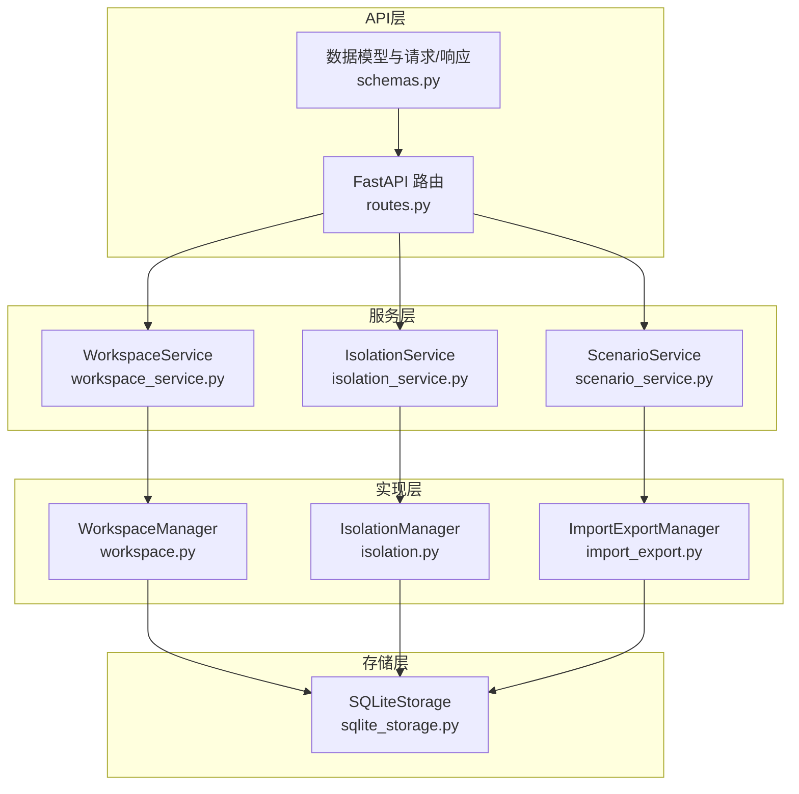
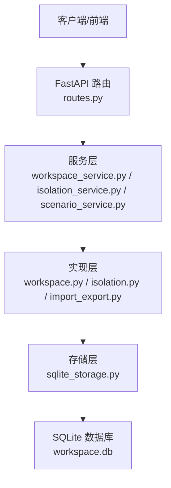
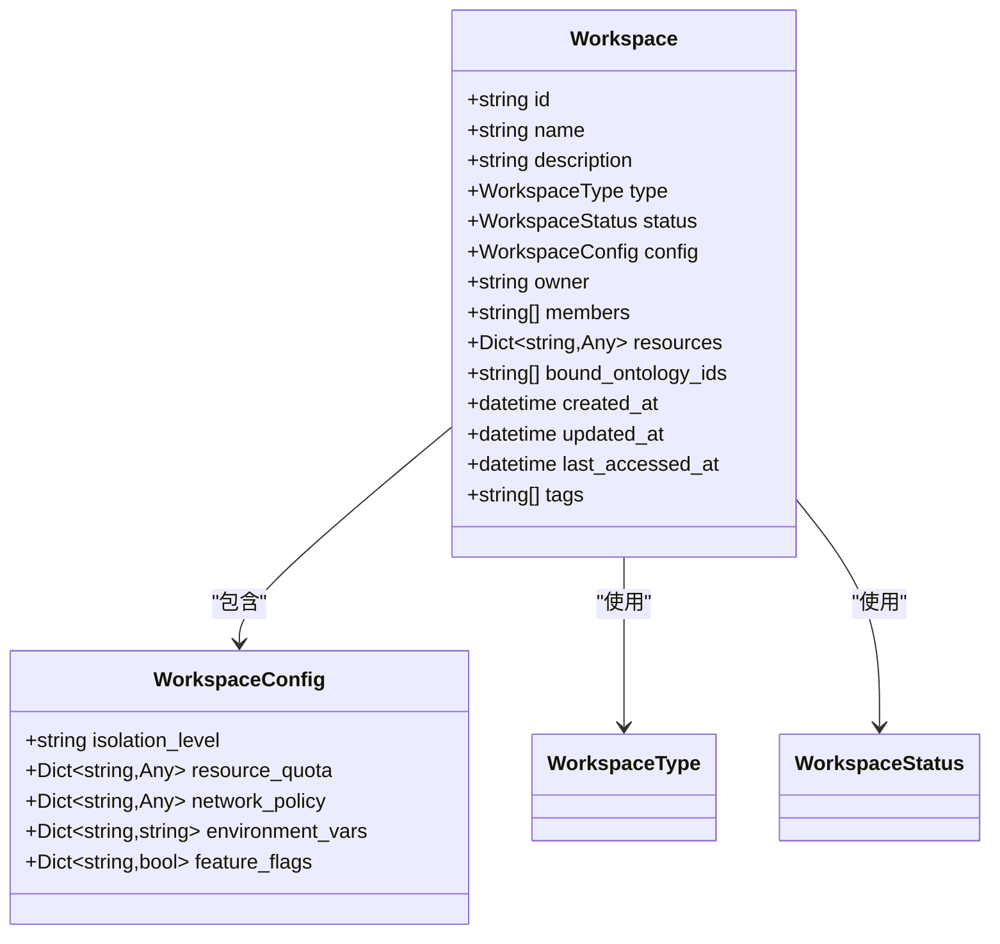
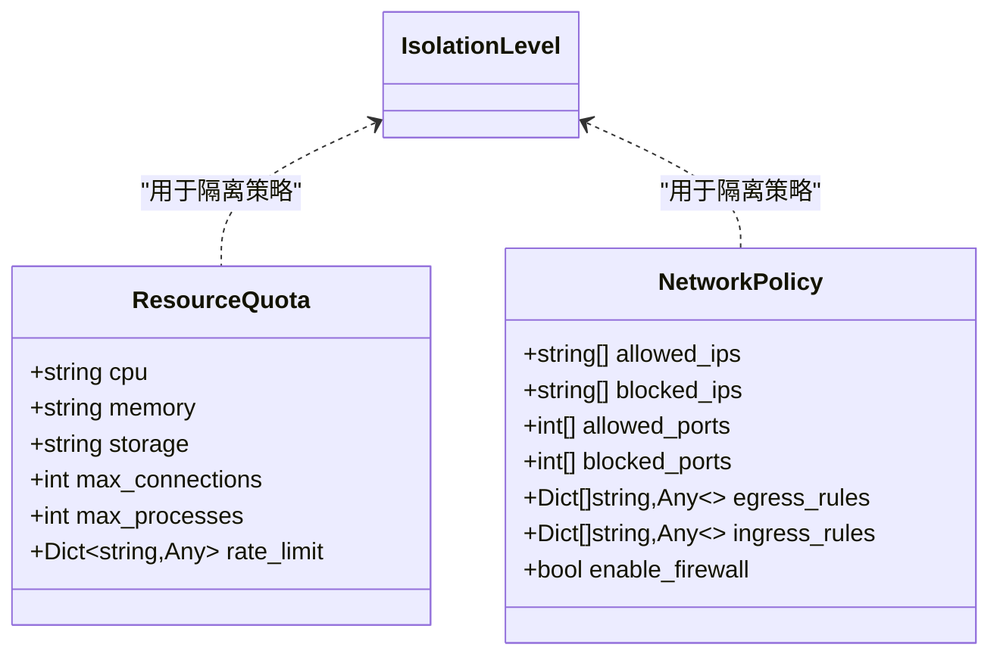
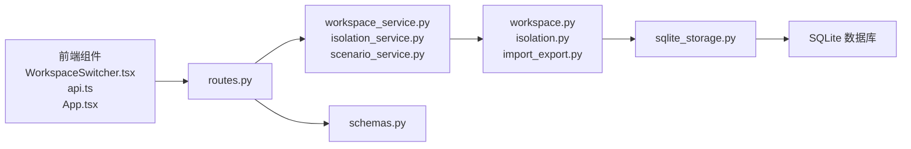
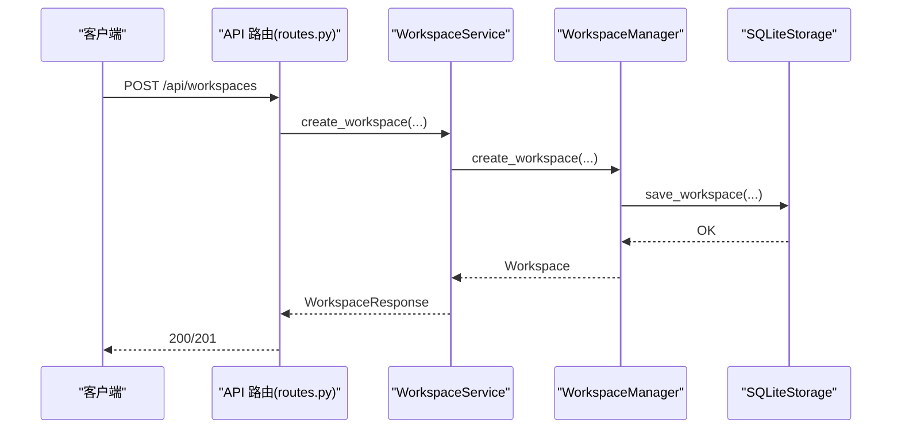
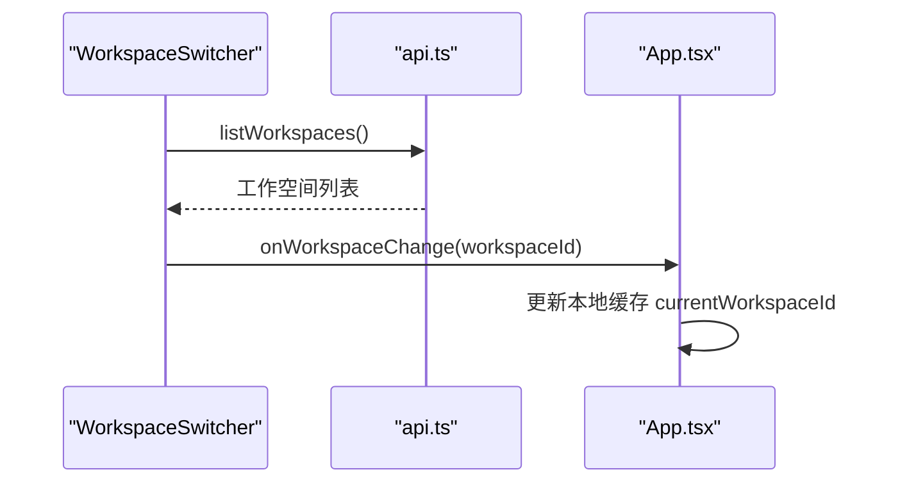
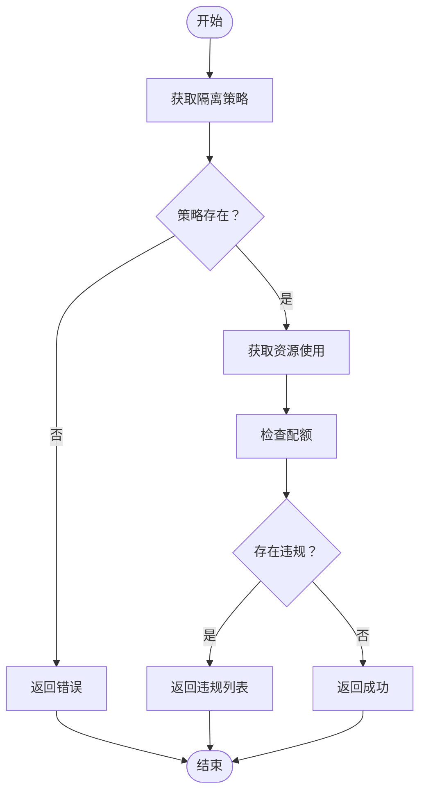

# 工作空间管理

<cite>
**本文引用的文件**
- [workspace.py](file://odap/biz/platform/workspace/models/workspace.py)
- [isolation.py](file://odap/biz/platform/workspace/models/isolation.py)
- [scenario.py](file://odap/biz/platform/workspace/models/scenario.py)
- [import_export.py](file://odap/biz/platform/workspace/models/import_export.py)
- [workspace_service.py](file://odap/biz/platform/workspace/services/workspace_service.py)
- [isolation_service.py](file://odap/biz/platform/workspace/services/isolation_service.py)
- [scenario_service.py](file://odap/biz/platform/workspace/services/scenario_service.py)
- [workspace.py](file://odap/biz/platform/workspace/impl/workspace.py)
- [isolation.py](file://odap/biz/platform/workspace/impl/isolation.py)
- [import_export.py](file://odap/biz/platform/workspace/impl/import_export.py)
- [routes.py](file://odap/biz/platform/workspace/api/routes.py)
- [schemas.py](file://odap/biz/platform/workspace/api/schemas.py)
- [sqlite_storage.py](file://odap/biz/platform/workspace/storage/sqlite_storage.py)
- [BACKEND_API_DESIGN.md](file://docs/10-api/BACKEND_API_DESIGN.md)
- [DATABASE_DESIGN.md](file://docs/10-api/DATABASE_DESIGN.md)
- [test_workspace.py](file://tests/unit/test_workspace.py)
- [test_storage_layers.py](file://tests/unit/test_storage_layers.py)
- [test_api_integration.py](file://tests/integration/test_api_integration.py)
- [test_e2e_flows.py](file://tests/e2e/test_e2e_flows.py)
- [WorkspaceSwitcher.tsx](file://frontend/src/modules/workspace/components/WorkspaceSwitcher.tsx)
- [api.ts](file://frontend/src/modules/shared/services/api.ts)
- [App.tsx](file://frontend/src/App.tsx)
- [spec.md](file://specs/001-odap-platform/spec.md)
</cite>

## 目录
1. [简介](#简介)
2. [项目结构](#项目结构)
3. [核心组件](#核心组件)
4. [架构总览](#架构总览)
5. [详细组件分析](#详细组件分析)
6. [依赖分析](#依赖分析)
7. [性能考量](#性能考量)
8. [故障排查指南](#故障排查指南)
9. [结论](#结论)
10. [附录](#附录)

## 简介
本技术文档围绕工作空间管理系统进行全面解析，涵盖设计理念、架构实现与关键技术细节。重点包括：
- 场景隔离机制与多租户支持
- 资源配额管理与隔离策略
- 工作空间的创建、切换、销毁流程
- 场景导入导出能力
- 隔离服务实现原理（4级隔离级别）
- 工作空间API接口文档与使用说明
- 存储机制、数据持久化策略与性能优化
- 平台管理员的配置与监控最佳实践

## 项目结构
工作空间模块位于 odap/biz/platform/workspace 下，采用“模型-实现-服务-接口-存储-API”分层设计，配合 FastAPI 路由与 Pydantic 数据模型，形成清晰的职责边界与可扩展的架构。

**图表来源**
- [routes.py:1-758](file://odap/biz/platform/workspace/api/routes.py#L1-L758)
- [schemas.py:1-270](file://odap/biz/platform/workspace/api/schemas.py#L1-L270)
- [workspace_service.py:1-304](file://odap/biz/platform/workspace/services/workspace_service.py#L1-L304)
- [isolation_service.py:79-121](file://odap/biz/platform/workspace/services/isolation_service.py#L79-L121)
- [scenario_service.py:1-40](file://odap/biz/platform/workspace/services/scenario_service.py#L1-L40)
- [workspace.py:1-178](file://odap/biz/platform/workspace/impl/workspace.py#L1-L178)
- [isolation.py:1-112](file://odap/biz/platform/workspace/impl/isolation.py#L1-L112)
- [import_export.py:1-164](file://odap/biz/platform/workspace/impl/import_export.py#L1-L164)
- [sqlite_storage.py:1-695](file://odap/biz/platform/workspace/storage/sqlite_storage.py#L1-L695)

**章节来源**
- [routes.py:1-758](file://odap/biz/platform/workspace/api/routes.py#L1-L758)
- [schemas.py:1-270](file://odap/biz/platform/workspace/api/schemas.py#L1-L270)

## 核心组件
- 工作空间模型与配置：定义工作空间类型、状态、配置项（隔离级别、资源配额、网络策略、环境变量、特性开关）。
- 隔离模型：定义隔离级别（low/standard/high/strict）与资源配额、网络策略。
- 场景模型：支持场景状态、标签、绑定本体ID与版本。
- 导入导出模型：记录导入导出状态、进度、耗时、错误等。
- 服务层：封装业务逻辑，提供工作空间CRUD、激活/停用、成员管理、场景管理、导入导出、隔离策略查询与执行等。
- 实现层：具体执行逻辑，如工作空间创建、成员增删、场景绑定、导入导出进度模拟等。
- 存储层：SQLite 持久化，包含工作空间、隔离策略、导入导出记录、场景及其绑定关系。
- API层：FastAPI 路由与 Pydantic 数据模型，提供 RESTful 接口。

**章节来源**
- [workspace.py:1-52](file://odap/biz/platform/workspace/models/workspace.py#L1-L52)
- [isolation.py:1-34](file://odap/biz/platform/workspace/models/isolation.py#L1-L34)
- [scenario.py:1-38](file://odap/biz/platform/workspace/models/scenario.py#L1-L38)
- [import_export.py:1-34](file://odap/biz/platform/workspace/models/import_export.py#L1-L34)
- [workspace_service.py:1-304](file://odap/biz/platform/workspace/services/workspace_service.py#L1-L304)
- [isolation_service.py:79-121](file://odap/biz/platform/workspace/services/isolation_service.py#L79-L121)
- [scenario_service.py:1-40](file://odap/biz/platform/workspace/services/scenario_service.py#L1-L40)
- [workspace.py:1-178](file://odap/biz/platform/workspace/impl/workspace.py#L1-L178)
- [isolation.py:1-112](file://odap/biz/platform/workspace/impl/isolation.py#L1-L112)
- [import_export.py:1-164](file://odap/biz/platform/workspace/impl/import_export.py#L1-L164)
- [sqlite_storage.py:1-695](file://odap/biz/platform/workspace/storage/sqlite_storage.py#L1-L695)

## 架构总览
工作空间管理采用分层架构，API 层负责请求接入与数据校验，服务层协调实现层与存储层，实现层封装具体业务行为，存储层以 SQLite 为核心持久化介质，并预留扩展至 MongoDB/Neo4j 的能力。

**图表来源**
- [routes.py:1-758](file://odap/biz/platform/workspace/api/routes.py#L1-L758)
- [workspace_service.py:1-304](file://odap/biz/platform/workspace/services/workspace_service.py#L1-L304)
- [isolation_service.py:79-121](file://odap/biz/platform/workspace/services/isolation_service.py#L79-L121)
- [scenario_service.py:1-40](file://odap/biz/platform/workspace/services/scenario_service.py#L1-L40)
- [workspace.py:1-178](file://odap/biz/platform/workspace/impl/workspace.py#L1-L178)
- [isolation.py:1-112](file://odap/biz/platform/workspace/impl/isolation.py#L1-L112)
- [import_export.py:1-164](file://odap/biz/platform/workspace/impl/import_export.py#L1-L164)
- [sqlite_storage.py:1-695](file://odap/biz/platform/workspace/storage/sqlite_storage.py#L1-L695)

## 详细组件分析

### 工作空间模型与配置
- 工作空间类型：default/shared/private/temporary
- 工作空间状态：creating/active/inactive/deleting/error
- 配置项：隔离级别、资源配额、网络策略、环境变量、特性开关
- 成员与绑定本体：支持成员列表与绑定本体ID列表

**图表来源**
- [workspace.py:1-52](file://odap/biz/platform/workspace/models/workspace.py#L1-L52)

**章节来源**
- [workspace.py:1-52](file://odap/biz/platform/workspace/models/workspace.py#L1-L52)

### 隔离模型与4级隔离级别
- 隔离级别：low/standard/high/strict
- 资源配额：CPU、内存、存储、最大连接数、最大进程数、速率限制
- 网络策略：允许/阻断 IP/端口、入口/出口规则、防火墙开关

**图表来源**
- [isolation.py:1-34](file://odap/biz/platform/workspace/models/isolation.py#L1-L34)

**章节来源**
- [isolation.py:1-34](file://odap/biz/platform/workspace/models/isolation.py#L1-L34)

### 场景模型
- 场景状态：draft/active/archived
- 绑定状态：active/inactive/pending
- 字段：场景ID、名称、描述、工作空间ID、状态、标签、本体ID列表、当前版本、计数统计、时间戳

**章节来源**
- [scenario.py:1-38](file://odap/biz/platform/workspace/models/scenario.py#L1-L38)

### 导入导出模型
- 状态：pending/processing/completed/failed
- 字段：记录ID、工作空间ID、操作类型、状态、源/目标、进度、文件大小、错误列表、创建者、起止时间、耗时

**章节来源**
- [import_export.py:1-34](file://odap/biz/platform/workspace/models/import_export.py#L1-L34)

### 服务层：工作空间服务
- 提供创建、查询、更新、删除、列表、激活/停用、成员增删、导入导出、场景管理等接口
- 返回统一的数据结构，便于API层序列化

**章节来源**
- [workspace_service.py:1-304](file://odap/biz/platform/workspace/services/workspace_service.py#L1-L304)

### 服务层：隔离服务
- 提供创建/获取/更新隔离策略、强制执行隔离、资源使用查询、配额违规检查等接口

**章节来源**
- [isolation_service.py:79-121](file://odap/biz/platform/workspace/services/isolation_service.py#L79-L121)

### 服务层：场景服务
- 提供场景创建、查询、更新、删除、绑定/解绑本体、版本切换等接口

**章节来源**
- [scenario_service.py:1-40](file://odap/biz/platform/workspace/services/scenario_service.py#L1-L40)

### 实现层：工作空间管理
- 创建、查询、更新、删除、激活/停用、成员管理、本体绑定/解绑、共享本体检测

**章节来源**
- [workspace.py:1-178](file://odap/biz/platform/workspace/impl/workspace.py#L1-L178)

### 实现层：隔离管理
- 创建/获取/更新隔离策略、强制执行隔离、资源使用模拟、配额违规检查

**章节来源**
- [isolation.py:1-112](file://odap/biz/platform/workspace/impl/isolation.py#L1-L112)

### 实现层：导入导出管理
- 导出/导入工作空间，进度模拟，记录状态与错误，支持取消

**章节来源**
- [import_export.py:1-164](file://odap/biz/platform/workspace/impl/import_export.py#L1-L164)

### 存储层：SQLite 持久化
- 表结构：workspaces、isolation_policies、import_export_records、scenarios、scenario_ontology_bindings
- 迁移：支持动态迁移字段（如资源、绑定本体ID、场景状态/标签/多本体ID等）
- 序列化：JSON 序列化成员、配置、标签、资源、绑定等复杂字段

**章节来源**
- [sqlite_storage.py:1-695](file://odap/biz/platform/workspace/storage/sqlite_storage.py#L1-L695)

### API层：RESTful 接口
- 工作空间：CRUD、激活/停用、成员管理
- 隔离策略：创建/获取/执行、资源使用查询
- 导入导出：导出/导入、记录查询/取消
- 场景：CRUD、绑定/解绑本体、版本切换、冲突扫描/修复

**章节来源**
- [routes.py:1-758](file://odap/biz/platform/workspace/api/routes.py#L1-L758)
- [BACKEND_API_DESIGN.md:200-305](file://docs/10-api/BACKEND_API_DESIGN.md#L200-L305)

### 前端集成
- 工作空间切换组件：下拉选择、加载列表、本地缓存当前工作空间
- API 服务：封装工作空间 CRUD、激活/停用、导入导出等请求
- 应用入口：登录页跳过加载工作空间，非登录页加载并缓存

**章节来源**
- [WorkspaceSwitcher.tsx:1-48](file://frontend/src/modules/workspace/components/WorkspaceSwitcher.tsx#L1-L48)
- [api.ts:649-689](file://frontend/src/modules/shared/services/api.ts#L649-L689)
- [App.tsx:1-39](file://frontend/src/App.tsx#L1-L39)

## 依赖分析
- 组件耦合与内聚：服务层聚合实现层，实现层依赖存储层，API 层依赖服务层与数据模型，整体内聚、边界清晰。
- 直接依赖：API 路由依赖服务层；服务层依赖实现层；实现层依赖存储层；存储层依赖 SQLite。
- 外部依赖：FastAPI、Pydantic、SQLite3、测试框架（pytest、vite test）。
- 前端依赖：React、Ant Design、URLSearchParams、fetch。

**图表来源**
- [routes.py:1-758](file://odap/biz/platform/workspace/api/routes.py#L1-L758)
- [workspace_service.py:1-304](file://odap/biz/platform/workspace/services/workspace_service.py#L1-L304)
- [isolation_service.py:79-121](file://odap/biz/platform/workspace/services/isolation_service.py#L79-L121)
- [scenario_service.py:1-40](file://odap/biz/platform/workspace/services/scenario_service.py#L1-L40)
- [workspace.py:1-178](file://odap/biz/platform/workspace/impl/workspace.py#L1-L178)
- [isolation.py:1-112](file://odap/biz/platform/workspace/impl/isolation.py#L1-L112)
- [import_export.py:1-164](file://odap/biz/platform/workspace/impl/import_export.py#L1-L164)
- [sqlite_storage.py:1-695](file://odap/biz/platform/workspace/storage/sqlite_storage.py#L1-L695)
- [schemas.py:1-270](file://odap/biz/platform/workspace/api/schemas.py#L1-L270)
- [WorkspaceSwitcher.tsx:1-48](file://frontend/src/modules/workspace/components/WorkspaceSwitcher.tsx#L1-L48)
- [api.ts:649-689](file://frontend/src/modules/shared/services/api.ts#L649-L689)
- [App.tsx:1-39](file://frontend/src/App.tsx#L1-L39)

**章节来源**
- [routes.py:1-758](file://odap/biz/platform/workspace/api/routes.py#L1-L758)
- [schemas.py:1-270](file://odap/biz/platform/workspace/api/schemas.py#L1-L270)

## 性能考量
- 存储层：SQLite 适合结构化元数据与事务一致性，建议合理设置索引与分页参数，避免一次性加载大量数据。
- 导入导出：进度以百分比更新，模拟耗时，建议在生产环境接入真实 IO 与压缩策略，避免阻塞主线程。
- 资源使用：隔离服务返回模拟的资源使用情况，生产应对接监控系统（如 Prometheus/自研监控）获取真实指标。
- 前端：工作空间切换使用本地缓存，减少重复请求；分页参数限制在 1-100 区间，避免过大页尺寸。
- 并发与隔离：工作空间切换需保证数据隔离与一致性，建议在服务层增加幂等与锁机制（当前实现为概念验证，生产需完善）。

[本节为通用指导，无需特定文件引用]

## 故障排查指南
- 工作空间不存在：服务层在查询不到时返回错误信息，API 层抛出 404；检查 workspace_id 与存储层是否正确。
- 更新失败：当工作空间不存在时抛出异常；确认存储层已存在对应记录。
- 导入导出失败：记录状态为 failed，包含错误列表；检查文件路径、权限与网络。
- 隔离策略缺失：验证接口返回错误消息；确保已创建隔离策略并正确保存。
- 前端切换异常：检查本地缓存与 API 请求；确认当前用户有权访问目标工作空间。

**章节来源**
- [test_workspace.py:76-110](file://tests/unit/test_workspace.py#L76-L110)
- [test_workspace.py:137-255](file://tests/unit/test_workspace.py#L137-L255)
- [test_storage_layers.py:34-107](file://tests/unit/test_storage_layers.py#L34-L107)
- [routes.py:50-124](file://odap/biz/platform/workspace/api/routes.py#L50-L124)
- [routes.py:239-272](file://odap/biz/platform/workspace/api/routes.py#L239-L272)

## 结论
工作空间管理系统通过清晰的分层架构与完善的 API 设计，实现了工作空间的创建、切换、销毁与场景导入导出等核心能力。隔离服务提供 4 级隔离策略与资源配额管理，结合 SQLite 持久化与前端缓存，满足多租户与数据隔离需求。建议在生产环境中进一步完善隔离执行、监控采集与并发控制，以提升稳定性与可观测性。

[本节为总结，无需特定文件引用]

## 附录

### 工作空间API接口文档
- 工作空间 CRUD
  - POST /api/workspaces
  - GET /api/workspaces
  - GET /api/workspaces/{workspace_id}
  - PUT /api/workspaces/{workspace_id}
  - DELETE /api/workspaces/{workspace_id}
- 工作空间操作
  - POST /api/workspaces/{workspace_id}/activate
  - POST /api/workspaces/{workspace_id}/deactivate
  - POST /api/workspaces/{workspace_id}/members/{user_id}
  - DELETE /api/workspaces/{workspace_id}/members/{user_id}
- 隔离策略
  - GET /api/workspaces/isolation/policies/{workspace_id}
  - POST /api/workspaces/isolation/policies
  - GET /api/workspaces/isolation/resource-usage/{workspace_id}
  - POST /api/workspaces/isolation/enforce/{workspace_id}
- 导入导出
  - POST /api/workspaces/import-export/export
  - POST /api/workspaces/import-export/import
  - GET /api/workspaces/import-export/records/{record_id}
  - GET /api/workspaces/import-export/records
  - POST /api/workspaces/import-export/records/{record_id}/cancel
- 场景管理
  - POST /api/workspaces/{workspace_id}/scenarios
  - GET /api/workspaces/{workspace_id}/scenarios
  - GET /api/workspaces/{workspace_id}/scenarios/{scenario_id}
  - PUT /api/workspaces/{workspace_id}/scenarios/{scenario_id}
  - DELETE /api/workspaces/{workspace_id}/scenarios/{scenario_id}
  - POST /api/workspaces/{workspace_id}/scenarios/{scenario_id}/build-graph
  - POST /api/workspaces/{workspace_id}/scenarios/{scenario_id}/ontologies/{ontology_id}
  - DELETE /api/workspaces/{workspace_id}/scenarios/{scenario_id}/ontologies/{ontology_id}
  - GET /api/workspaces/{workspace_id}/scenarios/{scenario_id}/ontologies
  - GET /api/workspaces/{workspace_id}/scenarios/{scenario_id}/versions
  - POST /api/workspaces/{workspace_id}/scenarios/{scenario_id}/commit-version
  - POST /api/workspaces/{workspace_id}/scenarios/{scenario_id}/switch-version
  - GET /api/workspaces/{workspace_id}/scenarios/{scenario_id}/versions/{version_id}/data
  - GET /api/workspaces/{workspace_id}/data-conflicts
  - POST /api/workspaces/{workspace_id}/data-conflicts/repair

**章节来源**
- [BACKEND_API_DESIGN.md:200-305](file://docs/10-api/BACKEND_API_DESIGN.md#L200-L305)
- [routes.py:1-758](file://odap/biz/platform/workspace/api/routes.py#L1-L758)

### 数据库设计要点
- SQLite 数据库：workspace.db，包含 workspaces、isolation_policies、import_export_records、scenarios、scenario_ontology_bindings 表。
- 迁移策略：动态迁移字段（如资源、绑定本体ID、场景状态/标签/多本体ID），保证向后兼容。
- 存储路径：默认 DATA_DIR/data/workspace.db，可通过环境变量覆盖。

**章节来源**
- [DATABASE_DESIGN.md:1-140](file://docs/10-api/DATABASE_DESIGN.md#L1-L140)
- [sqlite_storage.py:11-24](file://odap/biz/platform/workspace/storage/sqlite_storage.py#L11-L24)

### 工作流与流程图

#### 工作空间创建流程

**图表来源**
- [routes.py:32-47](file://odap/biz/platform/workspace/api/routes.py#L32-L47)
- [workspace_service.py:17-55](file://odap/biz/platform/workspace/services/workspace_service.py#L17-L55)
- [workspace.py:16-36](file://odap/biz/platform/workspace/impl/workspace.py#L16-L36)
- [sqlite_storage.py:159-188](file://odap/biz/platform/workspace/storage/sqlite_storage.py#L159-L188)

#### 工作空间切换流程（前端）

**图表来源**
- [WorkspaceSwitcher.tsx:14-32](file://frontend/src/modules/workspace/components/WorkspaceSwitcher.tsx#L14-L32)
- [api.ts:649-689](file://frontend/src/modules/shared/services/api.ts#L649-L689)
- [App.tsx:14-39](file://frontend/src/App.tsx#L14-L39)

#### 隔离策略验证与配额检查流程

**图表来源**
- [isolation.py:64-112](file://odap/biz/platform/workspace/impl/isolation.py#L64-L112)
- [isolation_service.py:85-121](file://odap/biz/platform/workspace/services/isolation_service.py#L85-L121)

### 平台管理员最佳实践
- 隔离级别选择：根据租户安全等级选择 low/standard/high/strict，结合资源配额与网络策略。
- 资源配额：为高负载工作空间设置更严格的 CPU/内存/连接数限制，定期审查使用情况。
- 数据隔离：确保工作空间间数据完全隔离，避免跨空间访问；导入导出时严格校验来源与目标。
- 监控与告警：对接监控系统，关注资源使用趋势与隔离策略执行状态；建立告警阈值与自动处置流程。
- 备份与恢复：定期备份 workspace.db，制定导入导出演练计划，确保灾难恢复能力。

[本节为通用指导，无需特定文件引用]