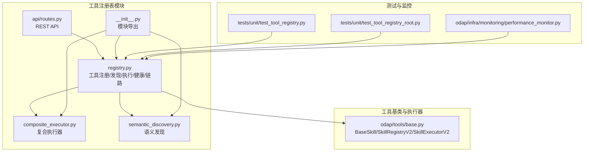
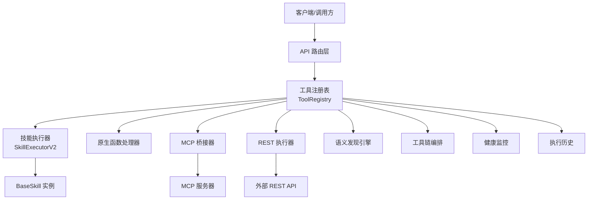
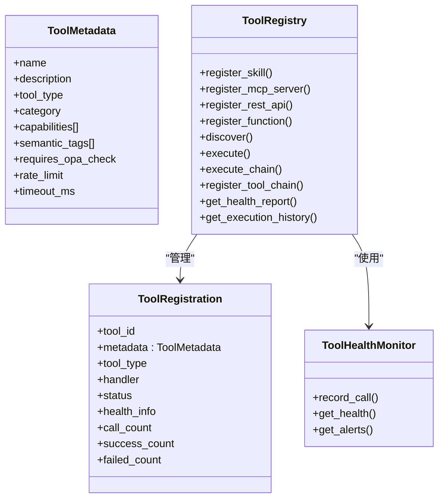
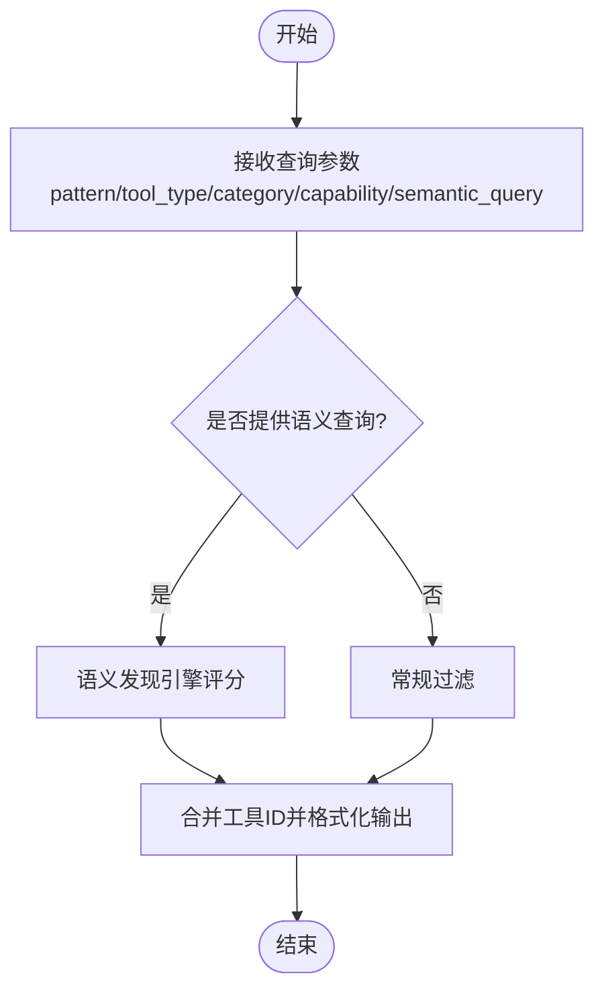
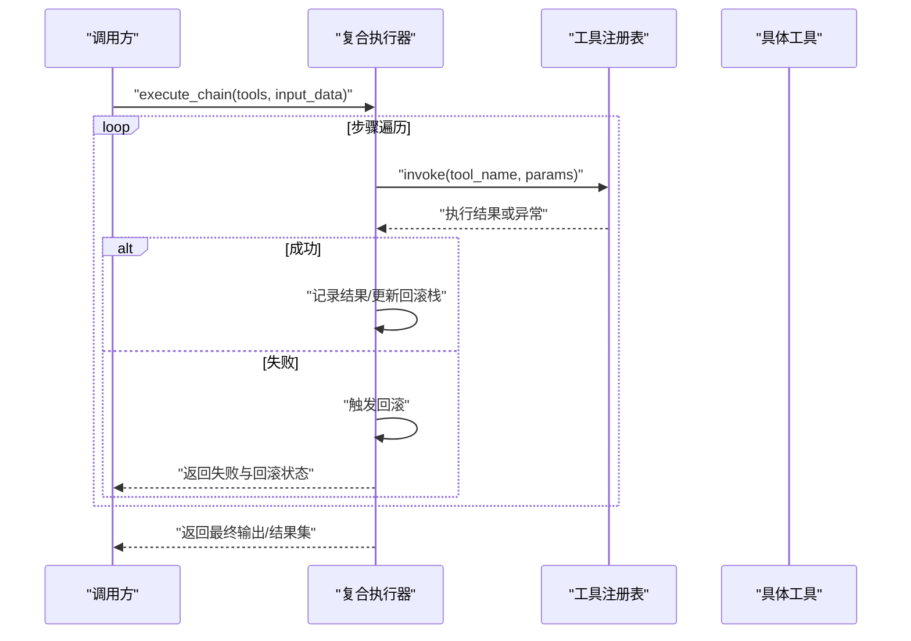
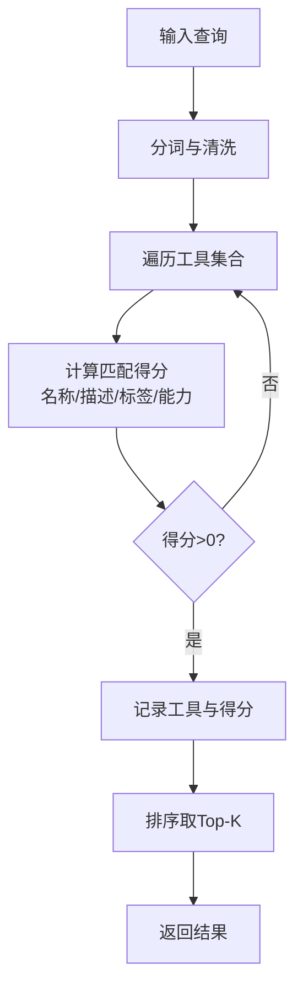
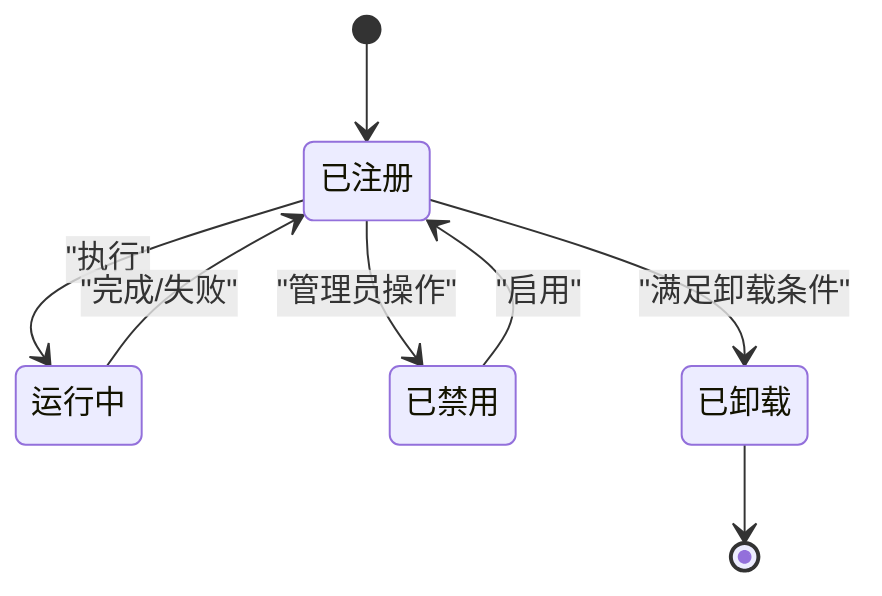
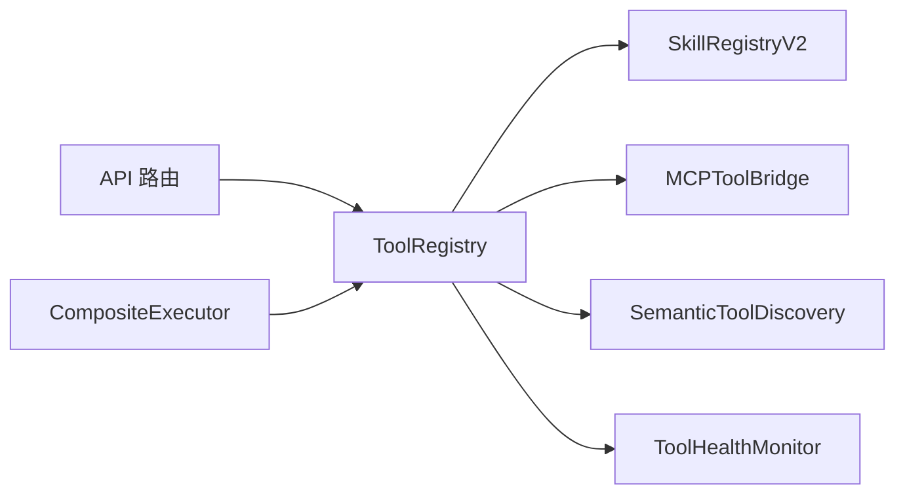

# 工具注册表

<cite>
**本文引用的文件**
- [registry.py](file://odap/biz/platform/tool_registry/registry.py)
- [composite_executor.py](file://odap/biz/platform/tool_registry/composite_executor.py)
- [semantic_discovery.py](file://odap/biz/platform/tool_registry/semantic_discovery.py)
- [routes.py](file://odap/biz/platform/tool_registry/api/routes.py)
- [base.py](file://odap/tools/base.py)
- [__init__.py](file://odap/biz/platform/tool_registry/__init__.py)
- [test_tool_registry.py](file://tests/unit/test_tool_registry.py)
- [test_tool_registry_root.py](file://tests/unit/test_tool_registry_root.py)
- [performance_monitor.py](file://odap/infra/monitoring/performance_monitor.py)
</cite>

## 目录
1. [简介](#简介)
2. [项目结构](#项目结构)
3. [核心组件](#核心组件)
4. [架构总览](#架构总览)
5. [详细组件分析](#详细组件分析)
6. [依赖分析](#依赖分析)
7. [性能考虑](#性能考虑)
8. [故障排查指南](#故障排查指南)
9. [结论](#结论)
10. [附录](#附录)

## 简介
本文件面向“工具注册表系统”，系统性阐述其设计架构、工具发现机制、注册流程、分类管理、复合执行器、语义发现算法、生命周期管理、API 接口、扩展机制与开发者指南。目标是帮助开发者快速理解并高效集成、扩展与运维该工具注册表。

## 项目结构
工具注册表位于 ODAP 平台的“平台工具注册”子域，核心文件组织如下：
- 注册表与执行：registry.py、composite_executor.py
- 语义发现：semantic_discovery.py
- API 路由：api/routes.py
- 工具基类与执行器：odap/tools/base.py
- 模块导出：odap/biz/platform/tool_registry/__init__.py
- 单元测试：tests/unit/test_tool_registry.py、tests/unit/test_tool_registry_root.py
- 性能监控：odap/infra/monitoring/performance_monitor.py

**图表来源**
- [registry.py:403-1000](file://odap/biz/platform/tool_registry/registry.py#L403-L1000)
- [composite_executor.py:1-93](file://odap/biz/platform/tool_registry/composite_executor.py#L1-L93)
- [semantic_discovery.py:1-92](file://odap/biz/platform/tool_registry/semantic_discovery.py#L1-L92)
- [routes.py:1-310](file://odap/biz/platform/tool_registry/api/routes.py#L1-L310)
- [base.py:458-720](file://odap/tools/base.py#L458-L720)
- [__init__.py:1-34](file://odap/biz/platform/tool_registry/__init__.py#L1-L34)
- [test_tool_registry.py:1-649](file://tests/unit/test_tool_registry.py#L1-L649)
- [test_tool_registry_root.py:112-256](file://tests/unit/test_tool_registry_root.py#L112-L256)
- [performance_monitor.py:1-183](file://odap/infra/monitoring/performance_monitor.py#L1-L183)

**章节来源**
- [registry.py:1-1000](file://odap/biz/platform/tool_registry/registry.py#L1-L1000)
- [routes.py:1-310](file://odap/biz/platform/tool_registry/api/routes.py#L1-L310)
- [base.py:1-720](file://odap/tools/base.py#L1-L720)
- [__init__.py:1-34](file://odap/biz/platform/tool_registry/__init__.py#L1-L34)

## 核心组件
- 工具注册表 ToolRegistry：统一管理 Skill/MCP/REST/Function 四类工具，提供注册、发现、执行、工具链、健康监控与执行历史。
- 复合执行器 CompositeExecutor：编排工具链，支持顺序执行、回滚与错误恢复。
- 语义发现 SemanticToolDiscovery / SemanticDiscovery：基于关键词、语义标签、能力的检索与相似度评分。
- API 路由：提供工具注册、发现、执行、工具链管理、健康与历史查询的 REST 接口。
- 工具基类与执行器：BaseSkill、SkillRegistryV2、SkillExecutorV2，支撑技能的标准化与执行。

**章节来源**
- [registry.py:403-1000](file://odap/biz/platform/tool_registry/registry.py#L403-L1000)
- [composite_executor.py:1-93](file://odap/biz/platform/tool_registry/composite_executor.py#L1-L93)
- [semantic_discovery.py:1-92](file://odap/biz/platform/tool_registry/semantic_discovery.py#L1-L92)
- [routes.py:1-310](file://odap/biz/platform/tool_registry/api/routes.py#L1-L310)
- [base.py:458-720](file://odap/tools/base.py#L458-L720)

## 架构总览
工具注册表采用“统一注册表 + 多执行通道”的架构：统一元数据模型与索引，分别对接技能执行器、原生函数、MCP 与 REST；通过 API 层暴露统一接口；健康监控贯穿执行全过程；语义发现与工具链编排提升智能化与自动化能力。

**图表来源**
- [registry.py:403-1000](file://odap/biz/platform/tool_registry/registry.py#L403-L1000)
- [routes.py:1-310](file://odap/biz/platform/tool_registry/api/routes.py#L1-L310)
- [base.py:458-720](file://odap/tools/base.py#L458-L720)

## 详细组件分析

### 工具注册表与生命周期管理
- 统一元数据与注册：ToolMetadata/ToolRegistration 封装工具元信息、状态与统计；ToolType/ToolCapability 定义工具类型与能力。
- 注册流程：register_skill/register_mcp_server/register_rest_api/register_function 将不同来源工具纳入统一注册表，并建立语义索引。
- 生命周期：支持工具链注册与执行、健康监控、执行历史记录与告警、权限检查（OPA）。
- 健康监控：ToolHealthMonitor 记录调用次数、成功率、平均耗时与告警阈值，生成健康报告。
- 执行历史：限制最大历史条目，便于审计与问题定位。

**图表来源**
- [registry.py:64-147](file://odap/biz/platform/tool_registry/registry.py#L64-L147)
- [registry.py:403-740](file://odap/biz/platform/tool_registry/registry.py#L403-L740)

**章节来源**
- [registry.py:403-740](file://odap/biz/platform/tool_registry/registry.py#L403-L740)
- [test_tool_registry.py:633-648](file://tests/unit/test_tool_registry.py#L633-L648)

### 工具发现机制与分类管理
- 多维过滤：支持 pattern、tool_type、category、capability、semantic_query 等维度组合过滤。
- 语义发现：SemanticToolDiscovery 基于关键词、语义标签与能力进行相似度评分，返回排序结果。
- 分类映射：根据 category 推断 capabilities，便于能力检索。

**图表来源**
- [registry.py:539-577](file://odap/biz/platform/tool_registry/registry.py#L539-L577)
- [registry.py:216-287](file://odap/biz/platform/tool_registry/registry.py#L216-L287)

**章节来源**
- [registry.py:539-577](file://odap/biz/platform/tool_registry/registry.py#L539-L577)
- [semantic_discovery.py:18-39](file://odap/biz/platform/tool_registry/semantic_discovery.py#L18-L39)

### 复合执行器与工具链编排
- 工具链定义：ToolChain/ToolChainStep 支持输入/输出映射、条件判断与链式执行。
- 执行流程：顺序执行各步骤，收集结果，支持回滚栈与异常回滚。
- 错误恢复：捕获异常后触发回滚，记录失败步骤与错误信息，保证幂等性与一致性。

**图表来源**
- [composite_executor.py:12-68](file://odap/biz/platform/tool_registry/composite_executor.py#L12-L68)
- [registry.py:670-703](file://odap/biz/platform/tool_registry/registry.py#L670-L703)

**章节来源**
- [composite_executor.py:1-93](file://odap/biz/platform/tool_registry/composite_executor.py#L1-L93)
- [test_tool_registry.py:511-572](file://tests/unit/test_tool_registry.py#L511-L572)

### 语义发现算法
- 关键词与标签：对工具名称、描述、语义标签进行分词与匹配，计算相似度。
- 能力匹配：依据工具能力字段进行语义关联。
- 相似度评分：综合词频、匹配度与权重，返回排序后的工具列表。

**图表来源**
- [registry.py:244-286](file://odap/biz/platform/tool_registry/registry.py#L244-L286)
- [semantic_discovery.py:61-91](file://odap/biz/platform/tool_registry/semantic_discovery.py#L61-L91)

**章节来源**
- [registry.py:216-287](file://odap/biz/platform/tool_registry/registry.py#L216-L287)
- [semantic_discovery.py:1-92](file://odap/biz/platform/tool_registry/semantic_discovery.py#L1-L92)

### 工具生命周期管理
- 注册：四类工具统一注册，建立元数据与索引。
- 健康检查：记录调用统计、错误率与平均耗时，生成健康状态与告警。
- 动态卸载：基于调用计数与强制标志控制卸载，避免影响中止。
- 权限控制：OPA 权限检查贯穿注册与执行阶段。

**图表来源**
- [registry.py:304-401](file://odap/biz/platform/tool_registry/registry.py#L304-L401)
- [base.py:362-447](file://odap/tools/base.py#L362-L447)

**章节来源**
- [registry.py:304-401](file://odap/biz/platform/tool_registry/registry.py#L304-L401)
- [base.py:362-447](file://odap/tools/base.py#L362-L447)

### API 接口文档
- 工具注册
  - 方法：POST /api/v1/tools/register
  - 请求体：ToolRegisterRequest（name/description/tool_type/category/capabilities/semantic_tags 等）
  - 返回：注册结果与工具名
- 工具发现
  - 方法：GET /api/v1/tools/discover
  - 查询参数：pattern/tool_type/category/capability/semantic_query
  - 返回：工具列表（含健康与统计信息）
- 工具执行
  - 方法：POST /api/v1/tools/execute
  - 请求体：ToolExecuteRequest（tool_name/input_data/user）
  - 返回：执行结果（包含时间戳与跟踪ID）
- 工具链
  - 注册：POST /api/v1/tools/chain/register
  - 执行：POST /api/v1/tools/chain/{chain_id}/execute
  - 查询：GET /api/v1/tools/chain/{chain_id}
  - 列表：GET /api/v1/tools/chains
- 健康与历史
  - 健康报告：GET /api/v1/tools/health
  - 执行历史：GET /api/v1/tools/history?limit=N
- 单工具详情
  - GET /api/v1/tools/{tool_name}

**章节来源**
- [routes.py:75-310](file://odap/biz/platform/tool_registry/api/routes.py#L75-L310)

## 依赖分析
- 组件耦合
  - ToolRegistry 依赖 SkillRegistryV2（技能执行）、MCPToolBridge（MCP 工具桥接）、SemanticToolDiscovery（语义索引）、ToolHealthMonitor（健康监控）。
  - CompositeExecutor 依赖 ToolRegistry 的 invoke 能力，实现工具链编排。
  - API 路由依赖 ToolRegistry 的 discover/execute/register_tool_chain 等方法。
- 外部依赖
  - OPA 权限服务（可选），用于权限检查。
  - FastAPI（路由层）、Pydantic（请求/响应模型）。

**图表来源**
- [registry.py:403-425](file://odap/biz/platform/tool_registry/registry.py#L403-L425)
- [routes.py:69-73](file://odap/biz/platform/tool_registry/api/routes.py#L69-L73)
- [composite_executor.py:8-10](file://odap/biz/platform/tool_registry/composite_executor.py#L8-L10)

**章节来源**
- [registry.py:403-425](file://odap/biz/platform/tool_registry/registry.py#L403-L425)
- [routes.py:69-73](file://odap/biz/platform/tool_registry/api/routes.py#L69-L73)

## 性能考虑
- 异步执行：ToolRegistry 提供 execute_async，适合 IO 密集场景。
- 健康监控：ToolHealthMonitor 通过滚动窗口统计错误率与耗时，及时预警。
- 性能监控：PerformanceMonitor 提供通用指标采集与装饰器，可用于工具执行性能埋点。
- 历史限制：执行历史最大条目限制，避免内存膨胀。

**章节来源**
- [registry.py:664-668](file://odap/biz/platform/tool_registry/registry.py#L664-L668)
- [registry.py:304-401](file://odap/biz/platform/tool_registry/registry.py#L304-L401)
- [performance_monitor.py:1-183](file://odap/infra/monitoring/performance_monitor.py#L1-L183)

## 故障排查指南
- 健康告警：通过 /api/v1/tools/health 查看整体健康状况与告警列表；必要时清理告警或定位失败工具。
- 执行历史：通过 /api/v1/tools/history 定位最近失败的工具与错误信息。
- 权限问题：确认 requires_opa_check 与 opa_action 设置；核对用户角色与权限策略。
- 工具链回滚：复合执行器在失败时自动回滚，检查回滚栈与失败步骤。

**章节来源**
- [registry.py:389-401](file://odap/biz/platform/tool_registry/registry.py#L389-L401)
- [routes.py:273-298](file://odap/biz/platform/tool_registry/api/routes.py#L273-L298)
- [composite_executor.py:79-92](file://odap/biz/platform/tool_registry/composite_executor.py#L79-L92)

## 结论
工具注册表通过统一元数据模型、多执行通道与语义发现，实现了从工具注册、发现、执行到健康监控与工具链编排的完整闭环。结合 OPA 权限与性能监控，系统具备良好的安全性、可观测性与扩展性。开发者可基于此框架快速接入新工具类型与插件化扩展。

## 附录

### 开发者指南
- 工具接口规范
  - 技能：实现 BaseSkill，提供 metadata、input_schema、execute，使用 SkillRegistryV2 注册。
  - 原生函数：register_function 注册可调用对象。
  - MCP：通过 MCPToolBridge 注册远端工具。
  - REST：register_rest_api 注册外部 API。
- 最佳实践
  - 明确工具分类与能力，完善语义标签与描述，提升语义发现效果。
  - 使用工具链编排复杂流程，合理设置输入/输出映射与条件判断。
  - 开启健康监控与权限检查，定期审查告警与历史。
  - 为关键工具提供回滚函数，确保链路错误恢复。

**章节来源**
- [base.py:64-161](file://odap/tools/base.py#L64-L161)
- [registry.py:426-537](file://odap/biz/platform/tool_registry/registry.py#L426-L537)
- [composite_executor.py:12-68](file://odap/biz/platform/tool_registry/composite_executor.py#L12-L68)