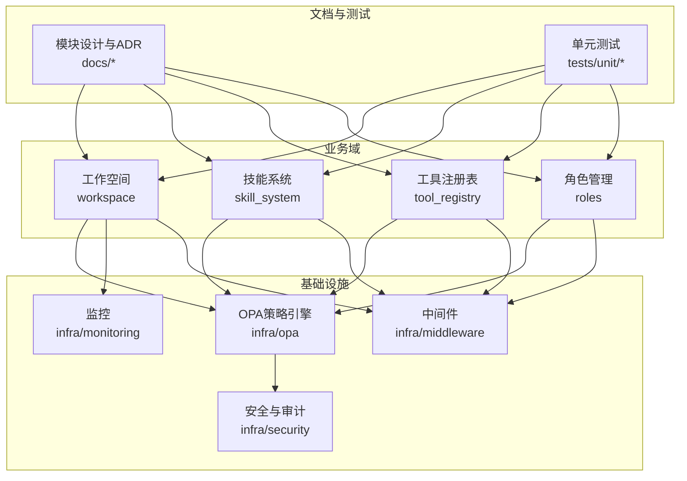
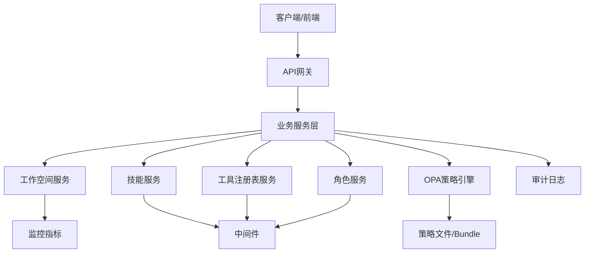
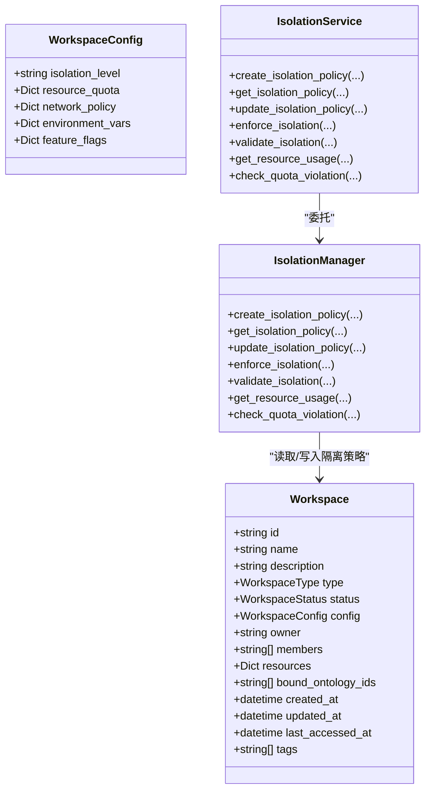
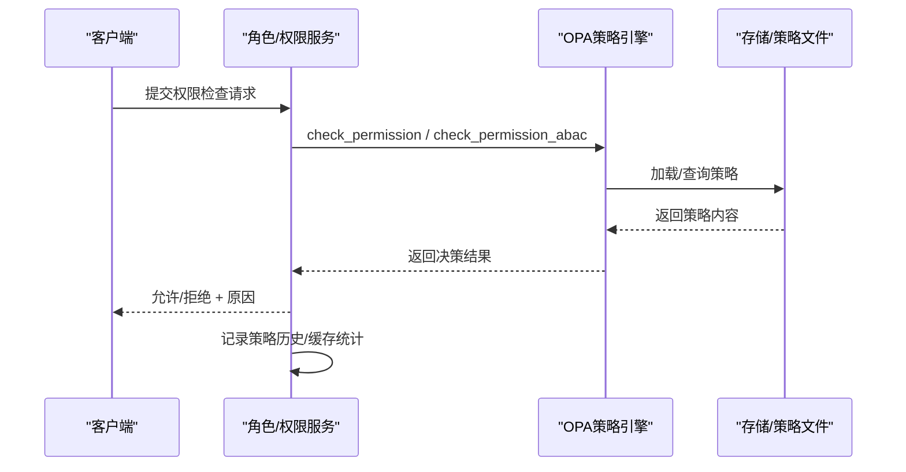
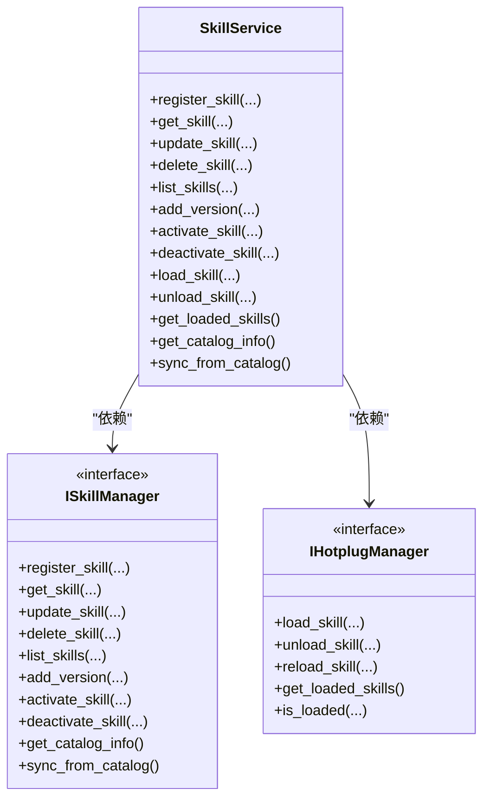
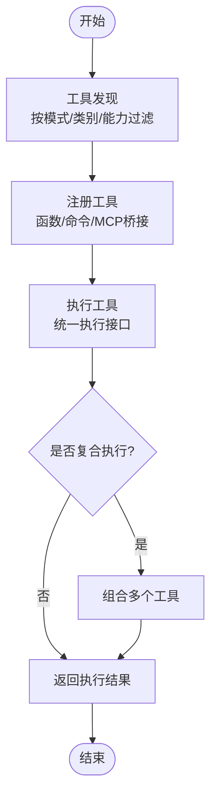
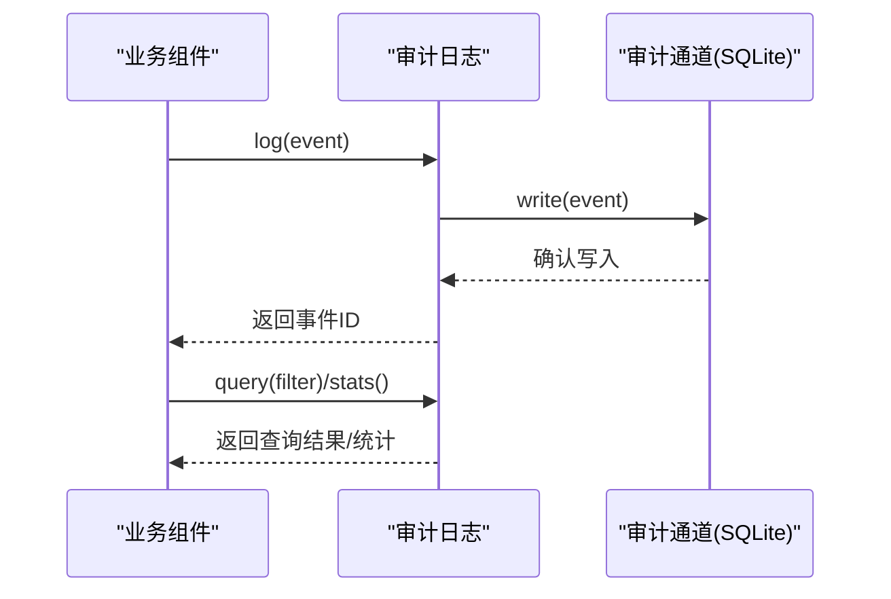
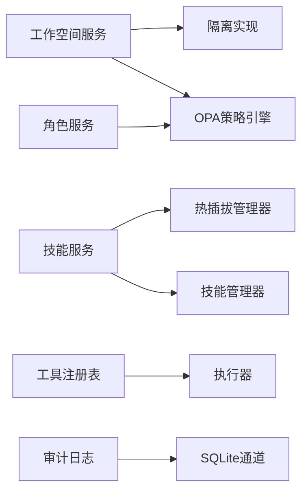

# 平台服务

<cite>
**本文引用的文件**
- [odap/infra/opa/opa_service.py](file://odap/infra/opa/opa_service.py)
- [odap/infra/opa/opa_policy.rego](file://odap/infra/opa/opa_policy.rego)
- [odap/biz/platform/workspace/models/workspace.py](file://odap/biz/platform/workspace/models/workspace.py)
- [odap/biz/platform/workspace/services/isolation_service.py](file://odap/biz/platform/workspace/services/isolation_service.py)
- [odap/biz/platform/workspace/impl/isolation.py](file://odap/biz/platform/workspace/impl/isolation.py)
- [odap/biz/platform/skill_system/services/skill_service.py](file://odap/biz/platform/skill_system/services/skill_service.py)
- [odap/biz/platform/skill_system/interfaces/hotplug.py](file://odap/biz/platform/skill_system/interfaces/hotplug.py)
- [odap/biz/platform/tool_registry/registry.py](file://odap/biz/platform/tool_registry/registry.py)
- [odap/biz/platform/roles/services/role_service.py](file://odap/biz/platform/roles/services/role_service.py)
- [odap/infra/security/audit_logger.py](file://odap/infra/security/audit_logger.py)
- [docs/03-modules/opa_policy/DESIGN.md](file://docs/03-modules/opa_policy/DESIGN.md)
- [docs/07-adr/ADR-011_角色配置热生效.md](file://docs/07-adr/ADR-011_角色配置热生效.md)
- [docs/07-adr/ADR-028_permission_checker_opa_integration.md](file://docs/07-adr/ADR-028_permission_checker_opa_integration.md)
- [tests/unit/test_workspace.py](file://tests/unit/test_workspace.py)
- [tests/unit/test_skill_system.py](file://tests/unit/test_skill_system.py)
- [tests/unit/test_tool_registry.py](file://tests/unit/test_tool_registry.py)
- [tests/unit/test_role_opa_sync.py](file://tests/unit/test_role_opa_sync.py)
</cite>

## 目录
1. [简介](#简介)
2. [项目结构](#项目结构)
3. [核心组件](#核心组件)
4. [架构总览](#架构总览)
5. [详细组件分析](#详细组件分析)
6. [依赖分析](#依赖分析)
7. [性能考虑](#性能考虑)
8. [故障排查指南](#故障排查指南)
9. [结论](#结论)
10. [附录](#附录)

## 简介
本文件面向ODAP平台服务，围绕工作空间管理、角色权限系统、技能系统与工具注册表展开，系统性梳理其设计原则、实现方式与运维要点。重点覆盖：
- 工作空间管理：场景隔离、资源配额、权限控制、多租户支持
- 角色权限系统：OPA策略集成、权限同步、访问控制、审计日志
- 技能系统：技能注册表、热插拔机制、生命周期管理、分类管理
- 工具注册表：工具发现、执行器、复合执行、语义发现
- 平台服务：配置管理、扩展接口、监控指标
- 使用与维护指南：面向管理员与开发者的实践建议

## 项目结构
ODAP平台服务由“业务域”“基础设施”“前端”“文档与ADR”等部分组成。与本主题密切相关的模块主要分布在：
- odap/biz/platform：工作空间、技能系统、工具注册表、角色管理等业务能力
- odap/infra：OPA策略、安全审计、中间件、监控等基础设施
- docs：模块设计文档与ADR，提供架构背景与决策依据
- tests：单元测试，验证工作空间隔离、技能热插拔、工具注册表、角色到OPA同步等功能

**图示来源**
- [odap/biz/platform/workspace/models/workspace.py:1-52](file://odap/biz/platform/workspace/models/workspace.py#L1-L52)
- [odap/biz/platform/skill_system/services/skill_service.py:1-184](file://odap/biz/platform/skill_system/services/skill_service.py#L1-L184)
- [odap/biz/platform/tool_registry/registry.py](file://odap/biz/platform/tool_registry/registry.py)
- [odap/biz/platform/roles/services/role_service.py:1-172](file://odap/biz/platform/roles/services/role_service.py#L1-L172)
- [odap/infra/opa/opa_service.py:1-750](file://odap/infra/opa/opa_service.py#L1-L750)
- [odap/infra/security/audit_logger.py:1-378](file://odap/infra/security/audit_logger.py#L1-L378)

**章节来源**
- [odap/biz/platform/workspace/models/workspace.py:1-52](file://odap/biz/platform/workspace/models/workspace.py#L1-L52)
- [odap/biz/platform/skill_system/services/skill_service.py:1-184](file://odap/biz/platform/skill_system/services/skill_service.py#L1-L184)
- [odap/biz/platform/tool_registry/registry.py](file://odap/biz/platform/tool_registry/registry.py)
- [odap/biz/platform/roles/services/role_service.py:1-172](file://odap/biz/platform/roles/services/role_service.py#L1-L172)
- [odap/infra/opa/opa_service.py:1-750](file://odap/infra/opa/opa_service.py#L1-L750)
- [odap/infra/security/audit_logger.py:1-378](file://odap/infra/security/audit_logger.py#L1-L378)

## 核心组件
- 工作空间管理：以Workspace模型为核心，结合隔离策略与资源配额，提供场景隔离与多租户支持；通过隔离服务与实现类完成策略落地与资源用量检查。
- 角色权限系统：基于OPA的策略引擎，提供RBAC/ABAC/PBAC/CBAC等访问控制模型，支持策略热更新、沙箱模拟与批量检查，并与角色服务协同实现权限同步。
- 技能系统：提供技能注册、生命周期管理与热插拔加载，支持版本化与目录同步，便于动态扩展Agent能力。
- 工具注册表：提供工具发现、函数/命令/外部工具桥接、MCP协议适配与复合执行，支撑语义化工具调用。
- 安全与审计：统一审计日志通道，支持结构化事件、批量写入、查询与统计，满足合规与追踪需求。

**章节来源**
- [odap/biz/platform/workspace/models/workspace.py:1-52](file://odap/biz/platform/workspace/models/workspace.py#L1-L52)
- [odap/biz/platform/workspace/services/isolation_service.py:79-121](file://odap/biz/platform/workspace/services/isolation_service.py#L79-L121)
- [odap/biz/platform/workspace/impl/isolation.py:67-112](file://odap/biz/platform/workspace/impl/isolation.py#L67-L112)
- [odap/infra/opa/opa_service.py:455-717](file://odap/infra/opa/opa_service.py#L455-L717)
- [odap/biz/platform/skill_system/services/skill_service.py:1-184](file://odap/biz/platform/skill_system/services/skill_service.py#L1-L184)
- [odap/biz/platform/tool_registry/registry.py](file://odap/biz/platform/tool_registry/registry.py)
- [odap/infra/security/audit_logger.py:1-378](file://odap/infra/security/audit_logger.py#L1-L378)

## 架构总览
ODAP平台服务采用“业务域+基础设施”的分层架构。业务域通过服务层协调各子系统，基础设施提供策略、安全、监控与中间件能力。OPA策略引擎贯穿权限控制与合规检查，审计系统保障操作可追溯。

**图示来源**
- [odap/infra/opa/opa_service.py:373-450](file://odap/infra/opa/opa_service.py#L373-L450)
- [odap/infra/security/audit_logger.py:19-86](file://odap/infra/security/audit_logger.py#L19-L86)

**章节来源**
- [odap/infra/opa/opa_service.py:1-750](file://odap/infra/opa/opa_service.py#L1-L750)
- [odap/infra/security/audit_logger.py:1-378](file://odap/infra/security/audit_logger.py#L1-L378)

## 详细组件分析

### 工作空间管理
- 设计目标：为不同场景提供隔离的运行环境，控制资源消耗，支持多租户与成员管理。
- 关键模型：Workspace、WorkspaceConfig、WorkspaceType、WorkspaceStatus。
- 核心能力：
  - 场景隔离：通过隔离策略（隔离等级、网络策略、资源配额）实施边界控制。
  - 资源配额：实时/模拟资源使用统计，配额超限告警与检查。
  - 权限控制：结合OPA策略对工作空间内资源访问进行统一判定。
  - 多租户支持：通过工作空间ID与成员绑定实现租户隔离。

**图示来源**
- [odap/biz/platform/workspace/models/workspace.py:10-52](file://odap/biz/platform/workspace/models/workspace.py#L10-L52)
- [odap/biz/platform/workspace/impl/isolation.py:67-112](file://odap/biz/platform/workspace/impl/isolation.py#L67-L112)
- [odap/biz/platform/workspace/services/isolation_service.py:79-121](file://odap/biz/platform/workspace/services/isolation_service.py#L79-L121)

**章节来源**
- [odap/biz/platform/workspace/models/workspace.py:1-52](file://odap/biz/platform/workspace/models/workspace.py#L1-L52)
- [odap/biz/platform/workspace/services/isolation_service.py:79-121](file://odap/biz/platform/workspace/services/isolation_service.py#L79-L121)
- [odap/biz/platform/workspace/impl/isolation.py:67-112](file://odap/biz/platform/workspace/impl/isolation.py#L67-L112)
- [tests/unit/test_workspace.py:163-255](file://tests/unit/test_workspace.py#L163-L255)

### 角色权限系统与OPA集成
- 设计原理：基于OPA的Rego策略语言，实现ABAC/RBAC等访问控制模型；支持策略热更新、沙箱模拟与批量检查；通过角色服务与策略引擎协同，实现权限同步与审计。
- 关键能力：
  - 策略模型：支持RBAC/ABAC/PBAC/CBAC；内置ABAC评估器与策略沙箱。
  - 策略管理：Bundle热更新、回滚、版本跟踪；自动加载策略文件。
  - 权限检查：支持单次与批量检查，带缓存与命中率统计。
  - 审计与追踪：记录策略检查历史，支持性能指标导出。

**图示来源**
- [odap/infra/opa/opa_service.py:538-598](file://odap/infra/opa/opa_service.py#L538-L598)
- [odap/infra/opa/opa_policy.rego:1-137](file://odap/infra/opa/opa_policy.rego#L1-L137)
- [odap/biz/platform/roles/services/role_service.py:1-172](file://odap/biz/platform/roles/services/role_service.py#L1-L172)

**章节来源**
- [odap/infra/opa/opa_service.py:455-717](file://odap/infra/opa/opa_service.py#L455-L717)
- [odap/infra/opa/opa_policy.rego:1-137](file://odap/infra/opa/opa_policy.rego#L1-L137)
- [odap/biz/platform/roles/services/role_service.py:1-172](file://odap/biz/platform/roles/services/role_service.py#L1-L172)
- [docs/03-modules/opa_policy/DESIGN.md:25-65](file://docs/03-modules/opa_policy/DESIGN.md#L25-L65)
- [docs/07-adr/ADR-011_角色配置热生效.md:18-47](file://docs/07-adr/ADR-011_角色配置热生效.md#L18-L47)
- [docs/07-adr/ADR-028_permission_checker_opa_integration.md:203-253](file://docs/07-adr/ADR-028_permission_checker_opa_integration.md#L203-L253)
- [tests/unit/test_role_opa_sync.py:43-80](file://tests/unit/test_role_opa_sync.py#L43-L80)

### 技能系统
- 设计目标：提供技能注册、生命周期管理与热插拔加载，支持版本化与目录同步，便于动态扩展Agent能力。
- 关键接口：ISkillManager、IHotplugManager、ISkillRegistry。
- 核心流程：注册技能、更新/删除、版本管理、激活/停用、加载/卸载、目录同步。

**图示来源**
- [odap/biz/platform/skill_system/services/skill_service.py:1-184](file://odap/biz/platform/skill_system/services/skill_service.py#L1-L184)
- [odap/biz/platform/skill_system/interfaces/hotplug.py:1-60](file://odap/biz/platform/skill_system/interfaces/hotplug.py#L1-L60)

**章节来源**
- [odap/biz/platform/skill_system/services/skill_service.py:1-184](file://odap/biz/platform/skill_system/services/skill_service.py#L1-L184)
- [odap/biz/platform/skill_system/interfaces/hotplug.py:1-60](file://odap/biz/platform/skill_system/interfaces/hotplug.py#L1-L60)
- [tests/unit/test_skill_system.py:309-383](file://tests/unit/test_skill_system.py#L309-L383)

### 工具注册表
- 设计目标：提供统一的工具发现、执行与复合执行能力，支持函数、命令与MCP协议桥接。
- 核心能力：
  - 发现与过滤：按模式、类别、能力过滤工具。
  - 执行器：函数/命令/外部工具的统一执行接口。
  - 复合执行：组合多个工具形成复合流程。
  - 语义发现：基于能力标签与描述的语义检索。

**图示来源**
- [odap/biz/platform/tool_registry/registry.py](file://odap/biz/platform/tool_registry/registry.py)
- [tests/unit/test_tool_registry.py:187-280](file://tests/unit/test_tool_registry.py#L187-L280)

**章节来源**
- [odap/biz/platform/tool_registry/registry.py](file://odap/biz/platform/tool_registry/registry.py)
- [tests/unit/test_tool_registry.py:187-280](file://tests/unit/test_tool_registry.py#L187-L280)

### 安全与审计
- 统一审计日志：支持同步/异步接口、结构化字段、批量写入、查询与统计，满足合规与追踪需求。
- 审计通道：SQLite通道实现持久化存储，支持多通道输出与防篡改校验。

**图示来源**
- [odap/infra/security/audit_logger.py:19-262](file://odap/infra/security/audit_logger.py#L19-L262)

**章节来源**
- [odap/infra/security/audit_logger.py:1-378](file://odap/infra/security/audit_logger.py#L1-L378)

## 依赖分析
- 组件耦合：
  - 工作空间服务依赖隔离实现与OPA策略引擎，确保隔离策略与权限控制的一致性。
  - 技能服务依赖热插拔管理器与技能管理器，实现动态加载与生命周期管理。
  - 工具注册表与技能系统解耦，通过统一接口与桥接适配不同工具类型。
  - 角色服务与OPA策略引擎协作，实现角色到策略的同步与权限判定。
- 外部依赖：
  - OPA服务通过REST API与策略文件交互，支持热更新与健康检查。
  - 审计系统通过SQLite通道持久化，支持批量写入与查询。

**图示来源**
- [odap/biz/platform/workspace/services/isolation_service.py:79-121](file://odap/biz/platform/workspace/services/isolation_service.py#L79-L121)
- [odap/biz/platform/skill_system/services/skill_service.py:1-184](file://odap/biz/platform/skill_system/services/skill_service.py#L1-L184)
- [odap/biz/platform/tool_registry/registry.py](file://odap/biz/platform/tool_registry/registry.py)
- [odap/biz/platform/roles/services/role_service.py:1-172](file://odap/biz/platform/roles/services/role_service.py#L1-L172)
- [odap/infra/opa/opa_service.py:373-450](file://odap/infra/opa/opa_service.py#L373-L450)
- [odap/infra/security/audit_logger.py:19-86](file://odap/infra/security/audit_logger.py#L19-L86)

**章节来源**
- [odap/biz/platform/workspace/services/isolation_service.py:79-121](file://odap/biz/platform/workspace/services/isolation_service.py#L79-L121)
- [odap/biz/platform/skill_system/services/skill_service.py:1-184](file://odap/biz/platform/skill_system/services/skill_service.py#L1-L184)
- [odap/biz/platform/tool_registry/registry.py](file://odap/biz/platform/tool_registry/registry.py)
- [odap/biz/platform/roles/services/role_service.py:1-172](file://odap/biz/platform/roles/services/role_service.py#L1-L172)
- [odap/infra/opa/opa_service.py:1-750](file://odap/infra/opa/opa_service.py#L1-L750)
- [odap/infra/security/audit_logger.py:1-378](file://odap/infra/security/audit_logger.py#L1-L378)

## 性能考虑
- OPA缓存：权限检查结果缓存与命中率统计，降低重复计算开销。
- 批量检查：支持批量权限检查，减少网络往返与策略引擎压力。
- 策略沙箱：提供What-If分析与策略模拟，避免生产环境风险。
- 监控指标：工作空间资源使用、OPA性能指标（缓存命中率、版本信息、历史数量）便于容量规划与问题定位。

**章节来源**
- [odap/infra/opa/opa_service.py:678-717](file://odap/infra/opa/opa_service.py#L678-L717)
- [odap/biz/platform/workspace/impl/isolation.py:82-93](file://odap/biz/platform/workspace/impl/isolation.py#L82-L93)

## 故障排查指南
- OPA连接异常：检查OPA服务健康状态与策略上传，必要时降级为Mock模式进行验证。
- 权限检查失败：核对输入数据（用户、资源、动作、环境）、策略版本与Bundle状态。
- 策略热更新失败：确认策略文件格式、Bundle校验与回滚路径。
- 审计日志写入失败：检查事件循环可用性与通道状态，确保批量写入与查询接口正常。
- 工作空间隔离失效：验证隔离策略、资源用量统计与配额检查逻辑。

**章节来源**
- [odap/infra/opa/opa_service.py:444-450](file://odap/infra/opa/opa_service.py#L444-L450)
- [odap/infra/security/audit_logger.py:137-147](file://odap/infra/security/audit_logger.py#L137-L147)
- [tests/unit/test_workspace.py:163-255](file://tests/unit/test_workspace.py#L163-L255)
- [tests/unit/test_role_opa_sync.py:64-68](file://tests/unit/test_role_opa_sync.py#L64-L68)

## 结论
ODAP平台服务通过清晰的分层架构与模块化设计，实现了工作空间隔离、角色权限控制、技能与工具扩展能力，并以OPA策略引擎与统一审计系统保障安全与合规。配合热插拔与策略沙箱机制，平台具备良好的可演进性与可维护性。建议在生产环境中持续关注OPA性能指标、审计通道容量与工作空间资源配额，确保系统稳定与安全。

## 附录
- 使用与维护建议：
  - 角色与权限：通过角色服务管理角色与权限，结合OPA策略实现热生效与审计追踪。
  - 工作空间：合理设置隔离等级与资源配额，定期检查资源使用与配额违规。
  - 技能系统：利用热插拔机制动态加载技能，配合版本管理与目录同步。
  - 工具注册表：通过发现与过滤机制组织工具，支持复合执行与语义检索。
  - 审计日志：启用结构化事件记录，定期查询与统计，满足合规与问题定位需求。