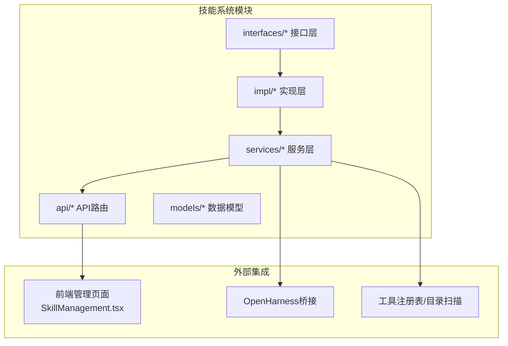
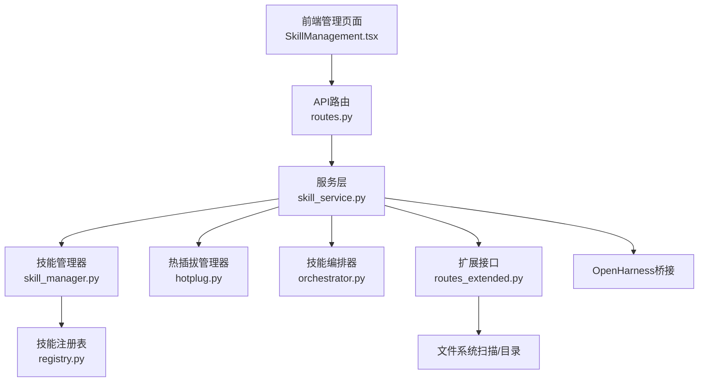
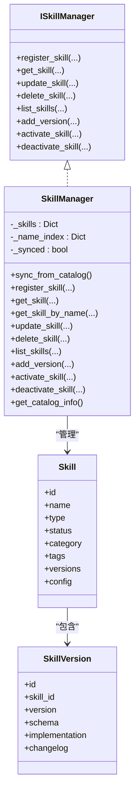
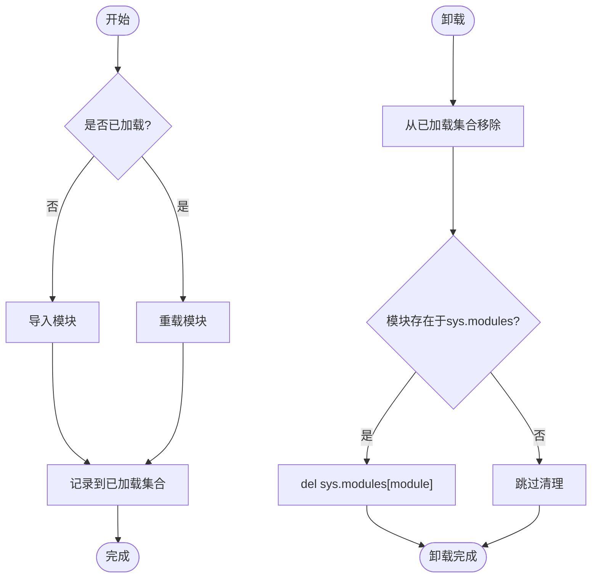
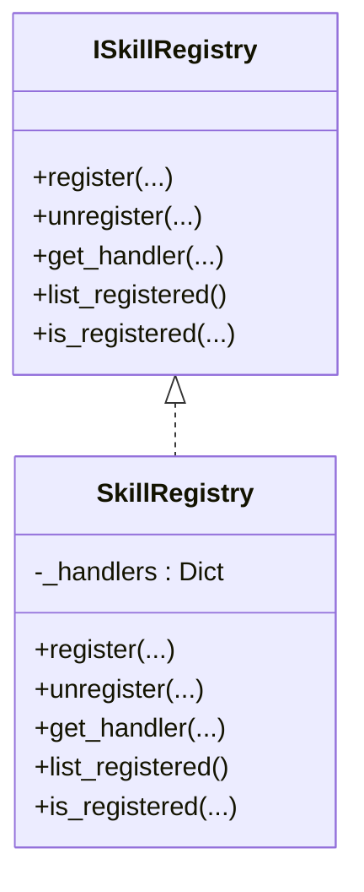
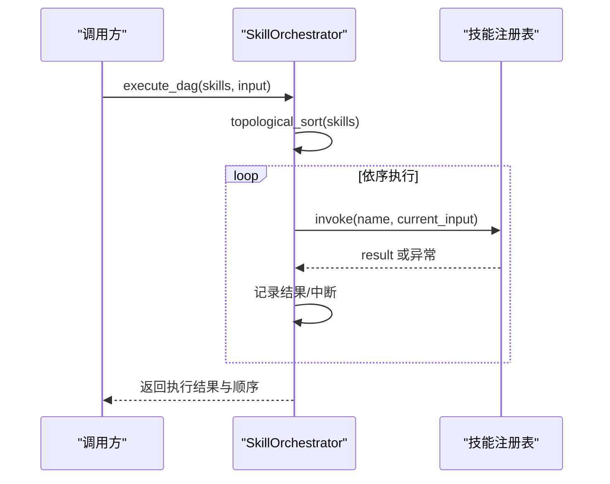
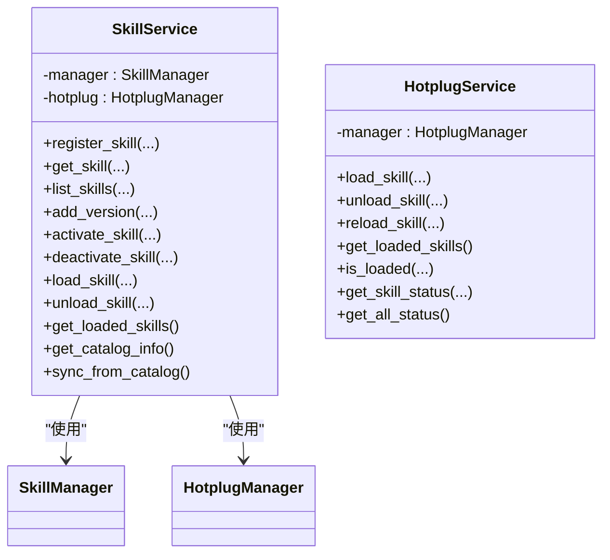
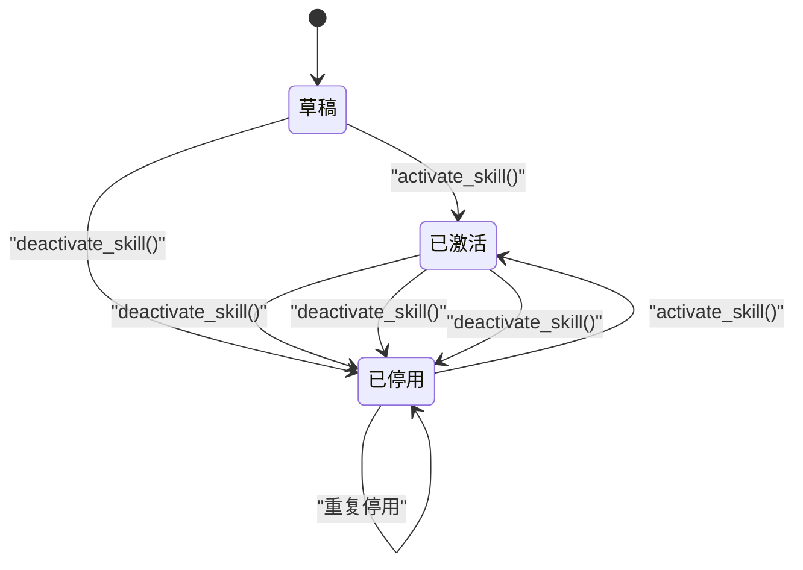
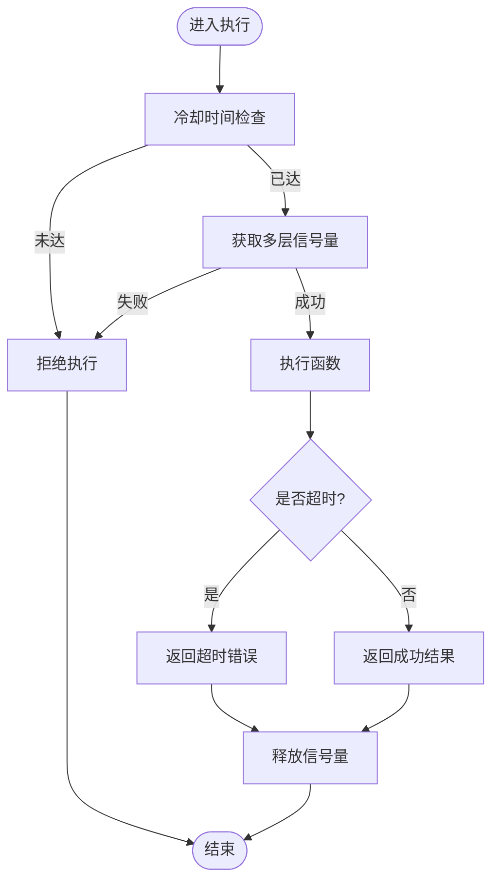
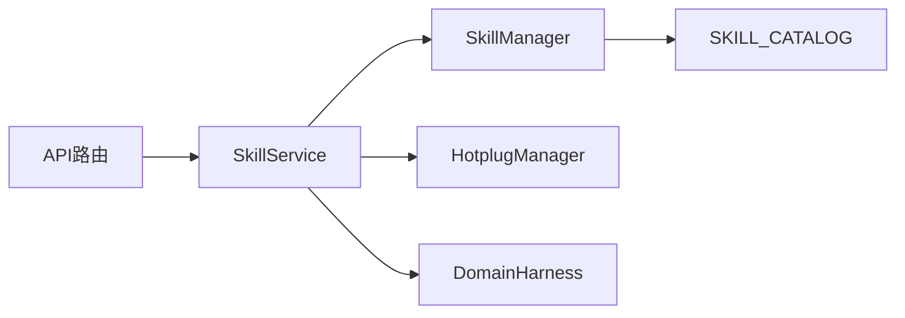

# 技能系统

<cite>
**本文引用的文件**
- [skill_manager.py](file://odap/biz/platform/skill_system/impl/skill_manager.py)
- [hotplug.py](file://odap/biz/platform/skill_system/impl/hotplug.py)
- [registry.py](file://odap/biz/platform/skill_system/impl/registry.py)
- [orchestrator.py](file://odap/biz/platform/skill_system/impl/orchestrator.py)
- [skill.py](file://odap/biz/platform/skill_system/models/skill.py)
- [skill_service.py](file://odap/biz/platform/skill_system/services/skill_service.py)
- [hotplug_service.py](file://odap/biz/platform/skill_system/services/hotplug_service.py)
- [routes.py](file://odap/biz/platform/skill_system/api/routes.py)
- [routes_extended.py](file://odap/biz/platform/skill_system/api/routes_extended.py)
- [skill_manager.py（接口）](file://odap/biz/platform/skill_system/interfaces/skill_manager.py)
- [hotplug.py（接口）](file://odap/biz/platform/skill_system/interfaces/hotplug.py)
- [registry.py（接口）](file://odap/biz/platform/skill_system/interfaces/registry.py)
- [ARCHITECTURE_BIZ.md](file://docs/02-architecture/ARCHITECTURE_BIZ.md)
- [ARCHITECTURE_FULL_CHAIN.md](file://docs/02-architecture/ARCHITECTURE_FULL_CHAIN.md)
- [ARCHITECTURE_FULL_CHAIN_DEEP.md](file://docs/02-architecture/ARCHITECTURE_FULL_CHAIN_DEEP.md)
- [ADR-053_skill_management_selection.md](file://docs/07-adr/ADR-053_skill_management_selection.md)
- [test_skill_system.py](file://tests/unit/test_skill_system.py)
- [SkillManagement.tsx](file://frontend/src/modules/system/pages/SkillManagement.tsx)
</cite>

## 目录
1. [简介](#简介)
2. [项目结构](#项目结构)
3. [核心组件](#核心组件)
4. [架构总览](#架构总览)
5. [详细组件分析](#详细组件分析)
6. [依赖分析](#依赖分析)
7. [性能考虑](#性能考虑)
8. [故障排查指南](#故障排查指南)
9. [结论](#结论)
10. [附录](#附录)

## 简介
本文件面向技能系统的技术文档，覆盖技能注册表、热插拔机制、技能编排器的实现原理；详述技能生命周期管理（加载、激活、停用、卸载）；解释技能分类与标签体系、搜索与过滤；介绍执行器的并发控制、错误处理与结果缓存策略；提供技能系统的API接口说明；并给出扩展机制与开发/调试/部署指南。

## 项目结构
技能系统位于 odap 子域的平台层，采用“接口 + 实现 + 服务 + API”的分层组织方式，并与前端管理页面、OpenHarness桥接、工具注册表等模块协同工作。

图示来源
- [routes.py:1-185](file://odap/biz/platform/skill_system/api/routes.py#L1-L185)
- [skill_service.py:1-184](file://odap/biz/platform/skill_system/services/skill_service.py#L1-L184)
- [hotplug.py:1-109](file://odap/biz/platform/skill_system/impl/hotplug.py#L1-L109)
- [skill_manager.py:1-244](file://odap/biz/platform/skill_system/impl/skill_manager.py#L1-L244)

章节来源
- [routes.py:1-185](file://odap/biz/platform/skill_system/api/routes.py#L1-L185)
- [skill_service.py:1-184](file://odap/biz/platform/skill_system/services/skill_service.py#L1-L184)
- [hotplug.py:1-109](file://odap/biz/platform/skill_system/impl/hotplug.py#L1-L109)
- [skill_manager.py:1-244](file://odap/biz/platform/skill_system/impl/skill_manager.py#L1-L244)

## 核心组件
- 接口层：定义技能管理器、热插拔管理器、注册表的抽象契约，便于替换实现与测试。
- 实现层：提供具体实现，包括技能管理器（含与 SKILL_CATALOG 的双向同步）、热插拔管理器（基于 importlib 的动态加载/卸载/重载）、技能注册表（处理器映射）。
- 服务层：封装业务逻辑，协调管理器与热插拔管理器，提供统一的服务接口。
- API 层：FastAPI 路由，暴露技能注册、查询、版本管理、加载/卸载、同步等REST接口。
- 模型层：Skill、SkillVersion、SkillType、SkillStatus 等数据模型。
- 编排器：拓扑排序与 DAG 执行，支持依赖关系与顺序执行。

章节来源
- [skill_manager.py（接口）:1-121](file://odap/biz/platform/skill_system/interfaces/skill_manager.py#L1-L121)
- [hotplug.py（接口）:1-79](file://odap/biz/platform/skill_system/interfaces/hotplug.py#L1-L79)
- [registry.py（接口）:1-67](file://odap/biz/platform/skill_system/interfaces/registry.py#L1-L67)
- [skill_manager.py:1-244](file://odap/biz/platform/skill_system/impl/skill_manager.py#L1-L244)
- [hotplug.py:1-109](file://odap/biz/platform/skill_system/impl/hotplug.py#L1-L109)
- [registry.py:1-36](file://odap/biz/platform/skill_system/impl/registry.py#L1-L36)
- [skill.py:1-54](file://odap/biz/platform/skill_system/models/skill.py#L1-L54)
- [orchestrator.py:1-74](file://odap/biz/platform/skill_system/impl/orchestrator.py#L1-L74)
- [skill_service.py:1-184](file://odap/biz/platform/skill_system/services/skill_service.py#L1-L184)
- [hotplug_service.py:1-57](file://odap/biz/platform/skill_system/services/hotplug_service.py#L1-L57)
- [routes.py:1-185](file://odap/biz/platform/skill_system/api/routes.py#L1-L185)

## 架构总览
技能系统围绕“注册表 + 管理器 + 热插拔 + 服务 + API”构建，结合前端管理界面与 OpenHarness 桥接，实现技能的全生命周期管理与即时生效。

图示来源
- [routes.py:1-185](file://odap/biz/platform/skill_system/api/routes.py#L1-L185)
- [skill_service.py:1-184](file://odap/biz/platform/skill_system/services/skill_service.py#L1-L184)
- [skill_manager.py:1-244](file://odap/biz/platform/skill_system/impl/skill_manager.py#L1-L244)
- [hotplug.py:1-109](file://odap/biz/platform/skill_system/impl/hotplug.py#L1-L109)
- [registry.py:1-36](file://odap/biz/platform/skill_system/impl/registry.py#L1-L36)
- [orchestrator.py:1-74](file://odap/biz/platform/skill_system/impl/orchestrator.py#L1-L74)
- [routes_extended.py:1-301](file://odap/biz/platform/skill_system/api/routes_extended.py#L1-L301)
- [SkillManagement.tsx:1-393](file://frontend/src/modules/system/pages/SkillManagement.tsx#L1-L393)

章节来源
- [ARCHITECTURE_BIZ.md:1285-1358](file://docs/02-architecture/ARCHITECTURE_BIZ.md#L1285-L1358)
- [ARCHITECTURE_FULL_CHAIN.md:434-469](file://docs/02-architecture/ARCHITECTURE_FULL_CHAIN.md#L434-L469)
- [ARCHITECTURE_FULL_CHAIN_DEEP.md:3724-3836](file://docs/02-architecture/ARCHITECTURE_FULL_CHAIN_DEEP.md#L3724-L3836)
- [ADR-053_skill_management_selection.md:239-283](file://docs/07-adr/ADR-053_skill_management_selection.md#L239-L283)

## 详细组件分析

### 技能管理器（SkillManager）
职责与特性
- 双向同步：初始化从 SKILL_CATALOG 加载技能，注册/激活/停用时同步更新 SKILL_CATALOG。
- 生命周期：支持注册、查询、更新、删除、版本添加、激活/停用。
- 分类推断：根据分类映射推断技能类型（ACTION/QUERY/TRANSFORM/INTEGRATION）。
- 状态同步：激活/停用时同步到 DomainHarness 工具列表。

图示来源
- [skill_manager.py（接口）:1-121](file://odap/biz/platform/skill_system/interfaces/skill_manager.py#L1-L121)
- [skill_manager.py:1-244](file://odap/biz/platform/skill_system/impl/skill_manager.py#L1-L244)
- [skill.py:1-54](file://odap/biz/platform/skill_system/models/skill.py#L1-L54)

章节来源
- [skill_manager.py:1-244](file://odap/biz/platform/skill_system/impl/skill_manager.py#L1-L244)
- [skill.py:1-54](file://odap/biz/platform/skill_system/models/skill.py#L1-L54)

### 热插拔管理器（HotplugManager）
职责与特性
- 动态加载/卸载/重载：基于 importlib 动态导入/重载模块，维护已加载技能集合与模块映射。
- 状态查询：提供已加载技能列表、是否已加载、技能状态（含模块名）查询。
- 安全卸载：从 sys.modules 清理模块，避免命名空间污染。

图示来源
- [hotplug.py:1-109](file://odap/biz/platform/skill_system/impl/hotplug.py#L1-L109)

章节来源
- [hotplug.py:1-109](file://odap/biz/platform/skill_system/impl/hotplug.py#L1-L109)

### 技能注册表（SkillRegistry）
职责与特性
- 处理器映射：以 skill_id -> callable 的字典存储技能处理器。
- 查询与枚举：提供获取处理器、列出已注册技能、判断是否已注册。

图示来源
- [registry.py（接口）:1-67](file://odap/biz/platform/skill_system/interfaces/registry.py#L1-L67)
- [registry.py:1-36](file://odap/biz/platform/skill_system/impl/registry.py#L1-L36)

章节来源
- [registry.py:1-36](file://odap/biz/platform/skill_system/impl/registry.py#L1-L36)

### 技能编排器（SkillOrchestrator）
职责与特性
- 拓扑排序：对技能依赖进行拓扑排序，检测循环依赖。
- DAG 执行：按序执行技能，收集结果并注入后续输入；遇到异常时停止并记录错误。

图示来源
- [orchestrator.py:1-74](file://odap/biz/platform/skill_system/impl/orchestrator.py#L1-L74)

章节来源
- [orchestrator.py:1-74](file://odap/biz/platform/skill_system/impl/orchestrator.py#L1-L74)

### 技能服务（SkillService）与热插拔服务（HotplugService）
职责与特性
- 统一入口：SkillService 将管理器与热插拔管理器组合，提供统一的业务方法。
- API 映射：API 路由将请求转发至服务层，返回标准化响应。
- 状态聚合：HotplugService 聚合热插拔状态，便于查询与监控。

图示来源
- [skill_service.py:1-184](file://odap/biz/platform/skill_system/services/skill_service.py#L1-L184)
- [hotplug_service.py:1-57](file://odap/biz/platform/skill_system/services/hotplug_service.py#L1-L57)

章节来源
- [skill_service.py:1-184](file://odap/biz/platform/skill_system/services/skill_service.py#L1-L184)
- [hotplug_service.py:1-57](file://odap/biz/platform/skill_system/services/hotplug_service.py#L1-L57)

### API 接口文档（RESTful）
- 命名空间：/api/skill
- 认证与安全：未在接口中显式声明，建议结合全局中间件或网关统一处理。
- 响应格式：统一返回字典，错误时抛出 HTTPException，包含状态码与消息。

常用接口
- GET /skills
  - 查询参数：page、page_size、skill_type、status、category、name
  - 返回：分页的技能列表与总数
- GET /skills/loaded
  - 返回：已加载技能ID列表
- GET /skills/by-name/{skill_name}
  - 返回：按名称查询的技能详情，不存在时404
- GET /skills/{skill_id}
  - 返回：技能详情，不存在时404
- POST /skills
  - 请求体：name、skill_type、description、category、tags
  - 返回：创建的技能ID与基本信息
- POST /skills/{skill_id}/versions
  - 请求体：version、implementation、schema、changelog
  - 返回：版本ID与创建时间
- POST /skills/{skill_id}/activate
  - 返回：激活后的技能状态
- POST /skills/{skill_id}/deactivate
  - 返回：停用后的技能状态
- POST /skills/{skill_id}/load
  - 返回：加载结果
- POST /skills/{skill_id}/unload
  - 返回：卸载结果
- GET /catalog
  - 返回：SKILL_CATALOG 同步信息
- POST /sync
  - 返回：手动同步结果

章节来源
- [routes.py:1-185](file://odap/biz/platform/skill_system/api/routes.py#L1-L185)

### 技能生命周期管理
- 注册：创建技能并同步到 SKILL_CATALOG；初始状态为草稿。
- 激活/停用：更新状态并同步到 DomainHarness 工具列表。
- 加载/卸载：通过热插拔管理器动态导入/卸载模块；重载用于开发调试。
- 卸载：清理 sys.modules，避免命名空间残留。

图示来源
- [skill_manager.py:1-244](file://odap/biz/platform/skill_system/impl/skill_manager.py#L1-L244)
- [hotplug.py:1-109](file://odap/biz/platform/skill_system/impl/hotplug.py#L1-L109)

章节来源
- [skill_manager.py:1-244](file://odap/biz/platform/skill_system/impl/skill_manager.py#L1-L244)
- [hotplug.py:1-109](file://odap/biz/platform/skill_system/impl/hotplug.py#L1-L109)

### 技能分类管理与搜索过滤
- 分类与类型：技能模型包含 category 与 type 字段；管理器提供按 type/status/category/name 的过滤。
- 目录扫描：支持扫描 skills 目录，解析 SKILL.md，提取描述与文件清单。
- 分类统计：从 SKILL_CATALOG 与目录扫描结果汇总分类与计数。
- 前端展示：管理页面展示分类卡片与技能列表，支持切换启用/禁用。

章节来源
- [skill.py:1-54](file://odap/biz/platform/skill_system/models/skill.py#L1-L54)
- [skill_manager.py:1-244](file://odap/biz/platform/skill_system/impl/skill_manager.py#L1-L244)
- [routes_extended.py:1-301](file://odap/biz/platform/skill_system/api/routes_extended.py#L1-L301)
- [SkillManagement.tsx:1-393](file://frontend/src/modules/system/pages/SkillManagement.tsx#L1-L393)

### 技能执行器与并发控制
- 并发控制：多层限流（技能级、工作区级、全局），冷却时间与超时控制，统一的执行包装器。
- 错误处理：捕获超时与异常，返回统一结构；释放资源保证一致性。
- 结果缓存：未见内置缓存策略，建议在上层业务或注册表中按需实现。

图示来源
- [ARCHITECTURE_FULL_CHAIN_DEEP.md:3724-3836](file://docs/02-architecture/ARCHITECTURE_FULL_CHAIN_DEEP.md#L3724-L3836)

章节来源
- [ARCHITECTURE_FULL_CHAIN_DEEP.md:3724-3836](file://docs/02-architecture/ARCHITECTURE_FULL_CHAIN_DEEP.md#L3724-L3836)

### 扩展机制与版本兼容
- 自定义技能：通过 SKILL_CATALOG 注册占位处理器，或在目录中放置 Markdown/代码文件，经 OpenHarness 桥接自动发现与注册。
- 插件化：热插拔基于模块导入，支持动态加载/卸载/重载。
- 版本兼容：每个技能可维护多个版本与数据Schema，便于灰度与回滚。

章节来源
- [skill_manager.py:1-244](file://odap/biz/platform/skill_system/impl/skill_manager.py#L1-L244)
- [routes_extended.py:1-301](file://odap/biz/platform/skill_system/api/routes_extended.py#L1-L301)
- [ADR-053_skill_management_selection.md:239-283](file://docs/07-adr/ADR-053_skill_management_selection.md#L239-L283)

## 依赖分析
- 组件耦合
  - SkillService 同时依赖 SkillManager 与 HotplugManager，职责清晰。
  - HotplugManager 依赖 importlib，与 Python 模块系统耦合。
  - SkillManager 与 SKILL_CATALOG 双向同步，存在跨模块依赖。
- 外部依赖
  - FastAPI 路由与异常处理。
  - OpenHarness 桥接与工具适配。
  - 前端管理页面通过 API 交互。

图示来源
- [routes.py:1-185](file://odap/biz/platform/skill_system/api/routes.py#L1-L185)
- [skill_service.py:1-184](file://odap/biz/platform/skill_system/services/skill_service.py#L1-L184)
- [skill_manager.py:1-244](file://odap/biz/platform/skill_system/impl/skill_manager.py#L1-L244)

章节来源
- [routes.py:1-185](file://odap/biz/platform/skill_system/api/routes.py#L1-L185)
- [skill_service.py:1-184](file://odap/biz/platform/skill_system/services/skill_service.py#L1-L184)
- [skill_manager.py:1-244](file://odap/biz/platform/skill_system/impl/skill_manager.py#L1-L244)

## 性能考虑
- 并发控制：多层信号量与冷却时间限制执行频率，避免资源争用。
- 超时保护：统一的执行超时设置，防止长时间阻塞。
- 状态查询：热插拔状态聚合接口便于快速诊断。
- 建议优化
  - 对频繁查询的结果进行轻量缓存（如已加载技能列表）。
  - 在编排器中引入任务队列与异步执行，提升吞吐。
  - 对目录扫描与文件读取增加缓存与增量扫描。

[本节为通用指导，不直接分析具体文件]

## 故障排查指南
常见问题与定位
- 技能未加载
  - 检查模块名映射与 sys.modules 清理情况。
  - 使用状态查询接口确认 is_loaded 与 module_name。
- 循环依赖
  - 编排器会检测并抛出异常，检查 depends_on 配置。
- 目录扫描失败
  - 确认 skills 目录存在与权限；查看解析 SKILL.md 的异常路径。
- 前端无法刷新
  - 确认 WebSocket/SSE 推送与后端事件发布链路。

章节来源
- [hotplug.py:1-109](file://odap/biz/platform/skill_system/impl/hotplug.py#L1-L109)
- [orchestrator.py:1-74](file://odap/biz/platform/skill_system/impl/orchestrator.py#L1-L74)
- [routes_extended.py:1-301](file://odap/biz/platform/skill_system/api/routes_extended.py#L1-L301)
- [test_skill_system.py:118-249](file://tests/unit/test_skill_system.py#L118-L249)

## 结论
技能系统通过清晰的分层设计与热插拔机制，实现了技能的全生命周期管理与即时生效；结合并发控制与编排器，满足复杂场景下的有序执行需求。建议在实际落地中完善缓存策略、增强可观测性，并持续优化目录扫描与同步流程。

[本节为总结性内容，不直接分析具体文件]

## 附录

### 开发/调试/部署指南
- 开发
  - 在 SKILL_CATALOG 中注册占位技能，或在 skills 目录下创建 Markdown/代码文件。
  - 使用 /api/skill/sync 主动触发同步，验证热加载效果。
- 调试
  - 通过 /api/skill/skills/loaded 查看已加载技能。
  - 使用 /api/skill/sync 验证目录扫描与注册流程。
- 部署
  - 将技能文件放入 skills 目录，后端自动扫描并注册。
  - 通过前端管理页面启用/禁用技能，或调用 /api/skill/sync 触发批量同步。

章节来源
- [ARCHITECTURE_FULL_CHAIN.md:434-469](file://docs/02-architecture/ARCHITECTURE_FULL_CHAIN.md#L434-L469)
- [ADR-053_skill_management_selection.md:239-283](file://docs/07-adr/ADR-053_skill_management_selection.md#L239-L283)
- [SkillManagement.tsx:1-393](file://frontend/src/modules/system/pages/SkillManagement.tsx#L1-L393)