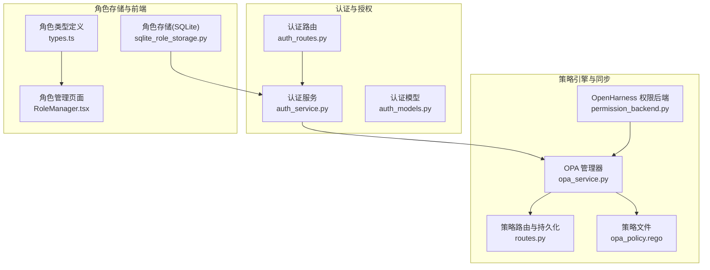
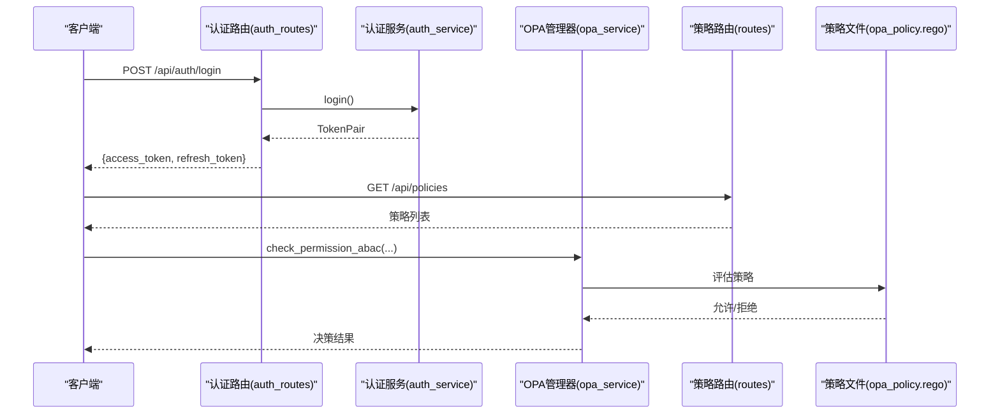
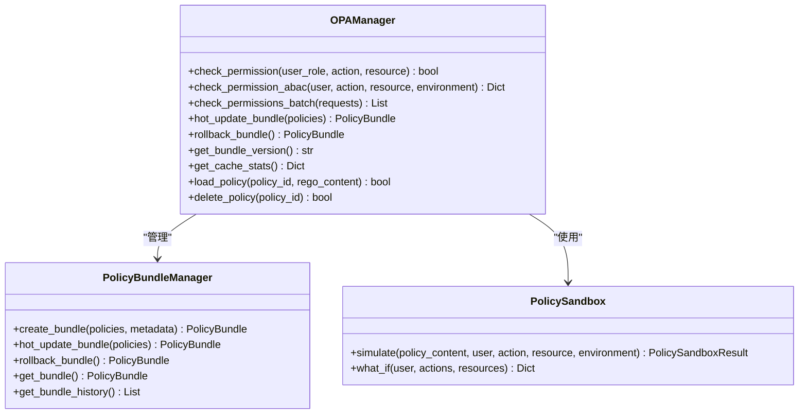
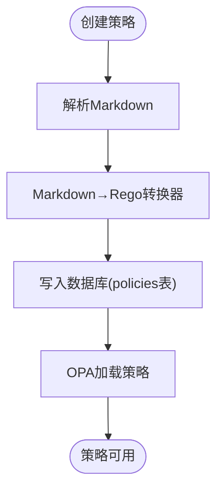
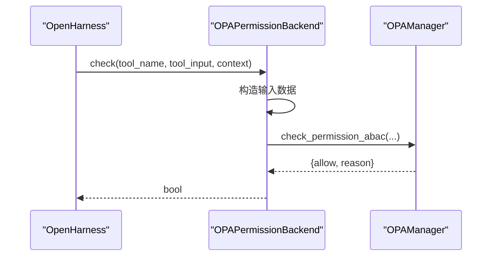
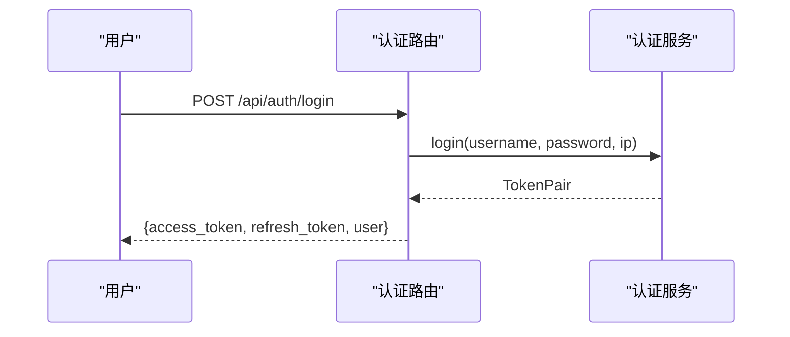
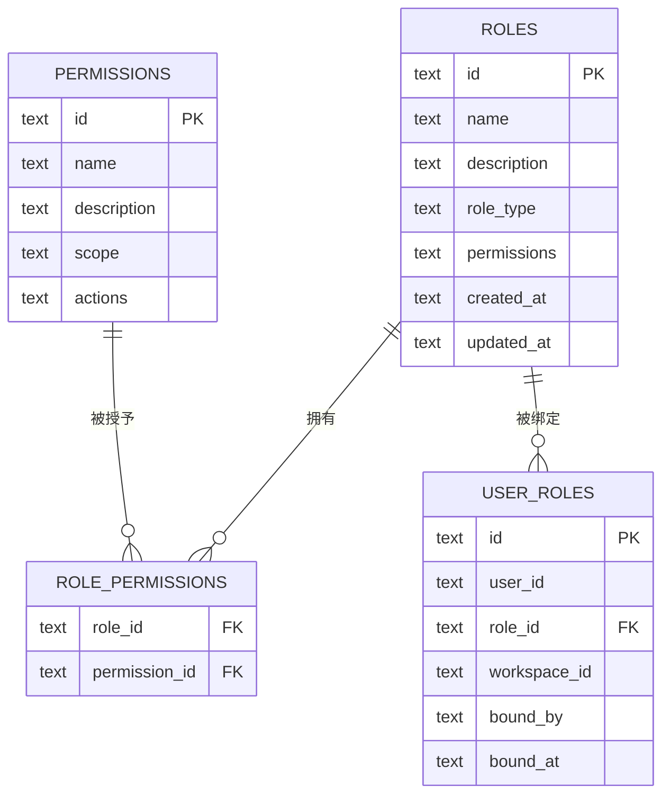
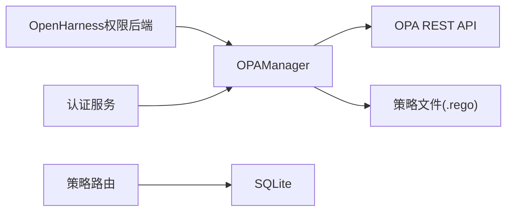

# 角色权限系统

<cite>
**本文引用的文件**
- [odap/infra/opa/opa_service.py](file://odap/infra/opa/opa_service.py)
- [odap/infra/opa/routes.py](file://odap/infra/opa/routes.py)
- [odap/infra/opa/opa_policy.rego](file://odap/infra/opa/opa_policy.rego)
- [odap/infra/openharness/permission_backend.py](file://odap/infra/openharness/permission_backend.py)
- [odap/infra/security/auth_service.py](file://odap/infra/security/auth_service.py)
- [odap/infra/security/auth_routes.py](file://odap/infra/security/auth_routes.py)
- [odap/infra/security/auth_models.py](file://odap/infra/security/auth_models.py)
- [odap/biz/platform/roles/storage/sqlite_role_storage.py](file://odap/biz/platform/roles/storage/sqlite_role_storage.py)
- [docs/03-modules/opa_policy/DESIGN.md](file://docs/03-modules/opa_policy/DESIGN.md)
- [tests/unit/test_role_opa_sync.py](file://tests/unit/test_role_opa_sync.py)
- [frontend/src/modules/roles/types.ts](file://frontend/src/modules/roles/types.ts)
- [frontend/src/modules/roles/pages/RoleManager.tsx](file://frontend/src/modules/roles/pages/RoleManager.tsx)
- [docs/10-api/DATABASE_DESIGN.md](file://docs/10-api/DATABASE_DESIGN.md)
</cite>

## 目录
1. [引言](#引言)
2. [项目结构](#项目结构)
3. [核心组件](#核心组件)
4. [架构总览](#架构总览)
5. [详细组件分析](#详细组件分析)
6. [依赖分析](#依赖分析)
7. [性能考虑](#性能考虑)
8. [故障排查指南](#故障排查指南)
9. [结论](#结论)
10. [附录](#附录)

## 引言
本文件面向系统管理员、开发与测试工程师，提供角色权限系统的全面技术文档。内容涵盖基于OPA策略引擎的权限控制机制、角色定义与管理、权限继承与组合、权限同步机制、用户角色管理流程、权限策略编写规范、OPA策略文件结构与语法、以及API接口与调试审计指南。

## 项目结构
角色权限系统由“认证与授权”“策略引擎与同步”“角色存储与前端管理”三层组成：
- 认证与授权：提供登录、令牌签发与校验、用户与角色管理等能力
- 策略引擎与同步：封装OPA客户端、策略热更新、缓存与沙箱、策略转换与持久化
- 角色存储与前端管理：SQLite角色/权限存储、角色管理UI与类型定义

图示来源
- [odap/infra/security/auth_service.py:82-439](file://odap/infra/security/auth_service.py#L82-L439)
- [odap/infra/security/auth_routes.py:1-143](file://odap/infra/security/auth_routes.py#L1-L143)
- [odap/infra/opa/opa_service.py:455-750](file://odap/infra/opa/opa_service.py#L455-L750)
- [odap/infra/opa/routes.py:1-422](file://odap/infra/opa/routes.py#L1-L422)
- [odap/infra/opa/opa_policy.rego:1-137](file://odap/infra/opa/opa_policy.rego#L1-L137)
- [odap/infra/openharness/permission_backend.py:1-83](file://odap/infra/openharness/permission_backend.py#L1-L83)
- [odap/biz/platform/roles/storage/sqlite_role_storage.py:295-560](file://odap/biz/platform/roles/storage/sqlite_role_storage.py#L295-L560)
- [frontend/src/modules/roles/types.ts:1-31](file://frontend/src/modules/roles/types.ts#L1-L31)
- [frontend/src/modules/roles/pages/RoleManager.tsx:281-319](file://frontend/src/modules/roles/pages/RoleManager.tsx#L281-L319)

章节来源
- [odap/infra/security/auth_service.py:82-439](file://odap/infra/security/auth_service.py#L82-L439)
- [odap/infra/security/auth_routes.py:1-143](file://odap/infra/security/auth_routes.py#L1-L143)
- [odap/infra/opa/opa_service.py:455-750](file://odap/infra/opa/opa_service.py#L455-L750)
- [odap/infra/opa/routes.py:1-422](file://odap/infra/opa/routes.py#L1-L422)
- [odap/infra/opa/opa_policy.rego:1-137](file://odap/infra/opa/opa_policy.rego#L1-L137)
- [odap/infra/openharness/permission_backend.py:1-83](file://odap/infra/openharness/permission_backend.py#L1-L83)
- [odap/biz/platform/roles/storage/sqlite_role_storage.py:295-560](file://odap/biz/platform/roles/storage/sqlite_role_storage.py#L295-L560)
- [frontend/src/modules/roles/types.ts:1-31](file://frontend/src/modules/roles/types.ts#L1-L31)
- [frontend/src/modules/roles/pages/RoleManager.tsx:281-319](file://frontend/src/modules/roles/pages/RoleManager.tsx#L281-L319)

## 核心组件
- OPA 权限管理器：封装ABAC策略评估、策略热更新Bundle、策略沙箱、批量权限检查与缓存
- 策略路由与持久化：提供策略的创建、查询、启用/禁用、版本演进与Markdown转Rego
- OpenHarness 权限后端：将工具调用映射到具体策略，执行ABAC权限检查
- 认证服务与路由：提供JWT签发、刷新、吊销、用户管理、OAuth2对接
- 角色存储与前端：SQLite角色/权限持久化、角色类型与UI管理

章节来源
- [odap/infra/opa/opa_service.py:455-750](file://odap/infra/opa/opa_service.py#L455-L750)
- [odap/infra/opa/routes.py:110-240](file://odap/infra/opa/routes.py#L110-L240)
- [odap/infra/openharness/permission_backend.py:7-83](file://odap/infra/openharness/permission_backend.py#L7-L83)
- [odap/infra/security/auth_service.py:82-439](file://odap/infra/security/auth_service.py#L82-L439)
- [odap/biz/platform/roles/storage/sqlite_role_storage.py:295-560](file://odap/biz/platform/roles/storage/sqlite_role_storage.py#L295-L560)

## 架构总览
系统通过“认证路由→认证服务→OPA管理器/策略路由→策略文件”的链路实现权限控制；OpenHarness侧通过“权限后端→OPA管理器”进行工具级权限校验；角色与权限通过SQLite存储并在前端进行可视化管理。

图示来源
- [odap/infra/security/auth_routes.py:40-80](file://odap/infra/security/auth_routes.py#L40-L80)
- [odap/infra/security/auth_service.py:118-156](file://odap/infra/security/auth_service.py#L118-L156)
- [odap/infra/opa/routes.py:110-134](file://odap/infra/opa/routes.py#L110-L134)
- [odap/infra/opa/opa_service.py:559-583](file://odap/infra/opa/opa_service.py#L559-L583)
- [odap/infra/opa/opa_policy.rego:58-69](file://odap/infra/opa/opa_policy.rego#L58-L69)

## 详细组件分析

### OPA 权限管理器与策略沙箱
- 支持ABAC策略评估、RBAC/PBAC/CBAC模型枚举、决策原因分类
- 提供策略Bundle热更新、回滚与版本管理
- 实现批量权限检查、缓存（LRU+TTL）、命中率统计
- 提供策略沙箱与What-If分析，支持策略调试与模拟

图示来源
- [odap/infra/opa/opa_service.py:455-750](file://odap/infra/opa/opa_service.py#L455-L750)

章节来源
- [odap/infra/opa/opa_service.py:455-750](file://odap/infra/opa/opa_service.py#L455-L750)

### 策略路由与持久化（Markdown→Rego）
- 提供策略的创建、查询、启用/禁用、版本演进
- 内置Markdown到Rego转换器，支持中文动作与条件映射
- 默认策略包含访问控制、数据隐私、合规审计三类

图示来源
- [odap/infra/opa/routes.py:137-240](file://odap/infra/opa/routes.py#L137-L240)
- [odap/infra/opa/routes.py:242-422](file://odap/infra/opa/routes.py#L242-L422)

章节来源
- [odap/infra/opa/routes.py:110-240](file://odap/infra/opa/routes.py#L110-L240)
- [odap/infra/opa/routes.py:242-422](file://odap/infra/opa/routes.py#L242-L422)

### OpenHarness 权限后端
- 将工具名映射到策略路径，构造输入上下文，调用OPA进行ABAC决策
- 默认拒绝（Fail-Close），异常时记录警告并拒绝

图示来源
- [odap/infra/openharness/permission_backend.py:40-76](file://odap/infra/openharness/permission_backend.py#L40-L76)
- [odap/infra/opa/opa_service.py:559-583](file://odap/infra/opa/opa_service.py#L559-L583)

章节来源
- [odap/infra/openharness/permission_backend.py:7-83](file://odap/infra/openharness/permission_backend.py#L7-L83)

### 认证服务与路由
- 支持本地账号密码、JWT签发/刷新/吊销、OAuth2/OIDC、登录限流
- 提供用户注册、查询、更新、删除、API Key管理

图示来源
- [odap/infra/security/auth_routes.py:40-80](file://odap/infra/security/auth_routes.py#L40-L80)
- [odap/infra/security/auth_service.py:118-156](file://odap/infra/security/auth_service.py#L118-L156)

章节来源
- [odap/infra/security/auth_routes.py:1-143](file://odap/infra/security/auth_routes.py#L1-L143)
- [odap/infra/security/auth_service.py:82-439](file://odap/infra/security/auth_service.py#L82-L439)

### 角色存储与前端管理
- SQLite存储角色、权限、角色-权限关联、用户角色绑定
- 前端提供角色类型与权限选择、创建/更新/删除、批量操作

图示来源
- [docs/10-api/DATABASE_DESIGN.md:262-303](file://docs/10-api/DATABASE_DESIGN.md#L262-L303)
- [odap/biz/platform/roles/storage/sqlite_role_storage.py:295-560](file://odap/biz/platform/roles/storage/sqlite_role_storage.py#L295-L560)

章节来源
- [odap/biz/platform/roles/storage/sqlite_role_storage.py:295-560](file://odap/biz/platform/roles/storage/sqlite_role_storage.py#L295-L560)
- [frontend/src/modules/roles/types.ts:1-31](file://frontend/src/modules/roles/types.ts#L1-L31)
- [frontend/src/modules/roles/pages/RoleManager.tsx:281-319](file://frontend/src/modules/roles/pages/RoleManager.tsx#L281-L319)

## 依赖分析
- 组件耦合
  - OPAManager 依赖 OPAClient 与策略文件，提供ABAC评估与缓存
  - 策略路由依赖SQLite持久化，提供策略生命周期管理
  - OpenHarness 权限后端依赖 OPAManager 进行工具级权限校验
  - 认证服务为OPA提供用户上下文（角色、属性）
- 外部依赖
  - OPA REST API（健康检查、策略PUT/DELETE、数据评估）
  - SQLite（策略与角色权限持久化）

图示来源
- [odap/infra/opa/opa_service.py:373-450](file://odap/infra/opa/opa_service.py#L373-L450)
- [odap/infra/opa/routes.py:17-34](file://odap/infra/opa/routes.py#L17-L34)
- [odap/infra/openharness/permission_backend.py:26-38](file://odap/infra/openharness/permission_backend.py#L26-L38)
- [odap/infra/security/auth_service.py:82-156](file://odap/infra/security/auth_service.py#L82-L156)

章节来源
- [odap/infra/opa/opa_service.py:373-450](file://odap/infra/opa/opa_service.py#L373-L450)
- [odap/infra/opa/routes.py:17-34](file://odap/infra/opa/routes.py#L17-L34)
- [odap/infra/openharness/permission_backend.py:26-38](file://odap/infra/openharness/permission_backend.py#L26-L38)
- [odap/infra/security/auth_service.py:82-156](file://odap/infra/security/auth_service.py#L82-L156)

## 性能考虑
- 缓存策略：OPA管理器内置LRU缓存与TTL，命中率统计用于容量规划
- 批量检查：支持批量权限请求，减少网络往返
- 策略优化：建议将常用策略放入OPA内存，避免频繁HTTP调用
- 数据库：策略与角色权限采用SQLite，注意索引与查询限制参数

章节来源
- [odap/infra/opa/opa_service.py:473-480](file://odap/infra/opa/opa_service.py#L473-L480)
- [odap/infra/opa/opa_service.py:585-598](file://odap/infra/opa/opa_service.py#L585-L598)
- [odap/infra/opa/routes.py:114-128](file://odap/infra/opa/routes.py#L114-L128)

## 故障排查指南
- OPA不可用
  - 现象：OPA健康检查失败，回退到Mock评估
  - 处理：检查OPA服务状态、网络连通性；必要时启用Mock模式进行降级
- 权限判定异常
  - 现象：工具调用被拒绝（Fail-Close）
  - 处理：通过策略沙箱/What-If分析定位规则；核对角色权限映射与资源属性
- 策略更新失败
  - 现象：策略上传/删除失败
  - 处理：检查策略内容合法性、OPA服务状态；必要时回滚到上一版本
- 用户管理问题
  - 现象：登录失败、令牌无效、用户不存在
  - 处理：检查凭据、限流阈值、刷新令牌状态；确认用户状态与角色

章节来源
- [odap/infra/opa/opa_service.py:482-489](file://odap/infra/opa/opa_service.py#L482-L489)
- [odap/infra/opa/opa_service.py:546-557](file://odap/infra/opa/opa_service.py#L546-L557)
- [odap/infra/opa/opa_service.py:684-705](file://odap/infra/opa/opa_service.py#L684-L705)
- [odap/infra/security/auth_routes.py:40-80](file://odap/infra/security/auth_routes.py#L40-L80)
- [odap/infra/security/auth_service.py:118-156](file://odap/infra/security/auth_service.py#L118-L156)

## 结论
本系统以OPA为核心，结合ABAC策略、策略沙箱与缓存机制，提供高可维护、可调试、可扩展的权限控制能力；配合SQLite角色存储与前端管理界面，形成从策略制定到落地执行的完整闭环。建议在生产环境中启用健康检查与监控审计，并定期进行策略回归与权限梳理。

## 附录

### 权限策略编写规范与OPA策略文件结构
- 策略包命名：遵循领域划分（如domain、policies.xxx）
- 角色与权限映射：roles与permission_mapping保持一致
- 限制规则：通过restrictions与is_restricted实现Fail-Close
- 调试辅助：提供decision_reason便于定位拒绝原因

章节来源
- [odap/infra/opa/opa_policy.rego:21-131](file://odap/infra/opa/opa_policy.rego#L21-L131)
- [docs/03-modules/opa_policy/DESIGN.md:115-151](file://docs/03-modules/opa_policy/DESIGN.md#L115-L151)

### 角色权限API接口文档（认证与策略）
- 认证
  - POST /api/auth/login：用户名密码登录，返回TokenPair与用户信息
  - GET /api/auth/me：获取当前用户信息
  - POST /api/auth/refresh：刷新令牌
  - GET /api/auth/users：管理员列出用户
  - POST /api/auth/users：管理员创建用户
  - PUT /api/auth/users/{user_id}：管理员更新用户
  - DELETE /api/auth/users/{user_id}：管理员删除用户
- 策略
  - GET /api/policies：分页查询策略
  - POST /api/policies：创建策略（Markdown→Rego）
  - GET /api/policies/{policy_id}：查询策略详情
  - PUT /api/policies/{policy_id}：更新策略（版本递增）
  - POST /api/policies/{policy_id}/toggle：启用/禁用策略

章节来源
- [odap/infra/security/auth_routes.py:40-142](file://odap/infra/security/auth_routes.py#L40-L142)
- [odap/infra/opa/routes.py:110-240](file://odap/infra/opa/routes.py#L110-L240)

### 角色配置、权限调试与安全审计实用指南
- 角色配置
  - 在前端角色管理页面选择角色类型与权限集合，保存后持久化至SQLite
  - 通过策略路由创建/更新策略，确保Rego内容与角色权限一致
- 权限调试
  - 使用OPA管理器的策略沙箱与What-If分析，快速验证策略效果
  - 通过缓存统计与性能指标评估策略执行效率
- 安全审计
  - 记录策略检查历史与缓存命中情况，定期审查异常与慢查询
  - 对高风险操作（如攻击、删除）增加条件约束与审批流程

章节来源
- [frontend/src/modules/roles/pages/RoleManager.tsx:281-319](file://frontend/src/modules/roles/pages/RoleManager.tsx#L281-L319)
- [odap/infra/opa/opa_service.py:631-647](file://odap/infra/opa/opa_service.py#L631-L647)
- [odap/infra/opa/opa_service.py:668-714](file://odap/infra/opa/opa_service.py#L668-L714)
- [odap/biz/platform/roles/storage/sqlite_role_storage.py:295-560](file://odap/biz/platform/roles/storage/sqlite_role_storage.py#L295-L560)