# Agent智能体系统

<cite>
**本文档引用的文件**
- [agent_factory.py](file://odap/biz/core/agent/agent_factory.py)
- [orchestrator.py](file://odap/biz/core/agent/orchestrator.py)
- [swarm_orchestrator.py](file://odap/biz/core/agent/swarm_orchestrator.py)
- [intelligence_agent.py](file://odap/biz/core/agent/intelligence_agent.py)
- [user_cognition_engine.py](file://odap/biz/core/cognition/user_cognition_engine.py)
- [qa_ontology_builder.py](file://odap/biz/core/ontology/services/qa_ontology_builder.py)
- [event_bus.py](file://odap/web/ws/event_bus.py)
- [hook_system.py](file://odap/infra/events/hook_system.py)
- [agent_config.yaml](file://config/agent_config.yaml)
- [app.py](file://odap/web/api/app.py)
- [decision_chain.py](file://odap/biz/core/agent/models/decision_chain.py)
- [decision_routes.py](file://odap/biz/core/agent/api/decision_routes.py)
- [decision_service.py](file://odap/biz/core/agent/services/decision_service.py)
- [routes.py](file://odap/biz/core/agent/api/routes.py)
</cite>

## 更新摘要
**所做更改**
- 新增DomainSwarm框架的详细架构与实现分析
- 添加IntentRouter混合路由组件的技术规范
- 新增SubAgentPlanner子代理规划器的功能说明
- 新增DecisionChain决策链模型的数据结构定义
- 更新Swarm编排器架构，反映新的多Agent协作机制
- 增强API接口规范，包含新的决策链路与任务管理接口
- 补充决策过程可视化与实时推送功能

## 目录
1. [简介](#简介)
2. [项目结构](#项目结构)
3. [核心组件](#核心组件)
4. [架构总览](#架构总览)
5. [详细组件分析](#详细组件分析)
6. [依赖关系分析](#依赖关系分析)
7. [性能考量](#性能考量)
8. [故障排查指南](#故障排查指南)
9. [结论](#结论)
10. [附录](#附录)

## 简介
本文件为Agent智能体系统的全面技术文档，覆盖智能体工厂设计模式、智能体编排器架构、Swarm协作机制、意图识别系统、智能体存储系统、API接口规范、消息格式与事件模型，并提供实际开发案例、集成指南、性能调优与故障诊断方法。文档以代码为依据，结合架构图与流程图，帮助开发者快速理解并高效集成Agent系统。

**更新** 本次更新重点反映了DomainSwarm框架、IntentRouter组件、SubAgentPlanner、DecisionChain模型等重大增强功能的实现与集成。

## 项目结构
Agent系统由多层模块构成，涵盖智能体生命周期管理、编排与协作、意图识别与认知、事件总线与钩子系统、以及API与存储等基础设施。整体采用分层与模块化设计，便于扩展与维护。

```mermaid
graph TB
subgraph "应用层"
API["API网关<br/>odap/web/api/app.py"]
WS["事件总线<br/>odap/web/ws/event_bus.py"]
DECISION_API["决策API<br/>odap/biz/core/agent/api/decision_routes.py"]
INTENT_API["意图API<br/>odap/biz/core/agent/api/routes.py"]
end
subgraph "智能体核心"
AF["智能体工厂<br/>odap/biz/core/agent/agent_factory.py"]
SWARM["DomainSwarm<br/>odap/biz/core/agent/swarm_orchestrator.py"]
INT["情报Agent<br/>odap/biz/core/agent/intelligence_agent.py"]
ORCH["自校正编排器<br/>odap/biz/core/agent/orchestrator.py"]
END
subgraph "认知与意图"
UCE["用户认知引擎<br/>odap/biz/core/cognition/user_cognition_engine.py"]
QA["QA本体构建器<br/>odap/biz/core/ontology/services/qa_ontology_builder.py"]
INTENT_ROUTER["意图路由器<br/>IntentRouter"]
SUB_PLANNER["子代理规划器<br/>SubAgentPlanner"]
DECISION_CHAIN["决策链模型<br/>DecisionChain"]
END
subgraph "基础设施"
HOOK["钩子系统<br/>odap/infra/events/hook_system.py"]
CFG["配置<br/>config/agent_config.yaml"]
SK["技能系统<br/>odap/biz/platform/skill_system/__init__.py"]
TR["工具注册表<br/>odap/biz/platform/tool_registry/__init__.py"]
SM["会话记忆<br/>odap/biz/platform/session_memory/__init__.py"]
WK["工作空间<br/>odap/biz/platform/workspace/__init__.py"]
DECISION_SERVICE["决策服务<br/>DecisionService"]
END
API --> SWARM
API --> INT
API --> ORCH
API --> WS
API --> DECISION_API
API --> INTENT_API
SWARM --> AF
SWARM --> INTENT_ROUTER
SWARM --> SUB_PLANNER
SWARM --> DECISION_SERVICE
INT --> TR
INT --> SK
INT --> UCE
UCE --> QA
DECISION_SERVICE --> DECISION_CHAIN
WS --> HOOK
AF --> HOOK
CFG --> INT
CFG --> SWARM
```

**图表来源**
- [app.py:1-200](file://odap/web/api/app.py#L1-L200)
- [swarm_orchestrator.py:398-425](file://odap/biz/core/agent/swarm_orchestrator.py#L398-L425)
- [decision_routes.py:1-89](file://odap/biz/core/agent/api/decision_routes.py#L1-L89)
- [decision_chain.py:1-33](file://odap/biz/core/agent/models/decision_chain.py#L1-L33)
- [decision_service.py:1-43](file://odap/biz/core/agent/services/decision_service.py#L1-L43)
- [routes.py:44-70](file://odap/biz/core/agent/api/routes.py#L44-L70)

**章节来源**
- [app.py:1-200](file://odap/web/api/app.py#L1-L200)
- [swarm_orchestrator.py:398-425](file://odap/biz/core/agent/swarm_orchestrator.py#L398-L425)
- [decision_routes.py:1-89](file://odap/biz/core/agent/api/decision_routes.py#L1-L89)
- [decision_chain.py:1-33](file://odap/biz/core/agent/models/decision_chain.py#L1-L33)
- [decision_service.py:1-43](file://odap/biz/core/agent/services/decision_service.py#L1-L43)
- [routes.py:44-70](file://odap/biz/core/agent/api/routes.py#L44-L70)

## 核心组件
- 智能体工厂：提供工厂模式的Agent生命周期管理、追踪与角色能力管理，支持并发安全与全局单例。
- DomainSwarm编排器：实现三Agent（Commander/Intelligence/Operations）的完整OODA循环协作，支持流式进度返回、状态持久化与决策链路追踪。
- 意图路由器（IntentRouter）：混合路由策略，结合规则优先和LLM兜底，支持关键词匹配、置信度计算与默认路由。
- 子代理规划器（SubAgentPlanner）：按意图自动规划subAgent任务分解，生成具体的执行任务序列。
- 决策链模型（DecisionChain）：完整的决策过程数据结构，包含步骤、推理过程、证据与时间戳。
- 情报Agent：基于LLM ReAct模式的自然语言理解与工具调用闭环，具备RAG增强与链路追踪。
- 自校正编排器：基于关键词正则的任务路由与执行，配合OPA权限校验。
- 用户认知引擎：意图识别、知识导航、推理链追踪、解释引擎与角色视图管理。
- QA本体构建器：意图分析、联网搜索、数据摄入与本体构建的全流程。
- 事件总线与钩子系统：WebSocket事件广播、订阅与生命周期钩子拦截增强。
- 配置与基础设施：模型提供商配置、技能系统、工具注册表、会话记忆与工作空间管理。

**章节来源**
- [swarm_orchestrator.py:288-687](file://odap/biz/core/agent/swarm_orchestrator.py#L288-L687)
- [swarm_orchestrator.py:288-425](file://odap/biz/core/agent/swarm_orchestrator.py#L288-L425)
- [decision_chain.py:16-33](file://odap/biz/core/agent/models/decision_chain.py#L16-L33)
- [decision_service.py:10-43](file://odap/biz/core/agent/services/decision_service.py#L10-L43)

## 架构总览
Agent系统采用"应用层API/WS + 智能体核心 + 认知与意图 + 基础设施"的分层架构。应用层负责对外提供REST/WebSocket接口；智能体核心负责任务编排、协作与追踪；认知与意图模块负责自然语言理解与知识推理；基础设施提供钩子、事件、配置与工具支撑。

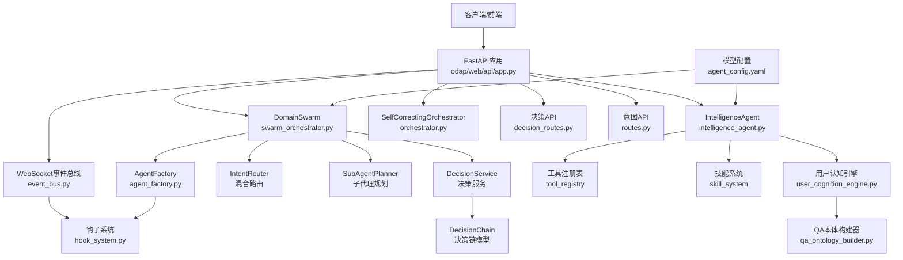

**图表来源**
- [app.py:1-200](file://odap/web/api/app.py#L1-L200)
- [swarm_orchestrator.py:398-425](file://odap/biz/core/agent/swarm_orchestrator.py#L398-L425)
- [decision_routes.py:1-89](file://odap/biz/core/agent/api/decision_routes.py#L1-L89)
- [decision_chain.py:1-33](file://odap/biz/core/agent/models/decision_chain.py#L1-L33)
- [decision_service.py:1-43](file://odap/biz/core/agent/services/decision_service.py#L1-L43)
- [routes.py:44-70](file://odap/biz/core/agent/api/routes.py#L44-L70)

## 详细组件分析

### DomainSwarm框架与完整OODA循环
- 架构：DomainSwarm继承/封装OpenHarness Swarm，实现完整的四阶段OODA循环（Observe→Orient→Decide→Act）。
- Agent角色模型：Commander（决策中枢）、Intelligence（情报分析）、Operations（执行中枢），支持权限级别与工具配置。
- 关键特性：
  - 完整的OODA循环实现，每个阶段都有明确的Agent职责
  - 支持同步执行与流式进度返回，提供详细的执行状态
  - 集成Graphiti知识图谱写入，实现决策过程的知识化存储
  - 健康监控、故障恢复与状态持久化机制
  - 意图路由与子代理规划器集成，实现智能化任务分配

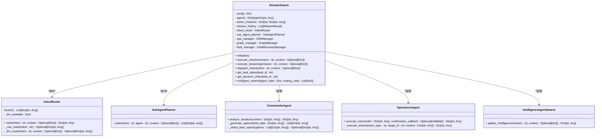

**图表来源**
- [swarm_orchestrator.py:398-425](file://odap/biz/core/agent/swarm_orchestrator.py#L398-L425)
- [swarm_orchestrator.py:288-425](file://odap/biz/core/agent/swarm_orchestrator.py#L288-L425)

**章节来源**
- [swarm_orchestrator.py:398-425](file://odap/biz/core/agent/swarm_orchestrator.py#L398-L425)
- [swarm_orchestrator.py:493-570](file://odap/biz/core/agent/swarm_orchestrator.py#L493-L570)
- [swarm_orchestrator.py:572-681](file://odap/biz/core/agent/swarm_orchestrator.py#L572-L681)

### 意图路由器（IntentRouter）与混合路由策略
- 设计理念：结合规则路由与LLM路由的混合策略，提高意图识别的准确性与鲁棒性。
- 规则路由：基于预定义的关键字匹配，支持高置信度的确定性路由。
- LLM路由：在规则无法确定时，调用LLM进行分类意图识别，提供灵活性。
- 默认路由：当所有路由方式都无法确定时，路由到Intelligence Agent作为默认策略。
- 关键特性：
  - 支持95%置信度以上的规则路由直接返回
  - LLM路由提供兜底能力，置信度范围0.7-0.9
  - 动态检测LLM可用性，优雅降级
  - 支持关键字匹配度计算与置信度调整

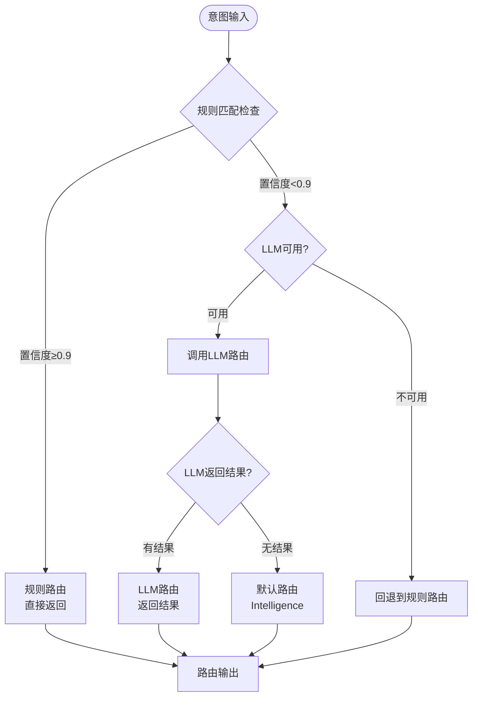

**图表来源**
- [swarm_orchestrator.py:288-375](file://odap/biz/core/agent/swarm_orchestrator.py#L288-L375)

**章节来源**
- [swarm_orchestrator.py:288-375](file://odap/biz/core/agent/swarm_orchestrator.py#L288-L375)

### 子代理规划器（SubAgentPlanner）与任务分解
- 功能：根据分配的Agent类型和用户意图，自动生成具体的subAgent任务序列。
- 任务分解策略：
  - Intelligence Agent：情报收集 + 模式分析
  - Commander Agent：情报收集 + 情势分析 + 决策制定
  - Operations Agent：情报收集 + 情势分析 + 命令执行
- 关键特性：
  - 基于Agent职责的层次化任务分解
  - 支持上下文传递，确保任务间的连贯性
  - 可扩展的任务类型与参数配置
  - 与Swarm编排器的无缝集成

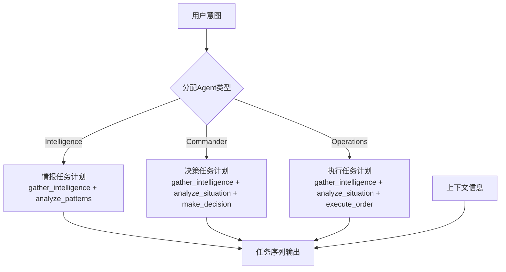

**图表来源**
- [swarm_orchestrator.py:377-395](file://odap/biz/core/agent/swarm_orchestrator.py#L377-L395)

**章节来源**
- [swarm_orchestrator.py:377-395](file://odap/biz/core/agent/swarm_orchestrator.py#L377-L395)

### 决策链模型（DecisionChain）与过程追踪
- 数据结构：完整的决策过程数据模型，支持步骤记录、推理过程与证据追踪。
- 决策阶段：Observe（感知）、Orient（理解）、Decide（决策）、Act（执行）四个阶段。
- 关键特性：
  - 每个步骤包含唯一ID、阶段标识、描述、证据列表与时间戳
  - 支持推理过程的文本记录与证据链追踪
  - 提供决策链的创建、更新与查询接口
  - 与Swarm编排器的执行状态同步

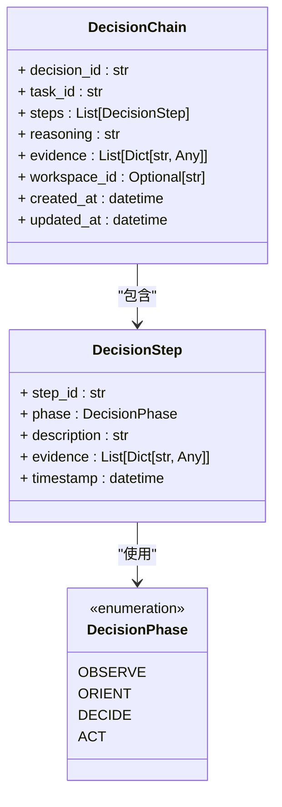

**图表来源**
- [decision_chain.py:16-33](file://odap/biz/core/agent/models/decision_chain.py#L16-L33)

**章节来源**
- [decision_chain.py:16-33](file://odap/biz/core/agent/models/decision_chain.py#L16-L33)
- [decision_service.py:10-43](file://odap/biz/core/agent/services/decision_service.py#L10-L43)

### 智能体工厂与追踪系统
- 设计模式：工厂模式负责Agent实例化与生命周期管理；角色管理器集中定义角色与能力；追踪系统提供Trace/TraceSpan的全链路记录。
- 关键特性：
  - 并发安全：使用锁保护实例与配置注册表。
  - 全局单例：延迟初始化AgentFactory并注册三类Agent类型。
  - 追踪收集：TraceCollector支持内存队列与统计分析。
  - 角色能力：RoleManager内置Commander/Intelligence/Operations角色及能力矩阵。

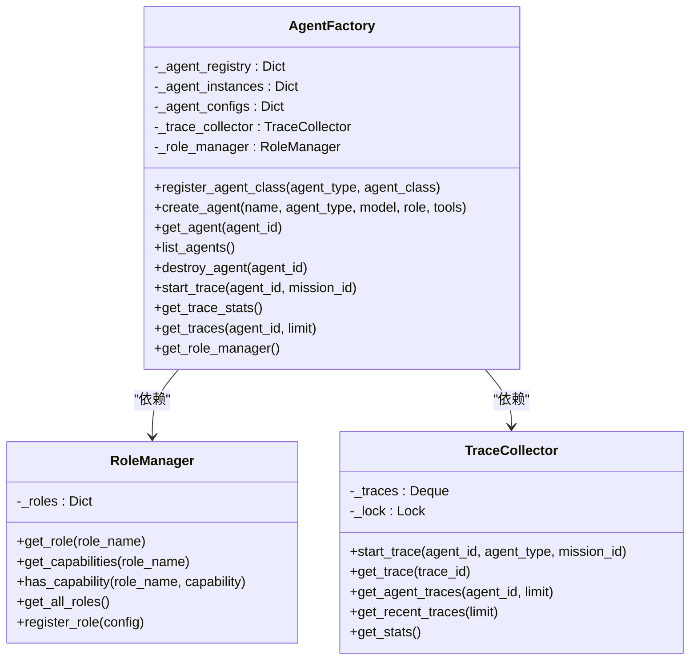

**图表来源**
- [agent_factory.py:340-442](file://odap/biz/core/agent/agent_factory.py#L340-L442)

**章节来源**
- [agent_factory.py:340-442](file://odap/biz/core/agent/agent_factory.py#L340-L442)

### Swarm编排器与OODA循环
- 架构：DomainSwarm初始化三个Agent并协调执行完整OODA循环；支持同步执行与流式进度返回。
- OODA阶段：
  - Observe（Intelligence）：收集领域情报与威胁数据。
  - Orient（Intelligence）：结合RAG上下文进行理解分析。
  - Decide（Commander）：生成决策选项与是否需要确认。
  - Act（Operations）：执行命令并返回结果。
- 状态管理：检查点持久化、健康监控、故障恢复与历史记录。

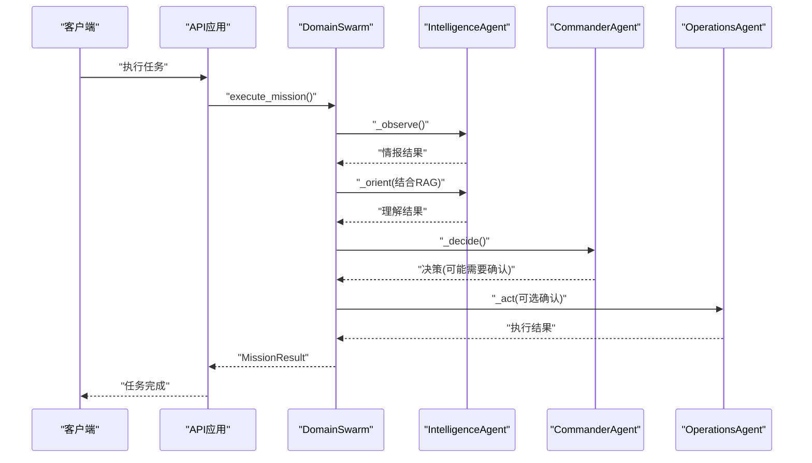

**图表来源**
- [swarm_orchestrator.py:379-456](file://odap/biz/core/agent/swarm_orchestrator.py#L379-L456)

**章节来源**
- [swarm_orchestrator.py:288-687](file://odap/biz/core/agent/swarm_orchestrator.py#L288-L687)

### 情报Agent与ReAct推理
- 模式：基于LLM的ReAct（推理+行动）循环，结合RAG上下文注入与工具调用。
- 能力：
  - RAG检索：从Graphiti查询服务获取历史情报上下文。
  - 工具调用：从技能目录动态构建函数schema并调用。
  - 权限控制：高危操作通过OPA进行权限校验。
  - 链路追踪：每轮迭代生成TraceSpan并记录事件。
  - 记忆写入：将分析过程写入Graphiti以形成知识记忆。

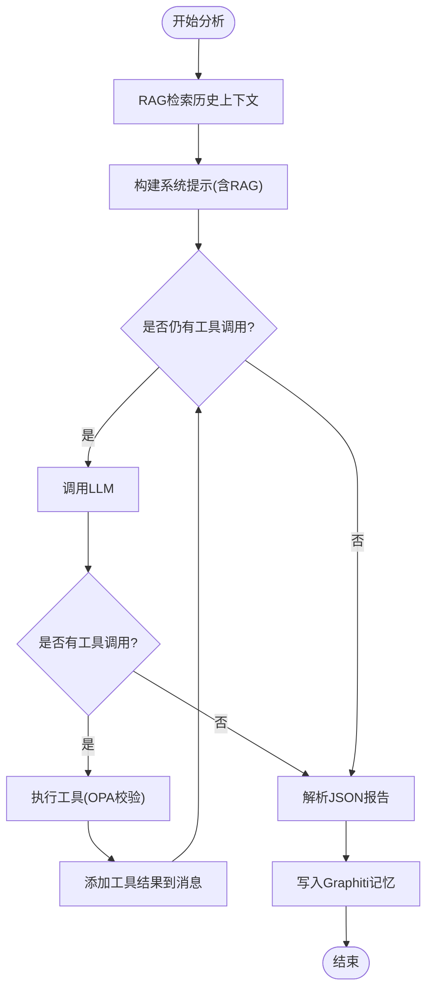

**图表来源**
- [intelligence_agent.py:307-527](file://odap/biz/core/agent/intelligence_agent.py#L307-L527)

**章节来源**
- [intelligence_agent.py:73-599](file://odap/biz/core/agent/intelligence_agent.py#L73-L599)

### 自校正编排器与任务路由
- 功能：基于关键词正则解析用户查询，确定所需技能与参数，执行技能并返回结果。
- 安全：结合用户角色与OPA策略进行访问控制与拦截。
- 示例：支持"搜索雷达"、"分析领域"、"推荐打击目标"、"力量对比"、"攻击目标"、"指挥部队"等查询。

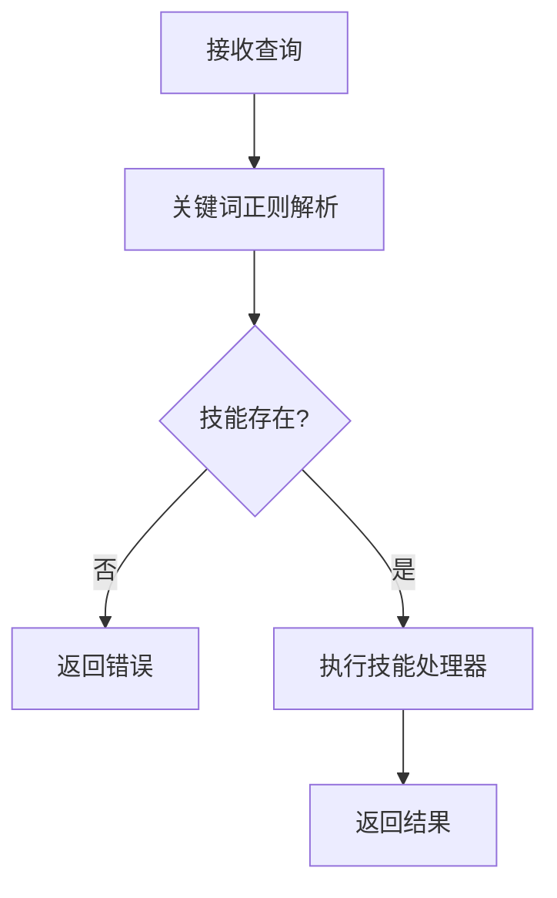

**图表来源**
- [orchestrator.py:64-114](file://odap/biz/core/agent/orchestrator.py#L64-L114)

**章节来源**
- [orchestrator.py:16-151](file://odap/biz/core/agent/orchestrator.py#L16-L151)

### 用户认知引擎与意图识别
- 意图识别：基于正则模式匹配识别查询意图（查询、动作、解释、推荐、导航、比较、分析）。
- 实体抽取：雷达、目标、单位、位置等实体识别。
- 知识导航：基于查询服务或图谱客户端进行检索、邻接节点与实体上下文获取。
- 推理链追踪：创建与可视化推理链，支持"为什么"解释。
- 角色视图：为不同角色提供默认视图与布局配置。

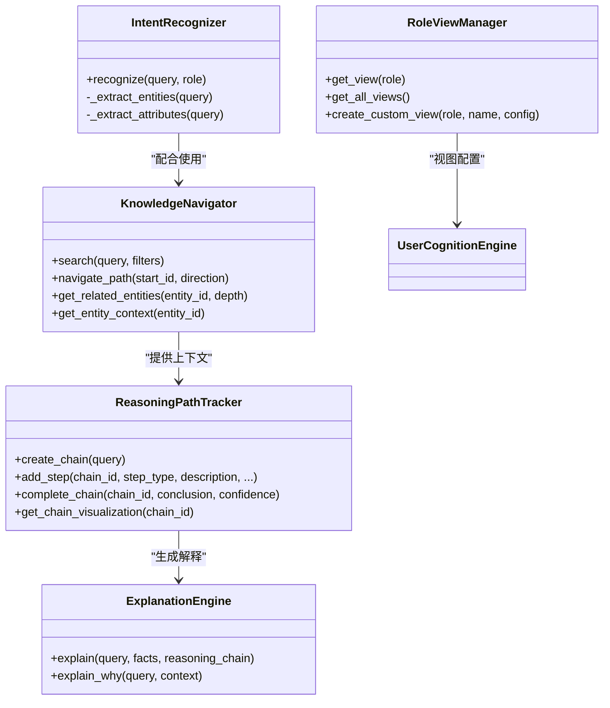

**图表来源**
- [user_cognition_engine.py:140-800](file://odap/biz/core/cognition/user_cognition_engine.py#L140-L800)

**章节来源**
- [user_cognition_engine.py:140-800](file://odap/biz/core/cognition/user_cognition_engine.py#L140-L800)

### QA本体构建与意图分析
- 流程：意图分析 → 联网搜索 → 数据摄入 → 本体构建 → 智能回复。
- 进度跟踪：QABuildProgress记录各阶段状态与百分比。
- 意图类型：查询、更新、创建、分析、动作、解释、推荐、导航、比较。

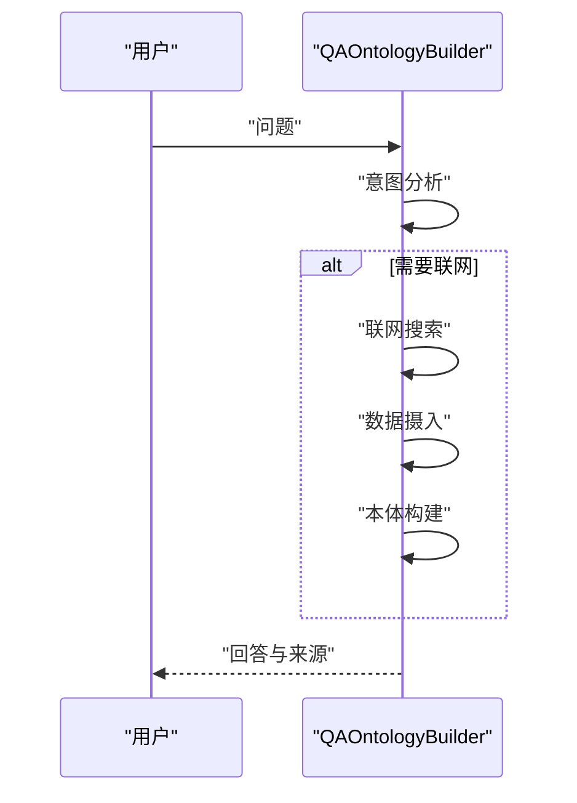

**图表来源**
- [qa_ontology_builder.py:94-186](file://odap/biz/core/ontology/services/qa_ontology_builder.py#L94-L186)

**章节来源**
- [qa_ontology_builder.py:76-508](file://odap/biz/core/ontology/services/qa_ontology_builder.py#L76-L508)

### 事件总线与钩子系统
- 事件总线：支持按工作空间分发、订阅回调、事件历史与统计。
- 钩子系统：提供PRE/POST/ON_ERROR阶段、优先级与标签管理，内置审计、计时与OPA权限钩子。

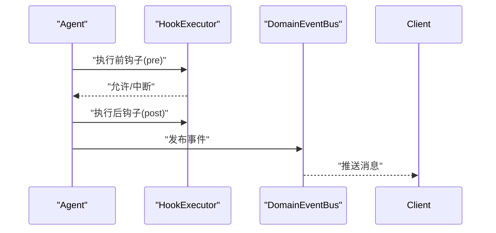

**图表来源**
- [hook_system.py:171-257](file://odap/infra/events/hook_system.py#L171-L257)
- [event_bus.py:34-95](file://odap/web/ws/event_bus.py#L34-L95)

**章节来源**
- [hook_system.py:68-428](file://odap/infra/events/hook_system.py#L68-L428)
- [event_bus.py:13-147](file://odap/web/ws/event_bus.py#L13-L147)

## 依赖关系分析
- 模块耦合：
  - 智能体工厂与Swarm编排器耦合紧密，前者提供Agent实例与追踪，后者协调执行。
  - DomainSwarm内部集成IntentRouter与SubAgentPlanner，实现智能化任务分配与分解。
  - 决策服务与决策链模型提供完整的决策过程追踪与可视化支持。
  - 情报Agent依赖工具注册表与技能系统，同时与用户认知引擎协作。
  - 事件总线与钩子系统贯穿各模块，提供可观测性与扩展点。
- 外部依赖：
  - LLM推理与HTTP客户端、查询服务、图管理、OPA策略引擎、WebSocket服务等。

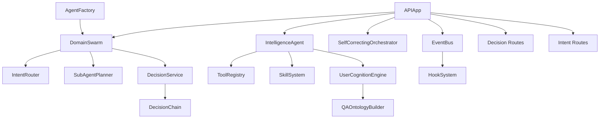

**图表来源**
- [agent_factory.py:340-442](file://odap/biz/core/agent/agent_factory.py#L340-L442)
- [swarm_orchestrator.py:398-425](file://odap/biz/core/agent/swarm_orchestrator.py#L398-L425)
- [decision_routes.py:1-89](file://odap/biz/core/agent/api/decision_routes.py#L1-L89)
- [decision_chain.py:1-33](file://odap/biz/core/agent/models/decision_chain.py#L1-L33)

**章节来源**
- [agent_factory.py:340-442](file://odap/biz/core/agent/agent_factory.py#L340-L442)
- [swarm_orchestrator.py:398-425](file://odap/biz/core/agent/swarm_orchestrator.py#L398-L425)
- [decision_routes.py:1-89](file://odap/biz/core/agent/api/decision_routes.py#L1-L89)
- [decision_chain.py:1-33](file://odap/biz/core/agent/models/decision_chain.py#L1-L33)

## 性能考量
- 并发与锁：智能体工厂使用可重入锁保证线程安全；追踪收集器使用固定容量队列避免内存膨胀。
- 异步与流式：Swarm支持异步执行与流式进度返回，降低端到端等待时间。
- LLM调用优化：情报Agent使用复用的HTTP客户端、指数退避重试与连接限制，提升稳定性。
- RAG上下文：合理限制检索数量与长度，避免上下文过长导致性能下降。
- 事件广播：WebSocket事件总线支持按工作空间分发，减少无效广播。
- 决策链追踪：DecisionChain模型采用增量更新策略，避免大数据量下的性能问题。
- 意图路由：IntentRouter的规则匹配采用高效的字符串搜索算法，支持大量关键字的快速匹配。

## 故障排查指南
- 权限与策略：检查OPA策略与角色配置，确认权限校验是否通过。
- LLM调用：关注HTTP状态码与超时重试，必要时调整模型与基础URL。
- 事件订阅：确认事件总线订阅回调是否抛出异常，影响后续事件分发。
- 钩子执行：查看钩子执行历史与错误记录，定位PRE/POST/ON_ERROR阶段的问题。
- 智能体追踪：通过TraceCollector统计与Trace详情定位执行瓶颈与失败节点。
- DomainSwarm执行：检查各Agent的状态变化，确认OODA循环的每个阶段是否正常完成。
- 意图路由：验证IntentRouter的规则匹配与LLM路由配置，确保路由准确性。
- 决策链路：通过DecisionChain模型检查决策过程的完整性与一致性。

**章节来源**
- [hook_system.py:242-257](file://odap/infra/events/hook_system.py#L242-L257)
- [intelligence_agent.py:173-213](file://odap/biz/core/agent/intelligence_agent.py#L173-L213)
- [event_bus.py:48-56](file://odap/web/ws/event_bus.py#L48-L56)
- [agent_factory.py:180-242](file://odap/biz/core/agent/agent_factory.py#L180-L242)
- [swarm_orchestrator.py:493-570](file://odap/biz/core/agent/swarm_orchestrator.py#L493-L570)

## 结论
Agent智能体系统通过工厂模式、DomainSwarm协作、意图识别与事件钩子等模块，实现了从任务编排到知识推理的完整闭环。新增的IntentRouter混合路由、SubAgentPlanner任务分解、DecisionChain决策链等组件进一步增强了系统的智能化水平与可追溯性。系统具备良好的扩展性与可观测性，适合在复杂领域任务中部署与演进。建议在生产环境中结合配置管理、监控与审计体系，持续优化性能与稳定性。

## 附录

### API接口规范与消息格式
- WebSocket事件类型：
  - entity:changed、intel:updated、action:result、oadp:progress、opa:check、audit:event
- 事件负载字段：
  - type、data、workspace_id、timestamp
- 订阅与广播：支持按工作空间过滤与历史事件回放。
- 决策API：
  - GET /api/agent/decisions/{decision_id} - 获取决策详情
  - GET /api/agent/decisions/{decision_id}/chain - 获取决策链路
  - GET /api/agent/decisions - 列出决策
  - POST /api/agent/decisions - 创建决策
  - POST /api/agent/decisions/{decision_id}/steps - 记录决策步骤
- 意图API：
  - POST /api/agent/dispatch - 意图分发
  - GET /api/agent/tasks/{task_id} - 任务状态
  - GET /api/agent/tasks/{task_id}/chain - 决策链路
  - POST /api/agent/swarm/configure - Swarm配置

**章节来源**
- [event_bus.py:34-140](file://odap/web/ws/event_bus.py#L34-L140)
- [decision_routes.py:1-89](file://odap/biz/core/agent/api/decision_routes.py#L1-L89)
- [routes.py:44-70](file://odap/biz/core/agent/api/routes.py#L44-L70)

### 配置与环境
- 模型提供商配置：支持OpenAI、Anthropic、HTTP等多种Provider，可配置模型、温度与基础URL。
- 环境变量：LLM API Key/Base/Model从安全配置模块读取，确保正确加载。
- Swarm配置：支持Agent角色配置、路由规则配置与执行参数调整。

**章节来源**
- [agent_config.yaml:1-23](file://config/agent_config.yaml#L1-L23)
- [intelligence_agent.py:95-117](file://odap/biz/core/agent/intelligence_agent.py#L95-L117)
- [swarm_orchestrator.py:426-437](file://odap/biz/core/agent/swarm_orchestrator.py#L426-L437)

### 开发与集成实践
- 新增Agent类型：通过智能体工厂注册类，遵循AgentConfig与状态机约定。
- 扩展技能：在技能系统中注册新技能，情报Agent将自动发现并调用。
- 钩子扩展：使用钩子装饰器或注册表添加PRE/POST/ON_ERROR钩子，实现审计、计时与权限拦截。
- 场景集成：通过API应用提供的场景存储与同步接口，将本体与事件写入Graphiti。
- DomainSwarm集成：通过IntentRouter与SubAgentPlanner实现智能化任务分配与执行。
- 决策链路：利用DecisionChain模型记录完整的决策过程，支持可视化与审计。

**章节来源**
- [agent_factory.py:351-383](file://odap/biz/core/agent/agent_factory.py#L351-L383)
- [__init__.py:1-10](file://odap/biz/platform/skill_system/__init__.py#L1-L10)
- [hook_system.py:260-320](file://odap/infra/events/hook_system.py#L260-L320)
- [app.py:41-200](file://odap/web/api/app.py#L41-L200)
- [swarm_orchestrator.py:757-789](file://odap/biz/core/agent/swarm_orchestrator.py#L757-L789)
- [decision_service.py:24-43](file://odap/biz/core/agent/services/decision_service.py#L24-L43)