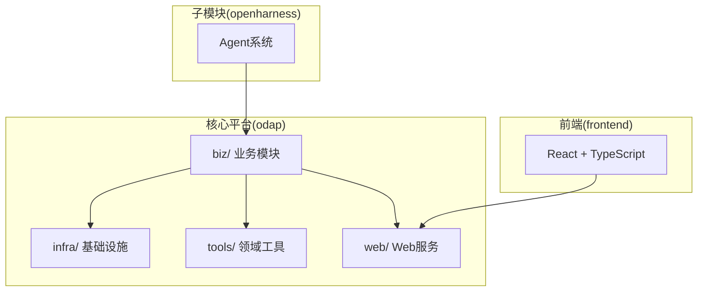
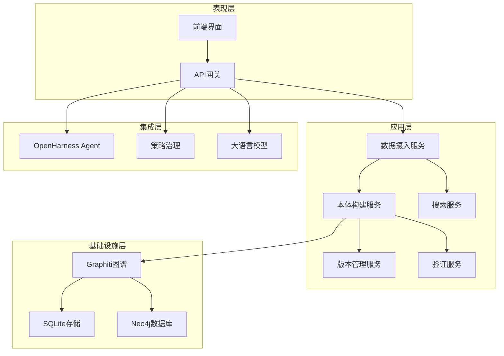
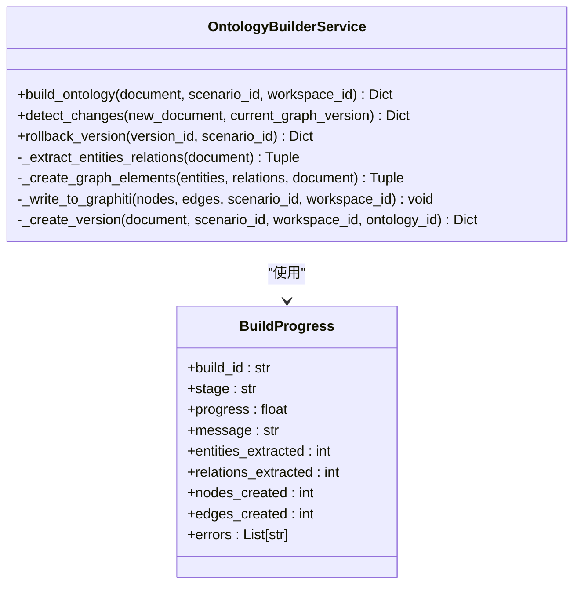
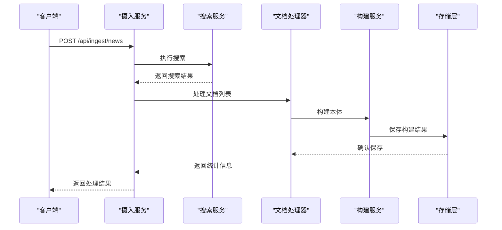
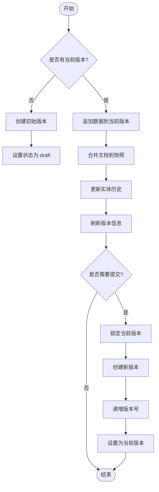
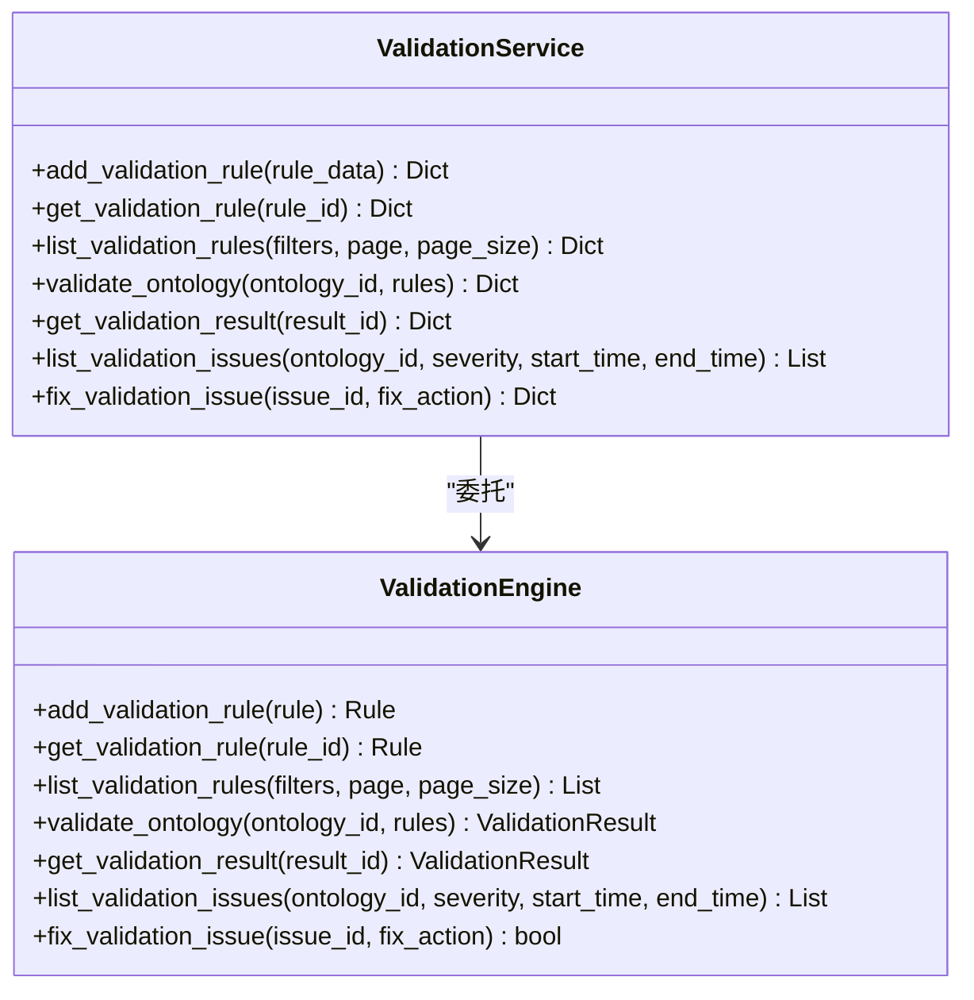
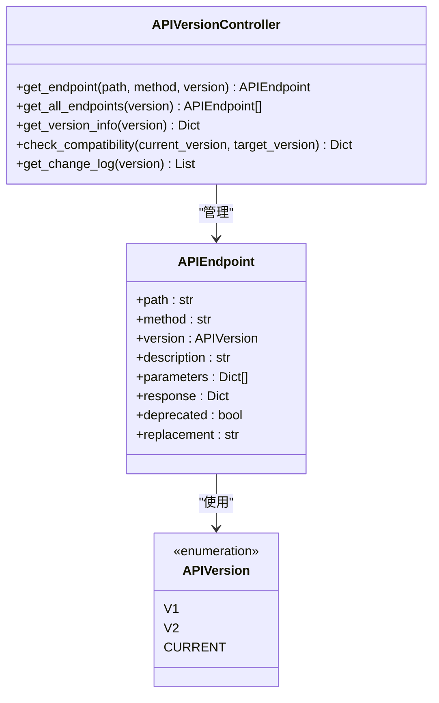
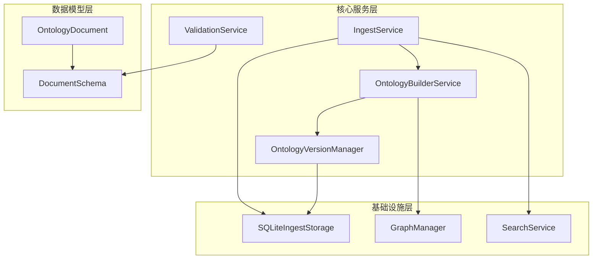

# 本体管理系统

<cite>
**本文档引用的文件**
- [README.md](file://README.md)
- [build_service.py](file://odap/biz/core/ontology/services/build_service.py)
- [ingest_service.py](file://odap/biz/core/ontology/services/ingest_service.py)
- [version_service.py](file://odap/biz/core/ontology/services/version_service.py)
- [validation_service.py](file://odap/biz/core/ontology/services/validation_service.py)
- [api_version.py](file://odap/biz/core/ontology/services/api_version.py)
- [search_service.py](file://odap/biz/core/ontology/services/search_service.py)
- [sqlite_ingest_storage.py](file://odap/biz/core/ontology/storage/sqlite_ingest_storage.py)
- [document.py](file://odap/biz/core/ontology/schema/document.py)
- [app.py](file://odap/web/api/app.py)
- [graph_service.py](file://odap/infra/graph/graph_service.py)
</cite>

## 目录
1. [简介](#简介)
2. [项目结构](#项目结构)
3. [核心组件](#核心组件)
4. [架构概览](#架构概览)
5. [详细组件分析](#详细组件分析)
6. [依赖关系分析](#依赖关系分析)
7. [性能考虑](#性能考虑)
8. [故障排除指南](#故障排除指南)
9. [结论](#结论)
10. [附录](#附录)

## 简介
本体管理系统（ODAP）是一个通用的本体驱动分析决策平台，通过工作空间机制实现多场景隔离，支持任意领域的本体建模和分析决策。系统采用四层本体结构（Object/Property/Action/Rule），结合双时态知识图谱（Graphiti）和统一查询服务，提供从多模态数据摄入到本体验证、清洗、存储的完整链路。

## 项目结构
项目采用模块化分层架构，主要分为以下层次：
- **核心平台层**：odap/ - 核心业务逻辑和基础设施
- **前端应用层**：frontend/ - React 19 + TypeScript 前端界面
- **子模块层**：openharness/ - OpenHarness Agent 子模块
- **文档层**：docs/ - 12个分类的架构文档
- **测试层**：tests/ - 单元测试、集成测试、端到端测试

**图表来源**
- [README.md:29-122](file://README.md#L29-L122)

**章节来源**
- [README.md:1-241](file://README.md#L1-L241)

## 核心组件
系统的核心组件包括：

### 1. 本体管理引擎
- **构建服务**：负责将 OntologyDocument 转换为图谱节点和边
- **摄入服务**：支持多种数据摄入方式（URL、新闻搜索、手动录入、JSON导入、自然语言、随机事件生成）
- **版本管理**：实现 ADR-032 版本链机制，支持热写入和手动提交
- **验证服务**：提供本体验证规则和问题修复能力

### 2. 数据管道
- **统一查询服务**：支持 Schema/Entity/Topo/Temporal 四种查询源
- **搜索服务**：集成多种搜索后端（Tavily、SerpAPI、DuckDuckGo、Mock）
- **存储层**：SQLite 统一存储摄入记录、构建历史、版本信息

### 3. 图谱服务
- **GraphManager**：基于 Graphiti 的双时态知识图谱，支持 Neo4j 直连和 NetworkX 回退模式
- **服务化引擎**：提供统一的 API 版本控制和路由管理

**章节来源**
- [build_service.py:36-447](file://odap/biz/core/ontology/services/build_service.py#L36-L447)
- [ingest_service.py:330-972](file://odap/biz/core/ontology/services/ingest_service.py#L330-L972)
- [version_service.py:84-503](file://odap/biz/core/ontology/services/version_service.py#L84-L503)
- [validation_service.py:8-203](file://odap/biz/core/ontology/services/validation_service.py#L8-L203)

## 架构概览
系统采用分层架构，从底层基础设施到上层应用服务：

**图表来源**
- [README.md:16-26](file://README.md#L16-L26)
- [graph_service.py:71-144](file://odap/infra/graph/graph_service.py#L71-L144)

## 详细组件分析

### 本体构建服务分析
本体构建服务是系统的核心组件，负责将 OntologyDocument 转换为图谱元素：

**图表来源**
- [build_service.py:36-447](file://odap/biz/core/ontology/services/build_service.py#L36-L447)

构建流程包括四个主要阶段：
1. **实体和关系提取**：从 OntologyDocument 中提取实体和关系信息
2. **图元素创建**：将提取的数据转换为图谱节点和边
3. **图谱写入**：将数据写入 Graphiti 图谱
4. **版本创建**：创建本体版本并进行锁定

**章节来源**
- [build_service.py:51-136](file://odap/biz/core/ontology/services/build_service.py#L51-L136)

### 数据摄入管道分析
数据摄入管道支持多种数据来源和处理方式：

**图表来源**
- [ingest_service.py:420-476](file://odap/biz/core/ontology/services/ingest_service.py#L420-L476)

摄入服务支持以下数据源：
- **URL网页抓取**：免费网页抓取方案
- **新闻搜索**：自动选择可用搜索引擎
- **手动录入**：表单数据和文本输入
- **JSON导入**：结构化数据导入
- **自然语言**：文本转本体
- **随机事件生成**：模拟数据生成

**章节来源**
- [ingest_service.py:373-793](file://odap/biz/core/ontology/services/ingest_service.py#L373-L793)

### 版本管理机制分析
版本管理实现 ADR-032 版本链机制，支持热写入和手动提交：

**图表来源**
- [version_service.py:152-277](file://odap/biz/core/ontology/services/version_service.py#L152-L277)

版本管理的关键特性：
- **版本ID生成**：v{YYYYMMDD}-{seq:03d} 格式
- **版本号规则**：初始版本 1.0.0，每次提交 minor 递增
- **热写入机制**：数据追加不改变版本号
- **手动提交**：用户触发版本锁定和新版本创建

**章节来源**
- [version_service.py:14-503](file://odap/biz/core/ontology/services/version_service.py#L14-L503)

### 验证服务分析
验证服务提供本体验证规则管理和问题修复能力：

**图表来源**
- [validation_service.py:8-203](file://odap/biz/core/ontology/services/validation_service.py#L8-L203)

**章节来源**
- [validation_service.py:8-203](file://odap/biz/core/ontology/services/validation_service.py#L8-L203)

### API版本控制分析
API版本控制确保向后兼容性和版本迁移：

**图表来源**
- [api_version.py:53-267](file://odap/biz/core/ontology/services/api_version.py#L53-L267)

**章节来源**
- [api_version.py:53-267](file://odap/biz/core/ontology/services/api_version.py#L53-L267)

## 依赖关系分析

### 组件耦合度分析
系统采用松耦合设计，主要依赖关系如下：

**图表来源**
- [ingest_service.py:330-352](file://odap/biz/core/ontology/services/ingest_service.py#L330-L352)
- [build_service.py:265-302](file://odap/biz/core/ontology/services/build_service.py#L265-L302)
- [version_service.py:100-106](file://odap/biz/core/ontology/services/version_service.py#L100-L106)

### 外部依赖集成
系统集成了多个外部服务和组件：

| 依赖组件 | 用途 | 版本要求 |
|---------|------|----------|
| Graphiti | 双时态知识图谱 | 可选依赖 |
| Neo4j | 图数据库 | 可选依赖 |
| OpenAI/Anthropic | 大语言模型 | 可选依赖 |
| DuckDuckGo/Tavily/SerpAPI | 搜索引擎 | 可选依赖 |
| NetworkX | 内存图谱回退 | 可选依赖 |

**章节来源**
- [graph_service.py:52-69](file://odap/infra/graph/graph_service.py#L52-L69)
- [search_service.py:133-241](file://odap/biz/core/ontology/services/search_service.py#L133-L241)

## 性能考虑
系统在设计时充分考虑了性能优化：

### 存储性能优化
- **SQLite WAL模式**：启用 Write-Ahead Logging 提高并发性能
- **批量操作**：支持批量插入和更新操作
- **连接池管理**：Neo4j 连接池配置，支持连接复用
- **索引优化**：实体注册表建立复合索引

### 查询性能优化
- **断路器模式**：防止级联故障影响系统稳定性
- **连接池清理**：定期清理过期连接
- **查询时间监控**：记录查询执行时间统计
- **缓存命中率**：监控缓存使用效率

### 处理性能优化
- **异步处理**：大量使用 asyncio 提高并发性能
- **后台任务**：网络请求和数据处理异步执行
- **批量加载**：Neo4j 批量数据加载优化
- **内存管理**：NetworkX 回退模式减少内存占用

## 故障排除指南

### 常见问题诊断
1. **Graphiti 连接失败**
   - 检查 graphiti-core 是否正确安装
   - 验证 Neo4j 服务连接状态
   - 查看环境变量配置

2. **SQLite 存储异常**
   - 检查数据库文件权限
   - 验证磁盘空间充足
   - 查看 WAL 日志状态

3. **搜索服务不可用**
   - 验证 API Key 配置
   - 检查网络连接状态
   - 查看降级方案是否正常

### 性能问题排查
1. **查询响应缓慢**
   - 检查数据库索引是否完整
   - 分析查询执行计划
   - 监控连接池使用情况

2. **内存使用过高**
   - 检查 NetworkX 图谱大小
   - 分析实体注册表增长情况
   - 监控缓存使用情况

3. **并发处理问题**
   - 检查异步任务队列
   - 分析锁竞争情况
   - 监控断路器状态

**章节来源**
- [graph_service.py:186-443](file://odap/infra/graph/graph_service.py#L186-L443)
- [sqlite_ingest_storage.py:27-50](file://odap/biz/core/ontology/storage/sqlite_ingest_storage.py#L27-L50)

## 结论
本体管理系统通过四层本体结构和双时态知识图谱，提供了完整的本体驱动分析决策能力。系统采用模块化设计，支持多种数据摄入方式和灵活的版本管理机制。通过统一查询服务和 API 版本控制，系统实现了良好的可扩展性和向后兼容性。

## 附录

### API接口规范
系统提供 RESTful API 接口，支持本体数据的摄入、查询和管理：

**数据摄入接口**
- `POST /api/ingest/news` - 新闻摄入
- `POST /api/ingest/manual` - 手动录入
- `POST /api/ingest/text` - 文本摄入
- `POST /api/ingest/random` - 随机生成
- `POST /api/ingest/import` - 导入文件

**版本管理接口**
- `GET /api/versions` - 列出版本
- `GET /api/versions/{version_id}` - 获取版本详情
- `POST /api/versions/{version_id}/rollback` - 回滚版本
- `GET /api/versions/diff` - 版本差异对比

**场景管理接口**
- `GET /api/scenarios` - 列出场景
- `GET /api/scenarios/{scenario_id}` - 获取场景详情
- `POST /api/scenarios/{scenario_id}/sync` - 同步到图谱
- `GET /api/scenarios/{scenario_id}/timeline` - 获取时间线

### 配置选项
系统支持多种配置选项：

**环境变量配置**
- `OPENAI_API_KEY` - LLM API 密钥
- `NEO4J_URI` - Neo4j 连接地址
- `NEO4J_USER` - Neo4j 用户名
- `NEO4J_PASSWORD` - Neo4j 密码
- `DATA_DIR` - 数据存储目录

**Docker部署配置**
- 支持 Docker Compose 部署
- 提供开发和生产环境配置
- 支持 Podman 兼容

### 性能优化建议
1. **数据库优化**
   - 定期维护 SQLite 数据库
   - 优化查询索引
   - 监控数据库性能指标

2. **缓存策略**
   - 合理设置缓存过期时间
   - 监控缓存命中率
   - 实施缓存预热策略

3. **并发控制**
   - 调整连接池大小
   - 实施限流策略
   - 监控系统负载