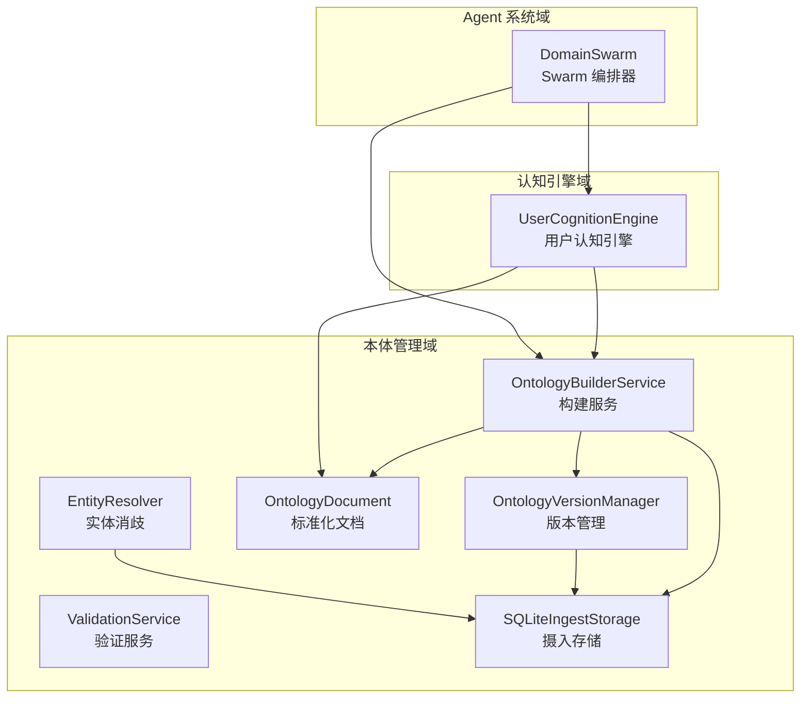
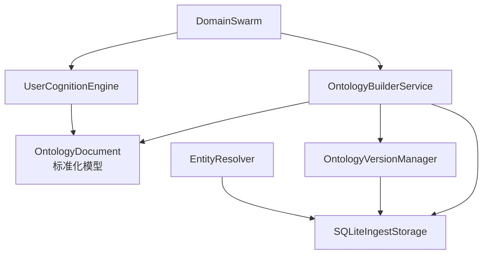
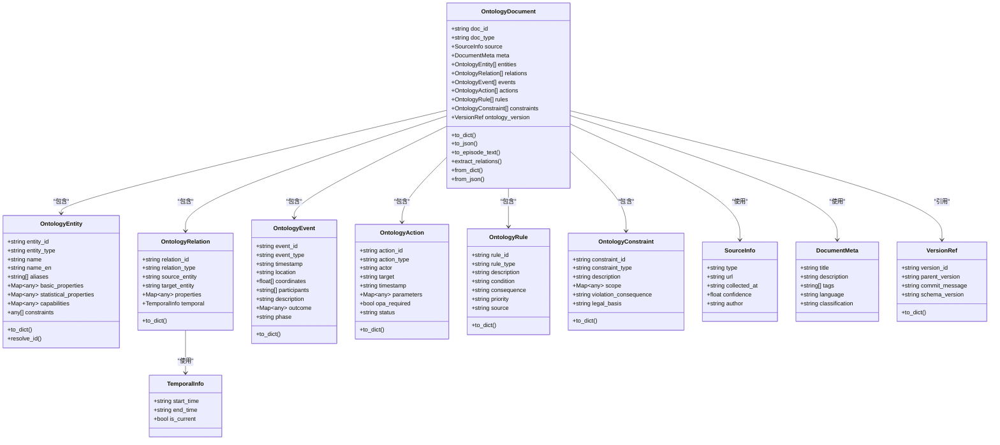
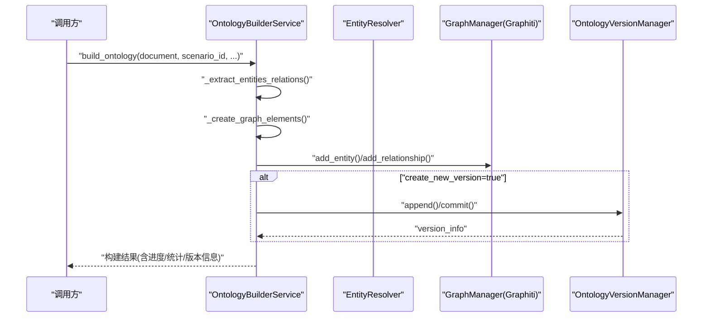
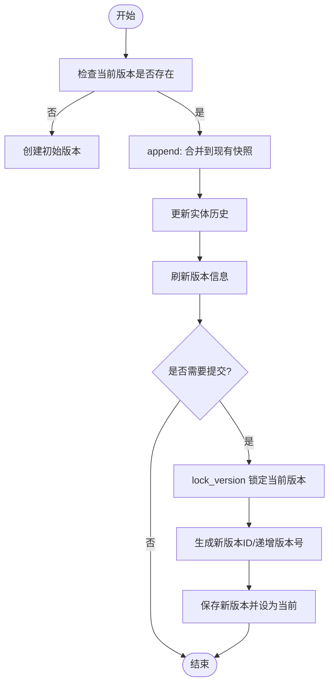
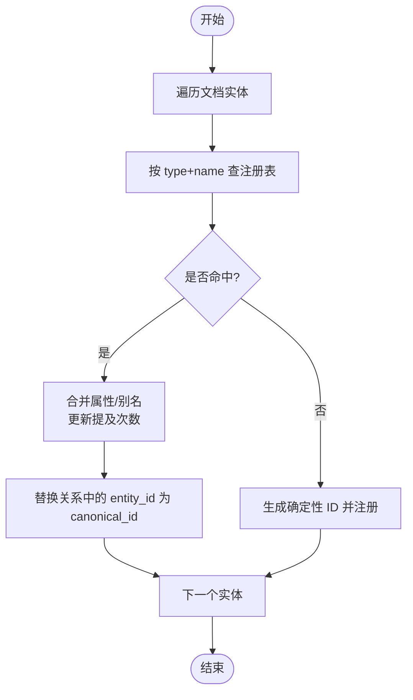
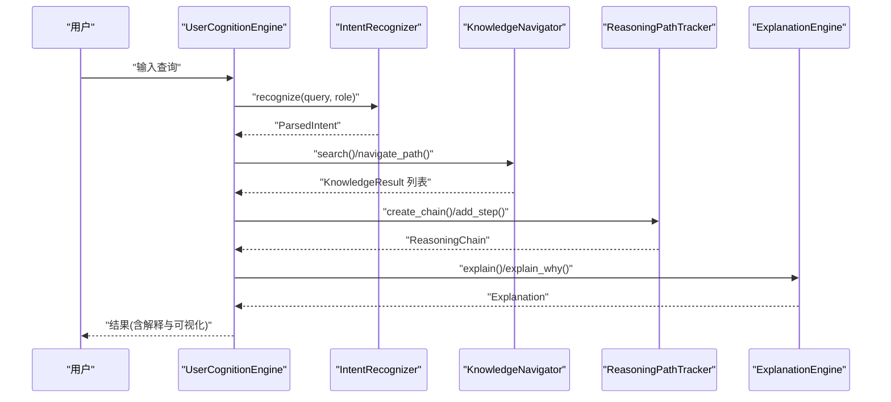
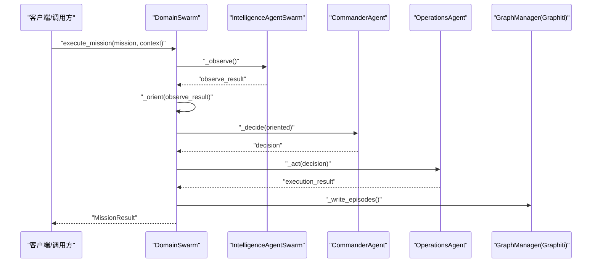
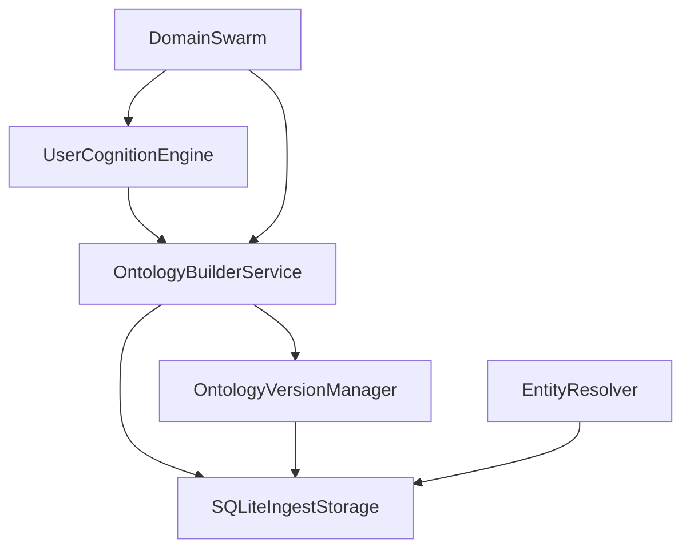

# 核心业务模块

<cite>
**本文引用的文件**   
- [odap/biz/core/ontology/services/build_service.py](file://odap/biz/core/ontology/services/build_service.py)
- [odap/biz/core/ontology/services/version_service.py](file://odap/biz/core/ontology/services/version_service.py)
- [odap/biz/core/ontology/services/validation_service.py](file://odap/biz/core/ontology/services/validation_service.py)
- [odap/biz/core/ontology/schema/document.py](file://odap/biz/core/ontology/schema/document.py)
- [odap/biz/core/ontology/storage/sqlite_ingest_storage.py](file://odap/biz/core/ontology/storage/sqlite_ingest_storage.py)
- [odap/biz/core/ontology/impl/entity_resolver.py](file://odap/biz/core/ontology/impl/entity_resolver.py)
- [odap/biz/core/cognition/user_cognition_engine.py](file://odap/biz/core/cognition/user_cognition_engine.py)
- [odap/biz/core/agent/swarm_orchestrator.py](file://odap/biz/core/agent/swarm_orchestrator.py)
- [odap/biz/core/ontology/__init__.py](file://odap/biz/core/ontology/__init__.py)
- [odap/biz/core/cognition/__init__.py](file://odap/biz/core/cognition/__init__.py)
- [odap/biz/core/agent/__init__.py](file://odap/biz/core/agent/__init__.py)
</cite>

## 目录
1. [简介](#简介)
2. [项目结构](#项目结构)
3. [核心组件](#核心组件)
4. [架构总览](#架构总览)
5. [详细组件分析](#详细组件分析)
6. [依赖分析](#依赖分析)
7. [性能考量](#性能考量)
8. [故障排查指南](#故障排查指南)
9. [结论](#结论)
10. [附录](#附录)

## 简介
本文件面向 ODAP 核心业务模块，系统化梳理以下能力域的设计与实现：
- 本体管理系统：OMS 元模型框架、四层本体结构、数据摄入管道、版本链管理
- 认知引擎：用户认知引擎、思维图谱、思考存储
- Agent 系统：智能体工厂、意图识别、编排器、Swarm 协作机制
并给出模块间协作关系、数据流转、接口规范，以及面向开发者的最佳实践。

## 项目结构
核心业务模块位于 odap/biz/core 下，按“本体管理”“认知引擎”“Agent 系统”三大域组织，每个域包含服务、模型、存储、工具等子模块；同时 odap/biz/core/ontology 下提供统一的本体文档模型与版本管理能力，支撑上层认知与 Agent 使用。

**图表来源**
- [odap/biz/core/ontology/services/build_service.py:36-447](file://odap/biz/core/ontology/services/build_service.py#L36-L447)
- [odap/biz/core/ontology/services/version_service.py:84-503](file://odap/biz/core/ontology/services/version_service.py#L84-L503)
- [odap/biz/core/ontology/services/validation_service.py:8-203](file://odap/biz/core/ontology/services/validation_service.py#L8-L203)
- [odap/biz/core/ontology/schema/document.py:212-404](file://odap/biz/core/ontology/schema/document.py#L212-L404)
- [odap/biz/core/ontology/storage/sqlite_ingest_storage.py:17-800](file://odap/biz/core/ontology/storage/sqlite_ingest_storage.py#L17-L800)
- [odap/biz/core/ontology/impl/entity_resolver.py:31-171](file://odap/biz/core/ontology/impl/entity_resolver.py#L31-L171)
- [odap/biz/core/cognition/user_cognition_engine.py:787-1012](file://odap/biz/core/cognition/user_cognition_engine.py#L787-L1012)
- [odap/biz/core/agent/swarm_orchestrator.py:288-687](file://odap/biz/core/agent/swarm_orchestrator.py#L288-L687)

**章节来源**
- [odap/biz/core/ontology/__init__.py:1-19](file://odap/biz/core/ontology/__init__.py#L1-L19)
- [odap/biz/core/cognition/__init__.py:1-2](file://odap/biz/core/cognition/__init__.py#L1-L2)
- [odap/biz/core/agent/__init__.py:1-5](file://odap/biz/core/agent/__init__.py#L1-L5)

## 核心组件
- 本体构建服务：负责将 OntologyDocument 转换为图谱节点/边，写入 Graphiti，并驱动版本管理与变更检测。
- 本体版本管理：实现“热写入追加 + 手动提交”的版本链，支持快照合并、差异计算与实体历史追踪。
- 验证服务：提供规则管理、验证执行、结果查询与问题修复。
- 统一本体文档模型：定义四层本体结构（实体/关系/事件/行动/规则/约束），并提供序列化/反序列化与校验器。
- 实体消歧解析器：在摄入阶段进行实体消歧与属性合并，维护实体注册表。
- 摄入存储：SQLite/WAL 模式，提供摄入记录、审计日志、构建历史、版本、场景等表结构。
- 用户认知引擎：意图识别、知识导航、推理链追踪、解释生成、角色视图管理。
- Swarm 编排器：三 Agent（Commander/Intelligence/Operations）OODA 循环编排，支持流式进度与状态持久化。

**章节来源**
- [odap/biz/core/ontology/services/build_service.py:36-447](file://odap/biz/core/ontology/services/build_service.py#L36-L447)
- [odap/biz/core/ontology/services/version_service.py:84-503](file://odap/biz/core/ontology/services/version_service.py#L84-L503)
- [odap/biz/core/ontology/services/validation_service.py:8-203](file://odap/biz/core/ontology/services/validation_service.py#L8-L203)
- [odap/biz/core/ontology/schema/document.py:212-404](file://odap/biz/core/ontology/schema/document.py#L212-L404)
- [odap/biz/core/ontology/impl/entity_resolver.py:31-171](file://odap/biz/core/ontology/impl/entity_resolver.py#L31-L171)
- [odap/biz/core/ontology/storage/sqlite_ingest_storage.py:17-800](file://odap/biz/core/ontology/storage/sqlite_ingest_storage.py#L17-L800)
- [odap/biz/core/cognition/user_cognition_engine.py:787-1012](file://odap/biz/core/cognition/user_cognition_engine.py#L787-L1012)
- [odap/biz/core/agent/swarm_orchestrator.py:288-687](file://odap/biz/core/agent/swarm_orchestrator.py#L288-L687)

## 架构总览
本体管理域提供统一的数据模型与版本控制，向上支撑认知引擎与 Agent 系统；Swarm 编排器通过调用本体构建与查询服务，形成“感知—理解—决策—行动”的闭环。

**图表来源**
- [odap/biz/core/ontology/services/build_service.py:36-447](file://odap/biz/core/ontology/services/build_service.py#L36-L447)
- [odap/biz/core/ontology/services/version_service.py:84-503](file://odap/biz/core/ontology/services/version_service.py#L84-L503)
- [odap/biz/core/ontology/schema/document.py:212-404](file://odap/biz/core/ontology/schema/document.py#L212-L404)
- [odap/biz/core/ontology/storage/sqlite_ingest_storage.py:17-800](file://odap/biz/core/ontology/storage/sqlite_ingest_storage.py#L17-L800)
- [odap/biz/core/ontology/impl/entity_resolver.py:31-171](file://odap/biz/core/ontology/impl/entity_resolver.py#L31-L171)
- [odap/biz/core/cognition/user_cognition_engine.py:787-1012](file://odap/biz/core/cognition/user_cognition_engine.py#L787-L1012)
- [odap/biz/core/agent/swarm_orchestrator.py:288-687](file://odap/biz/core/agent/swarm_orchestrator.py#L288-L687)

## 详细组件分析

### 本体管理域

#### 统一本体文档模型（四层本体结构）
- 设计要点：以 OntologyDocument 为原子单元，承载实体、关系、事件、行动、规则、约束六类要素；支持时序标注、确定性实体 ID、版本引用与构建历史。
- 序列化/反序列化：提供 to_dict/to_json/from_dict/from_json，便于跨模块传输与持久化。
- 校验器：Schema 验证器支持必填字段、枚举合法性、实体/关系/事件一致性检查。
- 示例工厂：提供 make_battle_event_document 快速构造典型战斗事件文档。

**图表来源**
- [odap/biz/core/ontology/schema/document.py:104-404](file://odap/biz/core/ontology/schema/document.py#L104-L404)

**章节来源**
- [odap/biz/core/ontology/schema/document.py:212-404](file://odap/biz/core/ontology/schema/document.py#L212-L404)

#### 本体构建服务（数据到图谱的转换）
- 功能链路：实体/关系抽取 → 节点/边创建 → 写入 Graphiti → 版本管理（可选）。
- 进度跟踪：BuildProgress 记录阶段、节点/边数量、错误集合。
- 变更检测：detect_changes 返回新增/移除/修改的实体与关系集合。
- 版本回滚：rollback_version 提供版本回退的占位实现。

**图表来源**
- [odap/biz/core/ontology/services/build_service.py:51-135](file://odap/biz/core/ontology/services/build_service.py#L51-L135)
- [odap/biz/core/ontology/services/build_service.py:256-354](file://odap/biz/core/ontology/services/build_service.py#L256-L354)
- [odap/biz/core/ontology/services/version_service.py:152-277](file://odap/biz/core/ontology/services/version_service.py#L152-L277)

**章节来源**
- [odap/biz/core/ontology/services/build_service.py:36-447](file://odap/biz/core/ontology/services/build_service.py#L36-L447)

#### 本体版本管理（版本链与快照）
- 操作模式：append（热写入追加，版本ID不变）、commit（锁定当前并创建新版本）。
- 版本号规则：语义化版本 minor 递增；版本ID形如 vYYYYMMDD-NNN。
- 快照合并：将新文档合并至现有快照，实体属性浅合并、别名并集、关系/事件去重。
- 实体历史：记录实体在各版本的状态快照，支持跨版本追踪。
- 差异计算：diff 对比两版本实体/关系/事件增删。

**图表来源**
- [odap/biz/core/ontology/services/version_service.py:152-277](file://odap/biz/core/ontology/services/version_service.py#L152-L277)
- [odap/biz/core/ontology/services/version_service.py:330-373](file://odap/biz/core/ontology/services/version_service.py#L330-L373)

**章节来源**
- [odap/biz/core/ontology/services/version_service.py:84-503](file://odap/biz/core/ontology/services/version_service.py#L84-L503)

#### 实体消歧解析器（摄入期实体统一）
- 匹配策略：精确匹配（type+name）→ 别名匹配 → 新实体注册。
- 属性合并：basic/statistical/capabilities 浅合并；aliases 并集；name_en 优先保留。
- 关系同步：将关系中的 entity_id 替换为 canonical_id。
- 注册表：维护 canonical_id、别名、属性、提及次数、首次/末次出现时间等。

**图表来源**
- [odap/biz/core/ontology/impl/entity_resolver.py:55-171](file://odap/biz/core/ontology/impl/entity_resolver.py#L55-L171)

**章节来源**
- [odap/biz/core/ontology/impl/entity_resolver.py:31-171](file://odap/biz/core/ontology/impl/entity_resolver.py#L31-L171)

#### 摄入存储（SQLite/WAL）
- 表结构概览：摄入记录、审计日志、本体文档、构建结果、版本、实体注册表、验证规则、处理日志、场景与场景文档等。
- 场景管理：场景表与场景文档表，支持按场景聚合实体/事件/关系并生成时间线。
- 性能特性：WAL 模式提升并发写入；索引覆盖实体注册表的 type+name 与 ontology_id。

**章节来源**
- [odap/biz/core/ontology/storage/sqlite_ingest_storage.py:17-800](file://odap/biz/core/ontology/storage/sqlite_ingest_storage.py#L17-L800)

#### 验证服务（规则驱动的质量保障）
- 能力范围：规则增删查、验证执行、结果查询、问题列表与修复。
- 输出结构：包含错误/警告/提示计数、总体评分、耗时、验证时间戳等。

**章节来源**
- [odap/biz/core/ontology/services/validation_service.py:8-203](file://odap/biz/core/ontology/services/validation_service.py#L8-L203)

### 认知引擎域

#### 用户认知引擎（意图识别/知识导航/推理链/解释）
- 意图识别：基于正则的意图分类与实体抽取，输出主意图、置信度、候选意图。
- 知识导航：支持检索、邻接查询、上下文获取，缓存与历史记录。
- 推理链追踪：创建/添加步骤/完成链，生成可视化数据。
- 解释生成：根据推理链生成回答、来源与替代解释。
- 角色视图：内置指挥官/情报员/操作员视图，支持自定义布局与过滤。

**图表来源**
- [odap/biz/core/cognition/user_cognition_engine.py:787-1012](file://odap/biz/core/cognition/user_cognition_engine.py#L787-L1012)

**章节来源**
- [odap/biz/core/cognition/user_cognition_engine.py:140-786](file://odap/biz/core/cognition/user_cognition_engine.py#L140-L786)

### Agent 系统域

#### Swarm 编排器（三 Agent OODA）
- 三 Agent 角色：
  - Intelligence：情报收集与威胁分析，生成威胁等级与建议。
  - Commander：态势分析与决策，生成行动选项与最终决策。
  - Operations：执行命令，支持人工确认与权限校验。
- OODA 流程：Observe → Orient → Decide → Act，支持流式进度返回与检查点持久化。
- 集成能力：Graphiti 写入 Episode、健康监控、故障恢复、状态持久化。

**图表来源**
- [odap/biz/core/agent/swarm_orchestrator.py:379-657](file://odap/biz/core/agent/swarm_orchestrator.py#L379-L657)

**章节来源**
- [odap/biz/core/agent/swarm_orchestrator.py:288-687](file://odap/biz/core/agent/swarm_orchestrator.py#L288-L687)

## 依赖分析
- 模块内聚：本体管理域内部通过 OntologyDocument 与版本管理形成强耦合；认知引擎与 Agent 系统通过本体构建服务与查询服务间接耦合。
- 外部依赖：Graphiti 图谱服务、查询服务、OPA 权限后端、健康监控与状态持久化。
- 存储依赖：SQLiteIngestStorage 作为统一摄入与版本存储后端，承担版本链、场景、实体注册表等职责。

**图表来源**
- [odap/biz/core/ontology/services/build_service.py:36-447](file://odap/biz/core/ontology/services/build_service.py#L36-L447)
- [odap/biz/core/ontology/services/version_service.py:84-503](file://odap/biz/core/ontology/services/version_service.py#L84-L503)
- [odap/biz/core/ontology/storage/sqlite_ingest_storage.py:17-800](file://odap/biz/core/ontology/storage/sqlite_ingest_storage.py#L17-L800)
- [odap/biz/core/ontology/impl/entity_resolver.py:31-171](file://odap/biz/core/ontology/impl/entity_resolver.py#L31-L171)
- [odap/biz/core/cognition/user_cognition_engine.py:787-1012](file://odap/biz/core/cognition/user_cognition_engine.py#L787-L1012)
- [odap/biz/core/agent/swarm_orchestrator.py:288-687](file://odap/biz/core/agent/swarm_orchestrator.py#L288-L687)

**章节来源**
- [odap/biz/core/ontology/__init__.py:1-19](file://odap/biz/core/ontology/__init__.py#L1-L19)
- [odap/biz/core/cognition/__init__.py:1-2](file://odap/biz/core/cognition/__init__.py#L1-L2)
- [odap/biz/core/agent/__init__.py:1-5](file://odap/biz/core/agent/__init__.py#L1-L5)

## 性能考量
- 版本链写入：append 采用热写入追加，避免频繁提交带来的锁竞争；commit 时批量落库并建立索引。
- 实体消歧：注册表带索引，匹配优先级为 type+name → 别名 → 新注册，减少全表扫描。
- 图谱写入：分批写入节点/边，失败容忍（记录警告而非中断整体流程）。
- 认知引擎：检索与导航结果缓存，推理链可视化按需生成。
- Swarm：流式进度返回，检查点持久化降低中断损失。

## 故障排查指南
- 本体构建失败：检查 BuildProgress.errors，定位抽取/写入阶段异常；确认 Graphiti 连接与权限。
- 版本提交失败：查看版本锁定/新版本创建日志；确认 SQLite WAL 模式与 busy_timeout 设置。
- 实体消歧异常：核对实体注册表是否存在 type+name 命中；检查别名匹配逻辑。
- 验证服务：通过 list_validation_rules 与 list_validation_issues 定位规则与问题；使用 fix_validation_issue 自动修复。
- Swarm 执行中断：查看 MissionResult.error_message 与健康报告；检查 Graphiti 写入与状态持久化。

**章节来源**
- [odap/biz/core/ontology/services/build_service.py:126-135](file://odap/biz/core/ontology/services/build_service.py#L126-L135)
- [odap/biz/core/ontology/services/version_service.py:206-277](file://odap/biz/core/ontology/services/version_service.py#L206-L277)
- [odap/biz/core/ontology/impl/entity_resolver.py:128-151](file://odap/biz/core/ontology/impl/entity_resolver.py#L128-L151)
- [odap/biz/core/ontology/services/validation_service.py:147-185](file://odap/biz/core/ontology/services/validation_service.py#L147-L185)
- [odap/biz/core/agent/swarm_orchestrator.py:439-456](file://odap/biz/core/agent/swarm_orchestrator.py#L439-L456)

## 结论
本体管理域以统一文档模型与版本链为核心，结合实体消歧与验证服务，为上层认知与 Agent 提供稳定、可追溯的知识基座；Swarm 编排器将三 Agent 的 OODA 循环落地为可观察、可恢复的自动化流程；用户认知引擎则将意图、导航、推理与解释串联为端到端的认知体验。模块间通过清晰的接口与共享存储实现松耦合集成，具备良好的扩展性与可维护性。

## 附录
- 开发者最佳实践
  - 使用 OntologyDocument 统一数据契约，严格遵循四层本体结构。
  - 在摄入前调用 EntityResolver 进行实体消歧，保证关系完整性。
  - 采用 append 热写入 + 定期 commit 的版本策略，避免长事务阻塞。
  - 通过 ValidationService 建立规则集，持续监控质量指标。
  - 在 Swarm 执行中启用检查点与健康监控，确保任务可恢复。
  - 认知引擎的解释与可视化应与业务语义对齐，提供可追溯的推理链。