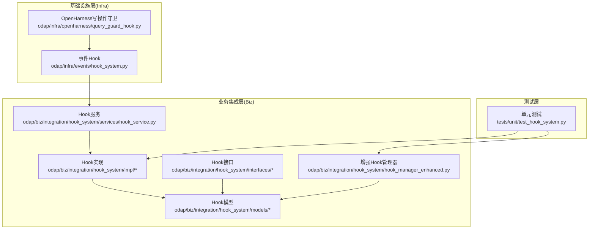
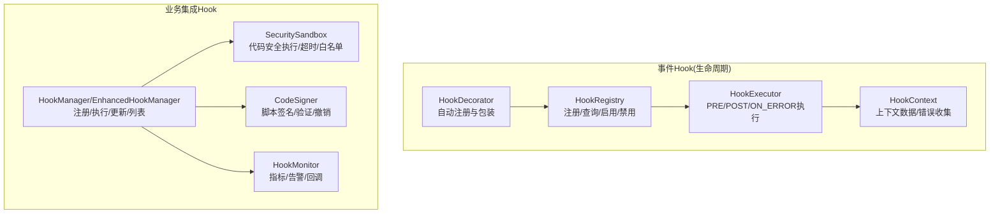
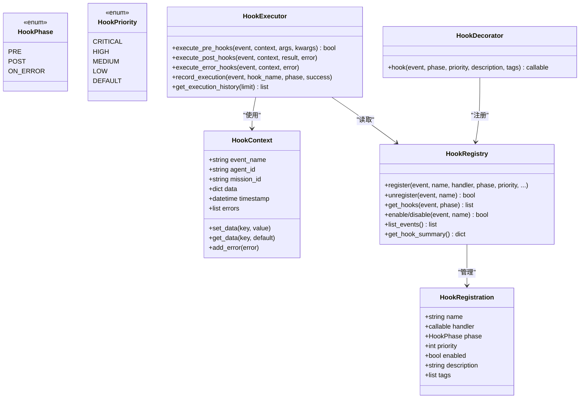
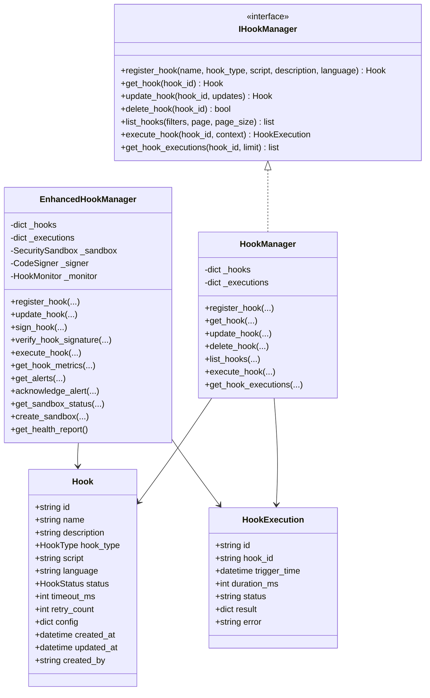
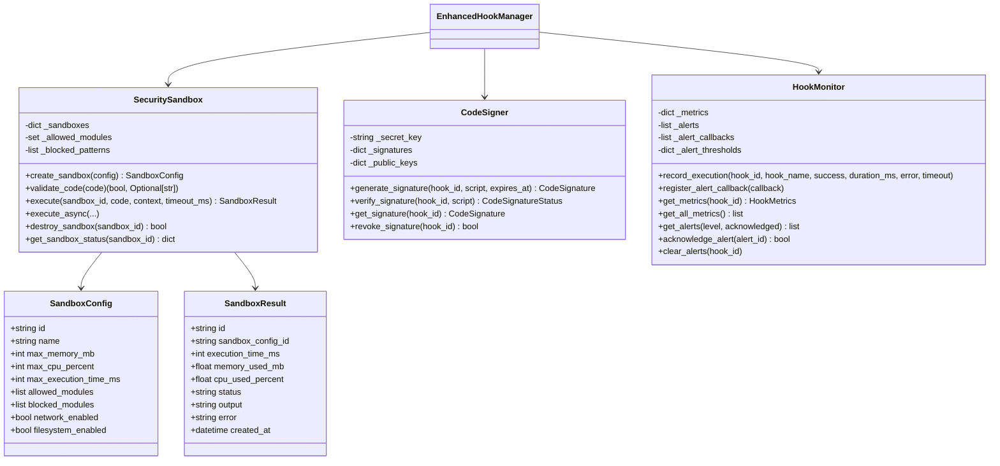
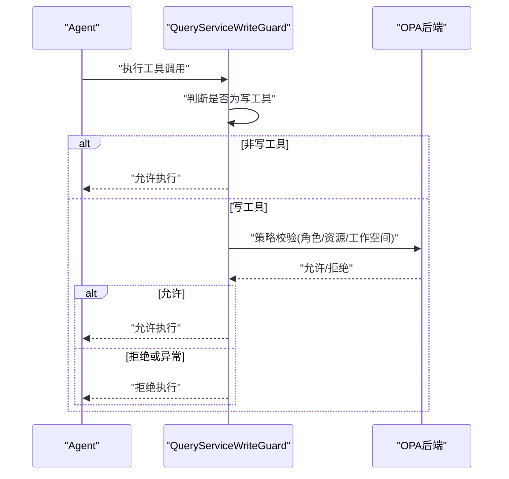
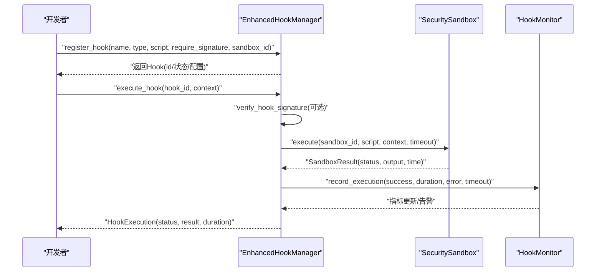
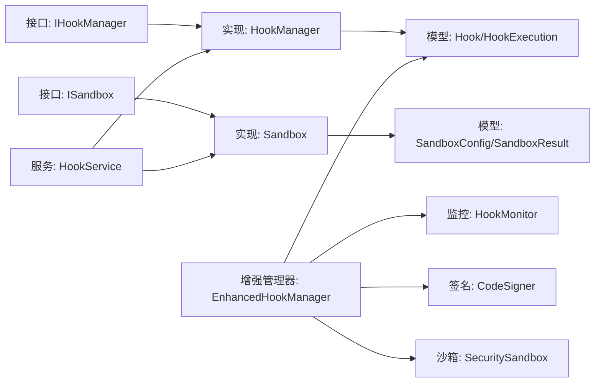

# Hook系统

<cite>
**本文引用的文件**
- [hook_system.py](file://odap/infra/events/hook_system.py)
- [hook_manager.py](file://odap/biz/integration/hook_system/impl/hook_manager.py)
- [sandbox.py](file://odap/biz/integration/hook_system/impl/sandbox.py)
- [hook_manager.py（接口）](file://odap/biz/integration/hook_system/interfaces/hook_manager.py)
- [sandbox.py（接口）](file://odap/biz/integration/hook_system/interfaces/sandbox.py)
- [hook.py（模型）](file://odap/biz/integration/hook_system/models/hook.py)
- [sandbox.py（模型）](file://odap/biz/integration/hook_system/models/sandbox.py)
- [hook_service.py](file://odap/biz/integration/hook_system/services/hook_service.py)
- [hook_manager_enhanced.py](file://odap/biz/integration/hook_system/hook_manager_enhanced.py)
- [query_guard_hook.py](file://odap/infra/openharness/query_guard_hook.py)
- [test_hook_system.py](file://tests/unit/test_hook_system.py)
</cite>

## 目录
1. [简介](#简介)
2. [项目结构](#项目结构)
3. [核心组件](#核心组件)
4. [架构总览](#架构总览)
5. [详细组件分析](#详细组件分析)
6. [依赖关系分析](#依赖关系分析)
7. [性能考虑](#性能考虑)
8. [故障排查指南](#故障排查指南)
9. [结论](#结论)
10. [附录](#附录)

## 简介
本文件系统性阐述基于生命周期的横切关注点框架“Hook系统”的设计与实现，覆盖钩子管理、安全沙箱、生命周期管理、事件处理、API设计与开发实践。文档面向不同层次读者，既提供高层架构视图，也给出代码级细节与可视化图示，帮助开发者快速理解并高效使用该系统。

## 项目结构
Hook系统主要分布在以下层次：
- 基础事件Hook（生命周期拦截与装饰器）：odap/infra/events/hook_system.py
- 业务集成Hook（注册、执行、沙箱）：odap/biz/integration/hook_system/*
- OpenHarness侧Hook（工具调用前后的安全守卫）：odap/infra/openharness/query_guard_hook.py
- 单元测试：tests/unit/test_hook_system.py

**图表来源**
- [hook_system.py:1-428](file://odap/infra/events/hook_system.py#L1-L428)
- [hook_manager.py:1-97](file://odap/biz/integration/hook_system/impl/hook_manager.py#L1-L97)
- [sandbox.py:1-63](file://odap/biz/integration/hook_system/impl/sandbox.py#L1-L63)
- [hook_manager.py（接口）:1-48](file://odap/biz/integration/hook_system/interfaces/hook_manager.py#L1-L48)
- [sandbox.py（接口）:1-30](file://odap/biz/integration/hook_system/interfaces/sandbox.py#L1-L30)
- [hook.py（模型）:1-53](file://odap/biz/integration/hook_system/models/hook.py#L1-L53)
- [sandbox.py（模型）:1-33](file://odap/biz/integration/hook_system/models/sandbox.py#L1-L33)
- [hook_service.py:1-82](file://odap/biz/integration/hook_system/services/hook_service.py#L1-L82)
- [hook_manager_enhanced.py:1-800](file://odap/biz/integration/hook_system/hook_manager_enhanced.py#L1-L800)
- [query_guard_hook.py:1-175](file://odap/infra/openharness/query_guard_hook.py#L1-L175)
- [test_hook_system.py:1-530](file://tests/unit/test_hook_system.py#L1-L530)

**章节来源**
- [hook_system.py:1-428](file://odap/infra/events/hook_system.py#L1-L428)
- [hook_manager.py:1-97](file://odap/biz/integration/hook_system/impl/hook_manager.py#L1-L97)
- [sandbox.py:1-63](file://odap/biz/integration/hook_system/impl/sandbox.py#L1-L63)
- [hook_manager.py（接口）:1-48](file://odap/biz/integration/hook_system/interfaces/hook_manager.py#L1-L48)
- [sandbox.py（接口）:1-30](file://odap/biz/integration/hook_system/interfaces/sandbox.py#L1-L30)
- [hook.py（模型）:1-53](file://odap/biz/integration/hook_system/models/hook.py#L1-L53)
- [sandbox.py（模型）:1-33](file://odap/biz/integration/hook_system/models/sandbox.py#L1-L33)
- [hook_service.py:1-82](file://odap/biz/integration/hook_system/services/hook_service.py#L1-L82)
- [hook_manager_enhanced.py:1-800](file://odap/biz/integration/hook_system/hook_manager_enhanced.py#L1-L800)
- [query_guard_hook.py:1-175](file://odap/infra/openharness/query_guard_hook.py#L1-L175)
- [test_hook_system.py:1-530](file://tests/unit/test_hook_system.py#L1-L530)

## 核心组件
- 事件Hook（生命周期拦截与装饰器）：提供HookPhase、HookPriority、HookContext、HookRegistry、HookExecutor、HookDecorator等，支持预/后/错误三类阶段与优先级排序。
- Hook管理器：提供注册、查询、更新、删除、列表、执行、执行记录查询等能力；增强版支持签名、沙箱、监控告警与审计集成。
- 沙箱：提供代码安全执行、超时控制、模块白名单/黑名单、资源限制与状态查询。
- OpenHarness写操作守卫：对工具调用进行前置安全校验，结合OPA策略实现fail-closed的写操作保护。
- 测试与监控：单元测试覆盖注册、执行、签名验证、沙箱状态、健康报告等场景；监控器提供指标统计与告警阈值。

**章节来源**
- [hook_system.py:19-428](file://odap/infra/events/hook_system.py#L19-L428)
- [hook_manager.py:9-97](file://odap/biz/integration/hook_system/impl/hook_manager.py#L9-L97)
- [sandbox.py:9-63](file://odap/biz/integration/hook_system/impl/sandbox.py#L9-L63)
- [hook_manager_enhanced.py:457-744](file://odap/biz/integration/hook_system/hook_manager_enhanced.py#L457-L744)
- [query_guard_hook.py:17-175](file://odap/infra/openharness/query_guard_hook.py#L17-L175)
- [test_hook_system.py:22-266](file://tests/unit/test_hook_system.py#L22-L266)

## 架构总览
Hook系统分为两条主线：
- 基础事件Hook：以装饰器/注册表方式在业务关键节点插入横切逻辑，支持同步/异步、错误回退与审计。
- 业务集成Hook：面向脚本型Hook的注册、执行、签名与沙箱隔离，提供监控告警与健康报告。

**图表来源**
- [hook_system.py:68-241](file://odap/infra/events/hook_system.py#L68-L241)
- [hook_manager.py:9-97](file://odap/biz/integration/hook_system/impl/hook_manager.py#L9-L97)
- [hook_manager_enhanced.py:88-744](file://odap/biz/integration/hook_system/hook_manager_enhanced.py#L88-L744)

## 详细组件分析

### 事件Hook（生命周期拦截）
- 钩子阶段：PRE（预）、POST（后）、ON_ERROR（异常），支持优先级排序。
- 上下文：HookContext承载事件名、Agent/任务标识、时间戳、动态数据与错误列表。
- 注册表：按事件聚合，支持启用/禁用、按阶段过滤、全局开关。
- 执行器：异步/同步兼容，支持中断（返回False）与异常捕获。
- 装饰器：自动注册，透明包裹业务方法，保证PRE/POST/ON_ERROR的完整生命周期。

**图表来源**
- [hook_system.py:19-241](file://odap/infra/events/hook_system.py#L19-L241)

**章节来源**
- [hook_system.py:19-428](file://odap/infra/events/hook_system.py#L19-L428)

### Hook管理器（注册与执行）
- 基础管理器：提供注册、查询、更新、删除、分页列表、执行与执行记录查询。
- 增强管理器：集成安全沙箱、代码签名、监控告警与审计日志，支持健康报告与告警回调。

**图表来源**
- [hook_manager.py（接口）:8-48](file://odap/biz/integration/hook_system/interfaces/hook_manager.py#L8-L48)
- [hook_manager.py:9-97](file://odap/biz/integration/hook_system/impl/hook_manager.py#L9-L97)
- [hook_manager_enhanced.py:457-744](file://odap/biz/integration/hook_system/hook_manager_enhanced.py#L457-L744)
- [hook.py（模型）:38-53](file://odap/biz/integration/hook_system/models/hook.py#L38-L53)

**章节来源**
- [hook_manager.py:9-97](file://odap/biz/integration/hook_system/impl/hook_manager.py#L9-L97)
- [hook_manager.py（接口）:8-48](file://odap/biz/integration/hook_system/interfaces/hook_manager.py#L8-L48)
- [hook_manager_enhanced.py:457-744](file://odap/biz/integration/hook_system/hook_manager_enhanced.py#L457-L744)
- [hook.py（模型）:10-53](file://odap/biz/integration/hook_system/models/hook.py#L10-L53)

### 安全沙箱与代码签名
- 安全沙箱：白名单模块、阻断模式匹配、长度限制、超时控制、本地变量隔离、异步执行。
- 代码签名：基于HMAC-SHA256的脚本完整性与来源验证，支持过期与撤销。
- 监控告警：错误率、平均延迟、超时率阈值触发，支持回调与审计日志集成。

**图表来源**
- [hook_manager_enhanced.py:88-744](file://odap/biz/integration/hook_system/hook_manager_enhanced.py#L88-L744)
- [sandbox.py（模型）:9-33](file://odap/biz/integration/hook_system/models/sandbox.py#L9-L33)

**章节来源**
- [hook_manager_enhanced.py:88-744](file://odap/biz/integration/hook_system/hook_manager_enhanced.py#L88-L744)
- [sandbox.py（模型）:9-33](file://odap/biz/integration/hook_system/models/sandbox.py#L9-L33)

### OpenHarness写操作守卫
- 设计原则：只读工具默认放行，写工具必须经OPA策略校验，OPA不可用时fail-closed。
- 工具分类：READ/WRITE两类，WRITE工具要求确认与OPA审批。
- 执行流程：根据工具名判断是否为写操作，提取上下文角色与工作空间，调用OPA策略并返回许可结果。

**图表来源**
- [query_guard_hook.py:17-83](file://odap/infra/openharness/query_guard_hook.py#L17-L83)

**章节来源**
- [query_guard_hook.py:17-175](file://odap/infra/openharness/query_guard_hook.py#L17-L175)

### Hook API与使用流程
- 注册：通过增强管理器注册脚本型Hook，可选签名要求与沙箱绑定。
- 执行：传入上下文字典，沙箱执行脚本，记录执行结果与耗时。
- 监控：监控器统计指标并按阈值触发告警，支持回调与审计日志。
- 健康报告：聚合Hook总数、活跃数、执行次数、成功率与未确认告警数。

**图表来源**
- [hook_manager_enhanced.py:518-651](file://odap/biz/integration/hook_system/hook_manager_enhanced.py#L518-L651)

**章节来源**
- [hook_manager_enhanced.py:518-744](file://odap/biz/integration/hook_system/hook_manager_enhanced.py#L518-L744)

## 依赖关系分析
- 低耦合接口：HookManager与Sandbox均以接口形式暴露，便于替换实现。
- 模块内聚：Hook模型、沙箱模型与服务层分离，职责清晰。
- 外部依赖：OPA策略后端（用于权限校验与审计集成），测试中通过Mock与fixtures解耦。

**图表来源**
- [hook_manager.py（接口）:8-48](file://odap/biz/integration/hook_system/interfaces/hook_manager.py#L8-L48)
- [sandbox.py（接口）:8-30](file://odap/biz/integration/hook_system/interfaces/sandbox.py#L8-L30)
- [hook_manager.py:9-97](file://odap/biz/integration/hook_system/impl/hook_manager.py#L9-L97)
- [sandbox.py:9-63](file://odap/biz/integration/hook_system/impl/sandbox.py#L9-L63)
- [hook_service.py:9-82](file://odap/biz/integration/hook_system/services/hook_service.py#L9-L82)
- [hook_manager_enhanced.py:457-744](file://odap/biz/integration/hook_system/hook_manager_enhanced.py#L457-L744)
- [hook.py（模型）:38-53](file://odap/biz/integration/hook_system/models/hook.py#L38-L53)
- [sandbox.py（模型）:22-33](file://odap/biz/integration/hook_system/models/sandbox.py#L22-L33)

**章节来源**
- [hook_manager.py（接口）:8-48](file://odap/biz/integration/hook_system/interfaces/hook_manager.py#L8-L48)
- [sandbox.py（接口）:8-30](file://odap/biz/integration/hook_system/interfaces/sandbox.py#L8-L30)
- [hook_manager.py:9-97](file://odap/biz/integration/hook_system/impl/hook_manager.py#L9-L97)
- [sandbox.py:9-63](file://odap/biz/integration/hook_system/impl/sandbox.py#L9-L63)
- [hook_service.py:9-82](file://odap/biz/integration/hook_system/services/hook_service.py#L9-L82)
- [hook_manager_enhanced.py:457-744](file://odap/biz/integration/hook_system/hook_manager_enhanced.py#L457-L744)
- [hook.py（模型）:38-53](file://odap/biz/integration/hook_system/models/hook.py#L38-L53)
- [sandbox.py（模型）:22-33](file://odap/biz/integration/hook_system/models/sandbox.py#L22-L33)

## 性能考虑
- 异步执行：事件Hook支持异步处理器，避免阻塞主流程。
- 资源限制：沙箱提供内存、CPU、执行时间上限，防止恶意/异常脚本拖垮系统。
- 监控阈值：错误率、延迟、超时率阈值触发告警，便于及时发现性能退化。
- 优先级调度：Hook优先级数值越小优先级越高，确保关键Hook先执行。
- 日志与审计：审计日志与指标采集开销可控，默认级别下尽量减少影响。

[本节为通用指导，无需特定文件来源]

## 故障排查指南
- 签名验证失败：检查Hook是否开启require_signature，确认签名是否过期或脚本内容被篡改。
- 执行超时：调整Hook.timeout_ms或优化脚本逻辑，查看沙箱状态与资源限制。
- 权限拒绝：OpenHarness写操作守卫会因OPA不可用或策略拒绝而fail-closed，检查OPA后端与策略配置。
- 健康报告异常：通过get_health_report查看总执行数、成功数、失败数与未确认告警数，定位问题Hook。

**章节来源**
- [test_hook_system.py:226-266](file://tests/unit/test_hook_system.py#L226-L266)
- [hook_manager_enhanced.py:701-732](file://odap/biz/integration/hook_system/hook_manager_enhanced.py#L701-L732)
- [query_guard_hook.py:58-82](file://odap/infra/openharness/query_guard_hook.py#L58-L82)

## 结论
Hook系统通过事件Hook与业务集成Hook双轨并行，实现了对Agent生命周期的细粒度拦截与增强。增强版管理器进一步引入安全沙箱、代码签名、监控告警与审计集成，满足生产环境对安全性与可观测性的要求。配合OpenHarness写操作守卫，形成从工具调用到脚本执行的全链路安全防护。

[本节为总结，无需特定文件来源]

## 附录

### Hook API参考（增强管理器）
- 注册Hook
  - 参数：name、hook_type、script、description、language、require_signature、sandbox_id
  - 返回：Hook对象（含id/status/config）
- 更新Hook
  - 参数：hook_id、updates（含script时自动重新签名）
  - 返回：更新后的Hook
- 执行Hook
  - 参数：hook_id、context（字典）
  - 返回：HookExecution（含status/result/duration/error）
- 获取指标/告警/健康报告
  - get_hook_metrics(hook_id)、get_alerts(level)、get_health_report()

**章节来源**
- [hook_manager_enhanced.py:518-744](file://odap/biz/integration/hook_system/hook_manager_enhanced.py#L518-L744)

### Hook类型与阶段
- Hook类型：pre_execute、post_execute、on_error、on_timeout、pre_commit、post_commit
- Hook阶段：pre、post、on_error
- 优先级：数值越小优先级越高（CRITICAL < HIGH < MEDIUM < LOW < DEFAULT）

**章节来源**
- [hook.py（模型）:10-18](file://odap/biz/integration/hook_system/models/hook.py#L10-L18)
- [hook_system.py:26-32](file://odap/infra/events/hook_system.py#L26-L32)

### 开发者指南与最佳实践
- 使用HookDecorator简化注册与生命周期包装，确保PRE/POST/ON_ERROR完整。
- 对外部脚本型Hook开启require_signature，并定期轮换签名密钥。
- 合理设置沙箱allowed_modules与max_execution_time_ms，避免高风险模块与长耗时脚本。
- 利用监控阈值与告警回调建立自动化运维流程，结合审计日志追踪问题根因。
- 在OpenHarness中，仅对WRITE工具启用OPA校验，READ工具默认放行以降低开销。

**章节来源**
- [hook_system.py:260-321](file://odap/infra/events/hook_system.py#L260-L321)
- [hook_manager_enhanced.py:313-455](file://odap/biz/integration/hook_system/hook_manager_enhanced.py#L313-L455)
- [query_guard_hook.py:17-83](file://odap/infra/openharness/query_guard_hook.py#L17-L83)