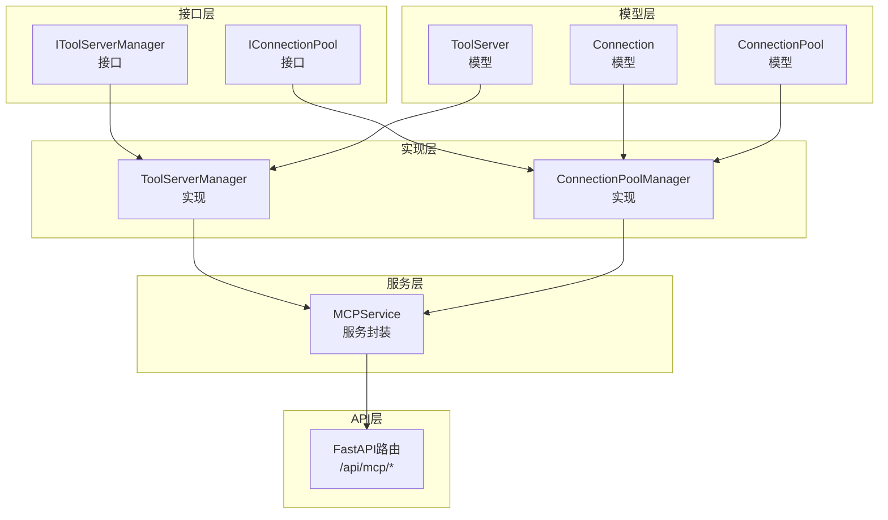
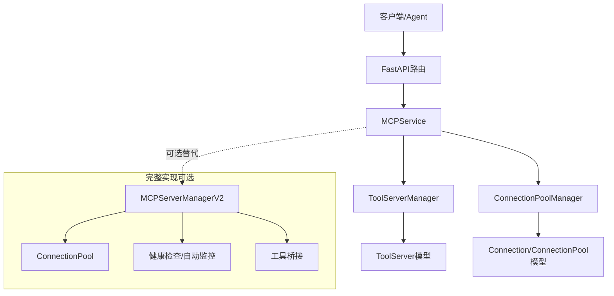
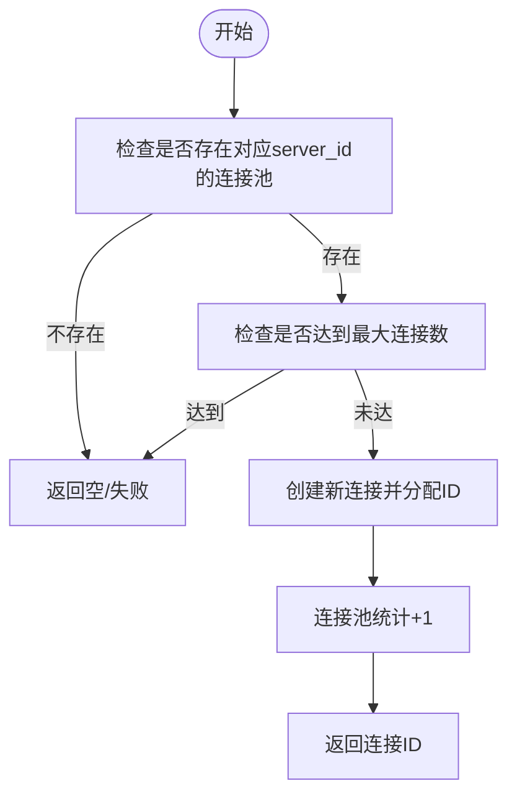
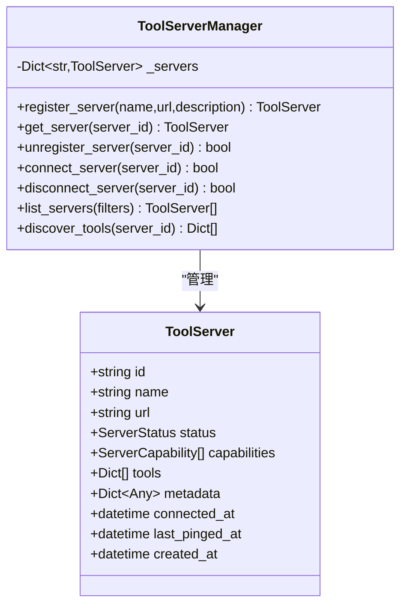
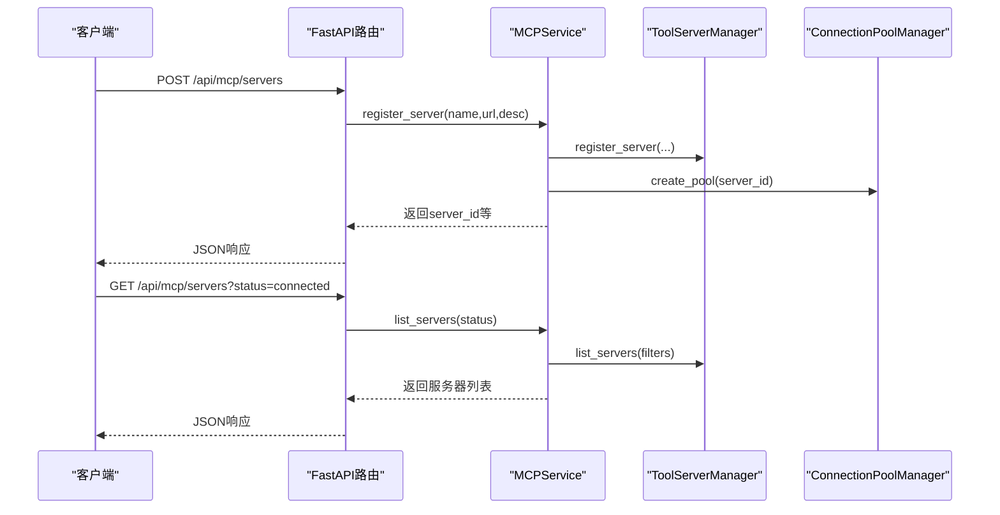
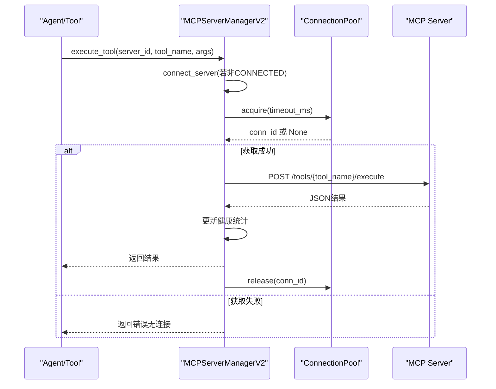
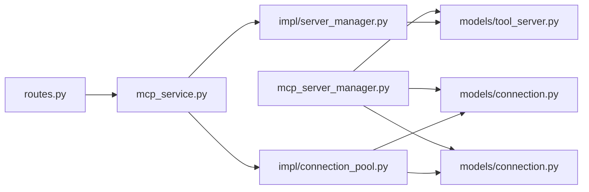

# MCP协议适配器

<cite>
**本文档引用的文件**
- [mcp_server_manager.py](file://odap/biz/integration/mcp_adapter/mcp_server_manager.py)
- [routes.py](file://odap/biz/integration/mcp_adapter/api/routes.py)
- [mcp_service.py](file://odap/biz/integration/mcp_adapter/services/mcp_service.py)
- [connection_pool.py](file://odap/biz/integration/mcp_adapter/impl/connection_pool.py)
- [server_manager.py](file://odap/biz/integration/mcp_adapter/impl/server_manager.py)
- [connection.py](file://odap/biz/integration/mcp_adapter/models/connection.py)
- [tool_server.py](file://odap/biz/integration/mcp_adapter/models/tool_server.py)
- [connection_pool.py（接口）](file://odap/biz/integration/mcp_adapter/interfaces/connection_pool.py)
- [server_manager.py（接口）](file://odap/biz/integration/mcp_adapter/interfaces/server_manager.py)
- [DESIGN.md](file://docs/03-modules/mcp_protocol/DESIGN.md)
- [ADR-026_mcp_protocol_integration.md](file://docs/07-adr/ADR-026_mcp_protocol_integration.md)
- [test_mcp_adapter.py](file://tests/unit/test_mcp_adapter.py)
</cite>

## 目录
1. [简介](#简介)
2. [项目结构](#项目结构)
3. [核心组件](#核心组件)
4. [架构总览](#架构总览)
5. [详细组件分析](#详细组件分析)
6. [依赖关系分析](#依赖关系分析)
7. [性能考虑](#性能考虑)
8. [故障排查指南](#故障排查指南)
9. [结论](#结论)
10. [附录](#附录)

## 简介
本文件为MCP（Model Context Protocol）协议适配器的技术文档，面向系统集成商与开发者，全面阐述MCP协议在Graphiti平台中的实现架构与使用方式。重点涵盖：
- 连接池管理：连接创建、复用、超时管理、健康检查
- 服务器管理：服务器发现、注册、负载均衡、故障转移
- 协议转换与API接口：消息格式、事件处理、状态同步
- 配置指南与性能调优建议

该适配器既包含轻量的FastAPI服务封装，也包含完整的MCPServerManagerV2实现，后者提供了更完善的连接池、健康检查、工具发现与桥接能力。

## 项目结构
MCP适配器位于odap/biz/integration/mcp_adapter目录，主要分为三层：
- 接口层：定义抽象接口，便于替换实现
- 实现层：提供具体实现（连接池、服务器管理）
- 服务层：对外暴露MCPService，封装业务流程
- API层：FastAPI路由，提供REST接口
- 模型层：Pydantic模型，定义连接与服务器实体
- 设计文档：模块设计与ADR决策文档

**图表来源**
- [server_manager.py（接口）:1-45](file://odap/biz/integration/mcp_adapter/interfaces/server_manager.py#L1-L45)
- [connection_pool.py（接口）:1-24](file://odap/biz/integration/mcp_adapter/interfaces/connection_pool.py#L1-L24)
- [server_manager.py:1-81](file://odap/biz/integration/mcp_adapter/impl/server_manager.py#L1-L81)
- [connection_pool.py:1-69](file://odap/biz/integration/mcp_adapter/impl/connection_pool.py#L1-L69)
- [mcp_service.py:1-71](file://odap/biz/integration/mcp_adapter/services/mcp_service.py#L1-L71)
- [routes.py:1-64](file://odap/biz/integration/mcp_adapter/api/routes.py#L1-L64)
- [tool_server.py:1-38](file://odap/biz/integration/mcp_adapter/models/tool_server.py#L1-L38)
- [connection.py:1-28](file://odap/biz/integration/mcp_adapter/models/connection.py#L1-L28)

**章节来源**
- [mcp_server_manager.py:1-663](file://odap/biz/integration/mcp_adapter/mcp_server_manager.py#L1-L663)
- [routes.py:1-64](file://odap/biz/integration/mcp_adapter/api/routes.py#L1-L64)
- [mcp_service.py:1-71](file://odap/biz/integration/mcp_adapter/services/mcp_service.py#L1-L71)

## 核心组件
- MCPService：对外统一入口，封装服务器注册、连接、工具发现、连接池操作等
- ToolServerManager：服务器注册、连接/断开、列表过滤、工具发现
- ConnectionPoolManager：连接池创建、连接获取/释放、状态查询
- FastAPI路由：提供REST API，对接MCPService
- 模型：ToolServer、Connection、ConnectionPool
- 完整实现：MCPServerManagerV2（含连接池、健康检查、工具桥接、自动健康检查）

**章节来源**
- [mcp_service.py:1-71](file://odap/biz/integration/mcp_adapter/services/mcp_service.py#L1-L71)
- [server_manager.py:1-81](file://odap/biz/integration/mcp_adapter/impl/server_manager.py#L1-L81)
- [connection_pool.py:1-69](file://odap/biz/integration/mcp_adapter/impl/connection_pool.py#L1-L69)
- [routes.py:1-64](file://odap/biz/integration/mcp_adapter/api/routes.py#L1-L64)
- [tool_server.py:1-38](file://odap/biz/integration/mcp_adapter/models/tool_server.py#L1-L38)
- [connection.py:1-28](file://odap/biz/integration/mcp_adapter/models/connection.py#L1-L28)

## 架构总览
MCP适配器采用“接口+实现+服务封装+API”的分层架构，并提供完整版MCPServerManagerV2以支撑生产级能力（连接池、健康检查、自动监控、工具桥接）。

**图表来源**
- [mcp_service.py:1-71](file://odap/biz/integration/mcp_adapter/services/mcp_service.py#L1-L71)
- [server_manager.py:1-81](file://odap/biz/integration/mcp_adapter/impl/server_manager.py#L1-L81)
- [connection_pool.py:1-69](file://odap/biz/integration/mcp_adapter/impl/connection_pool.py#L1-L69)
- [mcp_server_manager.py:235-622](file://odap/biz/integration/mcp_adapter/mcp_server_manager.py#L235-L622)
- [routes.py:1-64](file://odap/biz/integration/mcp_adapter/api/routes.py#L1-L64)

## 详细组件分析

### 连接池管理（ConnectionPoolManager）
- 设计要点
  - 以server_id为维度管理连接池
  - 维护连接池状态：最大/最小连接数、当前连接数、已占用连接数
  - 提供acquire/release接口，返回连接ID或失败
- 关键行为
  - 创建连接池：初始化min_size连接到可用队列
  - 获取连接：从可用队列弹出，加入在用字典
  - 释放连接：从在用字典移除，放回可用队列（受max_size限制）
  - 状态查询：返回当前统计信息
- 超时与并发
  - 当前实现为轻量内存池，无显式超时等待；如需超时，可参考完整实现中的ConnectionPool.acquire超时逻辑

**图表来源**
- [connection_pool.py:26-54](file://odap/biz/integration/mcp_adapter/impl/connection_pool.py#L26-L54)

**章节来源**
- [connection_pool.py:1-69](file://odap/biz/integration/mcp_adapter/impl/connection_pool.py#L1-L69)
- [connection.py:1-28](file://odap/biz/integration/mcp_adapter/models/connection.py#L1-L28)
- [connection_pool.py（接口）:1-24](file://odap/biz/integration/mcp_adapter/interfaces/connection_pool.py#L1-L24)

### 服务器管理（ToolServerManager）
- 设计要点
  - 以server_id为键管理ToolServer
  - 管理服务器状态（连接中/已连接/断开/错误/不可用）
  - 支持按状态过滤列表
- 关键行为
  - 注册：创建ToolServer并设置初始状态
  - 连接/断开：更新状态与连接时间
  - 列表：支持按状态过滤
  - 工具发现：当前为模拟实现，返回固定数量的工具描述

**图表来源**
- [tool_server.py:1-38](file://odap/biz/integration/mcp_adapter/models/tool_server.py#L1-L38)
- [server_manager.py:1-81](file://odap/biz/integration/mcp_adapter/impl/server_manager.py#L1-L81)

**章节来源**
- [server_manager.py:1-81](file://odap/biz/integration/mcp_adapter/impl/server_manager.py#L1-L81)
- [tool_server.py:1-38](file://odap/biz/integration/mcp_adapter/models/tool_server.py#L1-L38)
- [server_manager.py（接口）:1-45](file://odap/biz/integration/mcp_adapter/interfaces/server_manager.py#L1-L45)

### MCP服务封装（MCPService）
- 职责
  - 组合ToolServerManager与ConnectionPoolManager
  - 对外提供统一的API封装：注册服务器、连接/断开、列表、工具发现、连接获取/释放、连接池状态查询
- 与FastAPI路由的衔接
  - 路由层负责参数解析与异常包装，服务层负责业务逻辑

**图表来源**
- [routes.py:12-63](file://odap/biz/integration/mcp_adapter/api/routes.py#L12-L63)
- [mcp_service.py:15-70](file://odap/biz/integration/mcp_adapter/services/mcp_service.py#L15-L70)

**章节来源**
- [mcp_service.py:1-71](file://odap/biz/integration/mcp_adapter/services/mcp_service.py#L1-L71)
- [routes.py:1-64](file://odap/biz/integration/mcp_adapter/api/routes.py#L1-L64)

### 完整实现：MCPServerManagerV2
- 能力概览
  - 注册/连接/断开/列表/工具发现
  - 连接池：支持最小/最大连接数、超时获取、线程安全
  - 健康检查：HTTP健康端点、自动健康检查线程、连续失败计数、成功率统计
  - 工具桥接：将远端工具注册为本地可调用桥接工具
  - 发现引擎：按能力/标签索引服务器
- 关键流程
  - discover_capabilities：拉取远端能力清单，构建ToolDefinition/ResourceDefinition/PromptDefinition，建立索引与桥接
  - execute_tool：自动连接校验、连接池获取、HTTP调用、健康统计、异常处理
  - health_check：定期健康检查，更新健康信息
  - get_health_report：汇总健康指标

**图表来源**
- [mcp_server_manager.py:410-480](file://odap/biz/integration/mcp_adapter/mcp_server_manager.py#L410-L480)

**章节来源**
- [mcp_server_manager.py:235-622](file://odap/biz/integration/mcp_adapter/mcp_server_manager.py#L235-L622)

## 依赖关系分析
- 组件耦合
  - MCPService依赖ToolServerManager与ConnectionPoolManager
  - FastAPI路由依赖MCPService
  - 完整实现MCPServerManagerV2自包含连接池、健康检查、发现与桥接
- 外部依赖
  - aiohttp用于异步HTTP调用
  - threading用于自动健康检查线程
  - Pydantic模型用于数据结构与序列化

**图表来源**
- [routes.py:1-64](file://odap/biz/integration/mcp_adapter/api/routes.py#L1-L64)
- [mcp_service.py:1-71](file://odap/biz/integration/mcp_adapter/services/mcp_service.py#L1-L71)
- [server_manager.py:1-81](file://odap/biz/integration/mcp_adapter/impl/server_manager.py#L1-L81)
- [connection_pool.py:1-69](file://odap/biz/integration/mcp_adapter/impl/connection_pool.py#L1-L69)
- [tool_server.py:1-38](file://odap/biz/integration/mcp_adapter/models/tool_server.py#L1-L38)
- [connection.py:1-28](file://odap/biz/integration/mcp_adapter/models/connection.py#L1-L28)
- [mcp_server_manager.py:1-663](file://odap/biz/integration/mcp_adapter/mcp_server_manager.py#L1-L663)

**章节来源**
- [routes.py:1-64](file://odap/biz/integration/mcp_adapter/api/routes.py#L1-L64)
- [mcp_service.py:1-71](file://odap/biz/integration/mcp_adapter/services/mcp_service.py#L1-L71)
- [mcp_server_manager.py:1-663](file://odap/biz/integration/mcp_adapter/mcp_server_manager.py#L1-L663)

## 性能考虑
- 连接池参数
  - min_size：启动时预热连接数，降低首次请求延迟
  - max_size：上限控制，防止资源耗尽
  - acquire超时：在完整实现中可通过timeout_ms控制等待时间
- 健康检查
  - 自动健康检查线程周期性探测远端健康端点，及时发现故障并更新状态
  - 连续失败计数与最近错误记录，辅助快速熔断与告警
- 异步与并发
  - aiohttp异步HTTP会话，减少阻塞
  - 连接池内部使用RLock保证线程安全
- 监控与指标
  - get_health_report提供总服务器数、连接数、工具数、调用总数、成功率等关键指标

**章节来源**
- [mcp_server_manager.py:102-154](file://odap/biz/integration/mcp_adapter/mcp_server_manager.py#L102-L154)
- [mcp_server_manager.py:519-549](file://odap/biz/integration/mcp_adapter/mcp_server_manager.py#L519-L549)
- [mcp_server_manager.py:579-610](file://odap/biz/integration/mcp_adapter/mcp_server_manager.py#L579-L610)

## 故障排查指南
- 常见问题与定位
  - 服务器无法连接：检查connect_server返回值与健康状态；查看健康信息中的last_error与consecutive_failures
  - 工具执行失败：确认服务器状态为CONNECTED；检查execute_tool返回的error字段；查看连接池状态（available/in_use）
  - 连接池耗尽：增大max_size或缩短请求处理时间；观察acquire超时
- 单元测试参考
  - 注册/连接/断开/列表/工具发现/连接池状态/连接池获取/释放等均有单元测试覆盖
- 建议排查步骤
  - 通过GET /api/mcp/servers查询服务器状态
  - 通过GET /api/mcp/servers/{server_id}/pool-status查看连接池状态
  - 触发一次工具执行，观察返回的success与error字段
  - 查看健康报告，关注成功率与最近错误

**章节来源**
- [test_mcp_adapter.py:1-316](file://tests/unit/test_mcp_adapter.py#L1-L316)
- [routes.py:39-63](file://odap/biz/integration/mcp_adapter/api/routes.py#L39-L63)
- [mcp_service.py:37-70](file://odap/biz/integration/mcp_adapter/services/mcp_service.py#L37-L70)
- [mcp_server_manager.py:481-517](file://odap/biz/integration/mcp_adapter/mcp_server_manager.py#L481-L517)

## 结论
MCP协议适配器提供了从轻量封装到完整实现的两套方案：
- 轻量方案：通过MCPService与FastAPI路由，满足基础的服务器管理与连接池操作
- 完整方案：MCPServerManagerV2提供连接池、健康检查、自动监控、工具桥接与发现引擎，适合生产级集成

推荐在生产环境中采用完整实现，并结合健康检查与监控指标进行持续优化。

## 附录

### API接口文档
- 服务器注册
  - 方法：POST
  - 路径：/api/mcp/servers
  - 参数：name, url, description
  - 返回：server_id, name, url, status
- 连接服务器
  - 方法：POST
  - 路径：/api/mcp/servers/{server_id}/connect
  - 返回：status
- 断开服务器
  - 方法：POST
  - 路径：/api/mcp/servers/{server_id}/disconnect
  - 返回：status
- 列出服务器
  - 方法：GET
  - 路径：/api/mcp/servers
  - 查询参数：status（可选）
  - 返回：servers数组
- 发现工具
  - 方法：GET
  - 路径：/api/mcp/servers/{server_id}/tools
  - 返回：tools数组
- 连接池状态
  - 方法：GET
  - 路径：/api/mcp/servers/{server_id}/pool-status
  - 返回：available, in_use, total, max_size

**章节来源**
- [routes.py:12-63](file://odap/biz/integration/mcp_adapter/api/routes.py#L12-L63)
- [mcp_service.py:15-70](file://odap/biz/integration/mcp_adapter/services/mcp_service.py#L15-L70)

### 配置指南与最佳实践
- 服务器注册
  - 建议为每个外部MCP Server提供稳定的URL与健康端点
  - 在注册时声明capabilities，便于后续发现与路由
- 连接池参数
  - min_size：根据冷启动场景设置，确保首批请求无需等待
  - max_size：根据CPU/内存与远端限流策略设定
  - 超时：在工具执行前确保连接池有足够容量，必要时调高acquire超时
- 健康检查
  - 启用自动健康检查线程，合理设置检查间隔
  - 结合监控系统告警连续失败次数与成功率
- 安全与隔离
  - 建议在独立进程中运行MCP Server，配合网络隔离与访问控制
  - 使用TLS与认证机制保护远端端点

**章节来源**
- [DESIGN.md:1-800](file://docs/03-modules/mcp_protocol/DESIGN.md#L1-L800)
- [ADR-026_mcp_protocol_integration.md:1-206](file://docs/07-adr/ADR-026_mcp_protocol_integration.md#L1-L206)
- [mcp_server_manager.py:258-297](file://odap/biz/integration/mcp_adapter/mcp_server_manager.py#L258-L297)