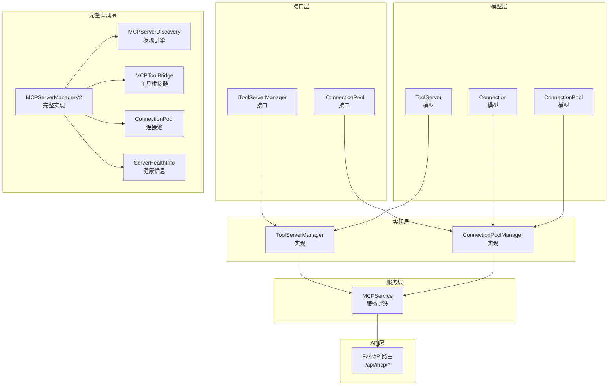
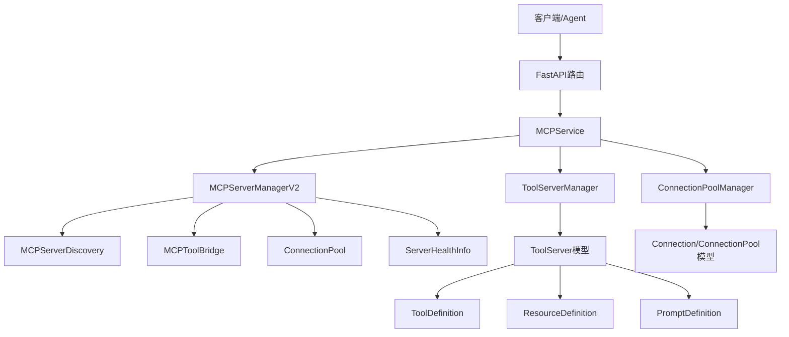
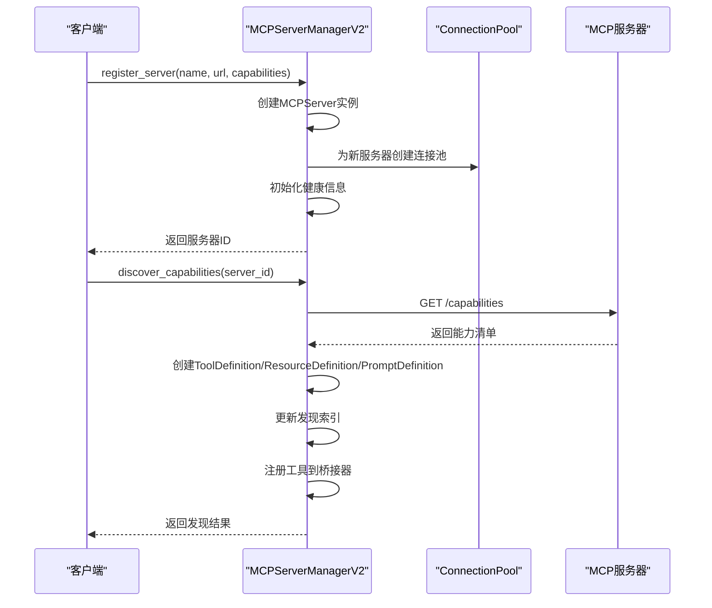
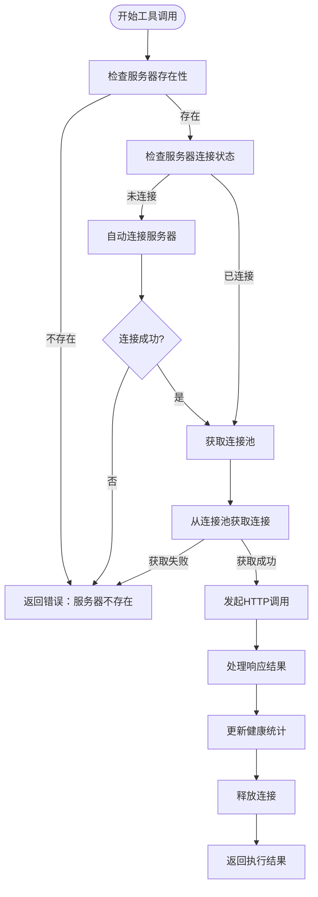
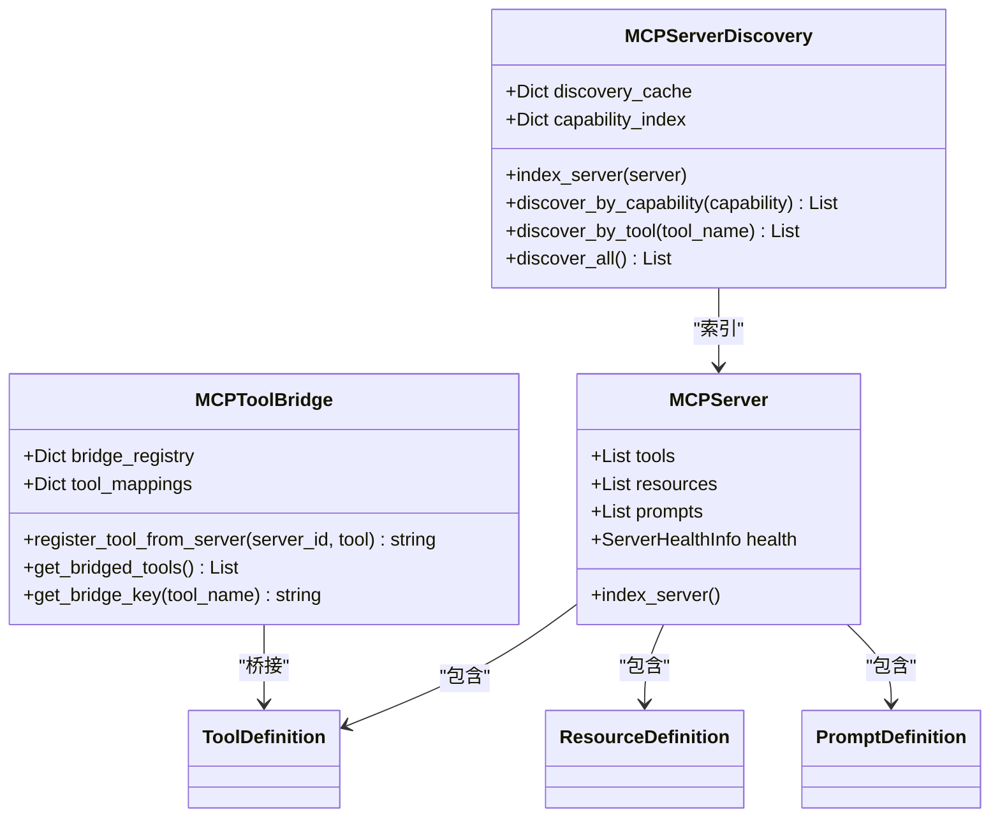
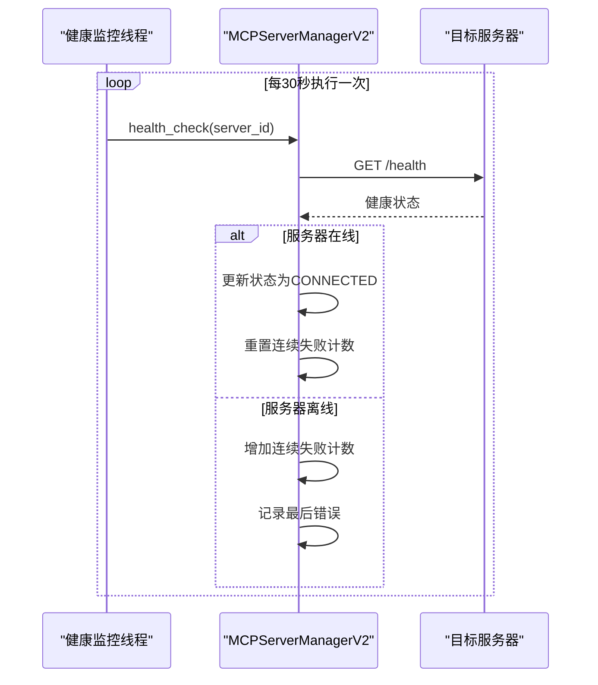
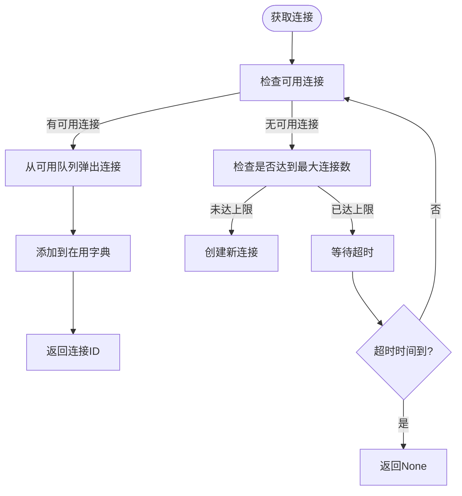
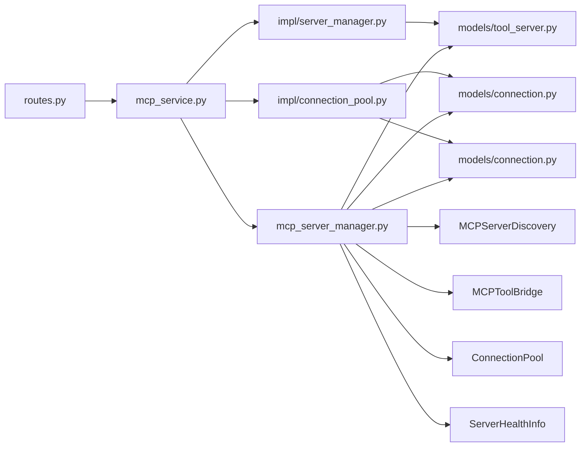

# MCP协议适配器

<cite>
**本文档引用的文件**
- [mcp_server_manager.py](file://odap/biz/integration/mcp_adapter/mcp_server_manager.py)
- [routes.py](file://odap/biz/integration/mcp_adapter/api/routes.py)
- [mcp_service.py](file://odap/biz/integration/mcp_adapter/services/mcp_service.py)
- [connection_pool.py](file://odap/biz/integration/mcp_adapter/impl/connection_pool.py)
- [server_manager.py](file://odap/biz/integration/mcp_adapter/impl/server_manager.py)
- [connection.py](file://odap/biz/integration/mcp_adapter/models/connection.py)
- [tool_server.py](file://odap/biz/integration/mcp_adapter/models/tool_server.py)
- [connection_pool.py（接口）](file://odap/biz/integration/mcp_adapter/interfaces/connection_pool.py)
- [server_manager.py（接口）](file://odap/biz/integration/mcp_adapter/interfaces/server_manager.py)
- [DESIGN.md](file://docs/03-modules/mcp_protocol/DESIGN.md)
- [ADR-026_mcp_protocol_integration.md](file://docs/07-adr/ADR-026_mcp_protocol_integration.md)
- [test_mcp_adapter.py](file://tests/unit/test_mcp_adapter.py)
</cite>

## 更新摘要
**所做更改**
- 新增动态服务器注册功能的详细说明
- 增强工具调用能力的技术细节
- 完善状态监控与健康检查机制
- 更新API接口文档以反映新增的工具调用和状态监控接口
- 补充发现引擎和工具桥接器的功能说明

## 目录
1. [简介](#简介)
2. [项目结构](#项目结构)
3. [核心组件](#核心组件)
4. [架构总览](#架构总览)
5. [详细组件分析](#详细组件分析)
6. [依赖关系分析](#依赖关系分析)
7. [性能考虑](#性能考虑)
8. [故障排查指南](#故障排查指南)
9. [结论](#结论)
10. [附录](#附录)

## 简介
本文件为MCP（Model Context Protocol）协议适配器的技术文档，面向系统集成商与开发者，全面阐述MCP协议在Graphiti平台中的实现架构与使用方式。经过显著增强后，该适配器现已具备以下核心能力：

- **动态服务器注册**：支持运行时动态添加和移除MCP服务器，无需系统重启
- **增强的工具调用能力**：提供完整的工具发现、调用和桥接机制
- **全面的状态监控**：内置健康检查、自动监控和详细的性能指标
- **发现引擎**：支持按能力、标签和工具名称的智能发现
- **工具桥接器**：将远程工具无缝集成到本地工具注册表

该适配器既包含轻量的FastAPI服务封装，也包含完整的MCPServerManagerV2实现，后者提供了更完善的连接池、健康检查、工具发现与桥接能力。

## 项目结构
MCP适配器位于odap/biz/integration/mcp_adapter目录，主要分为三层：
- 接口层：定义抽象接口，便于替换实现
- 实现层：提供具体实现（连接池、服务器管理）
- 服务层：对外暴露MCPService，封装业务流程
- API层：FastAPI路由，提供REST接口
- 模型层：Pydantic模型，定义连接与服务器实体
- 设计文档：模块设计与ADR决策文档

**图表来源**
- [server_manager.py（接口）:1-45](file://odap/biz/integration/mcp_adapter/interfaces/server_manager.py#L1-L45)
- [connection_pool.py（接口）:1-24](file://odap/biz/integration/mcp_adapter/interfaces/connection_pool.py#L1-L24)
- [server_manager.py:1-81](file://odap/biz/integration/mcp_adapter/impl/server_manager.py#L1-L81)
- [connection_pool.py:1-69](file://odap/biz/integration/mcp_adapter/impl/connection_pool.py#L1-L69)
- [mcp_service.py:1-117](file://odap/biz/integration/mcp_adapter/services/mcp_service.py#L1-L117)
- [routes.py:1-120](file://odap/biz/integration/mcp_adapter/api/routes.py#L1-L120)
- [tool_server.py:1-38](file://odap/biz/integration/mcp_adapter/models/tool_server.py#L1-L38)
- [connection.py:1-28](file://odap/biz/integration/mcp_adapter/models/connection.py#L1-L28)
- [mcp_server_manager.py:32-91](file://odap/biz/integration/mcp_adapter/mcp_server_manager.py#L32-L91)
- [mcp_server_manager.py:157-234](file://odap/biz/integration/mcp_adapter/mcp_server_manager.py#L157-L234)

**章节来源**
- [mcp_server_manager.py:1-663](file://odap/biz/integration/mcp_adapter/mcp_server_manager.py#L1-L663)
- [routes.py:1-120](file://odap/biz/integration/mcp_adapter/api/routes.py#L1-L120)
- [mcp_service.py:1-117](file://odap/biz/integration/mcp_adapter/services/mcp_service.py#L1-L117)

## 核心组件
- **MCPServerManagerV2**：完整的MCP服务器管理器，支持动态注册、健康检查、工具发现和桥接
- **MCPServer**：增强的服务器模型，包含工具定义、资源定义、提示定义和健康信息
- **MCPServerDiscovery**：发现引擎，支持按能力、标签和工具名称的智能发现
- **MCPToolBridge**：工具桥接器，将远程工具无缝集成到本地工具注册表
- **ConnectionPool**：增强的连接池，支持超时获取和线程安全
- **ServerHealthInfo**：详细的健康信息模型，包含延迟、成功率、错误统计等
- **MCPService**：对外统一入口，封装服务器注册、连接、工具发现、连接池操作等
- **ToolServerManager**：服务器注册、连接/断开、列表过滤、工具发现
- **ConnectionPoolManager**：连接池创建、连接获取/释放、状态查询
- **FastAPI路由**：提供REST API，对接MCPService和MCPServerManagerV2

**章节来源**
- [mcp_server_manager.py:235-622](file://odap/biz/integration/mcp_adapter/mcp_server_manager.py#L235-L622)
- [mcp_server_manager.py:32-91](file://odap/biz/integration/mcp_adapter/mcp_server_manager.py#L32-L91)
- [mcp_server_manager.py:157-234](file://odap/biz/integration/mcp_adapter/mcp_server_manager.py#L157-L234)
- [mcp_service.py:13-117](file://odap/biz/integration/mcp_adapter/services/mcp_service.py#L13-L117)
- [server_manager.py:9-81](file://odap/biz/integration/mcp_adapter/impl/server_manager.py#L9-L81)
- [connection_pool.py:8-69](file://odap/biz/integration/mcp_adapter/impl/connection_pool.py#L8-L69)
- [routes.py:1-120](file://odap/biz/integration/mcp_adapter/api/routes.py#L1-L120)

## 架构总览
MCP适配器采用"接口+实现+服务封装+API"的分层架构，并提供完整版MCPServerManagerV2以支撑生产级能力（连接池、健康检查、自动监控、工具桥接、发现引擎）。

**图表来源**
- [mcp_service.py:19-26](file://odap/biz/integration/mcp_adapter/services/mcp_service.py#L19-L26)
- [mcp_server_manager.py:241-250](file://odap/biz/integration/mcp_adapter/mcp_server_manager.py#L241-L250)
- [mcp_server_manager.py:32-58](file://odap/biz/integration/mcp_adapter/mcp_server_manager.py#L32-L58)
- [mcp_server_manager.py:157-187](file://odap/biz/integration/mcp_adapter/mcp_server_manager.py#L157-L187)
- [mcp_server_manager.py:205-233](file://odap/biz/integration/mcp_adapter/mcp_server_manager.py#L205-L233)
- [mcp_server_manager.py:102-154](file://odap/biz/integration/mcp_adapter/mcp_server_manager.py#L102-L154)
- [mcp_server_manager.py:61-71](file://odap/biz/integration/mcp_adapter/mcp_server_manager.py#L61-L71)

## 详细组件分析

### 动态服务器注册管理（MCPServerManagerV2）
- **设计要点**
  - 支持运行时动态注册和注销MCP服务器
  - 自动创建对应的连接池
  - 初始化健康信息和发现索引
  - 支持多种服务器能力（tools、resources、prompts等）
- **关键行为**
  - register_server：创建服务器实例，设置默认能力，初始化连接池
  - connect_server/disconnect_server：管理服务器连接状态
  - discover_capabilities：拉取远端能力清单，构建工具、资源、提示定义
  - 自动健康检查：后台线程定期检查服务器健康状态

**图表来源**
- [mcp_server_manager.py:258-297](file://odap/biz/integration/mcp_adapter/mcp_server_manager.py#L258-L297)
- [mcp_server_manager.py:342-408](file://odap/biz/integration/mcp_adapter/mcp_server_manager.py#L342-L408)
- [mcp_server_manager.py:205-233](file://odap/biz/integration/mcp_adapter/mcp_server_manager.py#L205-L233)

**章节来源**
- [mcp_server_manager.py:235-622](file://odap/biz/integration/mcp_adapter/mcp_server_manager.py#L235-L622)

### 增强的工具调用能力
- **设计要点**
  - 支持异步HTTP调用，避免阻塞
  - 自动连接管理和超时控制
  - 详细的执行统计和错误处理
  - 工具桥接器支持本地工具注册
- **关键行为**
  - execute_tool：自动连接校验、连接池获取、HTTP调用、健康统计
  - 工具参数验证和JSON序列化
  - 执行时间测量和性能监控
  - 错误恢复和连续失败统计

**图表来源**
- [mcp_server_manager.py:410-480](file://odap/biz/integration/mcp_adapter/mcp_server_manager.py#L410-L480)

**章节来源**
- [mcp_server_manager.py:410-480](file://odap/biz/integration/mcp_adapter/mcp_server_manager.py#L410-L480)

### 发现引擎与工具桥接器
- **MCPServerDiscovery**：提供智能发现能力
  - 按能力标签索引服务器
  - 支持按工具名称精确匹配
  - 缓存发现结果，提高查询性能
- **MCPToolBridge**：实现工具桥接
  - 将远程工具注册为本地可调用工具
  - 维护工具映射关系
  - 支持工具元数据的统一管理

**图表来源**
- [mcp_server_manager.py:157-203](file://odap/biz/integration/mcp_adapter/mcp_server_manager.py#L157-L203)
- [mcp_server_manager.py:205-233](file://odap/biz/integration/mcp_adapter/mcp_server_manager.py#L205-L233)

**章节来源**
- [mcp_server_manager.py:157-234](file://odap/biz/integration/mcp_adapter/mcp_server_manager.py#L157-L234)

### 健康监控与状态管理
- **ServerHealthInfo**：详细的健康信息模型
  - 连接延迟测量（毫秒）
  - 成功/失败调用统计
  - 连续失败计数和最近错误
  - 最近成功调用时间戳
- **自动健康检查**：后台线程定期检查服务器状态
  - 可配置检查间隔（默认30秒）
  - 异常处理和错误记录
  - 线程安全的健康状态更新

**图表来源**
- [mcp_server_manager.py:481-517](file://odap/biz/integration/mcp_adapter/mcp_server_manager.py#L481-L517)
- [mcp_server_manager.py:519-549](file://odap/biz/integration/mcp_adapter/mcp_server_manager.py#L519-L549)

**章节来源**
- [mcp_server_manager.py:61-71](file://odap/biz/integration/mcp_adapter/mcp_server_manager.py#L61-L71)
- [mcp_server_manager.py:481-549](file://odap/biz/integration/mcp_adapter/mcp_server_manager.py#L481-L549)

### 连接池管理（增强版）
- **设计要点**
  - 支持超时获取连接（默认5秒）
  - 线程安全的连接管理
  - 可配置的最大/最小连接数
  - 详细的连接状态统计
- **关键行为**
  - acquire：带超时的连接获取
  - release：连接释放和回收
  - get_status：实时连接池状态查询

**图表来源**
- [mcp_server_manager.py:122-144](file://odap/biz/integration/mcp_adapter/mcp_server_manager.py#L122-L144)

**章节来源**
- [mcp_server_manager.py:102-154](file://odap/biz/integration/mcp_adapter/mcp_server_manager.py#L102-L154)

## 依赖关系分析
- **组件耦合**
  - MCPService依赖ToolServerManager与ConnectionPoolManager
  - FastAPI路由依赖MCPService和MCPServerManagerV2
  - MCPServerManagerV2自包含发现引擎、桥接器、连接池和健康检查
  - 完整实现内部各组件高度集成
- **外部依赖**
  - aiohttp用于异步HTTP调用
  - threading用于自动健康检查线程
  - Pydantic模型用于数据结构与序列化
  - asyncio用于异步编程支持

**图表来源**
- [routes.py:1-120](file://odap/biz/integration/mcp_adapter/api/routes.py#L1-L120)
- [mcp_service.py:13-117](file://odap/biz/integration/mcp_adapter/services/mcp_service.py#L13-L117)
- [server_manager.py:9-81](file://odap/biz/integration/mcp_adapter/impl/server_manager.py#L9-L81)
- [connection_pool.py:8-69](file://odap/biz/integration/mcp_adapter/impl/connection_pool.py#L8-L69)
- [tool_server.py:1-38](file://odap/biz/integration/mcp_adapter/models/tool_server.py#L1-L38)
- [connection.py:1-28](file://odap/biz/integration/mcp_adapter/models/connection.py#L1-L28)
- [mcp_server_manager.py:235-622](file://odap/biz/integration/mcp_adapter/mcp_server_manager.py#L235-L622)

**章节来源**
- [routes.py:1-120](file://odap/biz/integration/mcp_adapter/api/routes.py#L1-L120)
- [mcp_service.py:13-117](file://odap/biz/integration/mcp_adapter/services/mcp_service.py#L13-L117)
- [mcp_server_manager.py:235-622](file://odap/biz/integration/mcp_adapter/mcp_server_manager.py#L235-L622)

## 性能考虑
- **连接池优化**
  - min_size：根据冷启动场景设置，确保首批请求无需等待
  - max_size：根据CPU/内存与远端限流策略设定
  - acquire超时：默认5秒，可根据网络状况调整
- **健康检查优化**
  - 自动健康检查线程周期性探测远端健康端点
  - 可配置检查间隔（默认30秒）
  - 连续失败计数与最近错误记录，辅助快速熔断
- **异步与并发**
  - aiohttp异步HTTP会话，减少阻塞
  - 连接池内部使用RLock保证线程安全
  - 自动健康检查使用守护线程，不影响主业务逻辑
- **监控与指标**
  - get_health_report提供总服务器数、连接数、工具数、调用总数、成功率等关键指标
  - 详细的执行时间统计和错误分类

**章节来源**
- [mcp_server_manager.py:102-154](file://odap/biz/integration/mcp_adapter/mcp_server_manager.py#L102-L154)
- [mcp_server_manager.py:519-549](file://odap/biz/integration/mcp_adapter/mcp_server_manager.py#L519-L549)
- [mcp_server_manager.py:579-610](file://odap/biz/integration/mcp_adapter/mcp_server_manager.py#L579-L610)

## 故障排查指南
- **常见问题与定位**
  - 服务器无法连接：检查connect_server返回值与健康状态；查看健康信息中的last_error与consecutive_failures
  - 工具执行失败：确认服务器状态为CONNECTED；检查execute_tool返回的success与error字段
  - 连接池耗尽：增大max_size或缩短请求处理时间；观察acquire超时
  - 工具发现失败：检查discover_capabilities的返回结果；确认远端服务器支持相应能力
- **新增功能排查**
  - 动态注册失败：检查服务器URL可达性和健康端点
  - 工具桥接异常：验证工具名称映射和输入参数格式
  - 发现引擎查询无结果：确认服务器已正确索引和工具已注册
- **单元测试参考**
  - 注册/连接/断开/列表/工具发现/连接池状态/连接池获取/释放等均有单元测试覆盖
  - 新增的动态服务器注册、工具调用、健康检查等功能都有专门的测试用例

**章节来源**
- [test_mcp_adapter.py:1-316](file://tests/unit/test_mcp_adapter.py#L1-L316)
- [routes.py:23-120](file://odap/biz/integration/mcp_adapter/api/routes.py#L23-L120)
- [mcp_service.py:28-117](file://odap/biz/integration/mcp_adapter/services/mcp_service.py#L28-L117)
- [mcp_server_manager.py:481-610](file://odap/biz/integration/mcp_adapter/mcp_server_manager.py#L481-L610)

## 结论
经过显著增强的MCP协议适配器提供了从轻量封装到完整实现的两套方案：

- **轻量方案**：通过MCPService与FastAPI路由，满足基础的服务器管理与连接池操作
- **完整方案**：MCPServerManagerV2提供动态服务器注册、工具调用、健康检查、自动监控、工具桥接与发现引擎，适合生产级集成

推荐在生产环境中采用完整实现，并结合健康检查与监控指标进行持续优化。新增的动态服务器注册、工具调用能力和状态监控功能大大提升了系统的灵活性和可观测性。

## 附录

### API接口文档
- **服务器注册**
  - 方法：POST
  - 路径：/api/mcp/servers
  - 参数：name, url, description
  - 返回：server_id, name, url, status
- **服务器连接**
  - 方法：POST
  - 路径：/api/mcp/servers/{server_id}/connect
  - 返回：status
- **服务器断开**
  - 方法：POST
  - 路径：/api/mcp/servers/{server_id}/disconnect
  - 返回：status
- **服务器注销**
  - 方法：DELETE
  - 路径：/api/mcp/servers/{server_id}
  - 返回：status, server_id
- **列出服务器**
  - 方法：GET
  - 路径：/api/mcp/servers
  - 查询参数：status（可选）
  - 返回：servers数组
- **发现工具**
  - 方法：GET
  - 路径：/api/mcp/servers/{server_id}/tools
  - 返回：tools数组
- **工具调用**
  - 方法：POST
  - 路径：/api/mcp/servers/{server_id}/tools/{tool_name}
  - 参数：arguments（JSON对象）
  - 返回：success, data, execution_time_ms
- **服务器状态**
  - 方法：GET
  - 路径：/api/mcp/servers/{server_id}/status
  - 返回：服务器详细状态信息
- **连接池状态**
  - 方法：GET
  - 路径：/api/mcp/servers/{server_id}/pool-status
  - 返回：available, in_use, total, max_size

**章节来源**
- [routes.py:23-120](file://odap/biz/integration/mcp_adapter/api/routes.py#L23-L120)
- [mcp_service.py:28-117](file://odap/biz/integration/mcp_adapter/services/mcp_service.py#L28-L117)

### 配置指南与最佳实践
- **服务器注册**
  - 建议为每个外部MCP Server提供稳定的URL与健康端点
  - 在注册时声明capabilities，便于后续发现与路由
  - 支持动态注册，无需重启系统即可添加新服务器
- **连接池参数**
  - min_size：根据冷启动场景设置，确保首批请求无需等待
  - max_size：根据CPU/内存与远端限流策略设定
  - 超时：在工具执行前确保连接池有足够容量，必要时调高acquire超时
- **健康检查**
  - 启用自动健康检查线程，合理设置检查间隔
  - 结合监控系统告警连续失败次数与成功率
  - 利用get_health_report获取系统整体健康状况
- **工具调用优化**
  - 使用工具桥接器将远程工具注册为本地工具
  - 通过发现引擎按能力或标签智能路由工具调用
  - 监控工具执行时间和成功率，优化性能
- **安全与隔离**
  - 建议在独立进程中运行MCP Server，配合网络隔离与访问控制
  - 使用TLS与认证机制保护远端端点
  - 利用沙箱隔离机制确保系统安全

**章节来源**
- [DESIGN.md:1-200](file://docs/03-modules/mcp_protocol/DESIGN.md#L1-L200)
- [ADR-026_mcp_protocol_integration.md:1-200](file://docs/07-adr/ADR-026_mcp_protocol_integration.md#L1-L200)
- [mcp_server_manager.py:258-297](file://odap/biz/integration/mcp_adapter/mcp_server_manager.py#L258-L297)
- [mcp_server_manager.py:519-549](file://odap/biz/integration/mcp_adapter/mcp_server_manager.py#L519-L549)