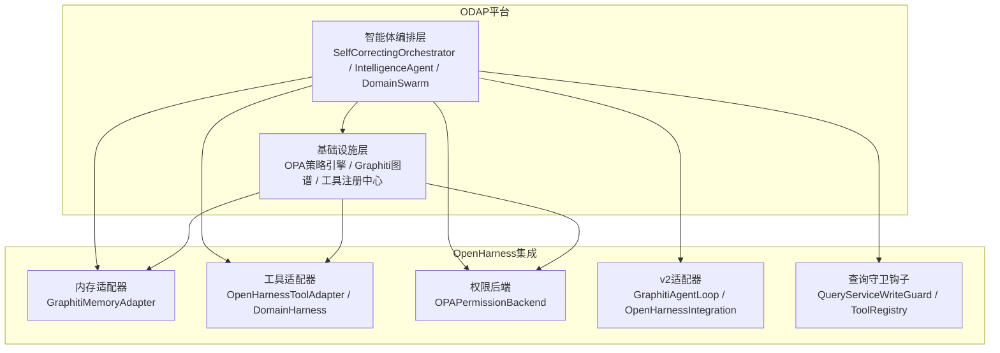
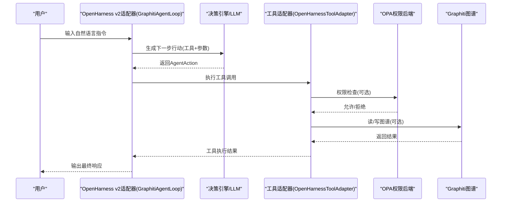
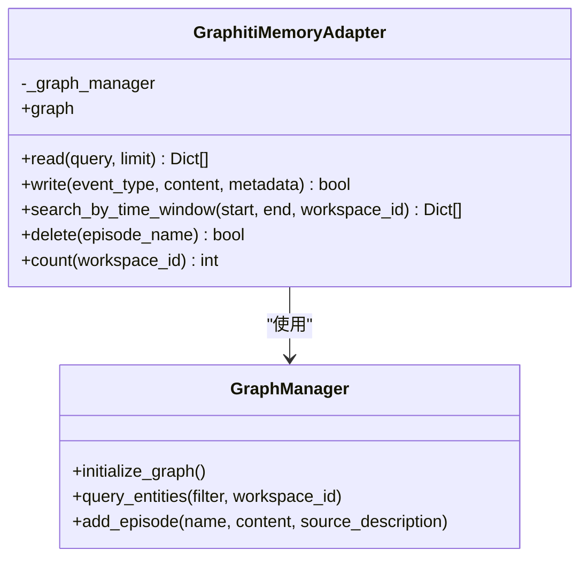
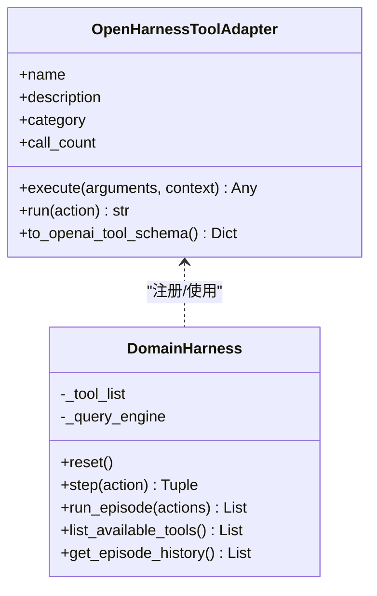
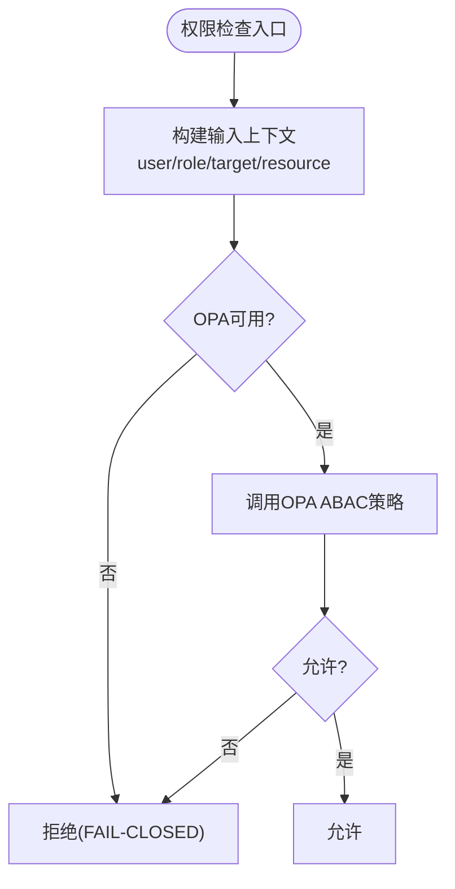
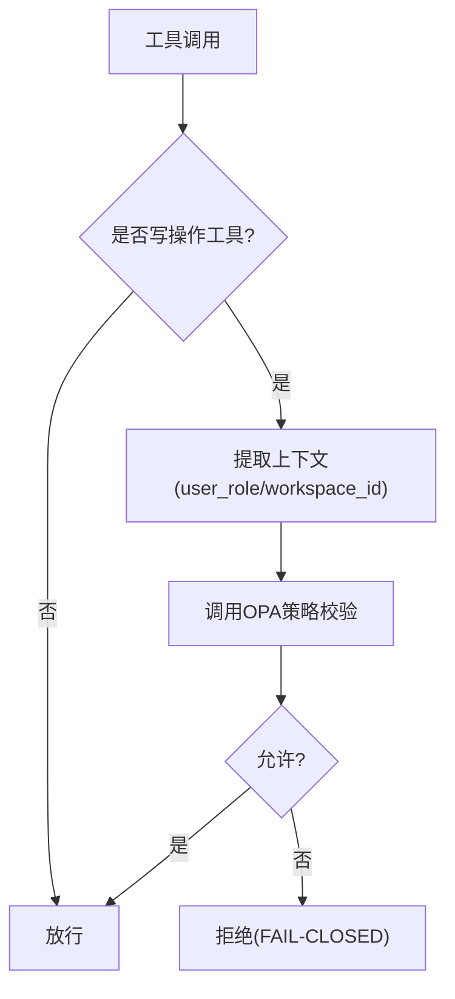
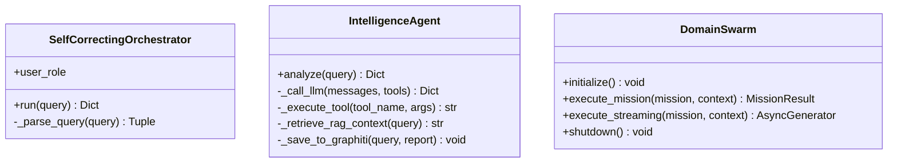
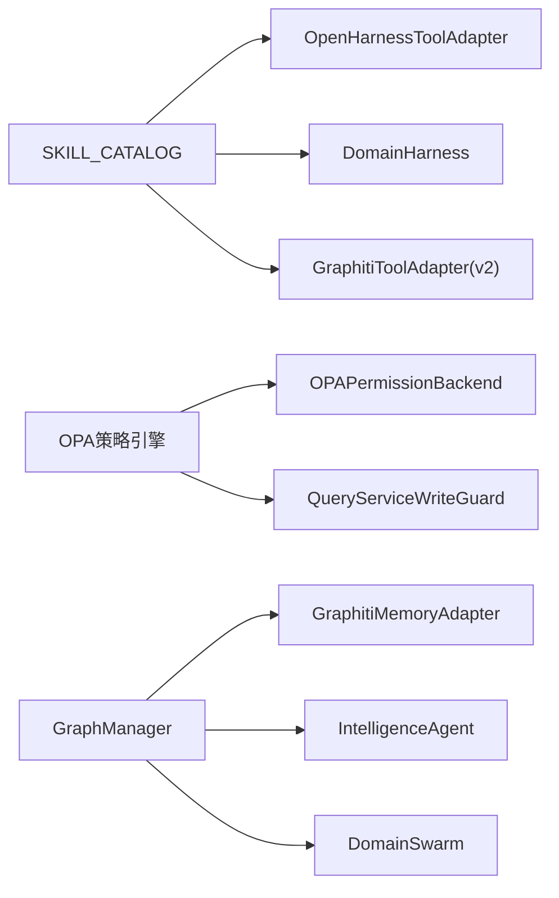

# OpenHarness智能体集成

<cite>
**本文档引用的文件**
- [memory_adapter.py](file://odap/infra/openharness/memory_adapter.py)
- [tool_adapter.py](file://odap/infra/openharness/tool_adapter.py)
- [permission_backend.py](file://odap/infra/openharness/permission_backend.py)
- [v2_adapter.py](file://odap/infra/openharness/v2_adapter.py)
- [query_guard_hook.py](file://odap/infra/openharness/query_guard_hook.py)
- [orchestrator.py](file://odap/biz/core/agent/orchestrator.py)
- [swarm_orchestrator.py](file://odap/biz/core/agent/swarm_orchestrator.py)
- [intelligence_agent.py](file://odap/biz/core/agent/intelligence_agent.py)
- [opa_service.py](file://odap/infra/opa/opa_service.py)
- [graph_service.py](file://odap/infra/graph/graph_service.py)
- [__init__.py](file://odap/tools/__init__.py)
</cite>

## 目录
1. [简介](#简介)
2. [项目结构](#项目结构)
3. [核心组件](#核心组件)
4. [架构总览](#架构总览)
5. [详细组件分析](#详细组件分析)
6. [依赖关系分析](#依赖关系分析)
7. [性能考虑](#性能考虑)
8. [故障排查指南](#故障排查指南)
9. [结论](#结论)
10. [附录](#附录)

## 简介
本文件面向OpenHarness智能体集成的技术文档，系统阐述基于OpenHarness v1/v2的Agent Loop集成架构，涵盖Agent生命周期管理、权限检查机制、内存适配器、工具适配器的实现细节；同时说明智能体编排系统的设计原理（Agent创建、销毁、状态管理、通信协议）、与ODAP平台的集成方式（数据交换格式、API接口、错误处理机制），并提供配置选项、性能优化策略与监控指标，以及开发者指南与最佳实践。

## 项目结构
OpenHarness集成位于ODAP平台的基础设施层，围绕以下模块组织：
- OpenHarness适配层：内存适配、工具适配、权限后端、v2适配器、查询守卫钩子
- 智能体编排层：单Agent ReAct智能体、自校正编排器、Swarm多Agent编排
- 平台基础设施：OPA策略引擎、Graphiti图谱服务、工具注册中心



**图表来源**
- [orchestrator.py:16-62](file://odap/biz/core/agent/orchestrator.py#L16-L62)
- [intelligence_agent.py:73-125](file://odap/biz/core/agent/intelligence_agent.py#L73-L125)
- [swarm_orchestrator.py:288-360](file://odap/biz/core/agent/swarm_orchestrator.py#L288-L360)
- [memory_adapter.py:8-64](file://odap/infra/openharness/memory_adapter.py#L8-L64)
- [tool_adapter.py:83-488](file://odap/infra/openharness/tool_adapter.py#L83-L488)
- [permission_backend.py:7-83](file://odap/infra/openharness/permission_backend.py#L7-L83)
- [v2_adapter.py:90-528](file://odap/infra/openharness/v2_adapter.py#L90-L528)
- [query_guard_hook.py:17-175](file://odap/infra/openharness/query_guard_hook.py#L17-L175)

**章节来源**
- [orchestrator.py:16-151](file://odap/biz/core/agent/orchestrator.py#L16-L151)
- [intelligence_agent.py:73-125](file://odap/biz/core/agent/intelligence_agent.py#L73-L125)
- [swarm_orchestrator.py:288-687](file://odap/biz/core/agent/swarm_orchestrator.py#L288-L687)

## 核心组件
- 内存适配器：将Graphiti双时态图谱作为OpenHarness长期记忆，提供读写、时间窗口检索、计数等接口。
- 工具适配器：将ODAP技能目录适配为OpenHarness工具，兼容v1/v2接口，支持参数合并、异步执行、结果标准化。
- 权限后端：基于OPA的ABAC策略，提供fail-closed的权限检查与异常处理。
- v2适配器：基于OpenHarness v2的QueryEngine与ToolRegistry，构建Agent Loop，支持决策引擎与LLM客户端。
- 查询守卫钩子：拦截写操作，结合OPA进行安全校验，实现fail-closed策略。

**章节来源**
- [memory_adapter.py:8-64](file://odap/infra/openharness/memory_adapter.py#L8-L64)
- [tool_adapter.py:83-488](file://odap/infra/openharness/tool_adapter.py#L83-L488)
- [permission_backend.py:7-83](file://odap/infra/openharness/permission_backend.py#L7-L83)
- [v2_adapter.py:90-528](file://odap/infra/openharness/v2_adapter.py#L90-L528)
- [query_guard_hook.py:17-175](file://odap/infra/openharness/query_guard_hook.py#L17-L175)

## 架构总览
OpenHarness智能体集成采用“平台能力+适配层+编排层”的分层架构：
- 平台能力：OPA策略引擎负责权限控制；Graphiti图谱提供时序知识存储；工具注册中心统一管理技能。
- 适配层：将平台能力以工具、内存、权限的形式暴露给OpenHarness；同时支持v1/v2两种版本的Agent Loop。
- 编排层：提供单Agent ReAct智能体、自校正编排器与Swarm多Agent编排，实现从感知到行动的完整闭环。



**图表来源**
- [v2_adapter.py:171-392](file://odap/infra/openharness/v2_adapter.py#L171-L392)
- [tool_adapter.py:83-194](file://odap/infra/openharness/tool_adapter.py#L83-L194)
- [permission_backend.py:40-76](file://odap/infra/openharness/permission_backend.py#L40-L76)
- [graph_service.py:649-756](file://odap/infra/graph/graph_service.py#L649-L756)

## 详细组件分析

### 内存适配器（GraphitiMemoryAdapter）
- 职责：将Graphiti双时态图谱作为OpenHarness长期记忆，提供检索、写入、时间窗口查询、删除与计数接口。
- 关键点：
  - 异步读写：read/write/search_by_time_window/delete/count均采用异步实现。
  - 时间戳管理：写入时使用UTC时间戳，支持时序查询。
  - 错误处理：捕获异常并返回布尔值或空结果，保证调用稳定性。
  - 依赖注入：延迟初始化GraphManager，避免循环依赖。



**图表来源**
- [memory_adapter.py:8-64](file://odap/infra/openharness/memory_adapter.py#L8-L64)
- [graph_service.py:71-144](file://odap/infra/graph/graph_service.py#L71-L144)

**章节来源**
- [memory_adapter.py:8-64](file://odap/infra/openharness/memory_adapter.py#L8-L64)
- [graph_service.py:540-602](file://odap/infra/graph/graph_service.py#L540-L602)

### 工具适配器（OpenHarnessToolAdapter / DomainHarness）
- 职责：将ODAP技能目录适配为OpenHarness工具，兼容v1/v2接口；提供批量工具构建、Observation生成、step执行、episode历史记录。
- 关键点：
  - 版本兼容：根据OpenHarness版本选择v2的BaseTool接口或v1的run接口。
  - 参数合并：支持query与params合并，统一传参。
  - 结果标准化：统一返回ToolResult或JSON字符串，包含执行时间、调用次数等元数据。
  - 权限集成：可选地与OPA后端集成，执行权限检查。
  - DomainHarness：封装工具注册、QueryEngine初始化、episode执行与历史管理。



**图表来源**
- [tool_adapter.py:83-488](file://odap/infra/openharness/tool_adapter.py#L83-L488)

**章节来源**
- [tool_adapter.py:83-488](file://odap/infra/openharness/tool_adapter.py#L83-L488)

### 权限后端（OPAPermissionBackend）
- 职责：基于OPA的ABAC策略进行权限检查，提供fail-closed的安全策略。
- 关键点：
  - 策略映射：将工具名映射到具体策略路径，支持默认策略。
  - 上下文构建：从工具输入与上下文提取用户角色、目标、武器等信息。
  - 异常处理：OPA不可用时拒绝所有写操作，保证系统安全。



**图表来源**
- [permission_backend.py:40-76](file://odap/infra/openharness/permission_backend.py#L40-L76)
- [opa_service.py:394-406](file://odap/infra/opa/opa_service.py#L394-L406)

**章节来源**
- [permission_backend.py:7-83](file://odap/infra/openharness/permission_backend.py#L7-L83)
- [opa_service.py:373-450](file://odap/infra/opa/opa_service.py#L373-L450)

### v2适配器（GraphitiAgentLoop / OpenHarnessIntegration）
- 职责：基于OpenHarness v2的QueryEngine与ToolRegistry构建Agent Loop，支持决策引擎与LLM客户端。
- 关键点：
  - 工具构建：从SKILL_CATALOG构建GraphitiToolAdapter工具集合。
  - 决策回退：优先使用决策引擎，失败时回退到LLM或关键词匹配。
  - 执行流程：decide_action -> execute_action -> 更新observation -> 记录历史。
  - 集成管理：OpenHarnessIntegration统一管理初始化、状态查询与运行。

```mermaid
sequenceDiagram
participant CLI as "调用方"
participant INT as "OpenHarnessIntegration"
participant LOOP as "GraphitiAgentLoop"
participant DEC as "决策引擎/LLM"
participant TOOL as "GraphitiToolAdapter"
CLI->>INT : initialize(user_role, provider_config)
INT->>LOOP : 构建Agent Loop
CLI->>INT : run_agent(user_input, context)
INT->>LOOP : run(user_input, context)
LOOP->>DEC : 决策下一步行动
DEC-->>LOOP : AgentAction
LOOP->>TOOL : execute(action)
TOOL-->>LOOP : 执行结果
LOOP-->>CLI : 最终结果
```

**图表来源**
- [v2_adapter.py:171-392](file://odap/infra/openharness/v2_adapter.py#L171-L392)
- [v2_adapter.py:394-528](file://odap/infra/openharness/v2_adapter.py#L394-L528)

**章节来源**
- [v2_adapter.py:90-528](file://odap/infra/openharness/v2_adapter.py#L90-L528)

### 查询守卫钩子（QueryServiceWriteGuard / ToolRegistry）
- 职责：拦截写操作，调用OPA进行安全校验，实现fail-closed策略。
- 关键点：
  - 工具分类：READ/WRITE两类工具，写操作需经OPA审批。
  - 上下文传递：从执行上下文中提取user_role、workspace_id等。
  - 策略路径：按policies.agent_write.<tool_name>.allow命名约定。



**图表来源**
- [query_guard_hook.py:17-83](file://odap/infra/openharness/query_guard_hook.py#L17-L83)

**章节来源**
- [query_guard_hook.py:17-175](file://odap/infra/openharness/query_guard_hook.py#L17-L175)

### 智能体编排系统
- SelfCorrectingOrchestrator：基于关键词正则路由的任务编排器，适合简单场景。
- IntelligenceAgent：基于LLM ReAct模式的单Agent智能体，具备RAG增强、链路追踪与Graphiti记忆写入。
- DomainSwarm：多Agent协同编排（Commander/Intelligence/Operations），实现OODA闭环，支持流式执行与健康监控。



**图表来源**
- [orchestrator.py:16-151](file://odap/biz/core/agent/orchestrator.py#L16-L151)
- [intelligence_agent.py:73-599](file://odap/biz/core/agent/intelligence_agent.py#L73-L599)
- [swarm_orchestrator.py:288-687](file://odap/biz/core/agent/swarm_orchestrator.py#L288-L687)

**章节来源**
- [orchestrator.py:16-151](file://odap/biz/core/agent/orchestrator.py#L16-L151)
- [intelligence_agent.py:73-599](file://odap/biz/core/agent/intelligence_agent.py#L73-L599)
- [swarm_orchestrator.py:288-687](file://odap/biz/core/agent/swarm_orchestrator.py#L288-L687)

## 依赖关系分析
- 工具注册中心：ODAP工具包通过SKILL_CATALOG统一管理技能，OpenHarness适配器从该目录构建工具。
- 权限依赖：权限后端依赖OPA策略引擎；查询守卫钩子依赖OPA进行写操作校验。
- 图谱依赖：内存适配器与智能体均依赖GraphManager进行图谱读写。
- 版本兼容：工具适配器与v2适配器分别兼容OpenHarness v1/v2，通过动态导入与接口适配实现。



**图表来源**
- [__init__.py:1-35](file://odap/tools/__init__.py#L1-L35)
- [tool_adapter.py:292-309](file://odap/infra/openharness/tool_adapter.py#L292-L309)
- [v2_adapter.py:199-214](file://odap/infra/openharness/v2_adapter.py#L199-L214)
- [permission_backend.py:26-38](file://odap/infra/openharness/permission_backend.py#L26-L38)
- [query_guard_hook.py:28-39](file://odap/infra/openharness/query_guard_hook.py#L28-L39)
- [graph_service.py:71-144](file://odap/infra/graph/graph_service.py#L71-L144)

**章节来源**
- [__init__.py:1-35](file://odap/tools/__init__.py#L1-L35)
- [tool_adapter.py:292-309](file://odap/infra/openharness/tool_adapter.py#L292-L309)
- [v2_adapter.py:199-214](file://odap/infra/openharness/v2_adapter.py#L199-L214)
- [permission_backend.py:26-38](file://odap/infra/openharness/permission_backend.py#L26-L38)
- [query_guard_hook.py:28-39](file://odap/infra/openharness/query_guard_hook.py#L28-L39)
- [graph_service.py:71-144](file://odap/infra/graph/graph_service.py#L71-L144)

## 性能考虑
- 连接池与断路器：GraphManager实现Neo4j连接池与断路器，降低连接开销与故障影响。
- 缓存与批量：OPA管理器内置策略缓存与批量检查，减少重复调用。
- 异步执行：内存适配器与v2适配器均采用异步IO，提升并发性能。
- 重试与超时：智能体的LLM调用采用指数退避重试与合理超时，提升鲁棒性。
- 监控指标：GraphManager与OPA管理器提供性能指标，便于观测与优化。

**章节来源**
- [graph_service.py:128-134](file://odap/infra/graph/graph_service.py#L128-L134)
- [graph_service.py:406-443](file://odap/infra/graph/graph_service.py#L406-L443)
- [opa_service.py:473-537](file://odap/infra/opa/opa_service.py#L473-L537)
- [intelligence_agent.py:172-214](file://odap/biz/core/agent/intelligence_agent.py#L172-L214)

## 故障排查指南
- OpenHarness不可用：工具适配器与v2适配器均支持模拟模式，可通过环境变量或路径配置启用。
- OPA不可用：权限后端与查询守卫钩子在OPA不可用时采用fail-closed策略，拒绝写操作。
- 图谱连接失败：GraphManager支持三层降级（Graphiti→Neo4j Driver→NetworkX），自动切换并记录错误。
- 权限拒绝：检查OPA策略路径与用户角色映射，确认策略bundle版本与热更新。
- 工具执行异常：查看工具适配器返回的错误信息与调用次数，定位具体工具与参数问题。

**章节来源**
- [tool_adapter.py:64-76](file://odap/infra/openharness/tool_adapter.py#L64-L76)
- [permission_backend.py:54-68](file://odap/infra/openharness/permission_backend.py#L54-L68)
- [query_guard_hook.py:59-82](file://odap/infra/openharness/query_guard_hook.py#L59-L82)
- [graph_service.py:145-184](file://odap/infra/graph/graph_service.py#L145-L184)

## 结论
OpenHarness智能体集成通过平台能力与适配层的有机结合，实现了从权限控制、知识记忆到工具调用与决策执行的完整闭环。v1/v2版本的兼容设计确保了平滑迁移与扩展能力；Swarm多Agent编排进一步提升了复杂任务的处理能力。建议在生产环境中启用OPA策略与GraphManager的降级模式，并结合监控指标持续优化性能与稳定性。

## 附录
- 配置选项
  - OpenHarness路径：通过环境变量OPENHARNESS_PATH指定源码路径。
  - LLM客户端：支持Anthropic等Provider，通过配置文件或工厂方法创建。
  - OPA策略：支持热更新与回滚，提供策略沙箱与What-If分析。
- 性能优化
  - 启用连接池与断路器，减少图谱访问延迟。
  - 使用OPA缓存与批量检查，降低策略调用开销。
  - 异步执行与指数退避重试，提升系统鲁棒性。
- 监控指标
  - GraphManager：查询时间、缓存命中率、连接池状态、断路器状态。
  - OPA管理器：缓存命中率、策略版本、历史记录数量、性能指标。
- 开发者指南与最佳实践
  - 新增技能：在SKILL_CATALOG中注册，适配器自动发现。
  - 权限设计：遵循ABAC模型，明确角色、资源与环境约束。
  - 安全策略：写操作必须经过OPA校验，采用fail-closed策略。
  - 日志与追踪：使用链路追踪Span记录关键事件，便于问题定位。