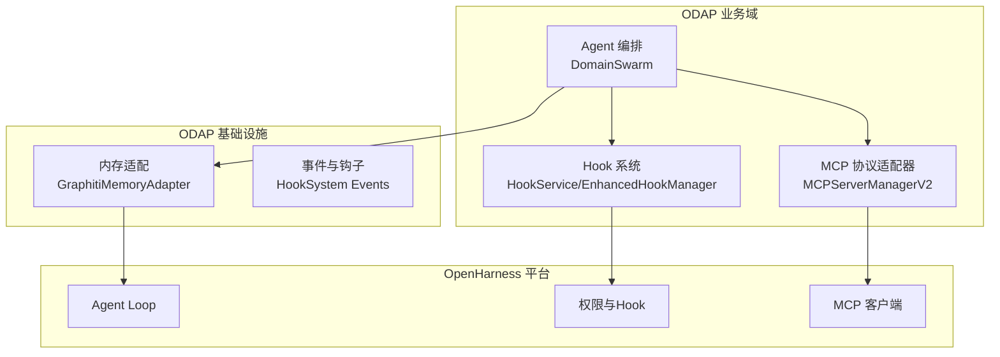
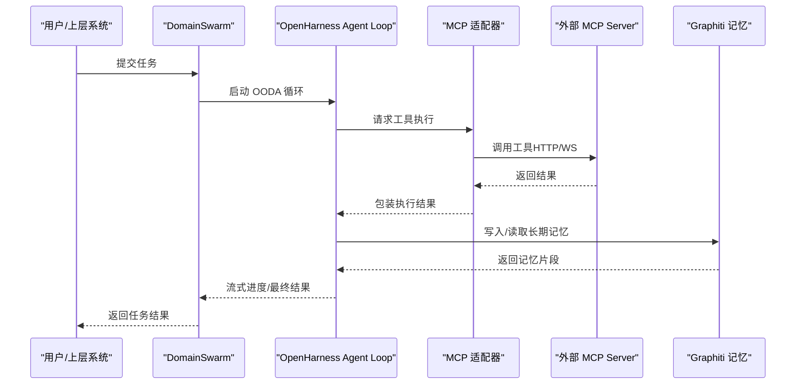
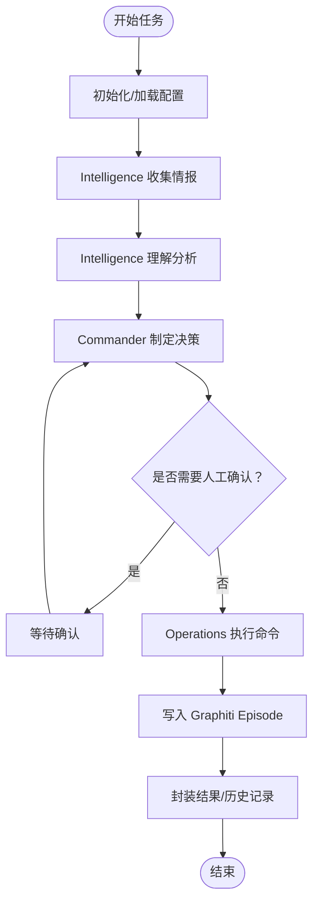
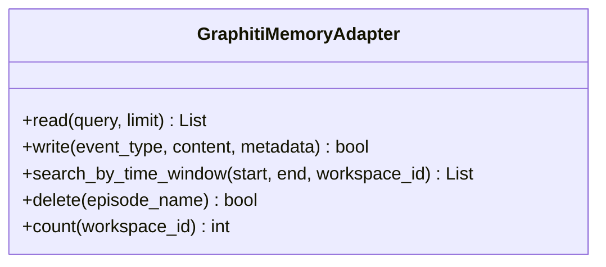
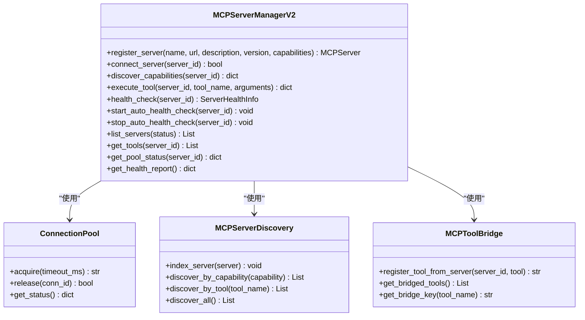
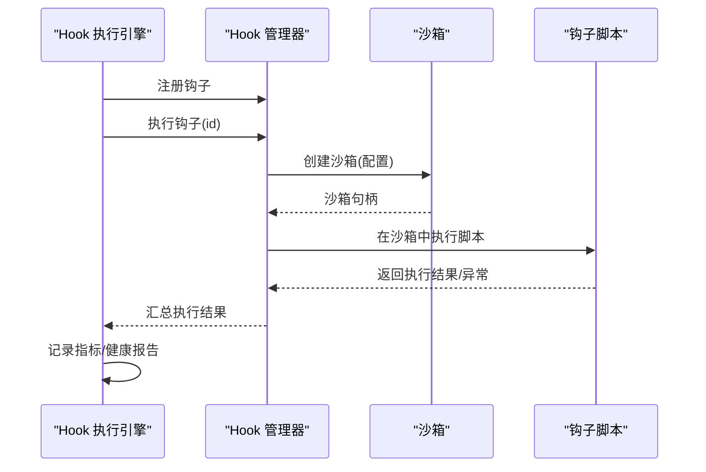
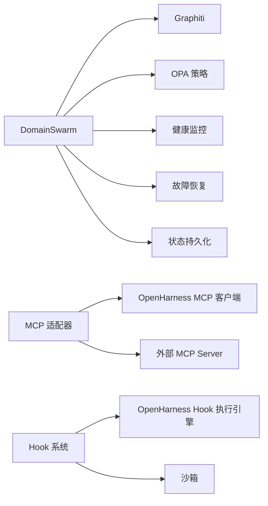

# 集成服务

<cite>
**本文引用的文件**
- [swarm_orchestrator.py](file://odap/biz/core/agent/swarm_orchestrator.py)
- [mcp_server_manager.py](file://odap/biz/integration/mcp_adapter/mcp_server_manager.py)
- [memory_adapter.py](file://odap/infra/openharness/memory_adapter.py)
- [hook_system.py](file://odap/infra/events/hook_system.py)
- [README.md](file://openharness/README.md)
- [README.zh-CN.md](file://openharness/README.zh-CN.md)
- [spec.md](file://specs/001-odap-platform/spec.md)
- [ADR-026_mcp_protocol_integration.md](file://docs/07-adr/ADR-026_mcp_protocol_integration.md)
- [test_hook_system.py](file://tests/unit/test_hook_system.py)
</cite>

## 目录
1. [简介](#简介)
2. [项目结构](#项目结构)
3. [核心组件](#核心组件)
4. [架构总览](#架构总览)
5. [详细组件分析](#详细组件分析)
6. [依赖分析](#依赖分析)
7. [性能考虑](#性能考虑)
8. [故障排除指南](#故障排除指南)
9. [结论](#结论)
10. [附录](#附录)

## 简介
本文件为 ODAP 集成服务的技术文档，聚焦于 OpenHarness 智能体集成的设计与实现，涵盖以下主题：
- Agent 循环与多智能体编排：基于 OpenHarness Swarm 的 OODA 循环（观察-理解-决策-行动）。
- 权限管理与安全：结合 OPA 策略与 OpenHarness 权限模式，实现策略驱动的审批与隔离。
- 内存适配：以 Graphiti 双时态图谱为 OpenHarness 长期记忆后端，支撑跨会话知识持久化。
- 工具适配：通过 MCP 协议适配器实现外部系统工具与资源的发现、连接与调用。
- Hook 系统：基于生命周期钩子的横切关注点框架，支持沙箱执行、签名校验与健康监控。
- 配置选项、扩展机制与性能监控：提供集成与运维层面的实践建议。

## 项目结构
ODAP 集成服务围绕“业务域（biz）+ 基础设施（infra）+ OpenHarness 平台（openharness）”三层组织：
- 业务域（odap/biz）：包含 Agent 编排、MCP 适配、Hook 系统等集成逻辑。
- 基础设施（odap/infra）：提供内存、权限、事件、监控等通用能力。
- OpenHarness 平台（openharness）：提供 Agent Loop、工具、技能、权限、Hook、MCP 客户端等基础设施。

**图表来源**
- [swarm_orchestrator.py:288-658](file://odap/biz/core/agent/swarm_orchestrator.py#L288-L658)
- [mcp_server_manager.py:235-611](file://odap/biz/integration/mcp_adapter/mcp_server_manager.py#L235-L611)
- [memory_adapter.py:8-64](file://odap/infra/openharness/memory_adapter.py#L8-L64)
- [README.md:445-486](file://openharness/README.md#L445-L486)

**章节来源**
- [README.md:445-486](file://openharness/README.md#L445-L486)
- [README.zh-CN.md:309-349](file://openharness/README.zh-CN.md#L309-L349)

## 核心组件
- 多智能体编排器（DomainSwarm）：实现 Commander/Intelligence/Operations 三 Agent 的 OODA 循环，支持流式进度回报、检查点持久化与健康监控。
- MCP 协议适配器：提供 MCP Server 注册、能力发现、连接池管理、健康检查与工具执行桥接。
- 内存适配器：将 Graphiti 双时态图谱作为 OpenHarness 长期记忆后端，支持读写、时间窗口检索与计数。
- Hook 系统：提供钩子注册、沙箱执行、签名校验、健康报告与指标采集。

**章节来源**
- [swarm_orchestrator.py:288-658](file://odap/biz/core/agent/swarm_orchestrator.py#L288-L658)
- [mcp_server_manager.py:235-611](file://odap/biz/integration/mcp_adapter/mcp_server_manager.py#L235-L611)
- [memory_adapter.py:8-64](file://odap/infra/openharness/memory_adapter.py#L8-L64)
- [hook_system.py](file://odap/infra/events/hook_system.py)

## 架构总览
ODAP 集成服务以 DomainSwarm 为核心，通过 OpenHarness Agent Loop 驱动工具调用；MCP 适配器将外部系统能力纳入工具注册表；Graphiti 提供长期记忆；Hook 系统贯穿生命周期进行安全与可观测性增强。

**图表来源**
- [swarm_orchestrator.py:379-613](file://odap/biz/core/agent/swarm_orchestrator.py#L379-L613)
- [mcp_server_manager.py:410-480](file://odap/biz/integration/mcp_adapter/mcp_server_manager.py#L410-L480)
- [memory_adapter.py:21-37](file://odap/infra/openharness/memory_adapter.py#L21-L37)
- [README.md:467-484](file://openharness/README.md#L467-L484)

## 详细组件分析

### Agent 循环与多智能体编排（DomainSwarm）
- 设计要点
  - 三 Agent 角色分工明确：Intelligence 负责情报收集与理解；Commander 负责威胁分析与决策；Operations 负责执行与确认。
  - OODA 循环：支持同步执行与流式进度回报，每个阶段可持久化检查点，便于中断恢复与审计。
  - 集成 Graphiti：在 ODA 阶段写入 Episode，形成可追溯的执行轨迹。
  - 健康监控与故障恢复：内置健康监控与故障恢复管理器，提供健康报告与故障摘要。
- 关键流程
  - 任务初始化与检查点保存
  - Observe/Orient/Decide/Act 各阶段执行
  - Graphiti Episode 写入
  - 结果封装与历史记录维护

**图表来源**
- [swarm_orchestrator.py:379-631](file://odap/biz/core/agent/swarm_orchestrator.py#L379-L631)

**章节来源**
- [swarm_orchestrator.py:288-658](file://odap/biz/core/agent/swarm_orchestrator.py#L288-L658)

### 权限管理与安全（OPA + OpenHarness 权限）
- OPA 策略治理：在 Agent 执行前进行策略校验，必要时要求人工审批。
- OpenHarness 权限模式：多级权限模式、路径规则与命令拒绝，结合 Hook 注入策略。
- 集成方式：DomainSwarm 在 Operations 执行阶段可启用 OPA 审批开关，确保高风险动作受控。

**章节来源**
- [swarm_orchestrator.py:345-353](file://odap/biz/core/agent/swarm_orchestrator.py#L345-L353)
- [README.md:333-340](file://openharness/README.md#L333-L340)

### 内存适配（Graphiti 作为长期记忆）
- 适配器职责
  - 读取：基于 Graphiti 查询接口返回内容与评分。
  - 写入：将事件写为 Episode，带来源描述与时间戳。
  - 时间窗口检索：支持按时间范围查询。
  - 计数：统计实体数量。
- 与 Agent Loop 集成：在循环中读取上下文与历史，辅助理解与决策。

**图表来源**
- [memory_adapter.py:8-64](file://odap/infra/openharness/memory_adapter.py#L8-L64)

**章节来源**
- [memory_adapter.py:21-37](file://odap/infra/openharness/memory_adapter.py#L21-L37)

### 工具适配（MCP 协议适配器）
- 功能概览
  - MCP Server 注册与管理：支持多服务器注册、状态跟踪与版本管理。
  - 能力发现：通过 /capabilities 获取工具、资源与提示，建立索引。
  - 连接池管理：为每个服务器维护连接池，支持并发与超时控制。
  - 健康检查：定时健康检查与自动监控线程，记录成功率与延迟。
  - 工具执行桥接：将外部工具映射为内部工具注册表条目，统一调用。
- 关键类与职责
  - MCPServerManagerV2：服务器生命周期、发现、健康检查与工具执行。
  - ConnectionPool：连接获取/释放与状态统计。
  - MCPServerDiscovery：按能力/工具名发现服务器。
  - MCPToolBridge：工具桥接注册与映射。

**图表来源**
- [mcp_server_manager.py:235-611](file://odap/biz/integration/mcp_adapter/mcp_server_manager.py#L235-L611)

**章节来源**
- [mcp_server_manager.py:258-480](file://odap/biz/integration/mcp_adapter/mcp_server_manager.py#L258-L480)

### Hook 系统（生命周期钩子与沙箱）
- 设计原理
  - 钩子管理：支持注册、执行、签名校验与健康报告。
  - 沙箱机制：限制模块白名单、CPU/内存/执行时间限制，避免越权与资源滥用。
  - 生命周期管理：Pre/Post 钩子拦截，支持策略注入（如 OPA）、审计日志与性能监控。
  - 事件处理：与 OpenHarness Hook 执行引擎协作，提供统一的钩子注册表与执行上下文。
- 关键能力
  - 钩子注册与执行指标采集。
  - 沙箱创建、销毁与状态查询。
  - HookMonitor 记录执行时长与成功率。

**图表来源**
- [hook_system.py](file://odap/infra/events/hook_system.py)
- [test_hook_system.py:226-413](file://tests/unit/test_hook_system.py#L226-L413)

**章节来源**
- [hook_system.py](file://odap/infra/events/hook_system.py)
- [test_hook_system.py:226-413](file://tests/unit/test_hook_system.py#L226-L413)

## 依赖分析
- 组件耦合
  - DomainSwarm 依赖 Graphiti（读写 Episode）、OPA（策略审批）、FaultRecovery/StatePersistence/HealthMonitor（可靠性与可观测性）。
  - MCP 适配器依赖 OpenHarness MCP 客户端协议，通过 HTTP/WS 与外部 MCP Server 通信。
  - Hook 系统与 OpenHarness Hook 执行引擎对接，提供统一的钩子注册与沙箱执行。
- 外部依赖
  - OpenHarness 平台提供 Agent Loop、权限、Hook、MCP 客户端等基础设施。
  - Graphiti 提供双时态图谱与 Episode 写入能力。

**图表来源**
- [swarm_orchestrator.py:294-307](file://odap/biz/core/agent/swarm_orchestrator.py#L294-L307)
- [mcp_server_manager.py:235-251](file://odap/biz/integration/mcp_adapter/mcp_server_manager.py#L235-L251)
- [README.md:445-465](file://openharness/README.md#L445-L465)

**章节来源**
- [swarm_orchestrator.py:294-307](file://odap/biz/core/agent/swarm_orchestrator.py#L294-L307)
- [mcp_server_manager.py:235-251](file://odap/biz/integration/mcp_adapter/mcp_server_manager.py#L235-L251)

## 性能考虑
- Agent 循环
  - 流式进度回报减少等待时间，适合长任务与多人协作。
  - 检查点持久化支持中断恢复，降低重试成本。
- MCP 适配器
  - 连接池并发控制与超时设置，避免阻塞与资源枯竭。
  - 健康检查与自动监控线程保障可用性，失败重试与延迟统计有助于容量规划。
- 内存适配
  - 读写分离与时间窗口查询，避免全量扫描。
  - Episode 写入带来源描述，便于审计与定位。
- Hook 系统
  - 沙箱限制 CPU/内存/时间，防止恶意或失控脚本影响系统稳定性。
  - 指标采集与健康报告为性能优化提供数据支撑。

## 故障排除指南
- Agent 循环
  - 现象：任务卡在某阶段或报错。
  - 排查：查看 OODAProgress 流式输出与错误日志；检查 Graphiti 写入是否成功；核对 OPA 审批是否触发。
- MCP 适配器
  - 现象：工具执行失败或超时。
  - 排查：确认服务器连通性与 /health；检查连接池状态；查看健康报告与连续失败次数；核对工具输入参数与外部服务器响应。
- 内存适配
  - 现象：读取为空或写入失败。
  - 排查：确认 Graphiti 查询语法与权限；检查 Episode 写入异常堆栈；验证时间窗口参数。
- Hook 系统
  - 现象：钩子执行异常或沙箱创建失败。
  - 排查：查看沙箱状态与模块白名单；核对签名与执行上下文；检查 HookMonitor 指标与健康报告。

**章节来源**
- [swarm_orchestrator.py:439-450](file://odap/biz/core/agent/swarm_orchestrator.py#L439-L450)
- [mcp_server_manager.py:481-517](file://odap/biz/integration/mcp_adapter/mcp_server_manager.py#L481-L517)
- [test_hook_system.py:226-413](file://tests/unit/test_hook_system.py#L226-L413)

## 结论
ODAP 集成服务通过 DomainSwarm 将 OpenHarness Agent Loop 与 Graphiti、MCP、Hook 等能力整合，形成可扩展、可观测、可治理的智能体集成平台。MCP 适配器提供标准化外部系统接入，内存适配强化长期记忆，Hook 系统贯穿生命周期保障安全与可审计。建议在生产环境中启用 OPA 审批、健康监控与沙箱限制，并结合流式进度与检查点机制提升用户体验与系统韧性。

## 附录
- 集成与配置建议
  - Agent 配置：根据角色设定工具集合与权限级别；开启 OPA 审批用于高风险操作。
  - MCP 服务器：在注册时声明能力标签，利用发现机制按能力/工具名检索；配置连接池大小与健康检查周期。
  - 内存适配：合理设置读取 limit 与时间窗口；定期清理旧 Episode 以控制存储增长。
  - Hook 系统：为关键流程注册 Pre/Post 钩子；配置沙箱模块白名单与资源上限；启用指标采集与健康报告。
- 扩展机制
  - 新增 MCP Server：通过注册接口与能力发现快速接入；桥接工具映射到内部工具注册表。
  - 新增 Hook：提供签名脚本与沙箱配置；通过钩子管理器注册并设置优先级。
  - 新增 Agent：复用 DomainSwarm 的 OODA 模板，按角色扩展工具与策略。

**章节来源**
- [ADR-026_mcp_protocol_integration.md:96-129](file://docs/07-adr/ADR-026_mcp_protocol_integration.md#L96-L129)
- [spec.md:193-211](file://specs/001-odap-platform/spec.md#L193-L211)