# 后端服务

<cite>
**本文引用的文件**
- [main.py](file://main.py)
- [odap/web/app.py](file://odap/web/app.py)
- [odap/web/router_registry.py](file://odap/web/router_registry.py)
- [odap/infra/middleware/exception_handler.py](file://odap/infra/middleware/exception_handler.py)
- [odap/infra/middleware/audit_middleware.py](file://odap/infra/middleware/audit_middleware.py)
- [odap/infra/graph/graph_service.py](file://odap/infra/graph/graph_service.py)
- [odap/infra/security/auth_routes.py](file://odap/infra/security/auth_routes.py)
- [odap/infra/opa/opa_service.py](file://odap/infra/opa/opa_service.py)
- [odap/infra/monitoring/performance_monitor.py](file://odap/infra/monitoring/performance_monitor.py)
- [odap/infra/security/audit_api.py](file://odap/infra/security/audit_api.py)
- [odap/tools/registry.py](file://odap/tools/registry.py)
- [odap/biz/platform/skill_system/api/routes.py](file://odap/biz/platform/skill_system/api/routes.py)
- [odap/web/ws/event_bus.py](file://odap/web/ws/event_bus.py)
- [odap/celery_app.py](file://odap/celery_app.py)
- [odap/tasks.py](file://odap/tasks.py)
</cite>

## 目录
1. [简介](#简介)
2. [项目结构](#项目结构)
3. [核心组件](#核心组件)
4. [架构总览](#架构总览)
5. [详细组件分析](#详细组件分析)
6. [依赖分析](#依赖分析)
7. [性能考虑](#性能考虑)
8. [故障排查指南](#故障排查指南)
9. [结论](#结论)
10. [附录](#附录)

## 简介
本文件为 ODAP 后端服务的全面技术文档，面向后端开发者与平台工程师，覆盖基于 FastAPI 的 Web 服务架构、基础设施层（图数据库、缓存、事件总线、性能监控）、领域工具系统（技能注册表、技能系统、任务管理）、异步任务处理（Celery 集成）、安全认证与审计日志、OPA 策略引擎集成、API 设计规范与错误处理策略，并提供部署、监控告警与性能调优建议。

## 项目结构
后端采用模块化分层组织：
- Web 层：FastAPI 应用入口、路由注册、中间件
- 基础设施层：图数据库（Graphiti/Neo4j/回退）、缓存（Redis/Celery）、事件总线（WebSocket）、性能监控
- 领域能力层：技能系统、工具注册、权限策略（OPA）、审计日志
- 异步任务层：Celery 任务定义与调度

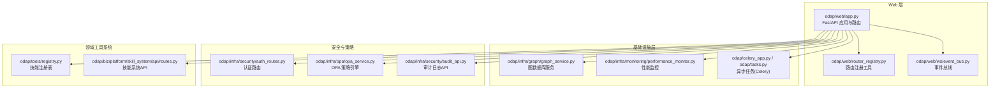

**图表来源**
- [odap/web/app.py:122-192](file://odap/web/app.py#L122-L192)
- [odap/web/router_registry.py:34-98](file://odap/web/router_registry.py#L34-L98)
- [odap/web/ws/event_bus.py:13-147](file://odap/web/ws/event_bus.py#L13-L147)
- [odap/infra/graph/graph_service.py:71-144](file://odap/infra/graph/graph_service.py#L71-L144)
- [odap/infra/monitoring/performance_monitor.py:12-184](file://odap/infra/monitoring/performance_monitor.py#L12-L184)
- [odap/celery_app.py:1-29](file://odap/celery_app.py#L1-L29)
- [odap/tasks.py:1-166](file://odap/tasks.py#L1-L166)
- [odap/infra/security/auth_routes.py:1-143](file://odap/infra/security/auth_routes.py#L1-L143)
- [odap/infra/opa/opa_service.py:455-717](file://odap/infra/opa/opa_service.py#L455-L717)
- [odap/infra/security/audit_api.py:1-487](file://odap/infra/security/audit_api.py#L1-L487)
- [odap/tools/registry.py:1-53](file://odap/tools/registry.py#L1-L53)
- [odap/biz/platform/skill_system/api/routes.py:1-185](file://odap/biz/platform/skill_system/api/routes.py#L1-L185)

**章节来源**
- [odap/web/app.py:122-192](file://odap/web/app.py#L122-L192)
- [odap/web/router_registry.py:34-98](file://odap/web/router_registry.py#L34-L98)

## 核心组件
- 应用入口与生命周期：FastAPI 应用创建、CORS、中间件注册、OpenHarness 初始化、健康检查端点、性能监控端点
- 路由注册：集中式路由注册工具，支持统一前缀与批量注册
- 中间件：全局异常处理、审计中间件（写操作审计）
- 基础设施：图数据库服务（三层降级：Graphiti → Neo4j Driver → NetworkX 回退）、性能监控装饰器
- 安全与策略：认证路由、OPA 权限检查（ABAC/RBAC/PBAC/CBAC）、策略热更新与沙箱
- 审计日志：统一审计通道、SQLite 存储、查询与统计 API
- 领域工具系统：技能注册表与技能系统 API（注册、加载、版本管理）
- 异步任务：Celery 配置与任务定义（数据摄入、图谱生成、文件上传）

**章节来源**
- [odap/web/app.py:68-127](file://odap/web/app.py#L68-L127)
- [odap/web/router_registry.py:10-32](file://odap/web/router_registry.py#L10-L32)
- [odap/infra/middleware/exception_handler.py:14-73](file://odap/infra/middleware/exception_handler.py#L14-L73)
- [odap/infra/middleware/audit_middleware.py:51-112](file://odap/infra/middleware/audit_middleware.py#L51-L112)
- [odap/infra/graph/graph_service.py:71-144](file://odap/infra/graph/graph_service.py#L71-L144)
- [odap/infra/monitoring/performance_monitor.py:14-184](file://odap/infra/monitoring/performance_monitor.py#L14-L184)
- [odap/infra/security/auth_routes.py:40-143](file://odap/infra/security/auth_routes.py#L40-L143)
- [odap/infra/opa/opa_service.py:455-717](file://odap/infra/opa/opa_service.py#L455-L717)
- [odap/infra/security/audit_api.py:120-487](file://odap/infra/security/audit_api.py#L120-L487)
- [odap/tools/registry.py:26-53](file://odap/tools/registry.py#L26-L53)
- [odap/biz/platform/skill_system/api/routes.py:14-185](file://odap/biz/platform/skill_system/api/routes.py#L14-L185)
- [odap/web/ws/event_bus.py:13-147](file://odap/web/ws/event_bus.py#L13-L147)
- [odap/celery_app.py:1-29](file://odap/celery_app.py#L1-L29)
- [odap/tasks.py:11-166](file://odap/tasks.py#L11-L166)

## 架构总览
后端以 FastAPI 为核心，通过中间件与路由模块化组织各子系统；基础设施层提供图数据库、性能监控与事件总线；安全与策略层集成认证与 OPA；工具系统提供技能注册与管理；异步任务通过 Celery 实现。

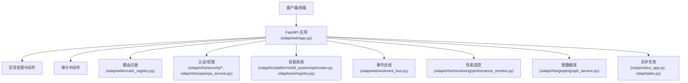

**图表来源**
- [odap/web/app.py:122-192](file://odap/web/app.py#L122-L192)
- [odap/web/router_registry.py:34-98](file://odap/web/router_registry.py#L34-L98)
- [odap/infra/middleware/exception_handler.py:14-73](file://odap/infra/middleware/exception_handler.py#L14-L73)
- [odap/infra/middleware/audit_middleware.py:51-112](file://odap/infra/middleware/audit_middleware.py#L51-L112)
- [odap/infra/security/auth_routes.py:40-143](file://odap/infra/security/auth_routes.py#L40-L143)
- [odap/infra/opa/opa_service.py:455-717](file://odap/infra/opa/opa_service.py#L455-L717)
- [odap/biz/platform/skill_system/api/routes.py:14-185](file://odap/biz/platform/skill_system/api/routes.py#L14-L185)
- [odap/tools/registry.py:26-53](file://odap/tools/registry.py#L26-L53)
- [odap/web/ws/event_bus.py:13-147](file://odap/web/ws/event_bus.py#L13-L147)
- [odap/infra/monitoring/performance_monitor.py:14-184](file://odap/infra/monitoring/performance_monitor.py#L14-L184)
- [odap/infra/graph/graph_service.py:71-144](file://odap/infra/graph/graph_service.py#L71-L144)
- [odap/celery_app.py:1-29](file://odap/celery_app.py#L1-L29)
- [odap/tasks.py:11-166](file://odap/tasks.py#L11-L166)

## 详细组件分析

### Web 应用与路由
- 应用创建：设置标题、描述、版本、生命周期钩子；CORS 配置；注册全局异常处理与审计中间件；批量 include 各模块路由
- 生命周期：启动时初始化 OpenHarness v1/v2，创建默认工作空间与场景
- 健康检查：返回 OpenHarness v1/v2、Graphiti、图数据库状态
- 性能监控端点：提供性能指标查询与重置

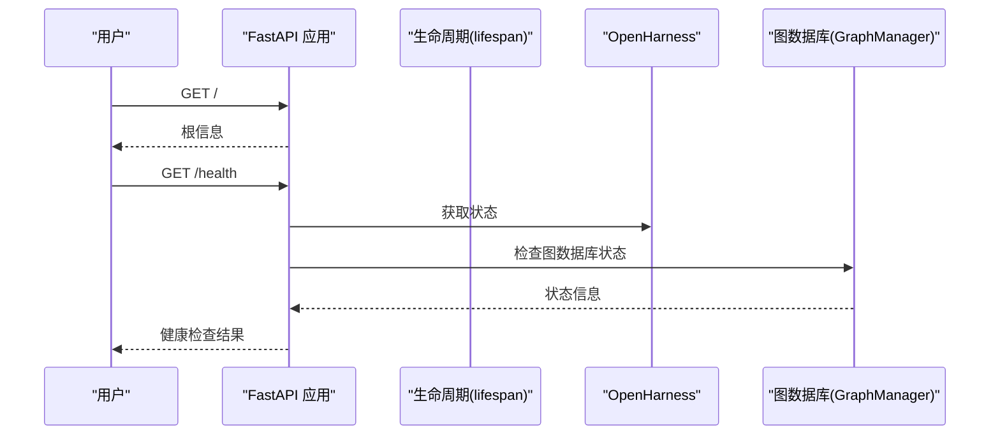

**图表来源**
- [odap/web/app.py:68-127](file://odap/web/app.py#L68-L127)
- [odap/web/app.py:221-242](file://odap/web/app.py#L221-L242)
- [odap/infra/graph/graph_service.py:71-144](file://odap/infra/graph/graph_service.py#L71-L144)

**章节来源**
- [odap/web/app.py:122-192](file://odap/web/app.py#L122-L192)
- [odap/web/app.py:221-262](file://odap/web/app.py#L221-L262)

### 路由注册工具
- 支持批量注册路由，可按模块统一前缀
- 默认注册表包含多个业务模块路由

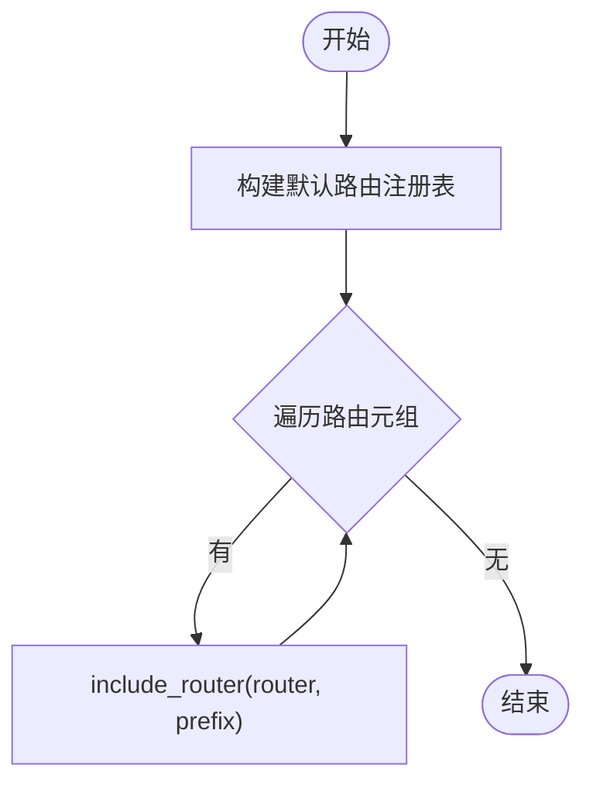

**图表来源**
- [odap/web/router_registry.py:34-98](file://odap/web/router_registry.py#L34-L98)

**章节来源**
- [odap/web/router_registry.py:10-32](file://odap/web/router_registry.py#L10-L32)
- [odap/web/router_registry.py:34-98](file://odap/web/router_registry.py#L34-L98)

### 中间件：异常处理与审计
- 全局异常处理中间件：捕获未处理异常，按类型映射为标准错误响应，记录请求 ID、路径与堆栈
- 审计中间件：对写操作（POST/PUT/DELETE/PATCH）记录审计事件，排除特定路径与前缀，提取用户信息并写入统一审计通道

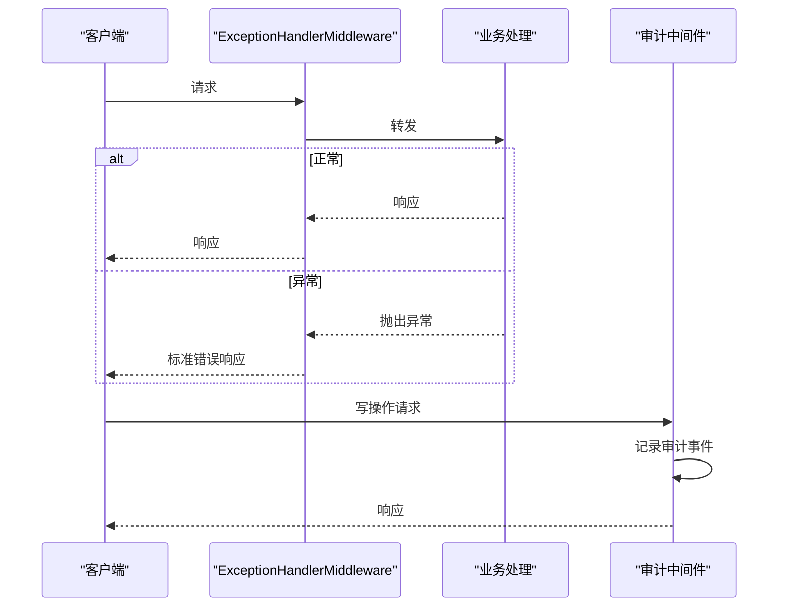

**图表来源**
- [odap/infra/middleware/exception_handler.py:14-73](file://odap/infra/middleware/exception_handler.py#L14-L73)
- [odap/infra/middleware/audit_middleware.py:51-112](file://odap/infra/middleware/audit_middleware.py#L51-L112)

**章节来源**
- [odap/infra/middleware/exception_handler.py:14-137](file://odap/infra/middleware/exception_handler.py#L14-L137)
- [odap/infra/middleware/audit_middleware.py:51-112](file://odap/infra/middleware/audit_middleware.py#L51-L112)

### 基础设施：图数据库服务
- 三层降级策略：Graphiti（双时态知识图谱）→ Neo4j Driver → NetworkX 回退
- 连接池与断路器：连接池大小、超时、空闲清理；失败阈值与恢复窗口
- 查询与更新：支持多模式查询、批量加载、迁移、性能指标统计
- LLM/Embedder 集成：可选的 LLM 客户端与嵌入器配置

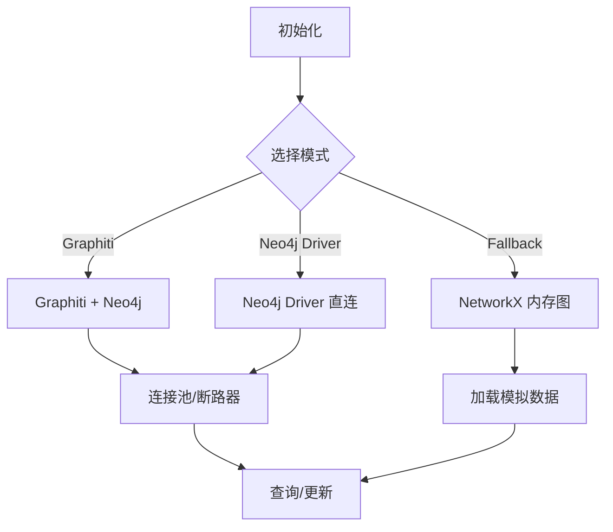

**图表来源**
- [odap/infra/graph/graph_service.py:145-185](file://odap/infra/graph/graph_service.py#L145-L185)
- [odap/infra/graph/graph_service.py:299-405](file://odap/infra/graph/graph_service.py#L299-L405)

**章节来源**
- [odap/infra/graph/graph_service.py:71-144](file://odap/infra/graph/graph_service.py#L71-L144)
- [odap/infra/graph/graph_service.py:299-405](file://odap/infra/graph/graph_service.py#L299-L405)
- [odap/infra/graph/graph_service.py:406-443](file://odap/infra/graph/graph_service.py#L406-L443)

### 安全与认证
- 认证路由：登录、刷新、用户管理（创建/更新/删除）、当前用户信息
- JWT 依赖：获取当前用户、管理员校验
- 审计日志 API：统一查询、时间线、追踪链、统计与导出

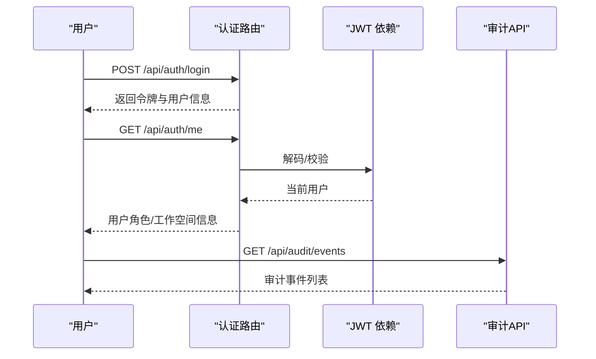

**图表来源**
- [odap/infra/security/auth_routes.py:40-143](file://odap/infra/security/auth_routes.py#L40-L143)
- [odap/infra/security/audit_api.py:120-209](file://odap/infra/security/audit_api.py#L120-L209)

**章节来源**
- [odap/infra/security/auth_routes.py:40-143](file://odap/infra/security/auth_routes.py#L40-L143)
- [odap/infra/security/audit_api.py:120-487](file://odap/infra/security/audit_api.py#L120-L487)

### OPA 策略引擎
- 支持 ABAC/RBAC/PBAC/CBAC 模型
- 策略热更新 Bundle、策略沙箱（What-If）、批量权限检查与缓存
- Mock 与真实 OPA Server 自动降级

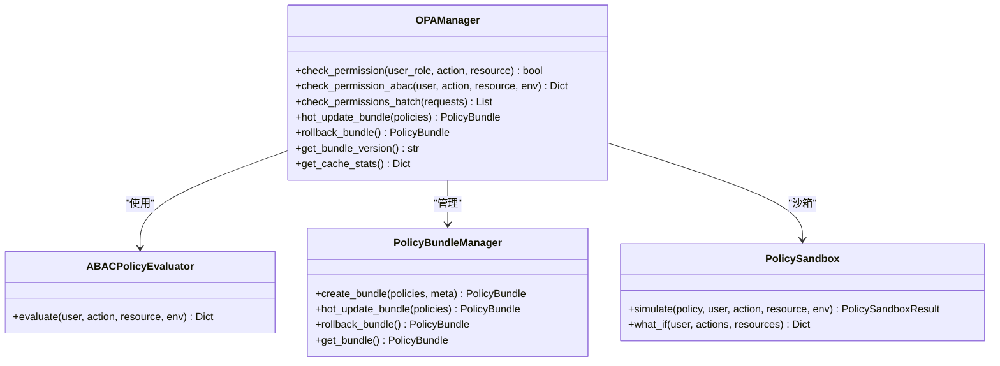

**图表来源**
- [odap/infra/opa/opa_service.py:455-717](file://odap/infra/opa/opa_service.py#L455-L717)
- [odap/infra/opa/opa_service.py:114-225](file://odap/infra/opa/opa_service.py#L114-L225)
- [odap/infra/opa/opa_service.py:227-314](file://odap/infra/opa/opa_service.py#L227-L314)
- [odap/infra/opa/opa_service.py:316-371](file://odap/infra/opa/opa_service.py#L316-L371)

**章节来源**
- [odap/infra/opa/opa_service.py:455-717](file://odap/infra/opa/opa_service.py#L455-L717)

### 审计日志
- 统一审计通道与 SQLite 存储
- 支持事件查询、时间线、追踪链、统计与导出
- 与审计中间件协同记录写操作

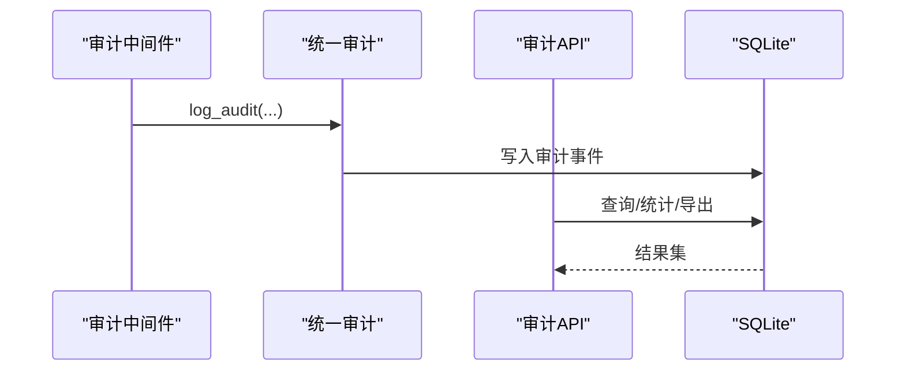

**图表来源**
- [odap/infra/middleware/audit_middleware.py:80-110](file://odap/infra/middleware/audit_middleware.py#L80-L110)
- [odap/infra/security/audit_api.py:120-209](file://odap/infra/security/audit_api.py#L120-L209)

**章节来源**
- [odap/infra/security/audit_api.py:120-487](file://odap/infra/security/audit_api.py#L120-L487)

### 领域工具系统与技能管理
- 技能注册表：支持旧接口与新接口双模式，保持同步
- 技能系统 API：注册、查询、版本管理、加载/卸载、激活/停用、目录同步

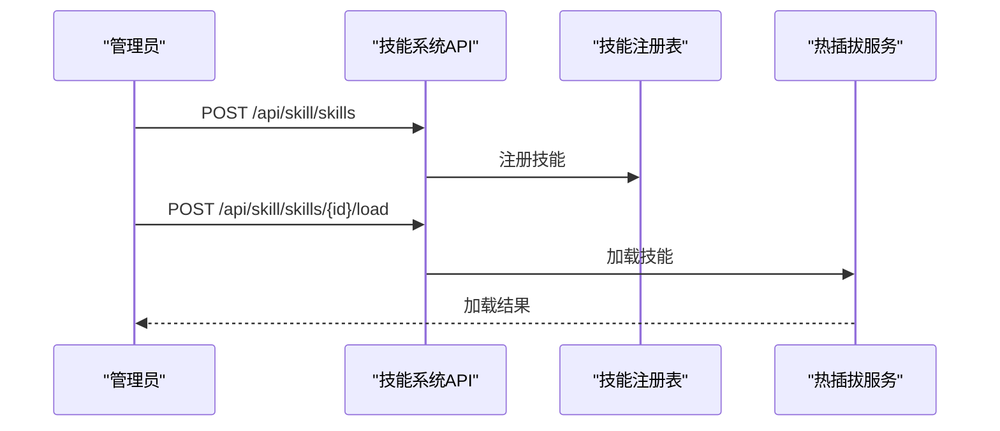

**图表来源**
- [odap/tools/registry.py:26-53](file://odap/tools/registry.py#L26-L53)
- [odap/biz/platform/skill_system/api/routes.py:14-185](file://odap/biz/platform/skill_system/api/routes.py#L14-L185)

**章节来源**
- [odap/tools/registry.py:26-53](file://odap/tools/registry.py#L26-L53)
- [odap/biz/platform/skill_system/api/routes.py:14-185](file://odap/biz/platform/skill_system/api/routes.py#L14-L185)

### 事件总线（WebSocket）
- 支持多工作空间订阅、事件广播、历史事件缓存
- 预定义事件类型：实体变更、情报更新、行动结果、OADP 进度、OPA 检查、审计事件

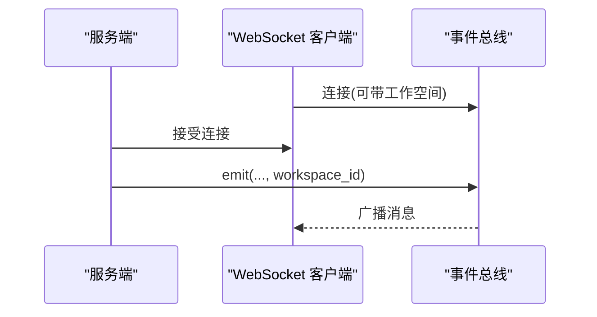

**图表来源**
- [odap/web/ws/event_bus.py:13-147](file://odap/web/ws/event_bus.py#L13-L147)

**章节来源**
- [odap/web/ws/event_bus.py:13-147](file://odap/web/ws/event_bus.py#L13-L147)

### 异步任务处理（Celery）
- Celery 配置：Redis 作为 broker/backend，序列化与时区设置
- 任务定义：数据摄入、图谱生成、文件上传，含错误处理与存储

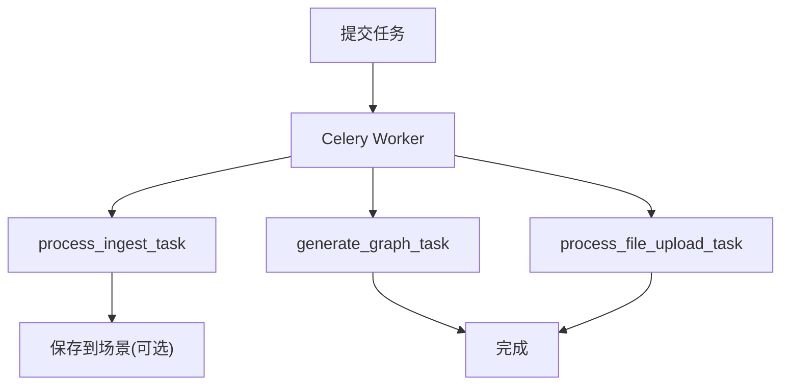

**图表来源**
- [odap/celery_app.py:11-29](file://odap/celery_app.py#L11-L29)
- [odap/tasks.py:11-166](file://odap/tasks.py#L11-L166)

**章节来源**
- [odap/celery_app.py:1-29](file://odap/celery_app.py#L1-L29)
- [odap/tasks.py:11-166](file://odap/tasks.py#L11-L166)

## 依赖分析
- 组件耦合：Web 应用聚合中间件、路由、安全、策略、工具、事件总线与监控；基础设施层对图数据库与性能监控有直接依赖
- 外部依赖：FastAPI、Starlette、Celery、Redis、Neo4j、OPA Server、SQLite
- 潜在风险：图数据库降级路径、OPA Server 可用性、审计日志 SQLite 写入性能

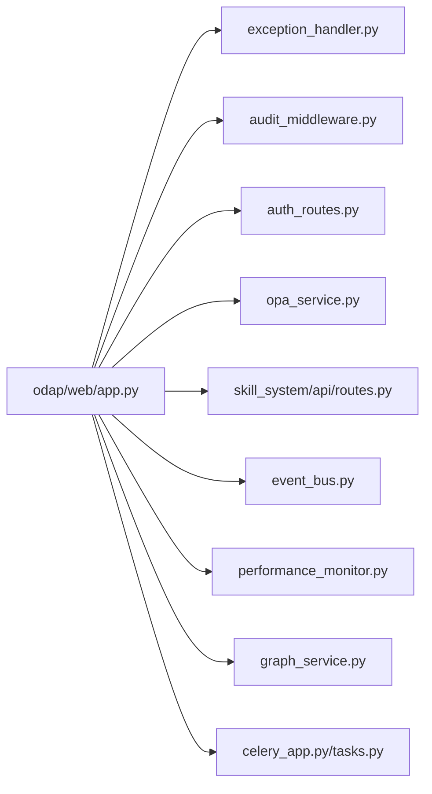

**图表来源**
- [odap/web/app.py:122-192](file://odap/web/app.py#L122-L192)
- [odap/infra/middleware/exception_handler.py:14-73](file://odap/infra/middleware/exception_handler.py#L14-L73)
- [odap/infra/middleware/audit_middleware.py:51-112](file://odap/infra/middleware/audit_middleware.py#L51-L112)
- [odap/infra/security/auth_routes.py:40-143](file://odap/infra/security/auth_routes.py#L40-L143)
- [odap/infra/opa/opa_service.py:455-717](file://odap/infra/opa/opa_service.py#L455-L717)
- [odap/biz/platform/skill_system/api/routes.py:14-185](file://odap/biz/platform/skill_system/api/routes.py#L14-L185)
- [odap/web/ws/event_bus.py:13-147](file://odap/web/ws/event_bus.py#L13-L147)
- [odap/infra/monitoring/performance_monitor.py:14-184](file://odap/infra/monitoring/performance_monitor.py#L14-L184)
- [odap/infra/graph/graph_service.py:71-144](file://odap/infra/graph/graph_service.py#L71-L144)
- [odap/celery_app.py:1-29](file://odap/celery_app.py#L1-L29)
- [odap/tasks.py:11-166](file://odap/tasks.py#L11-L166)

**章节来源**
- [odap/web/app.py:122-192](file://odap/web/app.py#L122-L192)

## 性能考虑
- 性能监控：装饰器与指标队列，支持 LLM 调用、数据库查询、API 请求、工具执行的统计
- 图数据库：连接池与断路器，批量加载与迁移，查询时间与缓存命中率统计
- 异步任务：Redis broker，任务序列化与 UTC 时区，错误回退与结果持久化
- 建议：合理设置连接池大小与超时、开启缓存与批量操作、监控 P95/P99 延迟、定期重置性能指标

**章节来源**
- [odap/infra/monitoring/performance_monitor.py:12-184](file://odap/infra/monitoring/performance_monitor.py#L12-L184)
- [odap/infra/graph/graph_service.py:299-405](file://odap/infra/graph/graph_service.py#L299-L405)
- [odap/celery_app.py:19-26](file://odap/celery_app.py#L19-L26)

## 故障排查指南
- 全局异常：确认异常中间件已注册，查看请求 ID 与堆栈；区分验证错误、权限错误与服务器错误
- 审计问题：确认审计中间件未排除路径，检查统一审计通道写入；使用审计 API 查询与追踪
- 图数据库：关注降级模式切换、连接池耗尽与断路器打开；检查 Neo4j 可达性与批量加载失败
- OPA 策略：优先使用 Mock 模式定位问题，再切换到真实 OPA Server；检查策略热更新与缓存
- 技能系统：核对注册表同步、版本激活状态、热插拔加载状态
- 事件总线：检查客户端连接、工作空间订阅、广播失败集合

**章节来源**
- [odap/infra/middleware/exception_handler.py:14-137](file://odap/infra/middleware/exception_handler.py#L14-L137)
- [odap/infra/middleware/audit_middleware.py:51-112](file://odap/infra/middleware/audit_middleware.py#L51-L112)
- [odap/infra/graph/graph_service.py:145-185](file://odap/infra/graph/graph_service.py#L145-L185)
- [odap/infra/opa/opa_service.py:455-717](file://odap/infra/opa/opa_service.py#L455-L717)
- [odap/biz/platform/skill_system/api/routes.py:14-185](file://odap/biz/platform/skill_system/api/routes.py#L14-L185)
- [odap/web/ws/event_bus.py:114-147](file://odap/web/ws/event_bus.py#L114-L147)

## 结论
本后端服务以 FastAPI 为核心，结合多层基础设施与领域工具系统，提供了完整的图谱驱动智能平台能力。通过三层图数据库降级、OPA 策略引擎、统一审计与性能监控，以及 Celery 异步任务，满足高可用、可扩展与可观测性的工程需求。建议在生产环境中强化 OPA 与图数据库的高可用部署、完善监控告警与容量规划，并持续优化批量操作与缓存策略。

## 附录
- 应用入口与演示：支持命令行参数启动 Web 模拟器，提供 Swagger 文档与 WebSocket 事件流
- API 设计规范：统一前缀、错误响应格式、鉴权头（Authorization）、请求 ID（X-Request-ID）
- 部署建议：容器编排、Redis 与 Neo4j 集群、OPA 服务可用性探测、审计日志落盘与轮转

**章节来源**
- [main.py:208-255](file://main.py#L208-L255)
- [odap/web/app.py:129-140](file://odap/web/app.py#L129-L140)
- [odap/web/app.py:193-219](file://odap/web/app.py#L193-L219)