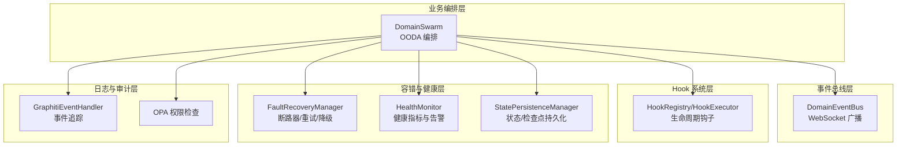
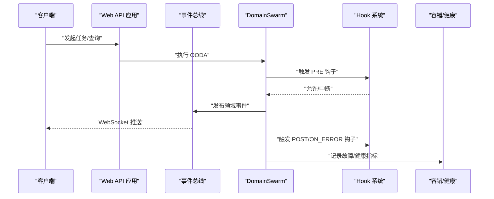
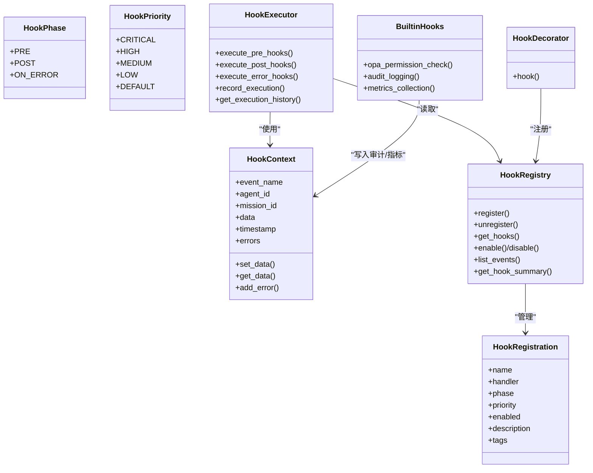
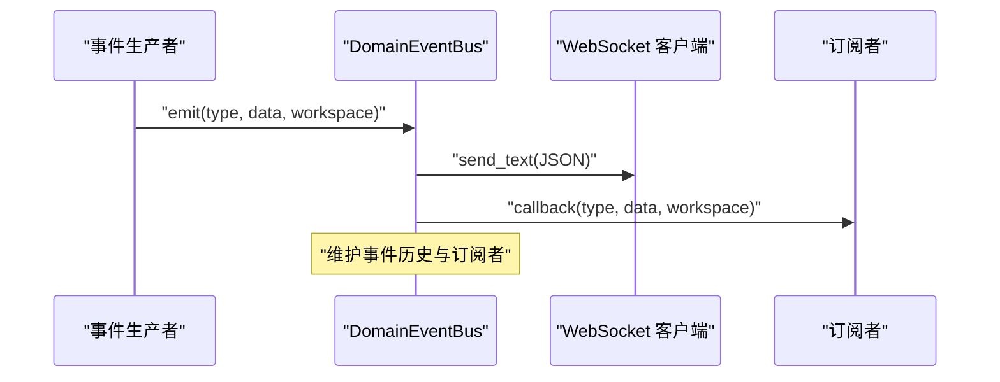
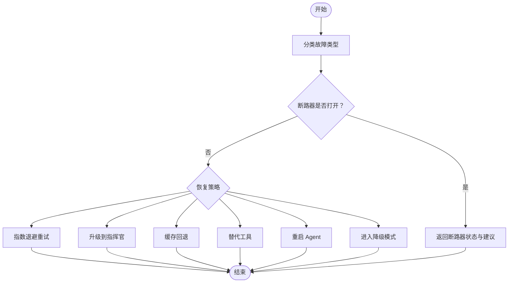
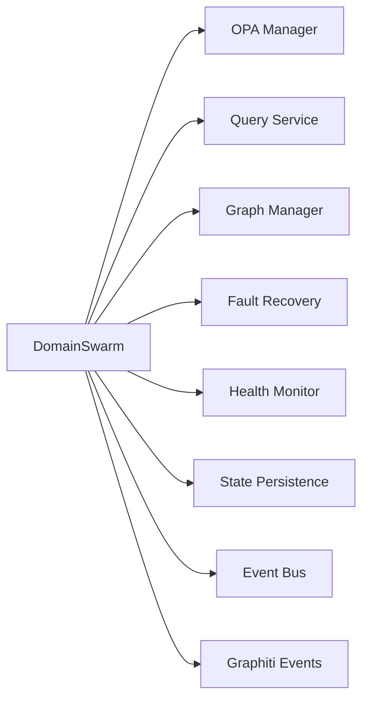

# 事件驱动架构

<cite>
**本文引用的文件**
- [odap/infra/events/hook_system.py](file://odap/infra/events/hook_system.py)
- [odap/web/ws/event_bus.py](file://odap/web/ws/event_bus.py)
- [odap/infra/resilience/fault_tolerance.py](file://odap/infra/resilience/fault_tolerance.py)
- [odap/infra/resilience/health_monitor.py](file://odap/infra/resilience/health_monitor.py)
- [odap/infra/resilience/state_persistence.py](file://odap/infra/resilience/state_persistence.py)
- [odap/biz/core/agent/swarm_orchestrator.py](file://odap/biz/core/agent/swarm_orchestrator.py)
- [odap/infra/logging/graphiti_events.py](file://odap/infra/logging/graphiti_events.py)
- [odap/infra/opa/opa_service.py](file://odap/infra/opa/opa_service.py)
- [odap/web/api/app.py](file://odap/web/api/app.py)
- [tests/unit/test_hook_system.py](file://tests/unit/test_hook_system.py)
- [tests/unit/test_event_simulator.py](file://tests/unit/test_event_simulator.py)
</cite>

## 目录
1. [引言](#引言)
2. [项目结构](#项目结构)
3. [核心组件](#核心组件)
4. [架构总览](#架构总览)
5. [详细组件分析](#详细组件分析)
6. [依赖分析](#依赖分析)
7. [性能考虑](#性能考虑)
8. [故障排查指南](#故障排查指南)
9. [结论](#结论)
10. [附录](#附录)

## 引言
本文件面向 ODAP 事件驱动架构，系统性阐述 Hook 系统、事件总线、容错机制、事件序列化与传输、以及事件驱动模式的最佳实践。内容覆盖从代码结构到运行时行为、从异步处理到降级策略，帮助开发者与运维人员快速理解并高效使用该架构。

## 项目结构
ODAP 将事件驱动能力分布在以下层次：
- 事件总线层：通过 WebSocket 广播领域事件，支持按工作区隔离与订阅回调。
- Hook 系统层：在 Agent 生命周期关键节点注入拦截、增强与监控逻辑，支持同步/异步、优先级与开关控制。
- 容错与健康层：故障检测、断路器、降级、重试与健康监控，保障系统韧性。
- 日志与审计层：结构化日志与事件追踪，确保可观测性与合规。
- 业务编排层：Swarm 编排器驱动 OODA 循环，串联各 Agent 并产生事件。

**图表来源**
- [odap/web/ws/event_bus.py:13-147](file://odap/web/ws/event_bus.py#L13-L147)
- [odap/infra/events/hook_system.py:68-428](file://odap/infra/events/hook_system.py#L68-L428)
- [odap/infra/resilience/fault_tolerance.py:41-309](file://odap/infra/resilience/fault_tolerance.py#L41-L309)
- [odap/infra/resilience/health_monitor.py:28-216](file://odap/infra/resilience/health_monitor.py#L28-L216)
- [odap/infra/resilience/state_persistence.py:21-187](file://odap/infra/resilience/state_persistence.py#L21-L187)
- [odap/infra/logging/graphiti_events.py:77-282](file://odap/infra/logging/graphiti_events.py#L77-L282)
- [odap/infra/opa/opa_service.py:455-750](file://odap/infra/opa/opa_service.py#L455-L750)
- [odap/biz/core/agent/swarm_orchestrator.py:288-687](file://odap/biz/core/agent/swarm_orchestrator.py#L288-L687)

**章节来源**
- [odap/web/ws/event_bus.py:13-147](file://odap/web/ws/event_bus.py#L13-L147)
- [odap/infra/events/hook_system.py:68-428](file://odap/infra/events/hook_system.py#L68-L428)
- [odap/infra/resilience/fault_tolerance.py:41-309](file://odap/infra/resilience/fault_tolerance.py#L41-L309)
- [odap/infra/resilience/health_monitor.py:28-216](file://odap/infra/resilience/health_monitor.py#L28-L216)
- [odap/infra/resilience/state_persistence.py:21-187](file://odap/infra/resilience/state_persistence.py#L21-L187)
- [odap/infra/logging/graphiti_events.py:77-282](file://odap/infra/logging/graphiti_events.py#L77-L282)
- [odap/infra/opa/opa_service.py:455-750](file://odap/infra/opa/opa_service.py#L455-L750)
- [odap/biz/core/agent/swarm_orchestrator.py:288-687](file://odap/biz/core/agent/swarm_orchestrator.py#L288-L687)

## 核心组件
- Hook 系统：提供生命周期钩子注册、执行与上下文管理，支持预处理、后处理与错误处理三阶段，具备优先级与开关控制。
- 事件总线：基于 FastAPI WebSocket 的领域事件总线，支持按工作区广播、订阅回调、事件历史与统计。
- 容错与健康：断路器、指数退避重试、降级模式、健康指标与告警，保障系统稳定性。
- 日志与审计：结构化日志与 Graphiti 事件追踪，支持实体/关系变更、快照、版本等事件。
- 权限与安全：OPA 权限检查与策略沙箱，支持批量检查与缓存。
- 业务编排：DomainSwarm 驱动 OODA 循环，贯穿事件产生与传播。

**章节来源**
- [odap/infra/events/hook_system.py:19-428](file://odap/infra/events/hook_system.py#L19-L428)
- [odap/web/ws/event_bus.py:13-147](file://odap/web/ws/event_bus.py#L13-L147)
- [odap/infra/resilience/fault_tolerance.py:41-309](file://odap/infra/resilience/fault_tolerance.py#L41-L309)
- [odap/infra/resilience/health_monitor.py:28-216](file://odap/infra/resilience/health_monitor.py#L28-L216)
- [odap/infra/logging/graphiti_events.py:77-282](file://odap/infra/logging/graphiti_events.py#L77-L282)
- [odap/infra/opa/opa_service.py:455-750](file://odap/infra/opa/opa_service.py#L455-L750)
- [odap/biz/core/agent/swarm_orchestrator.py:288-687](file://odap/biz/core/agent/swarm_orchestrator.py#L288-L687)

## 架构总览
ODAP 采用“编排器驱动 + 事件总线 + Hook 拦截 + 容错健康”的事件驱动架构。Swarm 编排器在 OODA 各阶段产生事件，事件总线负责广播；Hook 系统在关键节点注入横切逻辑；容错与健康模块保障系统鲁棒性；日志与审计贯穿全链路。

**图表来源**
- [odap/web/api/app.py:808-862](file://odap/web/api/app.py#L808-L862)
- [odap/web/ws/event_bus.py:34-86](file://odap/web/ws/event_bus.py#L34-L86)
- [odap/biz/core/agent/swarm_orchestrator.py:379-613](file://odap/biz/core/agent/swarm_orchestrator.py#L379-L613)
- [odap/infra/events/hook_system.py:171-241](file://odap/infra/events/hook_system.py#L171-L241)
- [odap/infra/resilience/fault_tolerance.py:69-100](file://odap/infra/resilience/fault_tolerance.py#L69-L100)

## 详细组件分析

### Hook 系统：生命周期钩子、拦截与异步处理
- 设计要点
  - 阶段划分：PRE（预处理）、POST（后处理）、ON_ERROR（错误处理）。
  - 优先级：CRITICAL/HIGH/MEDIUM/LOW/DEFAULT，数值越小优先级越高。
  - 上下文：HookContext 提供事件名、时间戳、错误列表与任意数据存储。
  - 注册表：支持启用/禁用、查询、统计与摘要。
  - 执行器：异步/同步兼容，支持协程结果等待与错误收集。
  - 内置钩子：审计日志、计时、OPA 权限检查等。
- 关键流程
  - 装饰器自动注册：根据目标函数是否协程选择异步包装器。
  - 预处理阶段：按优先级顺序执行，任一返回 False 中断后续执行。
  - 错误阶段：捕获异常并执行错误钩子，不改变异常传播。
  - 执行历史：记录钩子执行结果，限制历史长度。

**图表来源**
- [odap/infra/events/hook_system.py:19-428](file://odap/infra/events/hook_system.py#L19-L428)

**章节来源**
- [odap/infra/events/hook_system.py:19-428](file://odap/infra/events/hook_system.py#L19-L428)

### 事件总线：消息路由、订阅管理与事件传播
- 设计要点
  - WebSocket 连接：接受/断开、心跳与清理失效连接。
  - 路由策略：支持全局广播与按工作区隔离广播。
  - 订阅管理：事件类型到回调列表映射，支持同步/异步回调。
  - 事件历史：维护固定长度的历史队列，便于回放与诊断。
  - 事件类型：实体变更、情报更新、动作结果、进度事件、OPA 检查、审计事件等。
- 传播策略
  - 广播：向目标集合发送 JSON 文本消息。
  - 回调：逐个调用订阅者，异常不扩散至其他订阅者。
  - 统计：提供客户端数量、事件类型、历史大小等指标。

**图表来源**
- [odap/web/ws/event_bus.py:34-86](file://odap/web/ws/event_bus.py#L34-L86)
- [odap/web/ws/event_bus.py:114-139](file://odap/web/ws/event_bus.py#L114-L139)

**章节来源**
- [odap/web/ws/event_bus.py:13-147](file://odap/web/ws/event_bus.py#L13-L147)

### 容错机制：故障检测、重试与降级
- 故障分类：超时、权限拒绝、图数据库不可用、网络错误、工具执行错误、意外异常。
- 断路器：基于失败次数与时间窗口，支持半开探测与重置。
- 重试策略：指数退避，超过最大次数触发断路器或降级。
- 降级模式：按 Agent 类型进入只读缓存、手动操作、规则化指挥官等模式。
- 状态持久化：Agent 状态与任务检查点的 JSON/PKL 双格式持久化，支持恢复。

**图表来源**
- [odap/infra/resilience/fault_tolerance.py:69-277](file://odap/infra/resilience/fault_tolerance.py#L69-L277)
- [odap/infra/resilience/state_persistence.py:38-135](file://odap/infra/resilience/state_persistence.py#L38-L135)

**章节来源**
- [odap/infra/resilience/fault_tolerance.py:41-309](file://odap/infra/resilience/fault_tolerance.py#L41-L309)
- [odap/infra/resilience/state_persistence.py:21-187](file://odap/infra/resilience/state_persistence.py#L21-L187)

### 事件序列化与传输：消息格式与一致性
- WebSocket 消息格式
  - 字段：type、data、workspace_id、timestamp。
  - 编码：JSON，非 ASCII 使用默认字符串表示。
- 事件类型
  - 实体变更、情报更新、动作结果、进度事件、OPA 检查、审计事件等。
- 一致性保障
  - 时间戳：UTC，便于跨系统对齐。
  - 历史保留：固定长度队列，避免内存膨胀。
  - 订阅者回调：异常隔离，不影响其他订阅者。

**章节来源**
- [odap/web/ws/event_bus.py:34-86](file://odap/web/ws/event_bus.py#L34-L86)
- [odap/web/ws/event_bus.py:114-139](file://odap/web/ws/event_bus.py#L114-L139)

### 权限与安全：OPA 集成与策略沙箱
- ABAC 策略评估：角色、属性、资源、环境约束。
- 策略热更新：Bundle 管理器支持版本化与回滚。
- 策略沙箱：What-If 分析与策略模拟，保障策略演进安全。
- 批量检查与缓存：提升高并发场景下的响应性能。

**章节来源**
- [odap/infra/opa/opa_service.py:455-750](file://odap/infra/opa/opa_service.py#L455-L750)

### 日志与审计：事件追踪与结构化日志
- Graphiti 事件：实体创建/更新/删除、关系变更、快照、版本等。
- 结构化日志：统一字段、来源标记、追踪 ID、跨度 ID。
- 事件处理器：异步队列处理，支持注册/注销处理器与后台工作线程。

**章节来源**
- [odap/infra/logging/graphiti_events.py:77-282](file://odap/infra/logging/graphiti_events.py#L77-L282)

### 业务编排：Swarm 与 OODA 事件
- OODA 阶段：Observe、Orient、Decide、Act。
- 事件产生：情报更新、动作结果、进度事件、审计事件。
- 持久化：任务检查点与 Agent 状态定期保存，支持恢复。

**章节来源**
- [odap/biz/core/agent/swarm_orchestrator.py:288-687](file://odap/biz/core/agent/swarm_orchestrator.py#L288-L687)

## 依赖分析
- 组件耦合
  - DomainSwarm 依赖 OPA、查询服务、图管理、容错、健康、状态持久化。
  - Hook 系统独立于业务，通过注册表与执行器与业务解耦。
  - 事件总线仅依赖 WebSocket 与 JSON，与业务解耦。
- 外部依赖
  - OPA 服务器（可降级到本地评估）。
  - 图数据库（Graphiti）连接与回退策略。
  - WebSocket 服务器（FastAPI）。

**图表来源**
- [odap/biz/core/agent/swarm_orchestrator.py:288-307](file://odap/biz/core/agent/swarm_orchestrator.py#L288-L307)

**章节来源**
- [odap/biz/core/agent/swarm_orchestrator.py:288-307](file://odap/biz/core/agent/swarm_orchestrator.py#L288-L307)

## 性能考虑
- Hook 执行
  - 优先级排序与短路中断减少无效调用。
  - 异步钩子避免阻塞主流程。
- 事件总线
  - 按工作区隔离广播，降低广播风暴。
  - 事件历史限制长度，避免内存增长。
- 容错
  - 指数退避与断路器防止雪崩效应。
  - 降级模式保障基本功能可用。
- 日志与审计
  - 异步事件处理与结构化日志减少 IO 延迟。
- 权限检查
  - 批量检查与缓存显著降低 OPA 调用频次。

[本节为通用指导，无需特定文件引用]

## 故障排查指南
- Hook 相关
  - 检查钩子注册与优先级，确认 PRE 阶段未返回中断。
  - 查看执行历史与错误列表，定位失败钩子。
  - 参考单元测试中的签名验证与沙箱安全校验。
- 事件总线
  - 检查 WebSocket 连接状态与心跳，确认广播成功。
  - 查看订阅者回调异常日志，避免影响其他订阅者。
- 容错与健康
  - 断路器状态与剩余重试时间，必要时手动降级。
  - 健康报告与告警，关注关键阈值。
- 权限与安全
  - OPA 服务可用性与策略版本，必要时回滚 Bundle。
  - 批量检查结果与缓存命中率。
- 事件模拟
  - 模板创建、事件生成与触发器配置，核对时间控制与触发条件。

**章节来源**
- [tests/unit/test_hook_system.py:22-530](file://tests/unit/test_hook_system.py#L22-L530)
- [tests/unit/test_event_simulator.py:13-206](file://tests/unit/test_event_simulator.py#L13-L206)
- [odap/infra/resilience/health_monitor.py:157-216](file://odap/infra/resilience/health_monitor.py#L157-L216)
- [odap/infra/resilience/fault_tolerance.py:265-277](file://odap/infra/resilience/fault_tolerance.py#L265-L277)

## 结论
ODAP 事件驱动架构通过 Hook 系统实现横切增强，借助事件总线实现解耦传播，结合容错与健康模块保障系统韧性，并以日志与权限体系确保可观测与安全。该架构适合复杂业务编排与实时交互场景，建议在生产中配合完善的监控与演练机制。

[本节为总结性内容，无需特定文件引用]

## 附录

### 事件驱动最佳实践
- 事件设计
  - 事件类型命名清晰、幂等、可追溯。
  - 数据最小化，携带必要上下文与追踪信息。
- Hook 设计
  - 预处理阶段做输入校验与权限检查，避免昂贵操作。
  - 后处理阶段做审计与指标收集，尽量无副作用。
  - 错误处理阶段仅做降级与上报，不吞掉异常。
- 异步与并发
  - 优先使用异步钩子与事件处理，避免阻塞主线程。
  - 控制并发度，防止资源争用。
- 容错与降级
  - 明确断路器阈值与重试策略，设置合理的降级路径。
  - 对关键路径进行压力测试与混沌工程演练。
- 调试与可观测
  - 为每个事件附加 trace_id/spa_id，便于链路追踪。
  - 使用结构化日志与事件总线双通道记录。

[本节为通用指导，无需特定文件引用]

### 实际事件处理示例（步骤说明）
- 通过 Web API 建立 WebSocket 连接，订阅事件类型。
- 调用业务接口触发 OODA 循环，观察事件总线推送。
- 在 Hook 系统中注册审计与计时钩子，查看执行历史。
- 触发断路器场景，观察降级模式与健康报告。
- 使用事件模拟器生成模板与事件，验证触发器与时间控制。

**章节来源**
- [odap/web/api/app.py:808-862](file://odap/web/api/app.py#L808-L862)
- [odap/web/ws/event_bus.py:34-86](file://odap/web/ws/event_bus.py#L34-L86)
- [odap/infra/events/hook_system.py:397-428](file://odap/infra/events/hook_system.py#L397-L428)
- [odap/infra/resilience/fault_tolerance.py:236-277](file://odap/infra/resilience/fault_tolerance.py#L236-L277)
- [tests/unit/test_event_simulator.py:160-206](file://tests/unit/test_event_simulator.py#L160-L206)