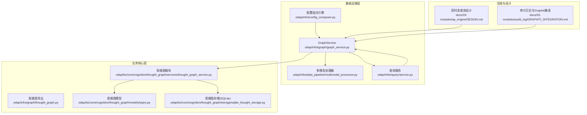
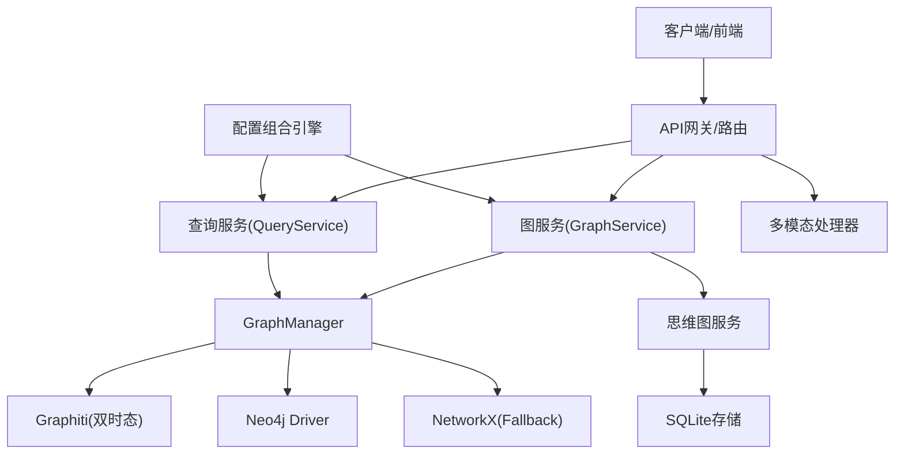
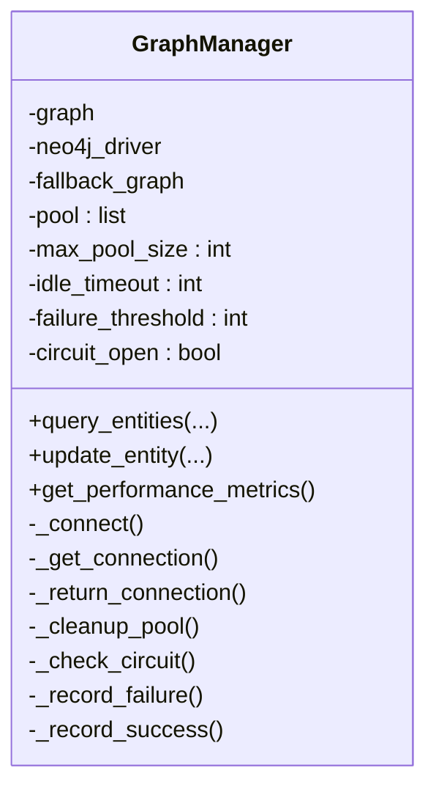
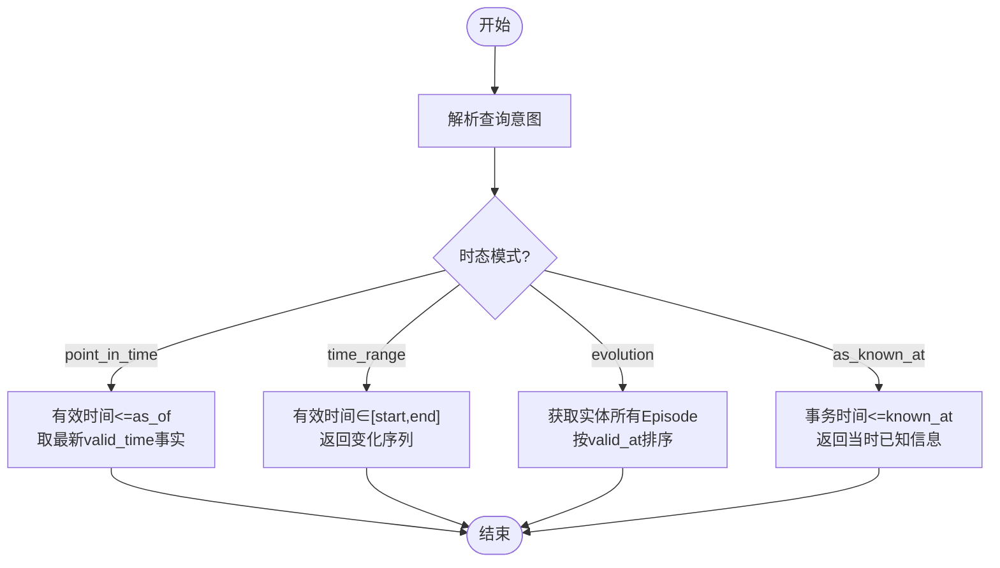
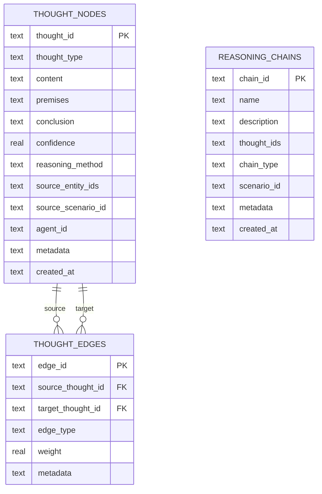
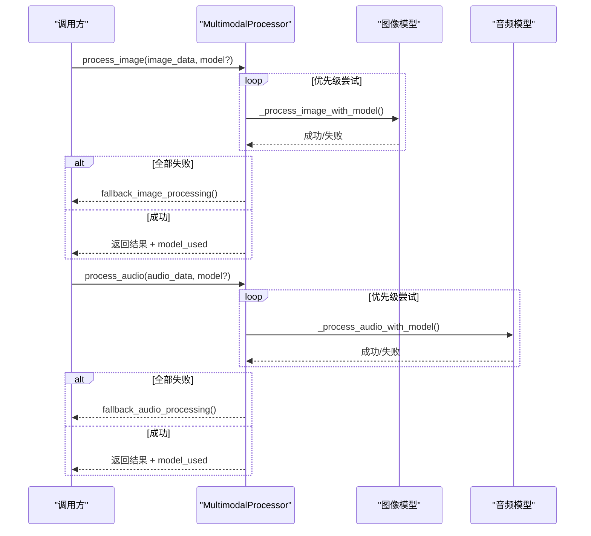
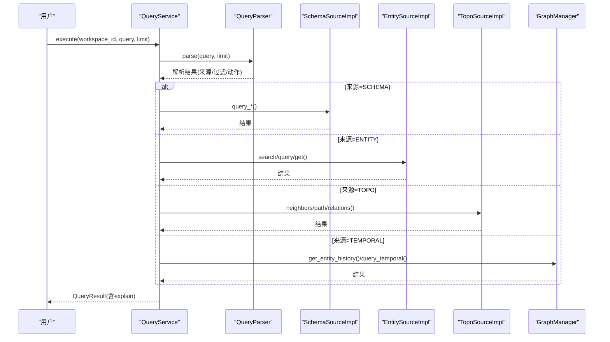
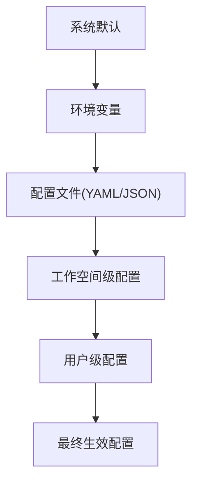
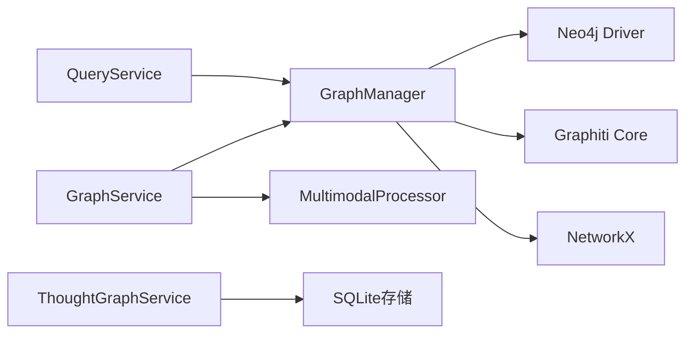

# 图数据库服务

<cite>
**本文引用的文件**
- [graph_service.py](file://odap/infra/graph/graph_service.py)
- [thought_graph.py](file://odap/infra/graph/thought_graph.py)
- [multimodal_processor.py](file://odap/infra/data_pipeline/multimodal_processor.py)
- [service.py](file://odap/infra/query/service.py)
- [thought_graph_service.py](file://odap/biz/core/cognition/thought_graph/services/thought_graph_service.py)
- [types.py](file://odap/biz/core/cognition/thought_graph/models/types.py)
- [sqlite_thought_storage.py](file://odap/biz/core/cognition/thought_graph/storage/sqlite_thought_storage.py)
- [config_composer.py](file://odap/infra/config_composer.py)
- [GRAPHITI_INTEGRATION.md](file://docs/03-modules/audit_log/GRAPHITI_INTEGRATION.md)
- [ARCHITECTURE_FULL_CHAIN_DEEP.md](file://docs/03-modules/qa_engine/DESIGN.md)
</cite>

## 目录
1. [简介](#简介)
2. [项目结构](#项目结构)
3. [核心组件](#核心组件)
4. [架构总览](#架构总览)
5. [详细组件分析](#详细组件分析)
6. [依赖分析](#依赖分析)
7. [性能考虑](#性能考虑)
8. [故障排查指南](#故障排查指南)
9. [结论](#结论)
10. [附录](#附录)

## 简介
本技术文档围绕 ODAP 图数据库服务展开，重点阐释 GraphService 的核心架构与实现细节，包括：
- 图管理器(GraphManager)的三层降级策略与连接池管理
- 双时态知识图谱(Graphiti)的时序查询能力与索引约束
- 思维图(ThoughtGraph)的数据模型与存储方案
- 多模态数据处理器的流水线集成与容错策略
- 查询服务(QueryService)的统一入口与多源路由
- 配置组合引擎(ConfigurationComposer)的分层配置与校验
- 性能调优、故障排查与最佳实践

## 项目结构
本项目采用“模块化+分层”的组织方式，图数据库相关能力主要分布在以下模块：
- odap/infra/graph：图服务与思维图导出入口
- odap/infra/query：统一查询服务与解析器
- odap/infra/data_pipeline：多模态处理器
- odap/biz/core/cognition/thought_graph：思维图数据模型与存储
- odap/infra/config_composer：配置组合与校验
- docs：架构与设计文档，包含双时态查询与性能优化要点

**图表来源**
- [graph_service.py:1-200](file://odap/infra/graph/graph_service.py#L1-L200)
- [multimodal_processor.py:1-125](file://odap/infra/data_pipeline/multimodal_processor.py#L1-L125)
- [service.py:1-126](file://odap/infra/query/service.py#L1-L126)
- [thought_graph.py:1-10](file://odap/infra/graph/thought_graph.py#L1-L10)
- [thought_graph_service.py:1-38](file://odap/biz/core/cognition/thought_graph/services/thought_graph_service.py#L1-L38)
- [types.py:1-51](file://odap/biz/core/cognition/thought_graph/models/types.py#L1-L51)
- [sqlite_thought_storage.py:1-220](file://odap/biz/core/cognition/thought_graph/storage/sqlite_thought_storage.py#L1-L220)
- [config_composer.py:1-260](file://odap/infra/config_composer.py#L1-L260)
- [GRAPHITI_INTEGRATION.md:27-112](file://docs/03-modules/audit_log/GRAPHITI_INTEGRATION.md#L27-L112)
- [ARCHITECTURE_FULL_CHAIN_DEEP.md:551-615](file://docs/03-modules/qa_engine/DESIGN.md#L551-L615)

**章节来源**
- [graph_service.py:1-200](file://odap/infra/graph/graph_service.py#L1-L200)
- [config_composer.py:1-260](file://odap/infra/config_composer.py#L1-L260)

## 核心组件
- 图管理器(GraphManager)：负责三层降级连接（Graphiti → Neo4j Driver → NetworkX fallback）、连接池与断路器、性能监控、实体查询/更新等。
- 思维图(ThoughtGraph)：以 ThoughtNode/ReasoningChain 为核心数据模型，使用 SQLite 存储，提供思维链与推理链管理。
- 多模态处理器(MultimodalProcessor)：图像/音频处理的优先级与容错策略，支持多种模型适配。
- 查询服务(QueryService)：统一解析用户查询，路由到 Schema/Entity/Topo/Temporal 等不同数据源。
- 配置组合引擎(ConfigurationComposer)：系统默认 → 环境变量 → 配置文件 → 工作空间 → 用户，五层优先级。

**章节来源**
- [graph_service.py:71-144](file://odap/infra/graph/graph_service.py#L71-L144)
- [sqlite_thought_storage.py:10-61](file://odap/biz/core/cognition/thought_graph/storage/sqlite_thought_storage.py#L10-L61)
- [multimodal_processor.py:19-55](file://odap/infra/data_pipeline/multimodal_processor.py#L19-L55)
- [service.py:11-71](file://odap/infra/query/service.py#L11-L71)
- [config_composer.py:74-185](file://odap/infra/config_composer.py#L74-L185)

## 架构总览
下图展示了 GraphService 在系统中的位置与交互关系，以及与思维图、查询服务、多模态处理器、配置引擎的协作。

**图表来源**
- [graph_service.py:145-213](file://odap/infra/graph/graph_service.py#L145-L213)
- [service.py:33-59](file://odap/infra/query/service.py#L33-L59)
- [config_composer.py:163-185](file://odap/infra/config_composer.py#L163-L185)

## 详细组件分析

### 图管理器(GraphManager)与连接池
- 三层降级策略
  - Graphiti：核心双时态知识图谱，具备 valid_time/transaction_time 的时序能力。
  - Neo4j Driver：直连模式，Cypher 操作，适合大规模图谱与高并发。
  - NetworkX Fallback：纯内存图谱，便于开发与测试。
- 连接池与断路器
  - 连接池：最大容量、空闲超时、获取超时、清理过期连接。
  - 断路器：失败阈值、恢复等待时间、半开试探。
- 性能监控：查询耗时队列、缓存命中/未命中统计。
- 实体查询/更新：按模式选择 Neo4j 或 Fallback；异常自动降级。

**图表来源**
- [graph_service.py:71-144](file://odap/infra/graph/graph_service.py#L71-L144)
- [graph_service.py:299-405](file://odap/infra/graph/graph_service.py#L299-L405)

**章节来源**
- [graph_service.py:145-213](file://odap/infra/graph/graph_service.py#L145-L213)
- [graph_service.py:299-405](file://odap/infra/graph/graph_service.py#L299-L405)

### 双时态知识图谱(Graphiti)与时序查询
- 双时态字段
  - valid_time：事实的有效时间段
  - transaction_time：事务发生的时间点
- 时序查询模式
  - 截至某时刻查询(point_in_time)
  - 时间范围查询(time_range)
  - 演变历程查询(evolution)
  - 已知信息查询(as_known_at)
- 索引与约束：在初始化阶段构建索引与唯一性约束，提升查询性能。

**图表来源**
- [ARCHITECTURE_FULL_CHAIN_DEEP.md:556-611](file://docs/03-modules/qa_engine/DESIGN.md#L556-L611)

**章节来源**
- [graph_service.py:540-602](file://odap/infra/graph/graph_service.py#L540-L602)
- [ARCHITECTURE_FULL_CHAIN_DEEP.md:551-615](file://docs/03-modules/qa_engine/DESIGN.md#L551-L615)

### 思维图(ThoughtGraph)实现原理
- 数据模型
  - ThoughtNode：思维节点，包含类型、内容、前提、结论、置信度、推理方法、来源实体、代理ID、元数据等。
  - ReasoningChain：推理链，串联多个 ThoughtNode，支持场景化管理。
- 存储方案
  - SQLite 表：thought_nodes、reasoning_chains、thought_edges
  - 索引：按类型、场景、代理等维度建立索引
  - 边关系：thought_edges 记录节点间关系，支持权重与元数据
- 服务接口
  - 单例模式的 ThoughtGraphService 提供新增思维、查询列表、删除等能力

**图表来源**
- [sqlite_thought_storage.py:21-54](file://odap/biz/core/cognition/thought_graph/storage/sqlite_thought_storage.py#L21-L54)
- [types.py:25-50](file://odap/biz/core/cognition/thought_graph/models/types.py#L25-L50)

**章节来源**
- [types.py:8-51](file://odap/biz/core/cognition/thought_graph/models/types.py#L8-L51)
- [sqlite_thought_storage.py:10-61](file://odap/biz/core/cognition/thought_graph/storage/sqlite_thought_storage.py#L10-L61)
- [sqlite_thought_storage.py:62-136](file://odap/biz/core/cognition/thought_graph/storage/sqlite_thought_storage.py#L62-L136)
- [thought_graph_service.py:7-38](file://odap/biz/core/cognition/thought_graph/services/thought_graph_service.py#L7-L38)

### 多模态数据处理器集成
- 图像模型优先级：Claude → GPT-4V → LLaVA
- 音频模型优先级：Whisper → Deepgram
- 容错策略：逐模型尝试，失败记录告警，最终回退并返回兜底结果
- 环境变量：图像/音频模型均依赖对应 API Key

**图表来源**
- [multimodal_processor.py:28-54](file://odap/infra/data_pipeline/multimodal_processor.py#L28-L54)
- [multimodal_processor.py:56-106](file://odap/infra/data_pipeline/multimodal_processor.py#L56-L106)

**章节来源**
- [multimodal_processor.py:19-125](file://odap/infra/data_pipeline/multimodal_processor.py#L19-L125)

### 统一查询服务(QueryService)
- 解析器(QueryParser)：将自然语言查询解析为结构化过滤条件与动作
- 多源执行：
  - SCHEMA：对象类型/链接定义查询
  - ENTITY：实体搜索/查询/按ID获取
  - TOPO：邻接/路径/关系查询
  - TEMPORAL：时序历史/快照查询（委托 GraphManager）
- 错误处理：捕获异常并返回解释信息

**图表来源**
- [service.py:33-59](file://odap/infra/query/service.py#L33-L59)
- [service.py:81-125](file://odap/infra/query/service.py#L81-L125)

**章节来源**
- [service.py:11-126](file://odap/infra/query/service.py#L11-L126)

### 配置组合引擎(ConfigurationComposer)
- 分层优先级：系统默认 < 环境变量 < 配置文件 < 工作空间 < 用户
- 校验与类型强制：支持必填、取值范围、枚举校验
- 运行时热配置：工作空间与用户层可动态更新
- 导出 schema 与差异视图，便于运维诊断

**图表来源**
- [config_composer.py:74-185](file://odap/infra/config_composer.py#L74-L185)

**章节来源**
- [config_composer.py:74-260](file://odap/infra/config_composer.py#L74-L260)

## 依赖分析
- GraphManager 依赖 Neo4j Driver 与可选的 Graphiti Core；在不可用时自动降级到 NetworkX。
- QueryService 依赖 GraphManager 的时序查询能力，以支持 TEMPORAL 源。
- 思维图服务依赖 SQLite 存储，提供思维节点与推理链的持久化。
- 多模态处理器独立于图数据库，但可被上层流程触发，产出结构化结果供图谱入库。

**图表来源**
- [graph_service.py:51-69](file://odap/infra/graph/graph_service.py#L51-L69)
- [service.py:115-125](file://odap/infra/query/service.py#L115-L125)

**章节来源**
- [graph_service.py:51-69](file://odap/infra/graph/graph_service.py#L51-L69)
- [service.py:115-125](file://odap/infra/query/service.py#L115-L125)

## 性能考虑
- 连接池预热与索引
  - 在初始化阶段预热连接池，并创建常用索引，减少首次查询延迟。
- 查询复杂度自适应
  - 根据实体数量、关系密度与语义跨度评估查询复杂度，选择轻量/标准/深度检索策略。
- 缓存与监控
  - 统计查询耗时与缓存命中率，辅助定位热点与瓶颈。
- 批量写入与回退策略
  - Neo4j 批量 MERGE + 单条回退；Fallback 内存图按需加载，避免大对象频繁拷贝。

**章节来源**
- [graph_service.py:216-290](file://odap/infra/graph/graph_service.py#L216-L290)
- [ARCHITECTURE_FULL_CHAIN_DEEP.md:5114-5136](file://docs/03-modules/qa_engine/DESIGN.md#L5114-L5136)

## 故障排查指南
- 连接失败与断路器
  - 观察 circuit_breaker 状态与 failure_count；超过阈值会打开断路器，等待恢复时间后半开试探。
- Neo4j 连通性
  - verify_connectivity 失败时，检查 URI/凭据/网络；必要时启用回退模式。
- 查询异常降级
  - QueryService 捕获异常并返回 explain；若 GraphManager 抛错，自动回退到 Fallback。
- 审计日志写入
  - 审计通道通过 GraphManager 写入图谱，若 Neo4j 不可用则无法持久化审计事件，需检查连接与权限。

**章节来源**
- [graph_service.py:370-405](file://odap/infra/graph/graph_service.py#L370-L405)
- [graph_service.py:662-678](file://odap/infra/graph/graph_service.py#L662-L678)
- [GRAPHITI_INTEGRATION.md:163-186](file://docs/03-modules/audit_log/GRAPHITI_INTEGRATION.md#L163-L186)

## 结论
本图数据库服务通过 GraphManager 的三层降级与连接池/断路器机制，兼顾了可用性与性能；结合 Graphiti 的双时态能力与 QueryService 的统一入口，实现了从多模态输入到图谱存储与查询的完整链路。思维图模块提供了结构化的认知建模与持久化方案，配合配置组合引擎，满足多租户与动态配置需求。

## 附录

### 使用示例（路径参考）
- 初始化 GraphManager 并查询实体
  - [graph_service.py:649-709](file://odap/infra/graph/graph_service.py#L649-L709)
- 添加思维节点
  - [thought_graph_service.py:19-38](file://odap/biz/core/cognition/thought_graph/services/thought_graph_service.py#L19-L38)
- 多模态图像/音频处理
  - [multimodal_processor.py:28-54](file://odap/infra/data_pipeline/multimodal_processor.py#L28-L54)
- 统一查询执行
  - [service.py:33-59](file://odap/infra/query/service.py#L33-L59)

### 最佳实践
- 配置优先级与校验
  - 使用 ConfigurationComposer 组合多层配置，确保敏感项不外泄。
- 连接池与断路器
  - 合理设置最大连接数与空闲超时；关注失败阈值与恢复时间。
- 双时态查询
  - 明确 valid_time 与 transaction_time 的边界，避免混淆“当时已知”与“当时状态”。
- 思维图存储
  - 为高频查询字段建立索引；定期清理无用边与节点，控制表规模。
- 多模态处理
  - 为不同模型配置 API Key；对失败进行告警与回退，保证整体可用性。