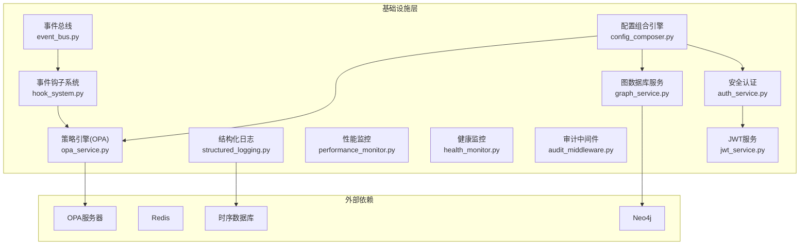
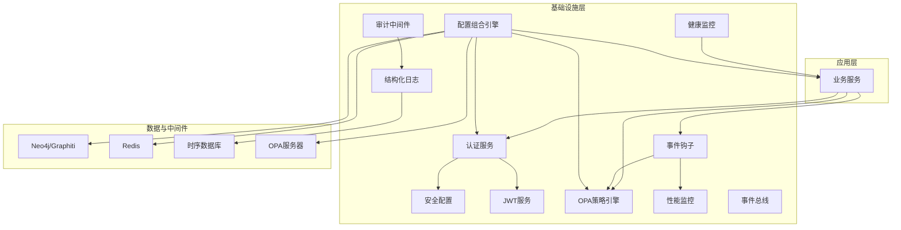
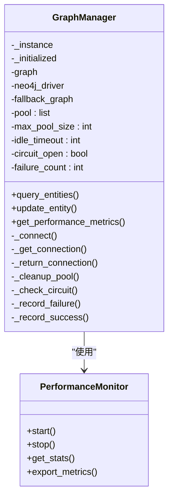
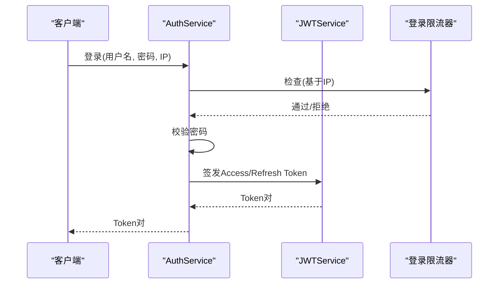
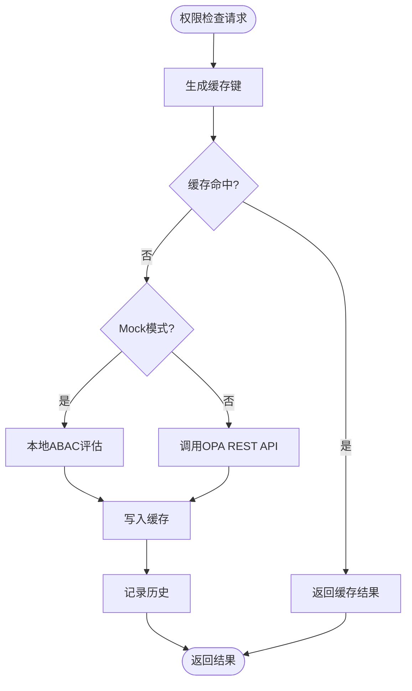
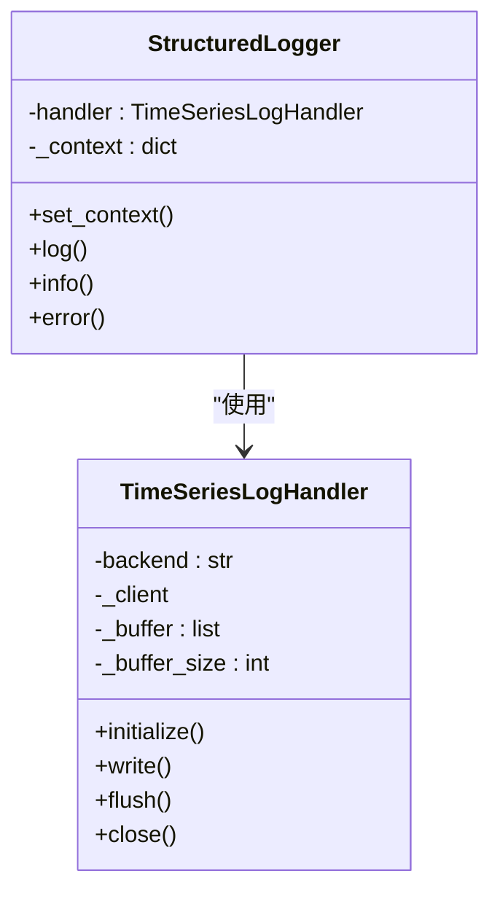
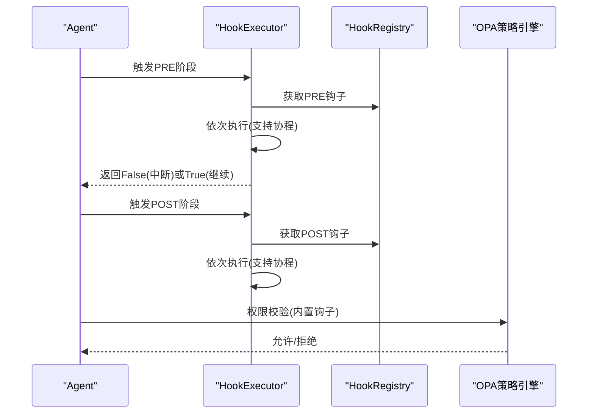
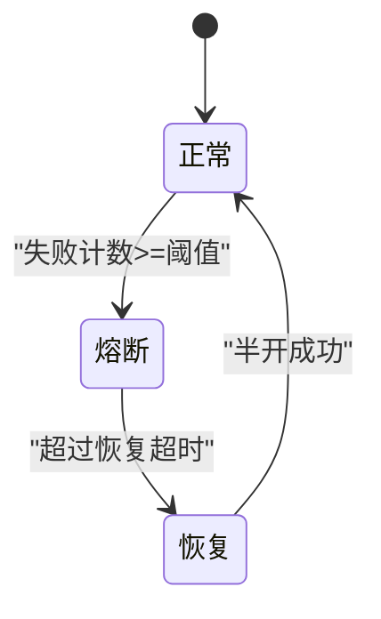
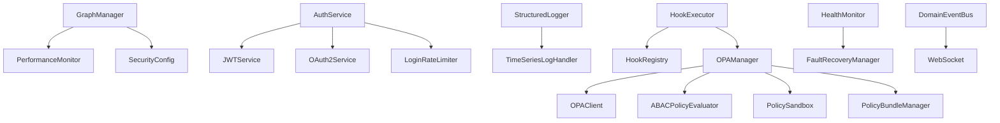

# 基础设施服务

<cite>
**本文档引用的文件**
- [graph_service.py](file://odap/infra/graph/graph_service.py)
- [auth_service.py](file://odap/infra/security/auth_service.py)
- [opa_service.py](file://odap/infra/opa/opa_service.py)
- [structured_logging.py](file://odap/infra/logging/structured_logging.py)
- [hook_system.py](file://odap/infra/events/hook_system.py)
- [performance_monitor.py](file://odap/infra/monitoring/performance_monitor.py)
- [health_monitor.py](file://odap/infra/resilience/health_monitor.py)
- [audit_middleware.py](file://odap/infra/middleware/audit_middleware.py)
- [jwt_service.py](file://odap/infra/security/jwt_service.py)
- [event_bus.py](file://odap/web/ws/event_bus.py)
- [config_composer.py](file://odap/infra/config_composer.py)
- [agent_config.yaml](file://config/agent_config.yaml)
- [docker-compose.yml](file://docker/docker-compose.yml)
- [security_config.py](file://odap/infra/security/config.py)
</cite>

## 目录
1. [简介](#简介)
2. [项目结构](#项目结构)
3. [核心组件](#核心组件)
4. [架构概览](#架构概览)
5. [详细组件分析](#详细组件分析)
6. [依赖关系分析](#依赖关系分析)
7. [性能考虑](#性能考虑)
8. [故障排查指南](#故障排查指南)
9. [结论](#结论)
10. [附录](#附录)

## 简介
本文件为 ODAP 基础设施服务的全面技术文档，涵盖图数据库服务、安全基础设施、监控日志系统、事件驱动架构、缓存策略、存储抽象与网络通信等核心基础设施组件。文档旨在帮助开发者与运维人员理解系统设计模式、实现细节与最佳实践，并提供配置管理、故障排查与性能调优的实用指南。

## 项目结构
基础设施相关模块主要分布在以下目录：
- 图数据库与知识图谱：odap/infra/graph
- 安全与认证：odap/infra/security
- 策略引擎（OPA）：odap/infra/opa
- 监控与日志：odap/infra/monitoring、odap/infra/logging
- 事件与钩子：odap/infra/events
- 健康监控与弹性：odap/infra/resilience
- 中间件与审计：odap/infra/middleware
- 配置管理：odap/infra/config_composer
- Web 事件总线：odap/web/ws
- 环境配置：config、docker

**图表来源**
- [graph_service.py:71-144](file://odap/infra/graph/graph_service.py#L71-L144)
- [auth_service.py:82-95](file://odap/infra/security/auth_service.py#L82-L95)
- [opa_service.py:455-490](file://odap/infra/opa/opa_service.py#L455-L490)
- [structured_logging.py:102-126](file://odap/infra/logging/structured_logging.py#L102-L126)
- [hook_system.py:68-108](file://odap/infra/events/hook_system.py#L68-L108)
- [performance_monitor.py:12-29](file://odap/infra/monitoring/performance_monitor.py#L12-L29)
- [health_monitor.py:28-45](file://odap/infra/resilience/health_monitor.py#L28-L45)
- [audit_middleware.py:51-71](file://odap/infra/middleware/audit_middleware.py#L51-L71)
- [jwt_service.py:19-28](file://odap/infra/security/jwt_service.py#L19-L28)
- [event_bus.py:13-27](file://odap/web/ws/event_bus.py#L13-L27)
- [config_composer.py:74-83](file://odap/infra/config_composer.py#L74-L83)

**章节来源**
- [graph_service.py:1-120](file://odap/infra/graph/graph_service.py#L1-L120)
- [docker-compose.yml:1-97](file://docker/docker-compose.yml#L1-L97)

## 核心组件
本节概述基础设施服务的关键组件及其职责：
- 图数据库服务：提供三层降级连接（Graphiti → Neo4j Driver → NetworkX fallback），包含连接池、断路器、性能监控与批量数据加载。
- 安全认证：支持本地账号、OAuth2/OIDC、API Key、JWT 签发/刷新/吊销与登录限流。
- 策略引擎（OPA）：ABAC 策略评估、策略热更新 Bundle、策略沙箱、批量权限检查与缓存。
- 结构化日志：OpenTelemetry 追踪上下文、时序数据库存储（InfluxDB/TimescaleDB）、内存回退。
- 事件钩子系统：Agent 生命周期拦截、增强与监控，支持预/后/错误三阶段与优先级控制。
- 性能监控：统一指标采集与统计，装饰器与队列历史记录。
- 健康监控：Swarm/Agent 健康状态检查、阈值告警与报告生成。
- 审计中间件：自动记录写操作到审计日志，排除特定路径与方法。
- 事件总线：WebSocket 广播、订阅回调、工作空间隔离与事件历史。
- 配置组合引擎：五层配置合并（系统默认 → 环境变量 → 文件 → 工作空间 → 用户），带校验与差异比较。

**章节来源**
- [graph_service.py:71-144](file://odap/infra/graph/graph_service.py#L71-L144)
- [auth_service.py:82-95](file://odap/infra/security/auth_service.py#L82-L95)
- [opa_service.py:455-490](file://odap/infra/opa/opa_service.py#L455-L490)
- [structured_logging.py:102-126](file://odap/infra/logging/structured_logging.py#L102-L126)
- [hook_system.py:68-108](file://odap/infra/events/hook_system.py#L68-L108)
- [performance_monitor.py:12-29](file://odap/infra/monitoring/performance_monitor.py#L12-L29)
- [health_monitor.py:28-45](file://odap/infra/resilience/health_monitor.py#L28-L45)
- [audit_middleware.py:51-71](file://odap/infra/middleware/audit_middleware.py#L51-L71)
- [event_bus.py:13-27](file://odap/web/ws/event_bus.py#L13-L27)
- [config_composer.py:74-83](file://odap/infra/config_composer.py#L74-L83)

## 架构概览
基础设施服务采用分层与模块化设计，围绕核心服务提供高可用、可观测与可扩展的支撑能力：

**图表来源**
- [graph_service.py:145-185](file://odap/infra/graph/graph_service.py#L145-L185)
- [auth_service.py:82-95](file://odap/infra/security/auth_service.py#L82-L95)
- [opa_service.py:455-490](file://odap/infra/opa/opa_service.py#L455-L490)
- [structured_logging.py:102-126](file://odap/infra/logging/structured_logging.py#L102-L126)
- [hook_system.py:171-258](file://odap/infra/events/hook_system.py#L171-L258)
- [health_monitor.py:46-77](file://odap/infra/resilience/health_monitor.py#L46-L77)
- [audit_middleware.py:51-112](file://odap/infra/middleware/audit_middleware.py#L51-L112)
- [event_bus.py:13-27](file://odap/web/ws/event_bus.py#L13-L27)
- [config_composer.py:74-83](file://odap/infra/config_composer.py#L74-L83)

## 详细组件分析

### 图数据库服务（GraphManager/GraphService）
- 设计模式
  - 单例模式：确保全局共享同一图谱实例。
  - 三层降级策略：Graphiti（核心）→ Neo4j Driver（直连）→ NetworkX（回退）。
  - 装饰器监控：使用性能监控装饰器记录数据库查询耗时。
- 连接池管理
  - 最大连接数、空闲超时、池清理、连接获取/归还与超时等待。
  - 断路器：失败阈值、恢复超时、半开状态尝试。
- 查询优化策略
  - 批量加载：按实体类型分组批量 MERGE，提升写入性能。
  - 索引与约束：初始化阶段构建索引与唯一性约束。
  - 回退模式：内存图谱用于离线/开发场景。
- 性能监控
  - 查询时间队列、缓存命中/未命中统计、连接池大小与断路器状态。

**图表来源**
- [graph_service.py:71-144](file://odap/infra/graph/graph_service.py#L71-L144)
- [graph_service.py:299-443](file://odap/infra/graph/graph_service.py#L299-L443)
- [performance_monitor.py:12-29](file://odap/infra/monitoring/performance_monitor.py#L12-L29)

**章节来源**
- [graph_service.py:71-144](file://odap/infra/graph/graph_service.py#L71-L144)
- [graph_service.py:145-185](file://odap/infra/graph/graph_service.py#L145-L185)
- [graph_service.py:299-443](file://odap/infra/graph/graph_service.py#L299-L443)
- [graph_service.py:649-731](file://odap/infra/graph/graph_service.py#L649-L731)
- [performance_monitor.py:147-184](file://odap/infra/monitoring/performance_monitor.py#L147-L184)

### 安全基础设施（认证授权、JWT、审计）
- 认证授权系统
  - 支持本地账号密码（bcrypt/哈希）、OAuth2/OIDC 授权码流程、API Key 管理。
  - 登录限流：基于 IP 的 5 次失败/15 分钟窗口与 30 分钟锁定。
  - 用户生命周期：注册、查询、更新、删除、激活状态管理。
- JWT 令牌管理
  - Access Token（短期）与 Refresh Token（长期）签发、验证与轮换。
  - 支持 HS256/RS256 算法，负载包含用户标识、角色、工作空间信息。
- 审计日志服务
  - 自动中间件记录写操作（POST/PUT/DELETE/PATCH），排除文档/健康/静态资源等路径。
  - 提取用户身份（Bearer Token 解码），记录方法、路径、状态码、耗时、客户端 IP、追踪 ID。

**图表来源**
- [auth_service.py:118-157](file://odap/infra/security/auth_service.py#L118-L157)
- [jwt_service.py:29-54](file://odap/infra/security/jwt_service.py#L29-L54)

**章节来源**
- [auth_service.py:82-157](file://odap/infra/security/auth_service.py#L82-L157)
- [jwt_service.py:19-72](file://odap/infra/security/jwt_service.py#L19-L72)
- [audit_middleware.py:51-112](file://odap/infra/middleware/audit_middleware.py#L51-L112)

### 策略引擎（OPA）集成
- ABAC 策略模型：基于角色、属性、环境条件的权限评估。
- 策略热更新 Bundle：版本化策略包、历史记录与回滚。
- 策略沙箱：What-If 权限模拟与执行结果统计。
- 批量权限检查与缓存：键生成、TTL、命中率统计与历史记录。
- 客户端集成：REST API 客户端封装，健康检查与自动加载策略。

**图表来源**
- [opa_service.py:501-558](file://odap/infra/opa/opa_service.py#L501-L558)
- [opa_service.py:559-583](file://odap/infra/opa/opa_service.py#L559-L583)

**章节来源**
- [opa_service.py:30-80](file://odap/infra/opa/opa_service.py#L30-L80)
- [opa_service.py:455-500](file://odap/infra/opa/opa_service.py#L455-L500)
- [opa_service.py:538-599](file://odap/infra/opa/opa_service.py#L538-L599)

### 监控与日志系统
- 性能监控指标
  - 统一指标类型：LLM 调用、数据库查询、API 请求、工具执行。
  - 统计维度：均值、中位数、最小/最大、P95/P99。
  - 装饰器自动埋点与手动 start/stop。
- 结构化日志
  - OpenTelemetry 追踪上下文：trace_id/span_id。
  - 时序数据库后端：InfluxDB/TimescaleDB，内存回退。
  - 日志记录器：单例、上下文设置、异步写入与批量刷新。

**图表来源**
- [structured_logging.py:287-315](file://odap/infra/logging/structured_logging.py#L287-L315)
- [structured_logging.py:102-126](file://odap/infra/logging/structured_logging.py#L102-L126)

**章节来源**
- [performance_monitor.py:12-141](file://odap/infra/monitoring/performance_monitor.py#L12-L141)
- [structured_logging.py:287-395](file://odap/infra/logging/structured_logging.py#L287-L395)

### 事件驱动架构（Hook 系统、事件总线）
- Hook 系统
  - 事件注册与优先级排序、预/后/错误三阶段执行。
  - 内置 Hook：OPA 权限校验、审计日志、指标收集、性能计时。
  - 装饰器自动注册与执行历史记录。
- 事件总线
  - WebSocket 连接管理、工作空间隔离、订阅回调与广播。
  - 预定义事件：实体变更、情报更新、行动结果、进度上报、OPA 检查、审计事件。
  - 事件历史与统计接口。

**图表来源**
- [hook_system.py:171-258](file://odap/infra/events/hook_system.py#L171-L258)
- [hook_system.py:352-372](file://odap/infra/events/hook_system.py#L352-L372)

**章节来源**
- [hook_system.py:68-169](file://odap/infra/events/hook_system.py#L68-L169)
- [hook_system.py:171-258](file://odap/infra/events/hook_system.py#L171-L258)
- [hook_system.py:397-428](file://odap/infra/events/hook_system.py#L397-L428)
- [event_bus.py:13-96](file://odap/web/ws/event_bus.py#L13-L96)

### 健康检查与弹性
- 健康监控器
  - 定时检查 Swarm 组件状态、活跃任务数量等指标。
  - 阈值告警：警告/严重级别，生成告警历史与健康报告。
  - 异步监控任务管理与取消。
- 弹性与恢复
  - 断路器：数据库连接失败熔断与恢复。
  - 回退模式：Neo4j 不可用时切换到 NetworkX 内存图谱。
  - 重连机制：最大重试次数与间隔控制。

**图表来源**
- [graph_service.py:370-405](file://odap/infra/graph/graph_service.py#L370-L405)

**章节来源**
- [health_monitor.py:28-198](file://odap/infra/resilience/health_monitor.py#L28-L198)
- [graph_service.py:186-213](file://odap/infra/graph/graph_service.py#L186-L213)
- [graph_service.py:370-405](file://odap/infra/graph/graph_service.py#L370-L405)

### 缓存策略与存储抽象
- 缓存策略
  - Redis 作为缓存后端（Docker Compose 中配置）。
  - JWT Secret、CORS Origins、日志级别等敏感配置集中管理。
- 存储抽象
  - 图数据库：Neo4j（Graphiti 核心）与回退模式（NetworkX）。
  - 日志存储：时序数据库（InfluxDB/TimescaleDB）与内存回退。
- 网络通信
  - FastAPI + Uvicorn，WebSocket 事件总线，跨域配置。

**章节来源**
- [docker-compose.yml:1-97](file://docker/docker-compose.yml#L1-L97)
- [security_config.py:29-76](file://odap/infra/security/config.py#L29-L76)
- [event_bus.py:13-27](file://odap/web/ws/event_bus.py#L13-L27)

### 配置管理
- 配置分层
  - L0：系统默认；L1：环境变量；L2：配置文件（YAML/JSON）；L3：工作空间级；L4：用户级。
  - 优先级：L4 > L3 > L2 > L1 > L0。
- 校验与差异
  - 类型强制、范围限制、必填项校验。
  - Schema 定义与差异比较，便于审计与排错。

**章节来源**
- [config_composer.py:74-260](file://odap/infra/config_composer.py#L74-L260)
- [agent_config.yaml:1-23](file://config/agent_config.yaml#L1-L23)

## 依赖关系分析
基础设施组件之间的耦合与协作如下：

**图表来源**
- [graph_service.py:214-217](file://odap/infra/graph/graph_service.py#L214-L217)
- [auth_service.py:82-95](file://odap/infra/security/auth_service.py#L82-L95)
- [opa_service.py:455-490](file://odap/infra/opa/opa_service.py#L455-L490)
- [structured_logging.py:287-315](file://odap/infra/logging/structured_logging.py#L287-L315)
- [health_monitor.py:92-119](file://odap/infra/resilience/health_monitor.py#L92-L119)
- [hook_system.py:171-258](file://odap/infra/events/hook_system.py#L171-L258)
- [event_bus.py:13-27](file://odap/web/ws/event_bus.py#L13-L27)

**章节来源**
- [graph_service.py:1-120](file://odap/infra/graph/graph_service.py#L1-L120)
- [auth_service.py:1-40](file://odap/infra/security/auth_service.py#L1-L40)
- [opa_service.py:1-40](file://odap/infra/opa/opa_service.py#L1-L40)
- [structured_logging.py:1-40](file://odap/infra/logging/structured_logging.py#L1-L40)
- [hook_system.py:1-40](file://odap/infra/events/hook_system.py#L1-L40)
- [health_monitor.py:1-40](file://odap/infra/resilience/health_monitor.py#L1-L40)
- [event_bus.py:1-20](file://odap/web/ws/event_bus.py#L1-L20)

## 性能考虑
- 图数据库
  - 批量写入：按实体类型分组，减少事务与网络往返。
  - 索引与约束：初始化阶段一次性构建，避免运行时抖动。
  - 连接池：合理设置最大连接数与空闲超时，避免资源泄露。
- 认证与策略
  - 登录限流：防止暴力破解，降低后端压力。
  - OPA 缓存：命中率统计与 TTL 控制，平衡一致性与性能。
- 日志与监控
  - 异步写入与批量刷新，避免阻塞主流程。
  - 指标采样与百分位统计，关注尾延迟。
- 事件总线
  - 广播去死连接，维护集合一致性。
  - 工作空间隔离，减少无关广播。

[本节为通用指导，无需具体文件分析]

## 故障排查指南
- 图数据库连接失败
  - 检查 Neo4j URI/凭据与网络连通性。
  - 查看断路器状态与失败计数，确认是否处于熔断。
  - 切换到回退模式进行诊断，确认数据加载是否正常。
- OPA 策略异常
  - 健康检查失败时自动降级到 Mock 模式，定位策略内容。
  - 查看缓存命中率与策略历史，核对 Bundle 版本与回滚。
- 认证问题
  - 登录限流触发：检查 IP 与失败记录。
  - JWT 验证失败：确认算法与密钥配置一致。
- 审计日志缺失
  - 确认中间件已挂载且未排除目标路径。
  - 检查日志后端连接与缓冲刷新。
- 事件总线异常
  - WebSocket 连接数统计与历史事件查询。
  - 订阅回调异常不影响广播，但会记录警告。

**章节来源**
- [graph_service.py:186-213](file://odap/infra/graph/graph_service.py#L186-L213)
- [opa_service.py:482-500](file://odap/infra/opa/opa_service.py#L482-L500)
- [auth_service.py:39-80](file://odap/infra/security/auth_service.py#L39-L80)
- [audit_middleware.py:51-112](file://odap/infra/middleware/audit_middleware.py#L51-L112)
- [event_bus.py:114-140](file://odap/web/ws/event_bus.py#L114-L140)

## 结论
ODAP 基础设施服务通过模块化设计实现了高可用、可观测与可扩展的支撑能力。图数据库三层降级策略确保在不同环境下稳定运行；安全认证与策略引擎提供细粒度的访问控制；监控与日志系统保障可观测性；事件驱动架构支持灵活的扩展与增强；配置组合引擎提供强大的配置管理能力。这些组件协同工作，为上层业务提供了坚实的基础。

[本节为总结性内容，无需具体文件分析]

## 附录
- 配置示例与环境变量
  - LLM 提供商与模型配置：参考 agent_config.yaml。
  - Docker 环境变量：Neo4j、OPA、Redis、CORS 等。
  - 安全配置：JWT Secret、算法、日志级别等。
- 快速启动
  - 使用 docker-compose 启动应用、Neo4j、OPA 与 Redis。
  - 应用健康检查：/health 端点。

**章节来源**
- [agent_config.yaml:1-23](file://config/agent_config.yaml#L1-L23)
- [docker-compose.yml:1-97](file://docker/docker-compose.yml#L1-L97)
- [security_config.py:29-76](file://odap/infra/security/config.py#L29-L76)