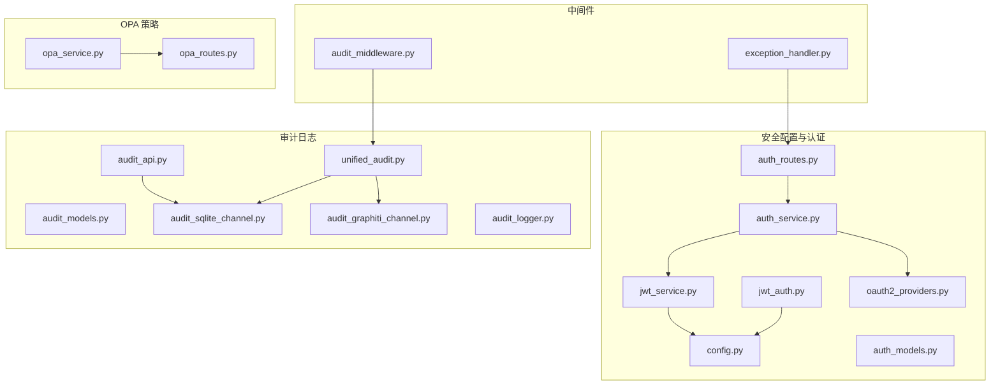
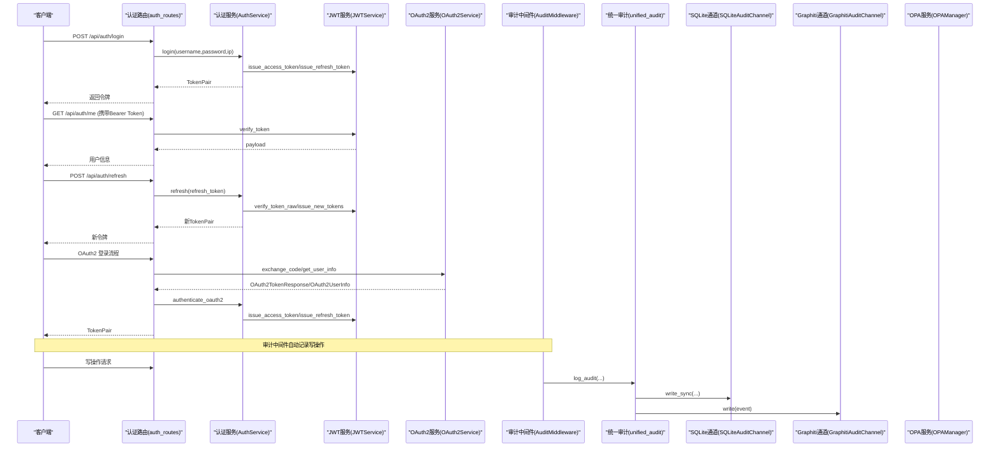
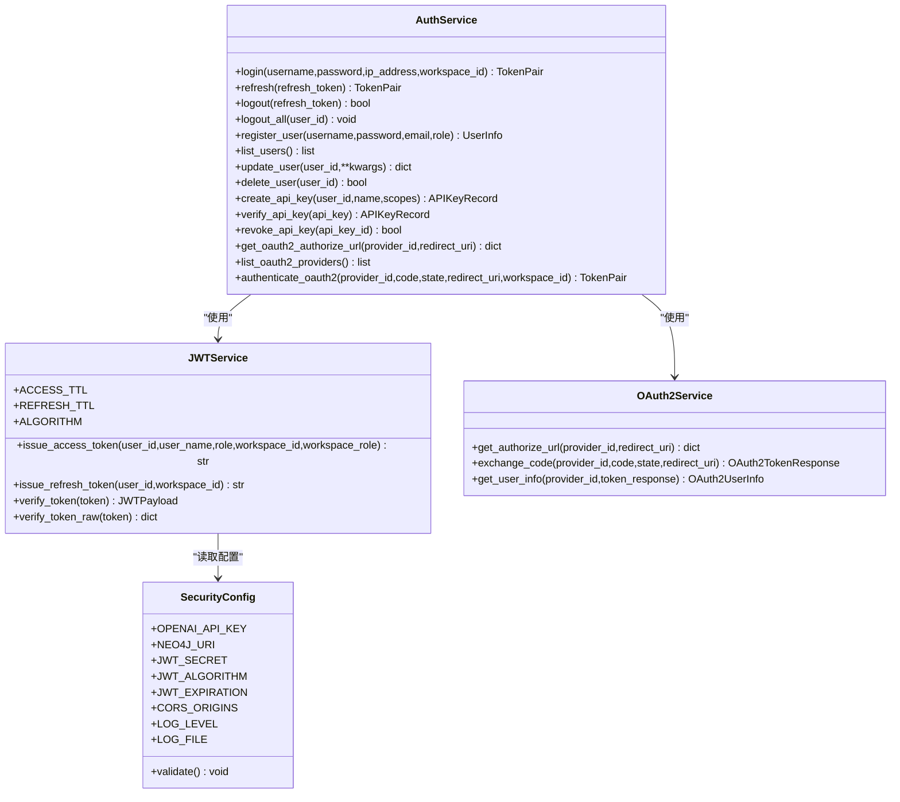
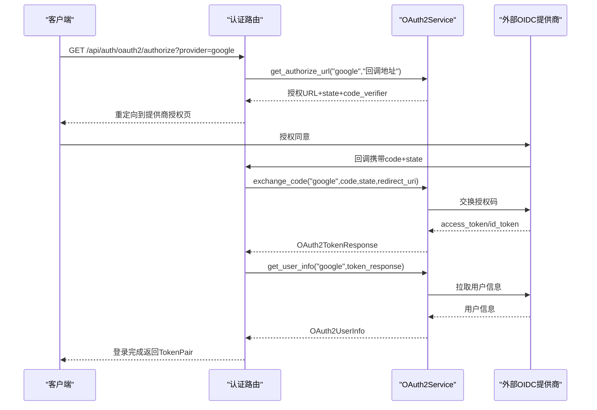
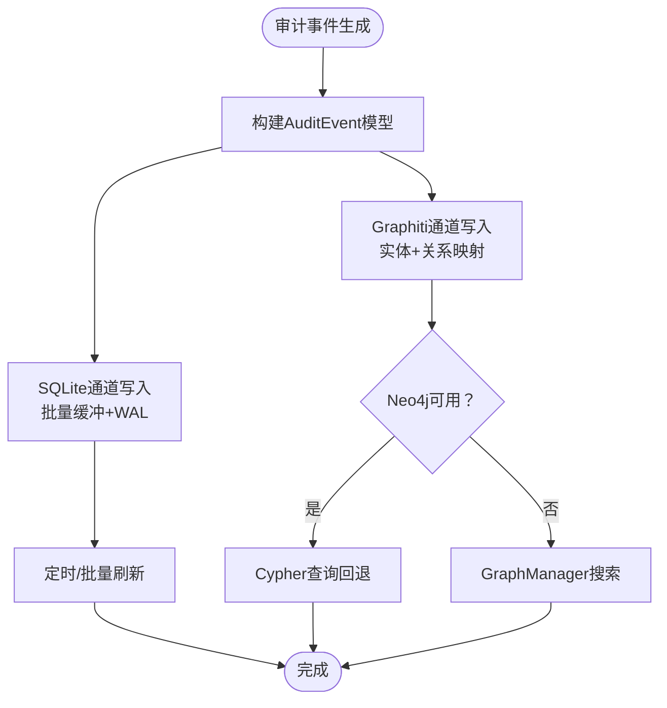
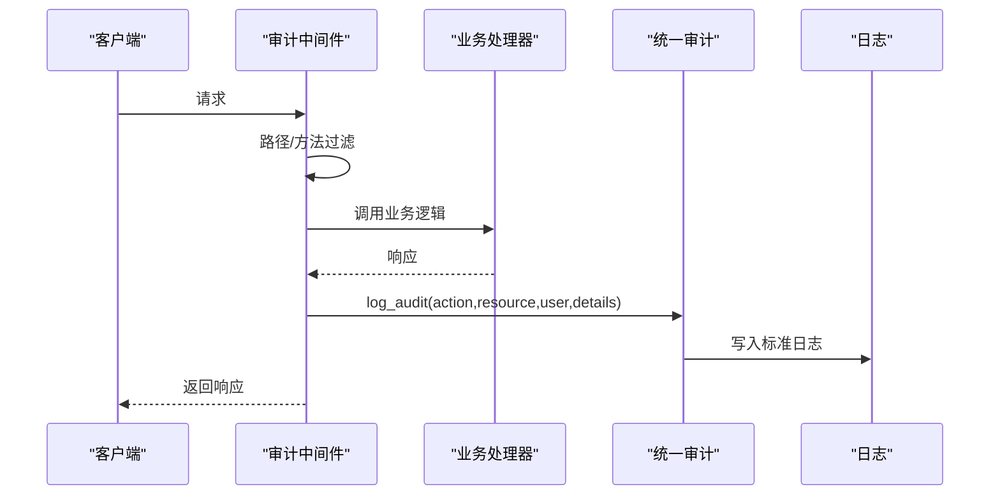
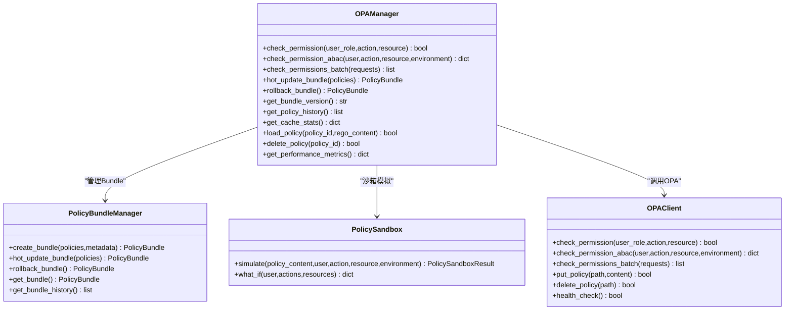
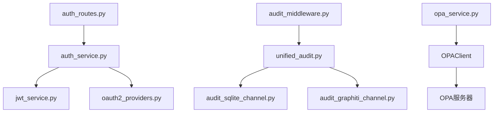

# 安全基础设施

<cite>
**本文引用的文件**
- [odap/infra/security/__init__.py](file://odap/infra/security/__init__.py)
- [odap/infra/security/config.py](file://odap/infra/security/config.py)
- [odap/infra/security/jwt_auth.py](file://odap/infra/security/jwt_auth.py)
- [odap/infra/security/jwt_service.py](file://odap/infra/security/jwt_service.py)
- [odap/infra/security/oauth2_providers.py](file://odap/infra/security/oauth2_providers.py)
- [odap/infra/security/auth_service.py](file://odap/infra/security/auth_service.py)
- [odap/infra/security/auth_routes.py](file://odap/infra/security/auth_routes.py)
- [odap/infra/security/auth_models.py](file://odap/infra/security/auth_models.py)
- [odap/infra/opa/opa_service.py](file://odap/infra/opa/opa_service.py)
- [odap/infra/opa/routes.py](file://odap/infra/opa/routes.py)
- [odap/infra/security/audit_models.py](file://odap/infra/security/audit_models.py)
- [odap/infra/security/audit_sqlite_channel.py](file://odap/infra/security/audit_sqlite_channel.py)
- [odap/infra/security/audit_graphiti_channel.py](file://odap/infra/security/audit_graphiti_channel.py)
- [odap/infra/security/unified_audit.py](file://odap/infra/security/unified_audit.py)
- [odap/infra/security/audit_logger.py](file://odap/infra/security/audit_logger.py)
- [odap/infra/security/audit_api.py](file://odap/infra/security/audit_api.py)
- [odap/infra/middleware/audit_middleware.py](file://odap/infra/middleware/audit_middleware.py)
- [odap/infra/middleware/exception_handler.py](file://odap/infra/middleware/exception_handler.py)
</cite>

## 目录
1. [简介](#简介)
2. [项目结构](#项目结构)
3. [核心组件](#核心组件)
4. [架构总览](#架构总览)
5. [详细组件分析](#详细组件分析)
6. [依赖关系分析](#依赖关系分析)
7. [性能考虑](#性能考虑)
8. [故障排查指南](#故障排查指南)
9. [结论](#结论)
10. [附录](#附录)

## 简介
本文件面向 ODAP 安全基础设施，系统化梳理认证授权、OAuth2 提供商集成、JWT 令牌管理、OPA 策略引擎集成、审计日志系统、安全中间件与异常处理、以及安全配置最佳实践。文档既覆盖代码级实现细节，也提供可视化架构图与流程图，帮助开发者与运维人员快速理解并落地安全能力。

## 项目结构
安全相关代码主要集中在 odap/infra/security 与 odap/infra/opa 两个子模块，并辅以中间件与审计通道实现：
- 安全配置与认证：config.py、jwt_auth.py、jwt_service.py、oauth2_providers.py、auth_service.py、auth_routes.py、auth_models.py
- 审计日志：audit_models.py、audit_sqlite_channel.py、audit_graphiti_channel.py、unified_audit.py、audit_logger.py、audit_api.py
- 中间件：audit_middleware.py、exception_handler.py
- OPA 策略：opa_service.py、opa_routes.py

**图表来源**
- [odap/infra/security/config.py:1-80](file://odap/infra/security/config.py#L1-L80)
- [odap/infra/security/jwt_auth.py:1-63](file://odap/infra/security/jwt_auth.py#L1-L63)
- [odap/infra/security/jwt_service.py:1-72](file://odap/infra/security/jwt_service.py#L1-L72)
- [odap/infra/security/oauth2_providers.py:1-264](file://odap/infra/security/oauth2_providers.py#L1-L264)
- [odap/infra/security/auth_service.py:1-439](file://odap/infra/security/auth_service.py#L1-L439)
- [odap/infra/security/auth_routes.py:1-143](file://odap/infra/security/auth_routes.py#L1-L143)
- [odap/infra/security/auth_models.py:1-128](file://odap/infra/security/auth_models.py#L1-L128)
- [odap/infra/security/audit_models.py:1-167](file://odap/infra/security/audit_models.py#L1-L167)
- [odap/infra/security/audit_sqlite_channel.py:1-449](file://odap/infra/security/audit_sqlite_channel.py#L1-L449)
- [odap/infra/security/audit_graphiti_channel.py:1-314](file://odap/infra/security/audit_graphiti_channel.py#L1-L314)
- [odap/infra/security/unified_audit.py:1-406](file://odap/infra/security/unified_audit.py#L1-L406)
- [odap/infra/security/audit_logger.py:1-378](file://odap/infra/security/audit_logger.py#L1-L378)
- [odap/infra/security/audit_api.py:1-487](file://odap/infra/security/audit_api.py#L1-L487)
- [odap/infra/middleware/audit_middleware.py:1-112](file://odap/infra/middleware/audit_middleware.py#L1-L112)
- [odap/infra/middleware/exception_handler.py:1-137](file://odap/infra/middleware/exception_handler.py#L1-L137)
- [odap/infra/opa/opa_service.py:1-750](file://odap/infra/opa/opa_service.py#L1-L750)
- [odap/infra/opa/routes.py:1-422](file://odap/infra/opa/routes.py#L1-L422)

**章节来源**
- [odap/infra/security/__init__.py:1-108](file://odap/infra/security/__init__.py#L1-L108)

## 核心组件
- 安全配置与认证
  - 安全配置类：集中管理 JWT、CORS、日志等配置项，并进行基本有效性校验。
  - JWT 认证中间件：提供 Bearer Token 解码、当前用户解析、管理员权限校验。
  - JWT 服务：签发访问/刷新令牌、验证令牌、支持 HS256 算法。
  - OAuth2 提供商：支持 Google/GitHub/通用 OIDC，授权码流程、PKCE、用户信息获取。
  - 认证服务：本地密码认证（bcrypt 或 SHA256）、登录限流、刷新/登出、API Key 管理、OAuth2 登录。
  - 认证路由：登录、刷新、用户管理、个人信息等 API。
  - 认证数据模型：枚举、请求/响应模型、刷新令牌与 API Key 记录。
- 审计日志
  - 审计模型：事件类型、严重级别、事件体、过滤器、完整性报告。
  - SQLite 通道：异步缓冲、批量落盘、WAL 模式、索引优化、防篡改校验。
  - Graphiti 通道：将审计事件映射为知识图谱实体与关系，支持 Neo4j 查询回退。
  - 统一审计接口：简化 log_audit/log_ingest/log_query/log_workspace/log_error，同时写入 SQLite 与 Graphiti。
  - 审计 API：事件查询、时间线、追踪链、统计、导出、手动写入。
  - 审计日志记录器（废弃）：历史实现，保留向后兼容。
- 中间件
  - 审计中间件：自动记录写操作（POST/PUT/DELETE/PATCH），排除健康/静态/审计等路径。
  - 异常处理中间件：统一捕获未处理异常，按类型返回标准化错误响应。
- OPA 策略引擎
  - 权限管理：ABAC 策略评估、RBAC/PBAC/CBAC 模型枚举、决策结果与原因。
  - 策略 Bundle：版本化热更新、回滚、历史记录。
  - 策略沙箱：What-If 权限模拟、策略内容执行。
  - REST 客户端：OPA 服务交互、批量检查、策略上传/删除、健康检查。
  - 策略 API：策略 CRUD、Markdown 转 Rego、分类与状态管理。

**章节来源**
- [odap/infra/security/config.py:1-80](file://odap/infra/security/config.py#L1-L80)
- [odap/infra/security/jwt_auth.py:1-63](file://odap/infra/security/jwt_auth.py#L1-L63)
- [odap/infra/security/jwt_service.py:1-72](file://odap/infra/security/jwt_service.py#L1-L72)
- [odap/infra/security/oauth2_providers.py:1-264](file://odap/infra/security/oauth2_providers.py#L1-L264)
- [odap/infra/security/auth_service.py:1-439](file://odap/infra/security/auth_service.py#L1-L439)
- [odap/infra/security/auth_routes.py:1-143](file://odap/infra/security/auth_routes.py#L1-L143)
- [odap/infra/security/auth_models.py:1-128](file://odap/infra/security/auth_models.py#L1-L128)
- [odap/infra/security/audit_models.py:1-167](file://odap/infra/security/audit_models.py#L1-L167)
- [odap/infra/security/audit_sqlite_channel.py:1-449](file://odap/infra/security/audit_sqlite_channel.py#L1-L449)
- [odap/infra/security/audit_graphiti_channel.py:1-314](file://odap/infra/security/audit_graphiti_channel.py#L1-L314)
- [odap/infra/security/unified_audit.py:1-406](file://odap/infra/security/unified_audit.py#L1-L406)
- [odap/infra/security/audit_logger.py:1-378](file://odap/infra/security/audit_logger.py#L1-L378)
- [odap/infra/security/audit_api.py:1-487](file://odap/infra/security/audit_api.py#L1-L487)
- [odap/infra/middleware/audit_middleware.py:1-112](file://odap/infra/middleware/audit_middleware.py#L1-L112)
- [odap/infra/middleware/exception_handler.py:1-137](file://odap/infra/middleware/exception_handler.py#L1-L137)
- [odap/infra/opa/opa_service.py:1-750](file://odap/infra/opa/opa_service.py#L1-L750)
- [odap/infra/opa/routes.py:1-422](file://odap/infra/opa/routes.py#L1-L422)

## 架构总览
下图展示认证授权、审计日志与 OPA 策略的整体交互：

**图表来源**
- [odap/infra/security/auth_routes.py:1-143](file://odap/infra/security/auth_routes.py#L1-L143)
- [odap/infra/security/auth_service.py:1-439](file://odap/infra/security/auth_service.py#L1-L439)
- [odap/infra/security/jwt_service.py:1-72](file://odap/infra/security/jwt_service.py#L1-L72)
- [odap/infra/security/oauth2_providers.py:1-264](file://odap/infra/security/oauth2_providers.py#L1-L264)
- [odap/infra/middleware/audit_middleware.py:1-112](file://odap/infra/middleware/audit_middleware.py#L1-L112)
- [odap/infra/security/unified_audit.py:1-406](file://odap/infra/security/unified_audit.py#L1-L406)
- [odap/infra/security/audit_sqlite_channel.py:1-449](file://odap/infra/security/audit_sqlite_channel.py#L1-L449)
- [odap/infra/security/audit_graphiti_channel.py:1-314](file://odap/infra/security/audit_graphiti_channel.py#L1-L314)

## 详细组件分析

### 认证授权与 JWT 管理
- JWT 认证中间件
  - 通过 HTTP Bearer 方式获取令牌并解码，处理过期与无效令牌场景。
  - 提供可选用户解析与管理员权限校验。
- JWT 服务
  - 定义访问令牌与刷新令牌 TTL、算法；签发与验证令牌。
  - 支持工作空间维度的角色与权限声明。
- OAuth2 提供商
  - 注册默认提供商（Google/GitHub）与自定义提供商，支持 PKCE 授权码流程。
  - 交换授权码获取访问令牌与 ID Token，拉取用户信息。
- 认证服务
  - 本地密码认证（bcrypt 优先，否则 SHA256），登录限流（5 次/15 分钟/IP）。
  - 刷新令牌旋转、撤销、登出；API Key 管理（前缀、作用域、过期）。
  - OAuth2 登录：换取令牌、获取用户信息、创建/更新用户。
- 认证路由
  - 登录、刷新、用户管理（管理员）、个人信息查询等 API。
- 认证数据模型
  - 枚举（AuthProvider、GlobalRole）、请求/响应模型、刷新令牌与 API Key 记录。

**图表来源**
- [odap/infra/security/jwt_service.py:1-72](file://odap/infra/security/jwt_service.py#L1-L72)
- [odap/infra/security/auth_service.py:1-439](file://odap/infra/security/auth_service.py#L1-L439)
- [odap/infra/security/oauth2_providers.py:1-264](file://odap/infra/security/oauth2_providers.py#L1-L264)
- [odap/infra/security/config.py:1-80](file://odap/infra/security/config.py#L1-L80)

**章节来源**
- [odap/infra/security/jwt_auth.py:1-63](file://odap/infra/security/jwt_auth.py#L1-L63)
- [odap/infra/security/jwt_service.py:1-72](file://odap/infra/security/jwt_service.py#L1-L72)
- [odap/infra/security/oauth2_providers.py:1-264](file://odap/infra/security/oauth2_providers.py#L1-L264)
- [odap/infra/security/auth_service.py:1-439](file://odap/infra/security/auth_service.py#L1-L439)
- [odap/infra/security/auth_routes.py:1-143](file://odap/infra/security/auth_routes.py#L1-L143)
- [odap/infra/security/auth_models.py:1-128](file://odap/infra/security/auth_models.py#L1-L128)
- [odap/infra/security/config.py:1-80](file://odap/infra/security/config.py#L1-L80)

### OAuth2 提供商集成流程

**图表来源**
- [odap/infra/security/oauth2_providers.py:1-264](file://odap/infra/security/oauth2_providers.py#L1-L264)
- [odap/infra/security/auth_routes.py:1-143](file://odap/infra/security/auth_routes.py#L1-L143)

**章节来源**
- [odap/infra/security/oauth2_providers.py:1-264](file://odap/infra/security/oauth2_providers.py#L1-L264)
- [odap/infra/security/auth_routes.py:1-143](file://odap/infra/security/auth_routes.py#L1-L143)

### 审计日志系统
- 审计模型
  - 事件类型枚举覆盖用户、工作空间、本体、Agent、Skill、策略、推演、系统、数据摄入、查询、问答、反馈等。
  - 事件体包含操作者、资源、结果、上下文、工作空间、追踪 ID、持续时间、防篡改校验等。
- SQLite 通道
  - 异步缓冲、批量落盘、WAL 模式、索引优化、JSON 字段序列化、防篡改校验（SHA-256）。
- Graphiti 通道
  - 将审计事件映射为 AuditLog 实体，并建立用户、资源、服务三类实体及 EXECUTED/AFFECTED/GENERATED 关系。
- 统一审计接口
  - 提供装饰器与便捷函数，自动记录写操作，同时写入 SQLite 主存储与 Graphiti 辅助存储。
- 审计 API
  - 事件查询、时间线、追踪链、统计、导出、手动写入等。
- 审计日志记录器（废弃）
  - 历史实现，保留向后兼容。

**图表来源**
- [odap/infra/security/audit_models.py:1-167](file://odap/infra/security/audit_models.py#L1-L167)
- [odap/infra/security/audit_sqlite_channel.py:1-449](file://odap/infra/security/audit_sqlite_channel.py#L1-L449)
- [odap/infra/security/audit_graphiti_channel.py:1-314](file://odap/infra/security/audit_graphiti_channel.py#L1-L314)
- [odap/infra/security/unified_audit.py:1-406](file://odap/infra/security/unified_audit.py#L1-L406)
- [odap/infra/security/audit_api.py:1-487](file://odap/infra/security/audit_api.py#L1-L487)

**章节来源**
- [odap/infra/security/audit_models.py:1-167](file://odap/infra/security/audit_models.py#L1-L167)
- [odap/infra/security/audit_sqlite_channel.py:1-449](file://odap/infra/security/audit_sqlite_channel.py#L1-L449)
- [odap/infra/security/audit_graphiti_channel.py:1-314](file://odap/infra/security/audit_graphiti_channel.py#L1-L314)
- [odap/infra/security/unified_audit.py:1-406](file://odap/infra/security/unified_audit.py#L1-L406)
- [odap/infra/security/audit_api.py:1-487](file://odap/infra/security/audit_api.py#L1-L487)
- [odap/infra/security/audit_logger.py:1-378](file://odap/infra/security/audit_logger.py#L1-L378)

### 安全中间件与异常处理
- 审计中间件
  - 自动记录写操作（POST/PUT/DELETE/PATCH），排除健康/静态/审计等路径。
  - 从 Authorization 头提取用户信息，记录操作耗时、状态码、客户端 IP、追踪 ID。
- 异常处理中间件
  - 统一捕获未处理异常，按类型返回标准化错误响应（含请求 ID、路径、错误类型）。
  - 支持自定义 API 错误类型（ValidationError、NotFoundError、ConflictError）。

**图表来源**
- [odap/infra/middleware/audit_middleware.py:1-112](file://odap/infra/middleware/audit_middleware.py#L1-L112)
- [odap/infra/security/unified_audit.py:1-406](file://odap/infra/security/unified_audit.py#L1-L406)

**章节来源**
- [odap/infra/middleware/audit_middleware.py:1-112](file://odap/infra/middleware/audit_middleware.py#L1-L112)
- [odap/infra/middleware/exception_handler.py:1-137](file://odap/infra/middleware/exception_handler.py#L1-L137)

### OPA 策略引擎集成
- 权限管理
  - 支持 RBAC/ABAC/PBAC/CBAC 模型；决策结果与原因枚举；批量权限检查与缓存。
- 策略 Bundle
  - 版本化热更新、回滚、历史记录；本地持久化 current_bundle.json。
- 策略沙箱
  - What-If 分析：对给定用户与操作集合进行权限模拟。
- REST 客户端
  - 与 OPA 服务器交互：策略上传/删除、批量检查、健康检查。
- 策略 API
  - 策略 CRUD、Markdown 转 Rego、分类与状态管理、版本号递增。

**图表来源**
- [odap/infra/opa/opa_service.py:1-750](file://odap/infra/opa/opa_service.py#L1-L750)
- [odap/infra/opa/routes.py:1-422](file://odap/infra/opa/routes.py#L1-L422)

**章节来源**
- [odap/infra/opa/opa_service.py:1-750](file://odap/infra/opa/opa_service.py#L1-L750)
- [odap/infra/opa/routes.py:1-422](file://odap/infra/opa/routes.py#L1-L422)

## 依赖关系分析
- 组件耦合
  - 认证服务依赖 JWT 服务与 OAuth2 服务；路由依赖认证服务。
  - 审计中间件依赖统一审计接口；统一审计接口依赖 SQLite 与 Graphiti 通道。
  - OPA 服务通过 REST 客户端与外部 OPA 服务器交互。
- 外部依赖
  - JWT 解码与签名依赖 PyJWT；bcrypt 可选；httpx 用于 OAuth2 与 OPA 通信；SQLite/Neo4j 用于审计存储。
- 循环依赖
  - 当前模块间未见直接循环导入；审计通道通过统一入口获取实例，避免循环引用。

**图表来源**
- [odap/infra/security/auth_routes.py:1-143](file://odap/infra/security/auth_routes.py#L1-L143)
- [odap/infra/security/auth_service.py:1-439](file://odap/infra/security/auth_service.py#L1-L439)
- [odap/infra/security/jwt_service.py:1-72](file://odap/infra/security/jwt_service.py#L1-L72)
- [odap/infra/security/oauth2_providers.py:1-264](file://odap/infra/security/oauth2_providers.py#L1-L264)
- [odap/infra/middleware/audit_middleware.py:1-112](file://odap/infra/middleware/audit_middleware.py#L1-L112)
- [odap/infra/security/unified_audit.py:1-406](file://odap/infra/security/unified_audit.py#L1-L406)
- [odap/infra/security/audit_sqlite_channel.py:1-449](file://odap/infra/security/audit_sqlite_channel.py#L1-L449)
- [odap/infra/security/audit_graphiti_channel.py:1-314](file://odap/infra/security/audit_graphiti_channel.py#L1-L314)
- [odap/infra/opa/opa_service.py:1-750](file://odap/infra/opa/opa_service.py#L1-L750)

**章节来源**
- [odap/infra/security/auth_routes.py:1-143](file://odap/infra/security/auth_routes.py#L1-L143)
- [odap/infra/security/auth_service.py:1-439](file://odap/infra/security/auth_service.py#L1-L439)
- [odap/infra/security/jwt_service.py:1-72](file://odap/infra/security/jwt_service.py#L1-L72)
- [odap/infra/security/oauth2_providers.py:1-264](file://odap/infra/security/oauth2_providers.py#L1-L264)
- [odap/infra/middleware/audit_middleware.py:1-112](file://odap/infra/middleware/audit_middleware.py#L1-L112)
- [odap/infra/security/unified_audit.py:1-406](file://odap/infra/security/unified_audit.py#L1-L406)
- [odap/infra/security/audit_sqlite_channel.py:1-449](file://odap/infra/security/audit_sqlite_channel.py#L1-L449)
- [odap/infra/security/audit_graphiti_channel.py:1-314](file://odap/infra/security/audit_graphiti_channel.py#L1-L314)
- [odap/infra/opa/opa_service.py:1-750](file://odap/infra/opa/opa_service.py#L1-L750)

## 性能考虑
- 审计日志
  - SQLite 通道采用异步缓冲与批量刷新，WAL 模式提升并发写入性能；索引覆盖常用查询字段。
  - 防篡改校验在写入时计算，建议控制上下文字段大小以降低序列化与哈希开销。
- JWT 令牌
  - 访问令牌短 TTL（15 分钟），刷新令牌较长 TTL（7 天），减少长期有效令牌暴露风险。
  - 支持 HS256 算法，签名/验签成本低，适合高吞吐场景。
- OAuth2
  - PKCE 授权码流程提升安全性；第三方 HTTP 请求设置超时，避免阻塞。
- OPA
  - 决策结果与策略评估结果缓存，命中率统计便于容量规划；批量检查接口降低网络往返。
  - 策略 Bundle 热更新与回滚，保证策略变更的可控性与可恢复性。

[本节为通用指导，无需特定文件引用]

## 故障排查指南
- 认证失败
  - 检查 JWT_SECRET 是否正确配置且未使用默认值；确认令牌未过期。
  - 登录限流触发：短时间内多次失败会被锁定，等待冷却时间。
- OAuth2 登录异常
  - 核对提供商 client_id/client_secret、回调地址与 scopes；检查授权码交换与用户信息拉取是否成功。
- 审计日志不可写
  - SQLite 数据库路径与权限；通道刷新失败时查看日志；Graphiti 通道依赖 GraphManager 初始化。
- OPA 策略异常
  - 健康检查失败时自动回退到本地评估；检查策略上传/删除接口返回；查看缓存命中率与策略历史。
- 全局异常
  - 异常处理中间件会记录详细堆栈；检查请求 ID 以便定位问题。

**章节来源**
- [odap/infra/security/config.py:1-80](file://odap/infra/security/config.py#L1-L80)
- [odap/infra/security/jwt_auth.py:1-63](file://odap/infra/security/jwt_auth.py#L1-L63)
- [odap/infra/security/auth_service.py:1-439](file://odap/infra/security/auth_service.py#L1-L439)
- [odap/infra/security/oauth2_providers.py:1-264](file://odap/infra/security/oauth2_providers.py#L1-L264)
- [odap/infra/security/audit_sqlite_channel.py:1-449](file://odap/infra/security/audit_sqlite_channel.py#L1-L449)
- [odap/infra/security/audit_graphiti_channel.py:1-314](file://odap/infra/security/audit_graphiti_channel.py#L1-L314)
- [odap/infra/opa/opa_service.py:1-750](file://odap/infra/opa/opa_service.py#L1-L750)
- [odap/infra/middleware/exception_handler.py:1-137](file://odap/infra/middleware/exception_handler.py#L1-L137)

## 结论
ODAP 安全基础设施以“配置驱动 + 多通道审计 + 策略即服务”的方式构建，既满足本地开发与测试需求，又具备生产级的可扩展性与可观测性。认证授权采用 JWT 与 OAuth2 双轨并行，审计日志通过 SQLite 与 Graphiti 双存储保障可靠性与可追溯性，OPA 策略引擎提供灵活的权限控制与合规能力。建议在生产环境中强化密钥管理、启用 HTTPS、定期轮换密钥与令牌、完善审计与告警策略。

[本节为总结性内容，无需特定文件引用]

## 附录

### 安全配置最佳实践
- 密钥管理
  - 使用强随机密钥替换默认 JWT_SECRET；在容器/平台密钥管理服务中管理密钥轮换。
  - 严格控制密钥访问权限，避免硬编码在代码中。
- 访问控制
  - 启用管理员权限校验；对敏感 API 使用管理员鉴权装饰器。
  - 限制 CORS 源，避免跨域风险。
- 数据加密
  - 本地密码存储优先使用 bcrypt；若无 bcrypt，确保使用高强度散列。
  - 审计日志上下文字段避免存储敏感明文；必要时进行脱敏。
- 审计与合规
  - 审计中间件仅记录写操作，避免日志风暴；定期清理与归档。
  - 使用 Graphiti 通道进行时序与关联分析，满足合规审计需求。
- OPA 策略
  - 策略版本化管理，变更前进行沙箱模拟；启用热更新与回滚机制。
  - 对批量检查与缓存命中率进行监控，及时发现性能瓶颈。

[本节为通用指导，无需特定文件引用]