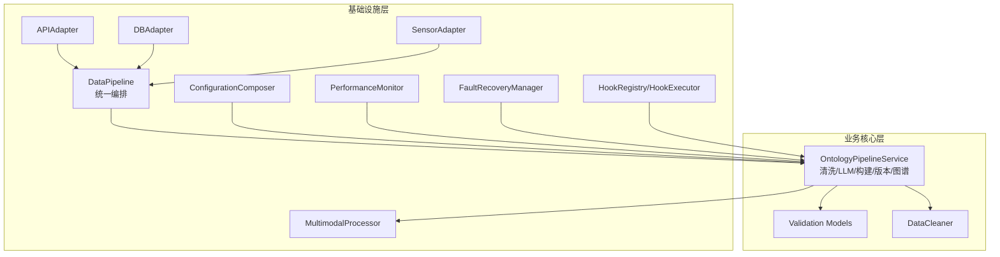
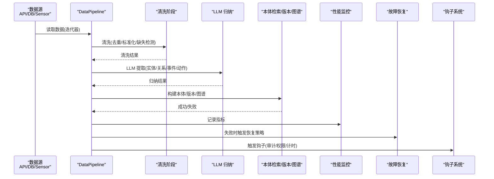
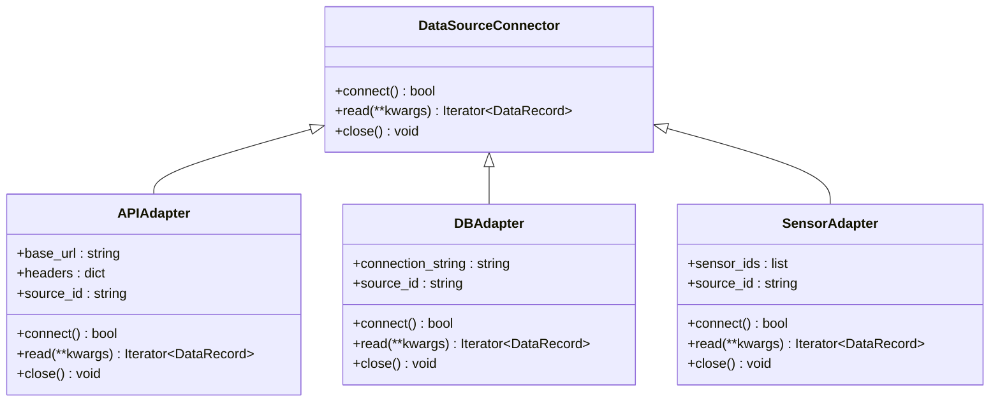
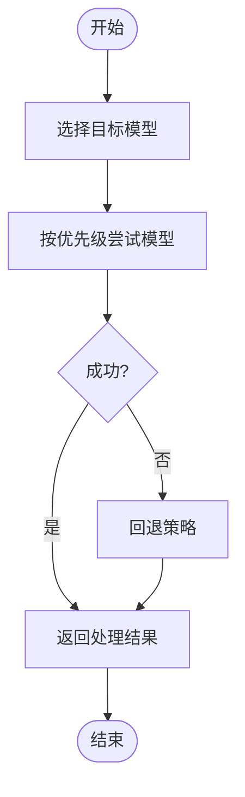
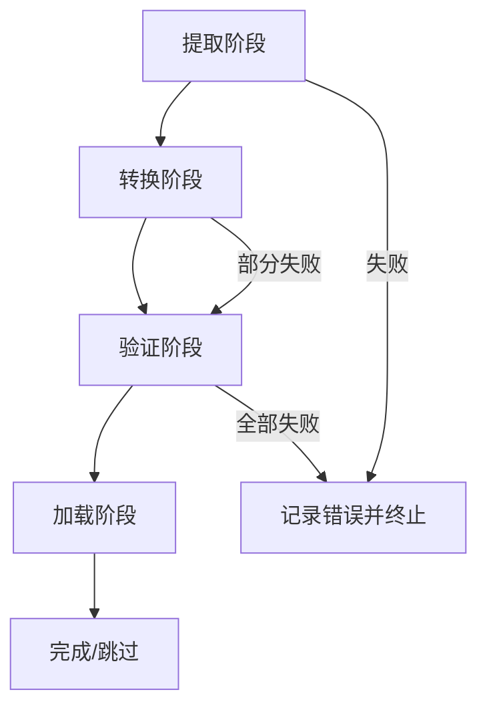
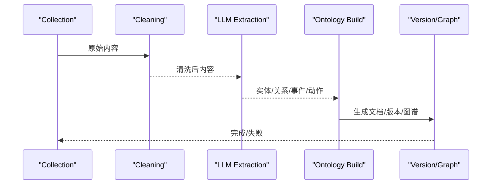
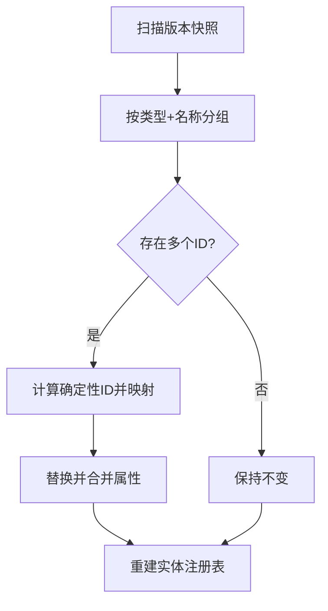
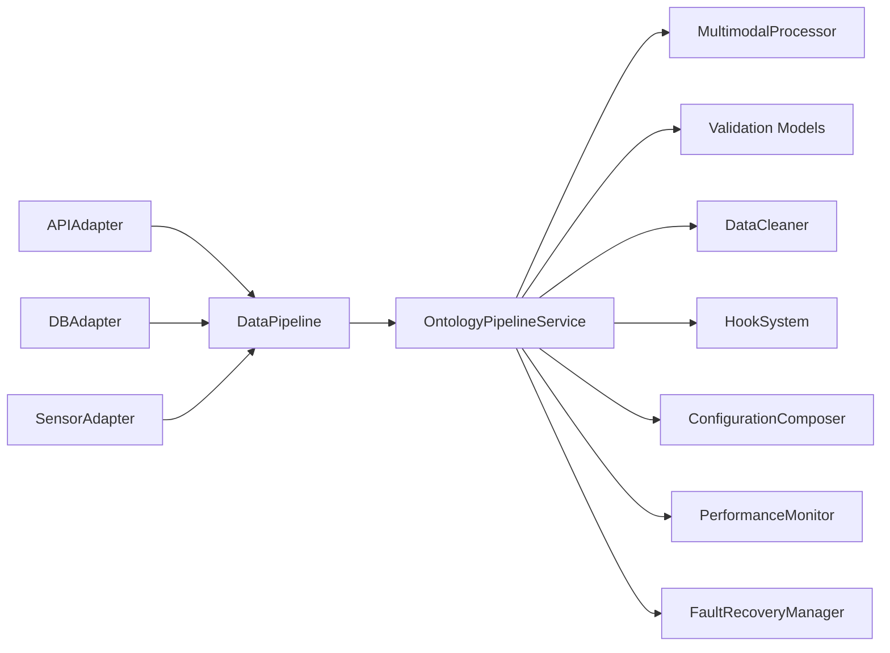
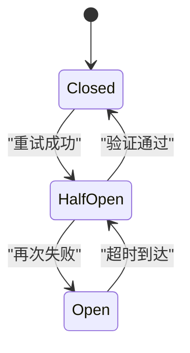

# 数据管道处理

<cite>
**本文引用的文件**
- [odap/infra/data_pipeline/adapters/api_adapter.py](file://odap/infra/data_pipeline/adapters/api_adapter.py)
- [odap/infra/data_pipeline/adapters/db_adapter.py](file://odap/infra/data_pipeline/adapters/db_adapter.py)
- [odap/infra/data_pipeline/adapters/sensor_adapter.py](file://odap/infra/data_pipeline/adapters/sensor_adapter.py)
- [odap/infra/data_pipeline/multimodal_processor.py](file://odap/infra/data_pipeline/multimodal_processor.py)
- [odap/infra/data_pipeline.py](file://odap/infra/data_pipeline.py)
- [odap/biz/core/ontology/services/pipeline_service.py](file://odap/biz/core/ontology/services/pipeline_service.py)
- [odap/biz/core/ontology/models/validation.py](file://odap/biz/core/ontology/models/validation.py)
- [odap/biz/core/ontology/impl/data_cleaner.py](file://odap/biz/core/ontology/impl/data_cleaner.py)
- [odap/infra/resilience/fault_tolerance.py](file://odap/infra/resilience/fault_tolerance.py)
- [odap/infra/monitoring/performance_monitor.py](file://odap/infra/monitoring/performance_monitor.py)
- [odap/infra/config_composer.py](file://odap/infra/config_composer.py)
- [odap/infra/events/hook_system.py](file://odap/infra/events/hook_system.py)
- [tests/integration/test_api_integration.py](file://tests/integration/test_api_integration.py)
</cite>

## 目录
1. [简介](#简介)
2. [项目结构](#项目结构)
3. [核心组件](#核心组件)
4. [架构总览](#架构总览)
5. [详细组件分析](#详细组件分析)
6. [依赖分析](#依赖分析)
7. [性能考虑](#性能考虑)
8. [故障与恢复](#故障与恢复)
9. [配置与优化指南](#配置与优化指南)
10. [故障排查指南](#故障排查指南)
11. [结论](#结论)
12. [附录](#附录)

## 简介
本文件面向 ODAP 数据管道处理系统，围绕“数据适配器”“多模态处理器”“数据质量控制”“并行与流式处理”“配置与优化”等主题，提供从架构到实现细节的系统化技术文档。重点覆盖：
- 数据适配器（API、数据库、传感器）的设计模式与数据转换机制
- 多模态数据处理器（文本解析、图像处理、音频分析）的预处理管道
- 数据质量控制（验证、清洗、冲突修复）的实现与策略
- 并行与流式处理、内存管理与资源限制
- 配置组合引擎、性能监控与故障恢复机制
- 实际数据处理示例与常见问题的解决方案

## 项目结构
ODAP 的数据管道位于基础设施层（infra）与业务核心层（biz/core/ontology），通过统一的 DataPipeline 编排多数据源接入、转换、验证与加载；业务侧的本体构建管道在此基础上扩展清洗、LLM 归纳、本体检索与版本管理。

**图表来源**
- [odap/infra/data_pipeline.py:275-426](file://odap/infra/data_pipeline.py#L275-L426)
- [odap/infra/data_pipeline/adapters/api_adapter.py:13-94](file://odap/infra/data_pipeline/adapters/api_adapter.py#L13-L94)
- [odap/infra/data_pipeline/adapters/db_adapter.py:11-103](file://odap/infra/data_pipeline/adapters/db_adapter.py#L11-L103)
- [odap/infra/data_pipeline/adapters/sensor_adapter.py:12-90](file://odap/infra/data_pipeline/adapters/sensor_adapter.py#L12-L90)
- [odap/infra/data_pipeline/multimodal_processor.py:19-125](file://odap/infra/data_pipeline/multimodal_processor.py#L19-L125)
- [odap/biz/core/ontology/services/pipeline_service.py:190-800](file://odap/biz/core/ontology/services/pipeline_service.py#L190-L800)
- [odap/biz/core/ontology/models/validation.py:10-58](file://odap/biz/core/ontology/models/validation.py#L10-L58)
- [odap/biz/core/ontology/impl/data_cleaner.py:25-287](file://odap/biz/core/ontology/impl/data_cleaner.py#L25-L287)
- [odap/infra/config_composer.py:74-260](file://odap/infra/config_composer.py#L74-L260)
- [odap/infra/monitoring/performance_monitor.py:12-184](file://odap/infra/monitoring/performance_monitor.py#L12-L184)
- [odap/infra/resilience/fault_tolerance.py:41-309](file://odap/infra/resilience/fault_tolerance.py#L41-L309)
- [odap/infra/events/hook_system.py:68-428](file://odap/infra/events/hook_system.py#L68-L428)

**章节来源**
- [odap/infra/data_pipeline.py:1-426](file://odap/infra/data_pipeline.py#L1-L426)
- [odap/biz/core/ontology/services/pipeline_service.py:1-800](file://odap/biz/core/ontology/services/pipeline_service.py#L1-L800)

## 核心组件
- 数据适配器：统一抽象 DataSourceConnector，提供 API、数据库、传感器三类适配器，负责连接、读取与关闭生命周期管理。
- 多模态处理器：封装图像与音频模型的优先级与回退策略，提供统一的处理接口。
- 数据管道：DataPipeline 将多源数据统一编排为 DataRecord，串联提取、转换、验证、加载四个阶段。
- 业务本体管道：在 DataPipeline 基础上扩展清洗、LLM 归纳、本体检索、版本管理与图谱生成。
- 质量控制：DataValidator、Validation 模型、DataCleaner 提供规则校验、冲突扫描与修复。
- 运行保障：PerformanceMonitor、FaultRecoveryManager、HookSystem、ConfigurationComposer 提供性能监控、故障恢复、钩子扩展与配置组合。

**章节来源**
- [odap/infra/data_pipeline/adapters/api_adapter.py:13-94](file://odap/infra/data_pipeline/adapters/api_adapter.py#L13-L94)
- [odap/infra/data_pipeline/adapters/db_adapter.py:11-103](file://odap/infra/data_pipeline/adapters/db_adapter.py#L11-L103)
- [odap/infra/data_pipeline/adapters/sensor_adapter.py:12-90](file://odap/infra/data_pipeline/adapters/sensor_adapter.py#L12-L90)
- [odap/infra/data_pipeline/multimodal_processor.py:19-125](file://odap/infra/data_pipeline/multimodal_processor.py#L19-L125)
- [odap/infra/data_pipeline.py:275-426](file://odap/infra/data_pipeline.py#L275-L426)
- [odap/biz/core/ontology/services/pipeline_service.py:345-447](file://odap/biz/core/ontology/services/pipeline_service.py#L345-L447)
- [odap/biz/core/ontology/models/validation.py:10-58](file://odap/biz/core/ontology/models/validation.py#L10-L58)
- [odap/biz/core/ontology/impl/data_cleaner.py:25-287](file://odap/biz/core/ontology/impl/data_cleaner.py#L25-L287)
- [odap/infra/monitoring/performance_monitor.py:12-184](file://odap/infra/monitoring/performance_monitor.py#L12-L184)
- [odap/infra/resilience/fault_tolerance.py:41-309](file://odap/infra/resilience/fault_tolerance.py#L41-L309)
- [odap/infra/events/hook_system.py:68-428](file://odap/infra/events/hook_system.py#L68-L428)
- [odap/infra/config_composer.py:74-260](file://odap/infra/config_composer.py#L74-L260)

## 架构总览
下图展示了从数据源到业务本体构建的端到端流程，以及质量控制与运行保障的关键节点。

**图表来源**
- [odap/infra/data_pipeline.py:300-426](file://odap/infra/data_pipeline.py#L300-L426)
- [odap/biz/core/ontology/services/pipeline_service.py:345-447](file://odap/biz/core/ontology/services/pipeline_service.py#L345-L447)
- [odap/biz/core/ontology/services/pipeline_service.py:449-684](file://odap/biz/core/ontology/services/pipeline_service.py#L449-L684)
- [odap/biz/core/ontology/services/pipeline_service.py:690-800](file://odap/biz/core/ontology/services/pipeline_service.py#L690-L800)
- [odap/infra/monitoring/performance_monitor.py:147-184](file://odap/infra/monitoring/performance_monitor.py#L147-L184)
- [odap/infra/resilience/fault_tolerance.py:69-118](file://odap/infra/resilience/fault_tolerance.py#L69-L118)
- [odap/infra/events/hook_system.py:171-241](file://odap/infra/events/hook_system.py#L171-L241)

## 详细组件分析

### 数据适配器：API/数据库/传感器
- 设计模式：统一 DataSourceConnector 抽象，具体适配器实现 connect/read/close 生命周期；支持 mock 回退与错误日志。
- 数据转换机制：将外部数据封装为 DataRecord（含 id、source_id、content、format、metadata、ingested_at），便于后续统一处理。
- 错误处理：网络异常、驱动不支持、SQL 查询失败时回退为 mock 数据，保证管道连续性。

**图表来源**
- [odap/infra/data_pipeline.py:94-107](file://odap/infra/data_pipeline.py#L94-L107)
- [odap/infra/data_pipeline/adapters/api_adapter.py:13-94](file://odap/infra/data_pipeline/adapters/api_adapter.py#L13-L94)
- [odap/infra/data_pipeline/adapters/db_adapter.py:11-103](file://odap/infra/data_pipeline/adapters/db_adapter.py#L11-L103)
- [odap/infra/data_pipeline/adapters/sensor_adapter.py:12-90](file://odap/infra/data_pipeline/adapters/sensor_adapter.py#L12-L90)

**章节来源**
- [odap/infra/data_pipeline/adapters/api_adapter.py:22-94](file://odap/infra/data_pipeline/adapters/api_adapter.py#L22-L94)
- [odap/infra/data_pipeline/adapters/db_adapter.py:31-103](file://odap/infra/data_pipeline/adapters/db_adapter.py#L31-L103)
- [odap/infra/data_pipeline/adapters/sensor_adapter.py:21-90](file://odap/infra/data_pipeline/adapters/sensor_adapter.py#L21-L90)

### 多模态数据处理器：文本/图像/音频
- 处理流程：根据配置选择首选模型，按优先级尝试多种模型，失败时回退；图像与音频分别定义模型优先级与回退策略。
- 模型接口：统一 process_image/process_audio，内部路由到具体模型实现；当环境变量缺失时抛出明确错误，便于快速定位。
- 输出结构：包含模型使用标识、置信度、转录/描述等字段，便于上层统一消费。

**图表来源**
- [odap/infra/data_pipeline/multimodal_processor.py:28-54](file://odap/infra/data_pipeline/multimodal_processor.py#L28-L54)
- [odap/infra/data_pipeline/multimodal_processor.py:56-125](file://odap/infra/data_pipeline/multimodal_processor.py#L56-L125)

**章节来源**
- [odap/infra/data_pipeline/multimodal_processor.py:19-125](file://odap/infra/data_pipeline/multimodal_processor.py#L19-L125)

### 数据管道：统一编排与阶段化处理
- 统一抽象：DataPipeline 通过 add_source/add_transform/add_validator/set_loader 组合多阶段处理。
- 阶段划分：EXTRACT/TRANSFORM/VALIDATE/LOAD，每个阶段产出 StageResult，记录输入/输出条数、失败数、耗时与错误。
- 并发与锁：内部使用线程锁保护共享状态，适合多源串行读取与顺序处理。
- 错误上限：MAX_ERRORS 控制错误记录上限，避免内存膨胀。

**图表来源**
- [odap/infra/data_pipeline.py:300-426](file://odap/infra/data_pipeline.py#L300-L426)

**章节来源**
- [odap/infra/data_pipeline.py:275-426](file://odap/infra/data_pipeline.py#L275-L426)

### 业务本体构建管道：清洗/LLM/构建/版本/图谱
- 清洗阶段：去除特殊字符、标准化空白、重复检测、缺失值检测，输出清洗结果与统计。
- LLM 归纳：调用 LLM 提取实体、关系、事件与动作，失败时回退到规则提取；自动注册实体类型。
- 本体检索/版本/图谱：构建 OntologyDocument，保存构建历史与审计日志，支持版本管理与图谱生成。
- 上下文与日志：PipelineContext 统一记录阶段开始时间、持续时长与审计详情，便于追踪与回溯。

**图表来源**
- [odap/biz/core/ontology/services/pipeline_service.py:215-343](file://odap/biz/core/ontology/services/pipeline_service.py#L215-L343)
- [odap/biz/core/ontology/services/pipeline_service.py:345-447](file://odap/biz/core/ontology/services/pipeline_service.py#L345-L447)
- [odap/biz/core/ontology/services/pipeline_service.py:449-684](file://odap/biz/core/ontology/services/pipeline_service.py#L449-L684)
- [odap/biz/core/ontology/services/pipeline_service.py:690-800](file://odap/biz/core/ontology/services/pipeline_service.py#L690-L800)

**章节来源**
- [odap/biz/core/ontology/services/pipeline_service.py:345-447](file://odap/biz/core/ontology/services/pipeline_service.py#L345-L447)
- [odap/biz/core/ontology/services/pipeline_service.py:449-684](file://odap/biz/core/ontology/services/pipeline_service.py#L449-L684)
- [odap/biz/core/ontology/services/pipeline_service.py:690-800](file://odap/biz/core/ontology/services/pipeline_service.py#L690-L800)

### 数据质量控制：验证、清洗、冲突修复
- 验证规则：DataValidator 支持动态添加规则函数，返回 None 表示通过，字符串表示错误信息；Validation 模型定义规则、结果与问题实体。
- 清洗策略：清洗阶段执行去重、缺失检测与格式标准化，输出清洗统计与文档计数。
- 冲突修复：DataCleaner 扫描版本快照，按实体类型与名称分组，统一冲突 ID 并合并属性，重建实体注册表。

**图表来源**
- [odap/biz/core/ontology/impl/data_cleaner.py:42-106](file://odap/biz/core/ontology/impl/data_cleaner.py#L42-L106)
- [odap/biz/core/ontology/impl/data_cleaner.py:108-172](file://odap/biz/core/ontology/impl/data_cleaner.py#L108-L172)
- [odap/biz/core/ontology/impl/data_cleaner.py:221-276](file://odap/biz/core/ontology/impl/data_cleaner.py#L221-L276)

**章节来源**
- [odap/biz/core/ontology/models/validation.py:10-58](file://odap/biz/core/ontology/models/validation.py#L10-L58)
- [odap/biz/core/ontology/impl/data_cleaner.py:25-287](file://odap/biz/core/ontology/impl/data_cleaner.py#L25-L287)

## 依赖分析
- 组件耦合：适配器与 DataPipeline 解耦，通过统一接口注入；业务管道依赖适配器与多模态处理器，同时引入验证与清理模块。
- 外部依赖：API 适配器依赖 requests；DB 适配器对 sqlite 驱动有直接依赖；多模态处理器依赖环境变量（如 LLM API Key）。
- 钩子系统：通过 HookRegistry/HookExecutor 提供审计、权限与计时钩子，贯穿业务管道关键阶段。
- 配置组合：ConfigurationComposer 提供分层配置（系统/环境/文件/工作空间/用户），支持类型强制与校验。

**图表来源**
- [odap/infra/data_pipeline.py:275-426](file://odap/infra/data_pipeline.py#L275-L426)
- [odap/biz/core/ontology/services/pipeline_service.py:190-800](file://odap/biz/core/ontology/services/pipeline_service.py#L190-L800)
- [odap/infra/events/hook_system.py:68-428](file://odap/infra/events/hook_system.py#L68-L428)
- [odap/infra/config_composer.py:74-260](file://odap/infra/config_composer.py#L74-L260)
- [odap/infra/monitoring/performance_monitor.py:12-184](file://odap/infra/monitoring/performance_monitor.py#L12-L184)
- [odap/infra/resilience/fault_tolerance.py:41-309](file://odap/infra/resilience/fault_tolerance.py#L41-L309)

**章节来源**
- [odap/infra/data_pipeline.py:275-426](file://odap/infra/data_pipeline.py#L275-L426)
- [odap/biz/core/ontology/services/pipeline_service.py:190-800](file://odap/biz/core/ontology/services/pipeline_service.py#L190-L800)
- [odap/infra/events/hook_system.py:68-428](file://odap/infra/events/hook_system.py#L68-L428)
- [odap/infra/config_composer.py:74-260](file://odap/infra/config_composer.py#L74-L260)

## 性能考虑
- 性能监控：PerformanceMonitor 提供指标采集与统计（均值/中位数/P95/P99），支持装饰器自动埋点。
- 并发与限流：业务层具备并发控制与限流策略（如技能执行限流），数据管道阶段本身为串行，建议在上游适配器与下游加载器处结合异步与并发。
- 资源限制：容器与沙箱测试覆盖 CPU/内存限制，确保在受限环境下稳定运行。
- 优化建议：对大文件读取采用分页/流式处理；对 LLM 调用增加超时与重试；对数据库查询添加索引与连接池预热。

**章节来源**
- [odap/infra/monitoring/performance_monitor.py:12-184](file://odap/infra/monitoring/performance_monitor.py#L12-L184)
- [odap/infra/resilience/fault_tolerance.py:41-309](file://odap/infra/resilience/fault_tolerance.py#L41-L309)

## 故障与恢复
- 故障分类：超时、权限拒绝、服务不可用、网络错误、工具执行失败、意外异常等。
- 恢复策略：指数退避重试、升级指挥官、缓存回退、替代工具、重启 Agent、降级模式。
- 断路器：按 Agent 维度记录失败次数与时间，超过阈值进入开/半开状态，定时重置。
- 日志与审计：统一审计日志记录阶段操作、状态与耗时，便于问题定位与合规追溯。

**图表来源**
- [odap/infra/resilience/fault_tolerance.py:236-277](file://odap/infra/resilience/fault_tolerance.py#L236-L277)

**章节来源**
- [odap/infra/resilience/fault_tolerance.py:41-309](file://odap/infra/resilience/fault_tolerance.py#L41-L309)

## 配置与优化指南
- 配置分层：系统默认 → 环境变量 → 配置文件 → 工作空间 → 用户，优先级逐层覆盖。
- 类型与校验：ConfigSchema 定义键、类型、默认值、取值范围与可选项，支持运行时校验与差异比对。
- 热配置：通过工作空间与用户配置动态调整，无需重启服务。
- 优化要点：合理设置 LLM 温度、模型与超时；开启审计与性能监控；为数据库与 LLM 设置合理的连接池与重试策略。

**章节来源**
- [odap/infra/config_composer.py:74-260](file://odap/infra/config_composer.py#L74-L260)

## 故障排查指南
- 常见问题
  - API 适配器：URL 格式错误、HTTP 非 200、依赖 requests 缺失时回退 mock。
  - DB 适配器：SQLite 驱动不支持或连接失败时回退 mock。
  - 多模态处理器：缺少 LLM API Key 导致模型调用失败，触发回退。
  - 数据清洗：内容过短、关键信息缺失导致验证失败。
- 排查步骤
  - 查看阶段日志与审计详情（包含开始/结束时间、耗时）。
  - 使用 DataCleaner 扫描并修复实体 ID 冲突。
  - 检查配置组合结果与差异，确认环境变量与文件配置。
  - 启用钩子（审计/计时/权限）辅助定位问题。
  - 使用性能监控统计定位瓶颈。

**章节来源**
- [tests/integration/test_api_integration.py:695-736](file://tests/integration/test_api_integration.py#L695-L736)
- [odap/biz/core/ontology/impl/data_cleaner.py:42-106](file://odap/biz/core/ontology/impl/data_cleaner.py#L42-L106)
- [odap/infra/events/hook_system.py:397-428](file://odap/infra/events/hook_system.py#L397-L428)

## 结论
ODAP 数据管道以 DataPipeline 为核心，结合多模态处理器与业务本体构建管道，形成从数据接入、清洗、归纳到版本与图谱的完整链路。通过验证、冲突修复、性能监控、故障恢复与钩子系统，系统在可扩展性、可观测性与鲁棒性方面具备良好基础。建议在生产环境中配合严格的配置管理、资源限制与监控告警，持续优化 LLM 与数据库访问策略，确保吞吐与稳定性。

## 附录
- 实际数据处理示例
  - 文本摄入：POST /api/v1/admin/ontology/ingest/text
  - JSON 摄入：POST /api/v1/admin/ontology/ingest/json
  - 手动录入：POST /api/v1/admin/ontology/ingest/manual
  - 自然语言摄入：POST /api/v1/admin/ontology/ingest/nl
- 边界条件测试
  - 无效场景 ID、空摄入负载、畸形 JSON、缺少必填字段、大数据量请求等

**章节来源**
- [tests/integration/test_api_integration.py:149-200](file://tests/integration/test_api_integration.py#L149-L200)