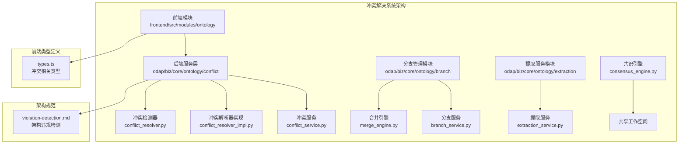
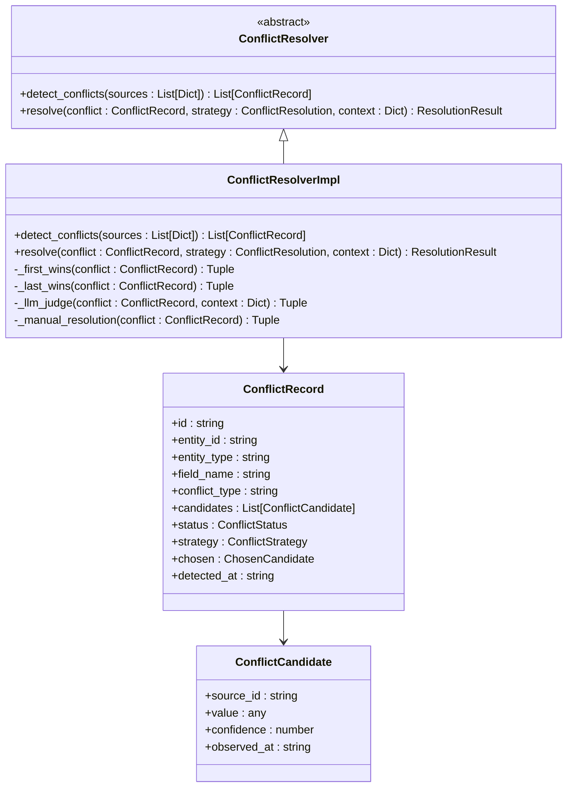
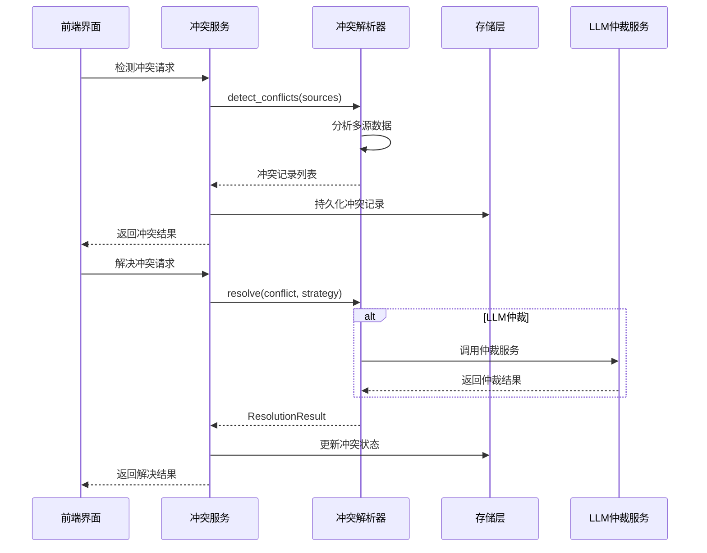
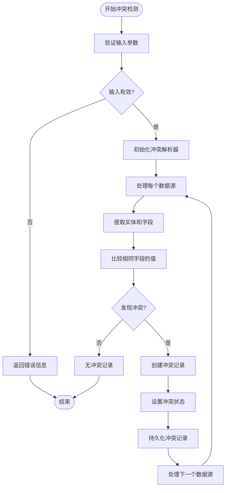
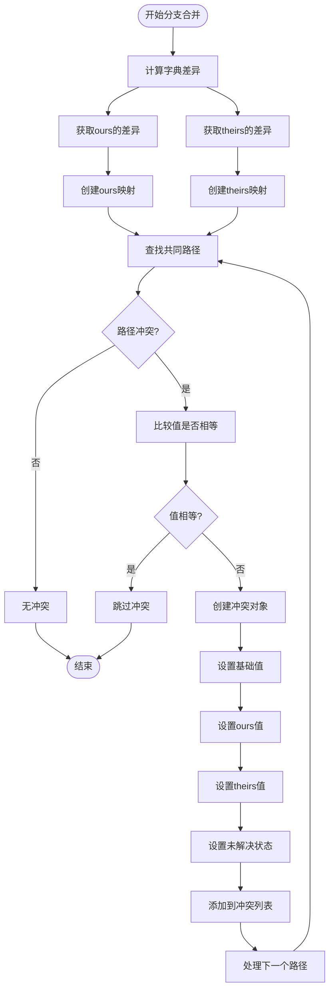
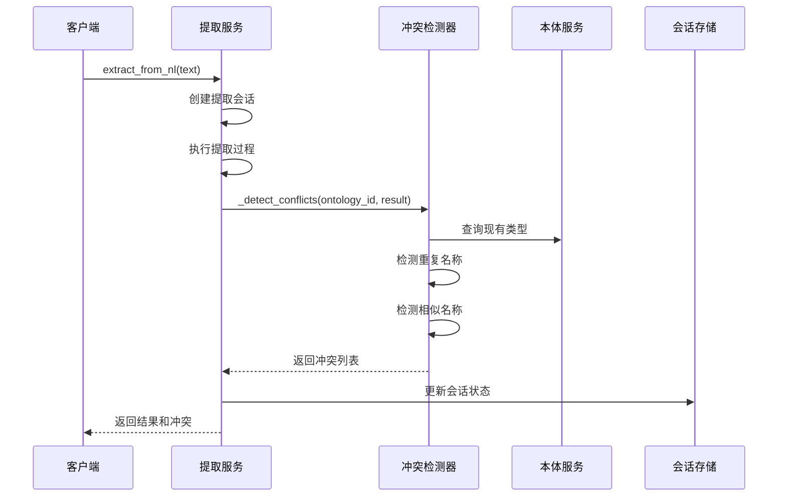
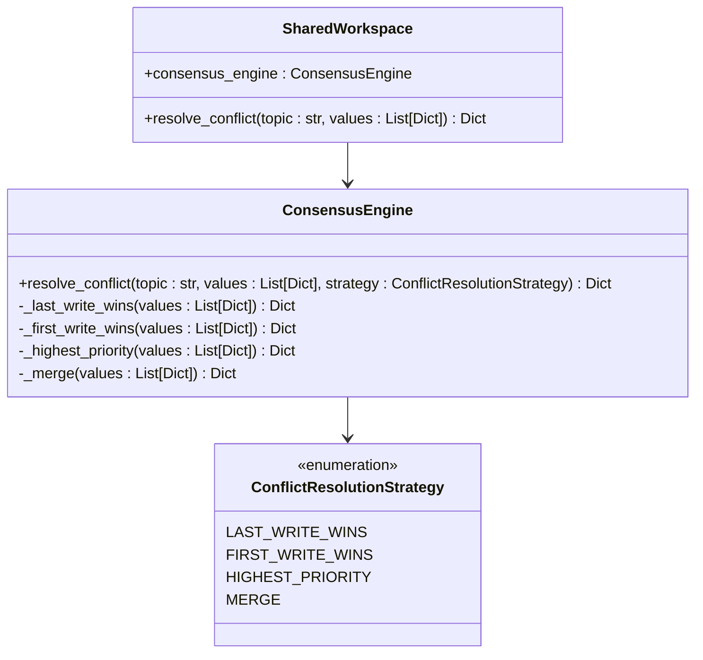
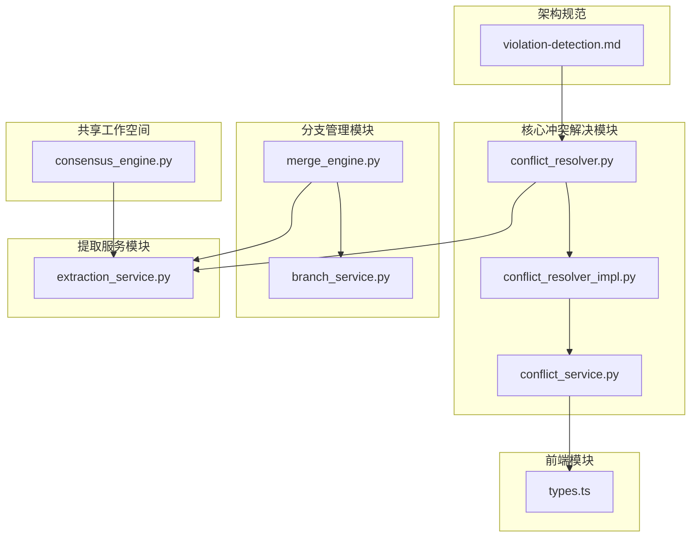

# 冲突解决系统

<cite>
**本文档引用的文件**
- [conflict_resolver.py](file://odap/biz/core/ontology/conflict/interfaces/conflict_resolver.py)
- [conflict_resolver_impl.py](file://odap/biz/core/ontology/conflict/impl/conflict_resolver_impl.py)
- [conflict_service.py](file://odap/biz/core/ontology/conflict/services/conflict_service.py)
- [merge_engine.py](file://odap/biz/core/ontology/branch/impl/merge_engine.py)
- [branch_service.py](file://odap/biz/core/ontology/branch/services/branch_service.py)
- [extraction_service.py](file://odap/biz/core/ontology/extraction/services/extraction_service.py)
- [types.ts](file://frontend/src/modules/ontology/components/types.ts)
- [consensus_engine.py](file://odap/biz/platform/ontology_memory/shared_workspace/services/consensus_engine.py)
- [violation-detection.md](file://.specify/extensions/architecture-guard/commands/violation-detection.md)
</cite>

## 目录
1. [简介](#简介)
2. [项目结构](#项目结构)
3. [核心组件](#核心组件)
4. [架构概览](#架构概览)
5. [详细组件分析](#详细组件分析)
6. [依赖关系分析](#依赖关系分析)
7. [性能考虑](#性能考虑)
8. [故障排除指南](#故障排除指南)
9. [结论](#结论)

## 简介

冲突解决系统是本体图数据库平台的核心模块之一，负责检测和解决来自多个数据源的冲突。该系统支持多种冲突检测算法和解决策略，包括基于时间戳的冲突解决、基于LLM的智能仲裁以及人工干预等机制。

系统主要处理以下类型的冲突：
- **本体类型名称冲突**：重复的对象类型、链接类型、动作类型等
- **值不匹配冲突**：同一实体字段在不同数据源中的值不一致
- **相似名称冲突**：使用编辑距离算法检测相似但不同的名称
- **分支合并冲突**：Git风格的分支合并冲突检测

## 项目结构

冲突解决系统在代码库中的组织结构如下：

**图表来源**
- [conflict_resolver.py:1-53](file://odap/biz/core/ontology/conflict/interfaces/conflict_resolver.py#L1-L53)
- [conflict_resolver_impl.py:78-108](file://odap/biz/core/ontology/conflict/impl/conflict_resolver_impl.py#L78-L108)
- [conflict_service.py:39-106](file://odap/biz/core/ontology/conflict/services/conflict_service.py#L39-L106)

**章节来源**
- [conflict_resolver.py:1-53](file://odap/biz/core/ontology/conflict/interfaces/conflict_resolver.py#L1-L53)
- [conflict_resolver_impl.py:78-108](file://odap/biz/core/ontology/conflict/impl/conflict_resolver_impl.py#L78-L108)
- [conflict_service.py:39-106](file://odap/biz/core/ontology/conflict/services/conflict_service.py#L39-L106)

## 核心组件

### 冲突检测器接口

冲突检测器定义了标准的冲突检测和解决接口，确保所有实现遵循统一的契约。

**图表来源**
- [conflict_resolver.py:19-53](file://odap/biz/core/ontology/conflict/interfaces/conflict_resolver.py#L19-L53)
- [conflict_resolver_impl.py:78-108](file://odap/biz/core/ontology/conflict/impl/conflict_resolver_impl.py#L78-L108)

### 冲突解决策略

系统支持四种主要的冲突解决策略：

1. **首个胜出策略（First-Wins）**：选择最早出现的数据源
2. **最后胜出策略（Last-Wins）**：选择最新出现的数据源  
3. **LLM仲裁策略（LLM-Judge）**：通过大语言模型进行智能仲裁
4. **人工干预策略（Manual）**：标记为等待人工处理

**章节来源**
- [conflict_resolver_impl.py:78-108](file://odap/biz/core/ontology/conflict/impl/conflict_resolver_impl.py#L78-L108)
- [types.ts:80-85](file://frontend/src/modules/ontology/components/types.ts#L80-L85)

## 架构概览

冲突解决系统采用分层架构设计，确保模块间的松耦合和高内聚性：

**图表来源**
- [conflict_service.py:41-97](file://odap/biz/core/ontology/conflict/services/conflict_service.py#L41-L97)
- [conflict_resolver_impl.py:78-108](file://odap/biz/core/ontology/conflict/impl/conflict_resolver_impl.py#L78-L108)

## 详细组件分析

### 冲突检测流程

冲突检测是整个系统的核心流程，负责从多个数据源中识别潜在的冲突：

**图表来源**
- [conflict_service.py:41-61](file://odap/biz/core/ontology/conflict/services/conflict_service.py#L41-L61)
- [conflict_resolver.py:22-33](file://odap/biz/core/ontology/conflict/interfaces/conflict_resolver.py#L22-L33)

### 分支合并冲突检测

分支合并冲突检测专门处理Git风格的分支合并场景：

**图表来源**
- [merge_engine.py:166-205](file://odap/biz/core/ontology/branch/impl/merge_engine.py#L166-L205)

### 提取服务中的冲突检测

提取服务集成了冲突检测功能，确保新提取的数据不会与现有本体产生冲突：

**图表来源**
- [extraction_service.py:132-130](file://odap/biz/core/ontology/extraction/services/extraction_service.py#L132-L130)
- [extraction_service.py:453-475](file://odap/biz/core/ontology/extraction/services/extraction_service.py#L453-L475)

**章节来源**
- [extraction_service.py:113-130](file://odap/biz/core/ontology/extraction/services/extraction_service.py#L113-L130)
- [extraction_service.py:453-475](file://odap/biz/core/ontology/extraction/services/extraction_service.py#L453-L475)

### 共识引擎冲突解决

共识引擎提供了分布式环境下的冲突解决机制：

**图表来源**
- [consensus_engine.py:124-145](file://odap/biz/platform/ontology_memory/shared_workspace/services/consensus_engine.py#L124-L145)

**章节来源**
- [consensus_engine.py:124-145](file://odap/biz/platform/ontology_memory/shared_workspace/services/consensus_engine.py#L124-L145)

## 依赖关系分析

冲突解决系统与其他模块的依赖关系如下：

**图表来源**
- [conflict_resolver.py:1-53](file://odap/biz/core/ontology/conflict/interfaces/conflict_resolver.py#L1-L53)
- [conflict_resolver_impl.py:78-108](file://odap/biz/core/ontology/conflict/impl/conflict_resolver_impl.py#L78-L108)
- [conflict_service.py:39-106](file://odap/biz/core/ontology/conflict/services/conflict_service.py#L39-L106)
- [merge_engine.py:166-205](file://odap/biz/core/ontology/branch/impl/merge_engine.py#L166-L205)
- [branch_service.py:358-390](file://odap/biz/core/ontology/branch/services/branch_service.py#L358-L390)
- [extraction_service.py:113-130](file://odap/biz/core/ontology/extraction/services/extraction_service.py#L113-L130)
- [types.ts:1-85](file://frontend/src/modules/ontology/components/types.ts#L1-L85)
- [consensus_engine.py:124-145](file://odap/biz/platform/ontology_memory/shared_workspace/services/consensus_engine.py#L124-L145)
- [violation-detection.md:68-91](file://.specify/extensions/architecture-guard/commands/violation-detection.md#L68-L91)

**章节来源**
- [conflict_service.py:39-106](file://odap/biz/core/ontology/conflict/services/conflict_service.py#L39-L106)
- [branch_service.py:358-390](file://odap/biz/core/ontology/branch/services/branch_service.py#L358-L390)

## 性能考虑

### 时间复杂度分析

- **冲突检测**：O(n*m*k)，其中n为实体数量，m为数据源数量，k为平均字段数量
- **分支合并冲突检测**：O(d)，其中d为差异路径数量
- **相似名称检测**：O(n²*m)，其中n为实体数量，m为编辑距离阈值

### 内存优化策略

1. **流式处理**：对大型数据集采用流式处理避免内存溢出
2. **增量更新**：只处理发生变化的数据源
3. **缓存机制**：缓存已检测的冲突结果

### 并发处理

系统支持并发冲突检测和解决，通过异步任务队列处理大量冲突请求。

## 故障排除指南

### 常见问题及解决方案

1. **冲突检测失败**
   - 检查输入数据格式是否正确
   - 验证数据源连接状态
   - 查看日志中的具体错误信息

2. **解决策略执行异常**
   - 确认策略枚举值的有效性
   - 检查LLM仲裁服务的可用性
   - 验证人工干预流程的完整性

3. **存储更新失败**
   - 检查数据库连接状态
   - 验证冲突记录的完整性
   - 查看存储层的日志信息

**章节来源**
- [conflict_service.py:75-97](file://odap/biz/core/ontology/conflict/services/conflict_service.py#L75-L97)
- [conflict_resolver_impl.py:90-91](file://odap/biz/core/ontology/conflict/impl/conflict_resolver_impl.py#L90-L91)

## 结论

冲突解决系统通过模块化的架构设计和多种冲突解决策略，为本体图数据库平台提供了强大的数据一致性保障。系统不仅支持传统的冲突检测和解决，还集成了现代的LLM仲裁能力和分布式环境下的共识机制。

未来的发展方向包括：
- 增强LLM仲裁的准确性
- 优化大规模数据的处理性能
- 扩展更多的冲突解决策略
- 改进用户界面的交互体验

该系统为构建可靠的企业级知识图谱应用奠定了坚实的技术基础。