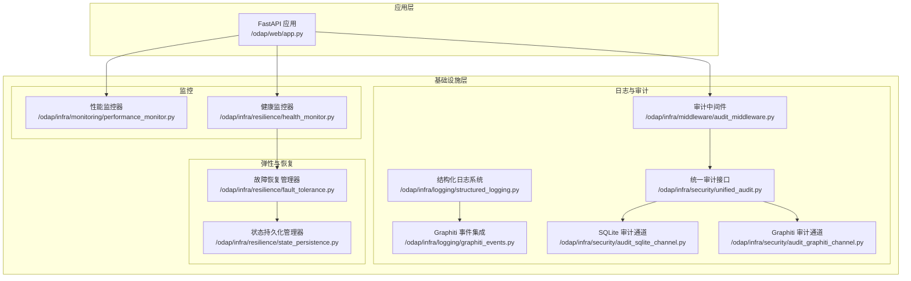
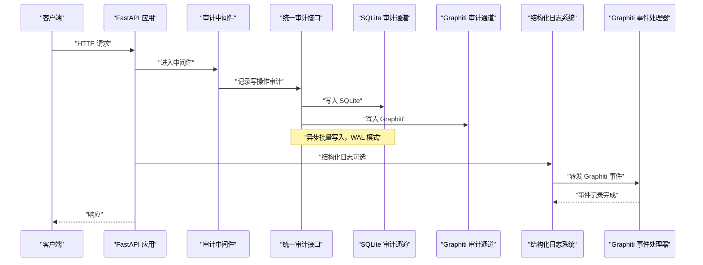
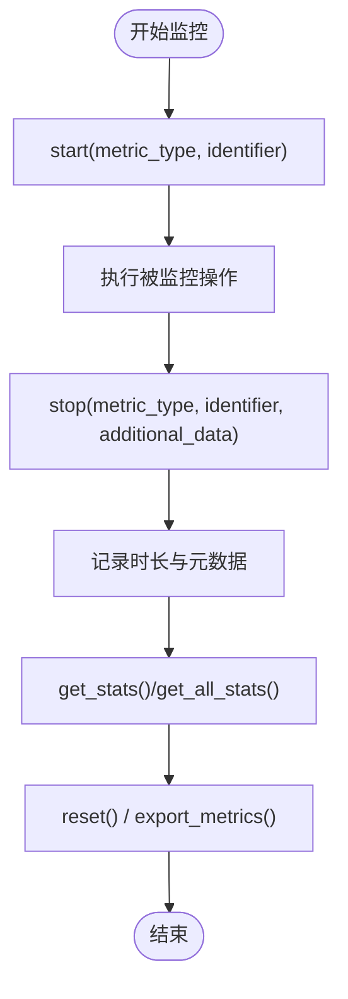
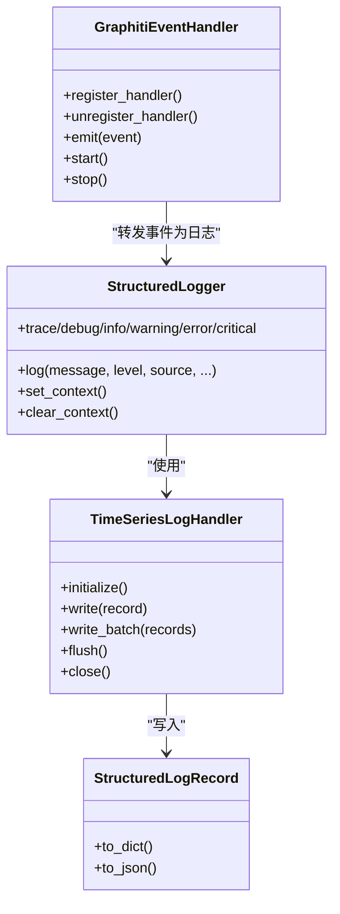
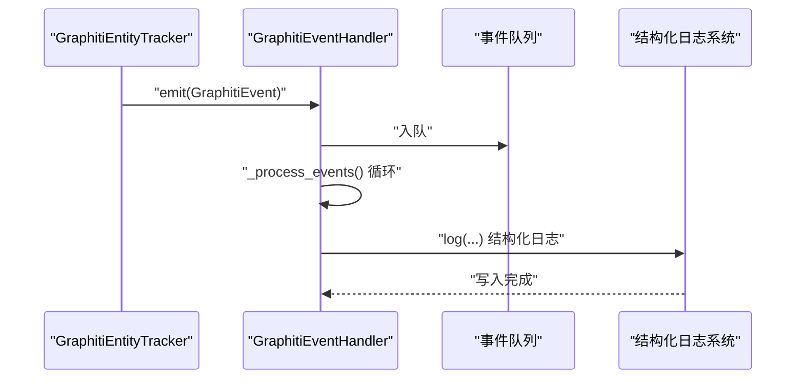
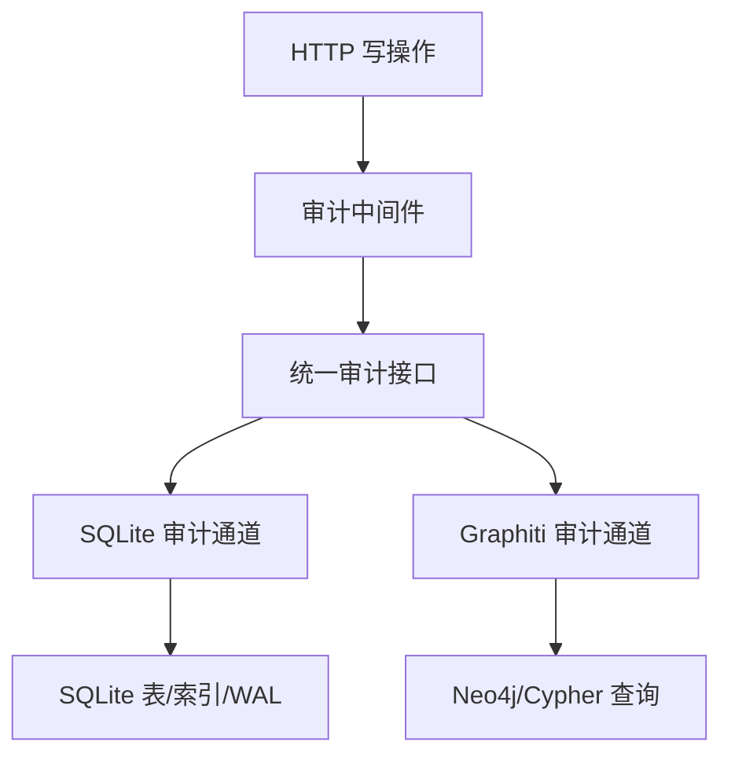
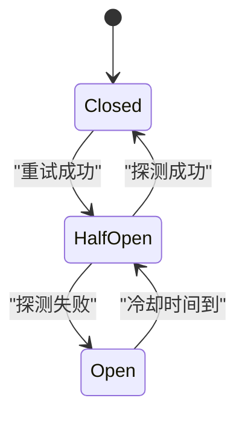
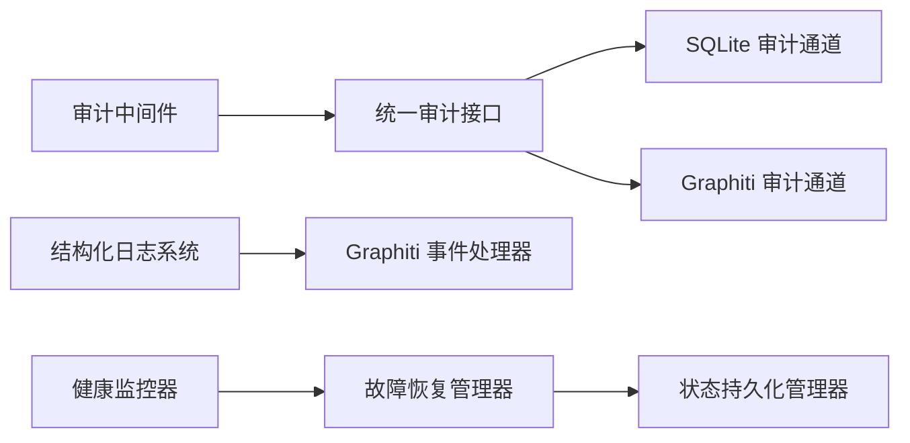

# 监控与日志

<cite>
**本文引用的文件**
- [odap/infra/logging/structured_logging.py](file://odap/infra/logging/structured_logging.py)
- [odap/infra/logging/graphiti_events.py](file://odap/infra/logging/graphiti_events.py)
- [odap/infra/monitoring/performance_monitor.py](file://odap/infra/monitoring/performance_monitor.py)
- [odap/web/app.py](file://odap/web/app.py)
- [odap/infra/security/audit_logger_v2.py](file://odap/infra/security/audit_logger_v2.py)
- [odap/infra/security/unified_audit.py](file://odap/infra/security/unified_audit.py)
- [odap/infra/security/audit_sqlite_channel.py](file://odap/infra/security/audit_sqlite_channel.py)
- [odap/infra/security/audit_graphiti_channel.py](file://odap/infra/security/audit_graphiti_channel.py)
- [odap/infra/resilience/health_monitor.py](file://odap/infra/resilience/health_monitor.py)
- [odap/infra/resilience/fault_tolerance.py](file://odap/infra/resilience/fault_tolerance.py)
- [odap/infra/resilience/state_persistence.py](file://odap/infra/resilience/state_persistence.py)
- [odap/infra/middleware/audit_middleware.py](file://odap/infra/middleware/audit_middleware.py)
- [odap/infra/middleware/exception_handler.py](file://odap/infra/middleware/exception_handler.py)
- [docs/03-modules/audit_log/GRAPHITI_INTEGRATION.md](file://docs/03-modules/audit_log/GRAPHITI_INTEGRATION.md)
- [docs/03-modules/audit_log/DESIGN.md](file://docs/03-modules/audit_log/DESIGN.md)
</cite>

## 目录
1. [简介](#简介)
2. [项目结构](#项目结构)
3. [核心组件](#核心组件)
4. [架构总览](#架构总览)
5. [详细组件分析](#详细组件分析)
6. [依赖关系分析](#依赖关系分析)
7. [性能考量](#性能考量)
8. [故障排查指南](#故障排查指南)
9. [结论](#结论)
10. [附录](#附录)

## 简介
本文件面向 ODAP 平台的监控与日志体系，围绕以下目标展开：
- 性能监控指标设计：响应时间、吞吐量、资源利用率的采集与分析
- 结构化日志记录：日志格式标准化、字段定义、日志级别管理
- Graphiti 事件系统集成：事件捕获、处理、存储的完整流程
- 健康检查机制：服务状态监控、故障检测、自动恢复策略
- 监控仪表板配置：关键指标可视化、告警规则与性能基线
- 实际配置示例与故障排查技巧

## 项目结构
ODAP 将监控与日志能力分布在基础设施层（infra）与业务应用层（web），并通过中间件与审计通道实现全链路可观测性。

**图表来源**
- [odap/web/app.py:244-261](file://odap/web/app.py#L244-L261)
- [odap/infra/monitoring/performance_monitor.py:12-184](file://odap/infra/monitoring/performance_monitor.py#L12-L184)
- [odap/infra/resilience/health_monitor.py:28-216](file://odap/infra/resilience/health_monitor.py#L28-L216)
- [odap/infra/logging/structured_logging.py:287-403](file://odap/infra/logging/structured_logging.py#L287-L403)
- [odap/infra/logging/graphiti_events.py:77-282](file://odap/infra/logging/graphiti_events.py#L77-L282)
- [odap/infra/middleware/audit_middleware.py:51-112](file://odap/infra/middleware/audit_middleware.py#L51-L112)
- [odap/infra/security/unified_audit.py:90-128](file://odap/infra/security/unified_audit.py#L90-L128)
- [odap/infra/security/audit_sqlite_channel.py:36-449](file://odap/infra/security/audit_sqlite_channel.py#L36-L449)
- [odap/infra/security/audit_graphiti_channel.py:274-313](file://odap/infra/security/audit_graphiti_channel.py#L274-L313)
- [odap/infra/resilience/fault_tolerance.py:41-309](file://odap/infra/resilience/fault_tolerance.py#L41-L309)
- [odap/infra/resilience/state_persistence.py:21-187](file://odap/infra/resilience/state_persistence.py#L21-L187)

**章节来源**
- [odap/web/app.py:230-261](file://odap/web/app.py#L230-L261)

## 核心组件
- 性能监控器：采集 LLM 调用、数据库查询、API 请求、工具执行等指标，提供均值、中位数、分位数统计与重置能力。
- 结构化日志系统：统一日志格式，支持时序数据库（InfluxDB/TimescaleDB）写入与内存回退；提供 OpenTelemetry 追踪上下文。
- Graphiti 事件集成：订阅 graphiti-core 事件，转换为结构化日志，支持实体/关系/版本/快照等事件类型。
- 审计日志系统：中间件自动拦截写操作，统一审计接口同时写入 SQLite 与 Graphiti 通道，支持批量、过滤、统计与防篡改校验。
- 健康监控器：周期性检查 Swarm 组件状态与任务数，生成健康报告与告警。
- 故障恢复管理器：断路器、指数退避重试、降级模式、回退策略与自动恢复。
- 状态持久化管理器：Agent 状态与任务检查点的持久化与恢复。

**章节来源**
- [odap/infra/monitoring/performance_monitor.py:12-184](file://odap/infra/monitoring/performance_monitor.py#L12-L184)
- [odap/infra/logging/structured_logging.py:287-403](file://odap/infra/logging/structured_logging.py#L287-L403)
- [odap/infra/logging/graphiti_events.py:77-282](file://odap/infra/logging/graphiti_events.py#L77-L282)
- [odap/infra/middleware/audit_middleware.py:51-112](file://odap/infra/middleware/audit_middleware.py#L51-L112)
- [odap/infra/security/unified_audit.py:90-128](file://odap/infra/security/unified_audit.py#L90-L128)
- [odap/infra/security/audit_sqlite_channel.py:36-449](file://odap/infra/security/audit_sqlite_channel.py#L36-L449)
- [odap/infra/security/audit_graphiti_channel.py:274-313](file://odap/infra/security/audit_graphiti_channel.py#L274-L313)
- [odap/infra/resilience/health_monitor.py:28-216](file://odap/infra/resilience/health_monitor.py#L28-L216)
- [odap/infra/resilience/fault_tolerance.py:41-309](file://odap/infra/resilience/fault_tolerance.py#L41-L309)
- [odap/infra/resilience/state_persistence.py:21-187](file://odap/infra/resilience/state_persistence.py#L21-L187)

## 架构总览
ODAP 的监控与日志架构由“采集—处理—存储—查询—可视化”构成，覆盖请求级（审计中间件）、服务级（性能/健康）、事件级（Graphiti 事件）与审计级（SQLite/Graphiti）。

**图表来源**
- [odap/infra/middleware/audit_middleware.py:51-112](file://odap/infra/middleware/audit_middleware.py#L51-L112)
- [odap/infra/security/unified_audit.py:90-128](file://odap/infra/security/unified_audit.py#L90-L128)
- [odap/infra/security/audit_sqlite_channel.py:108-140](file://odap/infra/security/audit_sqlite_channel.py#L108-L140)
- [odap/infra/security/audit_graphiti_channel.py:274-313](file://odap/infra/security/audit_graphiti_channel.py#L274-L313)
- [odap/infra/logging/structured_logging.py:363-390](file://odap/infra/logging/structured_logging.py#L363-L390)
- [odap/infra/logging/graphiti_events.py:124-158](file://odap/infra/logging/graphiti_events.py#L124-L158)

## 详细组件分析

### 性能监控器（响应时间、吞吐量）
- 设计要点
  - 指标类型：LLM 调用、数据库查询、API 请求、工具执行
  - 采集方式：显式 start/stop 或装饰器自动包裹
  - 统计维度：计数、均值、中位数、最小/最大、P95/P99
  - 重置与导出：支持按指标或全量重置，支持导出原始记录
- 关键接口
  - start/stop：记录耗时并写入队列
  - get_stats/get_all_stats：聚合统计
  - reset/export_metrics：运维与压测支持
- 与应用集成
  - 在 /api/v1/monitoring 暴露性能指标与重置端点

**图表来源**
- [odap/infra/monitoring/performance_monitor.py:30-140](file://odap/infra/monitoring/performance_monitor.py#L30-L140)
- [odap/web/app.py:250-259](file://odap/web/app.py#L250-L259)

**章节来源**
- [odap/infra/monitoring/performance_monitor.py:12-184](file://odap/infra/monitoring/performance_monitor.py#L12-L184)
- [odap/web/app.py:244-261](file://odap/web/app.py#L244-L261)

### 结构化日志系统（格式、级别、时序存储）
- 设计要点
  - 日志级别：trace/debug/info/warning/error/critical
  - 日志来源：graphiti_core/ontology/workspace/agent/decision/audit/system
  - 结构化字段：trace_id/span_id/workspace_id/user_id/entity_id/operation/duration_ms/metadata/error
  - 时序存储：InfluxDB/TimescaleDB 批量写入，内存回退
- 关键接口
  - StructuredLogger.log/debug/info/warning/error/critical
  - TimeSeriesLogHandler.initialize/write/write_batch/flush/close
- 与 Graphiti 事件集成
  - GraphitiEventHandler 将事件转换为结构化日志，携带 trace_id/span_id/workspace_id 等上下文

**图表来源**
- [odap/infra/logging/structured_logging.py:287-403](file://odap/infra/logging/structured_logging.py#L287-L403)
- [odap/infra/logging/graphiti_events.py:77-158](file://odap/infra/logging/graphiti_events.py#L77-L158)

**章节来源**
- [odap/infra/logging/structured_logging.py:18-403](file://odap/infra/logging/structured_logging.py#L18-L403)
- [odap/infra/logging/graphiti_events.py:22-282](file://odap/infra/logging/graphiti_events.py#L22-L282)

### Graphiti 事件系统集成（捕获—处理—存储）
- 事件类型：实体创建/更新/删除、关系创建/更新/删除、快照创建、版本创建、Trix 回收、查询执行
- 处理流程
  - 事件发射：GraphitiEntityTracker 调用事件处理器 emit
  - 异步队列：GraphitiEventHandler 内部队列与工作协程
  - 结构化日志：将事件映射为结构化日志，携带元数据与追踪上下文
- 存储与查询
  - 结构化日志写入时序数据库
  - 审计通道可将事件作为审计日志存储（见审计章节）

**图表来源**
- [odap/infra/logging/graphiti_events.py:160-282](file://odap/infra/logging/graphiti_events.py#L160-L282)
- [odap/infra/logging/structured_logging.py:363-390](file://odap/infra/logging/structured_logging.py#L363-L390)

**章节来源**
- [odap/infra/logging/graphiti_events.py:77-282](file://odap/infra/logging/graphiti_events.py#L77-L282)

### 审计日志系统（自动拦截、统一接口、多通道）
- 自动拦截
  - 审计中间件仅对写操作（POST/PUT/DELETE/PATCH）记录，排除文档、健康检查等路径
  - 从 Authorization 提取用户身份，计算执行耗时，构造审计详情
- 统一接口
  - 统一审计装饰器与便捷方法，记录成功/错误事件，支持批量与查询
  - 同时写入 SQLite 与 Graphiti 通道，满足合规与图分析需求
- SQLite 通道
  - 批量缓冲、WAL 模式、索引优化、防篡改校验链
  - 支持复杂过滤条件与统计
- Graphiti 通道
  - 将审计事件作为本体实体与关系存储，支持 Cypher 查询与时态分析

**图表来源**
- [odap/infra/middleware/audit_middleware.py:51-112](file://odap/infra/middleware/audit_middleware.py#L51-L112)
- [odap/infra/security/unified_audit.py:90-128](file://odap/infra/security/unified_audit.py#L90-L128)
- [odap/infra/security/audit_sqlite_channel.py:36-449](file://odap/infra/security/audit_sqlite_channel.py#L36-L449)
- [odap/infra/security/audit_graphiti_channel.py:274-313](file://odap/infra/security/audit_graphiti_channel.py#L274-L313)

**章节来源**
- [odap/infra/middleware/audit_middleware.py:1-112](file://odap/infra/middleware/audit_middleware.py#L1-L112)
- [odap/infra/security/unified_audit.py:90-128](file://odap/infra/security/unified_audit.py#L90-L128)
- [odap/infra/security/audit_sqlite_channel.py:108-321](file://odap/infra/security/audit_sqlite_channel.py#L108-L321)
- [odap/infra/security/audit_graphiti_channel.py:274-313](file://odap/infra/security/audit_graphiti_channel.py#L274-L313)
- [docs/03-modules/audit_log/GRAPHITI_INTEGRATION.md:27-111](file://docs/03-modules/audit_log/GRAPHITI_INTEGRATION.md#L27-L111)
- [docs/03-modules/audit_log/DESIGN.md:514-613](file://docs/03-modules/audit_log/DESIGN.md#L514-L613)

### 健康检查与故障恢复（状态监控—故障检测—自动恢复）
- 健康监控
  - 周期性检查 Swarm 组件状态与活动任务数
  - 健康评分与阈值告警，生成健康报告与建议
- 故障恢复
  - 断路器：失败次数阈值触发，超时后半开探测
  - 重试策略：指数退避，超过最大重试触发断路器
  - 降级模式：按 Agent 角色进入不同降级能力
  - 回退策略：缓存回退、替代工具、重启 Agent
- 状态持久化
  - Agent 状态与任务检查点持久化，支持恢复与统计

**图表来源**
- [odap/infra/resilience/fault_tolerance.py:236-277](file://odap/infra/resilience/fault_tolerance.py#L236-L277)

**章节来源**
- [odap/infra/resilience/health_monitor.py:78-216](file://odap/infra/resilience/health_monitor.py#L78-L216)
- [odap/infra/resilience/fault_tolerance.py:41-309](file://odap/infra/resilience/fault_tolerance.py#L41-L309)
- [odap/infra/resilience/state_persistence.py:21-187](file://odap/infra/resilience/state_persistence.py#L21-L187)

## 依赖关系分析
- 组件耦合
  - 审计中间件依赖统一审计接口；统一审计接口依赖 SQLite 与 Graphiti 通道
  - 结构化日志系统与 Graphiti 事件处理器解耦，通过事件类型与上下文关联
  - 健康监控器依赖故障恢复管理器与 Swarm 组件状态
- 外部依赖
  - InfluxDB/TimescaleDB 时序数据库（结构化日志）
  - Neo4j（Graphiti 审计通道）
  - JWT 解析（审计中间件用户提取）

**图表来源**
- [odap/infra/middleware/audit_middleware.py:51-112](file://odap/infra/middleware/audit_middleware.py#L51-L112)
- [odap/infra/security/unified_audit.py:90-128](file://odap/infra/security/unified_audit.py#L90-L128)
- [odap/infra/security/audit_sqlite_channel.py:36-449](file://odap/infra/security/audit_sqlite_channel.py#L36-L449)
- [odap/infra/security/audit_graphiti_channel.py:274-313](file://odap/infra/security/audit_graphiti_channel.py#L274-L313)
- [odap/infra/logging/structured_logging.py:287-403](file://odap/infra/logging/structured_logging.py#L287-L403)
- [odap/infra/logging/graphiti_events.py:77-158](file://odap/infra/logging/graphiti_events.py#L77-L158)
- [odap/infra/resilience/health_monitor.py:28-216](file://odap/infra/resilience/health_monitor.py#L28-L216)
- [odap/infra/resilience/fault_tolerance.py:41-309](file://odap/infra/resilience/fault_tolerance.py#L41-L309)
- [odap/infra/resilience/state_persistence.py:21-187](file://odap/infra/resilience/state_persistence.py#L21-L187)

**章节来源**
- [odap/infra/middleware/audit_middleware.py:1-112](file://odap/infra/middleware/audit_middleware.py#L1-L112)
- [odap/infra/security/unified_audit.py:90-128](file://odap/infra/security/unified_audit.py#L90-L128)
- [odap/infra/logging/structured_logging.py:18-403](file://odap/infra/logging/structured_logging.py#L18-L403)
- [odap/infra/resilience/health_monitor.py:28-216](file://odap/infra/resilience/health_monitor.py#L28-L216)

## 性能考量
- 写入延迟
  - 审计通道：异步缓冲 + 批量落盘（SQLite WAL 模式）
  - 结构化日志：批量写入 + 定时刷新，支持 InfluxDB/TimescaleDB
- 查询延迟
  - SQLite：建立多索引，时间范围剪枝
  - Graphiti：Cypher 查询，结合关系与实体索引
- 吞吐量
  - 批量写入 + WAL 模式，满足高并发写入
  - 事件队列与异步处理，避免阻塞主线程
- 可靠性
  - 防篡改校验链（SQLite）
  - Graphiti 哈希链（Graphiti 通道）
- 资源利用率
  - 事件队列容量限制（默认 1000）
  - 指标历史窗口（默认 1000 条）

[本节为通用指导，无需特定文件引用]

## 故障排查指南
- 审计日志无法写入
  - 检查审计中间件是否正确注入，确认路径与方法白名单
  - 核对统一审计接口是否成功调用 SQLite/Graphiti 通道
  - 查看 SQLite 通道缓冲与刷新逻辑，确认 WAL 模式启用
- 结构化日志未入库
  - 确认时序数据库客户端安装与连接参数
  - 检查批量写入与定时刷新逻辑
  - 若 InfluxDB/AsyncPG 未安装，系统回退至内存模式
- Graphiti 事件未记录
  - 确认事件处理器已启动，队列与工作协程正常
  - 检查事件类型与元数据是否正确传递
- 健康监控告警频繁
  - 检查阈值设置与指标历史，确认是否存在瞬时波动
  - 关注断路器状态与降级模式触发情况
- 异常处理
  - 全局异常中间件会统一返回标准化错误响应
  - 重点查看 500 错误堆栈与请求 ID，定位具体问题

**章节来源**
- [odap/infra/middleware/audit_middleware.py:51-112](file://odap/infra/middleware/audit_middleware.py#L51-L112)
- [odap/infra/security/audit_sqlite_channel.py:108-140](file://odap/infra/security/audit_sqlite_channel.py#L108-L140)
- [odap/infra/logging/structured_logging.py:127-285](file://odap/infra/logging/structured_logging.py#L127-L285)
- [odap/infra/logging/graphiti_events.py:105-137](file://odap/infra/logging/graphiti_events.py#L105-L137)
- [odap/infra/resilience/health_monitor.py:140-174](file://odap/infra/resilience/health_monitor.py#L140-L174)
- [odap/infra/middleware/exception_handler.py:14-137](file://odap/infra/middleware/exception_handler.py#L14-L137)

## 结论
ODAP 的监控与日志体系通过“请求级审计中间件 + 服务级性能/健康 + 事件级 Graphiti 集成 + 审计级多通道存储”，构建了覆盖全链路的可观测性能力。配合断路器与降级策略，系统在高负载与异常情况下仍能保持稳定，并通过结构化日志与时序数据库实现高效查询与可视化。

[本节为总结，无需特定文件引用]

## 附录

### 监控仪表板配置指南（概念性）
- 关键指标
  - 响应时间：P50/P95/P99，按服务/端点聚合
  - 吞吐量：每秒请求数（QPS），按方法与路径细分
  - 错误率：HTTP 4xx/5xx 比例，按错误类型统计
  - 资源利用率：CPU/内存/磁盘/网络，结合容器与主机指标
  - 审计事件：按严重级别与事件类型分布，趋势与峰值
  - 健康状态：组件健康评分、告警数量、断路器状态
- 可视化建议
  - 时序折线图：响应时间与错误率趋势
  - 柱状图：事件类型与来源分布
  - 热力图：请求路径与状态码热力
  - 仪表盘：健康评分与关键阈值告警
- 告警规则
  - 响应时间 P95 超过阈值持续 N 分钟
  - 错误率超过阈值
  - QPS 低于阈值（降载保护）
  - 健康评分低于阈值
- 性能基线
  - 基于历史数据设定 P95/P99 基线
  - 结合容量规划与弹性策略调整阈值

[本节为概念性内容，无需特定文件引用]

### 实际监控配置示例（路径指引）
- 性能监控端点
  - 获取指标：GET /api/v1/monitoring/performance
  - 重置指标：POST /api/v1/monitoring/performance/reset
- 健康检查
  - GET /health 返回服务状态与子系统健康信息
- 审计查询
  - SQLite：基于过滤器查询审计事件，支持多字段过滤与分页
  - Graphiti：使用 Cypher 查询审计日志实体与关系
- 结构化日志
  - 初始化时序数据库处理器，配置连接参数
  - 记录日志时设置 trace_id/span_id/workspace_id 等上下文

**章节来源**
- [odap/web/app.py:230-261](file://odap/web/app.py#L230-L261)
- [odap/infra/security/audit_sqlite_channel.py:195-321](file://odap/infra/security/audit_sqlite_channel.py#L195-L321)
- [odap/infra/security/audit_graphiti_channel.py:274-313](file://odap/infra/security/audit_graphiti_channel.py#L274-L313)
- [odap/infra/logging/structured_logging.py:302-314](file://odap/infra/logging/structured_logging.py#L302-L314)